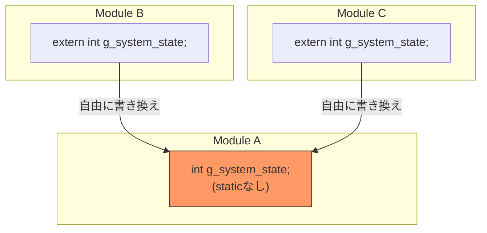
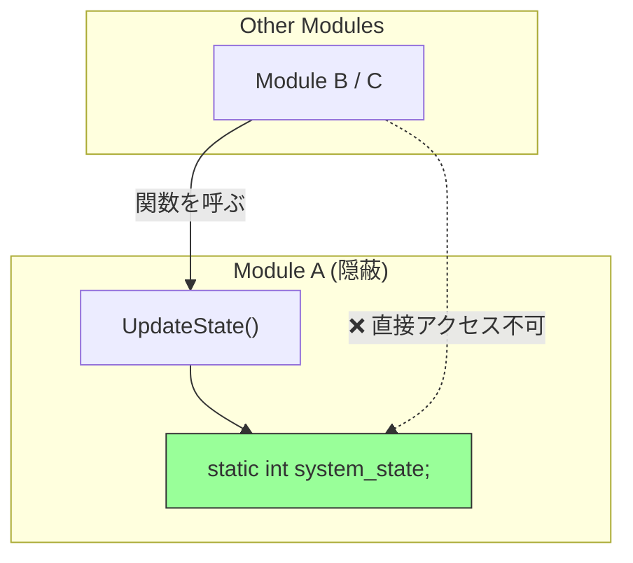
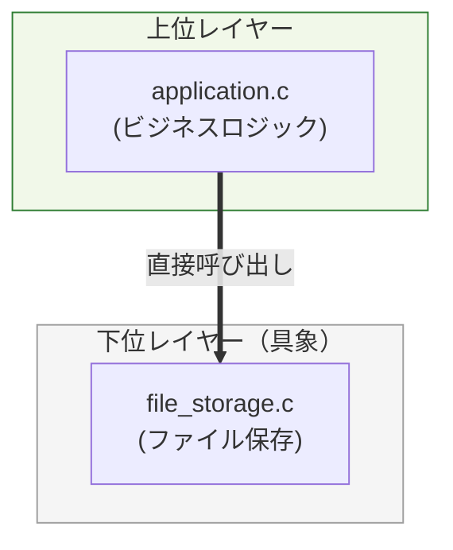
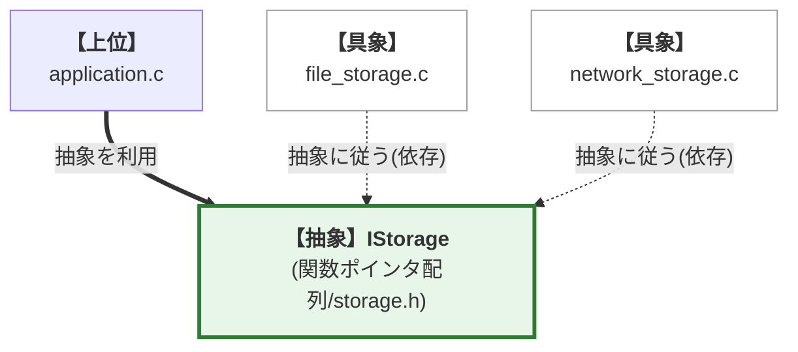
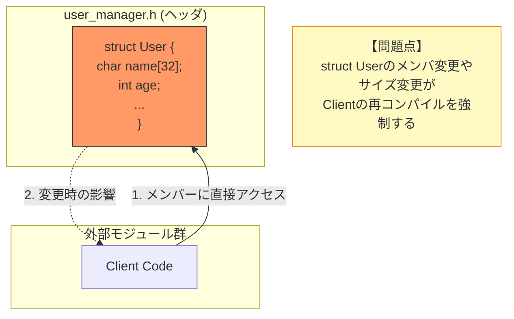
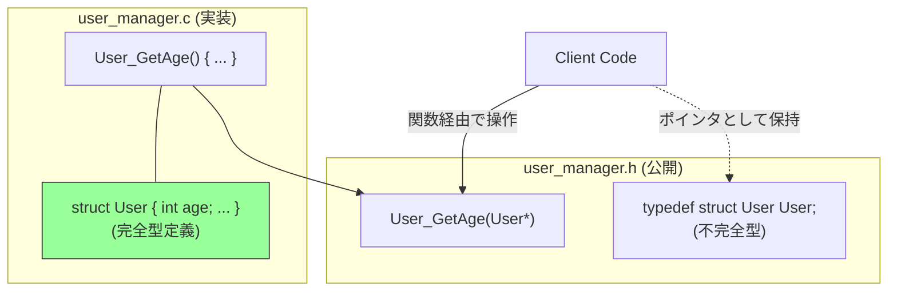

# はじめに 

本書を手に取られた、意欲あるエンジニアの皆様へ。ソフトウェア設計の真髄は、特定のプログラミング言語の機能に依存するものではありません。

しかし、その真髄を深く、純粋に理解し、実践するための言語として、 **C言語** は非常に優れた性質を持っています。

## 1. C言語で設計を学ぶ普遍的な理由

オブジェクト指向言語（Object-Oriented Programming, OOP）では、クラスや継承、カプセル化といった機能が、設計における基本的な **境界線と制約** を言語レベルで提供してくれます。これらは大きな利点ですが、時に設計者が本質的な **設計思想** について深く考える機会を奪ってしまうこともあります。

対してC言語は、こうした制約をほとんど持ちません。ファイルスコープはデフォルトで公開され、グローバル変数へのアクセスは容易で、データ構造も無防備に露出してしまいます。

つまり、意識して設計を行わなければ、容易に **高結合で変更困難なコード** が生まれてしまうのです。

## 2. C言語における典型的な設計課題

C言語で直面する設計の壁を、本書の構成に沿った3つの課題で見ていきましょう。

#### **【課題1: グローバル変数による隠れた依存】（第1章：static）**

#### **課題の概要**

`static`を付けないファイルスコープ変数がどこからでも参照・変更可能になり、バグの追跡が極めて困難になります。

#### 現状（アンチパターン）

あちこちから参照できるグローバル変数は、まるで誰もが自由に出入りできる「共有の広場」のようです。これでは、誰がいつ値を書き換えたのか、追跡することは不可能です。

#### 解決策（staticによるカプセル化）

変数をファイルスコープ内に閉じ込め、その操作を特定の関数（API）のみに限定します。 **staticキーワード（第1章）** を用いて **単一責任原則 (SRP)(第8章)** を実現するのです。こうすることで、変数の公開範囲を限定し、予期せぬ外部からの書き換えを防ぐことができます。

#### **【課題2: 具象実装への直接依存】（第2章：関数ポインタ）**

#### **課題の概要**

上位モジュールが下位の具体的実装に直接依存しているため、新しい保存手段を追加するたびに上位コードの修正が必要になります。

#### 現状（アンチパターン）

`application.c` が `file_storage.c` にべったり依存しており、ネットワーク保存を追加しようとすると既存のアプリケーションコードを修正する必要があります。

#### 解決策（依存性逆転原則：DIP）

インターフェース（抽象）を間に挟みます。具象モジュールが抽象に依存するように「矢印の向きを逆転」させます。 **関数ポインタ / VTable（第2章）** を用いて **開放閉鎖原則 (OCP)(第9章)** ／ **依存性逆転原則 (DIP)(第12章)** を実現します。抽象（インターフェース）に依存させることで、既存コードを一切修正することなく機能追加が可能になります。

#### **【課題3: データ構造の露出】（第4章：不完全型）**

#### **課題の概要**

構造体の詳細がヘッダで公開されているため、実装詳細への依存（密結合）が発生し、軽微な変更でも全モジュールの再コンパイルが必要になります。

#### 現状（アンチパターン）

外部から中身が「丸見え」の状態であるため、利用側がメンバ変数に直接依存してしまい、構造体の変更に対する影響範囲が最大化してしまいます。

#### 解決策（不透明な構造体）

ヘッダには「型があること」だけを宣言（不完全型）し、実体はソースファイル内に隠蔽します。これにより、クライアントはポインタ（不透明ポインタ）としてのみデータを扱い、内部構造への依存を断ち切ることができます。 **不完全型（不透明な構造体）(第4章)** を採用することで **単一責任原則 (SRP)(第8章)** ／ **インターフェース分離原則 (ISP)(第11章)** を実現します。内部構造を完全に隠蔽し、ヘッダ間の依存関係を最小限に抑えるのです。

## 3. 本書が提供する思考のフレームワーク

本書は、単なるC言語の文法書でも、設計原則の抽象論でもありません。本書の目的は、C言語の特定の機能（道具）がいかにしてSOLID原則という抽象的な概念を実現し、 **保守性、拡張性、堅牢性、信頼性** といった具体的な「価値」を達成するか、その論理的な三層構造を解き明かすことにあります。

この構造を理解し適用することで、読者の皆様は「どう書くか」だけでなく、「なぜそう設計すべきか」という本質的な問いへの答えを見出すことができるはずです。

#### 設計思想を構成する三本柱
| 軸 | 制御範囲 | 目的と主要原則 |
| --- | --- | --- |
| **1. 責任 (Responsibility)** | 内部 | カプセル化、凝集度、**SRP（単一責任原則）** |
| **2. 契約 (Contract)** | 境界 | 抽象化、交換可能性、**LSP（リスコフ置換原則）** / **ISP（インターフェース分離原則）** |
| **3. 依存 (Dependency)** | 関係 | 拡張性、疎結合、**DIP（依存性逆転原則）** / **OCP（開放閉鎖原則）** |

#### SOLID原則とは

SOLID原則は、ソフトウェア設計の品質を高めるための5つの基本原則の頭文字を取ったものです。

* **S (SRP):** 単一責任原則 (Single Responsibility Principle)
* **O (OCP):** 開放閉鎖原則 (Open/Closed Principle)
* **L (LSP):** リスコフ置換原則 (Liskov Substitution Principle)
* **I (ISP):** インターフェース分離原則 (Interface Segregation Principle)
* **D (DIP):** 依存性逆転原則 (Dependency Inversion Principle) 

これらは、ソフトウェアを「変更に強く」「理解しやすく」「再利用可能」にするための普遍的な指針です。

本書の第2部では、これらの原則をC言語でどのように実践するかを詳しく解説します。我々が追求する設計の普遍性は、以下の三つの論理的な軸を通じて具体化されます。

これらの三本柱は、モジュールの**内部**、**境界**、**関係**をそれぞれ制御します。

#### 1. 責任 (Responsibility)

 **モジュールの内部 と原則**: データの隠蔽（カプセル化）と凝集度を高め、変更の理由を一つに絞る（ **SRP：単一責任原則** ）。「変更の影響を最小限に留める」ための守りの設計。

#### 2. 契約 (Contract)

 **モジュールの境界 と原則**: 外部に対する利用ルールを厳密に定義し、詳細を隠蔽することで、実装を差し替えても利用側に影響を与えない「交換可能性」や、不必要な依存を押し付けない設計を保証する（ **LSP：リスコフ置換原則** / **ISP（インターフェース分離原則）** ）。実装の差し替えを可能にし、「呼び出し側を壊さない」ための約束事。

#### 3. 依存 (Dependency)

 **モジュール間の関係 と原則**: 具体的な実装ではなく抽象に依存させることで、変更の影響範囲を限定し、疎結合と拡張性を実現する（ **DIP：依存性逆転原則** / **OCP：開放閉鎖原則** ）。「既存コードに手を加えずに機能を追加できる」状態を作り出す、攻めの設計。

#### 道具・指針・価値の具体的な関係（三層構造）

本書の論理的な三層構造は、「**技術（道具）** → **原則（指針）** → **目的（価値）**」という流れで構成されます。本書では特に、以下の価値を重視します。

#### **技術（道具）** `static` キーワード

 **単一責任原則 (SRP) （指針）** → **保守性・堅牢性（価値）** （変更の影響範囲を局所化し、予期せぬ状態破壊を防ぐ）。

#### **技術（道具）** 不完全型（不透明な構造体）

 **単一責任原則 (SRP) / インターフェース分離原則 (ISP) （指針）** → **変更容易性・可読性（価値）** （内部構造を隠蔽し、読むべき情報を公開APIのみに限定する）。

#### **技術（道具）** 関数ポインタ / VTable

 **依存性逆転原則 (DIP) / 開放閉鎖原則 (OCP) / リスコフ置換原則 (LSP) （指針）** → **拡張性・移植性・信頼性（価値）** （既存コードを壊さずに機能追加を可能にし、インターフェースの遵守により動作を保証する）。

## 4. 本書の構成と論理的連携

本書は、C言語の機能と設計原則の相互参照を通じて、読者の思考を構造化します。

#### 究極のゴール: 変更に強く、信頼されるソフトウェアの構築

我々がC言語の「道具」を学び、SOLID原則という「指針」を適用する究極の目的は、以下の価値を実現することにあります。

#### **保守性 (Maintainability) と 可読性 (Readability)**

 **保守性**: バグ修正や機能追加、プラットフォームへの適応など、ソフトウェアを変更する際の容易さを指します。 **可読性**: コードが「何をしているか」だけでなく「なぜそうしているか」、そして「誰が責任を持つか」が明確であること。

高い可読性は保守性の前提条件となります。

#### **拡張性 (Extensibility) と 移植性 (Portability)**

 **拡張性**: 既存のコードを破壊することなく、新しい機能を追加できる能力。OCP（開放閉鎖原則）によって実現されます。

 **移植性**: 特定のハードウェアやOSに依存せず、異なる環境でも動作する能力。抽象化層（不透明ポインタなど）によって実現されます。

#### **堅牢性 (Robustness) と 信頼性 (Reliability)**

 **堅牢性**: 予期せぬ入力や異常な状況下でもシステムがクラッシュせず、適切に振る舞う能力。厳密なエラーハンドリング（契約）が鍵となります。

 **信頼性**: システムが長期間にわたり、意図した機能を正確に遂行し続ける能力。`static`による状態保護などが寄与します。

道具（技術）や指針（原則）はあくまで、これらの価値を達成するための手段であることを常に意識してください。

#### 第1部：基礎道具編 — C言語で「原則」を実現する技術（第1章〜第7章）

C言語の機能を単なる文法としてではなく、設計原則を実現するための具体的な道具として解説します。この道具を使いこなすことが、堅牢な設計を物理的に構築する基礎となります。

第1章では `static` を扱い、モジュールの「責任」の明確化を、続く章では「契約」と「依存」を制御するための道具を順番に学びます。

#### 第2部：SOLID原則と統合実践編（第8章〜第15章）

「道具」を使いこなすための設計思想（SOLID）と、それを実際のコードに適用する実践技法を解説します。**（第8章〜第12章）**: SRP（単一責任の原則）からDIP（依存性逆転の原則）まで、各原則をC言語の実装に落とし込む過程を詳述します。

**（第13章〜第15章）**: Simple Processorのリファクタリングから始まり、複雑な実務課題への対処、そしてSOLID原則を無意識の思考ツールとして定着させる方法まで、知識を知恵に変えるためのプロセスを学びます。本書を通じ、C言語による設計の面白さ、そしてその論理的な厳密さを深く味わい、変更に強い、論理的に破綻しないソフトウェアを構築できるスキルを獲得してください。

## 本章で必ず理解してほしいことのまとめ

#### 普遍的な設計力を獲得する意義

#### 1. **C言語の特異な立ち位置を理解する**:

C言語はOOP言語と異なり、設計上の制約をほとんど持ちません。この自由さが、設計を意識しなければ高結合で変更困難なコードを容易に生み出します。

真の設計力とは、制約のないC言語の環境で、`static`や不完全型といった道具を使い、自ら論理的な制約を構築する能力であると言えます。

#### 2. **本書の論理的な三層構造を認識する**:

本書は「C言語の特定機能（道具）」が、「SOLID原則（指針）」を実現し、「保守性・拡張性・堅牢性といった価値」を達成するという三層構造に基づいています。この関係性を念頭に置くことで、より深く、体系的な理解が得られるはずです。

#### 3. **設計思想を構成する三本柱を覚える**:

設計の普遍性を実現するための三つの軸、「責任 (Responsibility)」「契約 (Contract)」「依存 (Dependency)」が、本書の議論全体を支える中心テーマとなります。それぞれの軸が、モジュールの内部、境界、関係を制御するものであると理解してください。

#### 次章への橋渡し

この後の「第1部：基礎道具編」では、これらの三本柱を実現するためのC言語の具体的な機能（道具）について学びます。`static`キーワードによる情報の隠蔽、関数ポインタによる動的な振る舞いの切り替え、そして不透明ポインタによる完全なカプセル化など、C言語特有の強力な武器を手に入れましょう。
