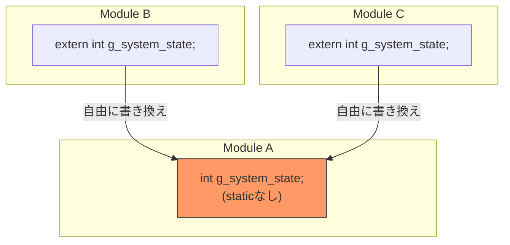
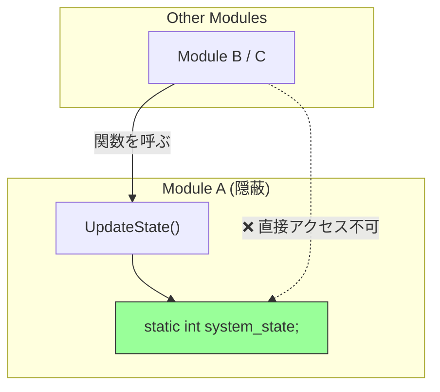
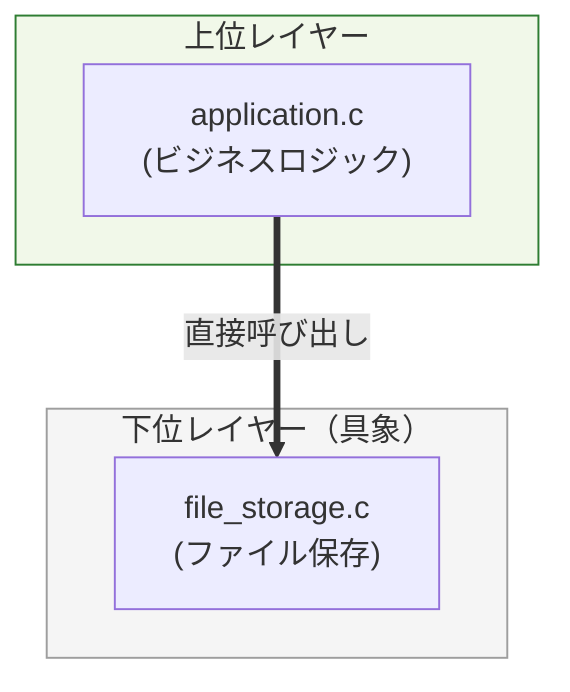
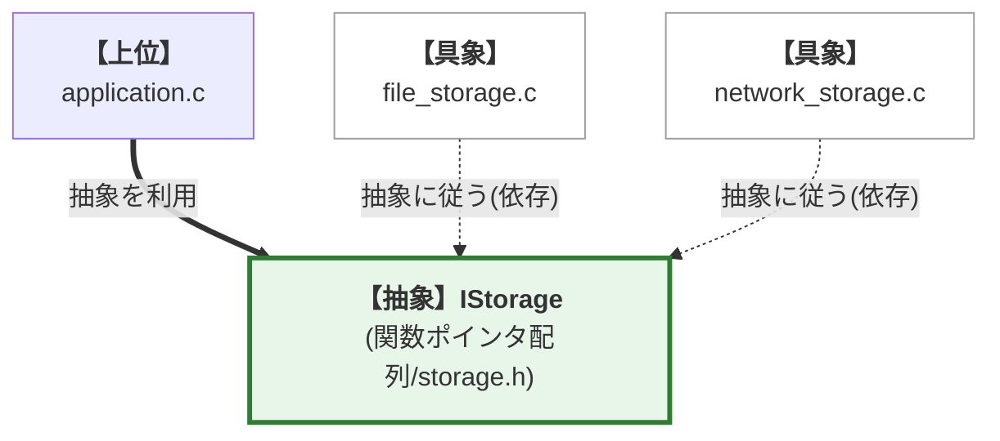
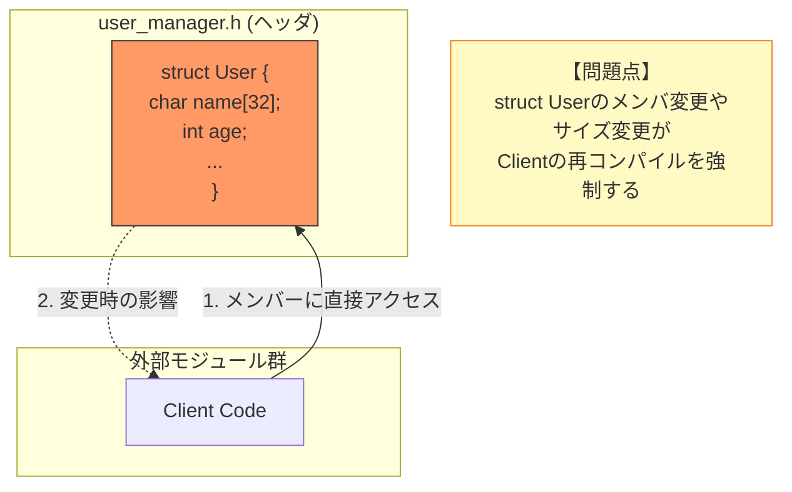
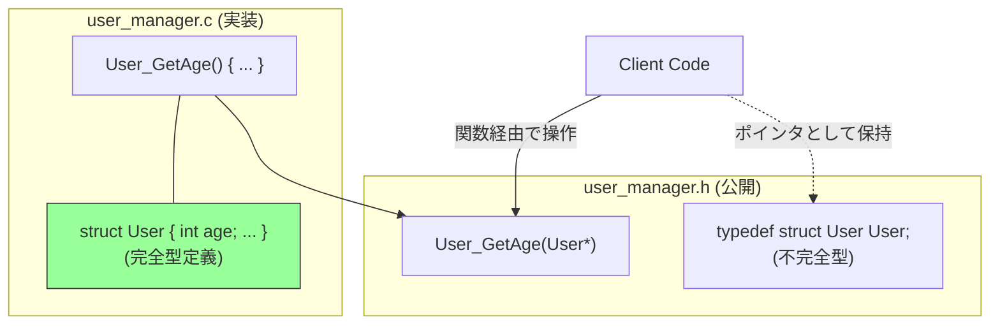

# はじめに 

本書を手に取られた、意欲あるエンジニアの皆様へ。ソフトウェア設計の真髄は、特定のプログラミング言語の機能に依存するものではありません。

しかし、その真髄を深く、純粋に理解し、実践するための言語として、 **C言語** は非常に優れた性質を持っています。

## 1. C言語で設計を学ぶ普遍的な理由

オブジェクト指向言語（Object-Oriented Programming, OOP）では、クラスや継承、カプセル化といった機能が、設計における基本的な **境界線と制約** を言語レベルで提供してくれます。これらは大きな利点ですが、時に設計者が本質的な **設計思想** について深く考える機会を奪ってしまうこともあります。

対してC言語は、こうした制約をほとんど持ちません。ファイルスコープはデフォルトで公開され、グローバル変数へのアクセスは容易で、データ構造も無防備に露出してしまいます。

つまり、意識して設計を行わなければ、容易に **高結合で変更困難なコード** が生まれてしまうのです。

## 2. C言語における典型的な設計課題

C言語で直面する設計の壁を、本書の構成に沿った3つの課題で見ていきましょう。これらは多くのプロジェクトで頻出する問題であり、本書が解決しようとするテーマそのものです。

### **【課題1: グローバル変数による隠れた依存】（第1章：static）**

#### **課題の概要**
`static`を付けないファイルスコープ変数は、プログラムのどこからでも参照・変更が可能になってしまいます。これは、バグが発生した際に「誰がその値を壊したのか」を追跡することを極めて困難にします。

#### 現状（アンチパターン）
あちこちから参照できるグローバル変数は、まるで誰もが自由に出入りできる「共有の広場」のようです。これでは、変数の値がいつ、誰によって書き換えられたのか、その履歴を管理することは不可能です。

#### 解決策（staticによるカプセル化）
この問題を解決するために、変数をファイルスコープ内に閉じ込め、その操作を特定の関数（API）のみに限定します。具体的には、**staticキーワード（第1章）** を用いて変数の可視範囲を制限し、**単一責任原則 (SRP)(第8章)** を適用します。こうすることで、予期せぬ外部からの書き換えを防ぎ、状態管理の責任を一つのモジュールに集中させることができます。

### **【課題2: 具象実装への直接依存】（第2章：関数ポインタ）**

#### **課題の概要**
上位のモジュールが、下位の具体的な実装モジュールに直接依存している状態です。例えば、アプリケーションが「ファイル保存機能」という特定の実装を直接呼び出していると、後に「ネットワーク保存機能」を追加したくなった際、上位のアプリケーションコード自体を修正しなければなりません。

#### 現状（アンチパターン）
`application.c` が `file_storage.c` にべったりと依存しているため、保存先の変更や追加が容易ではありません。拡張性が著しく損なわれている状態です。

#### 解決策（依存性逆転原則：DIP）
インターフェース（抽象）を間に挟むことで、この問題を解決します。具体的には、**関数ポインタ / VTable（第2章）** を用いて抽象的な「保存機能」を定義し、具象モジュールがその抽象に従うように依存の矢印を逆転させます。これにより、**開放閉鎖原則 (OCP)(第9章)** および **依存性逆転原則 (DIP)(第12章)** が実現され、既存コードを一切修正することなく、新しい機能を追加することが可能になります。

### **【課題3: データ構造の露出】（第4章：不完全型）**

#### **課題の概要**
構造体の詳細がヘッダファイルで公開されていると、利用側のコードがその内部構造（メンバ変数やサイズ）に依存してしまいます。これにより、構造体に軽微な変更を加えただけでも、それを利用する全モジュールの再コンパイルが必要になるという「密結合」が発生します。

#### 現状（アンチパターン）
外部から中身が「丸見え」の状態であるため、利用者がメンバ変数に直接アクセスしてしまいがちです。これはカプセル化を破壊し、変更に対する影響範囲を最大化させてしまいます。

#### 解決策（不透明な構造体）
ヘッダファイルには「その型が存在すること」だけを宣言（不完全型）し、実体はソースファイル内に隠蔽します。これにより、クライアントはポインタ（不透明ポインタ）としてのみデータを扱い、内部構造への依存を断ち切ることができます。**不完全型（不透明な構造体）(第4章)** を採用することで、**単一責任原則 (SRP)(第8章)** や **インターフェース分離原則 (ISP)(第11章)** を満たし、ヘッダ間の依存関係を最小限に抑えることができます。

## 3. 本書が提供する思考のフレームワーク

本書は、単なるC言語の文法書でも、設計原則の抽象論でもありません。本書の目的は、C言語の特定の機能（道具）がいかにしてSOLID原則という抽象的な概念を実現し、**保守性、拡張性、堅牢性、信頼性** といった具体的な「価値」を達成するか、その論理的な三層構造を解き明かすことにあります。

この構造を理解し適用することで、読者の皆様は「どう書くか」だけでなく、「なぜそう設計すべきか」という本質的な問いへの答えを見出すことができるはずです。

#### 設計思想を構成する三本柱

本書では、設計を支える要素を以下の三つの軸で整理します。

| 軸 | 制御範囲 | 目的と主要原則 |
| --- | --- | --- |
| **1. 責任 (Responsibility)** | 内部 | カプセル化、凝集度、**SRP（単一責任原則）** |
| **2. 契約 (Contract)** | 境界 | 抽象化、交換可能性、**LSP（リスコフ置換原則）** / **ISP（インターフェース分離原則）** |
| **3. 依存 (Dependency)** | 関係 | 拡張性、疎結合、**DIP（依存性逆転原則）** / **OCP（開放閉鎖原則）** |

#### SOLID原則とは

SOLID原則は、ソフトウェア設計の品質を高めるための5つの基本原則の頭文字を取ったものです。これらは一見難解に見えるかもしれませんが、ソフトウェアを「変更に強く」「理解しやすく」「再利用可能」にするための普遍的な指針です。

* **S (SRP):** 単一責任原則 (Single Responsibility Principle)
* **O (OCP):** 開放閉鎖原則 (Open/Closed Principle)
* **L (LSP):** リスコフ置換原則 (Liskov Substitution Principle)
* **I (ISP):** インターフェース分離原則 (Interface Segregation Principle)
* **D (DIP):** 依存性逆転原則 (Dependency Inversion Principle) 

本書の第2部では、これらの原則をC言語でどのように実践するかを詳しく解説します。我々が追求する設計の普遍性は、以下の三つの論理的な軸を通じて具体化されます。

#### 1. 責任 (Responsibility)
モジュールの **内部** を統制する原則です。データの隠蔽（カプセル化）を徹底し、凝集度を高めることで、変更の理由を一つに絞ります（**SRP：単一責任原則**）。これは、予期せぬ変更の波及を防ぐ、いわば「守りの設計」です。

#### 2. 契約 (Contract)
モジュールの **境界** を定義する原則です。外部に対する利用ルールを厳密に定め、詳細を隠蔽することで、実装を差し替えても利用側に影響を与えない「交換可能性」や、不必要な依存を押し付けない設計を保証します（**LSP：リスコフ置換原則** / **ISP：インターフェース分離原則**）。これは、「呼び出し側を壊さない」ための約束事と言えます。

#### 3. 依存 (Dependency)
モジュール間の **関係** を制御する原則です。具体的な実装ではなく「抽象」に依存させることで、変更の影響範囲を限定し、疎結合と拡張性を実現します（**DIP：依存性逆転原則** / **OCP：開放閉鎖原則**）。既存コードに手を加えずに機能を追加できる、「攻めの設計」を可能にします。

#### 道具・指針・価値の具体的な関係（三層構造）

本書の論理的な三層構造は、「**技術（道具）** → **原則（指針）** → **目的（価値）**」という流れで構成されます。道具は原則を実現し、原則は価値を創出します。

*   **技術（道具）：static キーワード**
    この技術は **単一責任原則 (SRP)** を強力に推進します。その結果、**保守性・堅牢性** が向上し、システムは変更に対して強くなります。

*   **技術（道具）：不完全型（不透明な構造体）**
    この技術は **単一責任原則 (SRP)** および **インターフェース分離原則 (ISP)** の基盤となります。これにより **変更容易性・可読性** が高まり、長期的なメンテナンスが容易になります。

*   **技術（道具）：関数ポインタ / VTable**
    この技術は **依存性逆転原則 (DIP)** 、 **開放閉鎖原則 (OCP)** 、そして **リスコフ置換原則 (LSP)** を物理的に可能にします。これにより、システムは高い **拡張性・移植性・信頼性** を獲得します。

## 4. 本書の構成と論理的連携

本書は、C言語の機能と設計原則の相互参照を通じて、読者の思考を構造化します。

#### 究極のゴール: 変更に強く、信頼されるソフトウェアの構築

我々がC言語の「道具」を学び、SOLID原則という「指針」を適用する究極の目的は、ビジネスや開発現場で求められる以下の具体的な価値を実現することに他なりません。

*   **保守性 (Maintainability) と 可読性 (Readability)**
    バグ修正や機能追加、プラットフォームへの適応など、ソフトウェアを変更する際の容易さは、高い可読性によって支えられています。コードが「何をしているか」だけでなく「なぜそうしているか」、そして「誰が責任を持つか」が明確であることが不可欠です。

*   **拡張性 (Extensibility) と 移植性 (Portability)**
    OCP（開放閉鎖原則）を適用することで、既存のコードを破壊することなく新しい機能を追加できる **拡張性** が手に入ります。また、不透明ポインタなどの抽象化層を用いることで、特定の環境に依存しない **移植性** も実現できます。

*   **堅牢性 (Robustness) と 信頼性 (Reliability)**
    厳密なエラーハンドリング（契約）により、異常な状況下でも適切に振る舞う **堅牢性** が生まれます。また、`static`による状態保護などが、長期間にわたり意図した機能を正確に遂行し続ける **信頼性** を支えます。

道具（技術）や指針（原則）はあくまで、これらの価値を達成するための手段であることを常に意識してください。

#### 第1部：基礎道具編 — C言語で「原則」を実現する技術（第1章〜第7章）
C言語の機能を単なる文法としてではなく、設計原則を実現するための具体的な道具として解説します。この道具を使いこなすことが、堅牢な設計を物理的に構築する基礎となります。
第1章では `static` を扱い、モジュールの「責任」の明確化を、続く章では「契約」と「依存」を制御するための道具を順番に学びます。

#### 第2部：SOLID原則と統合実践編（第8章〜第15章）
「道具」を使いこなすための設計思想（SOLID）と、それを実際のコードに適用する実践技法を解説します。
**（第8章〜第12章）**: SRP（単一責任の原則）からDIP（依存性逆転の原則）まで、各原則をC言語の実装に落とし込む過程を詳述します。
**（第13章〜第15章）**: Simple Processorのリファクタリングから始まり、複雑な実務課題への対処、そしてSOLID原則を無意識の思考ツールとして定着させる方法まで、知識を知恵に変えるためのプロセスを学びます。本書を通じ、C言語による設計の面白さ、そしてその論理的な厳密さを深く味わい、変更に強い、論理的に破綻しないソフトウェアを構築できるスキルを獲得してください。

## 本章で必ず理解してほしいことのまとめ

#### 普遍的な設計力を獲得する意義

#### 1. **C言語の特異な立ち位置を理解する**
C言語はOOP言語と異なり、設計上の制約をほとんど持ちません。この自由さが、設計を意識しなければ高結合で変更困難なコードを容易に生み出します。
真の設計力とは、制約のないC言語の環境で、`static`や不完全型といった道具を使い、自ら論理的な制約を構築する能力であると言えます。

#### 2. **本書の論理的な三層構造を認識する**
本書は「C言語の特定機能（道具）」が、「SOLID原則（指針）」を実現し、「保守性・拡張性・堅牢性といった価値」を達成するという三層構造に基づいています。この関係性を念頭に置くことで、より深く、体系的な理解が得られるはずです。

#### 3. **設計思想を構成する三本柱を覚える**
設計の普遍性を実現するための三つの軸、「責任 (Responsibility)」「契約 (Contract)」「依存 (Dependency)」が、本書の議論全体を支える中心テーマとなります。それぞれの軸が、モジュールの内部、境界、関係を制御するものであると理解してください。

#### 次章への橋渡し
この後の「第1部：基礎道具編」では、これらの三本柱を実現するためのC言語の具体的な機能（道具）について学びます。`static`キーワードによる情報の隠蔽、関数ポインタによる動的な振る舞いの切り替え、そして不透明ポインタによる完全なカプセル化など、C言語特有の強力な武器を手に入れましょう。
