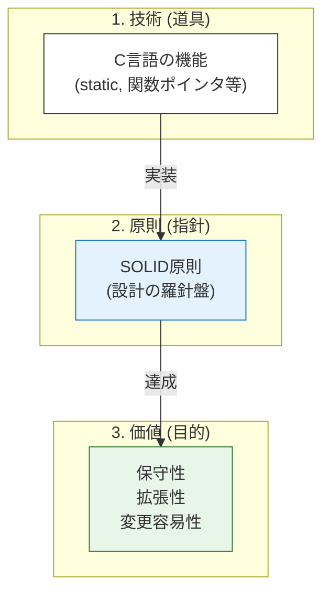

# 第1部 導入：基礎道具編の目的と学習ロードマップ

本書の**第1部「基礎道具編」** へようこそ。

本章では、**C言語**という低水準の「道具」を、いかにして普遍的な設計原則を実現するための手段へと昇華させるか、そのロードマップを提示します。

## 1. 基礎道具編の位置づけ：設計思想の物理的実現

**C言語**は、特定の設計パターンを言語仕様として強制しません。そのため、高水準言語に見られるような自動的なカプセル化やポリモーフィズムは存在せず、設計者が意図的かつ体系的にそれらを構築する必要があります。

この**第1部**の目的は、**C言語**の持つ特性を最大限に活かし、後の**第2部**で詳述する**SOLID原則**という「指針」を物理的に実現するための「道具（技術）」を定義し、その設計上の意図を深く理解することにあります。

### **技術（道具）の習得**

**C言語**の機能（`static`、関数ポインタ、不完全型など）を、単なる文法としてではなく、結合度を下げる、変更の影響範囲を限定するといった具体的な設計上のメリット（目的）を達成するための手段として捉えます。

### **普遍性の担保**

ここで習得する技術は、組み込み環境やOSカーネルのような極めて厳密な環境においても通用する、低レベルで堅牢な設計基盤を築きます。

### **低レベルで堅牢な設計基盤とは？**

それは、特定のOSやライブラリに依存せず、**C言語の基本機能**のみを用いて、意図的な依存の切断、情報隠蔽、契約の明確化を徹底することで、将来の変更に対して極めて高い耐性を持つコードの土台です。単にコードが動くことではなく、「なぜこのコードが変更に強いのか」という設計上の論拠を明確にすることが、本編の最大の焦点となります。

### 2. 本書の構造における「技術・原則・目的」の対応

本書は、設計を以下の三層構造で捉えます。**第1部**で扱う「技術」は、この構造の最下層に位置し、他の層を支える土台です。

| 階層 | 内容 | 本書の対応 | 役割 |
| --- | --- | --- | --- |
| **3. 価値（目的）** | **保守性、拡張性、変更容易性** | **全体** | 究極の目標 |
| **2. 原則（指針）** | **SOLID原則**など | **第2部（原則パート）** | 設計の抽象的な羅針盤 |
| **1. 技術（道具）** | **C言語の機能とパターン** | **第1部：基礎道具編** | 原則を物理的に実装する手段 |

第1部では、この「技術」が、いかにして第2部で学ぶ「原則」を達成し、最終的な **「目的」**へと繋がるのかという、論理的な流れを常に意識しながら学習を進めます。

もちろん、保守性、拡張性、変更容易性といった価値は、すべての原則が目指す共通のゴールです。しかし、学習の指針として、各技術が**どの原則を経由して、特にどの側面の価値に強く寄与するか**という「主要な経路」を理解することは、設計の意図を掴む上で有効です。

具体的な対応の代表例は以下の通りです。

* **例1**: **`static`キーワード**（技術：1章） → **単一責任原則 (SRP)**（原則：8章） → **保守性**の向上（目的）
* **例2**: **関数ポインタ/VTable**（技術：2章） → **開放閉鎖原則 (OCP)**（原則：9章） → **拡張性**の実現（目的）
* **例3**: **不完全型**（技術：4章） → **インターフェース分離原則 (ISP)**（原則：11章） → **変更容易性**の向上（目的）

### 3. 「責任・契約・依存」のフレームワークと第1部の技術

モジュールの設計とは、内側（責任）、外側（契約）、そして関係（依存）という3つの視点から、論理的な境界線を引く作業だと言えます。これらの三本柱はバラバラに存在するのではなく、**お互いに影響し合いながら並行して形作られていくもの**です。
たとえば、責任を明確にすると契約（外部との約束）が安定し、契約が安定すれば不要な依存が減り、その結果として個々の責任がより研ぎ澄まされる——。このような「設計のサイクル」を意識することが、心地よい設計への近道となります。

**第1部**の各章で学ぶ技術は、この三本柱のいずれか、**あるいは複数**を物理的に実現するための手段です。

### 設計の三本柱：視点と目的

| 軸 | 視点 | 達成する設計上の目的 |
| --- | --- | --- |
| **責任 (Responsibility)** | **内**の視点 | モジュールの凝集度を高め、変更の理由を一つに絞る。 |
| **契約 (Contract)** | **外**の視点 | インターフェースの安定性と実装の隠蔽を保証する。 |
| **依存 (Dependency)** | **関係**の視点 | 変更の影響範囲を限定し、疎結合を実現する。 |

### 第1部の技術と三本柱の対応関係

設計において重要な認識は、**各技術には核となる目的（◎）があり、それが他の軸へポジティブに連鎖する**という点です。以下の表は、各技術がどの軸を起点とし、どのように相互作用するかを示しています。

| 技術（章） | 責任 | 契約 | 依存 | 相互作用の説明（◎からの連鎖） |
| --- | --- | --- | --- | --- |
| **static**（1章） | ◎ | - | - | 内部実装を隠蔽する（責任）ことで、物理的に外部参照を遮断し、不必要な依存を根絶する。 |
| **関数ポインタ**（2章） | - | - | ◎ | 具体的な実装への直接参照を断ち、実行時の動的結合を可能にする（依存）。この柔軟性を制御するために、抽象的な約束（契約）が必要になる。 |
| **構造体設計**（3章） | ◎ | - | - | データと操作を論理的に統合する（責任）。この自己完結性が、将来的な安定した境界（契約）を築くための基盤となる。 |
| **不完全型**（4章） | - | ◎ | - | 型情報を隠蔽し強固な境界を確立する（契約）。これにより、利用側のコードから物理的な型サイズや内部構造への依存を完全に切断する（依存）。 |
| **ヘッダ設計**（5章） | - | ◎ | - | 公開APIを最小限に定義する（契約）。これにより、不要なインクルードの連鎖（依存）を最小化し、ビルドの独立性を高める。 |
| **エラー処理**（6章） | - | ◎ | - | 異常系の振る舞いを明確に定義する（契約）。この約束により、誰が対処すべきかという役割（責任）がコードレベルで確定する。 |
| **メモリ管理**（7章） | ◎ | - | - | リソース所有権を特定モジュールに封じ込める（責任）。これが、利用側に対する安全な寿命の約束（契約）を成立させる。 |

**凡例**: ◎ = その技術が直接的に解決しようとする設計上の核となる軸

このフレームワークは、C言語のコードを読む際、あるいは設計する際に、「このコードは三本柱のどこを補強しようとしているのか」という設計意図を読み解くための強力な思考ツールとなります。

### 三本柱がもたらす設計の変化

### 責任で部品を分離する

まず、システムを「責任」という単位で切り分けます。それぞれのモジュールが「何をする存在なのか」を明確にするのです。ユーザー情報を管理する責任、データを保存する責任、通知を送る責任――こうして責任ごとにソースファイル（モジュール）を分離すると、各部品の役割が驚くほど明瞭になります。

### 責任同士が連携して機能を実現する

孤立したモジュールでは何も成し遂げられません。複数の責任が協力し合うことで、初めて価値ある機能が生まれます。重要なのは、この連携の仕方です。

### 連携には契約を結ぶ

モジュール同士が連携する際、そこには「契約」が必要です。「この関数を呼べば、こういう結果が返ってくる」「この構造体ポインタを渡せば処理される」という約束事。この契約（ヘッダファイルでの宣言）を明示的にすることで、それぞれのモジュールは相手の内部実装（`.c`ファイルの中身）を知らなくても協力できるようになります。

### 抽象的に契約し、依存を軽くする

ここが設計の妙です。契約を具体的な実装関数そのものではなく、関数ポインタや不完全型といった「抽象」に対して結ぶのです。すると、具体的な実装への依存が消え、システム全体が柔軟になります。ファイル保存からネットワーク保存へ切り替える、ドライバを変更する――そんな変更が驚くほど容易になるのです。

### 依存は最小限に

モジュール間の`#include`依存関係が多ければ多いほど、変更の影響は広がります。だからこそ、依存は必要最小限に抑えます。本当に必要な契約だけを結び、不要な結びつきは断つ。これが保守性の高いシステムの秘訣です。

### 契約を尊重し、信頼を築く

抽象（インターフェース）と具体（実装）の間に結ばれた契約は、システムの安定を支える基盤です。第2部で触れる「リスコフ置換原則」が示すように、具体的な実装関数が抽象の約束を忠実に守ることで、呼び出し側は内部を気にせず安心してコードを利用できます。この信頼関係こそが、システム全体の予測可能性を支えるのです。

### 変更に強い構造という報酬

これらの軸（責任・契約・依存）に従って設計されたシステムは、まるで生き物のように変化に適応します。新しい要件が来ても、影響を受けるのは一部の部品だけ。テストも書きやすく、不具合も見つけやすい。そして何より、数ヶ月後に自分のコードを見返したとき、その意図がすぐに理解できるのです。

責任・依存・契約――たった3つの概念が、あなたのソフトウェア設計を次のレベルへと引き上げます。

### 三本柱の相互作用を意識する

実際の設計では、これら三つの視点を**並行的に、行き来しながら**考えます：

* ユースケースから**責任**を抽出する
* その責任を実現するための**契約**（インターフェース）を定義する
* その契約が不必要な**依存**を生んでいないかチェックする
* 依存を減らすために責任を見直す...

このサイクルを繰り返すことで、三本柱すべてが強化され、保守性・拡張性・変更容易性の高い設計が生まれます。各技術が複数の軸に貢献することを理解することで、**第2部**で学ぶSOLID原則が、これらの技術をどのように組み合わせて使うべきかの指針を与えてくれることが明確になります。

### 4. 学習ロードマップ：螺旋的な技術習得

「基礎道具編」の各章は、**責任・契約・依存という3つの軸を螺旋的に行き来**しながら、段階的に理解を深めていく構成になっています。一度に1つの概念を完結させるのではなく、**各章で異なる角度から設計の全体像に触れる**ことで、モジュール設計の本質を立体的に理解できるよう設計されています。

### 重要な前提：技術は複数の軸に貢献し、軸は相互に作用する

本書で学ぶC言語の技術の多くは、**単一の軸に収まるものではありません**。また、責任・契約・依存という三本柱も、独立した概念ではなく**相互に影響し合います**。

### 技術が複数の軸に貢献する例

* **static**は、主に内部実装を隠蔽する（責任）技術ですが、同時に外部からのアクセスを断つ（依存）効果もあります
* **不完全型**は、主にモジュール境界を定義する（契約）技術ですが、同時にコンパイル時の型依存を切断（依存）します
* **ヘッダ設計**は、主に公開APIを定義する（契約）技術ですが、同時にインクルード依存を最小化（依存）します

### 三本柱の相互作用

設計では、これらの軸を**並行的に考え、行き来する**必要があります：

* **責任**を明確にすると → **契約**（公開API）が自然と絞り込まれる
* **契約**が明確になると → 不必要な**依存**が減る
* **依存**が減ると → 各モジュールの**責任**がさらに明確になる

各章では、その技術の**主な学習焦点**となる軸を中心に解説しますが、実際には複数の軸に同時に貢献し、軸同士も相互作用していることを意識してください。これにより、後の章で「なぜこの技術とあの技術が連携するのか」が自然に理解できるようになります。

### 学習の流れ：3つの軸を往還する

この構成は、以下の3段階で設計の理解を深めます：

**【第1段階：基礎接触】第1-2章** まず「隠蔽（責任）」と「柔軟性（依存）」という対照的な概念に触れることで、設計の両極を早い段階で体感します。これにより、以降の学習で「なぜこの技術が必要なのか」という動機が明確になります。

**【第2段階：深化と展開】第3-6章** 第3章で責任の軸に戻り、第2章で学んだ関数ポインタが構造体設計とどう結びつくかを理解します。続く第4-6章では契約の軸に集中し、モジュールの「境界」を多角的に学びます（型隠蔽→公開API→異常処理）。

**【第3段階：統合】第7章** 最終章のメモリ管理は、これまでの全ての概念を統合した「責任の集大成」となります。static（第1章）による隠蔽、構造体（第3章）による統合、不完全型（第4章）によるカプセル化、ヘッダ（第5章）による公開範囲の定義、エラー処理（第6章）による異常系の扱い——これら全てが「誰がリソースを管理するのか」という責任の問題に収束します。

### **第1章 `static`キーワード - 情報隠蔽による依存の切断と実装の自由**

* **前提知識**：C言語のスコープ
* **学習後にできるようになること**：グローバル変数を排除し、モジュールの責任内での内部状態を安全に管理する。
* **学習の焦点（核となる軸）**：**責任**
* **焦点となる設計上の意図**：内部実装を隠蔽することで、モジュールが自身の状態に全責任を持つ構造を作る。

### **第2章 関数ポインタと間接呼び出し - 動的結合の実現**

* **前提知識**：C言語のポインタ
* **学習後にできるようになること**：ポリモーフィズムの基礎をC言語で構築する。
* **学習の焦点（核となる軸）**：**依存**
* **焦点となる設計上の意図**：実行時の依存関係を切り替える柔軟性を確保し、呼び出し側と実装側の結合を解く。

> **注記**：この章では「依存」の制御に主眼を置きますが、ここで学ぶ動的結合の手法は、次章以降の構造体設計や不完全型と組み合わさることで、真の柔軟性を発揮します。まずは「動的結合の可能性」を予告として体験してください。

### **第3章 構造体設計とコンポジション - データと責任の統合**

* **前提知識**：構造体の基本
* **学習後にできるようになること**：データとその操作ロジックを統合し、凝集度を高める。
* **学習の焦点（核となる軸）**：**責任**
* **焦点となる設計上の意図**：データの性質（単なる値の集合か、識別子を持つ実体か）に応じた役割を明確化し、変更理由が単一な「責任の単位」を構築する。

> **注記**：本章では、C言語における「オブジェクト指向的なアプローチ」の基礎について触れます。特に、データを「値（Value）」として扱うべきか、固有の「実体（Entity）」として扱うべきかという区別は、責任の所在を決める上で重要な指針となります。

### **第4章 不完全型と不透明ポインタ - 型情報の隠蔽による契約のカプセル化**

* **前提知識**：ポインタ、ヘッダファイル
* **学習後にできるようになること**：構造体の内部実装を外部から完全に隠蔽する。
* **学習の焦点（核となる軸）**：**契約**
* **焦点となる設計上の意図**：型情報を隠蔽して強固な境界を確立し、外部との「約束事」だけを公開する。

### **第5章 モジュール構成とヘッダ設計 - 最小限の契約公開と依存の最小化**

* **前提知識**：プリプロセッサ
* **学習後にできるようになること**：モジュールのヘッダファイルを安定性の観点から設計する。
* **学習の焦点（核となる軸）**：**契約**
* **焦点となる設計上の意図**：最小限の公開APIを定義することで、内部変更が外部に漏れない安定した境界を作る。

### **第6章 エラーハンドリングパターン - 堅牢な契約**

* **前提知識**：C言語のエラーコード
* **学習後にできるようになること**：エラー処理を設計の契約として明確に定義し、呼び出し側が安心して利用できる保証を与える。
* **学習の焦点（核となる軸）**：**契約**
* **焦点となる設計上の意図**：正常系・異常系を含めた振る舞いを明確に定義し、モジュール間の境界線を確定させる。

### **第7章 メモリ管理パターン - 責任の明確化**

* **前提知識**：C言語のメモリ確保/解放
* **学習後にできるようになること**：リソースの所有権と解放の責務を単一モジュールに集中させる。
* **学習の焦点（核となる軸）**：**責任**
* **焦点となる設計上の意図**：リソースの寿命を管理する責任の所在を明確にし、メモリリークを構造的に防ぐ。

> **注記**：第7章は第1部全体の集大成です。これまでに学んだ「隠蔽」「統合」「境界の確立」といった全ての技術を総動員し、C言語設計における最大の難所である「リソースの寿命管理」という責任の問題を解決します。

### 章と設計の三本柱の関係（まとめ）

| 章 | 技術テーマ | 寄与する核となる軸 | 相互作用の要点（◎からの波及） |
| --- | --- | --- | --- |
| 第1章 | static | **責任** | 内部の隠蔽（責任）が、結果として外部からの不要な参照（依存）を断つ。 |
| 第2章 | 関数ポインタ | **依存** | 具体的な型や関数への依存を抽象へ転換する（依存）。柔軟性を担保するため、抽象的な約束（契約）が必要になる。 |
| 第3章 | 構造体設計 | **責任** | データと操作を統合（責任）し、将来的な契約や依存の制御を可能にする土台を作る。 |
| 第4章 | 不完全型 | **契約** | 構造体の「中身」を隠蔽して境界を引く（契約）。結果として、利用側からの構造的依存を排除する。 |
| 第5章 | ヘッダ設計 | **契約** | 公開インターフェースを最小化（契約）することで、ビルド時のインクルード依存を抑制する。 |
| 第6章 | エラー処理 | **契約** | 振る舞いの定義（契約）により、異常時に対処すべき役割（責任）の所在を確定させる。 |
| 第7章 | メモリ管理 | **責任** | 所有権の確立（責任）により、安全なリソース寿命の約束（契約）を保証する。 |

各章では、理論の解説に加え、具体的なC言語コードを提供し、その技術がどのようにして保守性、拡張性、変更容易性という目的に貢献するのかを、リファクタリングの視点を交えながら体感していただきます。

この**第1部**を修了することで、読者は抽象的な設計原則を**C言語コード**に落とし込むための、具体的で強力な「道具」を手に入れることになります。この準備が整った後、**第2部**でこれらの道具を最大限に活用するための「指針」、すなわち**SOLID原則**の学習へと進みます。

## 本章で必ず理解してほしいことのまとめ

### 基礎道具編の学習目的と設計思想

### 1. **C言語の機能を設計の道具として捉える**:

* C言語の`static`、関数ポインタ、不完全型などは、単なる文法事項ではありません。これらを、結合度を下げたり、変更の影響範囲を限定したりするための「具体的な設計道具」として捉え直すことが、本書の第一歩となります。

### 2. **設計を三層構造で理解する**:

* 本書の全ての議論は、最下層の「技術（道具）」が、中間層の「原則（指針）」を実現し、最終目的である「保守性、拡張性、変更容易性（価値）」を達成するという、この論理的な三層構造に基づいています。

### 3. **設計の三本柱と技術の関係を把握する**:

* モジュール設計の三つの普遍的な軸「責任 (Responsibility)」「契約 (Contract)」「依存 (Dependency)」が、それぞれモジュールの内部、境界、関係を制御しています。
* **第1部**で学ぶ技術（道具）は、これらの三本柱のいずれか、あるいは**複数**を物理的に実現するための手段であることを、具体的なコードを通して学習します。

### 4. **三本柱は相互作用することを理解する**:

* 責任・契約・依存は独立した概念ではなく、相互に影響し合います。実際の設計では、これらを並行的に考え、一つを改善すると他も自然と改善されるサイクルを意識することが重要です。例えば、責任を明確にすると契約が安定し、契約が明確になると依存が減り、依存が減ると責任がさらに明確になります。

### 5. **技術は複数の軸に貢献することを理解する**:

* 多くの技術は単一の軸に収まるものではなく、複数の設計目標に同時に貢献します。各章では主な学習焦点を設定していますが、その技術が他の軸にどう貢献するかも意識することで、後の章での技術の組み合わせが自然に理解できるようになります。

### 次章への橋渡し

本書の論理的構造をより深く理解するために、次の章では、具体的な「道具」である**第1章 `static`キーワード**が、いかにして「責任の明確化」と「依存の切断」という設計上の目的を達成するのかを詳細に解説します。