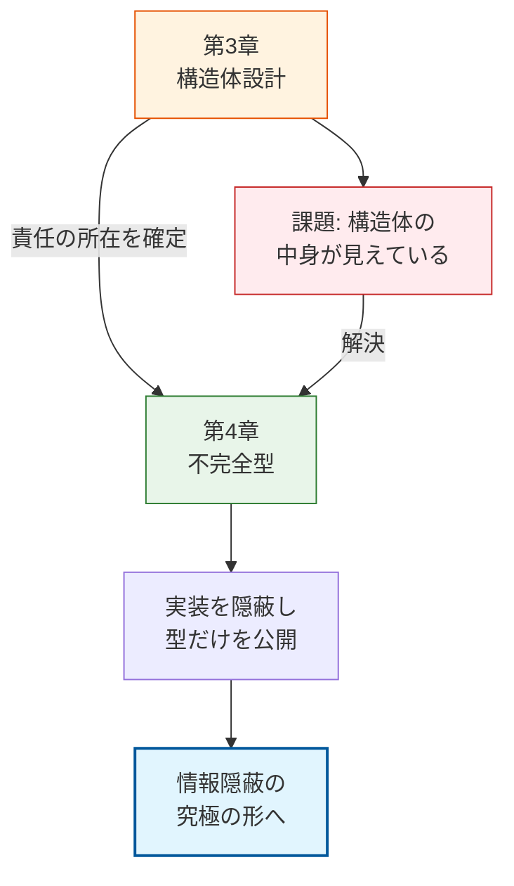

### 2.4. 活用パターン 4: タグ付き共用体による型安全性

### システム概要

**目的**: 複数の異なるデータ型（円、長方形など）を、一つの「図形」型として統一的に扱いたい。
**機能**:

1. 図形の種類に応じた初期化
2. 図形の種類に応じた面積計算（ポリモーフィズム）
**アーキテクチャ**: `enum`（タグ）と `union`（共用体）を組み合わせたデータ構造。

### 設計の意図

継承のないC言語で「多態的なデータ」を扱うための定石です。ポインタキャストによる無理やりな型変換は危険ですが、タグ付き共用体を使えば、「今何が入っているか」を構造体自身が知っているため、安全にアクセスできます。

### クラス図（タグ付き共用体）

**この図が示すもの**:
Shapeクラスが、自身の種類を示すタグ（ShapeType）と、実際のデータ領域（union）を内包している構造です。

**注目ポイント**:

* **排他性**: CircleData と RectData は `union` で共有されているため、同時にはどちらか一方しか存在できません。タグがその「どちらか」を決定します。

**読み方のガイド**:

* ShapeがTypeとDataの両方を持っていることを確認してください。


### shape.h

タグ付き共用体の定義です。
**処理の内容:** `ShapeType` 列挙型で「種類」を定義し、`Shape` 構造体の中で `union` を使ってデータを重ね合わせています。
**設計的意図:** 異なる構造を持つデータ（円、長方形）を一つの型として扱うための工夫です。これにより、配列にまとめたり、関数の引数として一元化したりできます（ポリモーフィズムのデータ表現）。
**評価:** メモリ効率が良く、C言語における多態性実現の標準的な手法です。

#### shape.h
```c
#ifndef SHAPE_H
#define SHAPE_H

typedef enum {
    SHAPE_CIRCLE,
    SHAPE_RECTANGLE
} ShapeType;

// 各形状の固有データ
typedef struct {
    int radius;
} Circle;

typedef struct {
    int width;
    int height;
} Rectangle;

// タグ付き共用体: 自身の種類（タグ）とデータ（共用体）をセットで持つ
typedef struct {
    ShapeType type; // データの種類を識別するタグ
    union {
        Circle circle;
        Rectangle rect;
    } u; // データを共有する共用体
} Shape;

// 形状に応じた面積計算（多態的な振る舞い）
int shape_area(const Shape* s);

#endif // SHAPE_H
```

### shape.c
タグに基づいた多態的な振る舞いの実装です。
**処理の内容:** `switch` 文を使って `s->type` を判定し、適切な計算式を実行しています。
**設計的意図:** オブジェクト指向言語であれば仮想関数（vtable）が自動的に行ってくれる「ディスパッチ（振り分け）」を、手動で実装している形になります。
**評価:** 構造はシンプルですが、新しい図形を追加するたびに `switch` 文を修正する必要があるため、OCP（開放閉鎖原則）の観点からは注意が必要です。

#### shape.c
```c
#include "shape.h"
#include <stdio.h>

int shape_area(const Shape* s)
{
    // タグ(type)に基づいて、正しい共用体メンバにアクセスする
    switch (s->type) {
        case SHAPE_CIRCLE:
            // 円の面積: π * r * r (簡易的に3で計算)
            return 3 * s->u.circle.radius * s->u.circle.radius;
            
        case SHAPE_RECTANGLE:
            // 長方形の面積: width * height
            return s->u.rect.width * s->u.rect.height;
            
        default:
            printf("[Error] Unknown shape type!\n");
            return 0;
    }
}
```

### main.c
タグ付き共用体の利用例です。
**処理の内容:** 同じ `Shape` 型の変数に対して、タグと値をセットし、共通関数 `shape_area` を呼び出しています。
**設計的意図:** 利用側はデータ構造の詳細を知っている必要があります（メンバ `u.circle` などに直接アクセスしているため）。これはカプセル化が弱い状態ですが、データ構造体（DTO: Data Transfer Object）としては機能します。
**評価:** データの中身を直接触る必要がある場面では有効ですが、変更への耐性を高めるには次章以降のテクニック（不完全型）との組み合わせが推奨されます。

#### main.c
```c
#include "shape.h"
#include <stdio.h>

int main(void)
{
    // 円として初期化
    Shape s1;
    s1.type = SHAPE_CIRCLE;
    s1.u.circle.radius = 10;
    
    // 長方形として初期化
    Shape s2;
    s2.type = SHAPE_RECTANGLE;
    s2.u.rect.width = 5;
    s2.u.rect.height = 8;
    
    printf("Circle Area: %d\n", shape_area(&s1));
    printf("Rect Area: %d\n", shape_area(&s2));
    
    return 0;
}
```

### 実行結果

型（タグ）に応じた正しい面積計算が行われていることがわかります。

#### 実行結果
```c
Circle Area: 300
Rect Area: 40
```

## 本章で必ず理解してほしいことのまとめ

### 1. 構造体の役割の明確化

### **Value Object**:

* 値の保持に責任を持ち、**不変性**を志向する
* 副作用を防ぎ**一貫性の保証**に貢献する
* 値渡しで扱い、変更時は新しいインスタンスを返す

### **Entity Object**:

* ライフサイクル管理に責任を持つ
* `malloc`/`free`のロジックを内部に閉じ込め、メモリ管理を抽象化する
* `create`/`destroy`の対となる関数で責任を明確化

### 2. コンポジションと所有権

* コンポジションにより部品を組み合わせて大きなEntityを構築
* **所有権**に基づきリソース解放の責任を単一化
* 値ベース、所有ポインタ、非所有ポインタの3パターンを理解

### 3. 型安全なデータ構造

* タグ付き共用体により、実行時の型安全性を確保
* `enum`タグで現在有効な値を明示
* 誤ったメンバーへのアクセスを構造的に防止

### 次章への橋渡し

本章では、構造体を分類・設計することで、モジュールの**責任**を明確にする手法を学びました。しかし、これだけではまだ不十分です。なぜなら、ヘッダファイルに構造体の定義を書いている限り、利用者はその内部（メンバ）を直接覗き、依存することができてしまうからです。

これは「責任を分けたつもりでも、中身が透けて見えている」という非常に不安定な状態です。

次章の **「第4章 不完全型と不透明ポインタ」**では、構造体の定義を公開ヘッダから完全に消し去り、モジュール間の **「契約」**を物理的に強制するための決定的な技術を学びます。

### 設計の進化プロセス

**この図が示すもの**:
構造体設計（第3章）から不完全型（第4章）への学習の流れと、解決される課題です。

**注目ポイント**:

* **課題**: 構造体の定義が見えていることによる依存の問題。
* **解決**: 不完全型による「究極のカプセル化」。

**読み方のガイド**:
* 左（第3章）から右（第4章）への進化。



第4章では、不完全型を用いることで以下の「設計的進化」を遂げます：

1. **カプセル化の完遂**：構造体のメンバを`.c`ファイルに閉じ込め、外部からの直接アクセスを物理的に遮断する。
2. **依存の切断**：内部構造の変更（メンバの追加や順序変更）が、利用側の再コンパイルを必要としない「ABI互換性」の基礎を作る。
3. **契約の純粋化**：利用者が「データ（中身）」ではなく、「API（振る舞い）」のみに依存する堅牢な関係を構築する。

本章で定義したEntity Objectを、外部から一切中身の見えない「不透明なオブジェクト」へと昇華させ、真に堅牢なモジュール境界を確立しましょう。