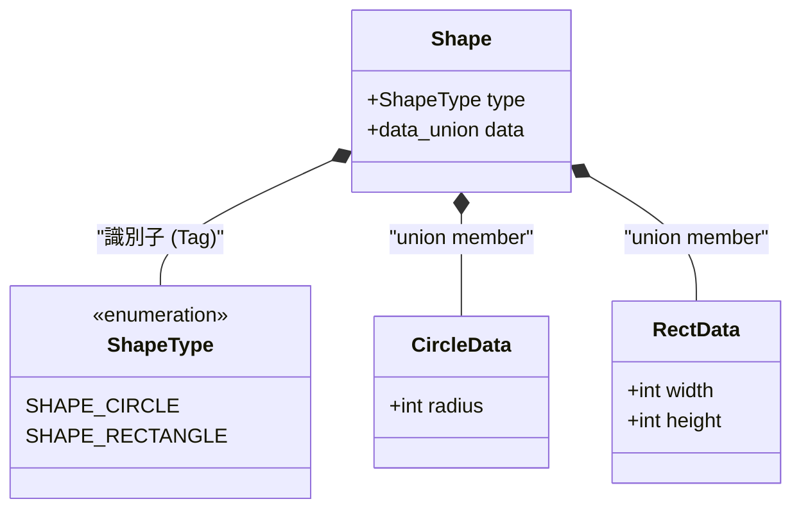
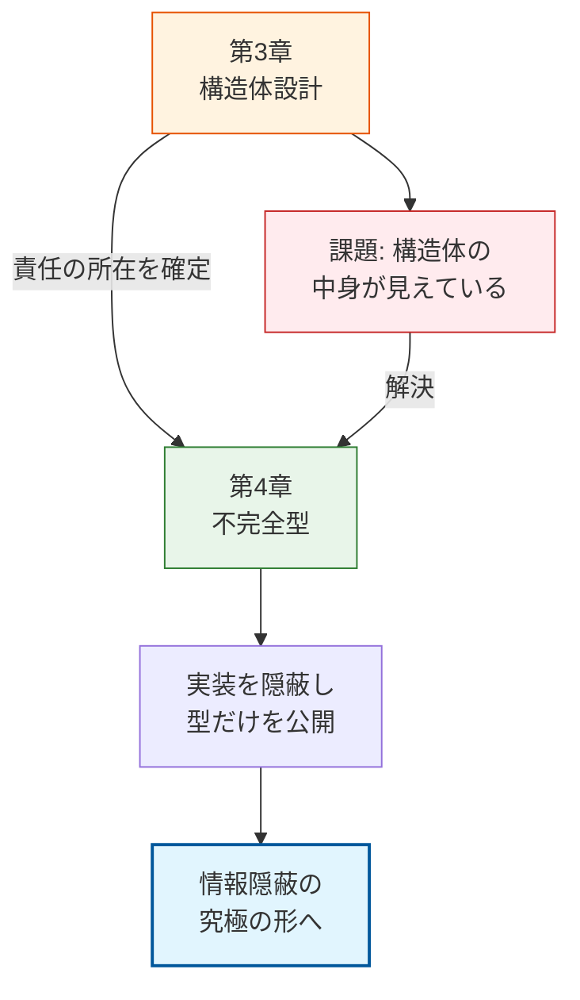

### 2.4. 活用パターン 4: タグ付き共用体による型安全性

#### システム概要

複数の異なるデータ型（円、長方形など）を、一つの「図形」型として統一的に扱いたいケースです。

*   **図形の種類に応じた初期化**
*   **図形の種類に応じた面積計算（ポリモーフィズム）**
*   **`enum`（タグ）と `union`（共用体）を組み合わせたデータ構造**　

#### 設計課題

純粋なオブジェクト指向言語を持たないC言語において、「円」や「長方形」などの異なるデータ構造を1つの配列にまとめたり、同じ関数で処理したりする（多態性・ポリモーフィズム）のは至難の業です。これを強引に実現しようとして `void*` ポインタでデータを引き渡し、呼び出し側で元の型にキャスト（変換）する実装がよく見られます。しかしこの方法では、もし円のデータが入っているのに長方形としてキャストしてしまった場合、コンパイラは何も警告してくれず、実行時にシステムが致命的なクラッシュを起こします（型安全性の喪失）。

#### 設計の意図

この危険な `void*` ポインタを避けるための定石が、`enum`（種類を示すタグ）と `union`（データを格納する共用体）を組み合わせた「タグ付き共用体（Tagged Union）」です。この設計にすることで、「今、何が入っているか」を構造体自身が自覚している状態を作り出せます。利用側は必ずタグを確認してから共用体にアクセスするため、安全かつ統一的なデータ構造として扱うことができます。

#### クラス図（タグ付き共用体）

Shapeクラスが、自身の種類を示すタグ（ShapeType）と、実際のデータ領域（union）を内包している構造です。 `CircleData` と `RectData` は `union` で共有されているため、同時にはどちらか一方しか存在できません（ **排他性** ）。

タグがその「どちらか」を決定します。ShapeがTypeとDataの両方を持っていることを確認してください。

※C言語にクラス図という概念はありませんが、構造体と関数をクラスに見立てて設計する際の考え方として、UMLクラス図を借用しています。



#### タグ付き共用体による型定義

タグ付き共用体の定義です。`ShapeType` 列挙型で「種類」を定義し、`Shape` 構造体の中で `union` を使ってデータを重ね合わせています。

異なる構造を持つデータ（円、長方形）を一つの型として扱うための工夫です。これにより、配列にまとめたり、関数の引数として一元化したりできます（ポリモーフィズムのデータ表現）。メモリ効率が良く、C言語における多態性実現の標準的な手法です。

#### shape.h
```c
#ifndef SHAPE_H
#define SHAPE_H

typedef enum {
    SHAPE_CIRCLE,
    SHAPE_RECTANGLE
} ShapeType;

// 各形状の固有データ
typedef struct {
    int radius;
} CircleData;

typedef struct {
    int width;
    int height;
} RectData;

// タグ付き共用体: 自身の種類（タグ）とデータ（共用体）をセットで持つ
typedef struct {
    ShapeType type; // データの種類を識別するタグ
    union {
        CircleData circle;
        RectData rect;
    } u; // データを共有する共用体
} Shape;

// 形状に応じた面積計算（多態的な振る舞い）
int shape_area(const Shape* s);
#endif // SHAPE_H
```

#### タグに基づく多態的な振る舞いの実装（switch文）

タグに基づいた多態的な振る舞いの実装です。`switch` 文を使って `s->type` を判定し、適切な計算式を実行しています。

オブジェクト指向言語であれば仮想関数（vtable）が自動的に行ってくれる「ディスパッチ（振り分け）」を、手動で実装している形になります。構造はシンプルですが、新しい図形を追加するたびに `switch` 文を修正する必要があるため、OCP（開放閉鎖原則）の観点からは注意が必要です。

#### shape.c
```c
#include "shape.h"
#include <stdio.h>

int shape_area(const Shape* s)
{
    // タグ(type)に基づいて、正しい共用体メンバにアクセスする
    switch (s->type) {
        case SHAPE_CIRCLE:
            // 円の面積: π * r * r (簡易的に3で計算)
            return 3 * s->u.circle.radius * s->u.circle.radius;

        case SHAPE_RECTANGLE:
            // 長方形の面積: width * height
            return s->u.rect.width * s->u.rect.height;

        default:
            printf("[Error] Unknown shape type!\n");

            return 0;
    }
}
```

#### 異なるデータを共通の型として扱う利用例

タグ付き共用体の利用例です。同じ `Shape` 型の変数に対して、タグと値をセットし、共通関数 `shape_area` を呼び出しています。

利用側はデータ構造の詳細を知っている必要があります（メンバ `u.circle` などに直接アクセスしているため）。これはカプセル化が弱い状態ですが、データ構造体（DTO: Data Transfer Object）としては機能します。データの中身を直接触る必要がある場面では有効ですが、変更への耐性を高めるには次章以降のテクニック（不完全型）との組み合わせが推奨されます。

#### main.c
```c
#include "shape.h"
#include <stdio.h>

int main(void)
{
    // 円として初期化
    Shape s1;
    s1.type = SHAPE_CIRCLE;
    s1.u.circle.radius = 10;

    // 長方形として初期化
    Shape s2;
    s2.type = SHAPE_RECTANGLE;
    s2.u.rect.width = 5;
    s2.u.rect.height = 8;

    printf("Circle Area: %d\n", shape_area(&s1));
    printf("Rect Area: %d\n", shape_area(&s2));

    return 0;
}
```

#### 型情報に基づく動的計算の実行結果

型（タグ）に応じた正しい面積計算が行われていることが確認できます。

#### 実行結果
```c
Circle Area: 300
Rect Area: 40
```

## 3. 設計判断と落とし穴のまとめ

#### 1. 構造体の「肥大化（God Object）」
* **落とし穴**: 関連性の低いデータや状態を1つの巨大な構造体に詰め込むと、わずかな変更が全体に及ぶため、保守性が著しく低下します。
* **解決策**: 関心事ごとに小さな構造体へ分割し、コンポジション（合成）を使って組み立てましょう。

#### 2. 「所有権」の曖昧なポインタ
* **落とし穴**: 構造体が他の構造体へのポインタを持つ際、「誰がそのメモリを確保し、誰が解放するのか」が曖昧だと、メモリリークや二重解放の温床になります。
* **解決策**: 「コンポジション（強い所有権）」か「集約（弱い所有・参照のみ）」かを設計時に決定し、名前に明示するかドキュメントを残してください。

#### 3. タグ付き共用体の分岐の増大
* **落とし穴**: 種類が増え続けるタグ付き共用体は、至る所での `switch` 文の増大（OCP違反）を招きます。
* **解決策**: 追加・変更が頻繁に起こると予想される場合は、次章以降で学ぶ「関数ポインタとVTable」による抽象化の導入を検討してください。


## 本章で必ず理解してほしいことのまとめ

#### 構造体の役割の明確化

#### Value Object

*   値の保持に責任を持ち、 **不変性** を志向する
*   副作用を防ぎ **一貫性の保証** に貢献する
*   値渡しで扱い、変更時は新しいインスタンスを返す

#### Entity Object

*   ライフサイクル管理に責任を持つ
*   `malloc`/`free`のロジックを内部に閉じ込め、メモリ管理を抽象化する
*   `create`/`destroy`の対となる関数で責任を明確化

#### コンポジションと所有権

*   コンポジションにより部品を組み合わせて大きなEntityを構築
*   **所有権** に基づきリソース解放の責任を単一化
*   値ベース、所有ポインタ、非所有ポインタの3パターンを理解

#### タグ付き共用体

*   タグ付き共用体により、実行時の型安全性を確保
*   `enum`タグで現在有効な値を明示
*   誤ったメンバーへのアクセスを構造的に防止

#### 次章への橋渡し

本章では、構造体を分類・設計することで、モジュールの **責任** を明確にする手法を学びました。しかし、これだけではまだ不十分です。なぜなら、ヘッダファイルに構造体の定義を記述している限り、利用者はその内部（メンバ）を直接覗き見ることができ、安易に依存してしまう可能性があるからです。これは「責任を分けたつもりでも、中身が透けて見えている」という、設計的に非常に不安定な状態と言えます。

次章 **「第4章 不完全型と不透明ポインタ」** では、構造体の定義を公開ヘッダから完全に消し去り、モジュール間の **「契約」** だけを物理的に強制するための決定的な技術について学びます。

#### 設計の進化プロセス

構造体設計（第3章）から不完全型（第4章）への学習の流れと、解決される課題です。

*   **課題**　構造体の定義が見えていることによる依存の問題。



第4章では、不完全型を用いることで以下の「設計的進化」を遂げます。

*   **カプセル化の完遂**　構造体のメンバを`.c`ファイルに閉じ込め、外部からの直接アクセスを物理的に遮断する。
*   **依存の切断**　内部構造の変更（メンバの追加や順序変更）が、利用側の再コンパイルを必要としない「ABI互換性」の基礎を作る。
*   **契約の純粋化**　利用者が「データ（中身）」ではなく、「API（振る舞い）」のみに依存する堅牢な関係を構築する。

本章で定義したEntity Objectを、外部からは一切中身の見えない「不透明なオブジェクト」へと昇華させ、真に堅牢なモジュール境界を確立していきましょう。
