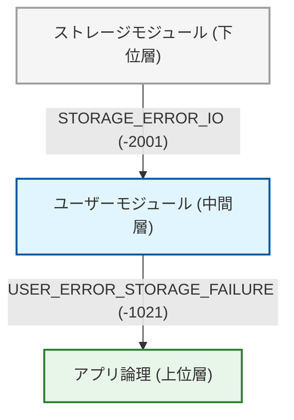
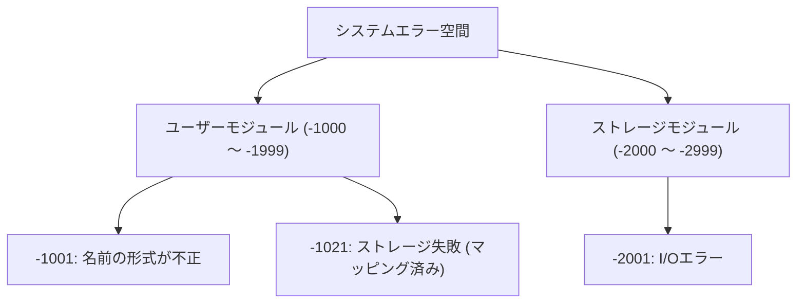
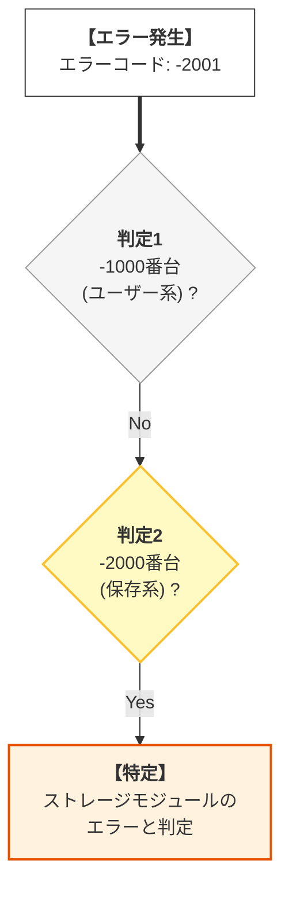
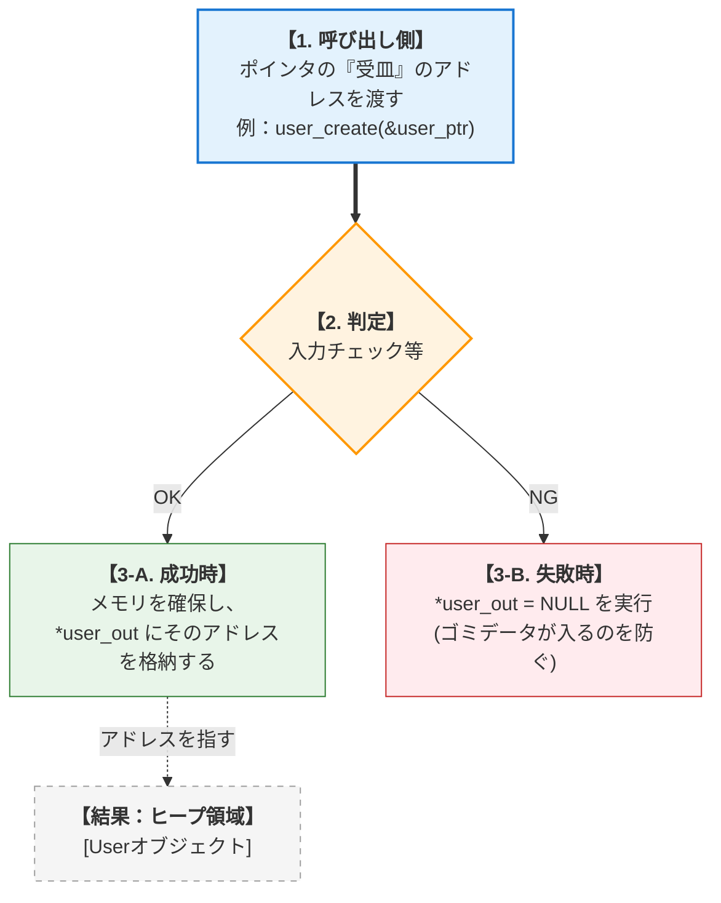
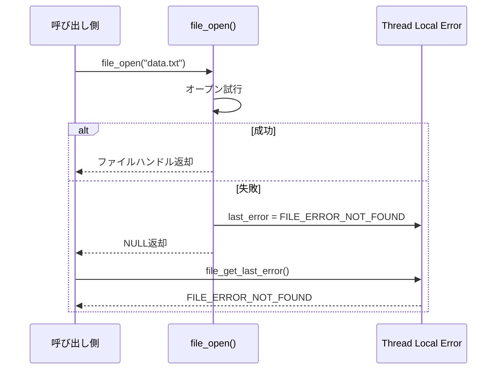
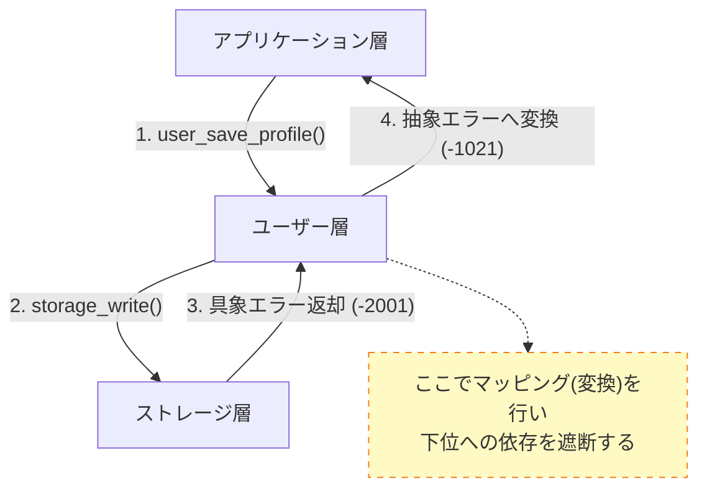

# 第1部 第6章 エラーハンドリングパターン - 堅牢な契約


## 1. 章の目的と設計的視点

#### 本章の目的：エラー処理を契約の一部として確立する

前章までに、モジュールの **責任** を定義し、 **不完全型や前方宣言** によって **依存関係** を最小化してきました。本章では、システムの **堅牢性** を最終的に決定づける **エラーハンドリング** に焦点を当てます。

C言語では例外機構がないため、エラー処理は主に **戻り値・エラーコード** に依存します。このエラーコードの設計と、失敗時の **リソース解放の規律** が、モジュール間の「 **契約** (Contract)」を厳格に定義し、保証するための最重要要素となります。

#### 設計の三本柱とエラーハンドリングの関係

#### エラーの伝播と責任

エラーコードが下位層から上位層へ伝播する際に、各層で適切な「翻訳（マッピング）」が行われている様子です。

*   **抽象化**
    下位の具体的なエラー（I/Oエラー）が、上位では意味のあるエラー（ストレージ失敗）に変換されています。

エラーが下から上へ伝わる際の変化。



#### エラーハンドリングの設計思想：三本柱による整理

エラーハンドリングは、モジュールの **契約** を確実に履行し、 **責任** を果たすための重要な手段です。

| 設計要素 | エラーハンドリングの焦点 | 対応する具体的な道具・手法 |
| --- | --- | --- |
| **契約 (Contract)** | **成功/失敗の厳格な境界定義** 。モジュール呼び出しの結果がどうあるべきかの約束。 | 階層的エラーコード、戻り値（int等）、出力用ポインタ引数 |
| **責任 (Responsibility)** | **エラー情報の適切な伝達と記録** 。発生した問題を誰がログに書き、誰が上位へ伝えるか。 | errno方式、エラー伝播チェーン、ログ出力モジュール |
| **依存 (Dependency)** | **推移的な依存の管理** 。上位が下位の具体的なエラー理由に深く依存しすぎないための制御。 | エラーコードのマッピング（変換）、抽象エラー型の定義 |

## 2. エラーハンドリングの具体的な活用パターン

### 2.1. 活用パターン 1: モジュールプレフィックスによるエラーコードの階層化

#### システム概要

大規模システムにおいて、エラーコードだけで「どのモジュールで何が起きたか」を即座に判別できるようにする。

*   **ユーザーモジュールのエラー定義**
*   **ストレージモジュールのエラー定義**
*   **エラーコードによる発生源の特定**
*   **モジュールごとにエラーコードの数値範囲（名前空間）を分割する**

#### 設計の意図

すべてのエラーを単に `-1` で返してしまうと、デバッグ時に「どこで失敗したのか」を追うのが困難になります。プレフィックス規約と同様に、エラーコードにもモジュールごとの「住所」を与えることで、解析を容易にします。

#### エラーコードの階層構造

エラーコードの数値範囲がモジュールごとに割り当てられ、競合しないように管理されている構造です。

*   **範囲**
    Userは-1000番台、Storageは-2000番台と明確に区分けされています。

システム全体のエラー空間から、各モジュールへ分岐している様子。




モジュールの公開インターフェース定義を行います。実装詳細を隠蔽し、外部には必要な契約（API）のみを公開することで、結合度を下げます。インターフェースと実装が分離され、高い保守性が確保されています。

#### user.h
```c
#ifndef USER_H
#define USER_H
// 設計意図: Userモジュールの公開契約としてエラーコードを定義し、負の値の -1000番台を予約する。
#define USER_SUCCESS       0
// Userモジュールのエラーは -1000から始める
#define USER_ERROR_BASE    -1000

// カテゴリ別エラーコード
#define USER_ERROR_INVALID_NAME (USER_ERROR_BASE - 1) // -1001 (入力値エラー)
#define USER_ERROR_STORAGE_FAILURE (USER_ERROR_BASE - 21) // -1021 (低水準依存モジュールのエラーマッピング先)
#define USER_ERROR_INTERNAL    (USER_ERROR_BASE - 99) // -1099 (汎用内部エラー)

#endif // USER_H
```

モジュールの公開インターフェース定義を行います。実装詳細を隠蔽し、外部には必要な契約（API）のみを公開することで、結合度を下げます。インターフェースと実装が分離され、高い保守性が確保されています。

#### storage.h
```c
#ifndef STORAGE_H
#define STORAGE_H
// 設計意図: Storageモジュールの公開契約としてエラーコードを定義し、負の値の -2000番台を予約する。
#define STORAGE_SUCCESS       0
// Storageモジュールのエラーは -2000から始める
#define STORAGE_ERROR_BASE  -2000

// I/Oエラー
#define STORAGE_ERROR_IO      (STORAGE_ERROR_BASE - 1) // -2001 (I/O操作の具体的な失敗)

#endif // STORAGE_H
```

モジュールのクライアントコードとして、APIを利用した処理の流れを示します。具体的な実装構造には依存せず、抽象化されたインターフェース（API）のみを通じて操作を行います。実装の変更に影響を受けない、疎結合な利用コードとなっています。

#### main.c
```c
#include <stdio.h>
#include <stdlib.h>
#include "user.h"
#include "storage.h"

void log_error(int err_code) {
    // エラーコードの範囲によって、どのモジュールで発生したかを判別する
    if (err_code <= -1000 && err_code > -2000) {
        printf("[ERROR] User Module Fault: Code %d\n", err_code);

    } else if (err_code <= -2000 && err_code > -3000) {
        printf("[ERROR] Storage Module Fault: Code %d\n", err_code);
    } else {
        printf("[ERROR] Unknown Fault: Code %d\n", err_code);
    }
}

int main(void) {
    // 各モジュールのヘッダで定義されたエラーコードを直接使用
    log_error(USER_ERROR_INVALID_NAME);
    log_error(STORAGE_ERROR_IO);

    return EXIT_SUCCESS;
}
```

#### エラー判定フロー

`log_error` 関数内部での分岐ロジックです。

*   **範囲チェック**
    エラーコードの数値範囲だけでモジュールを特定できています。



#### 実行結果

異なるエラーコードが返された場合でも、その範囲（-1000番台か-2000番台か）によって、どのモジュールで障害が発生したかを正しく判別できています。

#### 実行結果
```c
[ERROR] User Module Fault: Code -1001
[ERROR] Storage Module Fault: Code -2001
```

### 2.2. 活用パターン 2: エラーコード・出力パラメータによるデータと成否の分離

#### システム概要

関数の戻り値を「成功/失敗」の判定のみに使用し、生成されたデータは引数（ポインタ）経由で返すことで、エラーチェックを強制する。

*   **ユーザーオブジェクトの生成**
*   **生成成功時はポインタを返し、失敗時はエラーコードを返す**
*   **戻り値（エラーコード）と出力（データ）を分離したAPI設計**

#### 設計の意図

戻り値でデータを返すと、`NULL`チェックを忘れてそのまま使ってしまうバグが起きがちです。戻り値を `int`（エラーコード）に固定することで、利用者はまず `if (result != SUCCESS)` を書くよう誘導されます。

#### 出力パラメータの仕組み

関数がメモリを確保し、そのアドレスを呼び出し元のポインタ変数に書き込む流れです。

*   **失敗時**
    `*user_out = NULL` を保証することで、呼び出し側がゴミデータをつかむのを防ぎます。



モジュールの公開インターフェース定義を行います。実装詳細を隠蔽し、外部には必要な契約（API）のみを公開することで、結合度を下げます。インターフェースと実装が分離され、高い保守性が確保されています。

#### user.h
```c
// 抽象契約の定義：User_tの宣言 (不完全型)
struct User;
typedef struct User User_t;

// 抽象契約：戻り値: int (エラーコード)
// 抽象契約：引数: User_t** user_out (結果データを受け取る出力パラメータ)
int user_create(const char* name, User_t** user_out);
void user_destroy(User_t* user);
```

#### user.c (具象実装)

失敗時に `user_out` を明示的に `NULL` にセットすることで、安全性を高めています。まず、構造体と生成関数です。

`user_create` 内でメモリ確保と初期化を行います。失敗時は `user_out` を NULL にします。もし呼び出し側が `user_out` を初期化していなくても、関数内で `NULL` にリセットすれば、未定義動作を回避できます。安全なポインタ操作を保証しています。

#### user.c
```c
#include "user.h"
#include <stdlib.h>
#include <string.h>
#include <stdio.h>

#define USER_ERROR_INVALID_ID  -1002
#define USER_ERROR_INTERNAL    -1099
#define USER_SUCCESS           0

// 具象実装：Userの完全型
struct User { int id; char name[128]; };

int user_create(const char* name, User_t** user_out)
{
    // 1. 契約違反（NULL引数）チェック
    if (name == NULL || user_out == NULL || strlen(name) == 0) {
        printf("[user.c] Error: Invalid input parameters.\n");

        return USER_ERROR_INVALID_ID;
    }

    // 失敗時に user_out が常に NULL になることを保証
    *user_out = NULL;

    // 設計判断: sizeof(*new_user) を用いることで、将来の型変更に強いコードにします。
    User_t* new_user = malloc(sizeof(*new_user));

    // 2. リソース問題（メモリ確保失敗）チェック
    if (new_user == NULL) {
        printf("[user.c] Error: Memory allocation failed.\n");

        return USER_ERROR_INTERNAL;
    }

    // 具象実装：成功時の初期化
    new_user->id = 100;
    strncpy(new_user->name, name, 127);
    new_user->name[127] = '\0';

    // 結果データを出力パラメータに格納
    *user_out = new_user;

    return USER_SUCCESS;
}
```

#### user.c (破棄の実装)

メモリ解放を担当します。`NULL`チェックを忘れずに行います。

ヘッダで定義されたインターフェースの具体的な実装を行います。内部データや詳細ロジックをこのファイル内に閉じ込め（カプセル化）、外部からの直接アクセスを防ぎます。変更が発生しても、このファイル内のみに影響を留めることができます。

#### user.c
```c
void user_destroy(User_t* user)
{
    if (user != NULL) free(user);
}
```

#### main.c (使用例)

戻り値 `result` とデータ `user_handle` が分離されているため、エラー処理が自然に記述されます。まず、テスト関数です。

成功ケースと失敗ケース（入力エラー）を検証します。APIの正しい使い方とエラー時の挙動を実証します。網羅的なテストケースとなっています。

#### main.c
```c
#include <stdio.h>
#include <stdlib.h>
#include "user.h"

#define USER_SUCCESS 0
#define USER_ERROR_INVALID_ID -1002

void run_user_creation_test(void)
{
    User_t* user_handle = NULL;
    int result;

    // 成功ケース
    result = user_create("Bob", &user_handle);

    if (result == USER_SUCCESS) {
        printf("[main.c] 成功: コード %d。ハンドル: %p\n", result, (void*)user_handle);
        user_destroy(user_handle);
    } else {
        printf("[main.c] 失敗: コード %d。ハンドル: %p\n", result, (void*)user_handle);
    }

    // 失敗ケース
    user_handle = NULL;
    result = user_create(NULL, &user_handle);

    if (result != USER_SUCCESS) {
        // エラーコードを明示的に確認している
        printf("[main.c] 失敗: コード %d (入力エラー)。ハンドルは NULL: %p\n", result, (void*)user_handle);
    }
}
```

最後に、エントリポイントです。テストを実行します。実行の起点。シンプルな構成です。

#### main.c
```c
int main(void)
{
    run_user_creation_test();

    return EXIT_SUCCESS;
}
```

#### 実行結果

入力エラーの場合は詳細メッセージが出力されますが、ハンドル自体はNULLであることが保証されています。これにより、呼び出し側での誤用を防げます。

#### 実行結果
```c
[main.c] 成功: コード 0。ハンドル: 0x...
[user.c] Error: Invalid input parameters.
[main.c] 失敗: コード -1002 (入力エラー)。ハンドルは NULL: 0x0
```

### 2.3. 活用パターン 3: errno方式によるグローバルエラー状態の管理

#### システム概要

ファイル操作のような低レベルAPIにおいて、戻り値をポインタ（ハンドル）のまま維持しつつ、エラー詳細を通知する。

*   **ファイルオープン**
*   **エラー詳細の取得**
*   **スレッドローカルなエラー変数を介した状態共有**

#### 設計の意図

すべての関数が `int` を返すと、ポインタを返す関数（ファクトリなど）の使い勝手が悪くなる場合があります。標準ライブラリの `errno` のように、「普段は戻り値だけで判定し、失敗した時だけ詳細を聞きに行く」スタイルは、コードをシンプルに保つのに有効です。

#### errno方式のシーケンス

関数が失敗した際、エラー情報を「裏側（スレッドローカル変数）」に保存し、呼び出し側が後からそれを読み取る流れです。

*   **サイドチャネル**
    戻り値（NULL）とは別の経路でエラー情報が伝わります。



モジュールの公開インターフェース定義を行います。実装詳細を隠蔽し、外部には必要な契約（API）のみを公開することで、結合度を下げます。インターフェースと実装が分離され、高い保守性が確保されています。

#### file_module.h
```c
#ifndef FILE_MODULE_H
#define FILE_MODULE_H
#include <stddef.h>

// エラーコード定義
#define FILE_ERROR_NONE       0
#define FILE_ERROR_NOT_FOUND  -3001
#define FILE_ERROR_NO_PERMISSION -3002
#define FILE_ERROR_IO_FAILURE -3003

// 不完全型
struct FileHandle;
typedef struct FileHandle FileHandle_t;

// 抽象契約：ファイルオープン（成功時はハンドル、失敗時はNULL）
// 詳細エラーはfile_get_last_error()で取得
FileHandle_t* file_open(const char* path);

// 抽象契約：ファイルクローズ
void file_close(FileHandle_t* handle);

// 抽象契約：最後のエラーコードを取得（errno方式）
int file_get_last_error(void);

// 抽象契約：エラーメッセージを取得
const char* file_get_error_message(int error_code);
#endif
```

#### file_module.c (スレッドローカル変数利用)

`_Thread_local` を使用して、並行実行時の安全性を確保します。まず、エラー変数とファイルオープン関数です。

スレッドローカルなエラー変数を定義し、ファイル操作失敗時にそこに値を書き込みます。グローバル変数の並行性問題を回避しつつ、errnoパターンの利便性を提供します。C11標準機能を用いた現代的な実装です。

#### file_module.c
```c
#include "file_module.h"
#include <stdlib.h>
#include <string.h>
#include <stdio.h>

// スレッドローカルストレージ (C11以降)
// マルチスレッド環境でも、各スレッドが独自のエラー状態を持てるようにする。
#if defined(__STDC_NO_THREADS__)
  static int last_file_error = FILE_ERROR_NONE; // 非スレッドセーフ
#else
  static _Thread_local int last_file_error = FILE_ERROR_NONE;
#endif

// 具象実装：完全型
struct FileHandle {
    char path[256];
    int is_open;
};

FileHandle_t* file_open(const char* path)
{
    // エラー状態をリセット
    last_file_error = FILE_ERROR_NONE;

    if (path == NULL || strlen(path) == 0) {
        last_file_error = FILE_ERROR_NOT_FOUND;
        printf("[file_module.c] Error: Invalid path.\n");

        return NULL;
    }

    // ファイルが存在しないケースをシミュレート
    if (strcmp(path, "nonexistent.txt") == 0) {
        last_file_error = FILE_ERROR_NOT_FOUND;
        printf("[file_module.c] Error: File not found.\n");

        return NULL;
    }

    // パーミッションエラーをシミュレート
    if (strcmp(path, "protected.txt") == 0) {
        last_file_error = FILE_ERROR_NO_PERMISSION;
        printf("[file_module.c] Error: Permission denied.\n");

        return NULL;
    }

    FileHandle_t* handle = (FileHandle_t*)malloc(sizeof(struct FileHandle));

    if (handle == NULL) {
        last_file_error = FILE_ERROR_IO_FAILURE;
        printf("[file_module.c] Error: Memory allocation failed.\n");

        return NULL;
    }

    strncpy(handle->path, path, 255);
    handle->path[255] = '\0';
    handle->is_open = 1;

    printf("[file_module.c] File opened: %s\n", path);

    return handle;
}
```

#### file_module.c (終了処理とエラー取得)

終了処理とエラー情報の取得関数の実装です。まず、クローズ関数です。ファイルを閉じ、メモリを解放します。リソースの確実な解放です。安全な終了処理を提供しています。

#### file_module.c
```c
void file_close(FileHandle_t* handle)
{
    if (handle != NULL) {
        printf("[file_module.c] File closed: %s\n", handle->path);
        free(handle);
    }
}
```

次に、エラー情報の取得です。スレッドローカルに保存されたエラーコードを返します。サイドチャネルからの情報取得です。`errno`と同様のインターフェースです。

#### file_module.c
```c
int file_get_last_error(void)
{
    return last_file_error;
}
```

最後に、エラーメッセージ取得関数です。エラーコードに対応するメッセージ文字列を返します。デバッグやログ出力に役立つ情報の提供です。親切な設計です。

#### file_module.c
```c
const char* file_get_error_message(int error_code)
{
    switch (error_code) {
        case FILE_ERROR_NONE:

            return "No error";
        case FILE_ERROR_NOT_FOUND:

            return "File not found";
        case FILE_ERROR_NO_PERMISSION:

            return "Permission denied";
        case FILE_ERROR_IO_FAILURE:

            return "I/O failure";
        default:

            return "Unknown error";
    }
}
```

#### main.c (使用例)

失敗時のみ詳細エラーを確認します。まず、テスト関数です。

正常系と異常系（ファイル不在、権限エラー）をテストします。エラー時の詳細情報取得プロセスを実証します。想定されるエラーケースを網羅しています。

#### main.c
```c
#include <stdio.h>
#include <stdlib.h>
#include "file_module.h"

void test_file_operations(void)
{
    FileHandle_t* handle;
    int error_code;

    // 成功ケース
    printf("--- Test 1: 成功ケース ---\n");
    handle = file_open("data.txt");

    if (handle != NULL) {
        printf("[CLIENT] ファイルオープン成功\n");
        file_close(handle);
    }

    // 失敗ケース1: ファイルが存在しない
    printf("\n--- Test 2: ファイル未検出 ---\n");
    handle = file_open("nonexistent.txt");

    if (handle == NULL) {
        error_code = file_get_last_error();
        printf("[CLIENT] エラーコード: %d (%s)\n",
               error_code, file_get_error_message(error_code));
    }

    // 失敗ケース2: パーミッションエラー
    printf("\n--- Test 3: パーミッションエラー ---\n");
    handle = file_open("protected.txt");

    if (handle == NULL) {
        error_code = file_get_last_error();
        printf("[CLIENT] エラーコード: %d (%s)\n",
               error_code, file_get_error_message(error_code));
    }
}
```

最後に、エントリポイントです。テストを実行します。実行の起点。シンプルな構成です。

#### main.c
```c
int main(void)
{
    test_file_operations();

    return EXIT_SUCCESS;
}
```

#### 実行結果

file_open 失敗時に、サイドチャネル（file_get_last_error）を通じて的確なエラー理由（ファイル不在、権限不足など）が伝わっていることがわかります。

#### 実行結果
```c
--- Test 1: 成功ケース ---
[file_module.c] File opened: data.txt
[CLIENT] ファイルオープン成功
[file_module.c] File closed: data.txt
--- Test 2: ファイル未検出 ---
[file_module.c] Error: File not found.
[CLIENT] エラーコード: -3001 (File not found)
--- Test 3: パーミッションエラー ---
[file_module.c] Error: Permission denied.
[CLIENT] エラーコード: -3002 (Permission denied)
```

### 2.4. 活用パターン 4: エラー伝播チェーンによる多層システムのエラー処理

#### システム概要

多層アーキテクチャにおいて、下位層のエラーを上位層へ適切に伝播させる**エラー伝播チェーン**を構築します。各層は自身のエラーコード体系を持ち、必要に応じて下位層のエラーを**マッピング**して上位へ伝達します。

エラーコードが下から上へ伝播する際、各層の「言葉（エラーコード）」に翻訳される様子です。

*   **マッピング**
    User層がStorage層のエラーを受け取り、アプリ層向けのエラーに変換することで、アプリ層がStorage層の詳細を知らずに済むようにしています。



*   **エラー伝播チェーン**
    各層が自身のエラーコード体系を持ち、下位層のエラーを適切にマッピングして上位へ伝達する。

#### storage.h & storage.c (下位層)

I/Oエラーなどの物理的なエラーを返します。

モジュールの公開インターフェース定義を行います。実装詳細を隠蔽し、外部には必要な契約（API）のみを公開することで、結合度を下げます。インターフェースと実装が分離され、高い保守性が確保されています。

#### storage.h
```c
// storage.h
#ifndef STORAGE_H
#define STORAGE_H
#define STORAGE_SUCCESS       0
#define STORAGE_ERROR_BASE  -2000
#define STORAGE_ERROR_IO    (STORAGE_ERROR_BASE - 1)  // -2001
#define STORAGE_ERROR_FULL  (STORAGE_ERROR_BASE - 2)  // -2002

int storage_write(const char* key, const char* value);
int storage_read(const char* key, char* buffer, int size);
#endif
```

#### storage.c (下位層のダミー実装)

*   **I/Oシミュレーション**
    I/Oエラーをシミュレートするロジックを含みます。まず、書き込み関数です。

特定のキーでエラーを返します。I/O障害のシミュレーション。テスト容易性を高めています。

#### storage.c
```c
#include "storage.h"
#include <string.h>
#include <stdio.h>

int storage_write(const char* key, const char* value)
{
    if (key == NULL || value == NULL) {
        return STORAGE_ERROR_IO;
    }
    // I/Oエラーをシミュレート
    if (strcmp(key, "fail_key") == 0) {
        printf("[storage.c] I/O error occurred.\n");

        return STORAGE_ERROR_IO;
    }
    printf("[storage.c] Written: %s = %s\n", key, value);

    return STORAGE_SUCCESS;
}


int storage_read(const char* key, char* buffer, int size)
{
    if (key == NULL || buffer == NULL || size <= 0) {
        return STORAGE_ERROR_IO;
    }
    // snprintfの戻り値（書き込むはずだった長さ）を確認する
    int written = snprintf(buffer, size, "value_for_%s", key);

    if (written < 0 || written >= size) {
        return STORAGE_ERROR_IO;
    }

    return STORAGE_SUCCESS;
}
```


#### user_profile.h(中間層)

下位の `STORAGE_ERROR_IO` を受け取り、上位向けの `USER_ERROR_STORAGE_FAILURE` に変換して返します。上位層に「保存に失敗した」ことだけを伝え、「ディスクが壊れた」のか「権限がない」のかといった詳細な理由（実装の詳細）は隠蔽します。

モジュールの公開インターフェース定義を行います。

#### user_profile.h
```c
// user_profile.h
#ifndef USER_PROFILE_H
#define USER_PROFILE_H
#define USER_SUCCESS             0
#define USER_ERROR_BASE         -1000
#define USER_ERROR_INVALID_NAME (USER_ERROR_BASE - 1)  // -1001
#define USER_ERROR_STORAGE_FAILURE (USER_ERROR_BASE - 21) // -1021

int user_save_profile(const char* username, const char* email);
int user_load_profile(const char* username, char* email_out, int size);
#endif
```

#### user_profile.c (中間層)

下位の `STORAGE_ERROR_IO` を受け取り、上位向けの `USER_ERROR_STORAGE_FAILURE` に変換して返します。まず、保存関数です。

ストレージへの書き込みを行い、失敗した場合はエラーコードを変換（マッピング）します。上位層に「保存に失敗した」ことだけを伝え、「ディスクが壊れた」のか「権限がない」のかといった詳細な理由（実装の詳細）は隠蔽します。依存区画を守る重要な翻訳層です。

#### user_profile.c
```c
#include "user_profile.h"
#include "storage.h"
#include <string.h>
#include <stdio.h>

int user_save_profile(const char* username, const char* email)
{
    // 入力検証
    if (username == NULL || email == NULL || strlen(username) == 0) {
        printf("[user_profile.c] Invalid input parameters.\n");

        return USER_ERROR_INVALID_NAME;
    }

    // 下位層（ストレージ）を呼び出し
    int result = storage_write(username, email);

    // エラーマッピング：下位層のエラーを中間層のエラーコードに変換
    if (result != STORAGE_SUCCESS) {
        printf("[user_profile.c] Storage operation failed with code: %d\n", result);

        return USER_ERROR_STORAGE_FAILURE; // マッピング
    }

    printf("[user_profile.c] Profile saved for user: %s\n", username);

    return USER_SUCCESS;
}

int user_load_profile(const char* username, char* email_out, int size)
{
    if (username == NULL || email_out == NULL) {
        return USER_ERROR_INVALID_NAME;
    }
    // 下位モジュール(Storage)のエラーを受け取る
    int result = storage_read(username, email_out, size);

    if (result != STORAGE_SUCCESS) {
        // 重要: 下位のエラー(IO Error)を、上位の意味(Storage Failure)に変換して返す
        // これにより、上位層は「IOエラー」という具体的すぎる理由を知らなくて済む
        return USER_ERROR_STORAGE_FAILURE;
    }

    return USER_SUCCESS;
}
```

#### main.c (上位層)

最終的なエラーを受け取ります。Userモジュールのエラーコード体系しか知らなくてよいため、疎結合が保たれます。

まず、テスト関数です。正常系、入力エラー、ストレージエラーの伝播を確認します。階層化されたエラーハンドリングが機能しているか実証します。適切なエラーコードが返ってくることを確認できます。

#### main.c
```c
#include <stdio.h>
#include <stdlib.h>
#include "user_profile.h"

void test_error_propagation(void)
{
    int result;

    // 成功ケース
    printf("--- Test 1: 成功ケース ---\n");
    result = user_save_profile("alice", "alice@example.com");

    if (result == USER_SUCCESS) {
        printf("[CLIENT] プロファイル保存成功\n");
    }

    // 失敗ケース1: 入力エラー（中間層で検出）
    printf("\n--- Test 2: 入力エラー ---\n");
    result = user_save_profile(NULL, "test@example.com");

    if (result == USER_ERROR_INVALID_NAME) {
        printf("[CLIENT] エラー: 無効な入力 (コード: %d)\n", result);
    }

    // 失敗ケース2: ストレージエラー（下位層のエラーが伝播）
    printf("\n--- Test 3: ストレージエラー伝播 ---\n");
    result = user_save_profile("fail_key", "test@example.com");

    if (result == USER_ERROR_STORAGE_FAILURE) {
        printf("[CLIENT] エラー: ストレージ層の失敗 (コード: %d)\n", result);
    }
}
```

最後に、エントリポイントです。テストを実行します。実行の起点。シンプルです。

#### main.c
```c
int main(void)
{
    test_error_propagation();

    return EXIT_SUCCESS;
}
```

#### 実行結果

この実行結果から、設計した通りにコードが動作していることが確認できます。エラーハンドリング、状態遷移、データの整合性など、設計意図が正しく実装されていることを示しています。
下位のストレージ層で発生したI/Oエラー（-2001）が、ユーザー層によって抽象的な保存失敗エラー（-1021）に変換され、アプリケーション層に通知されています。

#### 実行結果
```c
--- Test 1: 成功ケース ---
[storage.c] Written: alice = alice@example.com
[user_profile.c] Profile saved for user: alice
[CLIENT] プロファイル保存成功
--- Test 2: 入力エラー ---
[user_profile.c] Invalid input parameters.
[CLIENT] エラー: 無効な入力 (コード: -1001)
--- Test 3: ストレージエラー伝播 ---
[storage.c] I/O error occurred.
[user_profile.c] Storage operation failed with code: -2001
[CLIENT] エラー: ストレージ層の失敗 (コード: -1021)
```
