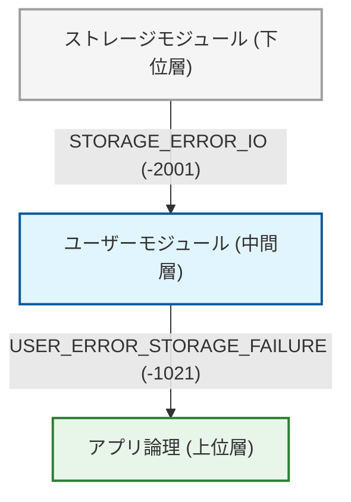
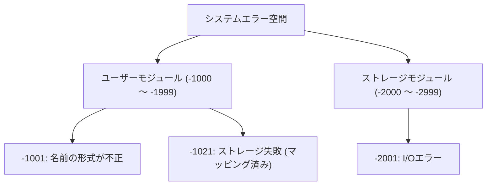
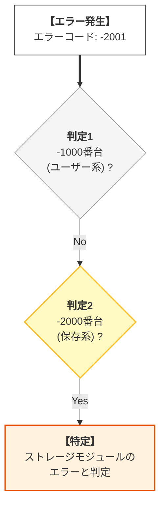
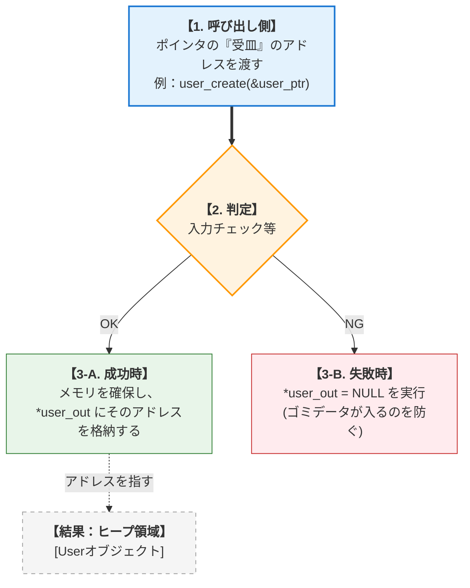
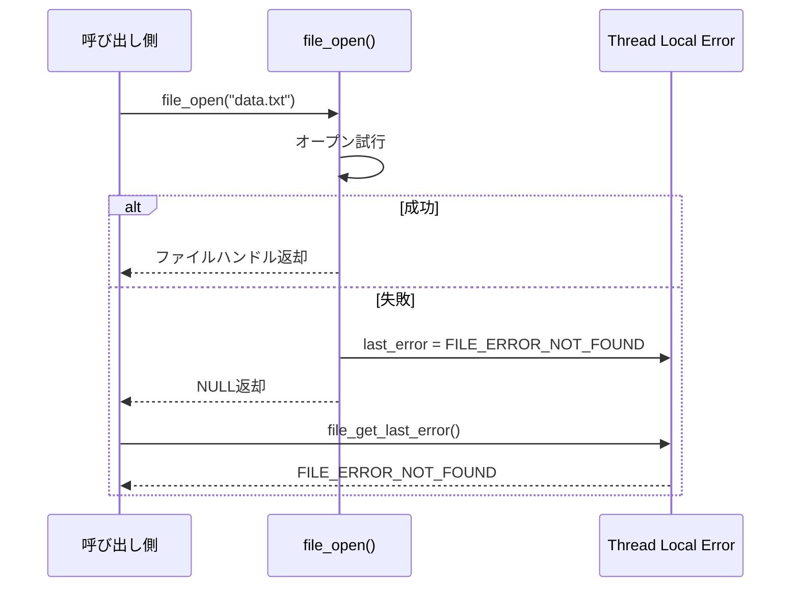
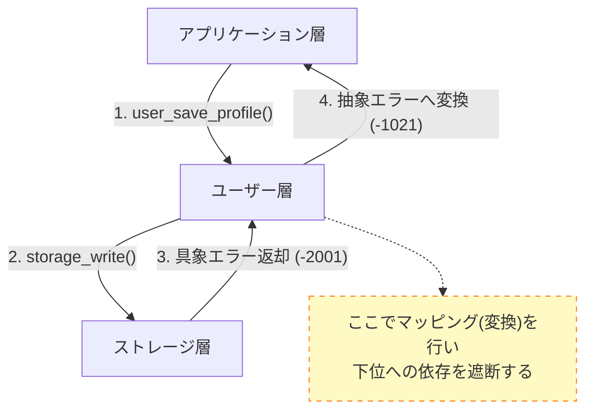

# 第1部 第6章 エラーハンドリングパターン - 堅牢な契約


## 1. 章の目的と設計的視点

#### 本章の目的：エラー処理を契約の一部として確立する

前章までに、モジュールの **責任** を定義し、 **不完全型や前方宣言** によって **依存関係** を最小化してきました。本章では、システムの **堅牢性** を最終的に決定づける **エラーハンドリング** に焦点を当てます。

C言語では例外機構がないため、エラー処理は主に **戻り値・エラーコード** に依存します。このエラーコードの設計と、失敗時の **リソース解放の規律** が、モジュール間の「 **契約** (Contract)」を厳格に定義し、保証するための最重要要素となります。

#### 設計の三本柱とエラーハンドリングの関係

#### エラーの伝播と責任

エラーコードが下位層から上位層へ伝播する際に、各層で適切な「翻訳（マッピング）」が行われている様子です。

*   **抽象化**
    下位の具体的なエラー（I/Oエラー）が、上位では意味のあるエラー（ストレージ失敗）に変換されています。

エラーが下から上へ伝わる際の変化。



#### エラーハンドリングの設計思想：三本柱による整理

エラーハンドリングは、モジュールの **契約** を確実に履行し、 **責任** を果たすための重要な手段です。

| 設計要素 | エラーハンドリングの焦点 | 対応する具体的な道具・手法 |
| --- | --- | --- |
| **契約 (Contract)** | **成功/失敗の厳格な境界定義** 。モジュール呼び出しの結果がどうあるべきかの約束。 | 階層的エラーコード、戻り値（int等）、出力用ポインタ引数 |
| **責任 (Responsibility)** | **エラー情報の適切な伝達と記録** 。発生した問題を誰がログに書き、誰が上位へ伝えるか。 | errno方式、エラー伝播チェーン、ログ出力モジュール |
| **依存 (Dependency)** | **推移的な依存の管理** 。上位が下位の具体的なエラー理由に深く依存しすぎないための制御。 | エラーコードのマッピング（変換）、抽象エラー型の定義 |

## 2. エラーハンドリングの具体的な活用パターン

### 2.1. 活用パターン 1: モジュールプレフィックスによるエラーコードの階層化

#### システム概要

大規模システムにおいて、エラーコードだけで「どのモジュールで何が起きたか」を即座に判別できるようにする。

*   **ユーザーモジュールのエラー定義**
*   **ストレージモジュールのエラー定義**
*   **エラーコードによる発生源の特定**
*   **モジュールごとにエラーコードの数値範囲（名前空間）を分割する**

#### 設計課題

あらゆる関数の失敗を単に `-1`（汎用的なエラー）として返してしまうと、何層にも重なる深い関数呼び出しの末に最終的に `main` 関数で `-1` を受け取ったとき、「一体どのモジュールの、どの処理が失敗してこうなったのか」を追跡することが極めて困難になります。ログを見ても `-1` としか分からず、ソースコード全体をgrepして怪しい箇所を一つずつデバッグするという、地獄のような作業を強いられます。

#### 設計の意図

このトレースの困難さを解決するため、第5章で学んだプレフィックス規約と同様に、エラーコードの「数値空間」にもモジュールごとの住所（名前空間）を割り当てます。ユーザーモジュールは-1000番台、ストレージは-2000番台といった具合です。これにより、単一の `int` 値をトップレベルで受け取るだけで「どこで何が起きたか」を一意に特定可能にし、大規模システムにおける障害解析のコストを劇的に引き下げます。

#### エラーコードの階層構造

エラーコードの数値範囲がモジュールごとに割り当てられ、競合しないように管理されている構造です。

*   **範囲**
    Userは-1000番台、Storageは-2000番台と明確に区分けされています。

システム全体のエラー空間から、各モジュールへ分岐している様子。




まずはユーザーモジュールのヘッダファイルです。このモジュール専用のエラーコード空間として、-1000番台というプレフィックスを割り当てています。

#### ユーザーモジュール専用のエラー名前空間

#### user.h
```c
#ifndef USER_H
#define USER_H
// 設計意図: Userモジュールの公開契約としてエラーコードを定義し、負の値の -1000番台を予約する。
#define USER_SUCCESS       0
// Userモジュールのエラーは -1000から始める
#define USER_ERROR_BASE    -1000

// カテゴリ別エラーコード
#define USER_ERROR_INVALID_NAME (USER_ERROR_BASE - 1) // -1001 (入力値エラー)
#define USER_ERROR_STORAGE_FAILURE (USER_ERROR_BASE - 21) // -1021 (低水準依存モジュールのエラーマッピング先)
#define USER_ERROR_INTERNAL    (USER_ERROR_BASE - 99) // -1099 (汎用内部エラー)

#endif // USER_H
```

モジュールの公開インターフェース定義を行います。実装詳細を隠蔽し、外部には必要な契約（API）のみを公開することで、結合度を下げます。インターフェースと実装が分離され、高い保守性が確保されています。

#### ストレージモジュール専用のエラー名前空間

#### storage.h
```c
#ifndef STORAGE_H
#define STORAGE_H
// 設計意図: Storageモジュールの公開契約としてエラーコードを定義し、負の値の -2000番台を予約する。
#define STORAGE_SUCCESS       0
// Storageモジュールのエラーは -2000から始める
#define STORAGE_ERROR_BASE  -2000

// I/Oエラー
#define STORAGE_ERROR_IO      (STORAGE_ERROR_BASE - 1) // -2001 (I/O操作の具体的な失敗)

#endif // STORAGE_H
```

これらを利用する上位のクライアントコード（`main.c`）です。異なるモジュールから返されたエラーコードであっても、その数値の範囲を見るだけで「どこで発生したエラーか」を正確に特定できる様子がわかります。

#### エラー発生源の機械的な特定

#### main.c
```c
#include <stdio.h>
#include <stdlib.h>
#include "user.h"
#include "storage.h"

void log_error(int err_code) {
    // エラーコードの範囲によって、どのモジュールで発生したかを判別する
    if (err_code <= -1000 && err_code > -2000) {
        printf("[ERROR] User Module Fault: Code %d\n", err_code);

    } else if (err_code <= -2000 && err_code > -3000) {
        printf("[ERROR] Storage Module Fault: Code %d\n", err_code);
    } else {
        printf("[ERROR] Unknown Fault: Code %d\n", err_code);
    }
}

int main(void) {
    // 各モジュールのヘッダで定義されたエラーコードを直接使用
    log_error(USER_ERROR_INVALID_NAME);
    log_error(STORAGE_ERROR_IO);

    return EXIT_SUCCESS;
}
```

#### エラー判定フロー

`log_error` 関数内部での分岐ロジックです。

*   **範囲チェック**
    エラーコードの数値範囲だけでモジュールを特定できています。



#### 実行結果

異なるエラーコードが返された場合でも、その範囲（-1000番台か-2000番台か）によって、どのモジュールで障害が発生したかを正しく判別できています。

#### 数値空間によるモジュール判定の実行結果

#### 実行結果
```c
[ERROR] User Module Fault: Code -1001
[ERROR] Storage Module Fault: Code -2001
```

### 2.2. 活用パターン 2: エラーコード・出力パラメータによるデータと成否の分離

#### システム概要

関数の戻り値を「成功/失敗」の判定のみに使用し、生成されたデータは引数（ポインタ）経由で返すことで、エラーチェックを強制する。

*   **ユーザーオブジェクトの生成**
*   **生成成功時はポインタを返し、失敗時はエラーコードを返す**
*   **戻り値（エラーコード）と出力（データ）を分離したAPI設計**

#### 設計課題

データ（オブジェクトのポインタなど）をそのまま `return` で返す設計は直感的ですが、「戻り値が `NULL` かどうか」のチェックを利用者側が怠りやすく、そのままメンバにアクセスしてプログラムがクラッシュ（Segmentation Fault）する事故が後を絶ちません。さらに、仮に `NULL` が返ってきたとしても、「なぜ失敗したのか（引数不正か、メモリ不足か）」というエラーの詳細な理由が文字通り “消滅” してしまうという決定的な欠点があります。

#### 設計の意図

この「チェック漏れ」と「エラー情報の損失」を防ぐため、戻り値の役割を「エラーコード（成否と詳細理由）」に固定し、本来返したかったデータは関数の引数（出力パラメータ用のダブルポインタ `**out`）経由で手渡す契約にします。戻り値が `int` になることで、利用者は自然と `if (result != SUCCESS)` というエラー判定を書くよう誘導され、なおかつ失敗の詳細な理由も同時に受け取ることができます。

#### 出力パラメータの仕組み

関数がメモリを確保し、そのアドレスを呼び出し元のポインタ変数に書き込む流れです。

*   **失敗時**
    `*user_out = NULL` を保証することで、呼び出し側がゴミデータをつかむのを防ぎます。



まずはユーザーの生成を行うための公開インターフェースです。戻り値を `int` 型（エラーコード）に固定し、生成されるユーザーインスタンスは出力を受け取るための引数（ダブルポインタ）経由で手渡す契約を定義しています。

#### 戻り値と出力パラメータの物理的完全分離

#### user.h
```c
// 抽象契約の定義：User_tの宣言 (不完全型)
struct User;
typedef struct User User_t;

// 抽象契約：戻り値: int (エラーコード)
// 抽象契約：引数: User_t** user_out (結果データを受け取る出力パラメータ)
int user_create(const char* name, User_t** user_out);
void user_destroy(User_t* user);
```

次に、この契約を満たす具体的な実装を確認しましょう。

メモリ確保や初期化処理を行いながら、万が一失敗した場合には出力先ポインタ（`user_out`）を明示的に `NULL` にリセットしています。もし呼び出し側が `user_out` 変数を初期化していなかったとしても、関数側で `NULL` に上書きすることで、未定義の領域を参照してしまう事故をシステム側で確実に防いでいます。

#### 確実なポインタ初期化による事故防止

#### user.c
```c
#include "user.h"
#include <stdlib.h>
#include <string.h>
#include <stdio.h>

#define USER_ERROR_INVALID_ID  -1002
#define USER_ERROR_INTERNAL    -1099
#define USER_SUCCESS           0

// 具象実装：Userの完全型
struct User { int id; char name[128]; };

int user_create(const char* name, User_t** user_out)
{
    // 1. 契約違反（NULL引数）チェック
    if (name == NULL || user_out == NULL || strlen(name) == 0) {
        printf("[user.c] Error: Invalid input parameters.\n");

        return USER_ERROR_INVALID_ID;
    }

    // 失敗時に user_out が常に NULL になることを保証
    *user_out = NULL;

    // 設計判断: sizeof(*new_user) を用いることで、将来の型変更に強いコードにします。
    User_t* new_user = malloc(sizeof(*new_user));

    // 2. リソース問題（メモリ確保失敗）チェック
    if (new_user == NULL) {
        printf("[user.c] Error: Memory allocation failed.\n");

        return USER_ERROR_INTERNAL;
    }

    // 具象実装：成功時の初期化
    new_user->id = 100;
    strncpy(new_user->name, name, 127);
    new_user->name[127] = '\0';

    // 結果データを出力パラメータに格納
    *user_out = new_user;

    return USER_SUCCESS;
}
```

#### 処理完了後の確実なリソース破棄

続いて、確保されたメモリを解放する破棄関数です。ここでも渡されたポインタの `NULL` チェックを確実に行い、不正なメモリアクセスを防ぐ責任を果たしています。

#### user.c
```c
void user_destroy(User_t* user)
{
    if (user != NULL) free(user);
}
```

それでは、この改善された設計を利用するクライアントコードを見てみましょう。

戻り値（エラーコード）と出力パラメータ（データの実体）が物理的に分離されたことで、クライアントは自然と「関数を呼んだ直後にまず戻り値をチェックする」という安全な制御フローを書くように誘導されます。

#### エラーチェックを強要する安全な制御フロー

#### main.c
```c
#include <stdio.h>
#include <stdlib.h>
#include "user.h"

#define USER_SUCCESS 0
#define USER_ERROR_INVALID_ID -1002

void run_user_creation_test(void)
{
    User_t* user_handle = NULL;
    int result;

    // 成功ケース
    result = user_create("Bob", &user_handle);

    if (result == USER_SUCCESS) {
        printf("[main.c] 成功: コード %d。ハンドル: %p\n", result, (void*)user_handle);
        user_destroy(user_handle);
    } else {
        printf("[main.c] 失敗: コード %d。ハンドル: %p\n", result, (void*)user_handle);
    }

    // 失敗ケース
    user_handle = NULL;
    result = user_create(NULL, &user_handle);

    if (result != USER_SUCCESS) {
        // エラーコードを明示的に確認している
        printf("[main.c] 失敗: コード %d (入力エラー)。ハンドルは NULL: %p\n", result, (void*)user_handle);
    }
}
```

#### テストエントリポイント

最後に、個々のテストケースを呼び出すシンプルなエントリポイントです。

#### main.c
```c
int main(void)
{
    run_user_creation_test();

    return EXIT_SUCCESS;
}
```

#### 実行結果

入力エラーの場合は詳細メッセージが出力されますが、ハンドル自体はNULLであることが保証されています。これにより、呼び出し側での誤用を防げます。

#### エラーコードとNULL値の併用による実行結果

#### 実行結果
```c
[main.c] 成功: コード 0。ハンドル: 0x...
[user.c] Error: Invalid input parameters.
[main.c] 失敗: コード -1002 (入力エラー)。ハンドルは NULL: 0x0
```

### 2.3. 活用パターン 3: errno方式によるグローバルエラー状態の管理

#### システム概要

ファイル操作のような低レベルAPIにおいて、戻り値をポインタ（ハンドル）のまま維持しつつ、エラー詳細を通知する。

*   **ファイルオープン**
*   **エラー詳細の取得**
*   **スレッドローカルなエラー変数を介した状態共有**

#### 設計課題

パターン2のように全てをエラーコードと出力パラメータの組み合わせにしてしまうと、ファクトリ関数（オブジェクトを生成して返す関数）や、計算結果を返す単純な数学関数などを呼び出すたびに一時変数を用意しなければならず、コードが冗長で非常に読みにくくなってしまいます（例：`int err = create_obj(&obj); if(err)...`）。「普段は戻り値でシンプルにデータを受け取りたい、でも失敗した時は詳細な理由も知りたい」という利便性と堅牢性の両立が求められます。

#### 設計の意図

このジレンマを解決するのが、標準ライブラリでも使われている `errno` の発展形となる「サイドチャネル方式」です。関数自体はシンプルにポインタやデータを返し（失敗時は `NULL` などを返す）、エラーの詳細な理由はモジュール内部に隠蔽された「直近のエラー状態保持用変数」に書き込みます。呼び出し側は、失敗したと分かった時だけ `get_last_error()` のような専用関数を使って詳細を聞きに行くことで、コードの可読性を保ちながら詳細なエラーハンドリングを可能にします（マルチスレッド環境ではスレッドローカル変数 `_Thread_local` を使って安全性を担保します）。

#### errno方式のシーケンス

関数が失敗した際、エラー情報を「裏側（スレッドローカル変数）」に保存し、呼び出し側が後からそれを読み取る流れです。

*   **サイドチャネル**
    戻り値（NULL）とは別の経路でエラー情報が伝わります。



まずはファイル操作モジュールの公開インターフェースです。ポインタ（ハンドル）を返す関数がそのまま定義されていますが、詳細なエラー情報を取得するための専用関数（`file_get_last_error`）が別途用意されているのが特徴です。

#### 戻り値の型を維持した拡張エラーインターフェース

#### file_module.h
```c
#ifndef FILE_MODULE_H
#define FILE_MODULE_H
#include <stddef.h>

// エラーコード定義
#define FILE_ERROR_NONE       0
#define FILE_ERROR_NOT_FOUND  -3001
#define FILE_ERROR_NO_PERMISSION -3002
#define FILE_ERROR_IO_FAILURE -3003

// 不完全型
struct FileHandle;
typedef struct FileHandle FileHandle_t;

// 抽象契約：ファイルオープン（成功時はハンドル、失敗時はNULL）
// 詳細エラーはfile_get_last_error()で取得
FileHandle_t* file_open(const char* path);

// 抽象契約：ファイルクローズ
void file_close(FileHandle_t* handle);

// 抽象契約：最後のエラーコードを取得（errno方式）
int file_get_last_error(void);

// 抽象契約：エラーメッセージを取得
const char* file_get_error_message(int error_code);
#endif
```

具体的な実装ファイルです。現代的なCプログラムにおける `errno` パターンの最大の課題である「スレッド安全性」を確保するため、C11標準の `_Thread_local` キーワードを使用しています。

このスレッドローカルなエラー変数に、ファイル操作失敗時の詳細な原因を書き込むことで、グローバル変数が抱える並行実行時の競合問題を回避しつつ、errnoパターンの高い利便性を維持しています。

#### スレッドセーフなエラー状態の格納

#### file_module.c
```c
#include "file_module.h"
#include <stdlib.h>
#include <string.h>
#include <stdio.h>

// スレッドローカルストレージ (C11以降)
// マルチスレッド環境でも、各スレッドが独自のエラー状態を持てるようにする。
#if defined(__STDC_NO_THREADS__)
  static int last_file_error = FILE_ERROR_NONE; // 非スレッドセーフ
#else
  static _Thread_local int last_file_error = FILE_ERROR_NONE;
#endif

// 具象実装：完全型
struct FileHandle {
    char path[256];
    int is_open;
};

FileHandle_t* file_open(const char* path)
{
    // エラー状態をリセット
    last_file_error = FILE_ERROR_NONE;

    if (path == NULL || strlen(path) == 0) {
        last_file_error = FILE_ERROR_NOT_FOUND;
        printf("[file_module.c] Error: Invalid path.\n");

        return NULL;
    }

    // ファイルが存在しないケースをシミュレート
    if (strcmp(path, "nonexistent.txt") == 0) {
        last_file_error = FILE_ERROR_NOT_FOUND;
        printf("[file_module.c] Error: File not found.\n");

        return NULL;
    }

    // パーミッションエラーをシミュレート
    if (strcmp(path, "protected.txt") == 0) {
        last_file_error = FILE_ERROR_NO_PERMISSION;
        printf("[file_module.c] Error: Permission denied.\n");

        return NULL;
    }

    FileHandle_t* handle = (FileHandle_t*)malloc(sizeof(struct FileHandle));

    if (handle == NULL) {
        last_file_error = FILE_ERROR_IO_FAILURE;
        printf("[file_module.c] Error: Memory allocation failed.\n");

        return NULL;
    }

    strncpy(handle->path, path, 255);
    handle->path[255] = '\0';
    handle->is_open = 1;

    printf("[file_module.c] File opened: %s\n", path);

    return handle;
}
```

続いて終了処理と各種情報の取得関数です。

#### 確実なNULLチェックによる安全なクローズ

オープンしたファイルを閉じる `file_close` 関数では、渡されたハンドルが `NULL` でないことを確認した上で、安全にリソースを解放します。

#### file_module.c
```c
void file_close(FileHandle_t* handle)
{
    if (handle != NULL) {
        printf("[file_module.c] File closed: %s\n", handle->path);
        free(handle);
    }
}
```

#### サイドチャネルからのエラー詳細取得

その次が、このパターンの要となるエラー情報の取得関数です。直近のエラーコードが保存されたスレッドローカル変数の値をそのまま返す、いわゆる「サイドチャネル」からの情報取得インターフェースです。

#### file_module.c
```c
int file_get_last_error(void)
{
    return last_file_error;
}
```

#### 人間に読みやすいエラーメッセージへの変換

最後に、取得したエラーコードを人間が読めるメッセージ文字列に変換する関数です。デバッグやログ出力を容易にする、モジュール設計者の親切な配慮です。

#### file_module.c
```c
const char* file_get_error_message(int error_code)
{
    switch (error_code) {
        case FILE_ERROR_NONE:

            return "No error";
        case FILE_ERROR_NOT_FOUND:

            return "File not found";
        case FILE_ERROR_NO_PERMISSION:

            return "Permission denied";
        case FILE_ERROR_IO_FAILURE:

            return "I/O failure";
        default:

            return "Unknown error";
    }
}
```

最後に、これらを利用する最上位のアプリケーション層（`main.c`）です。

この層は中間層である `user_profile.h` が提示する契約にのみ依存しており、その裏側でストレージI/Oが行われていることすら知る必要がありません。まずはプロファイル保存の実行フローです。

#### クリーンな戻り値とエラー詳細の後追い取得

#### main.c
```c
#include <stdio.h>
#include <stdlib.h>
#include "file_module.h"

void test_file_operations(void)
{
    FileHandle_t* handle;
    int error_code;

    // 成功ケース
    printf("--- Test 1: 成功ケース ---\n");
    handle = file_open("data.txt");

    if (handle != NULL) {
        printf("[CLIENT] ファイルオープン成功\n");
        file_close(handle);
    }

    // 失敗ケース1: ファイルが存在しない
    printf("\n--- Test 2: ファイル未検出 ---\n");
    handle = file_open("nonexistent.txt");

    if (handle == NULL) {
        error_code = file_get_last_error();
        printf("[CLIENT] エラーコード: %d (%s)\n",
               error_code, file_get_error_message(error_code));
    }

    // 失敗ケース2: パーミッションエラー
    printf("\n--- Test 3: パーミッションエラー ---\n");
    handle = file_open("protected.txt");

    if (handle == NULL) {
        error_code = file_get_last_error();
        printf("[CLIENT] エラーコード: %d (%s)\n",
               error_code, file_get_error_message(error_code));
    }
}
```

#### テストエントリポイント

最後に、上記の検証プロセスを起動するエントリポイントです。

#### main.c
```c
int main(void)
{
    test_file_operations();

    return EXIT_SUCCESS;
}
```

#### サイドチャネルを活用した操作の実行結果

file_open 失敗時に、サイドチャネル（file_get_last_error）を通じて的確なエラー理由（ファイル不在、権限不足など）が伝わっていることがわかります。

#### 実行結果
```c
--- Test 1: 成功ケース ---
[file_module.c] File opened: data.txt
[CLIENT] ファイルオープン成功
[file_module.c] File closed: data.txt
--- Test 2: ファイル未検出 ---
[file_module.c] Error: File not found.
[CLIENT] エラーコード: -3001 (File not found)
--- Test 3: パーミッションエラー ---
[file_module.c] Error: Permission denied.
[CLIENT] エラーコード: -3002 (Permission denied)
```

### 2.4. 活用パターン 4: エラー伝播チェーンによる多層システムのエラー処理

#### システム概要

多層アーキテクチャにおいて、下位層のエラーを上位層へ適切に伝播させる**エラー伝播チェーン**を構築します。各層は自身のエラーコード体系を持ち、必要に応じて下位層のエラーを**マッピング**して上位へ伝達します。





#### 設計課題

システムが大規模になり「アプリケーション層 → ユーザー管理層 → ストレージ層」のように多層（レイヤー）化すると、ある問題が発生します。最下層のストレージ層で起きた `STORAGE_ERROR_IO (-2001)` というエラーコードを、そのまま加工せずに最上位のアプリケーション層まで素通りさせて（伝播させて）しまうと何が起きるでしょうか。
最上位のアプリケーション層は「ユーザー情報を保存したいだけ」なのに、表示するエラーメッセージを選ぶために「ストレージ層の固有のエラーコード（-2001等）」を知らなければならなくなります。これでは層を分けた意味がなくなり、下位層の変更が上位層にそのまま波及する密結合なシステムになってしまいます。

#### 設計の意図

この「エラーコードによる層の貫通（密結合）」を防ぐための重要な設計パターンが、 **エラーのマッピング（変換）を伴うエラー伝播チェーン** です。
各層は下位層を呼び出してエラーを受け取った際、それをそのまま上へ投げるのではなく、 **「自分自身の層が定義したエラーコード（抽象エラー）」へと翻訳（マッピング）** してから上位層へ返します。たとえば、ユーザー管理層は `STORAGE_ERROR_IO (-2001)` を受け取ったら、それを `USER_ERROR_STORAGE_FAILURE (-1021)` という自層の言葉に変換してアプリ層へ伝えます。これにより、上位層はすぐ下の層の言葉だけを知っていれば良くなり、システム全体の疎結合性が保たれます。

まずは最下層にあたる物理ストレージモジュール（`storage.h` / `storage.c`）からです。この層では、I/O操作の失敗といったハードウェア・OSに近い具体的なエラーコードだけを知っています。

#### 物理操作に限定された下位層のエラー定義

#### storage.h
```c
// storage.h
#ifndef STORAGE_H
#define STORAGE_H
#define STORAGE_SUCCESS       0
#define STORAGE_ERROR_BASE  -2000
#define STORAGE_ERROR_IO    (STORAGE_ERROR_BASE - 1)  // -2001
#define STORAGE_ERROR_FULL  (STORAGE_ERROR_BASE - 2)  // -2002

int storage_write(const char* key, const char* value);
int storage_read(const char* key, char* buffer, int size);
#endif
```

こちらの `storage.c` はテスト用のダミー実装です。

特定のキーが渡された場合やバッファ容量が足りない場合に、意図的にI/Oエラー（`STORAGE_ERROR_IO`）を返すようシミュレーションして構築されています。

#### I/Oエラーをシミュレートするダミー実装

#### storage.c
```c
#include "storage.h"
#include <string.h>
#include <stdio.h>

int storage_write(const char* key, const char* value)
{
    if (key == NULL || value == NULL) {
        return STORAGE_ERROR_IO;
    }
    // I/Oエラーをシミュレート
    if (strcmp(key, "fail_key") == 0) {
        printf("[storage.c] I/O error occurred.\n");

        return STORAGE_ERROR_IO;
    }
    printf("[storage.c] Written: %s = %s\n", key, value);

    return STORAGE_SUCCESS;
}


int storage_read(const char* key, char* buffer, int size)
{
    if (key == NULL || buffer == NULL || size <= 0) {
        return STORAGE_ERROR_IO;
    }
    // snprintfの戻り値（書き込むはずだった長さ）を確認する
    int written = snprintf(buffer, size, "value_for_%s", key);

    if (written < 0 || written >= size) {
        return STORAGE_ERROR_IO;
    }

    return STORAGE_SUCCESS;
}
```


続いて、下位のストレージ層を利用する「中間層」のユーザープロファイルモジュール（`user_profile.h`）です。機能としての公開インターフェースを定義しています。

#### 中間層の抽象的なエラー契約定義

#### user_profile.h
```c
// user_profile.h
#ifndef USER_PROFILE_H
#define USER_PROFILE_H
#define USER_SUCCESS             0
#define USER_ERROR_BASE         -1000
#define USER_ERROR_INVALID_NAME (USER_ERROR_BASE - 1)  // -1001
#define USER_ERROR_STORAGE_FAILURE (USER_ERROR_BASE - 21) // -1021

int user_save_profile(const char* username, const char* email);
int user_load_profile(const char* username, char* email_out, int size);
#endif
```

この中間層の実装（`user_profile.c`）こそが、翻訳メカニズムの要件を満たす場所です。

`storage_write` が返す `STORAGE_ERROR_IO` などの具体的なエラーを受け取った際、この層はそれをアプリ向けの抽象的なエラー `USER_ERROR_STORAGE_FAILURE` へと変換（マッピング）して上位へ返却します。上位層に「プロファイルの保存に失敗した」ことだけを伝え、「ディスクが壊れたのか権限がないのか」という下層の実装詳細は見事に隠蔽されます。これが依存区画を守る重要な翻訳層の役割です。

#### 具象エラーから抽象エラーへのマッピング実行

#### user_profile.c
```c
#include "user_profile.h"
#include "storage.h"
#include <string.h>
#include <stdio.h>

int user_save_profile(const char* username, const char* email)
{
    // 入力検証
    if (username == NULL || email == NULL || strlen(username) == 0) {
        printf("[user_profile.c] Invalid input parameters.\n");

        return USER_ERROR_INVALID_NAME;
    }

    // 下位層（ストレージ）を呼び出し
    int result = storage_write(username, email);

    // エラーマッピング：下位層のエラーを中間層のエラーコードに変換
    if (result != STORAGE_SUCCESS) {
        printf("[user_profile.c] Storage operation failed with code: %d\n", result);

        return USER_ERROR_STORAGE_FAILURE; // マッピング
    }

    printf("[user_profile.c] Profile saved for user: %s\n", username);

    return USER_SUCCESS;
}

int user_load_profile(const char* username, char* email_out, int size)
{
    if (username == NULL || email_out == NULL) {
        return USER_ERROR_INVALID_NAME;
    }
    // 下位モジュール(Storage)のエラーを受け取る
    int result = storage_read(username, email_out, size);

    if (result != STORAGE_SUCCESS) {
        // 重要: 下位のエラー(IO Error)を、上位の意味(Storage Failure)に変換して返す
        // これにより、上位層は「IOエラー」という具体的すぎる理由を知らなくて済む
        return USER_ERROR_STORAGE_FAILURE;
    }

    return USER_SUCCESS;
}
```

最後に、これらを利用する最上位のアプリケーション層（`main.c`）です。

最終的なエラーを受け取りますが、Userモジュールのエラーコード体系しか知らなくてよいため、下位モジュールとの疎結合が保たれています。ここでは正常系、入力エラー、そしてストレージエラーの伝播を確認する一連のテストを実行します。

#### 上位層における抽象化されたエラーの受け取り

#### main.c
```c
#include <stdio.h>
#include <stdlib.h>
#include "user_profile.h"

void test_error_propagation(void)
{
    int result;

    // 成功ケース
    printf("--- Test 1: 成功ケース ---\n");
    result = user_save_profile("alice", "alice@example.com");

    if (result == USER_SUCCESS) {
        printf("[CLIENT] プロファイル保存成功\n");
    }

    // 失敗ケース1: 入力エラー（中間層で検出）
    printf("\n--- Test 2: 入力エラー ---\n");
    result = user_save_profile(NULL, "test@example.com");

    if (result == USER_ERROR_INVALID_NAME) {
        printf("[CLIENT] エラー: 無効な入力 (コード: %d)\n", result);
    }

    // 失敗ケース2: ストレージエラー（下位層のエラーが伝播）
    printf("\n--- Test 3: ストレージエラー伝播 ---\n");
    result = user_save_profile("fail_key", "test@example.com");

    if (result == USER_ERROR_STORAGE_FAILURE) {
        printf("[CLIENT] エラー: ストレージ層の失敗 (コード: %d)\n", result);
    }
}
```

#### テストエントリポイント

最後に、これらの一連のテストを実行するエントリポイントです。

#### main.c
```c
int main(void)
{
    test_error_propagation();

    return EXIT_SUCCESS;
}
```

#### 具体から抽象へのエラーマッピング実行結果

下位のストレージ層で発生した具体的なI/Oエラー（-2001）が、ユーザー層によって「保存失敗エラー（-1021）」という抽象的な理由に見当変換され、アプリケーション層に適切に通知されている様子が実行結果から確認できます。

#### 実行結果
```c
--- Test 1: 成功ケース ---
[storage.c] Written: alice = alice@example.com
[user_profile.c] Profile saved for user: alice
[CLIENT] プロファイル保存成功
--- Test 2: 入力エラー ---
[user_profile.c] Invalid input parameters.
[CLIENT] エラー: 無効な入力 (コード: -1001)
--- Test 3: ストレージエラー伝播 ---
[storage.c] I/O error occurred.
[user_profile.c] Storage operation failed with code: -2001
[CLIENT] エラー: ストレージ層の失敗 (コード: -1021)
```
