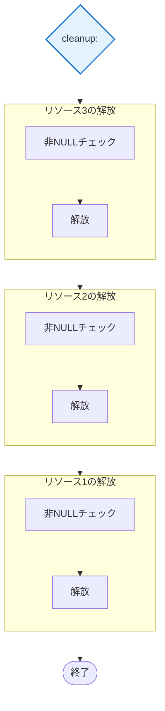
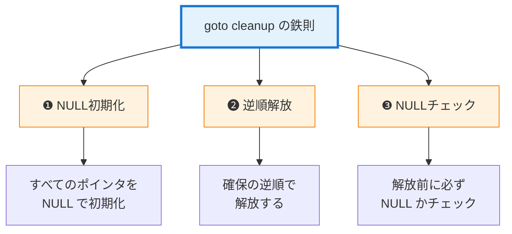
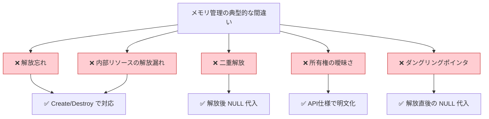
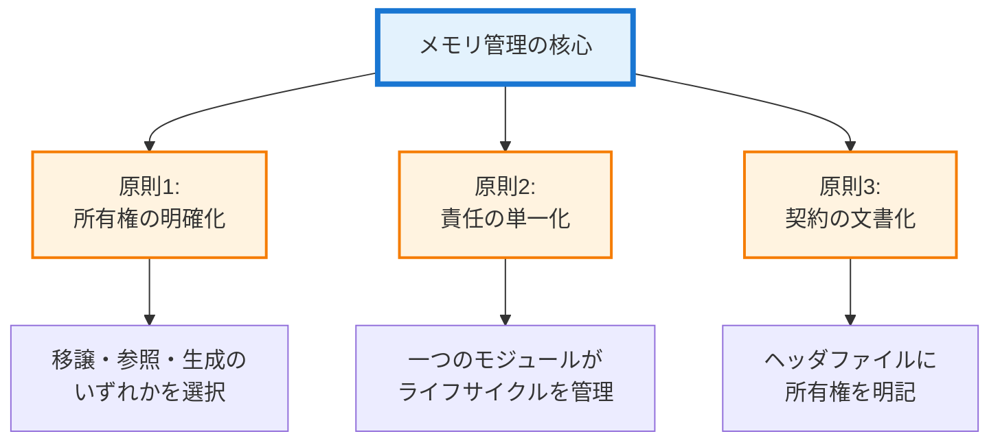

#### パターンの重要ポイント

#### 逆順の解放プロセス

`cleanup` ラベル以降で行われる、リソースの安全な解放手順です。 **逆順** : 確保した順序と逆に解放します（依存関係の解消）。

 **NULLチェック** : 確保に失敗した（またはまだ確保していない）リソースは `NULL` なので、安全にスキップされます。

`goto cleanup` パターンを成功させるための3つの鉄則です。 **NULL初期化** : これがないと、未確保の領域を解放しようとしてクラッシュしてしまい。

## 4. 設計判断と落とし穴のまとめ

#### メモリ管理の典型的な間違い（5つの罠）

メモリ管理における代表的な5つのアンチパターンと、それに対する解決策を示してい。 

 **対応関係** : それぞれの間違いに対して、具体的な解決策（右側）が存在しています。

#### 間違い1: 解放忘れ（メモリリーク）

確保したメモリをどこでも解放せずにリターンしてしまうケースです。 

 **対策** : `malloc` した関数が「形態III（生成）」でないなら、必ずそのスコープ内で `free` するか、対になる `destroy` 関数を呼び出します。

#### 間違い2: 二重解放 (Double Free)

同じポインタに対して2回 `free` を呼び出すと、プログラムがクラッシュします。 

 **対策** : 解放後、速やかにポインタに `NULL` を代入する習慣をつけましょう。

C言語の標準仕様では、`free(NULL)` は「何もしない」ことが定義されているため、万が一後続の処理で再度解放が走っても、クラッシュを回避できる可能性が高まります。

#### 間違い3: 所有権の曖昧さ

関数の戻り値が「誰が解放すべきものか」が、ドキュメントや規約で不明確なケースです。 

 **対策** : プレフィックス（`create_`, `get_`等）やコメントで、「形態III（生成）」であることを明文化します。

#### 間違い4: 構造体内部のリソース解放漏れ

構造体自体を `free` しても、その中のメンバが指している動的メモリが残ってしまうケースを指し。 

 **対策** : 必ず `destroy` 関数を用意し、内部のメンバから順に解放してから本体を解放するよう。

#### 間違い5: ダングリングポインタ (Dangling Pointer)

`free` 済みのメモリを指し続けているポインタを使ってしまうケースです。 

 **対策** : 解放した直後にポインタ変数を `NULL` で上書きし、無効であることを明示するよう。

## 本章で必ず理解してほしいことのまとめ

#### 三つの核心原則

メモリ管理を支える3つの原則です。 **統合** : これら3つが揃って初めて、安全なメモリ管理が実現するの。

核心（Core）を支える3本の柱。

#### 実践のチェックリスト

####  **設計時**

 [ ] すべての関数で所有権の形態（I, II, III）を決定した
 [ ] ヘッダファイルに所有権を文書化した
 [ ] Create/Destroy パターンが必要か判断した。

####  **実装時**

 [ ] ポインタは NULL で初期化している
 [ ] malloc の失敗をチェックしている
 [ ] goto cleanup パターンを使っている（複数リソースの場合）
 [ ] 解放の順序は確保の逆順になっている。

####  **テスト時**

 [ ] メモリリークチェックツール（valgrind等）を実行した
 [ ] エラーパスでもリソースが正しく解放されることを確認した
 [ ] 境界条件（NULL、サイズ0等）をテストした。

#### パターンの使い分け早見表
| 状況 | 推奨パターン | 理由 |
| --- | --- | --- |
| 複雑なオブジェクト | Create/Destroy | ライフサイクル管理が必要 |
| 単純なデータ処理 | バッファ提供 | オーバーヘッドが小さい |
| 複数リソース | goto cleanup | エラー処理が一元化できる |
| 読み取り専用 | const 参照 | 所有権の移動を防ぐ |

#### メモリ管理の設計上の役割

本章で学んだメモリ管理のパターンは、C言語において **「リソースの安全」** と **「責任の所在」** を物理的に担保するための最終防衛線と言え。

1.  **所有権の厳格な適用**

    **移譲・参照・生成** の3つの形態を意識的に使い分けることで、「誰が解放するのか」という迷いを排除し、メモリリークを構造的に防ぐこと。

2.  **ライフサイクルの隠蔽**

    **Create/Destroyパターン** により、構造体のサイズや内部リソースの複雑さを隠蔽し、利用者が `free()` の詳細を知らなくても安全に扱える **カプセル化** を完成させます。

3.  **エラー時の誠実な履行**

    **`goto cleanup`パターン** を採用し、正常系だけでなく異常系においても「リソースを確実に解放する」という **契約** を履行します。メモリ管理は単なるテクニックではありません。

それは、 **「自分が作ったものは、最後まで自分で責任を持つ（あるいは責任のバトンを正しく渡す）」** という設計者の誠実さを、コードに落とし込む行為に他なら。

## 第1部 総括への橋渡し：基礎道具のパズルが完成した

第1章の `static` から始まり、本章のメモリ管理まで、全7章にわたってC言語の「道具」を深く掘り下げてきました。

### 第1部で手に入れた「7つの道具」と三本柱

第1部では、C言語の基本機能を再解釈し、設計を支える強固な土台を築きます。これらの道具は、 **責任・契約・依存という三本柱を相互作用させながら実現する** ための手段です。

####  **責任の軸を強化する道具**

   **static（第1章）、構造体設計（第3章）、メモリ管理（第7章）**  
  モジュールの内部実装を隠蔽し、データと操作を統合し、リソースの所有権を明確化します。これにより  **「高い凝集度」** が生まれ、変更の理由を一つに絞り込むことができます。

####  **契約の軸を強化する道具**

   **不完全型（第4章）、ヘッダ設計（第5章）、エラーハンドリング（第6章）**  
  型情報を隠蔽し、公開APIを定義し、異常系の振る舞いを明確化します。これにより **「安定した境界」** が生まれ、内部実装の変更が外部に漏れ出なくなります。

####  **依存の軸を強化する道具**

 **関数ポインタ（第2章）**  
実行時の動的結合を可能にし、コンパイル時の型依存を切断し、インクルード依存を最小化し、外部参照を遮断します。これにより **「疎結合」** が生まれ、変更の影響範囲が限定されます。

#### 道具の相互作用による設計の強化

重要なのは、これらの道具が **単独で機能するのではなく、相互に作用し合う** ことです。

-  **static** で内部実装を隠蔽する（責任） → 外部からの依存が切断される（依存） → 公開すべきAPIが明確になる（契約）
-  **不完全型** で型情報を隠蔽する（契約） → コンパイル時の依存が切断される（依存） → 内部実装の変更が自由になる（責任）
-  **関数ポインタ** で動的結合を実現する（依存） → 振る舞いの契約が抽象化される（契約） → 各実装の責任が明確になる（責任）

このように、一つの道具を使うことで、複数の軸が同時に強化され、設計全体が調和の取れた状態へと近づきます。

#### 次章への橋渡し

これら7つの技術は、バラバラの知識ではなく、 **「責任・契約・依存」という三本柱を相互作用** させながら実現するために緻密に設計されたパズルのピースと言えます。次章の  **「第1部 総括」**  では、これら7つの道具がどのように組み合わさり、どのように相互作用し、堅牢なシステムの「基礎」を形作っているのかを俯瞰します。

私たちが手に入れた武器の真の威力を、改めて整理していきましょう。
