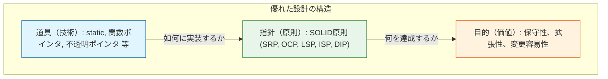
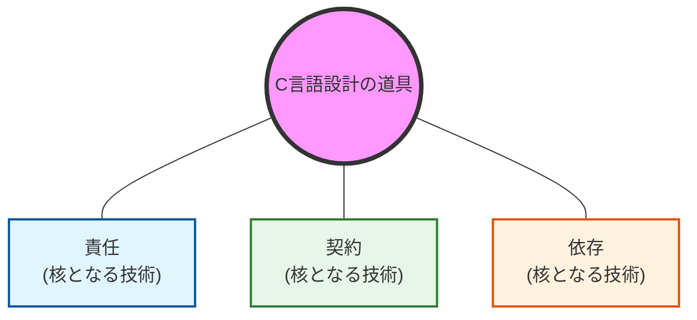
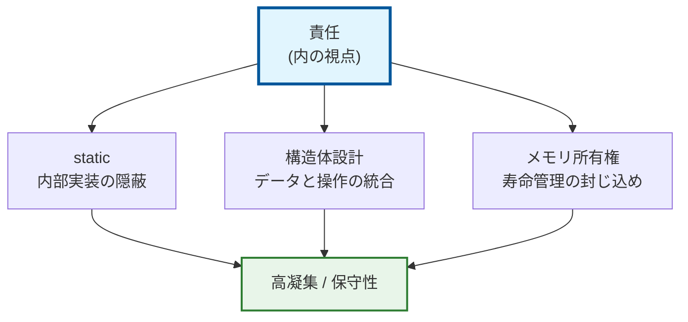
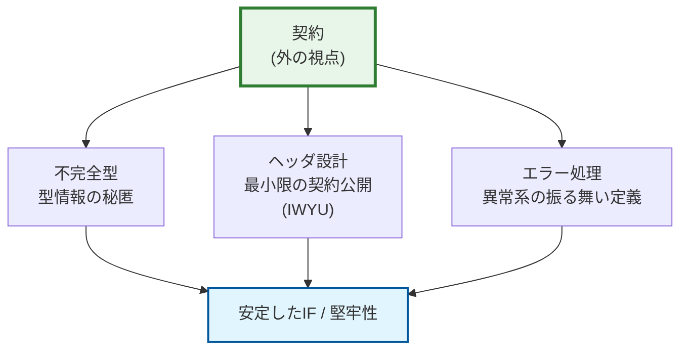
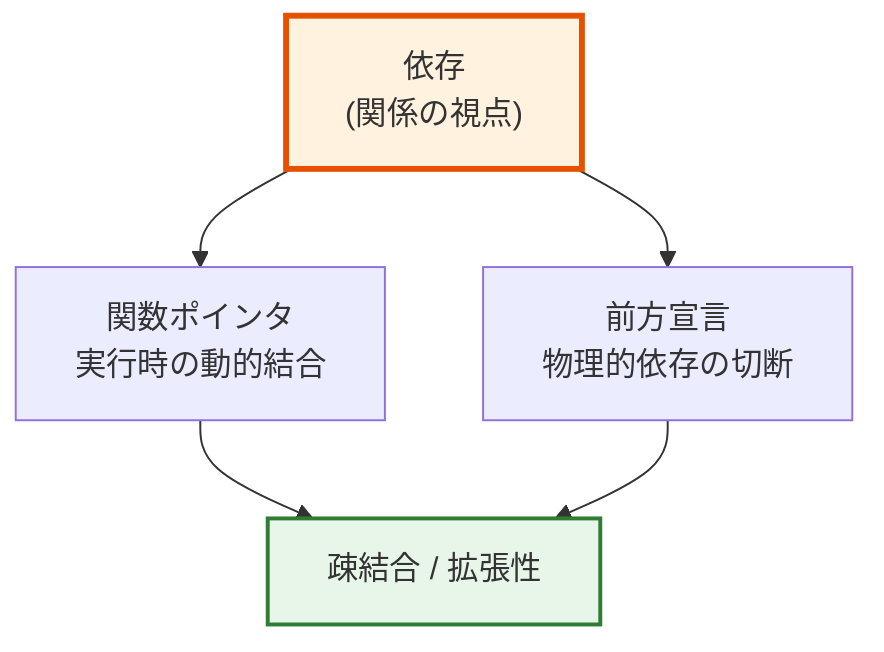
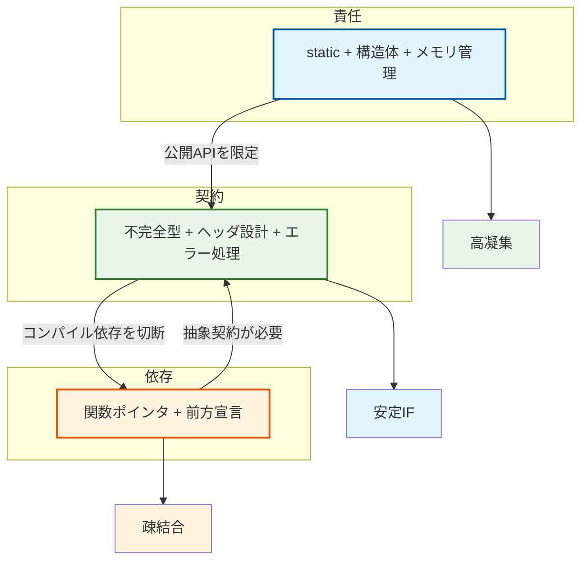
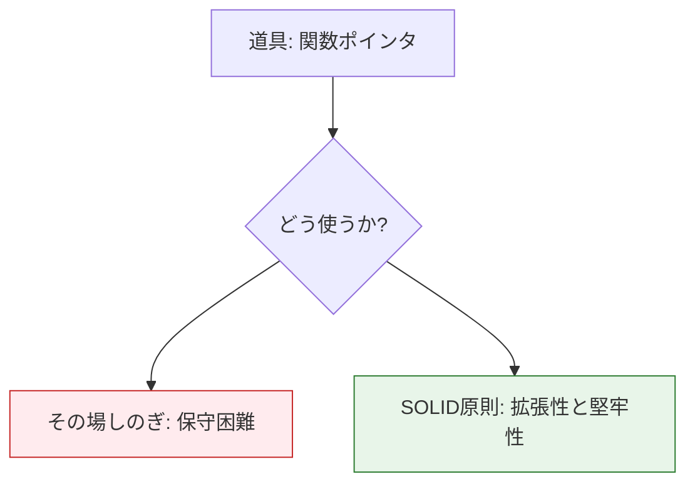

# 第1部 総括 堅牢なコードの「基礎」は固まった
## 第1部の目的の再確認：道具としての技術

 **第1部「基礎道具編」** では、C言語の7つの基本技術を、設計の三本柱である  **「責任」、「契約」、「依存」**  を実現するための物理的な  **道具** （ツール）として学びました。これらの技術は章ごとに異なる軸を扱いますが、それは  **螺旋的に理解を深めるための意図的な構成**  です。

各章で異なる角度から設計の全体像に触れることで、最終的に三本柱が相互に連携する様子を立体的に理解できるよう設計されています。この三層構造（ **技術（道具）→ 原則（指針）→ 目的（価値）** ）を理解することで、一つ一つのC言語の機能が、最終的な設計品質にどのように貢献するかを明確に把握できました。

### 設計の三層構造

「技術」が土台となり、「原則」を通して最終的な「価値」を生み出すという階層構造になっています。技術（道具）はあくまで最下層の手段であり、それをどう使うかの指針となるのが中間の原則、そして最終的に得られる成果物が最上位の目的（価値）です。

### 設計の三本柱とは何か

本章で繰り返し登場する「責任・契約・依存」という言葉。これらは抽象的な概念ではなく、 **コード上で明確に区別できる構造** です。以下のようにイメージしてみましょう。

#### 責任 (Responsibility): `.c` ファイルの中身

「この変数はこのファイル内だけで管理する（`static`）」、「このメモリは誰が解放する（所有権）」といった、モジュール内部の自治権を指します。

#### 契約 (Contract): `.h` ファイル（ヘッダ）

「この関数を呼ぶときはこの型を渡す」、「エラー時はこの値を返す」といった、外部との約束事であり、不完全型やエラーコードで定義されます。

#### 依存 (Dependency): `#include` と関数呼び出し

「Aモジュールが動くためにBモジュールが必要か？」という関係性を指します。関数ポインタや前方宣言を使うことで、この鎖を断ち切ったり、付け替えたりすることが可能です。

第1部で学んだ技術は、これら3つの要素を  **「なあなあ」にせず、コード上で明確に線を引くための道具**  だったと言えるでしょう。

## 第1部で獲得した7つの技術とその設計的意義
| 章 | 技術テーマ | 主な焦点 | 設計的意義と相互作用 |
| --- | --- | --- | --- |
| **第1章** | **`static`** | **責任** | **実装の隠蔽** : 内部状態をモジュールの責任内に閉じ込める。これが結果として外部からの不要な参照（依存）を断つ。 |
| **第2章** | **関数ポインタ** | **依存** | **動的結合** : 実行時に振る舞いを差し替え可能にする。これが抽象的なインターフェース（契約）という概念を生む。 |
| **第3章** | **構造体** | **責任** | **高い凝集度** : データと操作を論理的に統合する。この自己完結性が、後に安定した境界を築くための土台となる。 |
| **第4章** | **不完全型** | **契約** | **情報の隠蔽** : 型の詳細を実装ファイルに閉じ込め、ヘッダには「型がある」ことだけを示す。物理的な依存を完全に切断する。 |
| **第5章** | **ヘッダ設計** | **契約** | **公開APIの厳選** : 公開する約束事を最小限に絞る。これが不要なインクルードの連鎖（依存）を最小化させる。 |
| **第6章** | **エラー処理** | **契約** | **堅牢な実行保証** : 正常・異常系の振る舞いを定義する。呼び出し側と実装側の責任分界点が決まる。 |
| **第7章** | **メモリ管理** | **責任** | **所有権の明確化** : リソースの寿命管理を単一モジュールに封じ込める。安全な利用規約（契約）を成立させる。 |

## 技術は複数の軸に貢献する

重要な認識として、 **第1部で学んだ技術の多くは、単一の軸に収まるものではありません** 。

#### 三本柱と技術の関係

3つの軸（責任・契約・依存）が独立しているのではなく、共通の技術基盤（C言語の道具）によって支えられている様子を表しています。

## 責任の軸:内部実装の管理

「責任」を強化するための具体的な技術要素を示しています。`static`、構造体、メモリ管理の組み合わせが、「高凝集」で「保守しやすい」モジュールを作ります。

## 契約の軸:外部インターフェースの定義

「契約」を定義し、守るための技術要素を示しています。不完全型やエラー処理によって、外部に対して「安定したインターフェース」を提供します。

## 依存の軸:モジュール間の結合

「依存」をコントロールするための技術要素を示しています。関数ポインタと前方宣言を駆使することで、コンパイル時および実行時の結合度を下げ、「疎結合」を実現します。

#### 三本柱の相互作用 (「責任・契約・依存」の三本柱の実現状況)

3つの軸が互いに影響し合いながら、システム全体の品質を高めていくサイクルを描いています。責任を明確にすると契約が必要になり、契約を定義すると依存が整理され、依存が減ると責任がより一層明確になる、というポジティブな構造的ループが生まれます。

## 第1部の限界：「技術」から「原則」へ

これらは非常に強力な「道具」ですが、実務で直面するより複雑な設計課題に対しては、道具を「どう組み合わせるか」という指針がさらに重要になってくるのです。

## 第2部への橋渡し：SOLID原則という設計の羅針盤

 **第2部：原則編** では、 **第1部** で獲得した技術という **道具** を、 **5つの設計原則** （SOLID原則）という **指針** に基づいて統合し、 **究極の目的** （保守性、拡張性、変更容易性）を達成する **思考のフレームワーク** を確立します。

#### SOLID原則とC言語実装の対応（予告）
| 原則 (SOLID) | 主に関連する柱 | C言語での実装手段 | 設計目標 |
| --- | --- | --- | --- |
| **S：単一責任原則** | **責任** | **static / 構造体分割** | 変更の理由を一つに絞り、 **凝集度** を高める。 |
| **O：開放閉鎖原則** | **依存・契約** | **関数ポインタ / VTable** | 既存コードを修正せずに機能を追加できる **拡張性** 。 |
| **L：リスコフ置換原則** | **契約** | **関数の事前・事後条件** | 異なる実装が「同じ振る舞い」をすることを保証。 |
| **I：インターフェース分離** | **契約・依存** | **ヘッダファイルの分割** | クライアントに不要な依存を強制しない。 |
| **D：依存性逆転原則** | **依存・契約** | **不完全型 / VTable** | 上位層が具体に縛られず、 **抽象に依存** する疎結合。 |

 **第1部** で **道具** を手に入れました。 **第2部** では、その道具を使いこなす **設計者** への道を歩み始めましょう。

次章からは **「第2部 導入：原則編の目的と学習ロードマップ」** が始まります。

**第1部 完**
