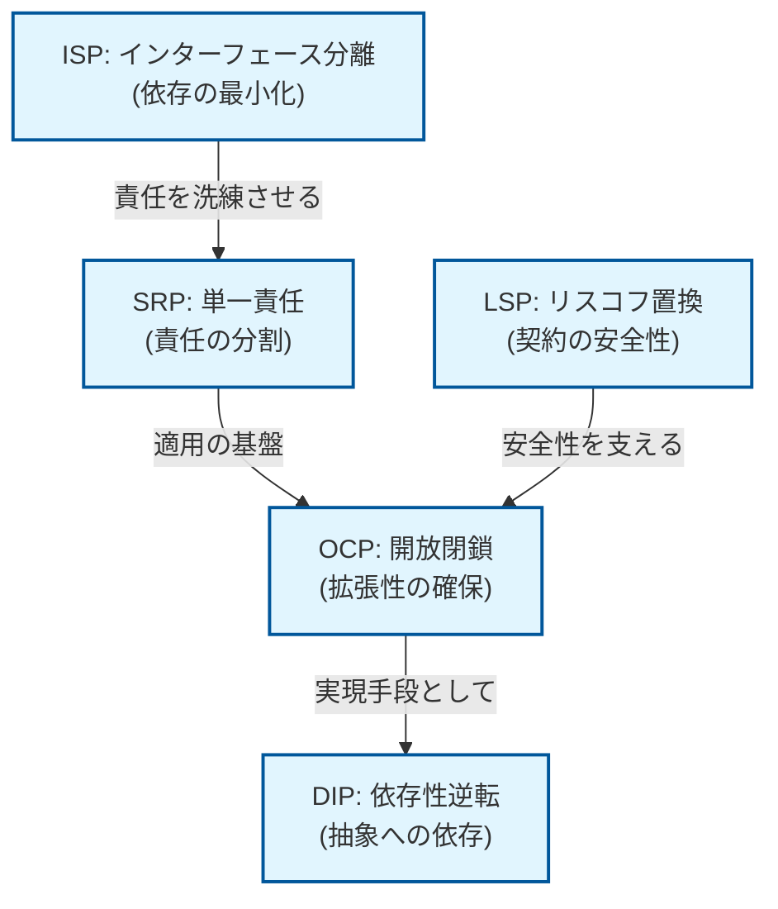
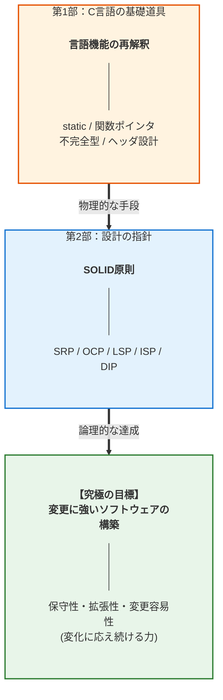
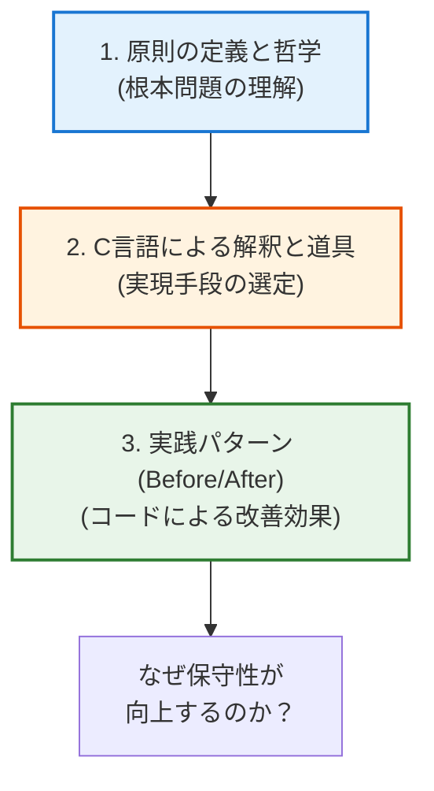
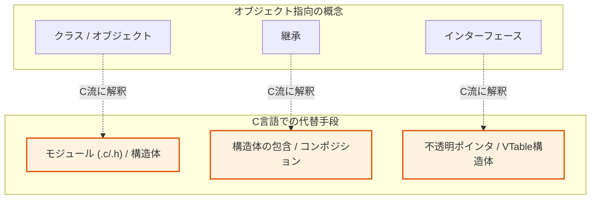

# 第2部 導入：原則編の目的と学習ロードマップ

## 1. 原則編の位置づけ：道具から指針へ

 **第1部「基礎道具編」** では、C言語の7つの基本技術を個別に習得しました。これらは、優れたソフトウェア設計を物理的に形作るための **強力な「道具」** です。

しかし、道具だけがあっても、「 **いつ、なぜ、どのように** 」使うかという「 **設計判断の指針** 」がなければ、複雑な実務課題を解決することはできません。第2部「原則編」の目的は、この **設計判断の羅針盤** を提供することにあります。

私たちは、 **SOLID原則** という5つの普遍的な設計原則を通じて、第1部で習得した技術を統合的に活用し、究極の目標である **保守性、拡張性、変更容易性** を達成するための **思考のフレームワーク** を確立していきます。

## 2. SOLID原則とは何か：変更に強いソフトウェアの指針

 **SOLID原則** は、ロバート C マーチンによって提唱された5つの設計原則の頭文字から成る総称です。これらの原則は、 **ソフトウェアが変更に対してどう応答すべきか** という本質的な課題に対する解答を与えてくれます。

SOLID原則は、以下の5つの抽象的な問いに答えることで、 **変更コストを最小化する** という **目的** を達成するための **指針** を提供します。

| 原則 | 核心となる問い | 設計の指針（アプローチ） |
| --- | --- | --- |
| **S：単一責任** (SRP) | どのように **責任** を分割すべきか？ | モジュールの **変更の理由を一つ** に絞り、凝集度を高める。 |
| **O：開放閉鎖** (OCP) | どのように **拡張性** を確保すべきか？ | 既存コードを **修正せずに機能を拡張** できるように設計する。 |
| **L：リスコフ置換** (LSP) | どのように **契約** の安全を保証するか？ | 共通のインターフェース（関数ポインタ）を持つ異なる実装が、 **呼び出し側を壊さずに差し替え可能** な振る舞いを保つ。 |
| **I：インターフェース分離** (ISP) | どのように不要な **依存** を排除するか？ | クライアントに不要な依存を強制しない。 |
| **D：依存性逆転** (DIP) | どのように **依存の方向** を制御するか？ | 具象（詳細）ではなく **抽象（インターフェース）** に依存させる。 |

これらの原則は相互に補強し合います（例:  **SRPで責任を分離すると、OCPやDIPの適用が容易になる** ）。

### SOLID原則の相互作用

各原則が孤立しているのではなく、互いに支え合っている関係性を表しています。

*   **基盤**
    SRP（責任の分割）がすべての出発点となり、他の原則適用の前提となります。

## 3. 第2部の章構成と学習ロードマップ

 **第2部** では、設計の三本柱である **責任、契約、依存** という軸に沿って、各SOLID原則が **第1部** のどの **道具** （技術）を活用して具体的な設計目標を達成するかを、実践的なコードを通じて解説します。

### 3.1. 原則と技術の論理的連携

本書の核となる論理的構造（技術 ⇒ 原則 ⇒ 目的）は、以下の学習順序で強固に構築されます。

| 章 | 原則・テーマ | 主軸 | 対応する第1部技術（実装手段） | 解決される課題 |
| --- | --- | --- | --- | --- |
| **第8章** | **SRP** (単一責任) | **責任** | **static / 構造体分割 / メモリ管理** | 変更理由の重複による **保守性の低下** |
| **第9章** | **OCP** (開放閉鎖) | **依存** | **関数ポインタ / VTable** | 追加時の修正による **変更の波及** |
| **第10章** | **LSP** (リスコフ置換) | **契約** | **エラー処理 / 一貫した振る舞い** | 契約違反による **信頼性の低下** |
| **第11章** | **ISP** (インターフェース分離) | **契約** | **ヘッダ設計 / 不完全型** | 不要な契約による **不必要な依存** |
| **第12章** | **DIP** (依存性逆転) | **依存** | **関数ポインタ / VTable** | 具象への密結合による **テスト・移植性の欠如** |
| **第13章** | **統合実践** (基本) | **統合** | 全技術の組み合わせ | 中規模システムの設計判断と改善 |
| **第14章** | **統合実践** (応用) | **統合** | 全技術の組み合わせ | 実務課題における設計のトレードオフ |
| **第15章** | **思考の習慣化** | **統合** | 設計の三本柱の統合 | 原則を「使える武器」にする思考プロセス |

#### 3層構造の全体像

本書全体の構成を貫く「道具」「原則」「目的」の階層関係を示しています。

*   **流れ**
    第1部で学んだ道具（下層）を使って、第2部の原則（中層）を実装し、最終的な目標（上層）に到達します。

### 3.2. 各原則の章の統一構成

 **第8章** から **第12章** は、原則の抽象的な概念をC言語の具体的な実装に落とし込むため、以下の構造で構成されます。

#### 学習のステップ

各章での学習プロセスを示しています。理論から入り、C言語での実装を経て、実践的な比較で理解を深めます。

第1部で習得した  **「7つの基礎道具」**  をどう組み合わせるか、その具体的なアプローチを明示します。

1.  **原則の定義と哲学**: その原則が解決する **設計上の根本問題** を理解します。 
2.  **C言語による解釈と道具**: C言語固有の仕組みの中で原則をいかに体現するか。 
3.   **実践パターン Before/After** : 原則を適用する **前と後** のコード比較を通じて、設計の改善を視覚的に捉え、「 **なぜこの設計が保守性/拡張性を高めるのか** 」を論理的に説明します。

## 4. C言語におけるSOLID原則の特殊性と実践

SOLID原則はオブジェクト指向の文脈で語られがちですが、C言語特有の「制約」こそが、むしろ設計判断を明示化し、質の高いソフトウェアを生み出す機会となります。

### 4.1. 「クラス」の不在を「物理的な分離」で補う

C言語にはクラスがありませんが、その代わりに  **.c/.hファイルによるモジュール化**  と、構造体および関数の  **プレフィックス規約**  を活用します。これにより、責任の単位（SRP）を単なるコード上の概念ではなく、物理的なファイル単位で分離することが可能になります。

結果として、不要な情報を外部に見せない厳格な  **カプセル化（ISP）**  を半強制的に実現できる点が大きな利点です。

### 4.2. 「継承」の不在を「抽象的な契約」で補う

継承（Inheritance）の代わりとなるのは、 **構造体の包含（Embedding）** と **コンポジション（合成）** です。

#### 包含とコンポジション・集約の違い

C言語で継承のような「振る舞いの共有」や「多態性」を実現するためには、メモリレイアウト（データの並び方）を意識した設計が必要です。

*   **包含（Embedding）**
    親となる構造体を、子構造体の **先頭メンバ** として値そのままで埋め込む手法です。

*   **なぜ継承の代わりになるのか？**
    C言語の仕様上、構造体の先頭アドレスはその最初のメンバのアドレスと一致します。

これにより、子構造体のポインタを親構造体のポインタへ安全にキャスト（型変換）でき、あたかも親クラスを継承しているかのように振る舞うことができるからです（LSPの実現）。

*   **コンポジション（合成） / 集約（Aggregation）**
    第3章で学んだ通り、構造体のメンバとして「他者」を持つことです。

*   **コンポジション**
    強い結びつき（所有権あり）。
*   **集約**
    弱い結びつき（ポインタ参照のみ）。

これらを使い分けることで、継承よりも柔軟な関係性を構築できます。また、多態性（Polymorphism）については、 **関数ポインタ（およびその構造体）と不透明ポインタ** を組み合わせることで実現します。これらにより、具象実装ではなく抽象的な契約への依存が可能になるのです。

### 4.3. 「手動リソース管理」を「設計の明示化」へ繋げる

ガベージコレクションがないC言語では、 **メモリ管理パターン** や  **`goto cleanup`**  による一括処理が不可欠です。一見手間に思えるこの制約は、実は「責任（誰が消すか）」と「契約（失敗時にリソースはどうなるか）」を設計レベルで突き詰める良い動機となります。

このプロセスを明示的に行うことで、実行時の安全性を設計段階から担保する高い堅牢性が得られます。

#### 解説のポイント：なぜ「制約」が設計を強くするのか

#### **制約を武器にする**

C言語には「クラス」や「継承」という便利な魔法がないからこそ、開発者はファイルやポインタという物理的な手段を使って、自らの意志で設計の境界線を引く必要があります。この「手触り感」のある設計こそが、曖昧さを排除します。

#### **カプセル化の強制**

オブジェクト指向言語ではアクセス制限（private）を付け忘れることがありますが、C言語で不透明ポインタ（不完全型）を使えば、物理的に中身を隠蔽できます。言語機能の不足を逆手に取った、より強力な隠蔽が可能です。

#### **設計の訓練としてのメモリ管理**

自動メモリ管理に頼らないからこそ、オブジェクトの所有権とライフサイクルを設計図に書き込む癖がつきます。これは「責任」の所在を明確にする、極めて高度で本質的な設計訓練になります。

#### OO概念のC言語マッピング

一般的なオブジェクト指向（OO）の概念を、C言語の機能でどのように実現するかの対照表を示しています。

*   **代替手段**
    クラスはモジュール、継承はコンポジション、インターフェースは不透明ポインタとVTableで表現します。

## 本章で必ず理解してほしいことのまとめ

#### 1. 道具から設計指針へのパラダイムシフト
第1部で学んだC言語の技術（道具）を、第2部ではソフトウェアを「変更に強くする」ための設計指針（SOLID原則）として組み合わせる方法を学びます。

#### 2. C言語特有の制約と原則の対応関係
クラスや継承がないC言語でも、ファイルによるモジュール化や不透明ポインタ、包含（Embedding）などを活用することで、高度なオブジェクト指向的設計が可能です。

#### 3. メモリ管理を設計の明示化に活用する
ガベージコレクションがないことは制約ではなく、リソースの所有権と責任を設計段階で明確にする強力な訓練となります。

#### チェックリスト
- [ ] SOLIDの5つの原則が、それぞれ何の課題を解決するか（責任・拡張性・契約・依存）を説明できるか？ 
- [ ] クラスや継承といった概念を、C言語の具体的な技術（ファイル分割、構造体、関数ポインタなど）にマッピングできているか？ 
- [ ] 設計の究極の目的が「保守性・拡張性・変更容易性の向上」であることを常に意識しているか？ 

#### 次章への橋渡し

## 第2部の学習目標：設計力の完成

 **第2部** を完了することで、あなたは単なる「C言語の書き手」から、「 **普遍的な設計原則に基づいて判断を下せる設計者** 」へと昇華することができるでしょう。

| 獲得する能力 | 詳細説明 |
| ---------- | ---------------------------------------------------- |
| **技術統合力** | **第1部** で学んだ7つの技術（道具）を、設計原則（指針）に従って組み合わせ、複雑な課題を解決する力。 |
| **設計判断力** | 技術の選択理由やトレードオフを、原理原則に基づいて **論理的に説明・言語化** できる力。 |
| **変更の予測力** | 仕様変更の要求に対し、既存設計のどこに影響が出るかを実装前に **正確に予測** できる力。 |

それでは、すべての設計判断の基盤となる最初の原則、 **「第2部 第8章 単一責任原則 (SRP) 変更の軸を明確にする設計指針」**  から学習を開始していきましょう。
