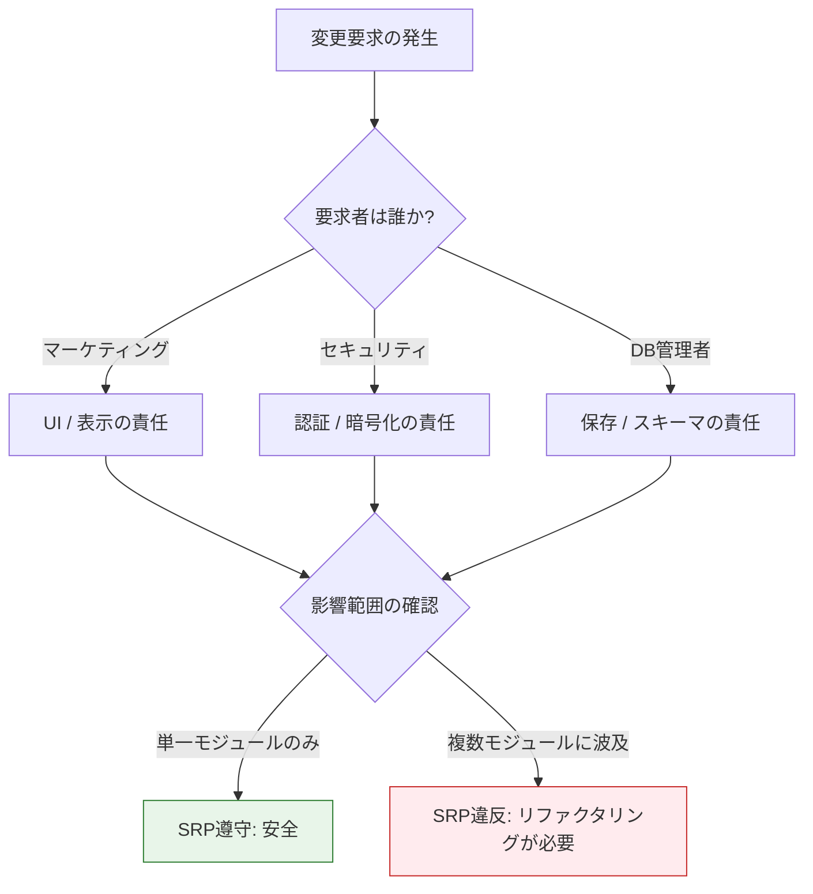
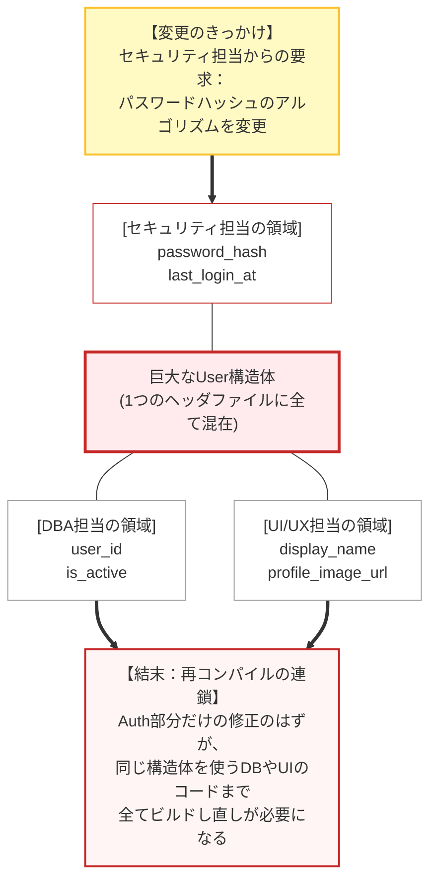
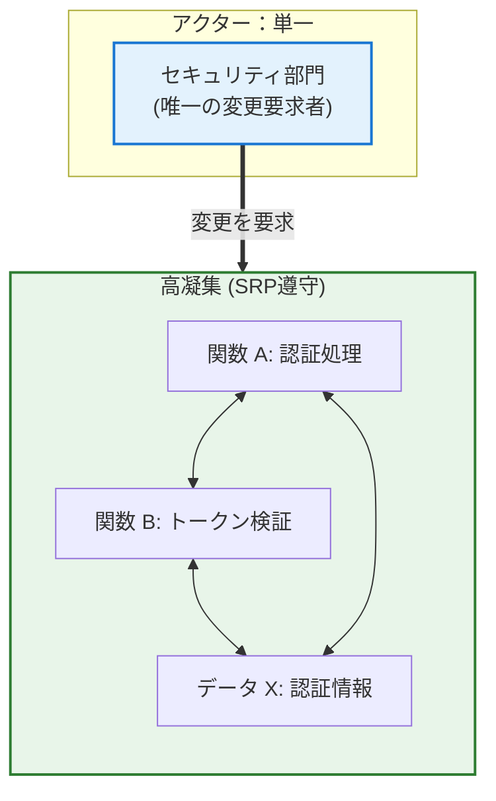
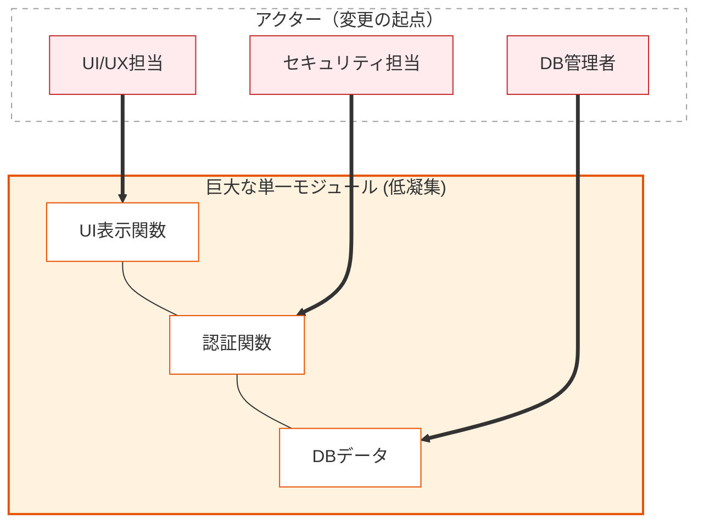
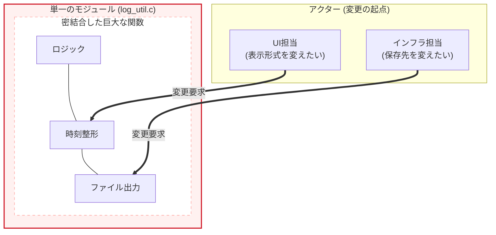
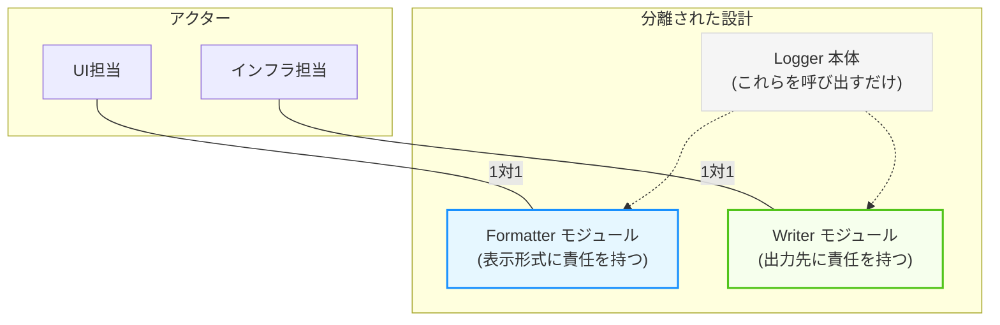

# 第2部 第8章 単一責任原則 (SRP): 変更の軸を明確にする設計指針

 

本章の主題は、設計の三本柱のうち「 **責任** 」の柱にあります。SRPを適用することで、モジュール内部の **凝集度** が最大化され、将来の **変更容易性** という究極の目的が達成されます。

この原則を実現するために、これまで学んだ **道具** （技術）を組み合わせていきましょう。具体的には、 **第1章 `static`による情報隠蔽** 、 **第3章 構造体設計** 、そして **第7章 メモリ管理** が大きな武器になります。

特に `static` による **実装の隠蔽** は、内部の変更を外部に漏らさない（＝責任を閉じ込める）ための、SRPを物理的に実現する鍵となります。

## 1. 原則の哲学と本質

本原則は、三本柱の **『責任』** を極限まで純粋化させるための指針と言えます。

### 1.1. SRPの本質は「変更の理由」の単一化

 **単一責任原則** （Single Responsibility Principle, **SRP**）は、「モジュールは、ただ一つの **変更の理由** を持つべきである」と厳密に定義されます。C言語において「モジュール」は `.c` ファイル全体、あるいは特定の責務を持つ `struct` とそれに関連する関数群を指します。

「変更の理由」とは、コードの変更を要求する **特定の「アクター」** （利害関係者、部門など） **の要求** を意味します。一つのモジュールが複数のアクターの要求で変更される責任を負う場合、一方の変更が他方のロジックに予期せぬ **副作用** （変更の伝播）をもたらし、 **保守性** を著しく低下させることになります。

####  **たとえ話で理解する** 

レストランのキッチンを想像してください。もし一人のシェフが、料理、会計、接客のすべてを担当していたらどうなるでしょうか？

マネージャーが「レシートの形式を変えてほしい」と依頼したとき、その作業のついでに料理の味付けまで変わってしまう（あるいは変えざるを得なくなる）リスクがあります。メニュー担当が「デザートの盛り付けを変えたい」と要求したとき、料理人の道具が会計レジと繋がっているために、会計システムまで修正が必要になるかもしれません。

これが **変更の伝播** です。SRPは、「料理人は料理だけ」「会計係は会計だけ」と役割を分けることで、一つの変更が他に影響しないようにする原則のです。

### 1.2. アクター（変更要求者）とは何か

 **アクター** とは、システムに対して変更を要求する権限と動機を持つ、 **特定の利害関係者または部門** を指します。アクターは組織構造や業務の性質によって異なりますが、以下のような典型的な例があります。

#### アクター別 担当領域と変更要求の例
| アクター（変更要求者） | 担当領域 | 変更要求の具体例 |
| --- | --- | --- |
|  **セキュリティ部門**  | 認証・認可・暗号化 | パスワードハッシュアルゴリズムの変更、二要素認証の追加 |
|  **UI/UXチーム**  | ユーザーインターフェース | 画面レイアウトの変更、表示形式の更新、多言語対応 |
|  **データベース管理者**  | データ永続化・スキーマ | データベーススキーマの変更、インデックス追加、バックアップ戦略 |
|  **ビジネスロジック担当**  | 業務ルール・計算式 | 料金計算式の変更、割引ルールの追加、在庫管理ロジック |
|  **インフラ/運用チーム**  | ログ・監視・デプロイ | ログフォーマットの変更、メトリクス収集方法の変更 |
|  **外部システム連携担当**  | API・プロトコル | 外部APIバージョンアップへの対応、通信プロトコルの変更 |
|  **ハードウェア設計者**  | デバイス制御・レジスタ | I/Oマップの変更、通信速度の変更、省電力仕様の追加 |
|  **コンプライアンス担当**  | 法規制・監査 | GDPR対応、監査ログの追加、データ保持期間の変更 |

####  **複数アクターによる変更の問題** 

一つのC言語ファイル（または関数）の中に、上記の複数のアクターに関わるロジックが混在していたらどうなるでしょうか？例えば、料金計算（ビジネスロジック）の関数の中に、ログ出力（インフラ）やデータベース保存（DBA）の処理が直接書かれている場合、インフラチームから「ログの形式を変えてほしい」と言われただけで、本来関係のない「料金計算」のコードまで修正・再コンパイル・再テストが必要になってしまいます。

これこそが  **「変更の理由が複数ある」**  状態であり、SRPが解決すべき最大の課題と言えるでしょう。

### 1.3. アクターを見極める方法

設計時にアクターを正しく識別するためには、以下の質問を自問自答してみましょう。

####  **質問1：「このコードは誰の要求で変更されるか？」** 

例：ログの出力形式を変えるのは運用チームか、それともビジネスロジック担当か？

####  **質問2：「この変更要求は、他のどの機能に影響を与えないべきか？」** 

例：認証方式の変更が、レポート生成機能に影響を与えてはならない。

####  **質問3：「組織図を見たとき、この変更を承認するのは誰か？」** 

例：表示形式の変更はマーケティング部門が承認し、データベーススキーマの変更はDBA部門が承認する。

####  **質問4：「このコードが変更される頻度とタイミングは他の部分と同じか？」**

例：UIは頻繁に変わるが、暗号化アルゴリズムは数年に一度しか変わらない。



### 1.4. 単一責任への道：アクター分離の手順

アクターを見極めた後、SRPを適用するための体系的な手順は以下の通りです。

####  **手順の全体像** 

 **アクター抽出** : 現状のコードから、誰が変更を要求しうるかを洗い出す。
-  **モジュール分割** : アクターごとに独立したモジュールや構造体を用意する。
-  **境界定義** : 各モジュールが担当するアクターを明文化する。
-  **検証** : 具体的な変更シナリオを使って、影響範囲が閉じているか確認する。

以下、各ステップの詳細を解説します。

#### ステップ1：現状のコードからアクターを抽出する

既存のモジュールや構造体を調査し、装に含まれる **すべての変更要求の種類** をリストアップします。

#### user.h（SRP違反の例）

以下は、SRPに違反している典型的な構造体定義です。この構造体には重大な問題が潜んでいます。

永続化（DBA）、認証（セキュリティ）、表示（UI）という **3つの異なるアクター** の要求に応えているため、変更理由が散逸しているのです。ユーザーに関連する全ての情報を一つの構造体にまとめて定義してしまっています。

（悪い例）「ユーザー」という名詞に関連するデータを無批判に集約しており、アクター（変更要求者）の観点が抜け落ちている状態です。DBA、セキュリティ、UI担当者のいずれかの要求による変更が、他の全てのコードに再コンパイルを強いる「低凝集・高結合」な状態です。

#### user.h
```c
typedef struct {
    // 1. 永続化（データベース管理者の責任）
    unsigned int user_id;
    int is_active;
    // 2. 認証（セキュリティ部門の責任）
    char password_hash[64];
    unsigned int last_login_timestamp;
    // 3. 表示（UI/UXチームの責任）
    char display_name[32];
    char profile_image_url[256];
} User;
```

#### ステップ2：アクターごとにモジュールまたは構造体を分割する

各アクターの責任を独立した単位（Value Object、モジュール）に分離します。

####  **例：`User`構造体の分割** 

- `UserAuth`構造体 → セキュリティ部門の責任
- `UserProfile`構造体 → UI/UXチームの責任
- `User`構造体（統合） → データベース管理者とアプリケーション全体の責任。

#### ステップ3：責任の境界を明確にする

各モジュールが **どのアクターの要求にのみ応答するか** を明文化します。

####  **例：責任の明文化**

- `user_auth.c/h`：セキュリティ部門の要求（認証方式の変更）にのみ応答
- `user_profile.c/h`：UI/UXチームの要求（表示形式の変更）にのみ応答
- `user_entity.c/h`：データベース管理者の要求（永続化方式の変更）にのみ応答。

#### ステップ4：変更シナリオで検証する

具体的な変更要求を想定し、影響範囲が単一のモジュールに閉じることを確認します。

####  **検証例** ：

-  **変更要求** : 「パスワードハッシュのサイズを64から128に変更する」
-  **影響範囲** : `user_auth.c/h`のみ
-  **影響を受けないモジュール** : `user_profile.c/h`、`user_entity.c/h`のクライアントコード 

もし影響範囲が複数のモジュールに及ぶ場合、それはSRP違反の証拠であり、さらなる分離が必要です。

## 2. C言語での実現手段と設計要素

C言語でSRPを適用するための具体的な手段は、 **第1章 `static`キーワード** による **情報隠蔽** と、 **第3章 構造体設計とコンポジション** による **凝集度の高い構造化** です。これらの道具を使い、一つの変更要求が、関連する最小限の`.c`ファイルにのみ閉じるようにコードを分割します。

### 2.1. 構造体とコンポジションによる責任の分離

巨大な構造体（God Struct）は複数の責任を抱え込むため、SRPに違反します。責任ごとに **Value Object (VO)** を定義し、 **コンポジション** によって統合することで、責任を分離します。

#### ❌ SRP違反：巨大な `User` 構造体（原則適用前）

一つの構造体が、永続化、認証、表示という **異なる3つのアクターの変更要求** に応じる責任を負っています。

 **関係するアクター** : 

-  **データベース管理者（DBA）** : `user_id`、`is_active`の変更要求
-  **セキュリティ部門** : `password_hash`、`last_login_timestamp`の変更要求
-  **UI/UXチーム** : `display_name`、`profile_image_url`の変更要求  

 **なぜ違反してはいけないのか** : 例えば、セキュリティ部門から「パスワードハッシュのサイズを128に変更」という要求があったとします。このとき、UI担当が扱う`display_name`などは一切変更がないにもかかわらず、この巨大な **User構造体** を参照しているすべてのソースファイルが再コンパイルの対象となってしまいます。大規模なプロジェクトでは、こうした「無関係な再ビルド」の積み重ねが開発のテンポを阻害し、意図しないデグレード（先祖返り）を招く原因になります。



#### ✅ SRP準拠：Value Object (VO) とコンポジションによる分離（原則適用後）

各Value Objectが **単一のアクター** にのみ応答するように設計されています。また、 **前方宣言** を活用することで、物理的な依存関係（インクルード）も断ち切ります。
#### user_auth.h（セキュリティ部門の責任）

セキュリティ部門の要求（認証方式の変更など）にのみ応答するモジュールです。認証に必要なデータ（ハッシュ、タイムスタンプ）を定義します。

認証ロジックに関わるデータのみを凝集させています。二要素認証の追加やポリシー変更時、ここだけを修正すれば良くなる構造です。

#### user_auth.h
```c
#ifndef USER_AUTH_H
#define USER_AUTH_H
// 構造体タグ(UserAuth)を定義し、前方宣言可能な状態にする
typedef struct UserAuth {
    char password_hash[64];
    unsigned int last_login_timestamp;
} UserAuth;
#endif
```

#### user_profile.h（UI/UXチームの責任）

UI/UXチームの要求（表示形式の変更など）にのみ応答するモジュールです。ユーザーの表示情報（名前、画像URL）を定義します。

表示に関わるデータのみを独立させています。プロフィール画像の仕様変更などが他に影響を及ぼしません。

#### user_profile.h
```c
#ifndef USER_PROFILE_H
#define USER_PROFILE_H

typedef struct UserProfile {
    char display_name[32];
    char profile_image_url[256];
} UserProfile;
#endif
```

#### user_entity.h（統合の責任）

データベース管理者とアプリケーション設計者の要求（永続化、ライフサイクル）に応答するモジュールです。IDとステータスを持ち、他のコンポーネントへのポインタを保持します。

前方宣言を活用し、具体的な構成要素（Auth, Profile）のヘッダをインクルードせずにポインタのみを保持することで、物理的な依存を切断します。構成要素の変更による再コンパイルを防ぐ、堅牢な統合構造と言えます。

#### user_entity.h
```c
#ifndef USER_ENTITY_H
#define USER_ENTITY_H
// ヘッダをインクルードせず、前方宣言のみを行う
// これにより、UserAuthの中身が変わっても、このヘッダは影響を受けない（物理依存の切断）
typedef struct UserAuth UserAuth;
typedef struct UserProfile UserProfile;
typedef struct {
    unsigned int user_id;
    int is_active;
    // 不完全型へのポインタとして保持する
    // 実体のサイズを知る必要がないため、インクルードが不要になる
    UserAuth* auth;
    UserProfile* profile;
} User;
#endif
``````mermaid
    graph TB
    Trigger{"変更の要求<br/>パスワード仕様の変更"}

    Auth["修正箇所：UserAuth構造体<br/>認証/セキュリティロジックのみ"]

    Trigger ==>|"影響あり"| Auth

    User["影響なし：User構造体<br/>前方宣言のみのため再ビルド不要"]
    Profile["影響なし：UserProfile構造体<br/>表示の責務は不変"]

    Auth -.->|"変更の影響なし"| User
    Auth -.->|"変更の影響なし"| Profile

    style Trigger fill:#fff9c4,stroke:#fbc02d
    style Auth fill:#ffcdd2,stroke:#c62828,stroke-width:2px
    style User fill:#e3f2fd,stroke:#1976d2
    style Profile fill:#f5f5f5,stroke:#9e9e9e
```

プロファイル画像URLの仕様が変わっても、`UserAuth` モジュールや認証ロジックは **一切影響を受けません** 。さらに、前方宣言を用いたことで、`user_auth.h` の変更が `user_entity.h` をインクルードするファイルに波及することも防ぐことができるのです。

## 2.2. 凝集度 (Cohesion) の最大化

SRPを遵守し、「変更の理由」を単一に絞り込むことは、結果としてモジュール内の要素間の関連性（ **凝集度** ）を最大化することに繋がります。 **高凝集度** とは、モジュール内のすべての要素が、その単一の責任を果たすために緊密に連携している状態です。SRPは高凝集度を追求するための最も強力な設計指針です。 **低凝集度** とは、モジュールが複数の無関係なタスクを抱え込んでいる状態です。これは「変更の理由」が複数あることを意味し、可読性と保守性を著しく損ないます。

### 高凝集 (High Cohesion) - SRP遵守のモジュール

関連するデータと機能が密接に結びつき、単一の明確な責任（この場合は認証）を持っている状態です。



### 低凝集 (Low Cohesion) - SRP違反のモジュール

UI、ビジネスロジック、データアクセスなど、本来分離されるべき複数の責任が混在し、結びつきが希薄な状態です。



### 2.3. 変更の伝播 (Change Propagation) の抑制

SRPに違反した設計の最大のデメリットは、 **変更の伝播** が発生することです。

###  **具体例で理解する** 

UI担当者から「ユーザー名の表示を大文字にする」という要求があったとします。もし`User`構造体内の`display_name`フィールドを変更した場合：

-  **認証モジュール** （セキュリティ部門の管轄）
-  **永続化モジュール** （DBA部門の管轄）

これらの全く関係のないロジックが依存している`.c`ファイル全体を再コンパイルする必要が生じます。

最悪の場合、予期せぬ実行時エラーを引き起こす可能性もあります。SRPは、この無関係な変更による連鎖的な影響を断ち切り、システムの **安定性** を向上させます。

## 3. 実践パターン：SRPを実現する三つの型

SRPをC言語で実践する際には、いくつかの典型的なパターンが存在します。これらは、システムの特性や処理の流れに応じて使い分けることで、効果的に責任を分離することができます。

ここでは、代表的な3つのパターンのうち、まず **パイプライン処理** における責任分担のパターンから見ていきましょう。

### 3.1. 実践パターン1：処理フェーズの分離（パイプライン原則）

#### パイプライン原則とは

Unixのパイプライン（`|`）のように、処理を「入力→加工→出力」といった独立したフェーズに分割し、それぞれを専門のモジュールに担当させる考え方です。各フェーズは「前のフェーズからデータを受け取り、次のフェーズへ渡す」ことだけに集中します。

メッセージの **整形** （UI担当の責任）と **ファイル書き込み** （I/O担当の責任）という異なる変更理由を持つアクターの領域に責任を分離します。

#### ❌ 原則適用前 (SRP違反)

この例では、実践的なシステムを想定して設計原則の適用方法を示します。具体的なユースケースに基づいてコードを解説することで、抽象的な原則が実際のコードにどのように落とし込まれるかを理解できます。

#### 設計課題

時刻の **表示形式**（UI担当が変更）とログの **永続化先**（インフラ担当が変更）が1つの関数に混在しています。

##### なぜ問題なのか

 **2つのアクターが同じコードを変更する理由を持つ** ため、一方の変更が他方に予期せぬ影響を与えます。

| アクター | 変更要求 | 影響範囲 |
| --- | --- | --- |
|  **UI担当**  | 時刻を`HH:MM:SS`から`YYYY-MM-DD HH:MM:SS`に変更 | `log_message`全体を修正・テスト |
|  **インフラ担当**  | ログ出力先をファイルから`syslog`に変更 | `log_message`全体を修正・テスト |

#### logger_bad.c

SRP違反の例として、現在時刻の取得、文字列への整形、ファイルへの書き込みを一つの関数内で連続して行っているコードを示します。

（悪い例）手続き型的に「やるべきこと」を単純に羅列しています。変更理由が複数（UI変更、インフラ変更）存在するため、保守性が低いです。

#### logger_bad.c
```c
#include <stdio.h>
#include <time.h>
#include <string.h>
// 時刻整形とファイル書き込みの2つの責任が混在

void log_message(const char* message, int level) {
    char timestamp[32];
    time_t now = time(NULL);
    struct tm* tm_info = localtime(&now);
    // 責任1: 時刻の表示形式を決定（UI担当の領域）
    strftime(timestamp, sizeof(timestamp), "%H:%M:%S", tm_info);
    // 責任2: ファイル出力処理（インフラ担当の領域）
    FILE* log_file = fopen("app.log", "a");

    if (log_file == NULL) {
        fprintf(stderr, "Error: Cannot open log file.\n");

        return;
    }
    fprintf(log_file, "[%s] Level %d: %s\n", timestamp, level, message);
    fclose(log_file);
}

int main(void) {
    printf("=== SRP違反コードの実行 ===\n");
    log_message("Application started", 1);
    log_message("Processing data", 2);
    log_message("Application finished", 1);
    printf("ログファイル app.log に出力されました\n");

    return 0;
}
```

#### 実行結果（適用前）

 **実行結果** : プログラムは動作しますが、コード内部では責任が混在しています。

#### 実行結果
```c
=== SRP違反コードの実行 ===
ログファイル app.log に出力されました
```

#### app.log の内容

 **ログ内容** : 出力されたログファイルの内容です。整形ロジックと出力ロジックが密結合しているため、どちらかの変更が他方に影響します。

#### app.log
```c
[14:23:15] Level 1: Application started
[14:23:15] Level 2: Processing data
[14:23:15] Level 1: Application finished
```

##### 問題を示す図

単一のモジュールに複数のアクターからの変更要求が集中している状態です。 **密結合** : ロジック、整形、出力が一体化しており、切り離せません。



#### ✅ 原則適用後 (SRP準拠)

#### 責任の分割
| モジュール | 責任 | 変更を要求するアクター |
| --- | --- | --- |
|  **Formatter**  | 時刻やレベルの表示形式を決定 | UI担当 |
|  **Writer**  | 整形済みデータの永続化先を決定 | インフラ担当 |
|  **Logger**  | 処理フローの制御（委譲のみ） | 設計担当（ほぼ不変） |


#### log_formatter.h

ログの整形処理を行うインターフェース定義です。バッファとメッセージを受け取り、整形された文字列を書き込みます。

整形ロジックを抽出するための契約定義です。出力先に関心を持たない純粋な加工関数と言えます。

#### log_formatter.h
```c
#ifndef LOG_FORMATTER_H
#define LOG_FORMATTER_H
#include <stddef.h>
// 戻り値: 実際に書き込まれた文字数（snprintf準拠ではなく、成功した書き込み量）
// バッファ不足の場合は、バッファに収まる範囲で書き込み、その長さを返す仕様とします。
size_t log_formatter_format(char* buffer, size_t max_len,
    const char* message, int level);
#endif
```

#### log_formatter.c

現在時刻を取得し、指定されたフォーマットで文字列を生成します。ログの整形処理のみに責任を持ち、出力先や制御フローには関与しません。

時刻表示形式の変更があっても、このモジュールのみを修正すれば済みます。

#### log_formatter.c
```c
#include "log_formatter.h"
#include <stdio.h>
#include <time.h>

size_t log_formatter_format(char* buffer, size_t max_len,
    const char* message, int level)
{
    time_t now = time(NULL);
    struct tm* tm_info = localtime(&now);
    char timestamp[32];
    // 時刻表示形式のみに責任を持つ
    strftime(timestamp, sizeof(timestamp), "%H:%M:%S", tm_info);
    // 【設計的意図】
    // snprintfは標準では「書き込むはずだった（必要な）長さ」を返しますが、
    // ここでは呼び出し元の利便性を考慮し、「実際にバッファに収まった有効な文字数」を返します。
    // これにより、呼び出し元は戻り値をそのままデータサイズとして扱えます。
    int written = snprintf(buffer, max_len, "[%s] Level %d: %s",
        timestamp, level, message);

    if (written < 0) return 0; // エラー

    if ((size_t)written >= max_len) return max_len - 1; // 切り詰め発生時は最大長-1を返す

    return (size_t)written;
}
```

#### file_log_writer.h

ログの出力処理を行うインターフェース定義です。文字列を受け取り、永続化します。
出力先の詳細（ファイル、DB、syslog等）を抽象化し、出力先の変更要求を吸収します。

#### file_log_writer.h
```c
#ifndef FILE_LOG_WRITER_H
#define FILE_LOG_WRITER_H

int file_log_writer_write(const char* formatted_message);
#endif
```

#### file_log_writer.c

ログの出力処理の実装です。ファイルをオープンし、文字列を追記し、クローズします。
インフラ担当の領域（どこに保存するか）をカプセル化しています。ログのフォーマットが変わっても、このファイルの修正は不要です。

#### file_log_writer.c
```c
#include "file_log_writer.h"
#include <stdio.h>

int file_log_writer_write(const char* formatted_message) {
    // 出力先のみに責任を持つ
    // 注: 実務ではファイルハンドルの開閉コストを避けるため構造体で管理しますが、
    // ここでは責任の分離を示すため簡易実装としています。
    FILE* log_file = fopen("app.log", "a");

    if (log_file == NULL) return -1;
    fprintf(log_file, "%s\n", formatted_message);
    fclose(log_file);

    return 0;
}
```

#### logger.h

フォーマッターとライターを調整し、ログ出力プロセス全体を制御します。ログ出力の公開APIを定義します。
クライアントに対して、背後の複雑な構成（整形と出力の分離）を隠蔽します。クライアントは「ログを出す」ことだけに関心を持てば良くなるのです。

#### logger.h
```c
#ifndef LOGGER_H
#define LOGGER_H

void log_message(const char* message, int level);
#endif
```

#### logger.c

処理フローの制御のみに責任を持ち、整形と出力を適切なモジュールに委譲します。バッファを用意し、整形モジュールを呼び出し、その結果を出力モジュールに渡します。

ロジック（制御）と詳細（整形・出力）が分離されています。新しい整形/出力モジュールへの差し替えが容易な構造と言えます。

#### logger.c
```c
#include "log_formatter.h"
#include "file_log_writer.h"
// 処理フローの制御のみに責任を持つ

void log_message(const char* message, int level) {
    char buffer[256];
    // 委譲1: 整形はFormatterへ
    size_t len = log_formatter_format(buffer, sizeof(buffer), message, level);

    if (len > 0) {
        // 委譲2: 書き込みはWriterへ
        file_log_writer_write(buffer);
    }
}
```

#### main.c

詳細なロジックを知ることなく、高レベルなAPIを利用してログを出力しています。シンプルで使用感が伝わる実装例です。

#### main.c
```c
#include "logger.h"
#include <stdio.h>

int main(void) {
    printf("=== SRP準拠コードの実行 ===\n");
    log_message("Application started", 1);
    log_message("Processing data", 2);
    log_message("Application finished", 1);
    printf("ログファイル app.log に出力されました\n");

    return 0;
}
```

#### 実行結果（適用後）

内部構造は大きく変わりましたが、外部からの振る舞い（ログ出力）は以前と同じであり、機能が維持されていることがわかるはずです。

#### 実行結果
```c
=== SRP準拠コードの実行 ===
ログファイル app.log に出力されました
```

#### app.log の内容（適用前と同じ）

出力結果も以前と完全に同一です。これこそがリファクタリング（振る舞いを変えずに内部構造を改善する）の成功の証拠と言えます。

#### 実行結果
```c
[14:23:15] Level 1: Application started
[14:23:15] Level 2: Processing data
[14:23:15] Level 1: Application finished
```

#### 改善を示す図

アクターごとにモジュールが分割され、変更の影響が局所化された状態です。責務の分離**: UI担当はFormatterのみ、インフラ担当はWriterのみに関与します。



#### 効果：変更シナリオごとの影響範囲
| 変更シナリオ                            | 適用前の影響範囲                | 適用後の影響範囲                                           |
| --------------------------------- | ----------------------- | -------------------------------------------------- |
|  **時刻形式を`YYYY-MM-DD HH:MM:SS`に変更**  | `log_message`全体を修正・再テスト | `log_formatter.c`のみ修正                              |
|  **出力先をsyslogに変更**                 | `log_message`全体を修正・再テスト | `file_log_writer.c`のみ修正（または新しい`syslog_writer.c`追加） |
|  **ログレベルの表記を変更**                   | `log_message`を修正        | `log_formatter.c`のみ修正                              |
|  **新しい出力先（DB）を追加**                 | `log_message`にif文を追加    | 新しい`db_log_writer.c`を追加するだけ                        |
