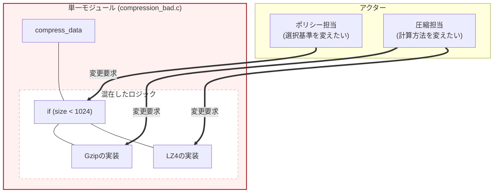
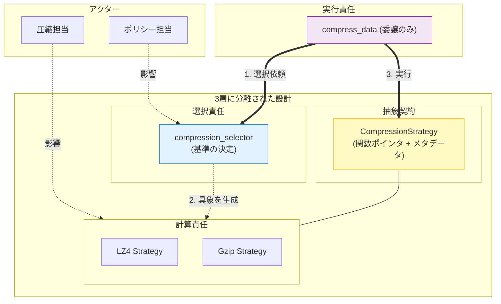
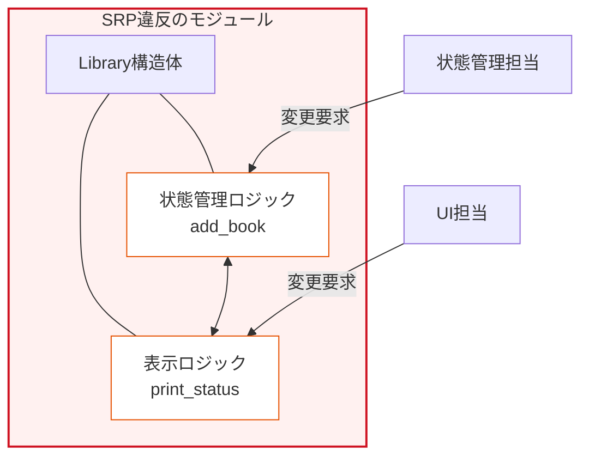
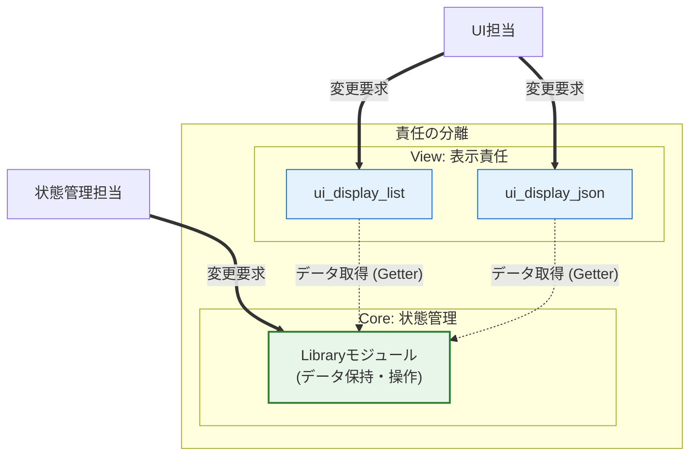

### 3.2. 実践パターン2：アルゴリズムの選択と実行の責任分離

**「何を実行するか」（Strategy）** と **「どれを使うか」（Selector）** の責任を、**第2章 関数ポインタ**を用いて分離します。

### ❌ 原則適用前 (SRP違反)

#### 設計課題

アルゴリズムの**計算ロジック**（圧縮担当）と**選択ロジック**（ポリシー担当）が1つの関数に混在しています。

##### なぜ問題なのか

**2つのアクターが同じコードを変更する理由を持つ**ため、一方の変更が他方に影響します。

| アクター | 変更要求 | 影響範囲 |
| --- | --- | --- |
| **ポリシー担当** | 選択基準を`1024`から`2048`に変更 | `compress_data`全体を修正 |
| **圧縮担当** | LZ4のバッファサイズを最適化 | `compress_data`全体を修正 |

### compression_bad.c

**このファイルの役割**:
SRP違反の例を示すコードです。
**処理の内容:** データのサイズに基づいてLZ4かGzipかを選び、圧縮を実行します。
**設計的意図:** （悪い例）判断と実行を一つの関数に詰め込んでいます。
**評価:** ポリシー変更とアルゴリズム変更が衝突するため、SRP違反です。

#### compression_bad.c

```c
#include <stdio.h>
#include <string.h>

// 選択ロジックと計算ロジックの2つの責任が混在
int compress_data(const char* data, int size, char* output, int output_size) {
    // 責任1: 選択基準の決定（ポリシー担当の領域）
    if (size < 1024) {
        // 責任2: LZ4の具体的な計算処理（圧縮担当の領域）
        printf("Executing LZ4 compression for size %d\n", size);
        // LZ4固有の処理...
        int compressed_size = size / 2; // 簡略化
        memcpy(output, data, compressed_size);
        return compressed_size;
    } else {
        // 責任2: Gzipの具体的な計算処理（圧縮担当の領域）
        printf("Executing Gzip compression for size %d\n", size);
        // Gzip固有の処理...
        int compressed_size = size / 3; // 簡略化
        memcpy(output, data, compressed_size);
        return compressed_size;
    }
}
```

これらの機能を呼び出すクライアントコードです。

**クライアント実装:** 以下のコードで問題箇所を呼び出し、動作を確認します。

#### compression_bad.c (続き)
```c
int main(void) {
    printf("=== SRP違反コードの実行 ===\n\n");
    
    char input_small[500];
    char input_large[2000];
    char output[2000];
    
    memset(input_small, 'A', sizeof(input_small));
    memset(input_large, 'B', sizeof(input_large));
    
    printf("--- 小サイズデータ（500バイト）の圧縮 ---\n");
    int result1 = compress_data(input_small, sizeof(input_small), output, sizeof(output));
    printf("圧縮後のサイズ: %d バイト\n\n", result1);
    
    printf("--- 大サイズデータ（2000バイト）の圧縮 ---\n");
    int result2 = compress_data(input_large, sizeof(input_large), output, sizeof(output));
    printf("圧縮後のサイズ: %d バイト\n", result2);
    
    return 0;
}
```

### 実行結果（適用前）

**実行結果:** 以下のように、想定通りの動作をすることを確認します。


#### 実行結果
```c
=== SRP違反コードの実行 ===

小サイズデータ（500バイト）の圧縮 ---
Executing LZ4 compression for size 500
圧縮後のサイズ: 250 バイト

大サイズデータ（2000バイト）の圧縮 ---
Executing Gzip compression for size 2000
圧縮後のサイズ: 666 バイト
```

##### 問題を示す図

**この図が示すもの**:
2つの異なるアクター（変更要求者）が、それぞれ異なる理由で同一の関数（`compress_data`）に変更を要求している危険な状態です。

**注目ポイント**:

* **変更の衝突**: 「選択基準」を変えたい人と「計算方法」を変えたい人が、同じファイルを編集することになります。



### ✅ 原則適用後 (SRP準拠)

#### 責任の分割

| モジュール | 責任 | 変更を要求するアクター |
| --- | --- | --- |
| **Strategy** | 各アルゴリズムの計算処理 | 圧縮担当 |
| **Selector** | データサイズに基づく選択基準 | ポリシー担当 |
| **Processor** | 選択されたStrategyの実行 | 設計担当（ほぼ不変） |

##### 完全なコード

### compression_strategy.h (抽象契約)

**このファイルの役割**:
すべての圧縮アルゴリズムが従うべき契約定義です。
**処理の内容:** 関数ポインタとメタデータ（アルゴリズム名）を持つ構造体を定義します。
**設計的意図:** 具象アルゴリズムを知らなくても、このインターフェースを通じて実行できるようにします（多態性）。
**評価:** 新しいアルゴリズムを追加しても、この契約を使う側には影響しません。

#### compression_strategy.h

```c
#ifndef COMPRESSION_STRATEGY_H
#define COMPRESSION_STRATEGY_H

// 抽象的な契約: 実行の責任を持つ関数ポインタ型
typedef int (*CompressFunc)(const char* data, int size, 
                            char* output, int output_size);

// Strategy構造体: アルゴリズム名と実行関数（関数ポインタ）を統合
// 単なる関数ポインタではなく構造体にする理由:
// 「実行する」という振る舞いと、「そのアルゴリズムは何か」というメタデータを
// 一つの単位（責任）として扱うため。
typedef struct {
    const char* algorithm_name;
    CompressFunc compress;
} CompressionStrategy;

#endif
```

### lz4_strategy.h

**このファイルの役割**:
LZ4圧縮アルゴリズムのファクトリ関数の定義です。
**処理の内容:** `lz4_strategy_create` を公開します。
**設計的意図:** 実装詳細を隠蔽するためのヘッダです。
**評価:** 利用側は `CompressionStrategy` を受け取るだけで、中身を知る必要がありません。

#### lz4_strategy.h

```c
#ifndef LZ4_STRATEGY_H
#define LZ4_STRATEGY_H

#include "compression_strategy.h"

CompressionStrategy lz4_strategy_create(void);

#endif
```

### lz4_strategy.c

**このファイルの役割**:
LZ4圧縮の具体的な実装です。
**処理の内容:** データを圧縮し、その関数ポインタを含む `CompressionStrategy` を返します。
**設計的意図:** `static` 関数でロジックをファイル内に閉じ込め、外部にはインターフェースのみを提供します。
**評価:** LZ4の実装変更は、このファイル内だけに閉じています。

#### lz4_strategy.c

```c
#include "lz4_strategy.h"
#include <stdio.h>
#include <string.h>

// staticを用いて実装をこのファイル内に閉じ込める（責任の隠蔽）
static int lz4_compress_impl(const char* data, int size, 
                             char* output, int output_size) 
{
    printf("  [Detail] Using LZ4 engine...\n");
    
    // LZ4固有の高速圧縮処理
    int compressed_size = size / 2;  // 簡略化
    if (compressed_size > output_size) return -1;
    
    memcpy(output, data, compressed_size);
    return compressed_size;
}

// Strategy構造体を生成（関数ポインタを注入）
CompressionStrategy lz4_strategy_create(void) 
{
    return (CompressionStrategy){
        .algorithm_name = "LZ4 Fast Compression",
        .compress = lz4_compress_impl  // 実装を注入
    };
}
```

### gzip_strategy.h
**このファイルの役割**:
Gzip圧縮アルゴリズムのインターフェース定義です。
#### gzip_strategy.h

```c
#ifndef GZIP_STRATEGY_H
#define GZIP_STRATEGY_H

#include "compression_strategy.h"

CompressionStrategy gzip_strategy_create(void);

#endif
```

### gzip_strategy.c
**このファイルの役割**:
Gzip圧縮の高圧縮率な実装です。
#### gzip_strategy.c

```c
#include "gzip_strategy.h"
#include <stdio.h>
#include <string.h>

// Gzipの計算ロジックのみに責任を持つ
static int gzip_compress_impl(const char* data, int size, 
                               char* output, int output_size) 
{
    printf("  [Detail] Using Gzip engine...\n");
    
    // Gzip固有の高圧縮処理
    int compressed_size = size / 3;  // 簡略化
    if (compressed_size > output_size) return -1;
    
    memcpy(output, data, compressed_size);
    return compressed_size;
}

CompressionStrategy gzip_strategy_create(void) 
{
    return (CompressionStrategy){
        .algorithm_name = "Gzip High Ratio",
        .compress = gzip_compress_impl  // 実装を注入
    };
}
```

### compression_selector.h
**このファイルの役割**:
データサイズに基づいて適切な圧縮戦略を選択するインターフェースです。
#### compression_selector.h

```c
#ifndef COMPRESSION_SELECTOR_H
#define COMPRESSION_SELECTOR_H

#include "compression_strategy.h"

CompressionStrategy compression_selector_select(int data_size);

#endif
```

### compression_selector.c
**このファイルの役割**:
戦略選択のロジック（ポリシー）を実装します。
#### compression_selector.c

```c
#include "compression_selector.h"
#include "lz4_strategy.h"
#include "gzip_strategy.h"

// 選択基準のみに責任を持つ
CompressionStrategy compression_selector_select(int data_size) 
{
    // ポリシー: 小さいデータは速度優先、大きいデータは圧縮率優先
    if (data_size < 1024) {
        return lz4_strategy_create();   // LZ4を選択
    } else {
        return gzip_strategy_create();  // Gzipを選択
    }
}
```

### compressor.h
**このファイルの役割**:
圧縮処理全体のファサードとなるインターフェースです。
#### compressor.h

```c
#ifndef COMPRESSOR_H
#define COMPRESSOR_H

int compress_data(const char* data, int size, char* output, int output_size);

#endif
```

### compressor.c (実行制御)

**このファイルの役割**:
選択された戦略を実行する、具体的な処理の流れを制御します。

#### compressor.c
```c
#include "compressor.h"
#include "compression_selector.h"
#include <stdio.h>

// 選択されたStrategyの実行のみに責任を持つ
int compress_data(const char* data, int size, char* output, int output_size) 
{
    // 1. Selectorに選択を委譲
    CompressionStrategy strategy = compression_selector_select(size);
    
    // 構造体のメンバ（メタデータ）を利用してログ出力
    printf("[Compressor] Strategy Selected: %s\n", strategy.algorithm_name);

    // 2. 選択されたStrategyを実行（具体的な実装は知らない）
    return strategy.compress(data, size, output, output_size);
}
```

### main.c

**クライアントコード:** SRP準拠のシステムを利用します。
**処理の内容:** 異なるサイズのデータを圧縮し、自動的に適切なアルゴリズムが選択されることを確認します。
**設計的意図:** 利用側は「圧縮したい」という意図だけを伝え、詳細な選択ロジックを知る必要がありません。
**評価:** クライアントコードがシンプルになります。

#### main.c

```c
#include "compressor.h"
#include <stdio.h>
#include <string.h>

int main(void) {
    printf("=== SRP準拠コードの実行 ===\n\n");
    
    char input_small[500];
    char input_large[2000];
    char output[2000];
    
    memset(input_small, 'A', sizeof(input_small));
    memset(input_large, 'B', sizeof(input_large));
    
    printf("--- 小サイズデータ（500バイト）の圧縮 ---\n");
    int result1 = compress_data(input_small, sizeof(input_small), output, sizeof(output));
    printf("圧縮後のサイズ: %d バイト\n\n", result1);
    
    printf("--- 大サイズデータ（2000バイト）の圧縮 ---\n");
    int result2 = compress_data(input_large, sizeof(input_large), output, sizeof(output));
    printf("圧縮後のサイズ: %d バイト\n", result2);
    
    return 0;
}
```

### 実行結果（適用後）

**実行結果:** Strategyパターン適用後も、外部からの振る舞いは変わらず、正しく動作していることが確認できます。


#### 実行結果
```c
=== SRP準拠コードの実行 ===

小サイズデータ（500バイト）の圧縮 ---
[Compressor] Strategy Selected: LZ4 Fast Compression
  [Detail] Using LZ4 engine...
圧縮後のサイズ: 250 バイト

大サイズデータ（2000バイト）の圧縮 ---
[Compressor] Strategy Selected: Gzip High Ratio
  [Detail] Using Gzip engine...
圧縮後のサイズ: 666 バイト
```

#### 改善を示す図

**この図が示すもの**:
「選択責任」と「計算責任」が物理的に分離され、それぞれが独立して変更可能になった状態です。

**注目ポイント**:

* **3層構造**: 「選択(Selector)」「契約(Interface)」「実装(Strategy)」が綺麗に分かれています。



##### 効果：変更シナリオごとの影響範囲

| 変更シナリオ | 適用前の影響範囲 | 適用後の影響範囲 |
| --- | --- | --- |
| **選択基準を1024から2048に変更** | `compress_data`全体を修正 | `compression_selector.c`のみ修正 |
| **LZ4の圧縮率を改善** | `compress_data`内のLZ4部分を修正 | `lz4_strategy.c`のみ修正 |
| **Gzipのバッファサイズを最適化** | `compress_data`内のGzip部分を修正 | `gzip_strategy.c`のみ修正 |
| **新アルゴリズム（Zstd）を追加** | `compress_data`にelse-if分岐を追加 | 新しい`zstd_strategy.c`を追加し、`compression_selector.c`に1行追加するだけ |

### 3.3. 実践パターン3：状態管理とI/Oロジックの分離

ここでポイントとなるのは、第5章で学んだ「契約の最小化」と第4章の「不完全型」を応用し、**内部の状態管理（Model）**と**外部への出力（View）**を物理的に切り分けることです。

**システム概要**:

この例では、実践的なシステムを想定して設計原則の適用方法を示します。具体的なユースケースに基づいてコードを解説することで、抽象的な原則が実際のコードにどのように落とし込まれるかを理解できます。

「書籍データをどう管理するか」と「それをどう画面に表示するか」は、変更の理由が全く異なります。これらを分離することで、UIの変更（HTML化、JSON化など）がライブラリのコアロジックに一切影響を与えない設計を目指します。

### ❌ 原則適用前 (SRP違反)

#### 設計課題

`Library`構造体と付随する関数が、**書籍リストの管理（メモリ管理・整合性）**と**画面表示（出力・整形）**という、変更理由の異なる2つの責任を同時に抱え込んでいます。

##### なぜ問題なのか

**2つのアクター（役割）が同じコードを変更する理由を持つ**ため、一箇所の修正が意図しないバグや再テストの増大を招きます。

| アクター | 変更要求の例 | 影響範囲 |
| --- | --- | --- |
| **状態管理担当** | 書籍の重複登録を禁止したい | `library.c` のロジック全体を修正・検証 |
| **UI担当** | 表示をリスト形式からJSON形式に変えたい | `library.c` のロジック全体を修正・検証 |

### library_bad.c

**このファイルの役割**:
SRP違反の例を示すコードです。
**処理の内容:** 書籍データのメモリ管理と、そのリスト表示を一つの構造体とファイルで管理しています。
**設計的意図:** （悪い例）データと表示を混在させ、変更アクターを曖昧にしています。
**評価:** データ構造を変えると表示も壊れ、表示を変えるとデータ管理も再ビルドが必要になります。

#### library_bad.c

```c
#include <stdio.h>
#include <stdlib.h>
#include <string.h>

typedef struct {
    char title[100];
    char isbn[20];
} Book;

// 状態管理とUI表示の2つの責任が1つの構造体に混在
typedef struct {
    Book** books;
    size_t count;
    size_t capacity;
} Library;

Library* library_create(void) {
    Library* lib = malloc(sizeof(Library));
    if (!lib) return NULL;
    lib->books = malloc(sizeof(Book*) * 10);
    lib->count = 0;
    lib->capacity = 10;
    return lib;
}

// 責任1: 状態管理（書籍の追加ロジック）
void library_add_book(Library* lib, const char* title, const char* isbn) {
    if (!lib) return;
    if (lib->count >= lib->capacity) {
        // バグの温床：realloc失敗時のハンドリングが甘く、
        // capacityだけ増えてメモリが増えない可能性がある実装
        lib->capacity *= 2;
        Book** temp = realloc(lib->books, sizeof(Book*) * lib->capacity);
        if (!temp) return; 
        lib->books = temp;
    }
    Book* book = malloc(sizeof(Book));
    if (!book) return;

    strncpy(book->title, title, sizeof(book->title) - 1);
    book->title[sizeof(book->title) - 1] = '\0';
    
    strncpy(book->isbn, isbn, sizeof(book->isbn) - 1);
    book->isbn[sizeof(book->isbn) - 1] = '\0';
    
    lib->books[lib->count++] = book;
}
```

UI表示（責任2）の実装です。状態管理ロジックと同じファイルに混在しているのが問題です。

#### library_bad.c (続き)
```c
// 責任2: UI表示（特定のフォーマットでの出力）
void library_print_status(const Library* lib) {
    if (!lib) return;
    printf("--- Library Status ---\n");
    printf("Total: %zu books\n", lib->count);
    for (size_t i = 0; i < lib->count; i++) {
        printf("[%zu] %s (ISBN: %s)\n", i + 1, lib->books[i]->title, lib->books[i]->isbn);
    }
}

int main(void) {
    Library* lib = library_create();
    library_add_book(lib, "Clean Code", "978-0131103627");
    library_print_status(lib); 
    return 0;
}
```

### 問題を示す図



### ✅ 原則適用後 (SRP準拠)

### 責任の分割

| モジュール | 責任 | 変更を要求するアクター |
| --- | --- | --- |
| **Library** | 書籍リストの管理。データの提供に徹し、I/Oは行わない。 | 状態管理担当 |
| **UI** | データの見せ方を決定。Libraryから情報を取得して表示する。 | UI担当 |
| **Book** | データ構造の定義（Value Object）。両者の共通言語。 | 設計担当 |

### 完全なコード

以下に、責任を適切に分割した実装例を示します。

### 共通データ型の定義

**このファイルの目的**:
システムの基盤となるデータ構造（Value Object）を定義し、各モジュール間の共通言語として機能させます。

#### book.h
```c
#ifndef BOOK_H
#define BOOK_H

typedef struct {
    char title[100];
    char isbn[20];
} Book;

#endif
```

### 状態管理モジュールの公開API

**このファイルの目的**:
`Library` の操作インターフェースを定義します。不完全型を使用することで内部構造を隠蔽し、UI層が内部データに直接依存することを防ぎます。

#### library.h
```c
#ifndef LIBRARY_H
#define LIBRARY_H

#include <stddef.h>
#include "book.h"

// 不完全型を使用し、内部構造を完全に隠蔽する
typedef struct Library Library;

Library* library_create(void);
void library_destroy(Library* lib);

// 状態を変更する操作
void library_add_book(Library* lib, const char* title, const char* isbn);

// 状態を参照する操作（Getter）
size_t library_get_book_count(const Library* lib);
const Book* library_get_book_at(const Library* lib, size_t index);

#endif
```

### 状態管理モジュールの実装

**このファイルの目的**:
書籍データのメモリ管理と整合性保持に責任を持ちます。I/O処理（`printf`など）を一切行わない点が重要です。

**ポイント**:

* メモリ再確保時の安全な実装パターン
* 境界チェックによる堅牢性の確保

#### library.c
```c
#include "library.h"
#include <stdlib.h>
#include <string.h>

struct Library {
    Book** books;
    size_t count;
    size_t capacity;
};

Library* library_create(void) {
    Library* lib = malloc(sizeof(Library));
    if (!lib) return NULL;
    
    lib->books = malloc(sizeof(Book*) * 10);
    if (!lib->books) {
        free(lib);
        return NULL;
    }
    
    lib->count = 0;
    lib->capacity = 10;
    return lib;
}
```

書籍を追加する実装です。容量不足時の拡張ロジックを含みます。

#### library.c (続き)
```c
void library_add_book(Library* lib, const char* title, const char* isbn) {
    if (!lib) return;
    
    // 容量不足時の拡張処理
    if (lib->count >= lib->capacity) {
        size_t new_capacity = lib->capacity * 2;
        Book** temp = realloc(lib->books, sizeof(Book*) * new_capacity);
        if (!temp) return; // 本来はエラー通知すべき
        
        lib->capacity = new_capacity;
        lib->books = temp;
    }
    
    Book* book = malloc(sizeof(Book));
    if (!book) return;
    
    strncpy(book->title, title, sizeof(book->title) - 1);
    book->title[sizeof(book->title) - 1] = '\0';
    
    strncpy(book->isbn, isbn, sizeof(book->isbn) - 1);
    book->isbn[sizeof(book->isbn) - 1] = '\0';
    
    lib->books[lib->count++] = book;
}

size_t library_get_book_count(const Library* lib) { 
    return lib ? lib->count : 0; 
}

const Book* library_get_book_at(const Library* lib, size_t index) {
    if (!lib || index >= lib->count) return NULL;
    return lib->books[index];
}

void library_destroy(Library* lib) {
    if (!lib) return;
    for (size_t i = 0; i < lib->count; i++) {
        free(lib->books[i]);
    }
    free(lib->books);
    free(lib);
}
```

### UI表示モジュールのAPIと実装

**このファイルの目的**:
データの「見せ方」に専念します。`Library` から情報をプル（取得）して表示するため、データ構造の変更の影響を受けません。

#### ui.h

```c
#ifndef UI_H
#define UI_H
#include "library.h"

void ui_display_list(const Library* lib);
void ui_display_json(const Library* lib);

#endif
```

### ui.c

**表示ロジックの実装:** 抽象化された `Library` からデータを取得し、整形して出力します。内部データ構造への直接依存はありません。


#### ui.c
```c
#include "ui.h"
#include <stdio.h>

void ui_display_list(const Library* lib) {
    printf("=== Library List ===\n");
    size_t count = library_get_book_count(lib);
    
    for (size_t i = 0; i < count; i++) {
        const Book* b = library_get_book_at(lib, i);
        if (b) {
            printf("[%zu] %s\n", i + 1, b->title);
        }
    }
}

void ui_display_json(const Library* lib) {
    printf("{\"books\": [\n");
    size_t count = library_get_book_count(lib);
    
    for (size_t i = 0; i < count; i++) {
        const Book* b = library_get_book_at(lib, i);
        if (b) {
            printf("  {\"title\": \"%s\", \"isbn\": \"%s\"}%s\n", 
                   b->title, b->isbn, (i < count - 1) ? "," : "");
        }
    }
    printf("]}\n");
}
```

### 実行用メイン関数

**メイン関数:** データの `Library` と表示の `UI` を組み合わせて動作させます。各モジュールが独立しているため、組み合わせが容易です。


#### main.c
```c
#include "library.h"
#include "ui.h"

int main(void) {
    Library* my_lib = library_create();
    if (!my_lib) return 1;
    
    library_add_book(my_lib, "Clean Code", "978-0132350884");
    
    // 異なるUI表現を切り替えて使用
    ui_display_list(my_lib);
    ui_display_json(my_lib);

    library_destroy(my_lib);
    return 0;
}
```

## 改善を示す図



### 状態管理とI/O分離の設計ポイント

* **情報の引き出し(Pull型)設計**: UI側が必要な時にデータを取得する形にすることで、Library側は「誰がどう表示するか」を知る必要がなくなります。
* **副作用の排除**: 状態管理モジュールから `printf` 等のI/Oを排除することで、テストの自動化が容易になり、移植性（コンソールからGUI、Webへ）が向上します。
* **カプセル化の完遂**: 不完全型によってデータ構造を隠蔽することで、内部の配列をリストや木構造に変えても、UI側のコードには一切影響を与えません。

## 本章で必ず理解してほしいことのまとめ

### 単一責任原則 (SRP) の設計指針

### **1. SRP の本質は「変更の理由」の単一化と定義する**

モジュールが**複数のアクター**の要求で変更される責任を負う場合、それは SRP 違反です。**変更の理由**を一つに絞ることで、変更の副作用を局所化し、**保守性**を高めます。

### **2. モジュールと構造体を「責任の単位」として分割する**

巨大な構造体は、異なる責任を持つフィールドを**Value Object**として分離し、**コンポジション**によって統合します。

### **3. 処理フェーズの分離（パイプライン原則）を適用する**

**データ整形**と**I/O（永続化/表示）**といった、異なる変更理由を持つフェーズを独立したモジュールに分離し、**疎結合**を実現します。

### **4. アルゴリズムの選択と実行の責任を分離する**

第2章で学んだ「関数ポインタ」を活用し、実行すべき具体的なアルゴリズム（計算の責任）と、それを外部条件に基づいて選択するロジック（選択の責任）を物理的に分離します。これにより、アルゴリズムの追加や選択基準の変更が互いに干渉しなくなります。

### **5. 状態管理とI/Oロジックを分離する**

内部的な**データの整合性管理**と、外部への**表示や入力処理**を分離することで、UIの変更が内部ロジックに影響しない設計を実現します。

### チェックリスト

設計時に以下の質問を自問自答してください：

* [ ] このモジュールを変更する理由は一つだけか？
* [ ] 複数のアクター（部門）がこのコードに対して変更要求を出すことはないか？
* [ ] 一つの変更が他の無関係な機能に影響を与えないか？
* [ ] 構造体内のフィールドは同じ変更理由を持つか？
* [ ] 処理フェーズ（整形、永続化、表示など）は適切に分離されているか？
* [ ] **テストは容易か？** (I/Oが分離されていれば、ロジックのテストは容易なはずです)

### 次章への橋渡し

次章では、このSRPによって準備された基盤の上に、**第9章 開放閉鎖原則 (OCP)** を適用します。**「修正に対して閉じ、拡張に対して開く」**という設計目標を、関数ポインタや不完全型といった道具を駆使してどのように達成するのかを詳細に学びます。