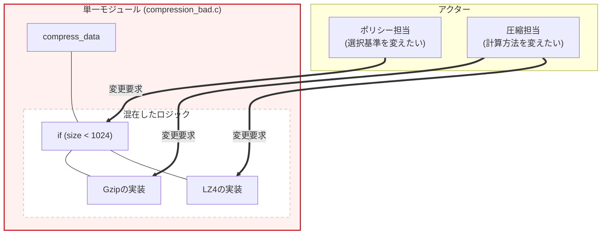
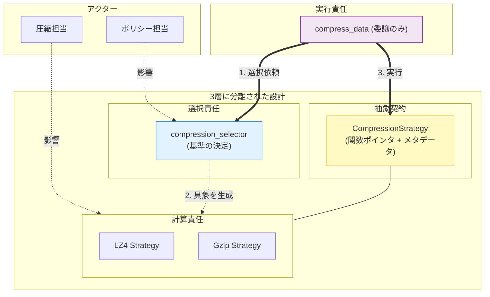
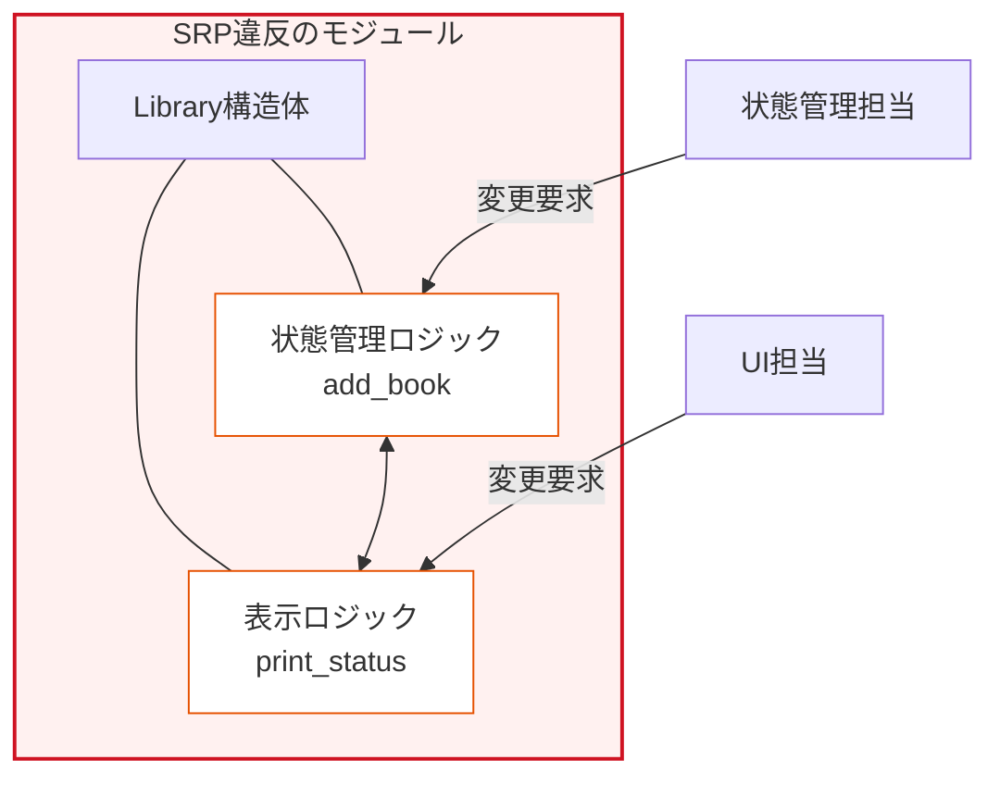
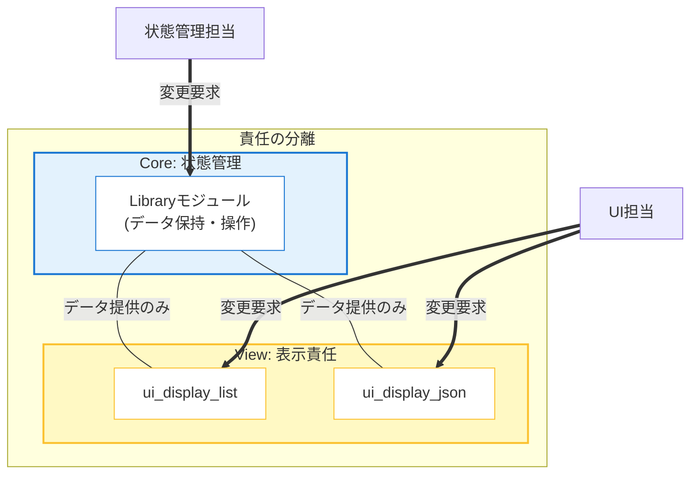

### 3.2. 実践パターン2：アルゴリズムの選択と実行の責任分離

 **「何を実行するか」（Strategy）** と **「どれを使うか」（Selector）** の責任を、 **第2章 関数ポインタ** を用いて分離します。

#### ❌ 原則適用前 (SRP違反)

#### 設計課題

アルゴリズムの **計算ロジック** （圧縮担当）と **選択ロジック** （ポリシー担当）が1つの関数に混在しています。

#### なぜ問題なのか

 **2つのアクターが同じコードを変更する理由を持つ** ため、一方の変更が他方に影響します。

| アクター | 変更要求 | 影響範囲 |
| --- | --- | --- |
| **ポリシー担当** | 選択基準を`1024`から`2048`に変更 | `compress_data`全体を修正 |
| **圧縮担当** | LZ4のバッファサイズを最適化 | `compress_data`全体を修正 |

データのサイズに基づいてLZ4かGzipかを選び、圧縮を実行する関数を考えてみましょう。
この実装では、判断と実行を一つの関数に詰め込んでしまっています。ポリシー変更とアルゴリズム変更が衝突するため、典型的なSRP違反を引き起こしています。

#### 判断と実行が混在するSRP違反関数

#### compression_bad.c
```c
#include <stdio.h>
#include <string.h>
// 選択ロジックと計算ロジックの2つの責任が混在

int compress_data(const char* data, int size, char* output, int output_size) {
    // 責任1: 選択基準の決定（ポリシー担当の領域）
    if (size < 1024) {
        // 責任2: LZ4の具体的な計算処理（圧縮担当の領域）
        printf("Executing LZ4 compression for size %d\n", size);
        // LZ4固有の処理...
        int compressed_size = size / 2; // 簡略化
        memcpy(output, data, compressed_size);

        return compressed_size;
    } else {
        // 責任2: Gzipの具体的な計算処理（圧縮担当の領域）
        printf("Executing Gzip compression for size %d\n", size);
        // Gzip固有の処理...
        int compressed_size = size / 3; // 簡略化
        memcpy(output, data, compressed_size);

        return compressed_size;
    }
}
```

このSRPに違反した `compress_data` 関数を利用するクライアント側のコードです。小サイズと大サイズのデータを渡し、関数内部の分岐によってそれぞれ異なる圧縮処理が走ることを確認してみましょう。

クライアント側から見ると、単に「圧縮してほしい」と依頼しているだけですが、内部ではデータサイズによる閾値判定がハードコーディングされており、ポリシー変更（閾値の変更など）が起きた際に、この関数に依存するすべてのコードが影響を受ける脆弱な構造になっています。

#### ハードコードされた分岐に依存するクライアント

#### compression_bad.c
```c
int main(void) {
    printf("=== SRP違反コードの実行 ===\n\n");
    char input_small[500];
    char input_large[2000];
    char output[2000];
    memset(input_small, 'A', sizeof(input_small));
    memset(input_large, 'B', sizeof(input_large));
    printf("--- 小サイズデータ（500バイト）の圧縮 ---\n");
    int result1 = compress_data(input_small, sizeof(input_small), output, sizeof(output));
    printf("圧縮後のサイズ: %d バイト\n\n", result1);
    printf("--- 大サイズデータ（2000バイト）の圧縮 ---\n");
    int result2 = compress_data(input_large, sizeof(input_large), output, sizeof(output));
    printf("圧縮後のサイズ: %d バイト\n", result2);

    return 0;
}
```

プログラムを実行すると、想定通りにLZ4とGzipが切り替わって動作することが確認できます。しかし、保守の観点からは非常に危険な状態のままです。

#### 危険な状態を隠す正常な実行結果

#### 実行結果
```c
=== SRP違反コードの実行 ===
小サイズデータ（500バイト）の圧縮 ---
Executing LZ4 compression for size 500
圧縮後のサイズ: 250 バイト
大サイズデータ（2000バイト）の圧縮 ---
Executing Gzip compression for size 2000
圧縮後のサイズ: 666 バイト
```

#### 問題を示す図

2つの異なるアクター（変更要求者）が、それぞれ異なる理由で同一の関数（`compress_data`）に変更を要求している危険な状態です。 

*   **変更の衝突**
    「選択基準」を変えたい人と「計算方法」を変えたい人が、同じファイルを編集することになります。



#### ✅ 原則適用後 (SRP準拠)

#### 責任の分割
| モジュール | 責任 | 変更を要求するアクター |
| --- | --- | --- |
| **Strategy** | 各アルゴリズムの計算処理 | 圧縮担当 |
| **Selector** | データサイズに基づく選択基準 | ポリシー担当 |
| **Processor** | 選択されたStrategyの実行 | 設計担当（ほぼ不変） |

#### compression_strategy.h (抽象契約)

すべての圧縮アルゴリズムが従うべき契約定義です。関数ポインタとメタデータ（アルゴリズム名）を持つ構造体を定義しています。

具象アルゴリズムを知らなくても、このインターフェースを通じて実行できるようにしています（多態性）。新しいアルゴリズムを追加しても、この契約を使う側には影響しません。

#### 実行の責任を抽象化する契約定義

#### compression_strategy.h
```c
#ifndef COMPRESSION_STRATEGY_H
#define COMPRESSION_STRATEGY_H
// 抽象的な契約: 実行の責任を持つ関数ポインタ型
typedef int (*CompressFunc)(const char* data, int size,
                            char* output, int output_size);
// Strategy構造体: アルゴリズム名と実行関数（関数ポインタ）を統合
// 単なる関数ポインタではなく構造体にする理由:
// 「実行する」という振る舞いと、「そのアルゴリズムは何か」というメタデータを
// 一つの単位（責任）として扱うため。
typedef struct {
    const char* algorithm_name;
    CompressFunc compress;
} CompressionStrategy;
#endif
```

続いて、契約を実装する具体的なアルゴリズムを見ていきましょう。まずはLZ4用の戦略です。

このヘッダファイルではアルゴリズムの生成関数（ファクトリ）のみを公開し、LZ4の具体的な実装やデータ構造は一切見せません。利用側は抽象化された `CompressionStrategy` を受け取るだけでよいため、中身に依存しない疎結合な関係を作ることができます。

#### 実装の詳細を隠蔽するファクトリ公開

#### lz4_strategy.h
```c
#ifndef LZ4_STRATEGY_H
#define LZ4_STRATEGY_H
#include "compression_strategy.h"

CompressionStrategy lz4_strategy_create(void);
#endif
```

LZ4の実装ファイルでは、実際の高速圧縮ロジックを記述します。

ここで注目すべきは `lz4_compress_impl` が `static` 関数として定義されている点です。このファイル（モジュール）の中に処理を閉じ込めることで、外部から直接呼び出されるのを防ぎます。そしてファクトリ関数は、この内部関数のポインタを `CompressionStrategy` 構造体に詰めて返します。LZ4アルゴリズムをチューニングしたいアクターは、このファイルだけを変更すれば済みます。

#### 単一のアルゴリズムに専念する計算モジュール

#### lz4_strategy.c
```c
#include "lz4_strategy.h"
#include <stdio.h>
#include <string.h>
// staticを用いて実装をこのファイル内に閉じ込める（責任の隠蔽）
static int lz4_compress_impl(const char* data, int size,
                             char* output, int output_size)
{
    printf("  [Detail] Using LZ4 engine...\n");
    // LZ4固有の高速圧縮処理
    int compressed_size = size / 2;  // 簡略化

    if (compressed_size > output_size) return -1;
    memcpy(output, data, compressed_size);

    return compressed_size;
}
// Strategy構造体を生成（関数ポインタを注入）

CompressionStrategy lz4_strategy_create(void)
{
    return (CompressionStrategy){
        .algorithm_name = "LZ4 Fast Compression",
        .compress = lz4_compress_impl  // 実装を注入
    };
}
```

同様に、Gzip用の戦略モジュールも作成します。LZ4と全く同じアプローチです。

他のモジュールは `gzip_strategy.h` だけを知っていればよく、Gzipの複雑なロジックをインクルードする必要はありません。実装を変更しても再コンパイルの影響範囲を最小限に抑えることができます。

#### Gzipアルゴリズムのファクトリ公開

#### gzip_strategy.h
```c
#ifndef GZIP_STRATEGY_H
#define GZIP_STRATEGY_H
#include "compression_strategy.h"

CompressionStrategy gzip_strategy_create(void);
#endif
```

Gzipの実装ファイルでも、具体的な高圧縮ロジックを `static` 関数内にカプセル化し、そのポインタを構造体に詰めて返します。これで、アルゴリズム（計算責任）という1つの変更理由ごとに完全にファイルが分離されたことになります。

#### Gzipの計算ロジックのみに責任を持つ実装

#### gzip_strategy.c
```c
#include "gzip_strategy.h"
#include <stdio.h>
#include <string.h>
// Gzipの計算ロジックのみに責任を持つ
static int gzip_compress_impl(const char* data, int size,
                               char* output, int output_size)
{
    printf("  [Detail] Using Gzip engine...\n");
    // Gzip固有の高圧縮処理
    int compressed_size = size / 3;  // 簡略化

    if (compressed_size > output_size) return -1;
    memcpy(output, data, compressed_size);

    return compressed_size;
}

CompressionStrategy gzip_strategy_create(void)
{
    return (CompressionStrategy){
        .algorithm_name = "Gzip High Ratio",
        .compress = gzip_compress_impl  // 実装を注入
    };
}
```

ここまでの準備でアルゴリズムの実装が終わりました。次は「どれを使うか」を決定する、**選択責任（ポリシー）** を持つモジュールです。

データのサイズなどの条件に応じて適切な `CompressionStrategy` を選んで返す機能だけを提供します。

#### 戦略の選択基準を公開するインターフェース

#### compression_selector.h
```c
#ifndef COMPRESSION_SELECTOR_H
#define COMPRESSION_SELECTOR_H
#include "compression_strategy.h"

CompressionStrategy compression_selector_select(int data_size);
#endif
```

「データサイズが1024未満ならLZ4を、それ以上ならGzipを選ぶ」というビジネスルールをこのファイルの中に集約させます。

今後、ポリシー担当者が「閾値を2048に変更したい」と要求してきた場合、修正すべきなのはこのファイルだけになります。アルゴリズムの実装側（圧縮担当者）のモジュールに影響を与えることは一切ありません。

#### ポリシーの関心事のみを集約した選択モジュール

#### compression_selector.c
```c
#include "compression_selector.h"
#include "lz4_strategy.h"
#include "gzip_strategy.h"
// 選択基準のみに責任を持つ

CompressionStrategy compression_selector_select(int data_size)
{
    // ポリシー: 小さいデータは速度優先、大きいデータは圧縮率優先
    if (data_size < 1024) {
        return lz4_strategy_create();   // LZ4を選択
    } else {
        return gzip_strategy_create();  // Gzipを選択
    }
}
```

そして最後に、これらを統括するコーディネーターモジュールです。

クライアント（利用者）に向けて、「圧縮する」という抽象的な操作の窓口（ファサード）を提供します。クライアントに内部の複雑な選択ロジックやアルゴリズムの違いを隠蔽する役割を担います。

#### 利用者へ提供する抽象的な圧縮の窓口

#### compressor.h
```c
#ifndef COMPRESSOR_H
#define COMPRESSOR_H

int compress_data(const char* data, int size, char* output, int output_size);
#endif
```

#### compressor.c (実行制御)

選択された戦略を実行する、具体的な処理の流れを制御します。`CompressionSelector` を使って戦略を選び、その戦略を実行する「コーディネーター」としての役割を担います。

自らは具体的な圧縮処理も選択判断も行わず、それらの専門家（SelectorとStrategy）に処理を委譲（Delegate）します。典型的な「制御とロジックの分離」がなされており、構成要素の差し替えに対して極めて柔軟です。

#### 選択と実行のコーディネートに徹する制御モジュール

#### compressor.c
```c
#include "compressor.h"
#include "compression_selector.h"
#include <stdio.h>
// 選択されたStrategyの実行のみに責任を持つ

int compress_data(const char* data, int size, char* output, int output_size)
{
    // 1. Selectorに選択を委譲
    CompressionStrategy strategy = compression_selector_select(size);
    // 構造体のメンバ（メタデータ）を利用してログ出力
    printf("[Compressor] Strategy Selected: %s\n", strategy.algorithm_name);
    // 2. 選択されたStrategyを実行（具体的な実装は知らない）

    return strategy.compress(data, size, output, output_size);
}
```

これらを利用する最も上位層のクライアントコード（`main.c`）です。

設計は見事にSRP準拠へと進化し、内部は複数のモジュールに分離されました。しかし利用者から見れば、単に `compress_data` を呼ぶだけで最適な圧縮が行われるというシンプルな使い勝手は変わっていません。

#### 複雑さを意識させない利用コード

#### main.c
```c
#include "compressor.h"
#include <stdio.h>
#include <string.h>

int main(void) {
    printf("=== SRP準拠コードの実行 ===\n\n");
    char input_small[500];
    char input_large[2000];
    char output[2000];
    memset(input_small, 'A', sizeof(input_small));
    memset(input_large, 'B', sizeof(input_large));
    printf("--- 小サイズデータ（500バイト）の圧縮 ---\n");
    int result1 = compress_data(input_small, sizeof(input_small), output, sizeof(output));
    printf("圧縮後のサイズ: %d バイト\n\n", result1);
    printf("--- 大サイズデータ（2000バイト）の圧縮 ---\n");
    int result2 = compress_data(input_large, sizeof(input_large), output, sizeof(output));
    printf("圧縮後のサイズ: %d バイト\n", result2);

    return 0;
}
```

内部構造は完全に疎結合な状態に生まれ変わりましたが、プログラムの外部からの振る舞いは変わらず、期待通りの切り替えが実行されています。

#### 再利用性と拡張性を備えたシステムの実行結果

#### 実行結果
```c
=== SRP準拠コードの実行 ===
小サイズデータ（500バイト）の圧縮 ---
[Compressor] Strategy Selected: LZ4 Fast Compression
  [Detail] Using LZ4 engine...
圧縮後のサイズ: 250 バイト
大サイズデータ（2000バイト）の圧縮 ---
[Compressor] Strategy Selected: Gzip High Ratio
  [Detail] Using Gzip engine...
圧縮後のサイズ: 666 バイト
```

#### 改善を示す図

「選択責任」と「計算責任」が物理的に分離され、それぞれが独立して変更可能になった状態です。

*   **3層構造** : 「選択(Selector)」「契約(Interface)」「実装(Strategy)」が綺麗に分かれています。



#### 効果：変更シナリオごとの影響範囲
| 変更シナリオ | 適用前の影響範囲 | 適用後の影響範囲 |
| --- | --- | --- |
| **選択基準を1024から2048に変更** | `compress_data`全体を修正 | `compression_selector.c`のみ修正 |
| **LZ4の圧縮率を改善** | `compress_data`内のLZ4部分を修正 | `lz4_strategy.c`のみ修正 |
| **Gzipのバッファサイズを最適化** | `compress_data`内のGzip部分を修正 | `gzip_strategy.c`のみ修正 |
| **新アルゴリズム（Zstd）を追加** | `compress_data`にelse-if分岐を追加 | 新しい`zstd_strategy.c`を追加し、`compression_selector.c`に1行追加するだけ |

### 3.3. 実践パターン3：状態管理とI/Oロジックの分離

ここでのポイントは、第5章で学んだ「契約の最小化」と第4章の「不完全型」を応用し、 **内部の状態管理（Model）** と **外部への出力（View）** を物理的に切り分けることにあります。この例では、実践的なシステムを想定して設計原則の適用方法を示します。

具体的なユースケースに基づいてコードを解説することで、抽象的な原則が実際のコードにどのように落とし込まれるかを理解することができます。「書籍データをどう管理するか」と「それをどう画面に表示するか」は、変更の理由が全く異なるのです。

これらを分離することで、UIの変更（HTML化、JSON化など）がライブラリのコアロジックに一切影響を与えない設計を目指します。

#### ❌ 原則適用前 (SRP違反)

#### 設計課題

`Library`構造体と付随する関数が、 **書籍リストの管理（メモリ管理・整合性）** と **画面表示（出力・整形）** という、変更理由の異なる2つの責任を同時に抱え込んでいます。

#### なぜ問題なのか

 **2つのアクター（役割）が同じコードを変更する理由を持つ** ため、一箇所の修正が意図しないバグや再テストの増大を招きます。

| アクター | 変更要求の例 | 影響範囲 |
| --- | --- | --- |
| **状態管理担当** | 書籍の重複登録を禁止したい | `library.c` のロジック全体を修正・検証 |
| **UI担当** | 表示をリスト形式からJSON形式に変えたい | `library.c` のロジック全体を修正・検証 |

まずはSRPに違反しているアンチパターンのコードです。ここでは書籍データのメモリ管理と、その情報を画面に表示するリスト出力処理が、1つの構造体とその操作関数群の中で密結合してしまっています。

データの持ち方（状態管理担当の領域）を変えると表示ロジックも壊れ、一方で出力をJSON形式に変えたい（UI担当の要求）と思うと関心のないメモリ管理部分まで再ビルド・再テストが必要になってしまう脆弱な状態です。

#### 状態管理とUI表示が同居するアンチパターン

#### library_bad.c
```c
#include <stdio.h>
#include <stdlib.h>
#include <string.h>

typedef struct {
    char title[100];
    char isbn[20];
} Book;
// 状態管理とUI表示の2つの責任が1つの構造体に混在
typedef struct {
    Book** books;
    size_t count;
    size_t capacity;
} Library;

Library* library_create(void) {
    Library* lib = malloc(sizeof(Library));

    if (!lib) return NULL;
    lib->books = malloc(sizeof(Book*) * 10);
    lib->count = 0;
    lib->capacity = 10;

    return lib;
}
// 責任1: 状態管理（書籍の追加ロジック）

void library_add_book(Library* lib, const char* title, const char* isbn) {
    if (!lib) return;

    if (lib->count >= lib->capacity) {
        // バグの温床：realloc失敗時のハンドリングが甘く、
        // capacityだけ増えてメモリが増えない可能性がある実装
        lib->capacity *= 2;
        Book** temp = realloc(lib->books, sizeof(Book*) * lib->capacity);

        if (!temp) return;
        lib->books = temp;
    }
    Book* book = malloc(sizeof(Book));

    if (!book) return;
    strncpy(book->title, title, sizeof(book->title) - 1);
    book->title[sizeof(book->title) - 1] = '\0';
    strncpy(book->isbn, isbn, sizeof(book->isbn) - 1);
    book->isbn[sizeof(book->isbn) - 1] = '\0';
    lib->books[lib->count++] = book;
}
```

致命的なのは次の部分です。「状態管理」と同じファイルの中に、標準出力へ整形して表示するというUIの処理が混在しています。さらに `library_print_status` 関数が `Library` 構造体の内部データである配列に直接アクセスしているため、もし内部の実装をリストや木構造に変えようものなら、この文字列表示関数まで書き直さなければならなくなります。

#### 内部データ構造へ直接依存する表示ロジック

#### library_bad.c
```c
// 責任2: UI表示（特定のフォーマットでの出力）

void library_print_status(const Library* lib) {
    if (!lib) return;
    printf("--- Library Status ---\n");
    printf("Total: %zu books\n", lib->count);

    for (size_t i = 0; i < lib->count; i++) {
        printf("[%zu] %s (ISBN: %s)\n", i + 1, lib->books[i]->title, lib->books[i]->isbn);
    }
}

int main(void) {
    Library* lib = library_create();
    library_add_book(lib, "Clean Code", "978-0131103627");
    library_print_status(lib);

    return 0;
}
```

#### 問題を示す図


#### ✅ 原則適用後 (SRP準拠)

#### 責任の分割
| モジュール | 責任 | 変更を要求するアクター |
| --- | --- | --- |
| **Library** | 書籍リストの管理。データの提供に徹し、I/Oは行わない。 | 状態管理担当 |
| **UI** | データの見せ方を決定。Libraryから情報を取得して表示する。 | UI担当 |
| **Book** | データ構造の定義（Value Object）。両者の共通言語。 | 設計担当 |

それでは、改善後のコードを見ていきましょう。まずはシステム全体の基盤となる共通データ構造（Value Object）の定義です。

ここでは書籍の情報そのものを表す純粋なデータとしての `Book` 構造体だけを定義します。ロジックを持たせずにデータのみを抽出することで、状態管理モジュールとUIモジュールの間を行き来する「共通言語（プロトコル）」として機能し、モジュール間の不要な依存関係を防ぐ意図があります。

#### プロトコルとなる純粋なデータ構造

#### book.h
```c
#ifndef BOOK_H
#define BOOK_H

typedef struct {
    char title[100];
    char isbn[20];
} Book;
#endif
```

続いて、書籍のリストを管理する「状態管理（Library）」モジュールの公開インターフェースです。

ここでは `Library` を不完全型として宣言するだけに留め、その内部に配列が使われているのかリストが使われているのかといった実装の詳細をUI層から完全に隠蔽します。このカプセル化により、状態管理担当者が内部データ構造を自由に変更できる堅牢な設計が実現します。

#### 内部を完全に隠蔽する状態管理の契約

#### library.h
```c
#ifndef LIBRARY_H
#define LIBRARY_H
#include <stddef.h>
#include "book.h"
// 不完全型を使用し、内部構造を完全に隠蔽する
typedef struct Library Library;
Library* library_create(void);
void library_destroy(Library* lib);
// 状態を変更する操作
void library_add_book(Library* lib, const char* title, const char* isbn);
// 状態を参照する操作（Getter）
size_t library_get_book_count(const Library* lib);
const Book* library_get_book_at(const Library* lib, size_t index);
#endif
```

`library.h` の契約を満たす具体的な実装ファイルです。書籍データのメモリ管理と整合性の保持という1つの責任のみを負い、標準出力などのI/O処理は一切行いません。

内部の `count` や `capacity` はこのファイル内に閉じ込められており、外部から不正に書き換えられる心配はありません。再割り当て（`realloc`）などの複雑な状態管理ロジックの変更が発生しても、影響はこのファイルの中だけに留まります。

#### データの保持と操作に専念するモジュール

#### library.c
```c
#include "library.h"
#include <stdlib.h>
#include <string.h>

struct Library {
    Book** books;
    size_t count;
    size_t capacity;
};

Library* library_create(void) {
    Library* lib = malloc(sizeof(Library));

    if (!lib) return NULL;
    lib->books = malloc(sizeof(Book*) * 10);

    if (!lib->books) {
        free(lib);

        return NULL;
    }
    lib->count = 0;
    lib->capacity = 10;

    return lib;
}
```

続いて、書籍を実際に追加・取得・破棄する操作関数の実装です。

#### メモリ管理と整合性維持の実装

#### library.c
```c
void library_add_book(Library* lib, const char* title, const char* isbn) {
    if (!lib) return;
    // 容量不足時の拡張処理
    if (lib->count >= lib->capacity) {
        size_t new_capacity = lib->capacity * 2;
        Book** temp = realloc(lib->books, sizeof(Book*) * new_capacity);

        if (!temp) return; // 本来はエラー通知すべき
        lib->capacity = new_capacity;
        lib->books = temp;
    }
    Book* book = malloc(sizeof(Book));

    if (!book) return;
    strncpy(book->title, title, sizeof(book->title) - 1);
    book->title[sizeof(book->title) - 1] = '\0';
    strncpy(book->isbn, isbn, sizeof(book->isbn) - 1);
    book->isbn[sizeof(book->isbn) - 1] = '\0';
    lib->books[lib->count++] = book;
}

size_t library_get_book_count(const Library* lib) {
    return lib ? lib->count : 0;
}

const Book* library_get_book_at(const Library* lib, size_t index) {
    if (!lib || index >= lib->count) return NULL;

    return lib->books[index];
}

void library_destroy(Library* lib) {
    if (!lib) return;

    for (size_t i = 0; i < lib->count; i++) {
        free(lib->books[i]);
    }
    free(lib->books);
    free(lib);
}
```

最後に、データの「見せ方」に専念する「UI担当」のモジュールです。

ここでは、構築済みの `Library` オブジェクトを受け取り、それをリスト形式やJSON形式で出力する関数だけを公開します。出力のフォーマット（Web対応やGUI化など）がどう変わろうとも、状態管理の `library.c` は一切修正する必要がない恩恵を受けられます。

#### 表示形式を拡張可能な出力の契約

#### ui.h
```c
#ifndef UI_H
#define UI_H
#include "library.h"

void ui_display_list(const Library* lib);
void ui_display_json(const Library* lib);
#endif
```

UIの実装側では、抽象化された `Library` の公開されたGetter関数（`library_get_book_count` など）のみを通じてデータを取得し、それを整形出力します。

内部で配列が使われているのかデータベースが使われているのかといった「データの持ち方」を知らずに済むため、純粋な表示ロジックの拡張（XML形式の追加など）に集中することができます。

#### データの見せ方に専念する表示モジュール

#### ui.c
```c
#include "ui.h"
#include <stdio.h>

void ui_display_list(const Library* lib) {
    printf("=== Library List ===\n");
    size_t count = library_get_book_count(lib);

    for (size_t i = 0; i < count; i++) {
        const Book* b = library_get_book_at(lib, i);

        if (b) {
            printf("[%zu] %s\n", i + 1, b->title);
        }
    }
}

void ui_display_json(const Library* lib) {
    printf("{\"books\": [\n");
    size_t count = library_get_book_count(lib);

    for (size_t i = 0; i < count; i++) {
        const Book* b = library_get_book_at(lib, i);

        if (b) {
            printf("  {\"title\": \"%s\", \"isbn\": \"%s\"}%s\n",
                   b->title, b->isbn, (i < count - 1) ? "," : "");
        }
    }
    printf("]}\n");
}
```

これら「データ管理（モデル）」と「表示（ビュー）」の独立したモジュールを組み合わせて一連のフローを実行する、最上位のクライアントコードです。

それぞれのモジュールが高い独立性を持っているため、利用者はレゴブロックを組み合わせるように簡単かつ安全にアプリケーションを構築することができます。

#### 独立したモジュールを組み合わせる利用コード

#### main.c
```c
#include "library.h"
#include "ui.h"

int main(void) {
    Library* my_lib = library_create();

    if (!my_lib) return 1;
    library_add_book(my_lib, "Clean Code", "978-0132350884");
    // 異なるUI表現を切り替えて使用
    ui_display_list(my_lib);
    ui_display_json(my_lib);
    library_destroy(my_lib);

    return 0;
}
```

#### 改善を示す図


#### 状態管理とI/O分離の設計ポイント

 **情報の引き出し(Pull型)設計** : UI側が必要な時にデータを取得する形にすることで、Library側は「誰がどう表示するか」を知る必要がなくなります。

 **副作用の排除** : 状態管理モジュールから `printf` 等のI/Oを排除することで、テストの自動化が容易になり、移植性（コンソールからGUI、Webへ）が向上します。

 **カプセル化の完遂** : 不完全型によってデータ構造を隠蔽することで、内部の配列をリストや木構造に変えても、UI側のコードには一切影響を与えません。

## 本章で必ず理解してほしいことのまとめ

### 単一責任原則 (SRP) の設計指針

####  **1. SRP の本質は「変更の理由」の単一化と定義する** 

モジュールが **複数のアクター** の要求で変更される責任を負う場合、それは SRP 違反です。 **変更の理由** を一つに絞ることで、変更の副作用を局所化し、 **保守性** を高めます。

####  **2. モジュールと構造体を「責任の単位」として分割する** 

巨大な構造体は、異なる責任を持つフィールドを **Value Object** として分離し、 **コンポジション** によって統合します。

####  **3. 処理フェーズの分離（パイプライン原則）を適用する** 

 **データ整形** と **I/O（永続化/表示）** といった、異なる変更理由を持つフェーズを独立したモジュールに分離し、 **疎結合** を実現します。

####  **4. アルゴリズムの選択と実行の責任を分離する** 

第2章で学んだ「関数ポインタ」を活用し、実行すべき具体的なアルゴリズム（計算の責任）と、それを外部条件に基づいて選択するロジック（選択の責任）を物理的に分離します。これにより、アルゴリズムの追加や選択基準の変更が互いに干渉しなくなります。

####  **5. 状態管理とI/Oロジックを分離する** 

内部的な **データの整合性管理** と、外部への **表示や入力処理** を分離することで、UIの変更が内部ロジックに影響しない設計を実現します。

#### チェックリスト

設計時に以下の質問を自問自答してください： 

 [ ] このモジュールを変更する理由は一つだけか？ 
 [ ] 複数のアクター（部門）がこのコードに対して変更要求を出すことはないか？ 
 [ ] 一つの変更が他の無関係な機能に影響を与えないか？ 
 [ ] 構造体内のフィールドは同じ変更理由を持つか？ 
 [ ] 処理フェーズ（整形、永続化、表示など）は適切に分離されているか？ 
 [ ] テストは容易か？ (I/Oが分離されていれば、ロジックのテストは容易なはずです)。

#### 次章への橋渡し

次章では、このSRPによって準備された基盤の上に、 **第9章 開放閉鎖原則 (OCP)** を適用します。 **「修正に対して閉じ、拡張に対して開く」** という設計目標を、関数ポインタや不完全型といった道具を駆使してどのように達成するのかを詳細に学びます。
