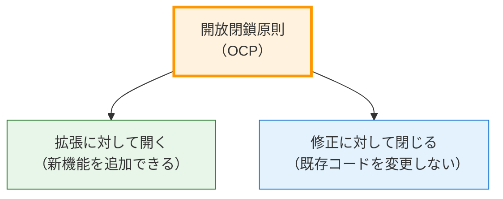
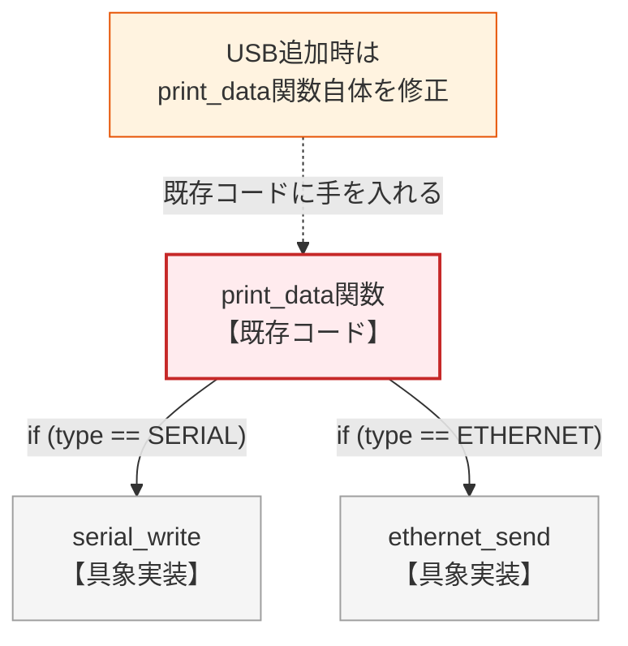
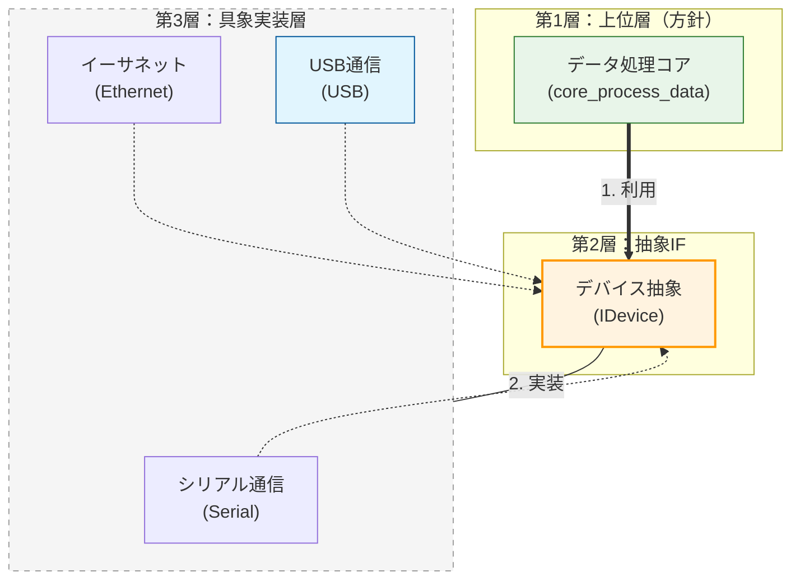
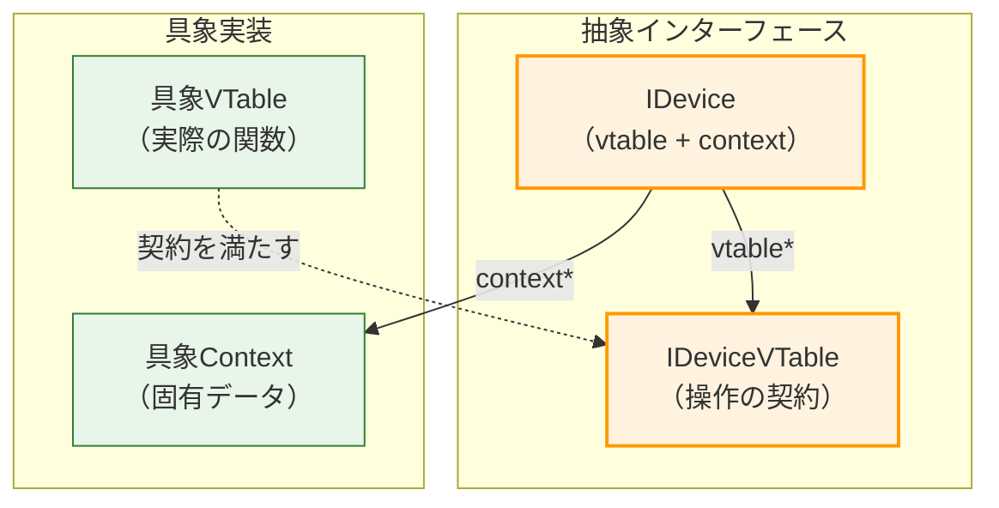
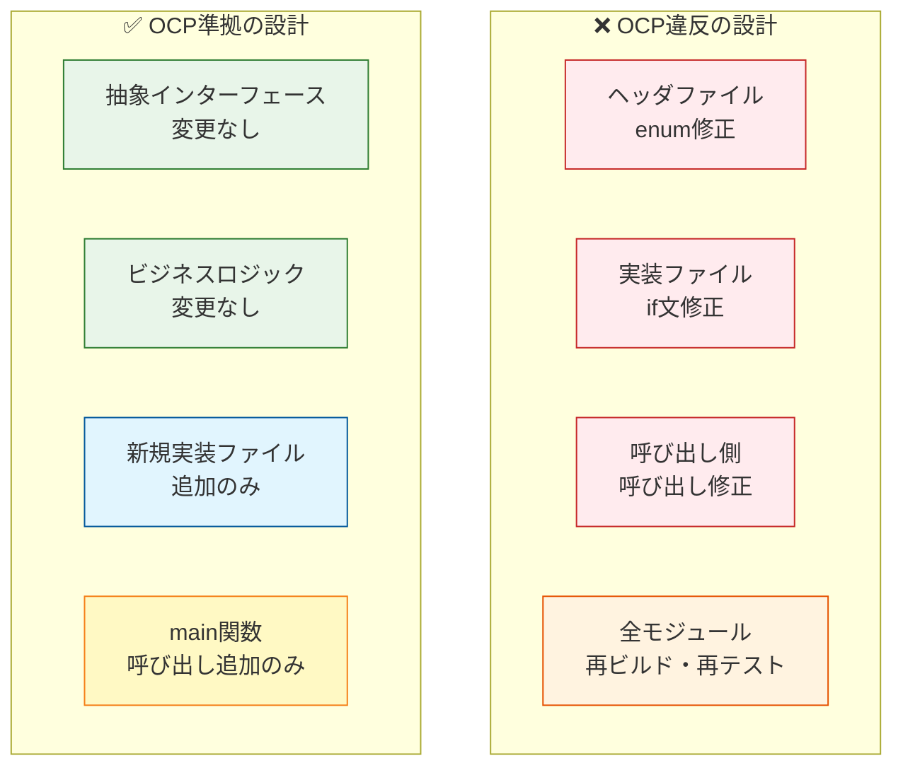
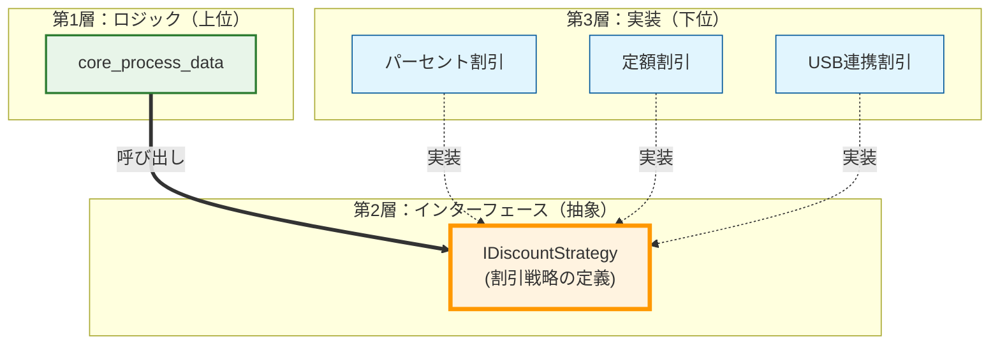
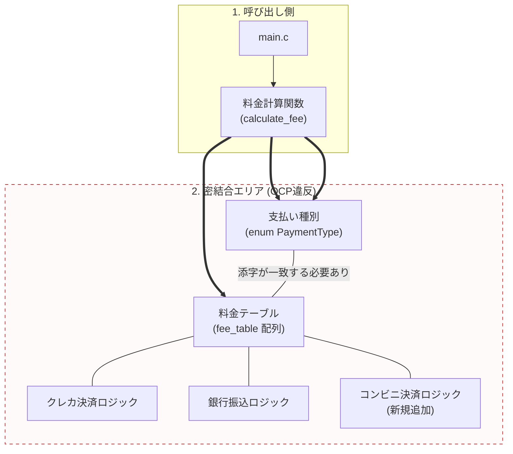
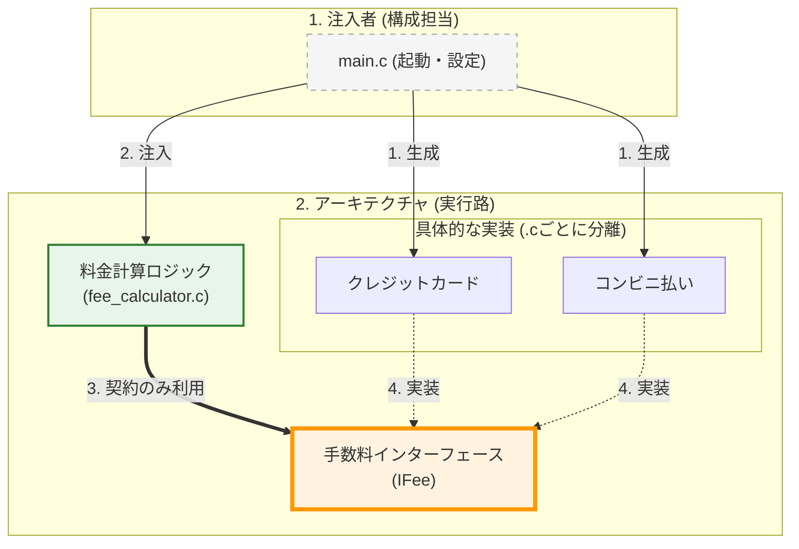

# 第2部 第9章 開放閉鎖原則（OCP）：拡張のために開き、修正に対して閉じる

この章の主題は、設計の三本柱のうち「**依存**」の柱です。**開放閉鎖原則**（Open/Closed Principle, OCP）を適用することで、変更の影響範囲を限定し、疎結合な構造を構築することで、究極の目的である**拡張性**を確保します。

この原則を実現するためには、**第2章 関数ポインタと間接呼び出し**で学んだ**VTableパターン**と**context**による状態管理が鍵となります。

## 1. 原則の本質：なぜOCPが必要なのか

### 1.1. OCPの定義

**開放閉鎖原則**（Open/Closed Principle, OCP）は、ソフトウェア設計の基本原則の一つです：

「ソフトウェアのエンティティは、**拡張に対して開かれていなければならず、修正に対して閉じられていなければならない**」



この原則が解決する核心的な問題は、**「新機能の追加が、既存の動作しているコードの修正を強制する」**という、ソフトウェア開発における最も高コストな問題です。

### 1.2. OCPが解決する問題

実務でよく遭遇する「新しいデバイスの追加」という要求を題材に、OCP違反とOCP準拠の設計を対比します。

**シナリオ：** データ出力システムがあり、現在SerialとEthernetに対応しています。ここに新しくUSBデバイスへの対応が要求されました。

### ❌ 原則を無視した設計：条件分岐の連鎖



この設計では、新しいデバイスを追加するたびに：

1. enum定義を修正
2. 条件分岐（if文）を修正
3. クライアントコードを修正
という**連鎖的な修正**が発生します。

### ✅ 原則を適用した設計：抽象への依存




この設計では、新しいデバイスを追加しても：

* **核心的な方針（上位モジュールである `core_process_data`）は一切修正不要**
* 新しいファイル（`usb_device.c`）を追加するだけ（第5章で学んだモジュールの独立性）
* 回帰テストの範囲が最小限に

## 2. C言語での実現手段と設計要素

OCPをC言語で実現するには、以下の技術要素を組み合わせます。

### 2.1. 抽象インターフェースの定義：VTableパターン

C言語には`interface`キーワードはありませんが、**VTable（仮想関数テーブル）パターン**によって抽象契約を定義できます。



### 抽象契約の定義

**このファイルの目的**:
すべてのデバイスが従うべき共通の「契約」を定義します。

**設計ポイント**:

このコードは以下の設計原則を実践しています:

1. **処理内容**: デバイス操作の共通インターフェースを定義しています。
2. **設計意図**: 具体的なデバイス（シリアル、イーサネットなど）の実装詳細を隠蔽し、クライアントが抽象（VTable）に依存するようにします。
3. **評価**: これにより、新しいデバイスの追加が容易になり、修正に対して閉じた設計となります。

#### idevice.h
```c
#ifndef IDEVICE_H
#define IDEVICE_H

#include <stddef.h>

// VTable: すべてのデバイスが実装すべき操作
typedef struct {
    int (*write_data)(void* context, const char* data, size_t len);
    void (*close)(void* context);
} IDeviceVTable;

// 抽象インターフェース
typedef struct {
    const IDeviceVTable* vtable;
    void* context;
} IDevice;

// ヘルパーマクロ（呼び出しを簡潔にするため）
#define idevice_write_data(d, data, len) \
    (d)->vtable->write_data((d)->context, (data), (len))
#define idevice_close(d) \
    (d)->vtable->close((d)->context)

#endif
```

**設計のポイント：**

* `IDeviceVTable`: 操作の契約（関数ポインタの集合）
* `IDevice`: vtableとcontextのペア（インターフェース本体）
* ヘルパーマクロ: クライアントコードの可読性を向上

## 2.2. 具象実装の隠蔽：contextによる状態管理

各デバイスは固有のデータ構造（context）を持ちますが、クライアントからは`void*`として隠蔽されます。

### 具象実装の例

**このファイルの目的**:
`IDevice` インターフェースのシリアル通信版実装です。
**設計ポイント**:

このコードは以下の設計原則を実践しています:

1. **処理内容**: `IDevice` インターフェースのシリアル通信版実装です。
2. **設計意図**: `Context`構造体により内部状態をカプセル化し、`VTable`を通じて振る舞いを提供します。
3. **評価**: 実装の詳細が完全に隠蔽されているため、変更の影響が外部に漏れません。

#### serial_device.c
```c
#include "idevice.h"
#include <stdio.h>
#include <stdlib.h>
#include <string.h>

// Serial固有のデータ構造（クライアントから隠蔽）
typedef struct {
    char port_name[16];
    int port_handle;
} SerialContext;

// 具象実装：契約を満たす
static int serial_write(void* context, const char* data, size_t len) {
    SerialContext* ctx = (SerialContext*)context;
    printf("[Serial] Port %s: Writing '%.*s'\n", 
           ctx->port_name, (int)len, data);
    return (int)len;
}

static void serial_close(void* context) {
    SerialContext* ctx = (SerialContext*)context;
    printf("[Serial] Closing port %s\n", ctx->port_name);
    free(ctx);
}

// VTableの実体
static const IDeviceVTable SERIAL_VTABLE = {
    .write_data = serial_write,
    .close = serial_close
};

// ファクトリ関数：外部に公開される唯一のAPI
IDevice* serial_device_create(const char* port_name) {
    SerialContext* ctx = malloc(sizeof(SerialContext));
    if (!ctx) return NULL;
    
    strncpy(ctx->port_name, port_name, sizeof(ctx->port_name) - 1);
    ctx->port_handle = 1;
    
    IDevice* device = malloc(sizeof(IDevice));
    if (!device) {
        free(ctx);
        return NULL;
    }
    
    device->vtable = &SERIAL_VTABLE;
    device->context = ctx;
    
    return device;
}
```

### 2.3. クライアントコード：抽象への依存

ビジネスロジックは抽象インターフェース（`IDevice`）のみに依存し、具象実装の詳細を一切知りません。

**ファイル名**: `application_core.c`

#### application_core.c
```c
#include "idevice.h"
#include <stdio.h>

// ビジネスロジック：抽象インターフェースのみに依存
int core_process_data(IDevice* device) {
    if (!device) {
        printf("[Core] Error: NULL device\n");
        return -1;
    }
    
    printf("[Core] データ処理中...\n");
    
    const char* message = "Hello, Device!";
    idevice_write_data(device, message, 14);
    idevice_close(device);
    
    return 0;
}
```

**重要な特徴：**

* `SerialContext`や`EthernetContext`の存在を知らない
* `serial_write()`や`ethernet_send()`の存在を知らない
* **どの具象実装が渡されても動作する**

### 2.4. 統合と実行：main関数

**ファイル名**: `main.c`

#### main.c
```c
#include "idevice.h"
#include <stdio.h>
#include <stdlib.h>

extern int core_process_data(IDevice* device);
extern IDevice* serial_device_create(const char* port_name);
extern IDevice* ethernet_device_create(const char* ip_address);

int main(void) {
    IDevice* device = NULL;
    
    printf("=== Serial Device ===\n");
    device = serial_device_create("COM1");
    if (device) {
        core_process_data(device);
        free(device);
    }
    
    printf("\n=== Ethernet Device ===\n");
    device = ethernet_device_create("192.168.1.1");
    if (device) {
        core_process_data(device);
        free(device);
    }
    
    return 0;
}
```

## 2.5. 新しい実装の追加：USB対応

OCPの真価は、**新機能追加時に既存コードを修正しない**ことで発揮されます。

### 新規ファイルの追加

**ファイル名**: `usb_device.c`

#### usb_device.c
```c
#include "idevice.h"
#include <stdio.h>
#include <stdlib.h>

// USB固有のデータ構造
typedef struct {
    int vendor_id;
    int product_id;
    int usb_handle;
} UsbContext;

static int usb_write(void* context, const char* data, size_t length) {
    UsbContext* ctx = (UsbContext*)context;
    printf("[USB] Vendor ID:0x%04X Product ID:0x%04X: Transmitting '%.*s'\n",
           ctx->vendor_id, ctx->product_id, (int)length, data);
    return (int)length;
}

static void usb_close(void* context) {
    UsbContext* ctx = (UsbContext*)context;
    printf("[USB] Closing device Vendor ID:0x%04X Product ID:0x%04X\n",
           ctx->vendor_id, ctx->product_id);
    free(ctx);
}

static const IDeviceVTable USB_VTABLE = {
    .write_data = usb_write,
    .close = usb_close
};

IDevice* usb_device_create(int vendor_id, int product_id) {
    UsbContext* ctx = malloc(sizeof(UsbContext));
    if (!ctx) return NULL;
    
    ctx->vendor_id = vendor_id;
    ctx->product_id = product_id;
    ctx->usb_handle = 100;
    
    IDevice* device = malloc(sizeof(IDevice));
    if (!device) {
        free(ctx);
        return NULL;
    }
    
    device->vtable = &USB_VTABLE;
    device->context = ctx;
    
    return device;
}
```

### 呼び出し元の変更（最小限）

**ファイル名**: `main.c` (一部追記)
**修正範囲の局所化:** `main` 関数で新しいデバイス生成関数を呼ぶだけで、他のロジックには一切手を触れません。

#### main.c
```c
// 既存の外部宣言
extern int core_process_data(IDevice* device);
extern IDevice* serial_device_create(const char* port_name);
extern IDevice* ethernet_device_create(const char* ip_address);
extern IDevice* usb_device_create(int vendor_id, int product_id);  // 外部宣言追加

int main(void) {
    IDevice* device = NULL;
    
    printf("=== Serial Device ===\n");
    device = serial_device_create("COM1");
    if (device) {
        core_process_data(device);
        free(device);
    }
    
    printf("\n=== Ethernet Device ===\n");
    device = ethernet_device_create("192.168.1.1");
    if (device) {
        core_process_data(device);
        free(device);
    }
    
    // USBデバイス追加（core_process_dataは不変）
    printf("\n=== USB Device ===\n");
    device = usb_device_create(0x1234, 0x5678);
    if (device) {
        core_process_data(device);
        free(device);
    }
    
    return 0;
}
```

### 2.6. 修正範囲の比較



**比較表：**

| 項目 | OCP違反 | OCP準拠 |
| --- | --- | --- |
| **修正ファイル数** | 3ファイル | 1ファイル（main.cのみ） |
| **修正内容** | enum追加<br>if文追加<br>呼び出し追加 | 呼び出し追加のみ |
| **既存コードへの影響** | **あり**（条件分岐修正） | **なし**（core不変） |
| **再ビルド範囲** | 全モジュール | USB実装とmainのみ |
| **回帰テスト** | **必要**（全デバイス） | **不要**（USB実装のみ） |
| **デグレードリスク** | **あり**（if文の修正ミス） | **なし**（既存コード不変） |

### 2.7. C言語でOCPを実現する設計パターンまとめ

| 設計要素 | 役割 | 実現する価値 |
| --- | --- | --- |
| **VTable構造体** | 操作の契約を定義 | 多態性の基盤 |
| **インターフェース構造体** | vtable + contextのペア | 抽象への依存 |
| **void* context** | 具象データの隠蔽 | 情報隠蔽・カプセル化 |
| **ファクトリ関数** | 生成ロジックの集約 | 初期化の一貫性 |
| **ヘルパーマクロ** | 呼び出しの簡潔化 | 可読性・保守性 |

これらの要素を組み合わせることで、C言語でも**拡張に対して開き、修正に対して閉じた**設計を実現できます。

## 3. 実践パターン：OCPを実現する三つの型

### 3.1. パターン1：条件分岐によるロジックの固定 → ストラテジーパターン

### このパターンで学ぶこと

このセクションでは、**価格計算システム**を題材に、OCP原則（拡張に対して開き、修正に対して閉じる）の適用方法を学びます。

具体的には、商品の割引計算を行うプログラムにおいて：

* 「パーセント割引（10%オフ）」
* 「固定額割引（500円引き）」
* という2つの計算方式を実装します。将来的には「会員ランク別割引」「期間限定割引」などが追加される可能性があります。

### ❌ 原則適用前：アルゴリズムが「条件分岐」で固定されている

まず、OCP原則を適用していない従来のコードを見てみましょう。このコードには、新しい割引方式を追加するたびに既存コードの修正が必要になるという課題があります。

**ファイル名**: `price_calculator.c` (OCP違反)

#### price_calculator.c
```c
#include <stdio.h>

// 割引の種類を増やすたびに、この列挙型と関数の修正が必要
typedef enum {
    DISCOUNT_PERCENT,
    DISCOUNT_FIXED
} DiscountType;

int calculate_price(int base_price, DiscountType type, int value) {
    int result = base_price;

    // アルゴリズムが硬直的な条件分岐で実装されている
    if (type == DISCOUNT_PERCENT) {
        result = base_price * (100 - value) / 100;
    } else if (type == DISCOUNT_FIXED) {
        result = base_price - value;
    }
    
    printf("[Calculator] Result: %d円\n", result);
    return result;
}

int main(void) {
    printf("--- 10%%割引を実行 ---\n");
    calculate_price(10000, DISCOUNT_PERCENT, 10);

    printf("\n--- 500円引きを実行 ---\n");
    calculate_price(10000, DISCOUNT_FIXED, 500);

    return 0;
}
```

## ✅ 原則適用後：ストラテジーパターンと依存注入（DI）

次に、OCP原則を適用したコードを見てみましょう。**外側の動作（実行結果）は全く変えず**、内部構造のみを改善します。
アルゴリズムを「戦略オブジェクト（IDiscount）」として抽出し、`main` から注入することで、`calculate_price` は将来の変更から完全に保護（閉鎖）されます。

### 抽象契約の定義

**ファイル名**: `idiscount.h`

#### idiscount.h
```c
#ifndef IDISCOUNT_H
#define IDISCOUNT_H

typedef struct {
    int (*apply)(void* context, int base_price);
} IDiscountVTable;

typedef struct {
    const IDiscountVTable* vtable;
    void* context; // 戦略固有のデータを隠蔽
} IDiscount;

#endif
```

### ロジックの実装（計算機）

**このファイルの目的**:
計算ロジックを実装します。具体的な割引ルールを一切知らず、抽象インターフェース `IDiscount` にのみ依存するため、将来どんなルールが増えても修正が不要です。

**ファイル名**: `price_calculator.c` (OCP準拠)

#### price_calculator.c
```c
#include "idiscount.h"
#include <stdio.h>

// この関数は、将来どんな計算ルールが増えても「二度と書き換えない」
int calculate_price(IDiscount* strategy, int base_price) {
    int result = base_price;
    if (strategy && strategy->vtable && strategy->vtable->apply) {
        result = strategy->vtable->apply(strategy->context, base_price);
    }
    
    printf("[Calculator] Result: %d円\n", result);
    return result;
}
```

### 組み立てと実行

**ファイル名**: `main.c`

#### main.c
```c
#include "idiscount.h"
#include <stdio.h>

// 各戦略の生成（実際のプロジェクトでは別ファイルで実装します）
extern IDiscount* create_percent_discount(int percent);
extern IDiscount* create_fixed_discount(int amount);

// calculate_priceのプロトタイプ宣言
extern int calculate_price(IDiscount* strategy, int base_price);

int main(void) {
    int base_price = 10000;

    printf("--- 10%%割引を実行 ---\n");
    IDiscount* s1 = create_percent_discount(10);
    if (s1) {
        calculate_price(s1, base_price); // 注入！
        // free(s1) 等の終了処理が必要（省略）
    }

    printf("\n--- 500円引きを実行 ---\n");
    IDiscount* s2 = create_fixed_discount(500);
    if (s2) {
        calculate_price(s2, base_price); // 注入！
    }

    return 0;
}
```



## 設計の進化：同じ「結果」を得るための「手段」の違い

| 項目 | 適用前：条件分岐 | 適用後：ストラテジー |
| --- | --- | --- |
| **実行結果** | **9000円 / 9500円** | **9000円 / 9500円（不変）** |
| **calculate_price の中身** | 全アルゴリズムの知識を持つ | 抽象への依頼のみ（詳細を知らない） |
| **新しい割引の追加** | **既存の関数の修正が必要** | 新しいファイルを追加するだけ |
| **データの持ち方** | `int value` 1つでやりくり | `context` により戦略ごとに自由 |

「結果が同じであること」は、このリファクタリングが成功している証拠です。

開発者は、ユーザーが受け取る価値（計算結果）を変えることなく、**「将来、新しい計算ルールを100個追加しても既存コードが1行も壊れない」という圧倒的な保守性**を手に入れたことになります。これがOCP原則とストラテジーパターンの真価です。

**学習上の注意**
このコード例は、**OCP原則の本質を理解するための教材**として意図的に簡素化しています。実務では、この程度の規模であれば関数ポインタを使わず、単純に割引計算用の関数を複数用意して呼び分ける方がシンプルです。

しかし、ここでは以下の理由により、あえてストラテジーパターンを用いています：

* OCP原則の「拡張に開き、修正に閉じる」という設計思想を明確に示すため
* 将来的に10種類、20種類と割引ルールが増えた場合の設計指針を示すため
* 依存性逆転の原則（DIP）との組み合わせを学ぶため

**「この規模でここまでするのは過剰設計では？」と感じるかもしれません。しかし、あえてシンプルな例を用いることで、複雑な実務コードに潜む「原則の本質」を浮き彫りにしています。**

### 3.2. パターン2：enum＋配列インデックス → VTableパターン（ストラテジー）

### このパターンで学ぶこと

このセクションでは、**支払い方法ごとの手数料計算システム**を題材に、OCP原則の別の適用パターンを学びます。

具体的には、以下のような支払い方法ごとに異なる手数料を計算するプログラムを扱います：

* 「クレジットカード払い」→ 金額の5%
* 「コンビニ払い」→ 固定300円
* 「銀行振込」→ 無料

将来的には「電子マネー」「QRコード決済」などが追加される可能性があります。

### ❌ 原則適用前：enumと配列による暗黙的な依存

まず、OCP原則を適用していないコードを見てみましょう。このコードは、enum値を配列のインデックスとして使用しています。一見効率的ですが、**enumの定義順序、関数テーブルの並び順、呼び出し側が「順番」という暗黙のルールで強く結合している**という課題があります。

### fee_calculator.c

このファイルでは、支払い種別を表す `enum` の値（0, 1, 2...）をそのまま配列のインデックスとして使い、対応する関数を呼び出しています。この実装の問題は、`enum` の要素を追加・削除したり順序を変えたりすると、配列の並び順も手動で合わせなければならず、整合性を保つのが難しい点にあります。

**処理の内容:** enum値をインデックスとして、支払いごとの手数料計算関数を呼び出します。
**設計的意図:** （悪い例）配列の直接参照によるディスパッチを行っています。
**評価:** 配列の順序とenumの定義順序が暗黙的に結合しており、並び替えに極めて弱いです。

#### fee_calculator.c
```c
#include <stdio.h>

typedef enum {
    PAY_CREDIT = 0,
    PAY_CONVENIENCE,
    PAY_BANK,
    PAY_MAX
} PaymentType;

// 手数料計算ロジック（具体的な計算式が露出している）
int fee_credit(int price)       { return price * 5 / 100; }
int fee_convenience(int price) { return 300; }
int fee_bank(int price)        { return 0; }
```

### fee_calculator.c (テーブルとディスパッチ)

**テーブルとディスパッチ:** 関数テーブルを用いた分岐の除去と、呼び出し関数の実装です。enumの変更がテーブル定義に直接影響するため、保守性が低くなっています。

#### fee_calculator.c
```c
// enumの順番と一貫性を保つ責任が開発者に丸投げされている
int (*fee_table[PAY_MAX])(int) = {
    fee_credit,
    fee_convenience,
    fee_bank
};

int calculate_fee(PaymentType type, int price) {
    printf("[Calculator] 金額: %d円\n", price);
    // インデックスによる直接呼び出し
    // 範囲チェックがないため、不正なtypeが来るとクラッシュする危険性あり
    if (type < 0 || type >= PAY_MAX) return -1;
    
    int fee = fee_table[type](price);
    printf("[Calculator] 手数料: %d円\n", fee);
    return fee;
}
```

### fee_calculator.c (実行)

**実行:** メイン関数から呼び出します。

#### fee_calculator.c
```c
int main(void) {
    printf("--- クレジットカード ---\n");
    calculate_fee(PAY_CREDIT, 10000);
    
    printf("\n--- コンビニ払い ---\n");
    calculate_fee(PAY_CONVENIENCE, 10000);
    
    return 0;
}

```

## このコードの課題

1. **enumと配列の順序を手作業で同期する必要がある**
例：`PAY_CONVENIENCE` の順序を変更すると、`fee_table` の並び順も変更しなければならず、変更漏れによるバグが発生しやすい。
2. **新しい支払い方法の追加で3箇所の修正が必要**

* `PaymentType` enumに追加
* 手数料計算関数を追加
* `fee_table` 配列に追加
この3箇所が一致していないと実行時エラーや誤動作の原因になります。

3. **計算ロジックの詳細がすべて露出している**
クレジットカードが「5%」、コンビニが「300円固定」といった情報が、すべて同じファイル内に散在しています。

**構造図（硬直した依存）：**



### ✅ 原則適用後：VTableパターン（戦略の完全カプセル化）

次に、OCP原則を適用したコードを見てみましょう。**外側の動作（実行結果）は変えず**、支払い方法を「手数料計算の戦略（IFee）」として抽象化します。
VTableとContextを用いることで、各支払い方法が独自の計算データ（パーセンテージや固定額など）を内部に隠蔽できるようになります。

### 抽象契約の定義

**ファイル名**: `ifee.h`

#### ifee.h
```c
#ifndef IFEE_H
#define IFEE_H

typedef struct {
    int (*calculate)(void* context, int price);
} IFeeVTable;

typedef struct {
    const IFeeVTable* vtable;
    void* context; // 具体的な戦略（クレカ、コンビニ等）が持つデータを隠蔽
} IFee;

#endif

```

### 計算ロジックの実装

**ファイル名**: `fee_calculator.c`

#### fee_calculator.c
```c
#include "ifee.h"
#include <stdio.h>

// この関数は、将来支払い方法が100種類になっても「無修正」で対応可能
int calculate_fee(IFee* strategy, int price) {
    if (!strategy || !strategy->vtable || !strategy->vtable->calculate) {
        return 0;
    }

    printf("[Calculator] 金額: %d円\n", price);
    // 抽象インターフェース経由で計算を実行
    int fee = strategy->vtable->calculate(strategy->context, price);
    printf("[Calculator] 手数料: %d円\n", fee);
    
    return fee;
}

```

### 組み立てと実行

**ファイル名**: `main.c`

#### main.c
```c
#include "ifee.h"
#include <stdio.h>

// 各戦略の生成（詳細はそれぞれの.cに閉じ込める）
extern IFee* create_credit_fee(int percent);
extern IFee* create_convenience_fee(int fixed_amount);

int main(void) {
    int price = 10000;

    printf("--- クレジットカード ---\n");
    IFee* credit = create_credit_fee(5); // 5%の手数料戦略を生成
    calculate_fee(credit, price);        // 注入！
    // 終了処理が必要(省略)

    printf("\n--- コンビニ払い ---\n");
    IFee* conv = create_convenience_fee(300); // 300円の固定手数料戦略を生成
    calculate_fee(conv, price);               // 注入！
    // 終了処理が必要(省略)

    return 0;
}

```

**構造図（疎結合・拡張可能）：**



## 設計の違い：なぜこの構造にするのか

| 観点 | 適用前：enum＋配列 | 適用後：VTableパターン |
| --- | --- | --- |
| **実行結果** | **500円 / 300円** | **500円 / 300円（完全一致）** |
| **拡張の容易性** | 3箇所の同期修正が必要（脆弱） | 新しい `.c` を追加するだけ（堅牢） |
| **情報の隠蔽** | 全計算ロジックが1箇所に露出 | クレカの％、コンビニの固定額を各 `.c` に封印 |
| **順序依存** | enumと配列の順序が暗黙的に結合 | 順序に依存しない（名前による明示的な結合） |

このパターンは、**暗黙のルール（順序の一致）を明示的な契約（インターフェース）に置き換える**ことで、保守性と拡張性を大幅に向上させます。