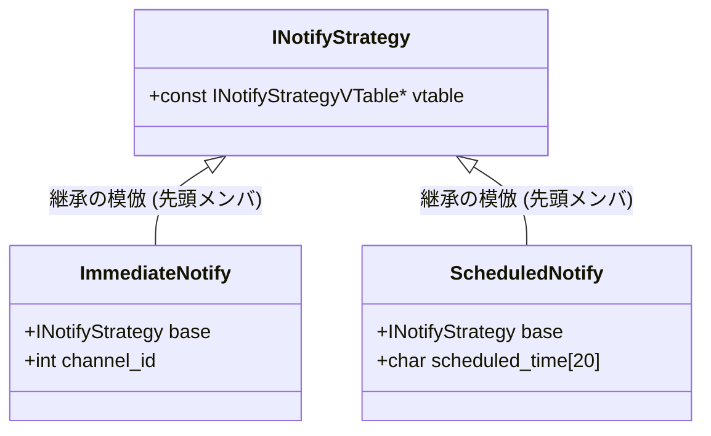
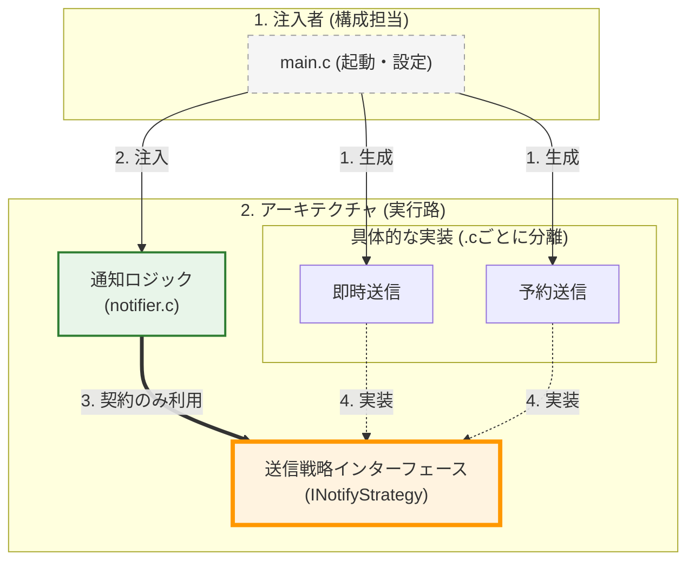
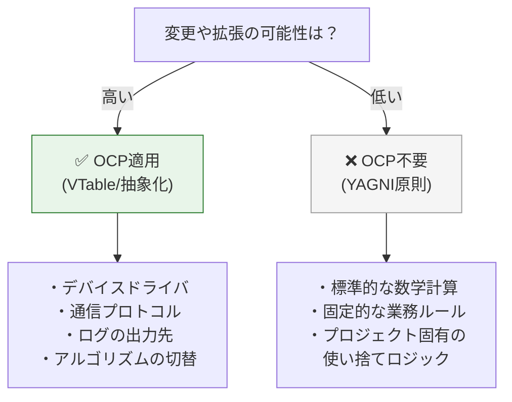

### 3.3. パターン3：状態フラグ → ストラテジーパターン

このセクションでは、状態フラグによる分岐をストラテジーパターンで置き換える方法を学びます。将来的には「優先送信」「深夜送信」「リトライ送信」などが追加される可能性があるケースを想定します。

#### システム概要

ここでは、ユーザーやシステムに対してメッセージを送信する**通知送信システム**を実装します。このシステムは、送信モードとして以下の2つの振る舞いをサポートするという要件を持っています：
- 「即時送信」：メッセージを今すぐ送信する
- 「予約送信」：メッセージを指定時刻に送信する（後で送信する）

#### 設計課題

非常によく見かけるコードの「望ましくない設計」の一つが、 `bool` 型のフラグ（`is_scheduled` など）を利用した振る舞いの分岐です。以下の `notifier.c` を見てください。関数がフラグ引数を受け取り、内部の `if` 文で「即時送信」か「予約送信」かを決定しています。

今はモードが2種類しかないのでこれでも動きますが、もし将来「深夜は通知を溜め込んで朝に送信する（Deferred送信）」や「送信に失敗したら3回までリトライする（Retry送信）」などが追加されたらどうなるでしょうか。一つのフラグで表現できるのは2状態までなので、引数は `enum` やマジックナンバーに変わり、この関数の中には巨大な `switch` 文が生まれます。「新しい送信モードを追加したいだけ」なのに、既存の送信ロジックが詰まったこの巨大関数を開いてコードを書き足さなければならず、OCP違反を引き起こします。


#### ❌ 原則適用前：属性フラグによる振る舞いの分岐
#### notifier.c
```c
#include <stdio.h>
#include <stdbool.h>

void send_notification(const char* message, bool is_scheduled) {
    if (is_scheduled) {
        printf("[Notifier] 予約送信モード\n");
        printf("  後で送信: %s\n", message);
    } else {
        printf("[Notifier] 即時送信モード\n");
        printf("  今すぐ送信: %s\n", message);
    }
}

int main(void) {
    printf("=== 即時送信 ===\n");
    send_notification("Hello", false);
    printf("\n=== 予約送信 ===\n");
    send_notification("Hello", true);

    return 0;
}
```

#### 実行結果
```c
=== 即時送信 ===
[Notifier] 即時送信モード
  今すぐ送信: Hello

=== 予約送信 ===
[Notifier] 予約送信モード
  後で送信: Hello
```

#### 改善の指針

このフラグによる密結合から脱却するための設計手法が、フラグの代わりに **「振る舞いそのものを持つオブジェクト（ストラテジー）」を渡すアプローチ** です。

> [!NOTE] 補足：ストラテジーパターンの応用
> 第1部 第4章で紹介した「ストラテジー（Strategy）パターン」の再登場です。ここでは、「即時送信」や「予約送信」という個別の振る舞い（アルゴリズム）をカプセル化し、それぞれを呼び出し時に切り替え可能にしています。

関数には `is_scheduled` という無表情なフラグを渡すのではなく、「私は即時送信です」「私は予約送信です」という固有の振る舞いとデータを持った `INotifyStrategy`（抽象インターフェース）のポインタを渡すように変更します。送信関数（`send_notification`）は、受け取ったポインタに対して「中身は知らないけれど、それぞれのやり方で送信してください」と依頼（委譲）するだけです。これにより、新しい送信モードを追加する際は、新しいモード専用の `.c` ファイルと構造体を1つ作るだけでシステムへの組み込みが完了し、既存の中核ロジックには一切触れずに済むようになります。


#### ✅ 原則適用後：ストラテジーパターン

次に、OCP原則を適用したコードを見てみましょう。 **外側の動作（実行結果）は変えず** 、送信モードを「送信戦略」として抽象化します。

ここでは、 **C言語における継承の模倣(包含)という重要なテクニックを使用します。基底となる構造体を派生構造体の先頭メンバ** に配置することで、ポインタのキャストを安全に行う設計パターンです。

#### 構造体のメモリレイアウトと継承の模倣

C言語では、構造体の「最初のメンバ」のメモリアドレスは、その「構造体自身」のアドレスと完全に一致するという保証があります。したがって、以下のように基底となる構造体（`INotifyStrategy`）を派生構造体（`DerivedStrategy`）の先頭メンバとして配置すれば、派生構造体へのポインタを基底構造体へのポインタとして安全にキャストして扱うことができます。これはC言語においてオブジェクト指向の「継承」と「多態性」をエミュレートする際の古典的かつ強力な手法です。



#### derived_strategy.h (継承の模倣イメージ)
```c
// イメージ
typedef struct {
    INotifyStrategy base; // 必ず先頭！
    char extra_data[20];
} DerivedStrategy;
// DerivedStrategy* は安全に INotifyStrategy* にキャスト可能
```

#### 送信手段を抽象化した共通の契約

それでは改善していきましょう。まずは「送信する」という振る舞いを抽象化するインターフェースの定義です。


送信手段が「即時」だろうと「予約」だろうと、システムとしてやりたいことは「送信（`send`）を依頼する」ことだけです。この事実を `INotifyStrategyVTable` という契約に落とし込みます。利用側はこのヘッダにだけ依存することになるため、新しい送信手段が追加されても再コンパイルの必要すらありません。

#### inotify_strategy.h
```c
#ifndef INOTIFY_STRATEGY_H
#define INOTIFY_STRATEGY_H
// 前方宣言
typedef struct INotifyStrategy INotifyStrategy;

// VTable定義：送信操作の契約
typedef struct {
    void (*send)(INotifyStrategy* self, const char* message);
} INotifyStrategyVTable;

// 戦略インターフェース（基底構造体）
struct INotifyStrategy {
    const INotifyStrategyVTable* vtable;
};
#endif
```

> [!INFO] コラム： `self` ポインタの再確認
> ここで、VTableの実体を受け取る関数の第一引数に `void* context` ではなく `INotifyStrategy* self` を指定している点に注目してください。
> 第2章で学んだ通り、内部の不透明な「状態・設定データのみ」を呼び出し先に渡したい場合は `void* context` としますが、この例では状態と振る舞い（`vtable`）を一つにまとめた「完全なオブジェクト自身」を受け取っているため、オブジェクト指向に倣って `self` という命名をしています。

#### 即時送信の固有ロジックをカプセル化した実装

続いて、その契約を満たす具体的な戦略（アルゴリズム）の実装です。まずは「即時送信」です。

即時送信固有のデータ（`channel_id` など）を持つ構造体 `ImmediateNotify` を定義しますが、**必ずその先頭メンバとして基底構造体 `INotifyStrategy` を配置** します。これにより、メモリ上で `ImmediateNotify` の先頭アドレスは `INotifyStrategy` の先頭アドレスと完全に一致し、C言語特有の安全な「抽象型へのポインタ変換」が可能になり、抽象的な振る舞いとして統一的に扱えるようになるのです。

#### immediate_notify.c
```c
#include "inotify_strategy.h"
#include <stdio.h>
#include <stdlib.h>

// 即時送信固有のデータを保持する構造体
typedef struct {
    INotifyStrategy base; // 必ず先頭に配置
    int channel_id;       // 固有データ
} ImmediateNotify;

static void immediate_send(INotifyStrategy* self, const char* message) {
    ImmediateNotify* notify = (ImmediateNotify*)self;
    printf("[Immediate Channel %d] 今すぐ送信: %s\n", notify->channel_id, message);
}

static const INotifyStrategyVTable IMMEDIATE_VTABLE = {
    .send = immediate_send
};

INotifyStrategy* create_immediate_notify(int channel_id) {
    ImmediateNotify* notify = malloc(sizeof(ImmediateNotify));
    if (notify) {
        notify->base.vtable = &IMMEDIATE_VTABLE;
        notify->channel_id = channel_id;
    }
    return (INotifyStrategy*)notify;
}

void destroy_immediate_notify(INotifyStrategy* strategy) {
    free(strategy);
}
```

#### 固有のデータ構造を持つ予約送信の実装

もう一つの戦略である「予約送信」も同様に作成します。こちらは「いつ送信するか」という固有のデータ（`scheduled_time`）を持つ必要があります。

即時送信と全く同じように、先頭メンバに `INotifyStrategy` を配置して構造体を定義します。即時送信（`ImmediateNotify`）と予約送信（`ScheduledNotify`）は全く異なるサイズと固有データを持つ構造体ですが、どちらも共通して「先頭アドレスが `INotifyStrategy` と一致する」という強固な規格によって守られています。

#### scheduled_notify.c
```c
#include "inotify_strategy.h"
#include <stdio.h>
#include <stdlib.h>
#include <string.h>
// 予約送信固有のデータを保持する構造体
// 【重要】基底構造体(base)を必ず「先頭」に配置する
// これにより、INotifyStrategy* へのキャストが安全に行える
typedef struct {
    INotifyStrategy base;    // 基底インターフェース（先頭配置）
    char scheduled_time[20]; // 固有データ
} ScheduledNotify;

static void scheduled_send(INotifyStrategy* self, const char* message) {
    // 先頭アドレスが一致するため、安全に「元の具象型へのポインタ変換」が可能
    ScheduledNotify* notify = (ScheduledNotify*)self;
    printf("[Scheduled] %s に送信予定: %s\n", notify->scheduled_time, message);
}
static const INotifyStrategyVTable SCHEDULED_VTABLE = {
    .send = scheduled_send
};
```

そしてファクトリ関数の中でこの構造体をメモリ確保し、固有のデータとVTableをセットします。

最後に `return` する際、具象型である `ScheduledNotify*` を抽象型である `INotifyStrategy*` にキャストして返しています。これがC言語でポリモーフィズム（多態性）を実現する最大のトリックです。呼び出し側は、これが本当は `ScheduledNotify` だとは全く知らずに持ち回ることになります。

> [!INFO] 読者の疑問： `self` ポインタのキャスト手順
> 「`self` ポインタの場合は、共通クラス（基底構造体）の型を設定して、キャストして具体クラスに変換するという理解でよいか？」
> 
> 利用側からは、すべて共通の基底構造体である `INotifyStrategy* self` として関数が呼ばれます。しかし、そのポインタの正体は、先頭に `INotifyStrategy` を抱え込んだ具象構造体（`ImmediateNotify` や `ScheduledNotify`）です。先頭アドレスが完全に一致しているため、受け取った `self` ポインタをそのまま具象構造体へキャストダウン（`ScheduledNotify* notify = (ScheduledNotify*)self;`）することで、安全に固有データへアクセスできるようになります。

#### scheduled_notify.c (抽象型へキャストして返すファクトリ関数)
```c
INotifyStrategy* create_scheduled_notify(const char* time) {
    ScheduledNotify* notify = malloc(sizeof(ScheduledNotify));

    if (notify) {
        // 基底部分の初期化
        notify->base.vtable = &SCHEDULED_VTABLE;
        // 固有データの初期化
        strncpy(notify->scheduled_time, time, sizeof(notify->scheduled_time) - 1);
        notify->scheduled_time[sizeof(notify->scheduled_time) - 1] = '\0';
    }
    // 基底ポインタとして返す（C言語のポリモーフィズム）
    return (INotifyStrategy*)notify;
}

void destroy_scheduled_notify(INotifyStrategy* strategy) {
    free(strategy);
}
```

> [!INFO] 読者の疑問：キャストの安全性と型の不一致の不安
> 「関数テーブル（VTable）と固有データをセットにして同一者が設定することで、キャストによる互換性が安全に確保されるという事か？ castで期待しない型が設定されている不安がないか？」
>
> **はい、その認識は正しいです。ファクトリ関数がVTableとデータを常にセットで生成するため、型の不一致が起きるアーキテクチャ上の余地がありません。**
>
> キャストは本来危険な操作ですが、この設計では「ファクトリ関数（`create_...`）」の中で、**必ずその具象型専用のVTableとセットで生成**してクライアントに渡します。
> クライアントは渡されたVTableの関数ポインタ（例：`SCHEDULED_VTABLE.send`）だけを呼び出すため、「`ScheduledNotify` のデータが入っているのに、間違えて `immediate_send` 関数が呼ばれてしまう」といった事故はアーキテクチャ上絶対に起こり得ません。「関数ポインタ」と「データ」が生成時に固く結びついているため、実行時に期待しない型が設定されてクラッシュする不安なく、安全にキャスト（元の具象型へのポインタ変換）が保証されるのです。

#### 抽象に依存し詳細を知らない送信クライアント

これが送信機能を呼び出すコアロジックです。
戦略が即時なのか予約なのか一切知りませんが、受け取った戦略オブジェクトから `vtable` を辿って安全に送信を依頼しています。未来永劫、送信手段が増えてもこの関数は無修正であり続けます。

#### notifier.c
```c
#include "inotify_strategy.h"
#include <stdio.h>
// この関数は、将来送信モードが増えても「無修正」で対応可能

void send_notification(INotifyStrategy* strategy, const char* message) {
    if (!strategy || !strategy->vtable || !strategy->vtable->send) {
        printf("[Notifier] Error: Invalid strategy\n");

        return;
    }
    printf("[Notifier] 通知処理開始\n");
    // selfポインタ（strategy自身）を渡してコンテキストを維持
    strategy->vtable->send(strategy, message);
    printf("[Notifier] 通知処理終了\n");
}
```

#### immediate_notify.h (即時送信モジュールの公開インターフェース)
```c
#ifndef IMMEDIATE_NOTIFY_H
#define IMMEDIATE_NOTIFY_H
#include "inotify_strategy.h"

INotifyStrategy* create_immediate_notify(int channel_id);
void destroy_immediate_notify(INotifyStrategy* strategy);
#endif
```

#### scheduled_notify.h (予約送信モジュールの公開インターフェース)
```c
#ifndef SCHEDULED_NOTIFY_H
#define SCHEDULED_NOTIFY_H
#include "inotify_strategy.h"

INotifyStrategy* create_scheduled_notify(const char* time);
void destroy_scheduled_notify(INotifyStrategy* strategy);
#endif
```

最後に、これらを組み合わせる最上位の `main` 関数です。

ここでは具体的な戦略オブジェクトを生成し、それを `send_notification` に対してDI（依存性の注入）しています。外側から振る舞いを変えられる、極めて柔軟な構造が完成しました。

#### main.c (依存性を注入する最上位の構成コード)
```c
#include "inotify_strategy.h"
#include "immediate_notify.h"
#include "scheduled_notify.h"
#include <stdio.h>

extern void send_notification(INotifyStrategy* strategy, const char* message);

int main(void) {
    printf("=== 即時送信 ===\n");
    INotifyStrategy* immediate = create_immediate_notify(1);
    send_notification(immediate, "Hello");
    destroy_immediate_notify(immediate);
    printf("\n=== 予約送信 ===\n");
    INotifyStrategy* scheduled = create_scheduled_notify("2024-01-01 10:00");
    send_notification(scheduled, "Hello");
    destroy_scheduled_notify(scheduled);

    return 0;
}
```

#### 実行結果
```c
=== 即時送信 ===
[Notifier] 通知処理開始
[Immediate Channel 1] 今すぐ送信: Hello
[Notifier] 通知処理終了

=== 予約送信 ===
[Notifier] 通知処理開始
[Scheduled] 2024-01-01 10:00 に送信予定: Hello
[Notifier] 通知処理終了
```

> [!INFO] コラム：オブジェクト指向言語の裏側 —— 継承とオーバーライドの正体
> これまで見てきた「構造体の先頭メンバへの配置」による継承の模倣と、「関数ポインタ（VTable）」による振る舞いの差し替えは、実はC++やJavaなどのオブジェクト指向言語が内部的に行っている仕組みそのものです。
> オブジェクト指向言語を知っている方でも、継承やオーバーライドがメモリ上でどのように動いているかを意識する機会は少ないかもしれません。しかし実際のところ、コンパイラはクラスの継承ツリーに合わせて共通部分（親クラス）を先頭に配置し、各インスタンスの裏側にひっそりとVTableへのポインタを用意することで、あの便利な「ポリモーフィズム（多態性）」を実現しています。
> つまり、この章で学んだC言語での手動実装は、オブジェクト指向のブラックボックスを開け、そのエンジンの作りを理解するための最高のテキストでもあります。これからオブジェクト指向言語を学ぶ人にとっては強固な基礎となり、すでに使いこなしている人にとっては「なぜ動くのか」という深い洞察に繋がる、非常に有益なメカニズムなのです。

#### 構造図（疎結合・拡張可能）



#### 設計の違い：なぜこの構造にするのか
| 観点 | 適用前：enum＋配列 | 適用後：VTableパターン |
| --- | --- | --- |
| **実行結果** | **500円 / 300円** | **500円 / 300円（完全一致）** |
| **拡張の容易性** | 3箇所の同期修正が必要（壊れやすい） | 新しい `.c` を追加するだけ（堅牢） |
| **情報の隠蔽** | 全計算ロジックが1箇所に露出 | クレカの％、コンビニの固定額を各 `.c` に封印 |
| **順序依存** | enumと配列の順序が暗黙的に結合 | 順序に依存しない（名前による明示的な結合） |

このパターンは、 **暗黙のルール（順序の一致）を明示的な契約（インターフェース）に置き換える** ことで、保守性と拡張性を大幅に向上させます。

## 4. OCPの実践的な適用指針

### 4.1. いつOCPを適用すべきか

OCP（VTableパターンなど）は強力ですが、コードの複雑さを増すトレードオフがあります。すべてのコードに適用するのではなく、 **「変化の頻度」と「コスト」** を見極めて適用することが重要です。



 **適用すべき** ： 将来的に種類が増えることが明白な場合（例：多言語対応、複数OS対応）。

 **適用すべきでない** ： 現時点でバリエーションが1つしかなく、将来の拡張も憶測に過ぎない場合（過剰設計を避ける）。このような場合は「YAGNI（You Aren't Gonna Need It：必要な時まで作るな）原則」に従い、シンプルな実装に留めるべきです。

### 4.2. 「if文」の処遇：Factoryへの集約

OCPで分岐をなくすと言っても、どこかで「USBかSerialか」を判断するif文は依然として必要になります。if文そのものをシステムから完全に消滅させることはできません。

OCPの真の狙いは、if文をビジネスロジックから排除し、 **「生成（Factory）」という特定の場所に隔離すること** です。

> [!NOTE] 補足：ファクトリーパターンの応用
> 第1部 第7章で紹介した「ファクトリー（Factory）パターン」の本格的な応用です。システムのあちこちに散らばる「if文でどの具象を作るか」という判断ロジックを一か所に集約し、利用側には詳細を知る必要のない「抽象型」だけを安全に提供する強力な役割を果たします。

以下は、文字列のキーを受け取って適切なデバイスを生成して返す Factory モジュールの例です。

すべての「どの種類のデバイスを作るか？」という分岐（if-elseの連鎖）が、このファイルの中だけに押し込められ、ビジネスのコアロジックから隔離されていることがわかります。新しいデバイス（例えばUSB）を追加しようと思ったら、この Factory に一行 `else if` を追加するだけです。

| 場所 | 役割 | USB追加時の影響 |
| --- | --- | --- |
| **ビジネスロジック (core)** | どう使うかの手順 | **修正不要（閉鎖）** |
| **Factory (device_factory.c)** | どの具象を選ぶか | **ここだけ修正（開放）** |

#### device_factory.c (具象への依存を隔離したファクトリ実装)
```c
#include "idevice.h"
#include <string.h>
#include <stdlib.h>
#include <stdio.h>
// 各具象デバイスの生成関数（外部リンケージ）
extern IDevice* serial_device_create(const char* port_name);
extern IDevice* ethernet_device_create(const char* ip_address);
extern IDevice* usb_device_create(int vid, int pid); // 新規追加
// 汎用的なパラメータ文字列を受け取り、適切なデバイスを生成するファクトリ
// 文字列キーで分岐することで、enumの再定義（ヘッダ修正）すら回避する

IDevice* device_factory_create(const char* type, const char* param) {
    if (type == NULL) return NULL;

    if (strcmp(type, "SERIAL") == 0) {
        return serial_device_create(param);
    }

    else if (strcmp(type, "ETHERNET") == 0) {
        return ethernet_device_create(param);
    }
    else if (strcmp(type, "USB") == 0) {  // 【この分岐のみ追加】
        // param文字列（例: "1234:5678"）を解析してUSB固有の引数に変換
        int vid = 0, pid = 0;

        if (param && sscanf(param, "%x:%x", &vid, &pid) == 2) {
            return usb_device_create(vid, pid);
        }
    }
    // 未知のデバイスタイプ

    return NULL;
}
```

> [!INFO] 読者の疑問：つまり、具体を生成する工場の役割以外に、ifやswitchを使っていたら、OCPに反する傾向があるという見方をすればよいですか？
> 
> **回答：**
> はい、概ねその通りと考えていただいて問題ありません。
> 
> もちろん、「値が0未満かを判定する」「ポインタがNULLかどうかをチェックする」といった、単純な状態判定やエラー処理のための `if` や `switch` が悪いわけでは決してありません。
> しかし、「どの種類のデータか（TypeAとTypeBのどちらか）」や「どのモードで動作するか」を判定するための **構造的な `if` や `switch`** がビジネスロジックのあちこちに散らばっている場合、それはOCP違反（機能追加のたびに既存コードを開いて修正しなければならない状態）のサインとなります。
> 
> そのような「種類やバリエーションによる分岐」は、可能な限り Factory（生成の専門家）の中に一極集中させ、コアビジネスロジック内では抽象インターフェース経由で多態性（ポリモーフィズム）を利用する設計にしてみてください。変更に強い、美しいシステム構成になります。
## 本章で必ず理解してほしいことのまとめ

#### 1.  **OCPの本質は「抽象への依存」** (OCPの本質とC言語での実装)

変化しやすい具象実装ではなく、変化しにくい抽象インターフェースに依存することで、新しい実装を追加（拡張）する際に、既存のコアロジックを修正しない（閉じる）ことを可能にします。

#### 2.  **VTableパターンが実現の鍵**

C言語では、VTable（関数ポインタの構造体）とcontext（具象データ）のペアによって、抽象インターフェースの「契約」を構築し、具象実装への静的な依存を断ち切ります。

#### 3.  **if文はFactoryに隔離する**

if文を完全に消すことはできません。ビジネスロジックからif文を排除し、Factory層に集約することで、変更の影響範囲を局所化します。

#### C言語でOCPを実現する設計パターン一覧
| 設計要素 | 役割 | 実現する価値 |
| --- | --- | --- |
| **VTable構造体** | 操作の契約を定義 | 多態性の基盤 |
| **インターフェース構造体** | vtable + contextのペア | 抽象への依存 |
| **void* context** | 具象データの隠蔽 | 情報隠蔽・カプセル化 |
| **ファクトリ関数** | 生成ロジックの集約 | 具象依存の隔離 |

#### チェックリスト

本章の設計指針が正しく適用されているか、以下の項目でセルフチェックを行いましょう。

 * **拡張ポイントの特定** : 今後、新しい種類の実装が追加される可能性のある「変化の境界」を特定しているか？
 * **抽象への依存** : 上位のビジネスロジックが、具象実装（`xxx.c`）ではなく、VTableを定義した抽象ヘッダ（`i_xxx.h`）のみを参照しているか？
 * **データと振る舞いの分離** : 具象データ（`context`）を `void*` 等で隠蔽し、操作を関数ポインタ（VTable）経由に限定しているか？
 * **条件分岐の排除** : 新しい実装を追加する際、既存のビジネスロジック内の `switch` 文や `if-else` チェーンを修正する必要がない構造になっているか？
 * **Factoryへの集約** : 具象クラスのインスタンス化を Factory 関数に集約しているか？

#### 次章への橋渡し

本章（ **第9章** ）では、OCPという「原則」を学び、VTableパターンという「道具」がいかに拡張性を支えるかを理解しました。しかし、VTableを使って関数を差し替えられるようにしただけでは、システムは完全には安全になりません。

差し替えられた新しい実装がインターフェースの約束を破り、期待通りの振る舞いをしなかったらどうなるでしょうか？ コンパイルは通っても、実行時にシステムが破綻してしまうかもしれません。
次章 **第10章 リスコフの置換原則（LSP）** では、この抽象インターフェースを実装する側が守るべき「振る舞いの契約」と、安全な置換性を保証するためのルールについて深く掘り下げていきます。
