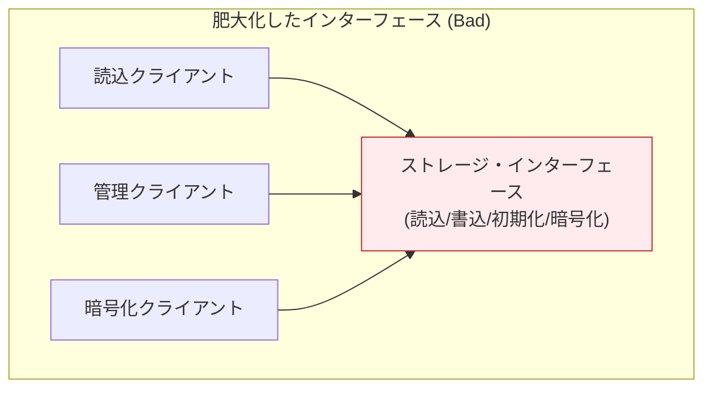
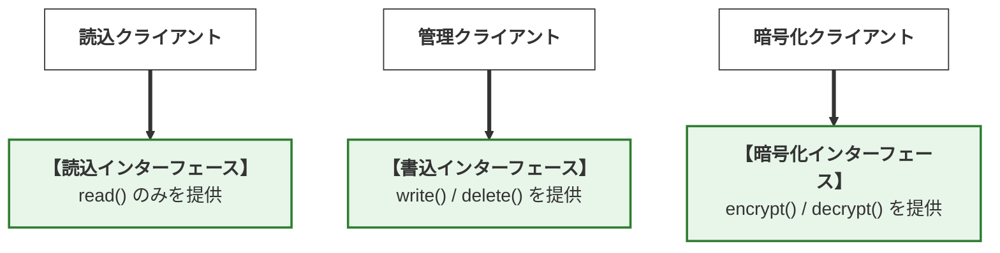
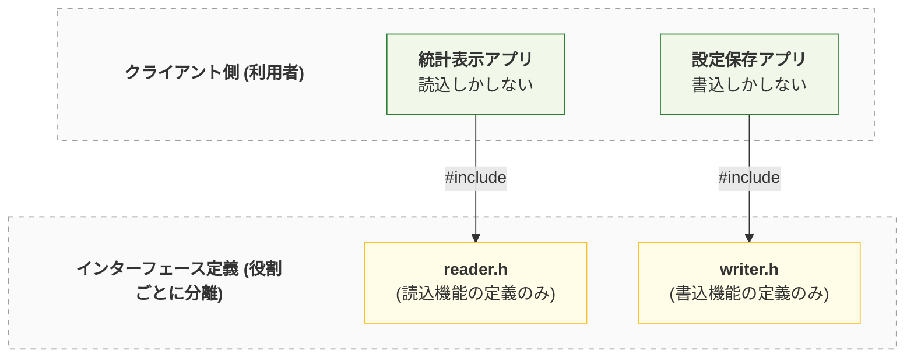
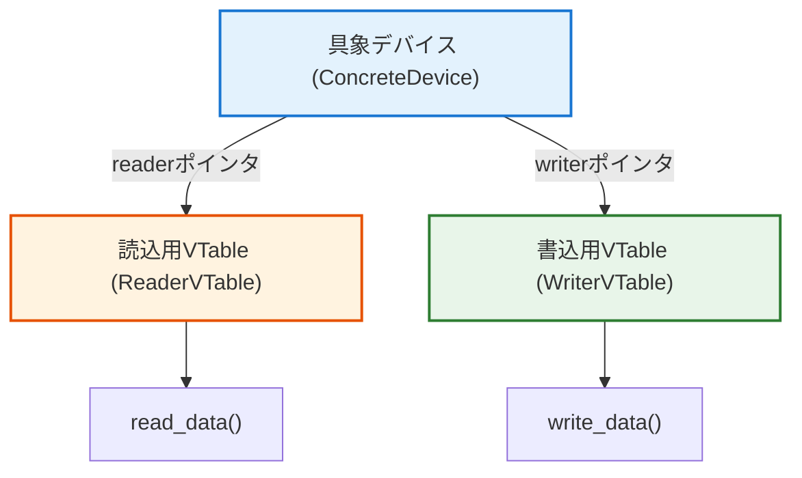
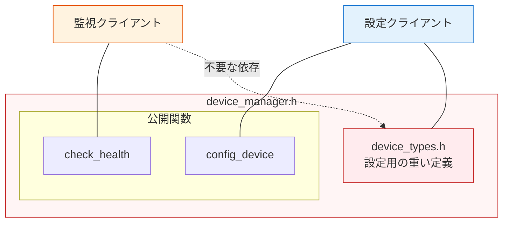
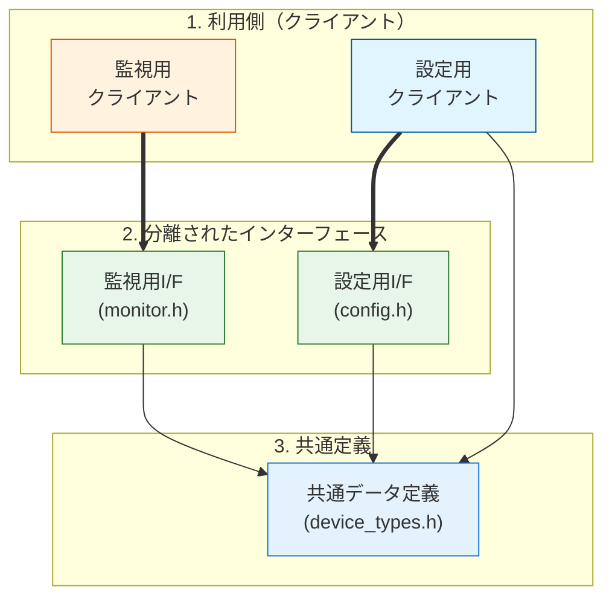
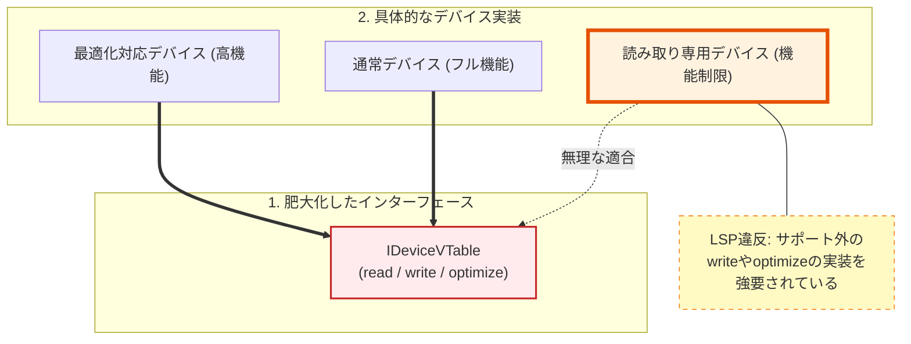
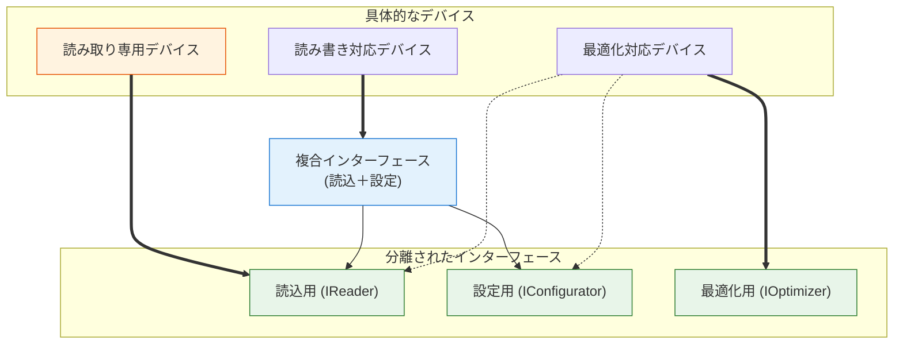

# 第2部 第11章 インターフェース分離原則 (ISP): 不要な依存の排除とモジュール結合度の最小化

本章の主題は、設計の三本柱のうち **「契約」** の柱であり、同時に **「依存」** にも深く関わっています。インターフェース分離原則 (ISP) を適用することで、クライアントが必要とする **「利用法」** の契約だけを提供し、不要な依存を断ち切ることで、 **変更容易性** を飛躍的に高めます。

## 1. 原則の哲学と本質

本原則は、 **『契約』** を最小化することで不要な **『依存』** を削ぎ落とします。

### 1.1. ISPの本質は「スリムな契約」と「依存のコスト」

 **「クライアントに、自身が使用しないインターフェースへの依存を強制してはなりません」。**

ISPの目標は、インターフェースを小さく、 **特定のクライアントのニーズに特化** させることです。これにより、一つの機能の変更が、その機能を使用しないクライアントにまで影響を及ぼすという、 **依存の汚染** を食い止めます。

#### 依存のコスト：なぜ「太ったインターフェース」は悪なのか

『太ったインターフェース』とは、クライアントが実際には使わない関数まで含む、過剰に大きなインターフェースを指します。例えば、読み取り専用のクライアントに対して、書き込み関数まで含むインターフェースを強制するような設計です。

この肥大化が、不要な依存とコンパイル時間の増大を招きます。

#### 肥大化したインターフェースの問題点

すべてのクライアントが、一つの巨大なインターフェースに依存している状態（アンチパターン）です。例えば「読込クライアント」は、本来無関係な暗号化機能が変更されただけでも、その影響（再コンパイルなど）を受けてしまいます。

これが「依存の汚染」です。



#### 分離されたインターフェース（理想形）

ISPを適用し、役割ごとにインターフェースを分割した状態です。

*   **依存の限定** : 各クライアントは自分に必要な「契約」だけを知っています。
*   **影響の遮断** : 暗号化機能の変更は、読込クライアントには一切影響しません。垂直方向に独立した3つのレーン。



ISPが解決しようとしているのは、インターフェースに「あれもこれも」詰め込んだ結果発生する、以下の2つの深刻な物理的および概念的なコストです。

#### 物理的依存による再コンパイルの連鎖

例えば、`storage_interface.h` という巨大なヘッダに `read`, `write`, `format`, `encrypt` など、あらゆる操作が定義されているとします。たとえクライアントAが `read` しか使わなくても、`encrypt` の引数の型が変更されただけで、クライアントAを含めたすべての依存モジュールが再コンパイルの対象となってしまいます。

大規模プロジェクトにおいて、このような不要な依存関係はビルド時間を増大させるだけでなく、バイナリサイズの変化や予期せぬリンクエラーのリスクを生み出します。「触っていない場所のせいでビルドが通らない」という状況は、開発サイクルを著しく停滞させる大きな要因です。

#### 概念的依存による設計の歪みとLSP違反

さらに深刻なのが、概念的な依存がもたらす設計の歪みです。「読み取り専用デバイス」の具象クラスを作ろうとした際、インターフェースに `write` メソッドが存在すると、中身が空の関数や `return E_NOT_SUPPORTED;` を返すだけの「嘘の実装」を強いられることになります。

インターフェースを分けないまま「できないこと」を強いる設計は、第10章で学んだリスコフ置換原則 (LSP) への明白な違反を誘発します。利用者は「契約（インターフェース）にあるのだから当然呼べるはずだ」と期待しますが、実際には実行時にエラーが返ってしまうのです。この「期待と実態の乖離」こそが、複雑で不安定なシステムを生み出す正体と言えます。

## 2. C言語での実現手段と設計要素

C言語におけるISPの実現は、 **ヘッダファイル** の分割と **VTable（関数ポインタ構造体）** の設計が核となります。

### C言語でのISP実現の本質：物理と論理の切り離し

C言語でISPを徹底する場合、以下の2段階の分離を追求します。

#### 物理的な分離（ヘッダ・インクルードの最小化）

C言語では `#include` が依存のすべてを決定します。

#### インクルード関係の最適化

ヘッダファイルを「役割」ごとに分割し、クライアントが不要な情報を読み込まないようにする物理的な構成です。`ReaderUser` は `reader.h` しか知る必要がなく、`writer.h` の変更による再コンパイルは発生しません。



この設計の根本的な問題は、一つの構造体定義の中に、複数の役割の関数ポインタが混在している点にあります。これにより、特定の役割しか必要としないソースファイルにまで、不要な型情報（不必要な構造体や列挙型など）が流入してしまいます。

これを解決するためには、前方宣言と不完全型を駆使し、クライアントには「自分が見るべき型」のポインタだけを渡す設計が有効です。ヘッダファイルを `reader.h`, `writer.h` のように役割ごとに分割し、クライアントが必要な最小限の定義のみをインクルードするように構成します。

#### 論理的な分離（VTableのコンポジション）

多態性を実現するVTable（関数ポインタ構造体）の設計が重要です。

#### VTableのコンポジション構造

具象デバイス（Device）が、複数の小さなVTable（Reader, Writer）を保持（コンポジション）する構造です。巨大な一つのVTableを持つのではなく、機能ごとにポインタを持ちます。

これにより、`read` 機能を持たないデバイスは `reader` ポインタを持たない（または公開しない）という選択が可能になります。



ここでのアンチパターンは、`Storage_VTable` のような一つの大きな構造体にすべての関数ポインタを詰め込んでしまうことです。これでは、具象実装（ドライバ等）は、自身がサポートしていない機能であっても、その構造体の全メンバを埋めなければ（あるいはNULLにしなければ）ならなくなってしまいます。

この問題を回避するためには、VTableを `ReadCapability`, `WriteCapability` といった小さな役割単位の構造体に分割することが重要です。具象オブジェクトは、これらの小さな構造体をコンポジション（複合）することで、自分ができること（契約）だけを正しく公開します。

これにより、C言語特有の「構造体の密結合」を防ぎ、モジュール間の境界線を明確に引くことが可能になります。

## 3. 実践パターン：ISPを実現する三つの型

### 3.1. 実践パターン1：物理的なヘッダ依存の分離

モジュールが持つ複数の役割を「ヘッダファイル単位」で分割し、特定の機能しか使わないクライアントを、無関係な変更による再コンパイルから保護します。

#### システム概要

ここでは、デバイスが正常に稼働しているかを監視する **状態監視システム（Monitor）** と、デバイスの詳細な設定を行う **構成管理システム（Configurator）** の2つのユースケースを持つデバイス管理基盤を実装します。これらのシステムは、共通のデバイスを対象としつつも、監視用APIと重厚な設定用APIという全く異なる要求事項を持つクライアントがそれぞれ存在するという要件を持っています。

#### 設計課題

この要件に対し、最も直感的に構築されやすいのが、以下の `device_manager.h` のように「デバイスに関する機能だから」という理由で全ての定義とAPIを一つのヘッダファイルにまとめてしまうケースです。ここには、デバイスの状態を監視する **Monitor（監視）** の機能と、詳細な設定を行う **Configurator（設定）** の機能が同居しています。

この「太ったヘッダ」の設計は、ISPの観点から見ると **「未使用機能への不要な依存」** を強制するアンチパターンです。監視クライアントにとっては、状態を返す単純な関数（`check_health`）だけがあれば十分であるにもかかわらず、このヘッダをインクルードした瞬間、設定用の巨大なデータ構造（`device_types.h`）まで道連れに読み込まされてしまいます。もし将来、設定項目（IPアドレスやポート番号など）が追加・変更された場合、設定の仕組みに全く関心のない監視クライアントまでが「依存先が変更された」という理由だけで巻き添えで再コンパイルを余儀なくされます。システムが成長しヘッダが肥大化するにつれ、この「不要な連鎖」はビルド時間を爆発させ、開発効率を著しく低下させます。

#### 設計の意図

この再コンパイルの連鎖を断ち切るための設計手法が、 **「ヘッダファイル（契約の窓口）の物理的な分割」** です。

実装（`.c` ファイル）がどれほど巨大で複数の役割を兼ね備えていたとしても、外部のクライアントに見せる窓口（ヘッダファイル）は、役割ごとに細かく（例えば監視用と設定用に）切り分けて提供すべきです。監視クライアントには、監視に必要な最小限の宣言のみを持たせた専用のヘッダ（以下の `device_monitor.h`）を提供し、重厚なデータ定義への依存（`#include`）を一切排除します。これにより、設定機能側にどれほど破壊的な変更が加わろうとも、監視用ヘッダは無傷に保たれ、監視クライアントは再コンパイルという物理的ダメージから完全に隔離される（不要な依存が排除される）のです。

#### 違反時の依存関係

`device_manager.h` が肥大化し、クライアントが必要のない情報（`device_types.h`）にまで間接的に依存してしまっている状態です。監視クライアント（M）は設定定義（DT）を必要としませんが、ヘッダが統合されているため強制的に読み込まされます。



このヘッダファイルでは、設定に必要な巨大なデータ構造（`device_types.h`）を読み込んだ上で、「設定用API」と「監視用API」の両方を一つのファイルに詰め込んでしまっています。

この構造の恐ろしさは、将来もし「設定項目」に新しいフィールドが追加されただけで、設定機能には全く関心のないはずの「監視用クライアント」までが、巻き添えで再コンパイルを強制される点にあります。これがいわゆる「太ったヘッダが引き起こす再コンパイルの連鎖」です。

#### 再コンパイルの連鎖を招く肥大化したヘッダ

#### device_manager.h
```c
#ifndef DEVICE_MANAGER_H
#define DEVICE_MANAGER_H

/* * 設定に必要な詳細な定義。
 * 監視しかしないクライアントには本来不要な依存。
 */
#include "device_types.h"
// --- Configurator（設定担当）用のインターフェース ---
int device_manager_config_device(const DeviceConfig* config);
// --- Monitor（監視担当）用のインターフェース ---
int device_manager_check_health(void);
#endif
```

ここで問題となるのは、将来的にデバイスの設定項目が増え、`device_types.h` が一行でも修正された場合の影響範囲です。設定機能には一切関心がない「監視担当」のプログラムまで、「依存先（インクルード先）が変わった」というだけの理由で強制的に再コンパイルされてしまいます。大規模なシステムでは、この「不要な連鎖」がビルド時間を爆発させる元凶となり得ます。

#### ✅ 原則適用後：役割ごとに「契約」を切り分ける

ISPを適用し、インターフェースを役割ごとに物理的に分割します。クライアントが「知るべきこと」だけを定義したスリムなヘッダを提供します。

#### 分離後の依存関係

インターフェースを物理的に分割し、各クライアントが自分に必要なヘッダファイルのみをインクルードしている状態です。

*   **明確な分離** : `monitor.h` は `device_types.h` を知りません。
*   **安全な変更** : `device_types.h` を変更しても、影響を受けるのは設定クライアントだけで、監視クライアントは無傷です。



それでは、役割ごとに「契約（ヘッダ）」を切り分けていきましょう。

まずは、設定機能だけが独自に必要とする膨大なデータ構造（設定パラメータ）を、独立したヘッダファイルに隔離します。監視機能はこのファイルの存在すら知る必要がなくなります。

#### 設定機能専用の重いデータ定義

#### device_types.h
```c
#ifndef DEVICE_TYPES_H
#define DEVICE_TYPES_H
// 設定機能でのみ使用される重い定義
typedef struct {
    int ip_address;
    int port;
    char hostname[256];
    // その他多数の設定項目
} DeviceConfig;
#endif
```

次に、監視クライアント専用の「スリムな契約」です。
先ほど隔離した重たい `device_types.h` をここでは一切 `include` しないことが最大のポイントです。これにより、設定項目がどれだけ変化しようとも、このヘッダ自体は決して変更されず、監視クライアントは安全に守られます。

#### 監視クライアントを守るスリムな契約

#### device_monitor.h
```c
#ifndef DEVICE_MONITOR_H
#define DEVICE_MONITOR_H

/* * 【ISP適用】
 * 不要な "device_types.h" のインクルードを排除。
 * 監視に必要な最小限のプロトタイプ宣言のみを公開。
 */
int device_manager_check_health(void);
#endif
```

そしてこちらは、設定クライアント専用の契約です。
この機能は当然設定データを利用するため、先ほど隔離した `device_types.h` を堂々と `include` します。設定クライアントは、設定が変われば当然再コンパイルされる運命にあるため、ここは論理的に正しい依存関係と割り切ります。

#### 必要な依存だけを受け入れる設定機能の契約

#### device_configurator.h
```c
#ifndef DEVICE_CONFIGURATOR_H
#define DEVICE_CONFIGURATOR_H
#include "device_types.h" // 設定機能に必要な型定義のみここで読み込む

int device_manager_config_device(const DeviceConfig* config);
#endif
```

これらを実際に処理する具象モジュールの内部です。

ここではすべて（監視用、設定用の両方）のヘッダを `include` して実装を行います。つまり、外部のクライアントには「監視用」「設定用」という別々の窓口（顔）を見せておいて、バックエンドでは同じ一つの巨大なモジュールが両方の仕事をこなしている状態です。ISPの非常に強力な点の一つが、「外部から見えるインターフェースの分割」と「実際の実装の統合」を両立できる点にあります。

#### 複数の契約を裏側で統合する具象実装

#### device_manager.c
```c
#include "device_monitor.h"
#include "device_configurator.h"
#include <stdio.h>

int device_manager_check_health(void) {
    // 実際の実装

    return 0; // OK
}

int device_manager_config_device(const DeviceConfig* config) {
    if (!config) return -1;
    printf("Configuring device: %s\n", config->hostname);

    return 0;
}
```

最後に、監視機能しか使わないクライアントから見ると、世界は非常にシンプルになります。

自分が必要とする `device_monitor.h` という窓口だけを知っていればよく、設定機能の存在や内部の複雑な事情は一切見えません。この「見えない」という事実こそが、モジュール間の結合度を劇的に低下させ、再コンパイルの連鎖を断ち切る強力な壁（ファイアウォール）となるのです。

#### 余計な依存から解放された監視クライアント

#### Client_Monitor.c
```c
#include <stdio.h>
#include "device_monitor.h" // 必要な契約だけをインクルード

int main(void) {
    // 設計の意図:
    // このファイルは "device_types.h" の存在を一切知らない。
    // 設定機能側にどれほど変更があっても、このファイルが再ビルドされることはない。
    if (device_manager_check_health() != 0) {
        printf("[Monitor] Health check failed.\n");
    } else {
        printf("[Monitor] System is healthy.\n");
    }

    return 0;
}
```

#### 設計のポイント：物理的な壁を作る

この分離により、`device_manager.c`（実装側）が複数の役割を持っていても、 **クライアントからは特定の側面しか見えない** という状態を作ることができました。

- **変更の局所化** : 設定機能の変更が監視機能に波及しない。
- **ビルドの高速化** : 不要なヘッダの読み込みと解析がスキップされる。
- **認知的負荷の低減** : クライアントの開発者は、膨大な設定パラメータを理解しなくても、単一の関数だけを見て実装に集中できる。

### 3.2. 実践パターン2：VTableの役割分離とCompositionの徹底

実践パターン1では「ヘッダファイル」による物理的な分離を学びました。しかし、第2章および第4章で解説した **VTable（関数ポインタ構造体）** そのものが肥大化している場合、別の深刻な問題が発生します。

ここでは、VTableを役割ごとに細かく分断し、 **Composition（複合）** によって再構成する手法を解説します。

#### システム概要

ここでは、読み取り専用デバイス、通常デバイス、高機能デバイスなど、個別の機能差を持つ複数のハードウェアを統一的に扱う**デバイス操作インターフェース**を設計します。このシステムは、「読み取り（read）」「書き込み（write）」「最適化（optimize）」といった複数の異なる操作APIを定義し、それぞれのハードウェア特性に応じて必要な機能のみを安全に提供するという要件を持っています。

#### 設計課題

この要件に対し、多態性の実現を名目にして「とりあえずこのデバイスが持っていそうな機能を全部一つの構造体に突っ込んでおこう」と安易に設計されたのが、以下の巨大な `IDeviceVTable`（太ったVTable）です。

この構造体に読み取り、設定書き込み、最適化といった性質の異なる操作がすべて同居してしまうと、「読み取り専用（書き込めない）」デバイスや「最適化機能なんて持たない」廉価版デバイスにとって、完全な機能の押し付け（ISP違反）となります。読み取り専用デバイス（以下の `ReadOnlyDevice.c`）の実装者は、自分が提供できるのは `read_data` だけであるにもかかわらず、コンパイルを通すためだけに `write_config` という関数を無理やり書き、「サポートしていません（エラー）」と返すだけの嘘の実装を強いられます。この「できないことを契約させられる」状態は、第10章で触れた **LSP違反（事後条件の崩壊）を直接的に誘発** し、クライアントは「呼び出してみるまで成功するか分からない」という極めて不安定な状態に陥ります。

#### 設計の意図

この「太ったVTableが引き起こす実装の強制と嘘」を根本から解決するためのISPの処方箋が、 **「VTableの極小化とComposition（複合）」** です。

VTableは「一つの責任（Capabilities）」ごとに限界まで細かく切り刻みます。例えば「読み取り能力（Reader）」「書き込み能力（Configurator）」「最適化能力（Optimizer）」というように、最小単位の独立したVTable（以下の `IReaderVTable` など）を複数定義します。そして、クライアントが「読み取りと設定、両方の機能」を要求する場合にのみ、それらの細かなポインタを束ねた新しい「複合契約（コンポジット構造体：`IDeviceRWC`）」を作り上げて渡すようにします。これにより、読み取り専用デバイスは「自分が提供できる契約（`IReaderVTable`）だけを正直に実装すればよい」というクリーンな状態を取り戻し、LSPの完全な遵守と安全な多態性が実現されるのです。

#### 違反時のVTable構造

一つの `IDeviceVTable` にすべての機能が詰め込まれているため、一部の機能しかサポートしないデバイス（読み取り専用など）が、不要な契約を強制されている状態です。読み取り専用デバイス（RO）は、`write` 機能を実装できないにもかかわらず、VTableの構造上、そのスロットを埋めなくてはなりません（ **LSP違反の誘発** ）。



まずは、非常によく見かける「太ったVTable」のアンチパターンです。

「とりあえずデバイスが持っていそうな機能を全部この構造体に突っ込んでおこう」という安易な設計によって生み出された巨大な設計図です。これを契約にしてしまうと、「読み取り専用（書き込めない）」デバイスや「最適化機能なんて持たない」廉価デバイスにとって、完全な地獄が始まります。

#### あらゆる機能を詰め込んだ巨大なVTable

#### idevice_rw_config.h
```c
// すべての機能を詰め込んだVTable
typedef struct {
    int (*read_data)(void* self);
    int (*write_config)(void* self); // 読み取り専用デバイスには「不要な契約」
    int (*optimize_db)(void* self);  // 特定のデバイスにしか関係ない契約
} IDeviceVTable;
```

その地獄を強制された読み取り専用デバイスの実装がこちらです。

本来なら `read_data` だけを提供すればいいはずなのに、巨大なVTableの隙間を埋めるためだけに `write_config` という関数を無理やり実装させられ、さらに「ごめんなさい、私にはできません」とエラーを返すだけの「嘘の実装」を強要されています。これが、ISP違反がただちに **LSP違反（事後条件の崩壊）** を引き起こす瞬間です。

#### 不要な実装を強要されLSP違反を犯すデバイス

#### ReadOnlyDevice.c
```c
// 読み取り専用デバイスの実装
static int read_only_read_data(void* self) {
    // 実際の読み取り処理
    return 0;
}

static int read_only_write_config(void* self) {
    /* * 【LSP違反の予兆】
     * 契約上は存在するが、実装できないためエラーを返すしかない。
     * これにより、利用者は実行してみるまで成功するか分からない不安定な状態になる。
     */
    return -1; // "Not Supported"
}
static IDeviceVTable readonly_vtable = {
    .read_data = read_only_read_data,
    .write_config = read_only_write_config, // 無理やり埋める必要がある
    .optimize_db = NULL                     // あるいはNULLで濁すしかない
};
```

このような場当たり的な実装は、「具象クラスは抽象の契約を完全に履行しなければならない」というリスコフ置換原則 (LSP) への明白な違反を誘発してしまいます。

不必要なメソッドの実装を強いることは、コードの可読性を著しく下げるだけでなく、「そのオブジェクトで本当に何ができるのか」という最も重要な定義を曖昧にし、利用者を混乱に陥れる原因となります。

#### ✅ 原則適用後：VTableの細分化とComposition

ISPを適用し、VTableを「役割」ごとに最小単位まで分割します。そして、複数の役割を必要とする場合にのみ、それらを組み合わせて（Composition）一つのインターフェースとして定義します。

#### 理想的なコンポジション構造

インターフェースを機能（Reader, Configurator, Optimizer）ごとに細分化し、具象デバイスが必要な機能だけを組み合わせて（Composition）実装している状態です。

*   **柔軟な結合** : `COMP`（複合インターフェース）は、読込と設定が必要な場合のみ作られます。
*   **嘘のない実装** : 読み取り専用デバイス（RO）は `VR`（Reader）だけと契約しており、書込機能を実装する必要がありません。



VTableレベルでの解決策は、物理ヘッダの時と同じく「極限まで細かく切り刻む」ことです。

「読み取り」という能力（Capability）だけに特化した、最小単位のVTable（契約書）を定義します。

#### 読み取り能力だけに特化した最小の契約

#### idevice_reader.h
```c
#ifndef IDEVICE_READER_H
#define IDEVICE_READER_H

typedef struct {
    int (*read_data)(void* self);
} IReaderVTable;
#endif
```

続いて「設定の書き込み」という能力だけに特化したVTableです。これも単独で存在できる契約として分離します。

#### 設定の書き込み能力だけに特化した契約

#### idevice_configurator.h
```c
#ifndef IDEVICE_CONFIGURATOR_H
#define IDEVICE_CONFIGURATOR_H

typedef struct {
    int (*write_config)(void* self);
} IConfiguratorVTable;
#endif
```

「最適化」という特殊な能力も同様です。このように小さな契約のブロックパーツをたくさん用意しておくのがVTableをクリーンに保つISPの基本です。

#### データベース最適化能力だけに特化した契約

#### idevice_optimizer.h
```c
#ifndef IDEVICE_OPTIMIZER_H
#define IDEVICE_OPTIMIZER_H

typedef struct {
    int (*optimize_db)(void* self);
} IOptimizerVTable;
#endif
```

そしてクライアントが「読み取りと設定、両方の機能を持つデバイス」を要求する場合、先ほど細かく砕いた小さなVTableのポインタを束ねて、一つの「複合契約（コンポジット構造体）」を作り上げます。

機能ごとに関数ポインタの「島」が分かれているため、クライアントに対して明確に「どの機能の集まりを持っているか」を安全に宣言できるのです。

#### 必要な能力だけを束ねるコンポジット構造体

#### IDeviceRWC.h
```c
#ifndef IDEVICE_RWC_H
#define IDEVICE_RWC_H
#include "idevice_reader.h"
#include "idevice_configurator.h"
// 役割を統合するコンポジット構造体
// タグ名を与えることで前方宣言が可能になり、不完全型として扱えるようにします。
typedef struct IDeviceRWC {
    void* self;                     // 具象データへの不透明ポインタ（第4章の応用）
    const IReaderVTable* reader;    // 読込契約への参照
    const IConfiguratorVTable* config; // 設定契約への参照
} IDeviceRWC;
#endif
```

この細分化された世界において、読み取り専用デバイスがどのように救済されるかを見てみましょう。

自分が提供できるのは「読み取り」だけなので、当然 `IReaderVTable` の部分だけを正直に実装すれば任務完了です。嫌なダミー実装を強要されることも、利用者を騙すエラーを返す必要もなくなりました。具象実装が「自分のできること」だけを素直に表明できるクリーンな状態を取り戻したのです。

#### 自分が提供できる能力だけを素直に実装するデバイス

#### ReadOnlyDevice.c
```c
#include "idevice_reader.h"
#include <stdio.h>
static int readonly_read_data(void* self) {
    // コンパイラの未使用警告を抑制（実務では self を使用してデータを読み込む）
    (void)self;
    printf("[ReadOnlyDevice] Reading data...\n");

    return 0;
}
// 読み取り専用デバイスは IReaderVTable のみを実装
static const IReaderVTable readonly_vtable = {
    .read_data = readonly_read_data
};
// コンポジションのためのファクトリ
// ここでは簡易的に、readerのみを持つコンポジット構造体を返す例を示す
// ※本来は専用の構造体(IDeviceReadOnly)を用意するか、NULL許容設計にする
const IReaderVTable* get_readonly_vtable(void) {
    return &readonly_vtable;
}
// write_config や optimize_db の実装は一切不要！
```

最後に、この「複合された機能」を利用するファームウェア更新クライアントの視点です。

クライアントは、引き渡された `IDeviceRWC` が内包する `reader` と `config` という二つの別のVTableを経由して操作を行います。自分が要求した二つの機能ブロックが「ポインタとして存在している」ことにのみ依存し、巨大な一つのVTableを持たされる重苦しさから解放されています。

#### 複合されたポインタから安全に機能を利用するクライアント

#### Client_Updater.c
```c
#include "IDeviceRWC.h"
#include <stdio.h>
#include <stdlib.h>
// ダミー実装（コンパイルを通すため）
static int dummy_read(void* s) { (void)s; printf("Read OK\n"); return 0; }
static int dummy_write(void* s) { (void)s; printf("Write OK\n"); return 0; }
static const IReaderVTable r_vt = { .read_data = dummy_read };
static const IConfiguratorVTable c_vt = { .write_config = dummy_write };

void firmware_update_process(IDeviceRWC* device) {
    if (!device || !device->reader || !device->config) return;
    /* 各VTableの関数に対し、共通の self を渡すことで多態性を実現 */
    printf("--- Firmware Update Process ---\n");

    if (device->reader->read_data(device->self) != 0) {
        printf("Read failed\n");

        return;
    }

    if (device->config->write_config(device->self) != 0) {
        printf("Config write failed\n");

        return;
    }
}
```

もちろん、呼び出し側（最上位の `main` など）は、各機能をパズルのように組み合わせてセット（DI）するだけです。
必要に応じて、最適化機能を持つデバイスなら追加で `optimizer` のポインタをセットした複合構造体を作って渡せば良いのです。

#### 機能をパズルのように組み立てて注入するコード

#### main.c
```c
int main(void) {
    // 擬似的なデバイス生成（本来はFactoryで行う）
    IDeviceRWC my_device = {
        .self = NULL,
        .reader = &r_vt,
        .config = &c_vt
    };
    firmware_update_process(&my_device);

    return 0;
}
```

#### 設計のポイント：具象を「型」の制約から解放する

この設計により、読み取り専用デバイスは `IReaderVTable` だけを実装すればよくなります。

- **契約の誠実さ** : 具象クラスは「できること」だけを表明すればよく、ダミー実装が不要になる。
- **利用側の安全性** : クライアントは、そのオブジェクトが確実に提供している機能（役割）だけを叩くことができる。
- **拡張性** : 将来的に「最適化機能」を追加する場合も、既存の `IReader` や `IConfigurator` に触れることなく、新しい役割（VTable）を追加するだけで済みます。
