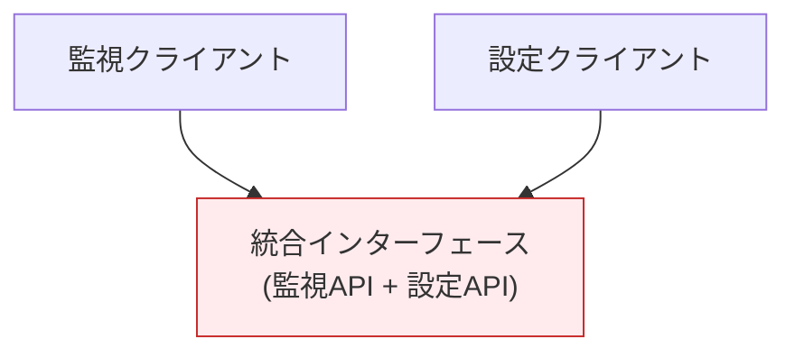
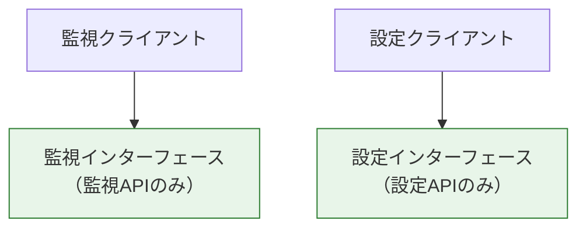
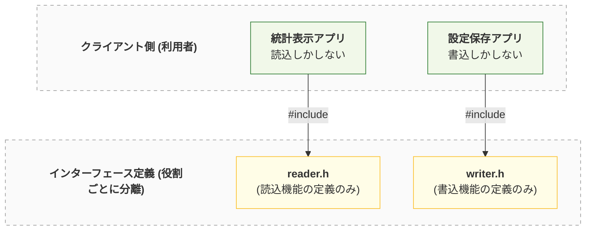
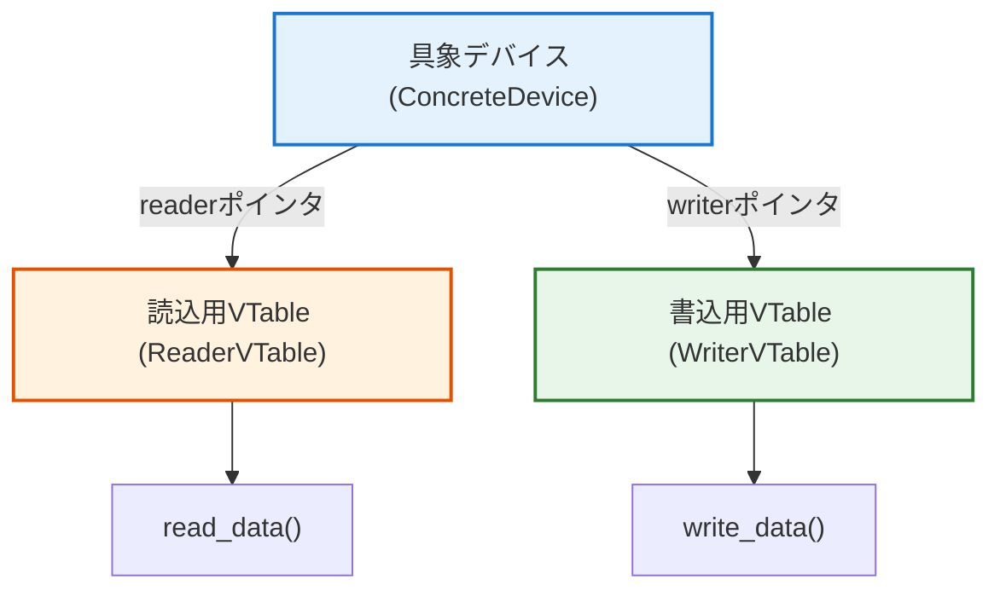
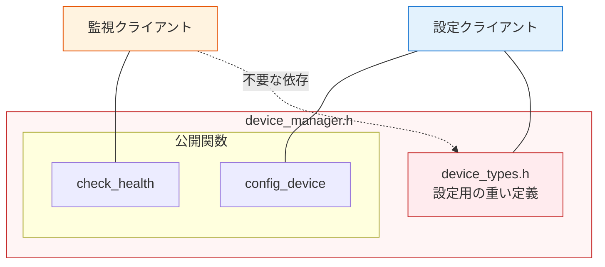
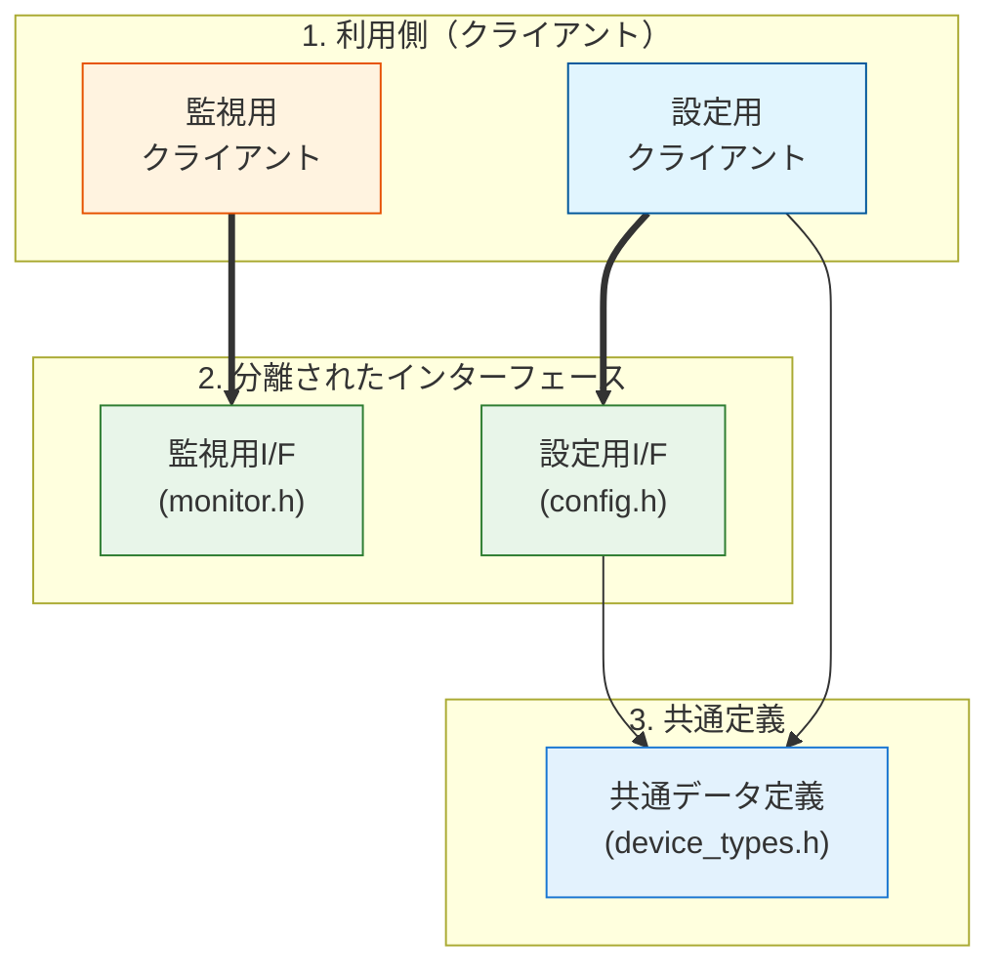
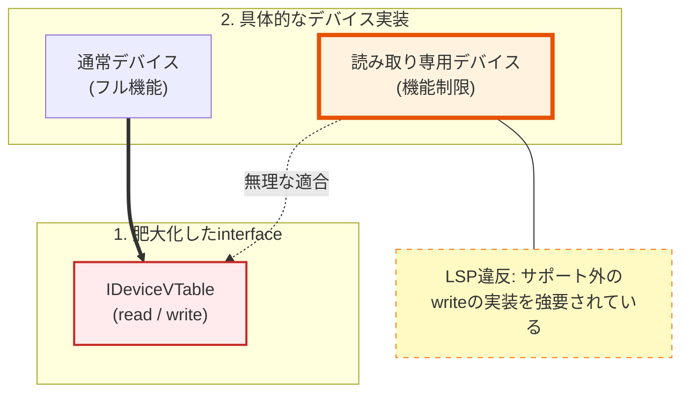

# 第2部 第11章 インターフェース分離原則 (ISP): 不要な依存の排除とモジュール結合度の最小化

本章のテーマは、 **「誰に何を見せるか」** という設計の問いです。インターフェース分離原則 (ISP) を適用することで、クライアントが必要とする「利用法（契約）」だけを提供し、無関係な変更の影響から守ることで、 **変更容易性** を飛躍的に高めます。

## 1. 原則の哲学と本質

### 1.1. SRPとISPの「切り口」の違い：内部か、外部か

ISP章に入る前に、前章のSRPとの違いを明確にしておきます。両者はどちらも「分割する」原則ですが、 **分割の着眼点（切り口）が根本的に異なります。**

| 原則 | 着眼点 | 問い | 何に注目するか |
| --- | --- | --- | --- |
| **SRP（単一責任原則）** | **モジュールの「内側」** | この実装を変更する理由は一つか？ | **変更の軸**（コードの凝集度） |
| **ISP（インターフェース分離原則）** | **モジュールの「外側」** | この窓口（ヘッダ/VTable）に、不要なものまで含まれていないか？ | **利用者の役割**（契約の粒度） |

**SRP** は、実装（`.c` ファイルや構造体の中身）を「変更の軸（アクター）」ごとに分割します。「このモジュールを変更したいと思うのは誰か？」という問いが出発点です。

**ISP** の問いは「このモジュールを **利用する** のは誰か？」という外向きの問いです。利用者（クライアントアクター）が異なる場合、それぞれに必要なAPIだけを持った別々の窓口（ヘッダファイル・VTable）を用意すべきです。

> [!IMPORTANT] 重要：ISPの分割軸はSRPと同じ「アクター」です
> SRPが内部の「変更者アクター」を分割軸にすることと对称的に、ISPの分割軸は「利用者アクター」です。 **「誰がこのインターフェースを利用するか」** という問いが境界線を決める基準になります。監視アクターと設定アクターが別々なら、それぞれに専用の窓口を用意するのが正しい設計です。

### 1.2. ISPの本質は「スリムな契約」と「依存のコスト」

 **「クライアントに、自身が使用しないインターフェースへの依存を強制してはなりません」。**

ISPの実害は2つあります。第一に **物理的な依存**（再コンパイルの連鎖）、第二に **概念的な依存**（設計の歪みとLSP違反）です。

#### 物理的依存による再コンパイルの連鎖

例えば、`storage_interface.h` という巨大なヘッダに `read`, `write`, `format`, `encrypt` など、あらゆる操作が定義されているとします。たとえクライアントAが `read` しか使わなくても、`encrypt` の引数の型が変更されただけで、クライアントAを含めたすべての依存モジュールが再コンパイルの対象となってしまいます。

大規模プロジェクトにおいて、このような不要な依存関係はビルド時間を増大させるだけでなく、バイナリサイズの変化や予期せぬリンクエラーのリスクを生み出します。「触っていない場所のせいでビルドが通らない」という状況は、開発サイクルを著しく停滞させる大きな要因です。

#### 概念的依存による設計の歪みとLSP違反

さらに深刻なのが、概念的な依存がもたらす設計の歪みです。「読み取り専用デバイス」の具象クラスを作ろうとした際、インターフェースに `write` メソッドが存在すると、中身が空の関数や `return E_NOT_SUPPORTED;` を返すだけの「嘘の実装」を強いられることになります。

インターフェースを分けないまま「できないこと」を強いる設計は、第10章で学んだリスコフ置換原則 (LSP) への明白な違反を誘発します。利用者は「契約（インターフェース）にあるのだから当然呼べるはずだ」と期待しますが、実際には実行時にエラーが返ってしまうのです。この「期待と実態のズレ」こそが、複雑で不安定なシステムを生み出す正体と言えます。

#### 改善の指針

この再コンパイルの連鎖を断ち切るための設計手法が、 **「ヘッダファイル（契約の窓口）の物理的な分割」** です。

ひとつの大きなヘッダファイルにすべての関数を詰め込むのではなく、利用者が「必要最小限の機能（契約）」だけに依存できるよう、物理的にファイルを分けるアプローチをとります。

#### 分離前後の依存イメージ

分離前は、異なるアクター（監視クライアント・設定クライアント）が同一の肥大化したインターフェースに依存しています。分離後は、各アクターが自分に必要な窓口のみを知ります。


#### 分離前（Bad）：一つの太った窓口

```mermaid
graph TB
      IF_All["統合インターフェース<br/>(監視API + 設定API)"]
      ClientA["監視クライアント"] --> IF_All
      ClientB["設定クライアント"] --> IF_All

      style IF_All fill:#ffebee,stroke:#c62828
```

#### 分離後（Good）：クライアントアクター別の窓口

```mermaid
graph TB
      IF_Mon["監視インターフェース<br/>（監視APIのみ）"]
      IF_Cfg["設定インターフェース<br/>（設定APIのみ）"]
      ClientC["監視クライアント"] --> IF_Mon
      ClientD["設定クライアント"] --> IF_Cfg

      style IF_Mon fill:#e8f5e9,stroke:#2e7d32
      style IF_Cfg fill:#e8f5e9,stroke:#2e7d32
```


## 2. C言語での実現手段と設計要素

C言語におけるISPの実現は、 **ヘッダファイル** の分割と **VTable（関数ポインタ構造体）** の設計が核となります。

### C言語でのISP実現の本質：物理と論理の切り離し

C言語でISPを徹底する場合、以下の2段階の分離を追求します。

#### 物理的な分離（ヘッダ・インクルードの最小化）

C言語では `#include` が依存のすべてを決定します。

#### インクルード関係の最適化

ヘッダファイルを「役割」ごとに分割し、クライアントが不要な情報を読み込まないようにする物理的な構成です。`ReaderUser` は `reader.h` しか知る必要がなく、`writer.h` の変更による再コンパイルは発生しません。


```mermaid
graph TB
      %% --- インターフェース層 ---
      subgraph Headers [" "]
          HeaderTitle["<b>インターフェース定義 (役割ごとに分離)</b>"]
          direction TB
          ReaderH["<b>reader.h</b><br/>(読込機能の定義のみ)"]
          WriterH["<b>writer.h</b><br/>(書込機能の定義のみ)"]
      end

      %% --- クライアント層 ---
      subgraph Clients [" "]
          ClientTitle["<b>クライアント側 (利用者)</b>"]
          direction TB
          ReaderUser["<b>統計表示アプリ</b><br/>読込しかしない"]
          WriterUser["<b>設定保存アプリ</b><br/>書込しかしない"]
      end

      %% 物理的なインクルード関係
      ReaderUser -->|#include| ReaderH
      WriterUser -->|#include| WriterH

      %% タイトル用ノードのスタイル（枠線を消して見出しに見せる）
      style HeaderTitle fill:none,stroke:none,font-size:16px
      style ClientTitle fill:none,stroke:none,font-size:16px

      %% 各要素のスタイル
      style ReaderUser fill:#f1f8e9,stroke:#2e7d32
      style WriterUser fill:#f1f8e9,stroke:#2e7d32
      style ReaderH fill:#fffde7,stroke:#fbc02d
      style WriterH fill:#fffde7,stroke:#fbc02d

      %% 外枠のスタイル
      style Headers fill:#fafafa,stroke:#9e9e9e,stroke-dasharray: 5 5
      style Clients fill:#fafafa,stroke:#9e9e9e,stroke-dasharray: 5 5
```

この設計の根本的な問題は、一つの構造体定義の中に、複数の役割の関数ポインタが混在している点にあります。これにより、特定の役割しか必要としないソースファイルにまで、不要な型情報（不必要な構造体や列挙型など）が流入してしまいます。

これを解決するためには、前方宣言と不完全型を駆使し、クライアントには「自分が見るべき型」のポインタだけを渡す設計が有効です。ヘッダファイルを `reader.h`, `writer.h` のように役割ごとに分割し、クライアントが必要な最小限の定義のみをインクルードするように構成します。

#### 論理的な分離（VTableのコンポジション）

多態性を実現するVTable（関数ポインタ構造体）の設計が重要です。

#### VTableのコンポジション構造

具象デバイス（Device）が、複数の小さなVTable（Reader, Writer）を保持（コンポジション）する構造です。巨大な一つのVTableを持つのではなく、機能ごとにポインタを持ちます。

これにより、`read` 機能を持たないデバイスは `reader` ポインタを持たない（または公開しない）という選択が可能になります。


```mermaid
    graph TB
    Device["具象デバイス (ConcreteDevice)"]
    Reader["読込用VTable (ReaderVTable)"]
    Writer["書込用VTable (WriterVTable)"]

    ReadFunc["read_data()"]
    WriteFunc["write_data()"]

    Device -->|"readerポインタ"| Reader
    Device -->|"writerポインタ"| Writer
    Reader --> ReadFunc
    Writer --> WriteFunc

    style Device fill:#e3f2fd,stroke:#1976d2,stroke-width:2px
    style Reader fill:#fff3e0,stroke:#e65100,stroke-width:2px
    style Writer fill:#e8f5e9,stroke:#2e7d32,stroke-width:2px
```

ここでのアンチパターンは、`Storage_VTable` のような一つの大きな構造体にすべての関数ポインタを詰め込んでしまうことです。これでは、具象実装（ドライバ等）は、自身がサポートしていない機能であっても、その構造体の全メンバを埋めなければ（あるいはNULLにしなければ）ならなくなってしまいます。

この問題を回避するためには、VTableを `ReadCapability`, `WriteCapability` といった小さな役割単位の構造体に分割することが重要です。具象オブジェクトは、これらの小さな構造体をコンポジション（複合）することで、自分ができること（契約）だけを正しく公開します。
これらを使い分けることで、継承よりも柔軟な関係性を構築できます。また、多態性（Polymorphism）については、 **関数ポインタ（およびその構造体）と不透明ポインタ** を組み合わせることで実現します。これらにより、具象実装ではなく抽象的な契約への依存が可能になるのです。

> [!INFO] 読者の疑問：ヘッダを分ける「基準」は？
> 「『利用者が誰かを把握してインターフェースを分離する（＝ヘッダを分ける）』という理解で良いでしょうか？」
>
> **はい、その通りです。それがISPの核心です。**
>
> これまでは「提供者側（自分）」の都合で一つのヘッダに何でも書いていましたが、ISPでは「利用者側（相手）」が誰で、何を必要としているかに注目します。
> モジュールが一つであっても、それを「監視する利用者」と「設定する利用者」が別人（別のアクター）であれば、それぞれの視界を遮らないように専用のヘッダ（窓口）を用意するのが正しい設計です。

## 3. 実践パターン：ISPを実現する三つの型

### 3.1. 実践パターン1：物理的なヘッダ依存の分離

モジュールが持つ複数の役割を「ヘッダファイル単位」で分割し、特定の機能しか使わないクライアントを、無関係な変更による再コンパイルから保護します。

#### システム概要

ここでは、デバイスが正常に稼働しているかを監視する **状態監視システム（Monitor）** と、デバイスの詳細な設定を行う **構成管理システム（Configurator）** の2つのユースケースを持つデバイス管理基盤を実装します。これらのシステムは、共通のデバイスを対象としつつも、監視用APIと重厚な設定用APIという全く異なる要求事項を持つクライアントがそれぞれ存在するという要件を持っています。

#### 設計課題

この要件に対し、最も直感的に構築されやすいのが、以下の `device_manager.h` のように「デバイスに関する機能だから」という理由で全ての定義とAPIを一つのヘッダファイルにまとめてしまうケースです。ここには、デバイスの状態を監視する **Monitor（監視）** の機能と、詳細な設定を行う **Configurator（設定）** の機能が同居しています。

この「太ったヘッダ」の設計は、ISPの観点から見ると **「未使用機能への不要な依存」** を強制するアンチパターンです。監視クライアントにとっては、状態を返す単純な関数（`check_health`）だけがあれば十分であるにもかかわらず、このヘッダをインクルードした瞬間、設定用の巨大なデータ構造（`device_types.h`）まで道連れに読み込まされてしまいます。もし将来、設定項目（IPアドレスやポート番号など）が追加・変更された場合、設定の仕組みに全く関心のない監視クライアントまでが「依存先が変更された」という理由だけで巻き添えで再コンパイルを余儀なくされます。システムが成長しヘッダが肥大化するにつれ、この「不要な連鎖」はビルド時間を爆発させ、開発効率を著しく低下させます。

#### 違反時の依存関係

`device_manager.h` が肥大化し、クライアントが必要のない情報（`device_types.h`）にまで間接的に依存してしまっている状態です。監視クライアントは設定定義を必要としませんが、ヘッダが統合されているため強制的に読み込まされます。


```mermaid
graph TB
      %% クライアント
      M["監視クライアント"]
      C["設定クライアント"]

      %% 太ったヘッダ
      subgraph HeavyHeader [device_manager.h]
          direction TB
          DT["device_types.h<br/>設定用の重い定義"]

          subgraph Methods [公開関数]
          direction TB
              Health["check_health"]
              Config["config_device"]
          end
      end

      %% 接続（重なりを避けるため曲線を最小化）
      M --- Health
      C --- Config
      C --- DT

      %% 依存の混入を強調
      M -.->|"不要な依存"| DT

      %% スタイル（全角を含まないよう修正）
      style HeavyHeader fill:#fff5f5,stroke:#c62828
      style DT fill:#ffebee,stroke:#c62828
      style M fill:#fff3e0,stroke:#e65100
      style C fill:#e3f2fd,stroke:#1976d2
```

これを受けて、具体的な設計課題を見ていきましょう。まずは、本章の例で使用する「重い」データ定義の全貌です。

#### device_types.h (システム全体で共有される重いデータ定義)
```c
#ifndef DEVICE_TYPES_H
#define DEVICE_TYPES_H
// 設定機能でのみ使用される詳細な構造体。
// 監視クライアントには本来不要な情報が含まれている。
typedef struct {
    int ip_address;
    int port;
    char hostname[256];
    // その他、膨大な設定パラメータ...
} DeviceConfig;
#endif
```

この構造体の恐ろしさは、将来もし「設定項目」に新しいフィールドが追加されただけで、設定機能には全く関心のないはずの「監視用クライアント」までが、巻き添えで再コンパイルを強制される点にあります。これがいわゆる「太ったヘッダが引き起こす再コンパイルの連鎖」です。

#### device_manager.h (再コンパイルの連鎖を招く肥大化したヘッダ)
```c
#ifndef DEVICE_MANAGER_H
#define DEVICE_MANAGER_H

/* * 設定に必要な詳細な定義。
 * 監視しかしないクライアントには本来不要な依存。
 */
#include "device_types.h"

// --- Configurator（設定担当）用のインターフェース ---
int device_manager_config_device(const DeviceConfig* config);

// --- Monitor（監視担当）用のインターフェース ---
int device_manager_check_health(void);
#endif
```

#### device_manager.c (違反例の実装 - すべてを一つのファイルで処理)
```c
#include "device_manager.h"
#include <stdio.h>

int device_manager_check_health(void) {
    // 監視ロジック
    return 0; // OK
}

int device_manager_config_device(const DeviceConfig* config) {
    if (!config) return -1;
    // 設定変更ロジック
    printf("Configuring device: %s\n", config->hostname);
    return 0;
}
```
ここで問題となるのは、将来的にデバイスの設定項目が増え、`device_types.h` が一行でも修正された場合の影響範囲です。設定機能には一切関心がない「監視担当」のプログラムまで、「依存先（インクルード先）が変わった」というだけの理由で強制的に再コンパイルされてしまいます。大規模なシステムでは、この「不要な連鎖」がビルド時間を爆発させる元凶となり得ます。

監視クライアントから見ると、このヘッダを使ったコードは次のようになります。`check_health` だけを呼びたいのに、設定用の重い `DeviceConfig` 型まで知っている状態でコンパイルされます。

#### main.c (監視クライアント - 太ったヘッダへの依存を強いられる側)
```c
#include <stdio.h>
#include "device_manager.h" // 太ったヘッダ：device_types.hも道連れにインクルードされる

int main(void) {
    // 監視しかしないのに、DeviceConfigの定義まで知ってしまっている（ISP違反）
    if (device_manager_check_health() != 0) {
        printf("[Monitor] Health check failed.\n");
    } else {
        printf("[Monitor] System is healthy.\n");
    }
    return 0;
}
```

#### 実行結果（違反状態：動作するが、設計的なリスクを抱えている）
```c
[Monitor] System is healthy.
```

ISPを適用し、インターフェースを役割ごとに物理的に分割します。クライアントが「知るべきこと」だけを定義したスリムなヘッダを提供します。

#### 分離後の依存関係

インターフェースを物理的に分割し、各クライアントが自分に必要なヘッダファイルのみをインクルードしている状態です。

*   **明確な分離** : `monitor.h` は `device_types.h` を知りません。
*   **安全な変更** : `device_types.h` を変更しても、影響を受けるのは設定クライアントだけで、監視クライアントは無傷です。


```mermaid
graph TB
      %% 1. クライアント層
      subgraph Clients ["1. 利用側（クライアント）"]
          direction TB
          Monitor["監視用<br/>クライアント"]
          Configurator["設定用<br/>クライアント"]
      end

      %% 2. 抽象層
      subgraph Headers ["2. 分離されたインターフェース"]
          direction TB
          DM["監視用I/F<br/>(monitor.h)"]
          DC["設定用I/F<br/>(config.h)"]
      end

      subgraph Common ["3. 共通定義"]
          DT["共通データ定義<br/>(device_types.h)"]
      end

      %% 接続関係：必要なインターフェースのみを参照
      Monitor ==> DM
      Configurator ==> DC

      %% 共通定義への依存
      DC --> DT
      Configurator --> DT

      %% スタイル設定
      style DM fill:#e8f5e9,stroke:#2e7d32
      style DC fill:#e8f5e9,stroke:#2e7d32
      style DT fill:#e3f2fd,stroke:#1976d2
      style Monitor fill:#fff3e0,stroke:#e65100
      style Configurator fill:#e1f5fe,stroke:#01579b
```

それでは、役割ごとに「契約（ヘッダ）」を切り分けていきましょう。

まずは、設定機能だけが独自に必要とするデータ構造（設定パラメータ）への依存を、関連するヘッダファイルだけに閉じ込めます。これにより、監視機能はこの「重い定義」の存在すら知る必要がなくなります。

#### device_types.h (設定機能でのみ必要とされるデータ定義)
```c
#ifndef DEVICE_TYPES_H
#define DEVICE_TYPES_H
// 設定機能でのみ使用される重い定義
typedef struct {
    int ip_address;
    int port;
    char hostname[256];
    // その他多数の設定項目
} DeviceConfig;
#endif
```

次に、監視クライアント専用の「スリムな契約」です。
先ほど隔離した重たい `device_types.h` をここでは一切 `include` しないことが最大のポイントです。これにより、設定項目がどれだけ変化しようとも、このヘッダ自体は決して変更されず、監視クライアントは安全に守られます。

#### device_monitor.h (監視クライアントを守るスリムな契約)
```c
#ifndef DEVICE_MONITOR_H
#define DEVICE_MONITOR_H

/* * 【ISP適用】
 * 不要な "device_types.h" のインクルードを排除。
 * 監視に必要な最小限のプロトタイプ宣言のみを公開。
 */
int device_manager_check_health(void);
#endif
```

そしてこちらは、設定クライアント専用の契約です。
この機能は当然設定データを利用するため、先ほど隔離した `device_types.h` を堂々と `include` します。設定クライアントは、設定が変われば当然再コンパイルされる運命にあるため、ここは論理的に正しい依存関係と割り切ります。

#### device_configurator.h (必要な依存だけを受け入れる設定機能の契約)
```c
#ifndef DEVICE_CONFIGURATOR_H
#define DEVICE_CONFIGURATOR_H
#include "device_types.h" // 設定機能に必要な型定義のみここで読み込む

int device_manager_config_device(const DeviceConfig* config);
#endif
```

これらを実際に処理する具象モジュールの内部です。

ここではすべて（監視用、設定用の両方）のヘッダを `include` して実装を行います。つまり、外部のクライアントには「監視用」「設定用」という別々の窓口（顔）を見せておいて、バックエンドでは同じ一つの巨大なモジュールが両方の仕事をこなしている状態です。ISPの非常に強力な点の一つが、「外部から見えるインターフェースの分割」と「実際の実装の統合」を両立できる点にあります。

#### device_manager.c (複数の契約を裏側で統合する具象実装)
```c
#include "device_monitor.h"
#include "device_configurator.h"
#include <stdio.h>

int device_manager_check_health(void) {
    // 実際の実装

    return 0; // OK
}

int device_manager_config_device(const DeviceConfig* config) {
    if (!config) return -1;
    printf("Configuring device: %s\n", config->hostname);

    return 0;
}
```

最後に、監視機能しか使わないクライアントから見ると、世界は非常にシンプルになります。

自分が必要とする `device_monitor.h` という窓口だけを知っていればよく、設定機能の存在や内部の複雑な事情は一切見えません。この「見えない」という事実こそが、モジュール間の結合度を劇的に低下させ、再コンパイルの連鎖を断ち切る強力な壁（ファイアウォール）となるのです。

#### Client_Monitor.c (余計な依存から解放された監視クライアント)
```c
#include <stdio.h>
#include "device_monitor.h" // 必要な契約だけをインクルード

int main(void) {
    // 設計の意図:
    // このファイルは "device_types.h" の存在を一切知らない。
    // 設定機能側にどれほど変更があっても、このファイルが再ビルドされることはない。
    if (device_manager_check_health() != 0) {
        printf("[Monitor] Health check failed.\n");
    } else {
        printf("[Monitor] System is healthy.\n");
    }

    return 0;
}
```

#### 実行結果（適用後）
```c
[Monitor] System is healthy.
```

#### 適用前後の設計差分

| 観点 | 適用前（太ったヘッダ） | 適用後（分離したヘッダ） |
| --- | --- | --- |
| **監視クライアントの依存** | `device_types.h`（不要な設定定義）まで読み込む | `device_monitor.h`だけをインクルード |
| **設定項目追加時の影響** | 監視クライアントも再コンパイル強制 | 監視クライアントは無傷 |
| **コードの認知負荷** | 監視担当者が詳細な構造体まで知る必要がある | 監視担当者は監視APIだけ知ればよい |
| **テスト・変更の範囲** | 設定APIの変更が影響範囲に混入する | 関心事ごとに独立している |

#### 設計のポイント：物理的な壁を作る

この分離により、`device_manager.c`（実装側）が複数の役割を持っていても、 **クライアントからは特定の側面しか見えない** という状態を作ることができました。

- **分割の軸はクライアントアクター** : 「監視する人」と「設定する人」という利用者の役割の違いが、ヘッダ分割の境界を決めました。
- **変更の局所化** : 設定機能の変更が監視機能に波及しない。
- **ビルドの高速化** : 不要なヘッダの読み込みと解析がスキップされる。
- **認知的負荷の低減** : クライアントの開発者は、膨大な設定パラメータを理解しなくても、単一の関数だけを見て実装に集中できる。

### 3.2. 実践パターン2：VTableの役割分離とCompositionの徹底

実践パターン1では「ヘッダファイル」による物理的な分離を学びました。しかし、第2章および第4章で解説した **VTable（関数ポインタ構造体）** そのものが肥大化している場合、別の深刻な問題が発生します。

ここでは、VTableを役割ごとに細かく分断し、 **Composition（複合）** によって再構成する手法を解説します。

#### システム概要

ここでは、読み取り専用デバイス、通常デバイスなど、個別の機能差を持つ複数のハードウェアを統一的に扱う**デバイス操作インターフェース**を設計します。このシステムは、「読み取り（read）」「書き込み（write）」といった異なる操作APIを定義し、それぞれのハードウェア特性に応じて必要な機能のみを安全に提供するという要件を持っています。

#### 設計課題

この要件に対し、多態性の実現を名目にして「とりあえずこのデバイスが持っていそうな機能を全部一つの構造体に突っ込んでおこう」と安易に設計されたのが、以下の巨大な `IDeviceVTable`（太ったVTable）です。

この構造体に読み取り、設定書き込みといった性質の異なる操作がすべて同居してしまうと、「読み取り専用（書き込めない）」デバイスにとって、完全な機能の押し付け（ISP違反）となります。読み取り専用デバイス（以下の `ROMDevice.c`）の実装者は、自分が提供できるのは `read_data` だけであるにもかかわらず、コンパイルを通すためだけに `write_config` という関数を無理やり書き、「サポートしていません（エラー）」と返すだけの嘘の実装を強いられます。この「できないことを契約させられる」状態は、第10章で触れた **LSP違反（事後条件の崩壊）を直接的に誘発** し、クライアントは「呼び出してみるまで成功するか分からない」という極めて不安定な状態に陥ります。

#### 違反時のVTable構造

一つの `IDeviceVTable` にすべての機能が詰め込まれているため、一部の機能しかサポートしないデバイス（読み取り専用など）が、不要な契約を強制されている状態です。読み取り専用デバイス（RO）は、`write` 機能を実装できないにもかかわらず、VTableの構造上、そのスロットを埋めなくてはなりません（ **LSP違反の誘発** ）。


```mermaid
graph TB
      subgraph Interface ["1. 肥大化したinterface"]
          VT["IDeviceVTable<br/>(read / write)"]
      end

      subgraph Impls ["2. 具体的なデバイス実装"]
          direction TB
          RO["読み取り専用デバイス<br/>(機能制限)"]
          RW["通常デバイス<br/>(フル機能)"]
      end

      %% 接続
      RO -.->|"無理な適合"| VT
      RW ==> VT

      %% 問題点の強調
      Problem["LSP違反: サポート外の<br/>writeの実装を強要されている"]

      %% 配置の調整
      RO --- Problem

      %% スタイル設定
      style VT fill:#ffebee,stroke:#c62828,stroke-width:2px
      style RO fill:#fff3e0,stroke:#e65100,stroke-width:4px
      style Problem fill:#fff9c4,stroke:#f57f17,stroke-dasharray: 5 5
```

まずは、非常によく見かける「太ったVTable」のアンチパターンです。

「とりあえずデバイスが持っていそうな機能を全部この構造体に突っ込んでおこう」という安易な設計によって生み出された巨大な設計図です。これを契約にしてしまうと、「読み取り専用（書き込めない）」デバイスにとって、完全な地獄が始まります。

#### idevice_rw_config.h (あらゆる機能を詰め込んだ巨大なVTable)
```c
// すべての機能を詰め込んだVTable
typedef struct {
    int (*read_data)(void* context);
    int (*write_config)(void* context); // 読み取り専用デバイスには「不要な契約」
} IDeviceVTable;
```

その地獄を強制された読み取り専用デバイスの実装がこちらです。

本来なら `read_data` だけを提供すればいいはずなのに、巨大なVTableの隙間を埋めるためだけに `write_config` という関数を無理やり実装させられ、さらに「ごめんなさい、私にはできません」とエラーを返すだけの「嘘の実装」を強要されています。これが、ISP違反がただちに **LSP違反（事後条件の崩壊）** を引き起こす瞬間です。

#### HDDDevice.c (読み書き対応：本来のVTable利用者)
```c
#include <stdio.h>
#include "idevice_rw_config.h"

static int disk_read(void* ctx) { printf("[%s] read OK\n", (char*)ctx); return 0; }
static int disk_write(void* ctx) { printf("[%s] write OK\n", (char*)ctx); return 0; }

IDeviceVTable disk_vtable = { 
    .read_data = disk_read, 
    .write_config = disk_write
};
```

#### ROMDevice.c (読み取り専用：不適切な実装を強要されている)
```c
#include <stdio.h>
#include "idevice_rw_config.h"

static int rom_read(void* ctx) { printf("[%s] read OK\n", (char*)ctx); return 0; }

static int rom_write_dummy(void* ctx) { 
    /* 【実装の負担】書き込み能力はないが、VTableを埋めるために実装が強制される */
    return -1; 
}

IDeviceVTable rom_vtable = { 
    .read_data = rom_read, 
    .write_config = rom_write_dummy
};
```

#### ❌ 原則適用前：太ったVTableによる不必要なメソッドの実装強制
#### main.c（太ったVTable：能力を区別できない多態性）
```c
#include <stdio.h>
#include "idevice_rw_config.h"

// データの読み取り：読み取り能力が必要
void data_read(IDeviceVTable* device, void* context) {
    printf("--- Data Reading Started ---\n");
    device->read_data(context);
}

// ファームウェア更新：読み取りと書き込みの両方の能力が必要
void firmware_update(IDeviceVTable* device, void* context) {
    printf("--- Firmware Update Started ---\n");
    device->read_data(context);
    if (device->write_config(context) != 0) {
        printf("[Error] Device does not support write operations.\n");
    }
}

int main(void) {
    char* dev_name = "Static_ROM_01";

    // 【期待される動作】ROMなので読み取りは成功する
    data_read(&rom_vtable, dev_name);

    // 【失敗する動作】しかし同じ型(IDeviceVTable*)なので、書き込みが必要な「更新」にも渡せてしまう
    firmware_update(&rom_vtable, dev_name);

    return 0;
}
```

#### 実行結果（適用前：一部の成功が、「本来できない操作」への誤解を招く）
```c
--- Data Reading Started ---
[Static_ROM_01] read OK
--- Firmware Update Started ---
[Static_ROM_01] read OK
[Error] Device does not support write operations.
```

`firmware_update` 関数の設計に問題はありません。`IDeviceVTable*` という型が「`read_data` も `write_config` も持っている」と表明しているのだから、両方を呼ぶのは当然です。しかし、型が能力を保証しているように見えて、実際の実装は嘘をついている ── これが太ったVTableの根本的な欠陥です。

コンパイラはこの矛盾を検知できません。ReadOnly デバイスも RW デバイスも、型としては全く同じ `IDeviceVTable*` だからです。

不必要なメソッドの実装を強いることは、コードの可読性を著しく下げるだけでなく、「そのオブジェクトで本当に何ができるのか」という最も重要な定義を曖昧にし、利用者を混乱に陥れる原因となります。

#### 改善の指針

この「太ったVTableが引き起こす実装の強制と嘘」を根本から解決するためのISPの処方箋が、 **「VTable of VTableの極小化とComposition（複合）」** です。

VTableは「一つの責任（Capabilities）」ごとに限界まで細かく切り刻みます。例えば「読み取り能力（Reader）」「書き込み能力（Configurator）」というように、最小単位の独立したVTable（以下の `IReaderVTable` など）を複数定義します。そして、クライアントが「読み取りと設定、両方の機能」を要求する場合にのみ、それらの細かなポインタを束ねた新しい「複合契約（コンポジット構造体）」を作り上げて渡すようにします。これにより、読み取り専用デバイスは「自分が提供できる契約（`IReaderVTable`）だけを正直に実装すればよい」というクリーンな状態を取り戻し、LSPの完全な遵守と安全な多態性が実現されるのです。

#### ✅ 原則適用後：VTableの細分化と能力別の呼び出し

ISPを適用し、VTableを「読み取り（Reader）」と「設定（Configurator）」という最小単位の役割に分割します。クライアントは、自分が本当に必要としている「能力」だけを引数として要求するようにします。

#### 1. 分離されたインターフェース（契約）
#### idevice_reader.h
```c
typedef struct {
    int (*read_data)(void* context);
} IReaderVTable;
```

#### idevice_configurator.h
```c
typedef struct {
    int (*write_config)(void* context);
} IConfiguratorVTable;
```


#### 2. 公正な実装（ROMデバイスとHDDデバイスの分離）

#### ROMDevice.c (読み取り専用)
```c
static int rom_read(void* ctx) { 
    printf("[%s] read OK\n", (char*)ctx); return 0; 
}
const IReaderVTable rom_reader_vt = { .read_data = rom_read };
```


#### HDDDevice.c (読み書き対応)
```c
static int disk_read(void* ctx) { printf("[%s] read OK\n", (char*)ctx); return 0; }
static int disk_write(void* ctx) { printf("[%s] write OK\n", (char*)ctx); return 0; }

const IReaderVTable disk_reader_vt = { .read_data = disk_read };
const IConfiguratorVTable disk_config_vt = { .write_config = disk_write };
```


#### 3. クライアント（利用者の要求）

#### Client_Operations.c
```c
// 読み取り専用アクター：データの読み取り能力だけを必要とする
void data_read_process(const IReaderVTable* r, void* ctx) {
    if (!r) return;
    printf("--- Data Reading Started ---\n");
    r->read_data(ctx);
}

// 読み書きアクター：更新には読み書き両方の能力が必要
void firmware_update_process(const IReaderVTable* r, const IConfiguratorVTable* c, void* ctx) {
    if (!r || !c) return; 
    printf("--- Firmware Update Started ---\n");
    r->read_data(ctx);
    c->write_config(ctx);
}
```

#### 4. main.c (役割の組み立て)

```c
int main(void) {
    void* disk_ctx = "Internal_Disk_01";
    void* rom_ctx = "Static_ROM_01";

    // --- 高機能デバイス(HDD)のケース ---
    data_read_process(&disk_reader_vt, disk_ctx);
    firmware_update_process(&disk_reader_vt, &disk_config_vt, disk_ctx);

    // --- 読み取り専用デバイス(ROM)のケース ---
    // ROMは「読み取り能力」を持っているため、成功する
    data_read_process(&rom_reader_vt, rom_ctx);

    return 0;
}
```


#### 実行結果（適用後：能力に見合った成功と、型安全な保護）
```c
--- Data Reading Started ---
[Internal_Disk_01] read OK
--- Firmware Update Started ---
[Internal_Disk_01] read OK
[Internal_Disk_01] write OK
--- Data Reading Started ---
[Static_ROM_01] read OK
```

#### 設定と能力の「完全な分離」

この設計変更により、「何が何でも分離する」という強迫観念ではなく、**「利用者に必要なものを届け、実装者はできることだけをやる」** という、ソフトウェア開発の本来のシンプルさが取り戻されました。

> [!NOTE] 読者の疑問：他人のインターフェースを借りれば動くのでは？
> 「`ROMDevice` の Reader と `HDDDevice` の Configurator を組み合わせて `firmware_update_process` に渡せば、コンパイルは通るし動くのでは？」と思うかもしれません。
> 形式的にはその通りですが、それは「Aさんの家の鍵（Reader）とBさんの家の暗証番号（Configurator）を混ぜて使う」ような明白なロジックミスです。ISPが解決するのは、そのような不注意なミスではなく、**「`ROMDevice` 自身が、自分にはできないはずの『設定能力』を持っているかのように型の上で嘘をついてしまう（適用前の状態）」** という設計上の不誠実さを排除することです。
> 分離された設計では、`ROMDevice` は「私は Configurator ではありません」と型の上で断言できるのです。

| 観点          | 適用前（太ったVTable）      | 適用後（分離したVTable）       |
| ----------- | ------------------- | --------------------- |
| **実装者の負担**  | 使わない機能のダミー実装を強いられる  | できること（Readなど）だけを書けばよい |
| **契約の誠実さ**  | サポート外の操作が契約に含まれる（嘘） | できることだけを正直に宣言できる（誠実）  |
| **利用者の安全性** | 実行してみるまで成功するか不明     | **コンパイル時に**不適切な組み合わせが排除される |
| **設計の軸**    | 「デバイス」という実装都合の分類    | 「読取」「設定」といったアクター別の分類  |

#### 設計のポイント：不可能な契約は結ばない

ISPを適用することで、読み取り専用デバイスは `IReaderVTable` だけを実装すればよくなりました。

- **役割はアクターが決める** : 「誰が何をするか（アクター）」の境界が、インターフェースの境界になります。
- **コンパイル時の安全** : 必要ないものを排除する（ISP）ことで、不適切な組み合わせは実行前（コンパイル時）に排除できます。
- **拡張性は後付けでよい** : 将来的に新しい能力が必要になれば、その能力専用の新しいVTable（インターフェース）を追加すればよく、既存の「読み取り」インターフェースを壊す必要はありません。

> [!INFO] コラム：ISPは「利用者のための思いやり」
> ISP（インターフェース分離原則）を「ファイルを細かく分けるためのルール」だと思うと、面倒に感じるかもしれません。しかし、その本質は **「利用者（クライアント）を不要な変更から守り、実装者に嘘を吐かせないための思いやり」** です。
> 
> 利用者が本当に求めているものだけを差し出し、実装者が自分にできないことを「できます」と言わなくて済む世界を作る。この「契約の誠実さ」こそが、保守性の高い、美しいC言語プログラムへの第一歩なのです。
