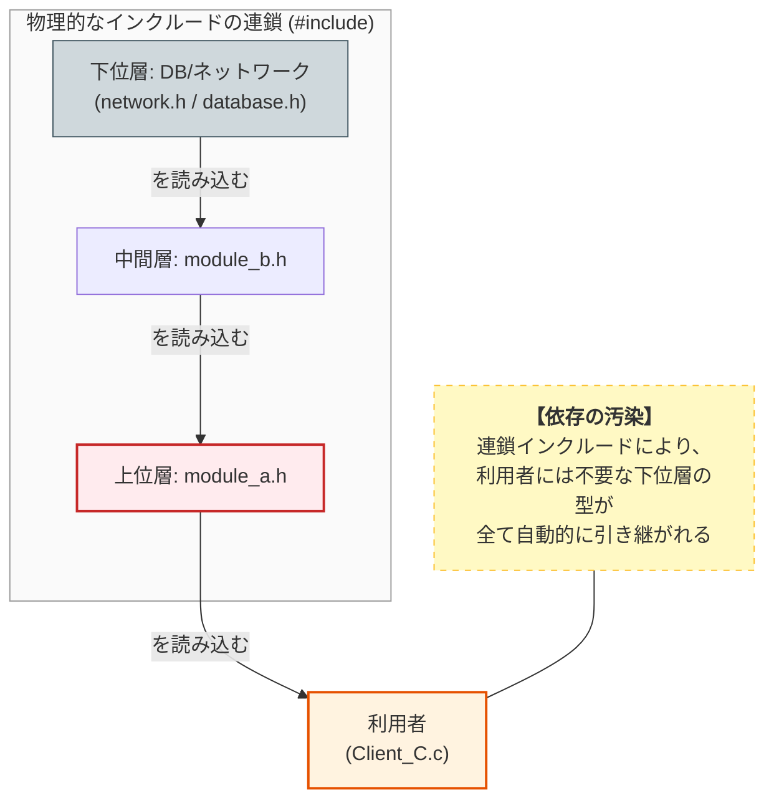
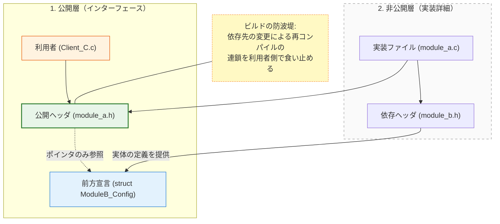
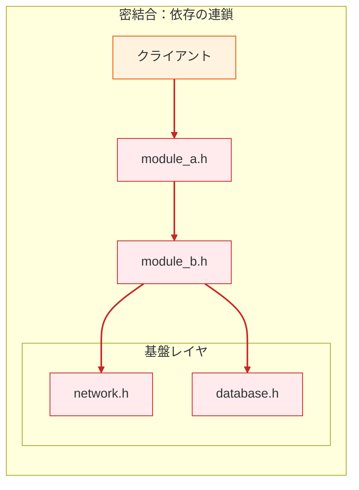
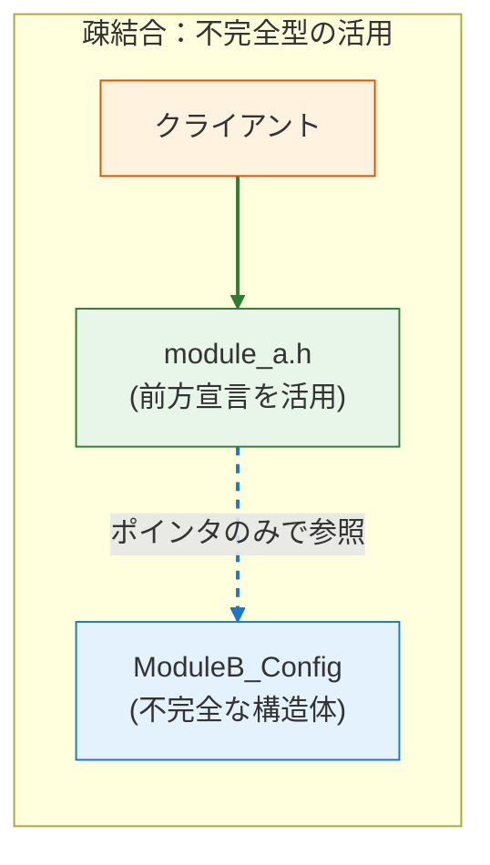

### 3.3. 実践パターン3：前方宣言によるコンパイル依存の断絶

実践パターン1と2では「何を公開するか」を制限しました。このパターン3では、一歩進んで **「何を知らなくて済むか」** を制御します。
C言語において、不必要なヘッダのインクルードを避けることは、ISPの「不要な依存の排除」を物理レベルで達成する極めて重要な手段です。

ヘッダファイルが引き連れてくる **間接的な依存** を最小限に抑え、モジュールの変更がシステム全体に波及する「コンパイルの連鎖」を阻止します。

#### システム概要

ここでは、複数のモジュールが階層的に依存し合う**多層アーキテクチャ型の機能モジュール**を実装します。上位層のアプリケーション（Module A）が、下位層の通信・DB設定（Module B）を利用しつつ自身の設定値を保持するという要件を持っていますが、上位層のクライアントが下位層の内部構造に引きずり込まれないよう依存を管理する必要があります。

#### 設計課題

この要件に対し、下位モジュールから上位モジュールへと無自覚に依存関係が伝播していく「インクルードの連鎖（依存の汚染）」が発生するケースが多々あります。

具体的なメカニズムはこうです。下位の `module_b` は通信やDBを扱うため、自身のヘッダ（以下の `module_b.h`）で `network.h` や `database.h` をインクルードして情報を保持します。ここまでは問題ありません。しかし、中間の `module_a.h` が、内部データとしてBの構造体の **「ポインタ」** を保持したいだけなのに、律儀に `#include "module_b.h"` を記述してしまうことがあります。
するとどうなるでしょうか。この `module_a.h` を読み込んだ最上位の利用者（`Client_C.c` など）のファイル内には、プリプロセッサによって `module_b.h`、さらには全く関係のない `network.h` や `database.h` の全内容が容赦なく展開されます。利用者は「Aを使いたいだけ」なのに、ISPの観点では「通信やDBの不要な設定情報への依存」を強制されたことになり、それらの下位層に変更があるたびに巻き添えで再コンパイルの嵐に見舞われることになります。

#### ❌ 原則適用前：不必要なヘッダインクルードによるコンパイル依存の連鎖

まずは、ISP原則を適用していない（インクルードが連鎖する）状態です。`#include` が連鎖することで、本来関係のない最下層の定義（DB/Network）が、最上位の利用者（Client）まで流れ込んでしまう様子を図解します。

*   **カスケード（連鎖）** : `module_a.h` を使うだけの利用者が、間接的に `network.h / database.h` に依存してしまっています。
*   以下が「依存の汚染」を図解したものです。


```mermaid
graph TB
      %% 汚染の流れ（右から左へ流入）を強調するために、右から左(RL)で描画
      subgraph InclusionChain ["物理的なインクルードの連鎖 (#include)"]
          direction BT
          INFRA["下位層: DB/ネットワーク<br/>(network.h / database.h)"] -- "を読み込む" --> MB["中間層: module_b.h"]
          MB -- "を読み込む" --> MA["上位層: module_a.h"]
      end

      %% 利用者への汚染
      MA -- "を読み込む" --> C["利用者<br/>(Client_C.c)"]

      %% 汚染の注釈
      Pollution["<b>【依存の汚染】</b><br/>連鎖インクルードにより、<br/>利用者には不要な下位層の型が<br/>全て自動的に引き継がれる"]

      %% 注釈の配置
      Pollution --- C

      %% スタイル設定
      style INFRA fill:#cfd8dc,stroke:#455a64
      style MA fill:#ffebee,stroke:#c62828,stroke-width:2px
      style C fill:#fff3e0,stroke:#e65100,stroke-width:2px
      style Pollution fill:#fff9c4,stroke:#fbc02d,stroke-dasharray: 5 5
      style InclusionChain fill:#fafafa,stroke:#9e9e9e
```

ここで、不用意に多くの機能が詰め込まれた「重い」型定義のヘッダを見てみましょう。
この `ModuleB` は、内部設定としてネットワークやデータベースの構造体を保持しています。そのため、当然のように `network.h` と `database.h` を `include` しています。このファイル単体で見れば何の不思議もありません。

#### module_b.h (下位の定義をまとめて保持する)
```c
#ifndef MODULE_B_H
#define MODULE_B_H
#include <stdbool.h>

// network.h / database.h に相当する定義
typedef struct { int port; } NetworkConfig;
typedef struct { char host[64]; } DatabaseConfig;

typedef struct {
    NetworkConfig net_config;
    DatabaseConfig db_config;
    int buffer_size;
    bool is_active;
} ModuleB_Config;

// 設定の実体を取得するための関数（module_b.c で実装）
ModuleB_Config* get_system_config(void);
#endif
```

#### module_b.c (設定の実体を持つ実装ファイル)
```c
#include "module_b.h"

// システム全体で共有される設定の実体
static ModuleB_Config system_config = {
    .buffer_size = 1024,
    .is_active = true
};

ModuleB_Config* get_system_config(void) {
    return &system_config;
}
```

問題は、この `ModuleB` を利用する上位モジュール `ModuleA` のヘッダ設計にあります。
`ModuleA` は内部データとして `ModuleB_Config` の「ポインタ」を保持したいだけなのですが、律儀に `#include "module_b.h"` を記述してしまっています。この安易な `include` が、巨大な依存の連鎖（ネットワークやデータベースの型情報まで全て引きずり込む）の引き金となります。

#### module_a.h (ポインタ利用のためだけに全定義を巻き込む中間ヘッダ)
```c
#ifndef MODULE_A_H
#define MODULE_A_H
#include "module_b.h" // 【問題】ポインタ利用だけなのに、Bの全定義を取り込んでいる

typedef struct {
    ModuleB_Config* config_ptr;
} ModuleA_Data;

// 関数プロトタイプ（この時点で ModuleB_Config の実体を Client に強制する）
void module_a_init(ModuleA_Data* data, ModuleB_Config* config);
#endif
```

そして、悲劇の終着点であるクライアント（利用者）のコードです。
このクライアントはただ `ModuleA` を使いたいだけなので `#include "module_a.h"` と書いたに過ぎません。しかし、プリプロセッサ（マクロ展開器）が走った瞬間、このファイルには `module_b.h`、さらには `network.h` や `database.h` の全内容が容赦なく展開されます。

#### module_a.c (適用前：ヘッダを介して全てをインクルードしている)
```c
#include <stdio.h>
#include "module_a.h"

void module_a_init(ModuleA_Data* data, ModuleB_Config* config) {
    data->config_ptr = config;
    printf("[Module A] Setup complete using Module B (Buffer: %d)\n", 
            config->buffer_size);
}
```

#### Client_C.c (利用者のコード：インクルードが連鎖している状態)
```c
#include <stdio.h>
#include "module_a.h"

int main(void) {
    ModuleA_Data data;
    printf("[Client] Starting system...\n");

    // A を初期化する。
    // ※ module_a.h が module_b.h をインクルードしているため、
    //   Client は get_system_config() の存在を勝手に知っている状態。
    module_a_init(&data, get_system_config());

    printf("[Client] Module A setup successful.\n");

    return 0;
}
```

#### 実行結果
```c
[Client] Starting system...
[Module A] Setup complete using Module B (Buffer: 1024)
[Client] Module A setup successful.
```

「依存の汚染」によって、単にビルド速度を低下させるだけでなく、予期せぬ名前の衝突（シンボルの重複）やコンパイルエラーといった不要なリスクまでシステム全体にばら撒いてしまう結果となります。

#### 改善の指針

この不要なインクルードの連鎖を物理的に断ち切るための強力な防波堤が、 **「前方宣言（Forward Declaration）と不完全型の活用」** です。

ポインタとして構造体を参照するだけであれば、コンパイラは「その構造体の正確な中身（サイズ）」を知る必要はなく、「そういう名前の構造体が存在する」という事実だけを知っていればコンパイルを完了できます。したがって、中間の `module_a.h` では `#include` をやめて `typedef struct ModuleB_Config ModuleB_Config;` という前方宣言だけを記述します。これにより、上位の利用クライアントには「Bという構造体のポインタがある」という最小限의 契約情報しか伝わらなくなり、下位のネットワークやDBへの不要な依存から完全に隔離（保護）されます。本当の型情報が必要なのは実処理を行う `module_a.c` の内部だけなので、そこで初めて `#include` を行えばよいのです。

これに対して、前方宣言（不完全型）を利用して、インクルードの連鎖を物理的に断ち切る強力な防波堤を構築します。`module_a.h` が前方宣言を使っているため、`module_b.h` の変更（およびその先の依存）が `Client_C.c` に波及しません（ **再コンパイルは発生しません** ）。

*   実線: 物理的なインクルード
*   点線: 参照のみ（コンパイル依存なし）


```mermaid
graph TB
      %% 1. 公開層（Clientから見える範囲）
      subgraph Public ["1. 公開層（インターフェース）"]
          direction TB
          CLIENT["利用者 (Client_C.c)"]
          MA["公開ヘッダ (module_a.h)"]
          FWD["前方宣言 (struct ModuleB_Config)"]

          CLIENT --> MA
          MA -.->|"ポインタのみ参照"| FWD
      end

      %% 2. 非公開層（実装詳細）
      subgraph Private ["2. 非公開層（実装詳細）"]
          direction TB
          IMPL["実装ファイル (module_a.c)"]
          MB["依存ヘッダ (module_b.h)"]

          IMPL --> MA
          IMPL --> MB
      end

      %% 防波堤の接続
      MB -->|"実体の定義を提供"| FWD

      %% 改善点の注釈
      Note["ビルドの防波堤:<br/>依存先の変更による再コンパイルの<br/>連鎖を利用者側で食い止める"]

      %% 注釈の配置
      Note --- MA

      %% スタイル設定
      style MA fill:#e8f5e9,stroke:#2e7d32,stroke-width:2px
      style FWD fill:#e3f2fd,stroke:#1976d2
      style CLIENT fill:#fff3e0,stroke:#e65100
      style Private fill:#fafafa,stroke:#9e9e9e,stroke-dasharray: 5 5
      style Note fill:#fff9c4,stroke:#f57f17,stroke-dasharray: 2 2
```

この「依存の汚染」を食い止める強力な防波堤が、第4章で学んだ **前方宣言（不完全型）** です。

`module_a.h` では `include` をキッパリと削除し、「`ModuleB_Config` という構造体が存在することだけは約束する」という前方宣言に置き換えます。C言語のコンパイラは、型がポインタ（メモリ上のアドレス）でありさえすれば、その中身のサイズを知らなくてもコンパイルを通すことができるという性質を利用します。

#### ✅ 原則適用後：前方宣言（不完全型）による物理的な依存の遮断
#### module_a.h (不透明ポインタを用いて依存を断ち切る防波堤ヘッダ)
```c
#ifndef MODULE_A_H
#define MODULE_A_H

/* * 【ISP適用】
 * #include "module_b.h" を完全に削除。
 * 構造体の実体（不完全型）を宣言するだけで、ポインタの扱いは可能。
 */
struct ModuleB_Config;
typedef struct ModuleB_Config ModuleB_Config;

typedef struct {
    // コンパイラは「ポインタであること」さえ分かれば良いため、これで十分
    ModuleB_Config* config_ptr;
} ModuleA_Data;

// ポインタを受け取る関数のプロトタイプ宣言（前方宣言のおかげで B を含めずに定義可能）
void module_a_init(ModuleA_Data* data, ModuleB_Config* config);
#endif
```

もちろん、中身を知らなければ具体的な操作（メンバへのアクセス）はできないため、実装側（`.c` ファイル）ではしっかりと `#include "module_b.h"` を行います。

「コンパイル依存（`include`）」を公開ヘッダから非公開の実装ファイルへと移動させることこそが、C言語における依存関係コントロールの真髄です。

#### module_a.c (依存を内部に閉じ込める実装ファイル)
```c
#include <stdio.h>
#include "module_a.h"
#include "module_b.h" // 実装ファイルでのみ、完全な定義を読み込む

void module_a_init(ModuleA_Data* data, ModuleB_Config* config) {
    data->config_ptr = config;
    printf("[Module A] Setup complete using Module B (Buffer: %d)\n", 
            config->buffer_size);
}
```

この防波堤の奥にいるクライアントは、完全に外部の変更から保護されます。

クライアントのコード自体は何も変わっていません。しかし、`network.h` の設定項目がどれだけ書き換わろうと、この `Client_C.c` が再コンパイルされることは金輪際なくなります。これが「依存を断ち切る」ことの物理的な恩恵です。

#### Client_C.c (下位の変更から完全に保護された利用者)
```c
#include <stdio.h>
#include "module_a.h"

// ※実体定義 (ModuleB_Config) はここにはインクルードされていない。
// 前方宣言のおかげで、ポインタの受け渡しだけなら型を知らなくてよい。
extern ModuleB_Config* get_system_config(void);

int main(void) {
    ModuleA_Data data;
    printf("[Client] Starting system (Isolated build)...\n");

    // 内部で ModuleB_Config の中身を操作するが、
    // クライアント側は再ビルドの影響を受けない。
    module_a_init(&data, get_system_config());

    printf("[Client] Module A setup successful.\n");

    return 0;
}
```

#### 実行結果（適用後）
```c
[Client] Starting system (Isolated build)...
[Module A] Setup complete using Module B (Buffer: 1024)
[Client] Module A setup successful.
```

#### 設計のポイント：インターフェースの「不透明性」を高める

この手法は、ISPにおける「不要な依存の排除」を最も低レイヤーで実現するものです。

- **情報の隠蔽** : クライアントに対して、依存先（Module B）の内部構造を完全に隠すことができる。
- **ビルドのファイアウォール** : 構造体のメンバ追加や削除といった「内部変更」が、ヘッダを介してシステム全体へ伝播するのを食い止める「防波堤」として機能する。
- **クリーンな名前空間** : 不要なマクロ定義や型定義がクライアント側に漏れ出すのを防ぎ、予期せぬコンパイルエラーを未然に防ぐ。

#### 依存構造のビフォーアフター

ISP適用前後の依存グラフの比較です。

*   **密結合（上）** : クライアントから基盤レイヤまで一本道でつながっており、変更の影響をまともに受けます。
*   **疎結合（下）** : 不完全型（点線）によって依存の矢印が断ち切られ、クライアントが保護されています。
*   赤いリンク: 危険な依存 緑のリンク: 安全な依存。


```mermaid
graph TB
      subgraph TightCoupling [密結合：依存の連鎖]
          direction TB
          C1["クライアント"]
          HA["module_a.h"]
          HB["module_b.h"]

          %% 横に並べてコンパクトにする
          subgraph Infrastructure [基盤レイヤ]
              direction LR
              HN["network.h"]
              HD["database.h"]
          end
      end

      %% 依存の接続
      C1 --> HA
      HA --> HB
      HB --> HN
      HB --> HD

      %% スタイル（全角を含まないよう修正）
      style C1 fill:#fff3e0,stroke:#e65100
      style HA fill:#ffebee,stroke:#c62828
      style HB fill:#ffebee,stroke:#c62828
      style HN fill:#ffebee,stroke:#c62828
      style HD fill:#ffebee,stroke:#c62828

      %% 既存の4本のリンクに赤色を適用
      linkStyle 0,1,2,3 stroke:#c62828,stroke-width:2px
```

```mermaid
graph TB
      subgraph Decoupling [疎結合：不完全型の活用]
          direction TB
          C2["クライアント"]
          HA2["module_a.h<br/>(前方宣言を活用)"]
          HB2["ModuleB_Config<br/>(不完全な構造体)"]

          %% 依存の接続
          C2 --> HA2
          HA2 -.->|"ポインタのみで参照"| HB2
      end

      %% スタイル設定（図の中に存在するノードのみ指定）
      style HA2 fill:#e8f5e9,stroke:#2e7d32
      style HB2 fill:#e3f2fd,stroke:#1976d2
      style C2 fill:#fff3e0,stroke:#e65100

      %% リンクスタイル（0番と1番の矢印のみ指定）
      linkStyle 0 stroke:#2e7d32,stroke-width:2px
      linkStyle 1 stroke:#1976d2,stroke-width:2px,stroke-dasharray: 5 5
```

前方宣言は依存の切断に非常に強力ですが、C言語のコンパイラの特性上、どのような場面でも使えるわけではありません。具体的には、以下の条件を満たす場合にのみ有効に機能します。

#### 前方宣言が有効なケース

コンパイラが「データ型のサイズ」を割り出す必要がなく、それがメモリアドレス（ポインタ）であることさえ分かればよい以下のような場面で使用可能です。

- ポインタや参照のみを扱う場合
- 関数の引数や戻り値として型を使用する場合
- 構造体のメンバとしてポインタを保持する場合

#### 前方宣言が使えないケース

逆に、コンパイラがメモリを割り当てるために「その型の正確なバイトサイズ」を知らなければならない、あるいは中身の要素を解析しなければならない場面では、完全な定義（#include）が必須となります。

- 構造体の実体（ポインタではなく値）をメンバとして持つ場合
- 構造体のサイズを知る必要がある場合（例：`sizeof` を使う）
- 構造体の個別のメンバに直接アクセスする必要がある場合

### 4. 応用：SRPとISPの「相乗効果」による設計の洗練

ここまで「分割」について学んできましたが、SRP（単一責任原則）とISP（インターフェース分離原則）を組み合わせることで、設計は真の真価を発揮します。

両者の違いを改めて整理し、相乗効果を生む例を見てみましょう。

| 観点 | SRP（実装の分割） | ISP（窓口の分割） |
| --- | --- | --- |
| **主役** | 実装者（提供者）の都合 | 利用者（クライアント）の都合 |
| **目的** | 変更の影響を「中」に閉じる | 変更の影響を「外」に漏らさない |
| 解決策 | 実体を分ける (`.c`を分ける) | 窓口を分ける (`.h`や能力別のインターフェースを分ける) |

#### SRPとISPが協力する「役割の純粋化」

例えば、「スマートデバイス」というモジュールがあるとします。このモジュールは「データの送受信」と「ファームウェア更新」の2つの責任を持っています。

1.  **SRPによる分割** : 実装を `comm_handler.c`（通信）と `update_handler.c`（更新）に分け、ソースコードとしての凝集度を高めます。
2.  **ISPによる分割** : 通信しか行わない一般アプリには「通信用インターフェース」だけを見せ、管理者ツールにはそれに加えて「更新用インターフェース」も見せるように窓口を分けます。

このように、 **「中で分ける（SRP）」** ことで、開発者は特定の機能の修正に集中でき、 **「外で分ける（ISP）」** ことで、利用者は自分に関心のない機能（更新機能など）を知ることなく、自分の仕事に集中できます。

この「内部の凝集」と「外部の隔離」の両立こそが、優れたソフトウェア設計のゴールです。

## 本章で必ず理解してほしいことのまとめ

### インターフェース分離原則 (ISP) の設計指針

#### 1.  **ISPの本質は「利用者に必要なものを届け、他を隠す」ことです**

 **太ったインターフェース** はコンパイル依存の連鎖と **LSP違反** （使わない機能をダミー実装する）を誘発します。利用者に媚びず、必要な役割だけを厳選して差し出すのがISPの誠実さです。

#### 2.  **ヘッダファイルを役割ごとに分離する** （ **実践パターン1** ）

複数の役割を持つモジュールは、役割ごとに分割した **スリムなヘッダ** に切り分け、クライアントが最小限の契約のみに依存するようにします。これにより不要な再コンパイルを防ぎます。

#### 3.  **VTableを能力単位に分割し、必要な分だけを受け取る** （ **実践パターン2** ）

一つの巨大なVTableではなく、`IReaderVTable` のような小さな単位に分割します。具象実装は「自分ができること」だけの窓口を用意し、クライアントは「自分が使いたいこと」だけの窓口を引数で要求します。

不可能な契約（使わない関数の実装）をそもそも結ばないことが、最も安全な設計です。

#### 4.  **前方宣言と不完全型で物理的な依存を断つ** （ **実践パターン3** ）

構造体のポインタ操作のみが必要な場所では、 `#include` ではなく **前方宣言** を用いることで、不必要な型情報がクライアント側へ流入するのを物理的に遮断します。

#### チェックリスト

本章の設計指針が正しく適用されているか、以下の項目でセルフチェックを行いましょう。

##### 1. 設計のセルフチェック（契約のスリム化）

 * **役割の最小単位化** : 1つのインターフェース（VTableやヘッダ）に、異なる種類のアクター（変更要求者）が利用する関数が混在していないか？
 * **LSP違反の予兆検知** : 具象実装において「この関数はこのデバイスでは使わないので空実装にする」といった、インターフェースが太すぎるために発生する「嘘の実装」はないか？
 * **Compositionの検討** : 複数の機能が必要な場合、1つの巨大なインターフェースを作るのではなく、小さなインターフェースを組み合わせて（Composition）実現しているか？

##### 2. 実装のセルフチェック（物理的依存の排除）

 * **ヘッダの自己完結と分離** : クライアントが特定の機能を使うために、無関係な定義が大量に含まれた「太ったヘッダ」をインクルードせざるを得ない状況になっていないか？
 * **前方宣言の徹底** : 公開ヘッダにおいて、構造体のポインタのみで済む場所に `#include` を書いていないか？ (前方宣言で代用できないか？)
 * **推移的依存の排除** : `A.h` をインクルードしただけで、本来不要な `B.h`, `C.h` までインクルードされる「依存の汚染」が起きていないか？
 * **コンパイル時間の意識** : 1つの共通ヘッダを修正した際、無関係なモジュールまで大量に再コンパイルされる連鎖反応が起きていないか？

#### 次章への橋渡し

ISPの適用により、クライアントは必要最小限のヘッダだけをインクルードすればよくなりました。次章「第12章 依存性逆転原則（DIP）：抽象への依存とテスト容易性」では、さらに設計の依存方向そのものを正す方法を学びます。

ISPで学んだ依存の分離が、どのようにしてシステム全体の柔軟な構造を作り出すのかを詳細に学びます。
