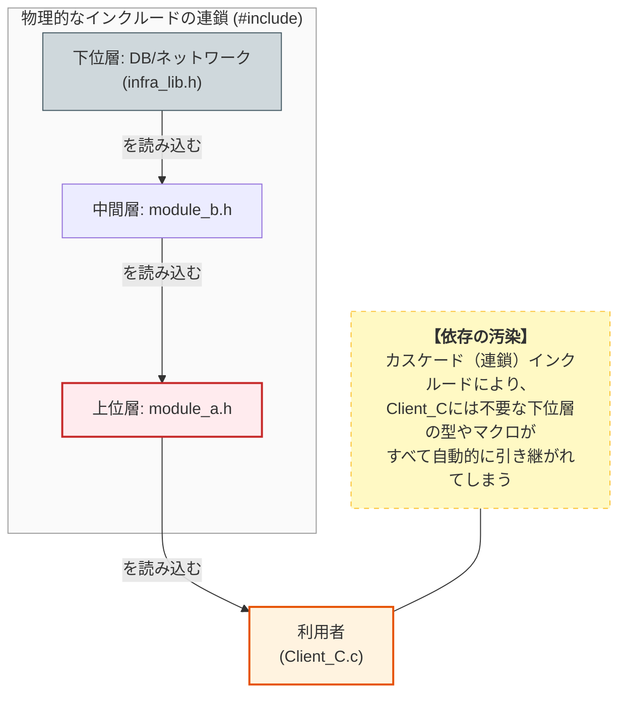
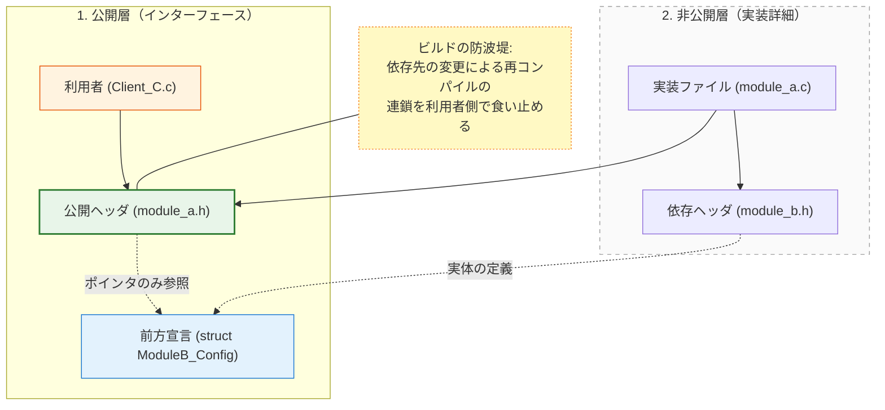
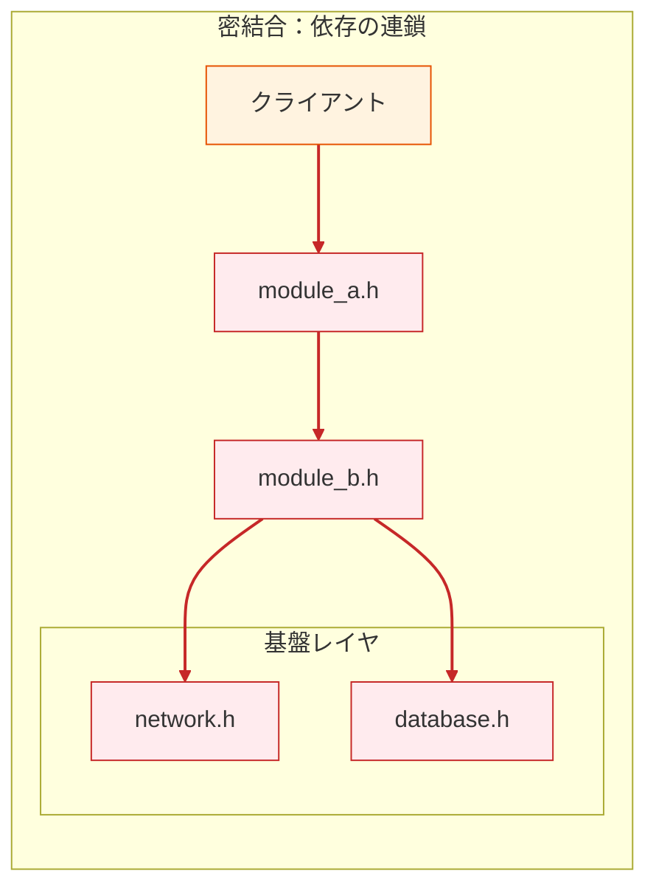
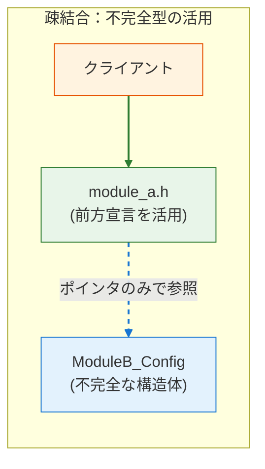

### 3.3. 実践パターン3：前方宣言によるコンパイル依存の断絶

実践パターン1と2では「何を公開するか」を制限しました。このパターン3では、一歩進んで **「何を知らなくて済むか」** を制御します。
C言語において、不必要なヘッダのインクルードを避けることは、ISPの「不要な依存の排除」を物理レベルで達成する極めて重要な手段です。

ヘッダファイルが引き連れてくる **間接的な依存** を最小限に抑え、モジュールの変更がシステム全体に波及する「コンパイルの連鎖」を阻止します。

#### システム概要

ここでは、複数のモジュールが階層的に依存し合う**多層アーキテクチャ型の機能モジュール**を実装します。上位層のアプリケーション（Module A）が、下位層の通信・DB設定（Module B）を利用しつつ自身の設定値を保持するという要件を持っていますが、上位層のクライアントが下位層の内部構造に引きずり込まれないよう依存を管理する必要があります。

#### 設計課題

この要件に対し、下位モジュールから上位モジュールへと無自覚に依存関係が伝播していく「インクルードの連鎖（依存の汚染）」が発生するケースが多々あります。

具体的なメカニズムはこうです。下位の `module_b` は通信やDBを扱うため、自身のヘッダ（以下の `module_b.h`）で `network.h` や `database.h` をインクルードして情報を保持します。ここまでは問題ありません。しかし、中間の `module_a.h` が、内部データとしてBの構造体の **「ポインタ」** を保持したいだけなのに、律儀に `#include "module_b.h"` を記述してしまうことがあります。
するとどうなるでしょうか。この `module_a.h` を読み込んだ最上位の利用者（`Client_C.c` など）のファイル内には、プリプロセッサによって `module_b.h`、さらには全く関係のない `network.h` や `database.h` の全内容が容赦なく展開されます。利用者は「Aを使いたいだけ」なのに、ISPの観点では「通信やDBの不要な設定情報への依存」を強制されたことになり、それらの下位層に変更があるたびに巻き添えで再コンパイルの嵐に見舞われることになります。

#### 設計の意図

この不要なインクルードの連鎖を物理的に断ち切るための強力な防波堤が、 **「前方宣言（Forward Declaration）と不完全型の活用」** です。

ポインタとして構造体を参照するだけであれば、コンパイラは「その構造体の正確な中身（サイズ）」を知る必要はなく、「そういう名前の構造体が存在する」という事実だけを知っていればコンパイルを完了できます。したがって、中間の `module_a.h` では `#include` をやめて `typedef struct ModuleB_Config ModuleB_Config;` という前方宣言だけを記述します。これにより、上位の利用クライアントには「Bという構造体のポインタがある」という最小限の契約情報しか伝わらなくなり、下位のネットワークやDBへの不要な依存から完全に隔離（保護）されます。本当の型情報が必要なのは実処理を行う `module_a.c` の内部だけなので、そこで初めて `#include` を行えばよいのです。

#### 汚染のメカニズム（適用前）

まずは、ISP原則を適用していない（インクルードが連鎖する）状態です。`#include` が連鎖することで、本来関係のない最下層の定義（DB/Network）が、最上位の利用者（Client）まで流れ込んでしまう様子を図解します。

*   **カスケード（連鎖）** : `module_a.h` を使うだけの利用者が、間接的に `infra_lib.h` に依存してしまっています。
*   以下が「依存の汚染」を図解したものです。



ここで、不用意に多くの機能が詰め込まれた「重い」型定義のヘッダを見てみましょう。
この `ModuleB` は、内部設定としてネットワークやデータベースの構造体を保持しています。そのため、当然のように `network.h` と `database.h` を `include` しています。このファイル単体で見れば何の不思議もありません。

#### module_b.h (無自覚に依存を抱え込む下位モジュール)
```c
#ifndef MODULE_B_H
#define MODULE_B_H
#include <stdbool.h>
#include "network.h"   // ネットワーク関連の定義
#include "database.h"  // データベース関連の定義

typedef struct {
    NetworkConfig net_config;
    DatabaseConfig db_config;
    /* その他の設定メンバ */
    int buffer_size;
    int timeout_ms;
    bool is_active;
} ModuleB_Config;
#endif
```

問題は、この `ModuleB` を利用する上位モジュール `ModuleA` のヘッダ設計にあります。
`ModuleA` は内部データとして `ModuleB_Config` の「ポインタ」を保持したいだけなのですが、律儀に `#include "module_b.h"` を記述してしまっています。この安易な `include` が、巨大な依存の連鎖（ネットワークやデータベースの型情報まで全て引きずり込む）の引き金となります。

#### module_a.h (ポインタ利用のためだけに全定義を巻き込む中間ヘッダ)
```c
#ifndef MODULE_A_H
#define MODULE_A_H
#include "module_b.h" // 【問題】ポインタ利用だけなのに、Bの全定義を取り込んでいる

typedef struct {
/* * 構造体へのポインタを保持するだけ。
* しかし、上記の include により、module_b.h が修正されるたびに
* module_a.h を使う全モジュールが再ビルド対象になる。
*/
ModuleB_Config* config_ptr;
} ModuleA_Data;
#endif
```

そして、悲劇の終着点であるクライアント（利用者）のコードです。
このクライアントはただ `ModuleA` を使いたいだけなので `#include "module_a.h"` と書いたに過ぎません。しかし、プリプロセッサ（マクロ展開器）が走った瞬間、このファイルには `module_b.h`、さらには `network.h` や `database.h` の全内容が容赦なく展開されます。

#### Client_C.c (無関係な宣言まで強制的に読み込まされる利用者)
```c
#include "module_a.h"

int main(void) {
    // この時点で network.h と database.h の定義が
    // 全て読み込まれている（不要なのに！）
    ModuleA_Data data;

    return 0;
}
```

「依存の汚染」によって、単にビルド速度を低下させるだけでなく、予期せぬ名前の衝突（シンボルの重複）やコンパイルエラーといった不要なリスクまでシステム全体にばら撒いてしまう結果となります。

これに対して、前方宣言（不完全型）を利用して、インクルードの連鎖を物理的に断ち切る強力な防波堤を構築します。`module_a.h` が前方宣言を使っているため、`module_b.h` の変更（およびその先の依存）が `Client_C.c` に波及しません（ **再コンパイルは発生しません** ）。

*   実線: 物理的なインクルード
*   点線: 参照のみ（コンパイル依存なし）



この「依存の汚染」を食い止める強力な防波堤が、第4章で学んだ **前方宣言（不完全型）** です。

`module_a.h` では `include` をキッパリと削除し、「`ModuleB_Config` という構造体が存在することだけは約束する」という前方宣言に置き換えます。C言語のコンパイラは、型がポインタ（メモリ上のアドレス）でありさえすれば、その中身のサイズを知らなくてもコンパイルを通すことができるという性質を利用します。

#### module_a.h (不完全型を用いて依存を断ち切る防波堤ヘッダ)
```c
#ifndef MODULE_A_H
#define MODULE_A_H

/* * 【ISP適用】
 * #include "module_b.h" を完全に削除。
 * 構造体の実体（不完全型）を宣言するだけで、ポインタの扱いは可能。
 */
struct ModuleB_Config;
typedef struct ModuleB_Config ModuleB_Config;
typedef struct {
    // コンパイラは「ポインタであること」さえ分かれば良いため、これで十分
    ModuleB_Config* config_ptr;
} ModuleA_Data;
// ポインタを受け取る関数のプロトタイプ宣言も問題なし
void module_a_set_config(ModuleA_Data* data, ModuleB_Config* config);
#endif
```

もちろん、中身を知らなければ具体的な操作（メンバへのアクセス）はできないため、実装側（`.c` ファイル）ではしっかりと `#include "module_b.h"` を行います。

「コンパイル依存（`include`）」を公開ヘッダから非公開の実装ファイルへと移動させることこそが、C言語における依存関係コントロールの真髄です。

#### module_a.c (依存を内部に閉じ込める実装ファイル)
```c
#include "module_a.h"
#include "module_b.h" // 実装ファイルでのみ、必要に応じて完全な定義を読み込む

void module_a_set_config(ModuleA_Data* data, ModuleB_Config* config) {
    // ここでは ModuleB_Config の中身にアクセスできる
    data->config_ptr = config;
}
```

この防波堤の奥にいるクライアントは、完全に外部の変更から保護されます。

クライアントのコード自体は何も変わっていません。しかし、`network.h` の設定項目がどれだけ書き換わろうと、この `Client_C.c` が再コンパイルされることは金輪際なくなります。これが「依存を断ち切る」ことの物理的な恩恵です。

#### Client_C.c (下位の変更から完全に保護された利用者)
```c
#include "module_a.h"

int main(void) {
    /* * 設計の意図:
     * このファイルには "module_b.h" の情報は一切流れ込んでこない。
     * ModuleB_Config の中身がどれほど複雑に変更されても、
     * この Client_C.c のコンパイル結果には何の影響も与えない。
     */
    ModuleA_Data data;

    return 0;
}
```

#### 設計のポイント：インターフェースの「不透明性」を高める

この手法は、ISPにおける「不要な依存の排除」を最も低レイヤーで実現するものです。

- **情報の隠蔽** : クライアントに対して、依存先（Module B）の内部構造を完全に隠すことができる。
- **ビルドのファイアウォール** : 構造体のメンバ追加や削除といった「内部変更」が、ヘッダを介してシステム全体へ伝播するのを食い止める「防波堤」として機能する。
- **クリーンな名前空間** : 不要なマクロ定義や型定義がクライアント側に漏れ出すのを防ぎ、予期せぬコンパイルエラーを未然に防ぐ。

#### 依存構造のビフォーアフター

ISP適用前後の依存グラフの比較です。

*   **密結合（上）** : クライアントから基盤レイヤまで一本道でつながっており、変更の影響をまともに受けます。
*   **疎結合（下）** : 不完全型（点線）によって依存の矢印が断ち切られ、クライアントが保護されています。
*   赤いリンク: 危険な依存 緑のリンク: 安全な依存。




前方宣言は依存の切断に非常に強力ですが、C言語のコンパイラの特性上、どのような場面でも使えるわけではありません。具体的には、以下の条件を満たす場合にのみ有効に機能します。

#### 前方宣言が有効なケース

コンパイラが「データ型のサイズ」を割り出す必要がなく、それがメモリアドレス（ポインタ）であることさえ分かればよい以下のような場面で使用可能です。

- ポインタや参照のみを扱う場合
- 関数の引数や戻り値として型を使用する場合
- 構造体のメンバとしてポインタを保持する場合

#### 前方宣言が使えないケース

逆に、コンパイラがメモリを割り当てるために「その型の正確なバイトサイズ」を知らなければならない、あるいは中身の要素を解析しなければならない場面では、完全な定義（#include）が必須となります。

- 構造体の実体（ポインタではなく値）をメンバとして持つ場合
- 構造体のサイズを知る必要がある場合（例：`sizeof` を使う）
- 構造体の個別のメンバに直接アクセスする必要がある場合

## 本章で必ず理解してほしいことのまとめ

### インターフェース分離原則 (ISP) の設計指針

#### 1.  **ISPの本質は「スリムな契約」と「不要な依存の排除」です**

 **太ったインターフェース** はコンパイル依存の連鎖と **LSP違反** （使わない機能をダミー実装する）を誘発します。

#### 2.  **ヘッダファイルを役割ごとに分離する** （ **実践パターン1** ）

複数の役割を持つモジュールは、役割ごとに分割した **スリムなヘッダ** に切り分け、クライアントが最小限の契約のみに依存するようにします。これにより不要な再コンパイルを防ぎ、ビルド時間を短縮します。

#### 3.  **VTableを役割単位に分割し、Compositionで組み合わせる** （ **実践パターン2** ）

一つの巨大なVTableではなく、`IReaderVTable`, `IWriterVTable` のような小さな単位に分割します。具象実装は自分ができる役割のVTableのみを実装し、複数の役割が必要な場合はCompositionで組み合わせます。

これによりLSP違反を防ぎ、ダミー実装が不要になります。

#### 4.  **前方宣言と不完全型で物理的なコンパイル依存を断つ** （ **実践パターン3** ）

ポインタ操作のみが必要な具象型は、ヘッダファイルに **前方宣言** を用いることで、クライアントから具象型の内部レイアウトへの依存を完全に切り離し、間接的な依存の連鎖（依存の汚染）を防ぎます。

#### チェックリスト

本章の設計指針が正しく適用されているか、以下の項目でセルフチェックを行いましょう。

##### 1. 設計のセルフチェック（契約のスリム化）

 [ ] **役割の最小単位化** : 1つのインターフェース（VTableやヘッダ）に、異なる種類のアクター（変更要求者）が利用する関数が混在していないか？
 [ ]  **LSP違反の予兆検知** : 具象実装において「この関数はこのデバイスでは使わないので空実装にする」といった、インターフェースが太すぎるために発生する「嘘の実装」はないか？
 [ ]  **Compositionの検討** : 複数の機能が必要な場合、1つの巨大なインターフェースを作るのではなく、小さなインターフェースを組み合わせて（Composition）実現しているか？

##### 2. 実装のセルフチェック（物理的依存の排除）

 [ ]  **ヘッダの自己完結と分離** : クライアントが特定の機能を使うために、無関係な定義が大量に含まれた「太ったヘッダ」をインクルードせざるを得ない状況になっていないか？
 [ ]  **前方宣言の徹底** : 公開ヘッダにおいて、構造体のポインタのみで済む場所に `#include` を書いていないか？ (前方宣言で代用できないか？)
 [ ]  **推移的依存の排除** : `A.h` をインクルードしただけで、本来不要な `B.h`, `C.h` までインクルードされる「依存の汚染」が起きていないか？
 [ ]  **コンパイル時間の意識** : 1つの共通ヘッダを修正した際、無関係なモジュールまで大量に再コンパイルされる連鎖反応が起きていないか？

#### 次章への橋渡し

★Kindle本では、以下のようなリンクはできないと思います。
ISPの適用により、クライアントは必要最小限のヘッダだけをインクルードすればよくなりました。次章は [[16_第2部 第12章 依存性逆転原則（DIP）：抽象への依存とテスト容易性_01]] です。

ISPで学んだ依存の分離が、どのようにしてシステム全体の柔軟な構造を作り出すのかを詳細に学びます。
