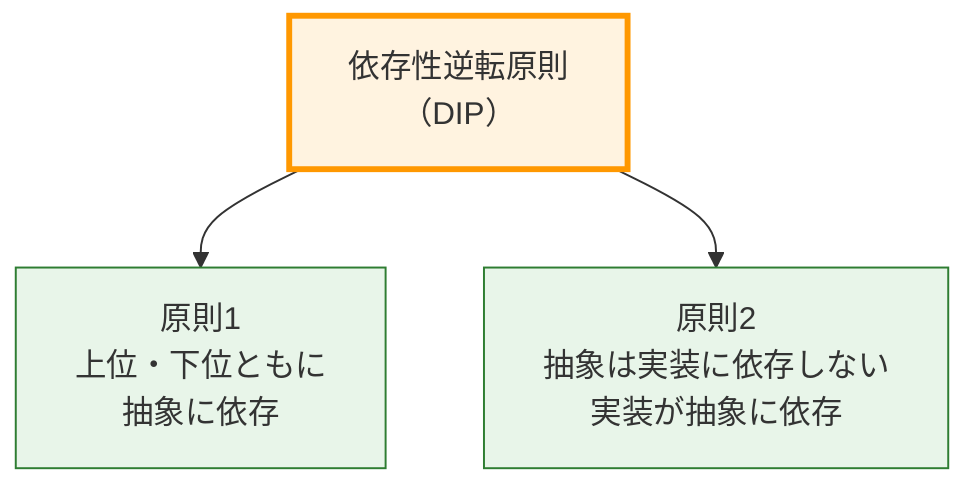
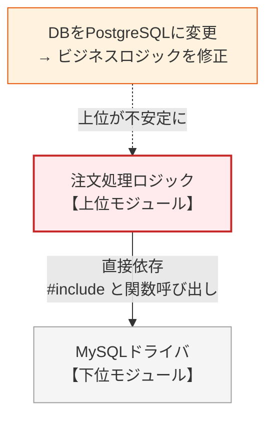
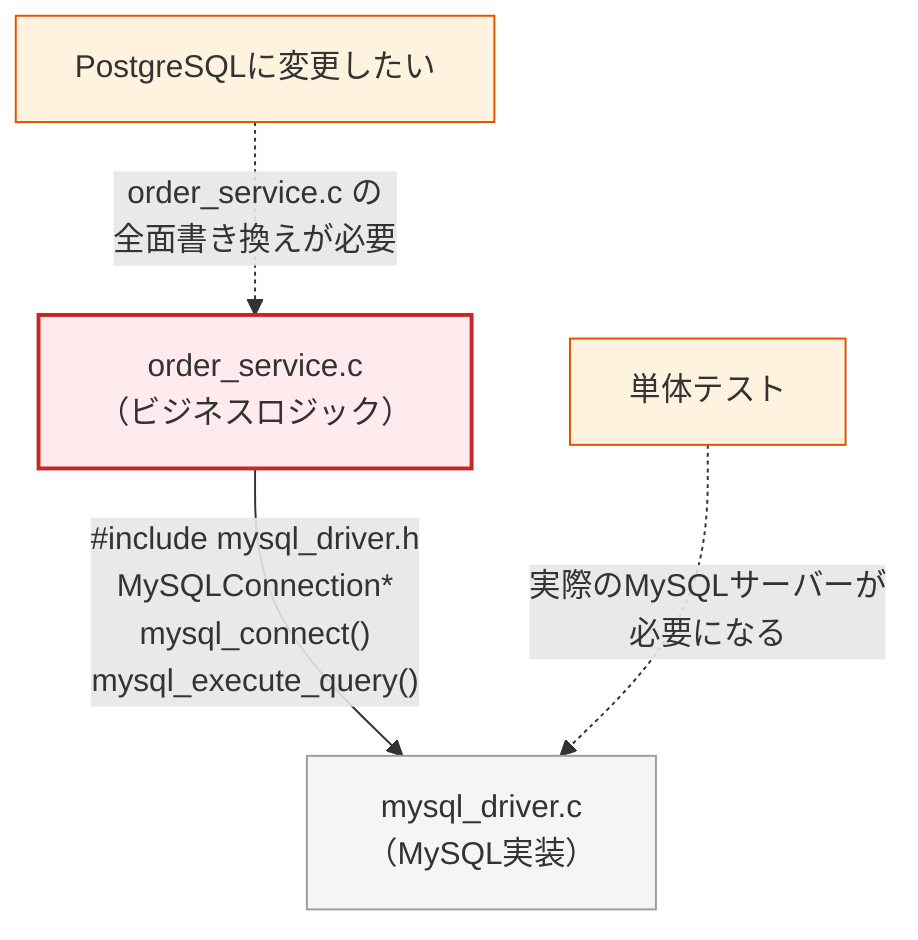
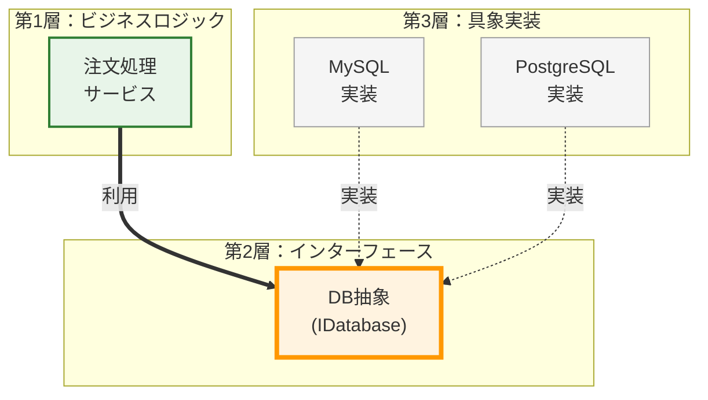
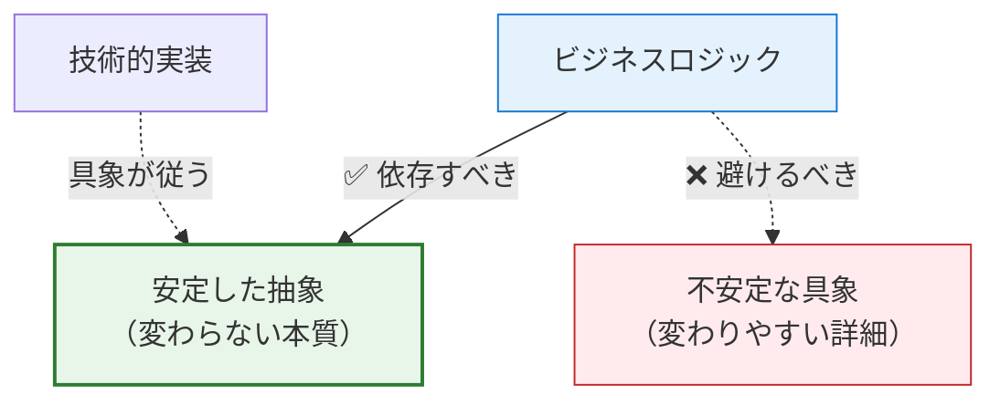
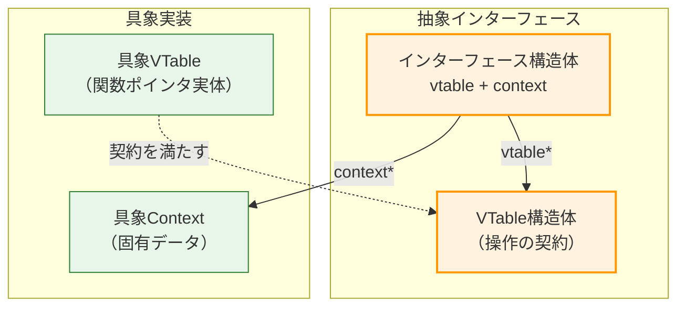

# 第2部 第12章 依存性逆転原則（DIP）：抽象への依存とテスト容易性

**依存性逆転原則（Dependency Inversion Principle：DIP）**は、SOLID原則の中で最もアーキテクチャの根幹に関わる原則です。モジュール間の結合度を下げ、システムを柔軟でテスト可能な状態に保つための、最も強力な設計原則の一つです。

本章では、第2章の関数ポインタ、第4章の不透明ポインタによる隠蔽、そして第9章のOCPを基盤に、C言語においてDIPをどのように実現し、どのように運用していくかを詳細に解説します。

## 1. 原則の哲学と本質

### 1.1. DIPの定義

### DIPの二つのルール

**この図が示すもの**:

DIPを構成する2つの柱です。

**注目ポイント**:

* 上位も下位も、両方が「抽象」に向かって矢印を伸ばすべき（依存すべき）であるという点です。

**読み方のガイド**:

* オレンジ色のDIPから派生する2つの緑のルール。


**DIPの二つのルール：**

1. **上位モジュールは下位モジュールに依存してはならない。両者は抽象に依存すべきである。**
2. **抽象は実装の詳細に依存してはならない。実装が抽象に依存すべきである。**

### 1.2. 「上位」と「下位」のジレンマ

### ❌ 原則適用前：伝統的なトップダウン設計

上位モジュール（ビジネスロジック）が下位モジュール（具象実装）に直接依存する状態。

### 伝統的な依存構造

**この図が示すもの**:

典型的なレイヤードアーキテクチャでの依存関係です。

**注目ポイント**:

* **直接依存**: ビジネスロジックがMySQLという「詳細」に依存しています。
* **影響**: 下位（DB）の変更が上位（ビジネス）を破壊します。

**読み方のガイド**:

* 上から下への一方的な依存（変更の波及）


**問題点：**

* 技術的な詳細（MySQL）の変更が、ビジネスロジックの修正を強制する
* 上位モジュールが下位モジュールの変更に振り回される
* テスト時に実際のDBを必要とする

### 原則適用前のコード例

### mysql_driver.h（具象実装のヘッダ）

**設計上の課題:** 具象実装の詳細が露出しているヘッダファイルの例です。

#### mysql_driver.h
```c
#ifndef MYSQL_DRIVER_H
#define MYSQL_DRIVER_H

#include <stdbool.h>

/*
 * 【設計上の問題点】
 * 構造体の詳細がヘッダで露出しており、これを利用する側は
 * 物理的にも論理的にもこの具象実装に縛り付けられます。
 */
typedef struct {
    bool connected;
    char host[64];
} MySQLConnection;

// MySQL固有の関数群
MySQLConnection* mysql_create_connection(void);
bool mysql_connect(MySQLConnection* conn, const char* conn_str);
void mysql_execute_query(MySQLConnection* conn, const char* query);
void mysql_close(MySQLConnection* conn);

#endif

```

**評価:** MySQL固有のAPIを用いた具象実装です。

#### mysql_driver.c
```c
#include "mysql_driver.h"
#include <stdio.h>
#include <stdlib.h>
#include <string.h>

MySQLConnection* mysql_create_connection(void) {
    MySQLConnection* conn = malloc(sizeof(MySQLConnection));
    if (conn) {
        conn->connected = false;
        memset(conn->host, 0, sizeof(conn->host));
    }
    return conn;
}

bool mysql_connect(MySQLConnection* conn, const char* conn_str) {
    printf("[MySQL] Connecting to: %s\n", conn_str);
    conn->connected = true;
    snprintf(conn->host, sizeof(conn->host), "%s", conn_str);
    return true;
}

void mysql_execute_query(MySQLConnection* conn, const char* query) {
    printf("[MySQL] Executing: %s (2 rows affected)\n", query);
}

void mysql_close(MySQLConnection* conn) {
    printf("[MySQL] Disconnected from %s\n", conn->host);
    conn->connected = false;
    free(conn);
}

```

### order_service.c（上位モジュール：ビジネスロジック）

**評価:** 具象ヘッダに直接依存しているビジネスロジックの例です。

#### order_service.c
```c
#include "mysql_driver.h"  // ← 具象実装に直接依存
#include <stdio.h>

// ビジネスロジックがMySQLに強く結合
void process_order(void) {
    printf("\n=== Processing Order ===\n");
    
    // MySQL固有の型と関数を直接使用
    MySQLConnection* db = mysql_create_connection();
    
    mysql_connect(db, "localhost:myapp");
    mysql_execute_query(db, "SELECT * FROM users");
    mysql_execute_query(db, "UPDATE products SET price = price * 1.1");
    mysql_close(db);
}

int main(void) {
    process_order();
    return 0;
}

```

### 実行結果

具象実装（MySQL）に依存した処理結果が出力されます。

#### 実行結果
```c
=== Processing Order ===
[MySQL] Connecting to: localhost:myapp
[MySQL] Executing: SELECT * FROM users (2 rows affected)
[MySQL] Executing: UPDATE products SET price = price * 1.1 (2 rows affected)
[MySQL] Disconnected from localhost:myapp

```

**この設計の問題点：**

1. **変更の連鎖：** PostgreSQLに変更する場合、`order_service.c`を全面的に書き換える必要がある
2. **テスト困難：** `process_order()`のテストに実際のMySQLサーバーが必要
3. **再利用不可：** 他のDB（SQLite、PostgreSQL）で同じロジックを使えない
4. **並行開発阻害：** DBドライバの開発完了を待たないと上位モジュールのテストができない

### 依存の問題と影響範囲

**この図が示すもの**:

具象実装（MySQL）への依存が、どのような修正コストを生むかを示しています。

**注目ポイント**:

* **包括的な影響**: DBの変更が、関係のないビジネスロジックの修正を強制し、さらにはテスト環境の構築コストまで跳ね上げます。

**読み方のガイド**:

* ChangeとTestからの点線が示す負のインパクト。


**もしPostgreSQLに変更したい場合の修正範囲：**

**評価:** 依存先を変更するために、広範囲な修正が必要となるコード例です。

#### order_service_postgres_change.c
```c
// PostgreSQLに変更する場合、order_service.cを全面的に書き換える必要がある
#include "postgres_driver.h"  // ← ヘッダを変更

void process_order(void) {
    printf("\n=== Processing Order ===\n");
    
    // 型名と関数名をすべて変更
    PostgresConnection* db = postgres_create_connection();  // ← 変更
    
    postgres_connect(db, "localhost:myapp");                // ← 変更
    postgres_execute_query(db, "SELECT * FROM users");      // ← 変更
    postgres_execute_query(db, "UPDATE products SET price = price * 1.1");  // ← 変更
    postgres_close(db);                                     // ← 変更
}

```

## ✅ 原則適用後：依存性の逆転

上位と下位の間に「抽象インターフェース」を配置し、両者がそれに依存する。

### 逆転した依存構造

**この図が示すもの**:

DIP適用後の依存関係です。

**注目ポイント**:

* **矢印の向き**: 具象実装（MySQL/Postgres）から抽象（IDatabase）に向かって矢印が伸びている（依存している）点に注目してください。これが「逆転」の意味です。
* **独立性**: ビジネスロジック（OrderService）は具象を知らず、抽象のみを知っています。

**読み方のガイド**:

* 第1層（上位）と第3層（下位）が、真ん中の第2層（抽象）に向かって集まっている構造。



**利点：**

* ビジネスロジックは安定した抽象にのみ依存
* DB実装の変更がビジネスロジックに影響しない
* テスト時にモック実装を注入可能

### 1.3. 安定依存の原則（SDP）

**核心的な考え方：** 不安定なもの（頻繁に変わるもの）に依存してはいけない。

### 安定度と依存の方向

**この図が示すもの**:

「変わりにくいもの（安定）」と「変わりやすいもの（不安定）」の正しい依存関係です。

**注目ポイント**:

* **基本ルール**: 矢印は常に「不安定」から「安定」に向かうべきです。


## 2. C言語での実現：VTableによる契約

### 2.1. C言語における「抽象」の構成要素

C言語には`interface`キーワードはありませんが、VTableパターンで完全に実現できます。

### 抽象化の構成要素

**この図が示すもの**:

C言語でインターフェース（抽象）を表現するための標準的な構造です。

**注目ポイント**:

* **VTable**: 操作の定義（メソッドテーブル）。
* **Context**: データの隠蔽（thisポインタ相当）。



**構成要素：**

1. **VTable**：操作の契約（関数ポインタの集合）
2. **インターフェース構造体**：vtableとcontextのペア
3. **具象VTable**：契約を満たす実際の関数群
4. **具象Context**：実装固有のデータ

### 2.2. 完全な実装例：データベース抽象化

### idatabase.h（抽象契約）

データベース操作を抽象化したインターフェース定義です。

**処理の内容**:

仮想関数テーブル（VTable）を用いて、データベース操作の契約（インターフェース）を定義しています。`IDatabase`構造体は、このVTableへのポインタと、実装ごとのコンテキスト（状態）を保持する汎用的なハンドルとして機能します。

**設計的意図**:

DIPの核心である「抽象への依存」を実現するための基盤です。上位モジュールはこの`IDatabase`型と、その操作マクロのみを知り、具体的な実装（MySQLやPostgreSQLなど）の内部構造には一切依存しません。これにより、実装の差し替えが容易になります。

#### idatabase.h

```c
#ifndef IDATABASE_H
#define IDATABASE_H

#include <stdbool.h>

// VTable: データベース操作の契約
// 具象クラスが実装すべき関数ポインタの集まりです
typedef struct {
    bool (*connect)(void* context, const char* conn_str);
    void (*execute)(void* context, const char* query);
    void (*disconnect)(void* context);
} IDatabaseVTable;

// 抽象インターフェース
// 上位モジュールが保持するハンドルです
typedef struct {
    const IDatabaseVTable* vtable; // 操作へのポインタ（契約）
    void* context;                 // 実装の詳細（隠蔽された状態）
} IDatabase;
```

**処理の内容**:

`IDatabase`構造体を通してVTableの関数を呼び出すためのヘルパーマクロです。

**設計的意図**:

これらは、C言語における「メソッド呼び出し」のシンタックスシュガーです。`db->vtable->connect(...)`という冗長な記述を隠蔽し、オブジェクト指向言語のような`db_connect(db, ...)`という直感的な記述を可能にします。また、呼び出し側コードの可読性を向上させます。

#### idatabase.h

```c
// ヘルパーマクロ
// 呼び出し側のコードを簡潔にするためのシンタックスシュガー
#define db_connect(db, str) \
    (db)->vtable->connect((db)->context, (str))
    
#define db_execute(db, query) \
    (db)->vtable->execute((db)->context, (query))
    
#define db_disconnect(db) \
    (db)->vtable->disconnect((db)->context)

#endif
```

### mysql_adapter.c（具象実装1）

抽象インターフェースを実装したMySQLアダプタです。まずは、MySQL固有のコンテキストとデータ構造の定義です。

**処理の内容**:

`MySQLContext`構造体は、MySQL接続に必要な状態（接続フラグ、ホスト名など）を保持します。これは`IDatabase`の`void* context`に格納される「実装の詳細」です。

**設計的意図**:

この構造体は`.c`ファイル内に定義されており、外部（ヘッダファイル）には公開されません。これにより、MySQL固有の実装詳細が、このファイル内に完全にカプセル化（隠蔽）されます。

#### mysql_adapter.c

```c
#include "idatabase.h"
#include <stdio.h>
#include <stdlib.h>

// MySQL固有のデータ構造
// この定義はこのファイル内に閉じ込められており、外部からは見えません
typedef struct {
    bool connected;
    char host[64];
} MySQLContext;
```

**処理の内容**:

VTable（操作の実体）に対応する具象関数を実装しています。これらは`static`修飾子が付いており、ファイルスコープに隠蔽されています。

**設計的意図**:

`MySQLContext`型へのキャストを行うことで、汎用的な`void* context`からMySQL固有の状態を取り出し、処理を行っています。このキャストは安全です（生成時に必ず`MySQLContext`が紐付けられることが保証されているため）。

#### mysql_adapter.c

```c
// 具象実装
// 抽象インターフェースで定義されたシグネチャに従って実装します
static bool mysql_connect(void* context, const char* conn_str) {
    MySQLContext* ctx = (MySQLContext*)context;
    printf("[MySQL] Connecting to: %s\n", conn_str);
    ctx->connected = true;
    snprintf(ctx->host, sizeof(ctx->host), "%s", conn_str);
    return true;
}

static void mysql_execute(void* context, const char* query) {
    // 実際にはここでSQLクエリを送信します
    MySQLContext* ctx = (MySQLContext*)context;
    printf("[MySQL] Executing: %s (2 rows affected)\n", query);
}

static void mysql_disconnect(void* context) {
    MySQLContext* ctx = (MySQLContext*)context;
    printf("[MySQL] Disconnected from %s\n", ctx->host);
    ctx->connected = false;
    free(ctx);
}
```

**処理の内容**:

外部に公開されるファクトリ関数です。ここで`IDatabase`構造体（ハンドル）を生成し、VTableとコンテキストを紐付けて返します。

**設計的意図**:

この関数だけが外部に公開（非`static`）されており、ここで依存性の注入（DI）の準備が行われます。呼び出し元は、この関数を通じて抽象型`IDatabase`のインスタンスを取得しますが、その実体がMySQLであることを意識する必要がありません（生成時以外）。

#### mysql_adapter.c

```c
// VTableの実体
// 関数ポインタを静的に定義します
static const IDatabaseVTable MYSQL_VTABLE = {
    .connect = mysql_connect,
    .execute = mysql_execute,
    .disconnect = mysql_disconnect
};

// ファクトリ関数
// 具象クラスのインスタンスを生成し、抽象型として返します
IDatabase* create_mysql_adapter(void) {
    MySQLContext* ctx = malloc(sizeof(MySQLContext));
    if (!ctx) return NULL;
    
    ctx->connected = false;
    
    IDatabase* db = malloc(sizeof(IDatabase));
    if (!db) {
        free(ctx);
        return NULL;
    }
    
    // 抽象と具象の紐付け（Dependency Injectionの基本形）
    db->vtable = &MYSQL_VTABLE;
    db->context = ctx;
    
    return db;
}
```

## postgres_adapter.c（具象実装2）

**評価:** 同じインターフェースを実装したPostgreSQLアダプタです。

### postgres_adapter.c（具象実装2）

**評価:**

同じインターフェースを実装したPostgreSQLアダプタです。MySQLとは異なる内部構造（データ構造）を持っていますが、外部には同じ`IDatabase`インターフェースとして振る舞います。

#### postgres_adapter.c

```c
#include "idatabase.h"
#include <stdio.h>
#include <stdlib.h>

// PostgreSQL固有のデータ構造
// この定義はこのファイル内に閉じ込められており、外部からは見えません
typedef struct {
    bool connected;
    int port;
} PostgresContext;

// 具象実装
// 抽象インターフェースで定義されたシグネチャに従って実装します
static bool postgres_connect(void* context, const char* conn_str) {
    PostgresContext* ctx = (PostgresContext*)context;
    printf("[PostgreSQL] Connecting to: %s\n", conn_str);
    ctx->connected = true;
    ctx->port = 5432; // 例としてポート番号を設定
    return true;
}

static void postgres_execute(void* context, const char* query) {
    // 実際にはここでSQLクエリを送信します
    printf("[PostgreSQL] Executing: %s (5 rows returned)\n", query);
}

static void postgres_disconnect(void* context) {
    PostgresContext* ctx = (PostgresContext*)context;
    printf("[PostgreSQL] Disconnected (port: %d)\n", ctx->port);
    ctx->connected = false;
    free(ctx);
}
```

**処理の内容**:

VTable定義とファクトリ関数です。構造はMySQLアダプタと同様ですが、紐付ける関数とコンテキストが異なります。これを切り替えることで、上位モジュールはコードを変更せずに異なるDBを利用できます（ポリモーフィズム）。

#### postgres_adapter.c

```c
// VTableの実体
// 関数ポインタを静的に定義します
static const IDatabaseVTable POSTGRES_VTABLE = {
    .connect = postgres_connect,
    .execute = postgres_execute,
    .disconnect = postgres_disconnect
};

// ファクトリ関数
// 具象クラスのインスタンスを生成し、抽象型として返します
IDatabase* create_postgres_adapter(void) {
    PostgresContext* ctx = malloc(sizeof(PostgresContext));
    if (!ctx) return NULL;
    
    ctx->connected = false;
    ctx->port = 0; // 初期化
    
    IDatabase* db = malloc(sizeof(IDatabase));
    if (!db) {
        free(ctx);
        return NULL;
    }
    
    // 抽象と具象の紐付け（Dependency Injectionの基本形）
    db->vtable = &POSTGRES_VTABLE;
    db->context = ctx;
    
    return db;
}
```

### main.c（クライアント：上位モジュール）

抽象インターフェースを通じてDBを操作するクライアントコードです。ビジネスロジック関数と`main`関数に分かれています。

**処理の内容**:

`perform_operations`関数は、受け取った`IDatabase*`を使ってDB操作を行います。この関数の中で行われているのは「抽象的な操作（接続、実行、切断）」のみであり、具体的な実装（MySQLかPostgreSQLか）に関する記述は一切ありません。

**設計的意図**:

これにより、このビジネスロジック関数は特定のDB実装から完全に独立します。これが「DIP（依存性逆転原則）」の達成です。将来OracleやSQLiteに対応することになっても、この関数は1行も書き換える必要がありません（OCP）。

#### main.c

```c
#include "idatabase.h"
#include <stdio.h>
#include <stdlib.h> // free用

// ファクトリ関数の宣言（通常はヘッダファイルにあります）
extern IDatabase* create_mysql_adapter(void);
extern IDatabase* create_postgres_adapter(void);

// ビジネスロジック（上位モジュール）
// 具象DB（下位モジュール）を知らず、抽象インターフェースのみに依存しています
void perform_operations(IDatabase* db, const char* name) {
    printf("\n=== %s Operations ===\n", name);
    
    // 抽象化されたマクロ経由で操作
    db_connect(db, "localhost:myapp");
    db_execute(db, "SELECT * FROM users");
    db_execute(db, "UPDATE products SET price = price * 1.1");
    db_disconnect(db);
}
```

**処理の内容**:

アプリケーションのエントリーポイントです。ここで初めて、具体的な実装（MySQLアダプタ、PostgreSQLアダプタ）が生成され、ビジネスロジックに渡されます。

**設計的意図**:

`main`関数（またはDIコンテナ、起動スクリプト）は、システム全体の構成を知る特別な場所です。ここで「依存性の注入（Dependency Injection）」が行われます。具体的には、`create_mysql_adapter`で生成した具象インスタンスを、`IDatabase*`型として`perform_operations`に渡すことで、動的に依存関係を解決しています。

#### main.c

```c
int main(void) {
    // 1. MySQLの実装を注入
    IDatabase* mysql = create_mysql_adapter();
    perform_operations(mysql, "MySQL");
    free(mysql); // 簡易的なクリーンアップ
    
    // 2. PostgreSQLの実装を注入
    // 同じロジック関数を変更なしで再利用できる
    IDatabase* postgres = create_postgres_adapter();
    perform_operations(postgres, "PostgreSQL");
    free(postgres);
    
    return 0;
}
```

### 実行結果

両方のアダプタが正しく機能し、同じロジックで異なるDBを操作できています。

#### 実行結果
```c
=== MySQL Operations ===
[MySQL] Connecting to: localhost:myapp
[MySQL] Executing: SELECT * FROM users (2 rows affected)
[MySQL] Executing: UPDATE products SET price = price * 1.1 (2 rows affected)
[MySQL] Disconnected from localhost:myapp

=== PostgreSQL Operations ===
[PostgreSQL] Connecting to: localhost:myapp
[PostgreSQL] Executing: SELECT * FROM users (5 rows returned)
[PostgreSQL] Executing: UPDATE products SET price = price * 1.1 (5 rows returned)
[PostgreSQL] Disconnected (port: 5432)

```

### DIP適用後の実行シーケンス

**この図が示すもの**:

具象実装が抽象を介してどのように呼び出されるか、実行時のフローを示します。

**注目ポイント**:

* **注入と利用の分離**: `main` での注入フェーズと、`Biz` での利用フェーズが完全に分かれています。
* **ロジックの不変性**: `Biz` のコードは、DBの種類が変わっても一切変化しません。
★以下エラーになっています
```mermaid
    graph TB
```mermaid
    sequenceDiagram
    autonumber
    participant M as メイン (注入者)
    participant Biz as 業務ロジック (上位方針)
    participant IF as DB抽象インターフェース
    participant DB as 具象DB (MySQL/Postgres)

    Note over M, DB: 1. 準備フェーズ (依存性の注入)
    M->>DB: MySQLアダプタを生成
    DB-->>M: IDatabase型のポインタを返却
    
    Note over M, DB: 2. 実行フェーズ (抽象を介した操作)
    M->>Biz: 業務処理実行(IDatabaseを渡す)
    
    Biz->>IF: db_connect(db, "...")
    Note right of IF: VTableを介して<br/>具象メソッドを呼び出し
    IF->>DB: vtable->connect(ctx, "...")
    DB-->>IF: 接続成功
    
    Biz->>IF: db_execute(db, "SELECT...")
    IF->>DB: vtable->execute(ctx, "SELECT...")
    
    Biz->>IF: db_execute(db, "UPDATE...")
    IF->>DB: vtable->execute(ctx, "UPDATE...")
    
    Biz->>IF: db_disconnect(db)
    IF->>DB: vtable->disconnect(ctx)
    
    Note over Biz, IF: DBの種類に関わらず、<br/>業務ロジックのコードは不変

```

**設計のポイント：**

* `perform_operations`はMySQLかPostgreSQLかを**まったく知らない**
* 双方が`IDatabaseVTable`という契約を満たす
* contextを使って具象固有のデータを管理

## 3. 実践パターン：DIPを実現する三つの型

### 3.1. 実践パターン1：コンストラクタ注入

**シナリオ：** 決済システム。注文処理が特定の決済方法に依存しない設計。

### ❌ 原則適用前：具象への直接依存

決済手段が増えるたびに、上位モジュールである `OrderProcessor` を修正し、新しい具象ヘッダをインクルードしなければなりません。

### order_processor.c（DIP違反）

複数の具象クラスに直接依存し、拡張性が低いコード例です。


#### order_processor.c
```c
#include <stdio.h>
#include <stdlib.h>
#include <string.h>

// --- 具象実装1: クレジットカード ---
typedef struct {
    char api_key[32];
} CreditCardProcessor;

void cc_process_payment(CreditCardProcessor* p, int amount) {
    printf("[CreditCard] Processing $%d using key: %s\n", amount, p->api_key);
}

// --- 具象実装2: 銀行振込（追加された具象） ---
typedef struct {
    char account_id[32];
} BankTransferProcessor;

    printf("[BankTransfer] Transferring $%d to %s\n", amount, p->account_id);
}
```

### order_processor.c (上位モジュールの実装)

**上位モジュールの実装:** `OrderProcessor` はすべての具象型を知っており、`if-else` で分岐しています。新しい決済手段が増えるたびにこのファイルを修正する必要があります。

#### order_processor.c
```c
// --- 注文処理（複数の具象に密結合） ---
typedef struct {
    int type; // 0: CC, 1: Bank (種類を管理する必要がある)
    void* payment_module;
} OrderProcessor;

OrderProcessor* create_processor(int type, const char* info) {
    OrderProcessor* proc = malloc(sizeof(OrderProcessor));
    proc->type = type;
    
    if (type == 0) {
        CreditCardProcessor* cc = malloc(sizeof(CreditCardProcessor));
        snprintf(cc->api_key, 32, "%s", info);
        proc->payment_module = cc;
    } else {
        // 決済手段が増えるたびに、ここにelse ifが増えていく
        BankTransferProcessor* bank = malloc(sizeof(BankTransferProcessor));
        snprintf(bank->account_id, 32, "%s", info);
        proc->payment_module = bank;
    }
    return proc;
}

void process_order(OrderProcessor* proc, int amount) {
    // 実行時にも条件分岐が必要
    if (proc->type == 0) {
        cc_process_payment((CreditCardProcessor*)proc->payment_module, amount);
    } else {
        bank_process_payment((BankTransferProcessor*)proc->payment_module, amount);
    }
}
```

### order_processor.c (実行)

**実行:** クライアントコードも、具象クラスの生成方法に深く依存しています。

#### order_processor.c
```c
int main(void) {
    printf("=== 注文処理（DIP違反：クレジットカード） ===\n");
    OrderProcessor* p1 = create_processor(0, "CC-123-SECRET");
    process_order(p1, 500);
    free(p1->payment_module);
    free(p1);

    printf("\n=== 注文処理（DIP違反：銀行振込） ===\n");
    OrderProcessor* p2 = create_processor(1, "BANK-999-ID");
    process_order(p2, 1200);
    free(p2->payment_module);
    free(p2);

    return 0;
}

```

### 実行結果

実行時に異なる決済処理が行われますが、クライアントコードは複雑な分岐を行っています。

#### 実行結果
```c
=== 注文処理（DIP違反：クレジットカード） ===
[CreditCard] Processing $500 using key: CC-123-SECRET

=== 注文処理（DIP違反：銀行振込） ===
[BankTransfer] Transferring $1200 to BANK-999-ID

```

### ✅ 原則適用後：生成時注入（コンストラクタ注入）

上位モジュールは「誰が決済するか」を一切知りません。ただ「決済機能」という抽象を受け取るだけです。

### ipayment.h（抽象契約）

決済処理を抽象化した関数ポインタ定義です。
#### ipayment.h
```c
#ifndef IPAYMENT_H
#define IPAYMENT_H

// 決済ロジックの型定義
typedef void (*PaymentAction)(void* context, int amount);

// 抽象インスタンス：特定の決済手段を表現する
typedef struct {
    PaymentAction pay; // 関数ポインタを直接保持
    void* context;     // 具象側のデータ
} IPaymentMethod;

// 共通の解放関数（インターフェースの一部として提供）
void destroy_payment(IPaymentMethod* method);

#endif

```

### credit_card_payment.c（具象実装1）

**評価:** クレジットカード決済の具象実装です。

#### credit_card_payment.c
```c
#include "ipayment.h"
#include <stdio.h>
#include <stdlib.h>
#include <string.h>

typedef struct {
    char api_key[32];
} CreditCardContext;

static void cc_pay_impl(void* context, int amount) {
    CreditCardContext* ctx = (CreditCardContext*)context;
    printf("[CreditCard] Charging $%d (API: %s)\n", amount, ctx->api_key);
}

IPaymentMethod* create_cc_payment(const char* key) {
    CreditCardContext* ctx = malloc(sizeof(CreditCardContext));
    strncpy(ctx->api_key, key, sizeof(ctx->api_key) - 1);
    
    IPaymentMethod* method = malloc(sizeof(IPaymentMethod));
    method->pay = cc_pay_impl;
    method->context = ctx;
    return method;
}

```

### bank_transfer_payment.c（具象実装2）

**評価:** 銀行振込の具象実装です。

#### bank_transfer_payment.c
```c
#include "ipayment.h"
#include <stdio.h>
#include <stdlib.h>
#include <string.h>

typedef struct {
    char account_id[32];
} BankContext;

static void bank_pay_impl(void* context, int amount) {
    BankContext* ctx = (BankContext*)context;
    printf("[BankTransfer] Transferring $%d to %s\n", amount, ctx->account_id);
}

IPaymentMethod* create_bank_payment(const char* account) {
    BankContext* ctx = malloc(sizeof(BankContext));
    strncpy(ctx->account_id, account, sizeof(ctx->account_id) - 1);
    
    IPaymentMethod* method = malloc(sizeof(IPaymentMethod));
    method->pay = bank_pay_impl;
    method->context = ctx;
    return method;
}

```

### common_payment.c (共通処理の実装)

**評価:** 支払い方法共通のリソース解放処理です。

#### common_payment.c
```c
#include "ipayment.h"
#include <stdlib.h>

// 共通のデストラクタ実装
void destroy_payment(IPaymentMethod* method) {
    if (method) {
        if (method->context) free(method->context);
        free(method);
    }
}

```

### order_processor.h (ビジネスロジックの契約)

**評価:** ビジネスロジックが依存する注文処理プロセッサの定義です。

#### order_processor.h
```c
#ifndef ORDER_PROCESSOR_H
#define ORDER_PROCESSOR_H

#include "ipayment.h"

// 前方宣言
typedef struct OrderProcessor OrderProcessor;

// コンストラクタ（依存性の注入）
// 外部で生成された IPaymentMethod を注入する
OrderProcessor* create_processor(IPaymentMethod* method);
void destroy_processor(OrderProcessor* proc);
void process_order(OrderProcessor* proc, int amount);

#endif

```

### order_processor.c（修正に対して閉じる）

**評価:** 依存性注入（DI）を用いた注文処理の実装です。

#### order_processor.c
```c
#include "order_processor.h"
#include <stdlib.h>

// 内部構造体の定義（カプセル化）
struct OrderProcessor {
    IPaymentMethod* method; // 依存対象（借用参照）
};

// 生成時注入（Constructor Injection）：生成時に「依存対象（抽象）」を外部から受け取る
OrderProcessor* create_processor(IPaymentMethod* method) {
    OrderProcessor* proc = malloc(sizeof(struct OrderProcessor));
    if (proc) {
        proc->method = method;
    }
    return proc;
}

// デストラクタの実装
void destroy_processor(OrderProcessor* proc) {
    if (proc) {
        // methodは借用しているだけなので解放しない（所有権は呼び出し側にある）
        free(proc);
    }
}

void process_order(OrderProcessor* proc, int amount) {
    if (proc && proc->method && proc->method->pay) {
        // 相手が誰かを知らずに、渡された契約を実行する
        proc->method->pay(proc->method->context, amount);
    }
}

```

### main.c（依存性注入の実行）

**評価:** 依存性の注入と実行を行うメイン関数です。

#### main.c
```c
#include "ipayment.h"
#include "order_processor.h"
#include <stdio.h>

// 具象ファクトリの宣言（本来はヘッダにあるべき）
extern IPaymentMethod* create_cc_payment(const char* key);
extern IPaymentMethod* create_bank_payment(const char* account);

int main(void) {
    // 1. クレジットカード決済を注入
    printf("=== クレジットカード決済を注入 ===\n");
    IPaymentMethod* cc = create_cc_payment("CC-123");
    OrderProcessor* p1 = create_processor(cc);
    process_order(p1, 500);
    
    destroy_processor(p1); // Processorを破棄（Paymentは残る）
    destroy_payment(cc);   // Paymentを破棄
    
    // 2. 銀行振込を注入
    printf("\n=== 銀行振込を注入 ===\n");
    IPaymentMethod* bank = create_bank_payment("BANK-999");
    OrderProcessor* p2 = create_processor(bank);
    process_order(p2, 1200);
    
    destroy_processor(p2);
    destroy_payment(bank);
    
    return 0;
}

```

### 実行結果

**実行結果:** 同じ`order_processor`に対して、実行時に異なる支払い方法を注入することで、振る舞いが変化していることを確認できます。

#### 実行結果
```c
=== クレジットカード決済を注入 ===
[CreditCard] Charging $500 (API: CC-123)

=== 銀行振込を注入 ===
[BankTransfer] Transferring $1200 to BANK-999

```

**比較表：**

| 項目 | 適用前 | 適用後 |
| --- | --- | --- |
| **OrderProcessorの知識** | 決済の種類(int type)と各具象構造体を知っている | `IPaymentMethod` という契約のみ知っている |
| **拡張時の修正** | `OrderProcessor` 内の `if-else` 等を修正 | `OrderProcessor` は**無修正** |
| **結合度** | 密結合（具象に依存） | 疎結合（抽象に依存） |