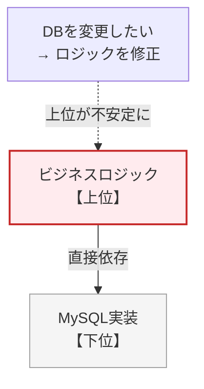
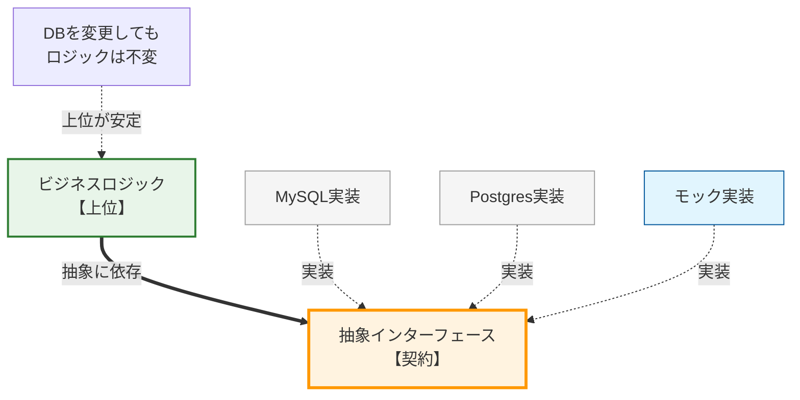
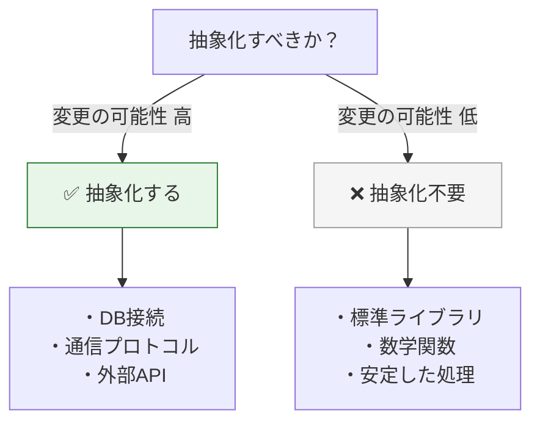
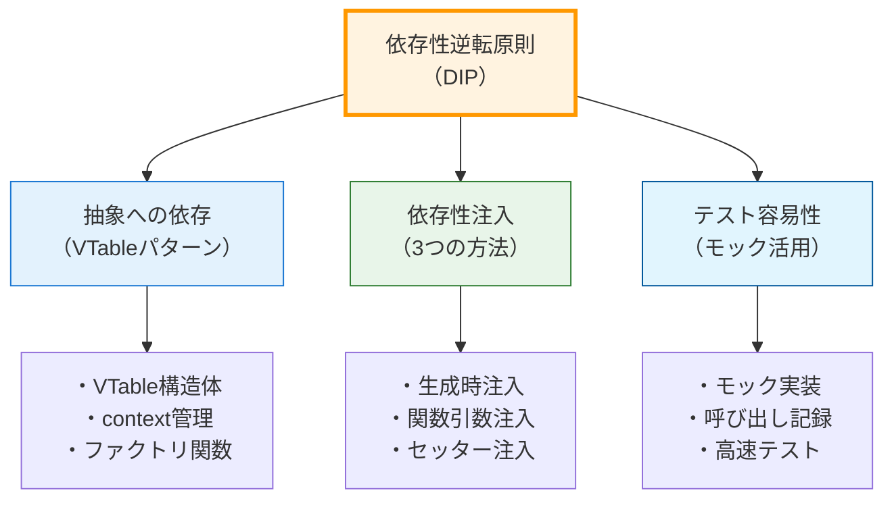
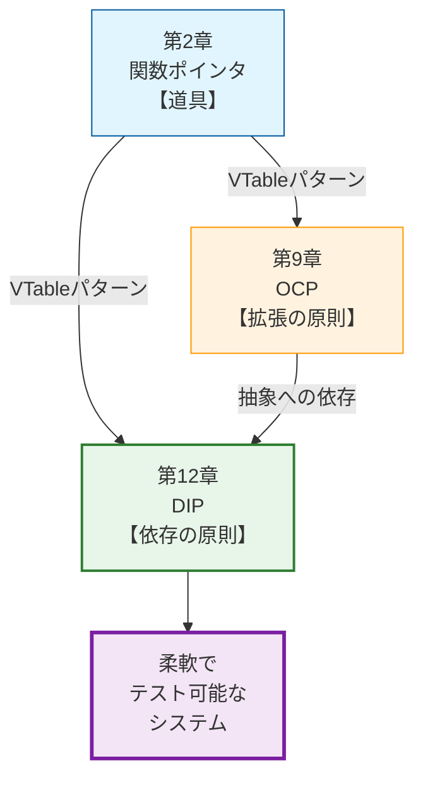

## 実例：税計算機能

### ステップ1：契約定義

#### itax.h

税計算を抽象化したVTableとコンテキスト構造体の定義です。国や地域ごとに異なる税率や計算ルールを `calculate_tax` という共通のインターフェースで覆い隠すことで、注文処理ロジックを地域固有の詳細から解放します。

#### itax.h
```c
typedef struct {
    double (*calculate_tax)(void* self, double amount);
} ITaxVTable;
typedef struct {
    const ITaxVTable* vtable;
    void* self;
} ITax;
```

### ステップ2：モックでテスト

#### test_order.c

特定の地域（日本など）の計算ロジックが未実装でも、注文合計金額の計算などが正しく行われるかを検証する単体テストです。モックを注入することで、計算式の正しさを単独で保証できます。
★本来は別ファイルの意図を説明して
上位モジュールのロジック（本来は別ファイル）です。抽象インターフェース (ITax) にのみ依存し、具体的な計算方法を知らない状態で作られています。

#### test_order.c
```c
#include "itax.h"
#include <assert.h>
#include <stdlib.h>

// 上位モジュールのロジック（本来は別ファイル）
// 抽象インターフェース (ITax) にのみ依存し、具体的な計算方法を知らない
double calculate_total(double amount, ITax* tax) {
    if (!tax || !tax->vtable || !tax->vtable->calculate_tax) return amount;
    // 契約に従って計算を委譲
    return amount + tax->vtable->calculate_tax(tax->self, amount);
}

// テスト用モック定義
typedef struct {
    double rate;
} MockTax;

static double mock_calc(void* self, double amount) {
    MockTax* m = (MockTax*)self;
    return amount * m->rate;
}

static const ITaxVTable MOCK_VTABLE = { .calculate_tax = mock_calc };

ITax* create_mock_tax(MockTax* mock) {
    ITax* tax = malloc(sizeof(ITax));
    if (tax) {
        tax->vtable = &MOCK_VTABLE;
        tax->self = mock;
    }
    return tax;
}

void test_total_calculation(void) {
    // モック税計算（10%固定）を注入
    MockTax mock = { .rate = 0.10 };
    ITax* tax = create_mock_tax(&mock); // 依存性の注入(DI)

    double result = calculate_total(100.0, tax);
    assert(result == 110.0);  // 100 + 10 の検証

    free(tax);
}
```

### ステップ3：本物の実装

#### japan_tax.c（後から実装）

後から追加された具体的な日本の税計算ロジックです。インターフェースに従って実装されているため、既存のコードを変更することなく、モックと差し替えることができます。

日本の税率（10%）を適用した具体的な計算ロジックの実装です。抽象インターフェース `ITax` に従うことで、既存のテストコードや将来の他国対応ロジックと容易に差し替え可能です。

#### japan_tax.c
```c
#include "itax.h"
#include <stdlib.h>

static double japan_tax_calc(void* self, double amount) {
    (void)self; // 日本の税率は固定（10%）
    return amount * 0.10;
}

static const ITaxVTable JAPAN_TAX_VTABLE = {
    .calculate_tax = japan_tax_calc
};

// ファクトリ関数：具象の詳細を隠蔽して抽象型(ITax)を返す
ITax* create_japan_tax(void) {
    ITax* tax = malloc(sizeof(ITax));
    if (tax) {
        tax->vtable = &JAPAN_TAX_VTABLE;
        tax->self = NULL;
    }
    return tax;
}
```

#### 階層設計の劇的変化

 **❌ DIPなし：下位に振り回される** 
ビジネスロジックがMySQLなどの下位実装に直接依存している状態です。



 **✅ DIPあり：抽象を挟んで自立** 
ビジネスロジックと下位実装の間に抽象インターフェースが介在し、双方がそれに依存している状態です。



 **設計の逆転** : 
*   **DIPなし** : ビジネスロジックがMySQLに合わせて動く   
*   **DIPあり** : MySQLがビジネスロジックが決めたルールに合わせて動きます。

#### よくある誤解と注意点

#### 誤解1：「すべてを抽象化すべき」

 **真実** : 抽象化が必要なのは以下の場合のみです。
* 複数の実装が存在する（または将来存在する）
* テスト時にモックと差し替える必要がある
* 変更が頻繁に発生する不安定な部分

#### 抽象化の判断フロー

どのような場合にコストを払ってでも抽象化（VTable化）すべきかの判断基準です。
**YAGNI原則** : 変更の可能性が低いもの（標準ライブラリなど）まで過剰に抽象化する必要はありません。



#### 誤解2：「DIPは常にパフォーマンスを犠牲にする」

 **真実** ： 関数ポインタの呼び出し自体は数ナノ秒程度のオーバーヘッドです。ただし、コンパイラによる「インライン展開」を妨げるため、非常に小さな関数をタイトなループで呼ぶ場合は影響が出ます。
多くのケースでボトルネックはI/O操作（通信やストレージ）にあり、設計の柔軟性がもたらす価値の方が勝ります。

#### 誤解3：「抽象は実装の詳細を一切知らない」

 **真実** ： 抽象インターフェースは、実装の「一般的な制約」を反映することがある。

#### FileSystem_Example.h

ファイルシステムの抽象化例です。すべてのファイルシステムに共通する「オープンして書き込んでクローズする」という手順を抽象化しています。特定のOSやファイルシステムの固有機能（権限設定など）を含めないことで、汎用性を高めています（Interface Segregation Principle）。
特定の実装（NTFS、ext4等）に依存しないため、移植性が向上します。

#### FileSystem_Example.h
```c
// 例：ファイルシステムの抽象化
typedef struct {
    // ファイルは「開いてから使う」必要がある（操作の順序制約）
    bool (*open)(void* self, const char* path);
    bool (*write)(void* self, const void* data, size_t size);
    void (*close)(void* self);
} IFileSystem;
```

#### DIPの本質

#### 技術要素の関連図

DIPを実現するために、これまでの章で学んだ技術要素がどう組み合わさっているかの全体像です。
**統合** ：第2章（関数ポインタ）、第4章（不完全型）、第9章（OCP）の知識がすべてここで統合されます。



## 本章で必ず理解してほしいことのまとめ

### 1.  **依存の方向は制御できる** 

ソースコード上の`#include`の向きは、自然な流れ（上位→下位）に任せるのではなく、アーキテクチャの意図に従って制御すべきです。

### 2.  **抽象が逆転の鍵** 

上位と下位の間に「VTableを持つ抽象インターフェース」を定義し、双方がその抽象に依存することで、依存関係が逆転します。

### 3.  **C言語での実践は「VTable + DI」** 

構造体と関数ポインタによる多態性の実現（VTableパターン）と、外部から依存オブジェクトを渡す「依存性注入（DI）」を組み合わせることで、DIPは実現されます。

### 4.  **目的は柔軟性とテスト** 

DIPは目的ではなく手段です。真の目的は、DBやOSなどの詳細を自由に差し替えられる **柔軟性** と、モックを使った高速で安定した **テスト環境** を手に入れることにあります。

#### チェックリスト

DIPを適用する際は、以下を確認してください：
 [ ]  **抽象インターフェースの定義** ：上位モジュールが必要とする操作のみを含んでいますか？
 [ ]  **上位モジュールの依存** ：抽象ヘッダのみを`#include`していますか？
 [ ]  **下位モジュールの実装** ：抽象インターフェースを実装していますか？
 [ ]  **依存注入の実装** ：生成時/関数引数/セッター注入のいずれかを使用していますか？
 [ ]  **テストの作成** ：モックを使ったユニットテストが書けますか？
 [ ]  **ワイヤリング** ：Main関数で具象オブジェクトを生成・注入していますか？

### 三つの章の統合

#### 設計スキルの体系化

道具（2章）、原則（9章）、構造（12章）の関係性です。これまでの学習がすべてつながり、実践的な設計スキルとして体系化されたことを示しています。



 **統合された知識** :
-  **第2章** : VTableという道具を手に入れた
-  **第9章** : OCPという原則でVTableの使い方を学んだ
-  **第12章** : DIPという原則でVTableを組み合わせる方法を学んだ

これら三つの章を通じて、C言語における「変更に強く、テスト可能で、拡張性の高い設計」を実現する完全な技術体系を習得しました。

#### 次章への橋渡し

次章（[[17_第2部 第13章 統合実践（基本）_01|第13章 統合実践（基本）]]）では、これまで学んだ原則（SRP, OCP, LSP, ISP, DIP）のすべてを統合し、実際のコードリファクタリングを通じて美しい設計へと作り変えていくプロセスを体験します。

特に、SOLID原則を適用する「順序」が設計の質にどう影響するかに注目します。密結合で変更が困難な「典型的な悪いコード」を題材に、SOLID原則を段階的に適用していき、強力な相乗効果が生まれる瞬間をぜひ体感してください。
