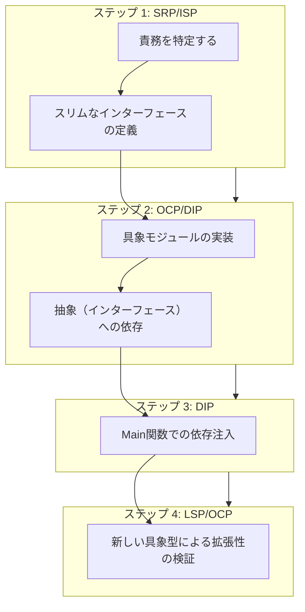
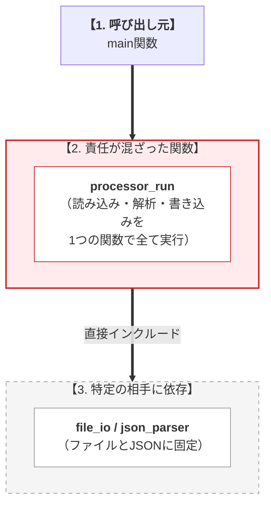
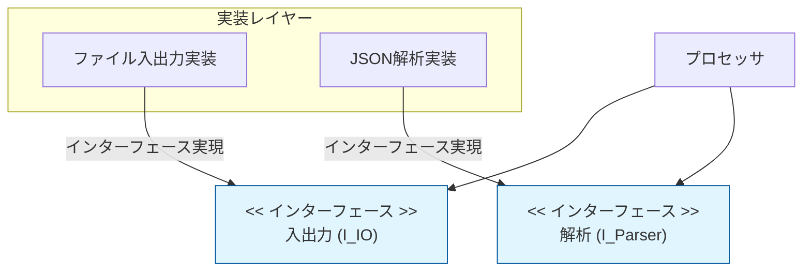

# 第2部 第13章 統合実践（基本）
## 〜バラバラだった原則が、一つの線でつながる瞬間〜

この章では、これまで学んできた **SOLID原則** を全部のせして、実際のコードをリファクタリング（中身の整理）してみます。私が設計を学んでいて一番ワクワクしたのは、バラバラに思えた原則たちが、パズルのピースがはまるように「 **連鎖反応** 」を起こした瞬間でした。

「一つを直したら、あっちも自然と綺麗になった！」というあの感覚を、ぜひ一緒に体験してほしいと思っています。

いかに **上位モジュール** から **下位の具象実装への依存** を断ち切るかが焦点になります。

*   **SRP** で責任を分離 → **ISP** で契約が自然と小さくなる
*   **OCP** で抽象を導入 → **DIP** で依存の逆転が容易になります
*   **LSP** で置換可能性を保証 → システムの安定性が向上します

この章では、この連鎖をステップごとに体験します。本書の核となる思想を実践します。

## 1. 統合実践の目的：原則たちの「チームプレイ」を見る

SOLID原則って、一つひとつを個別に覚えるのは大変ですよね。でも実は、彼らはとても仲の良いチームのようなものだと私は感じています。

 **S（単一責任）** で仕事を分けると、 **I（インターフェース分離）** で交わす約束がシンプルになります。 **O（開放閉鎖）** で「後から足せる」ように作ると、自然と **D（依存性逆転）** の形になって、上下関係がスッキリします。

今回は「 **Simple Processor** （シンプルな処理機）」という、少し泥臭いコードを題材にします。これをステップバイステップで、美しく、そして「後で自分が楽になれる」コードに育てていきましょう。

#### リファクタリングのロードマップ

本章で実施するリファクタリングの4段階のプロセスです。

 **順序** : まず責務（SRP）を整理し、次に抽象化（OCP/DIP）を行い、最後に構成（DIP/LSP）を整えるという「内から外へ」の流れが重要です。



### 1.1. なぜこの順序で原則を適用するのか

この順序は『内側から外側へ』という論理に基づいています。まず責任を分離（SRP）してから、その分離した責任を抽象化（OCP/DIP）し、最後に抽象の安全性を検証（LSP）します。

逆順で適用すると、責任が曖昧なまま抽象化してしまい、かえって複雑になります。

| ステップ | 適用原則 | 役割と焦点 |
| --- | --- | --- |
|  **ステップ1**  |  **SRP/ISP**  |  **分離** : まず「 **何** 」を分離すべきか明確にします（責務の明確化）。 |
|  **ステップ2**  |  **OCP/DIP**  |  **抽象化** : 分離したものを「 **どう** 」抽象化し、具象を契約に依存させるか決めます。 |
|  **ステップ3**  |  **DIP**  |  **制御** : 抽象と具象を「 **誰が** 」結びつけるか（依存注入）を制御します。 |
|  **ステップ4**  |  **LSP/OCP**  |  **検証** : 抽象の置換が「 **本当に** 」安全か検証し、拡張の容易さを確認します。 |

####  **道具→原則→目的の視点**

SOLID原則は、目的である **保守性** や **拡張性** を達成するための **設計指針** です。この指針をC言語で実現する具体的な **道具** が、第1部で学んだ **関数ポインタ** や **構造体によるカプセル化（VTableパターン）** であり、この章でそれらを統合して利用します。

## 2. ケーススタディ：Simple Processorの設計課題

#### システム概要

典型的なデータ処理フローを題材に、SOLID原則違反の修正プロセスを示します。
*   **データの読み取り/書き込み** （Input/Output）
*   **データの解析** （Parse）
*   **制御ロジック** （Control）

初期状態では全機能が単一のソースファイルに混在しています。

### ❌ 適用前（SOLID原則違反：巨大モジュールと具象依存）

初期設計では、すべての処理が`processor.c`に集約され、以下の **深刻な設計問題** を抱えています。

#### 原則違反の構造

上位モジュール（main）から下位の具象実装（FileIO/JsonParser）まで、依存関係が一直線につながってしまっている状態です。

*   **SRP違反** : `processor_run` が大きくなりすぎています。
*   **DIP違反** : 具体的なファイル名やフォーマットに直接依存しています。



####  **【問題1: SRP違反】**

`processor_run`関数が、IO、Parser、制御の **3つの異なる責任** を同時に担っています。

####  **【問題2: DIP違反】**

最上位の制御ロジックが、具象モジュール（`file_io.h`、`json_parser.h`）を **直接インクルード** し、密結合しています。

####  **【この設計で起きる実務上の問題】**

*   **変更シナリオ1** : 「ネットワークIO対応」の要求が来た → `file_io.h`を`network_io.h`に変更し、`processor_run`関数全体を修正する必要があります
*   **変更シナリオ2** : 「XMLパーサー追加」の要求が来た → `json_parser_parse`の呼び出しを条件分岐で切り替え、制御ロジックを修正する必要があります
*   **問題の本質** : 新機能追加のたびに、 **安定しているべき制御ロジック** を修正しています（OCP違反）。

それでは、リファクタリング前の「とりあえず動く」コードを見てみましょう。
すべての責任が1つのファイルに入り混じり、具体的なファイル操作やJSON解析のモジュールとべったり密結合した、典型的な「神クラス（God Class）」のC言語版です。ここから依存関係をどう解きほぐしていくかが本章のテーマです。

#### simple_processor.c (全ての具象に直接依存した変更に脆い初期状態 - 初期バージョン - 密結合状態)
```c
#include "file_io.h"      // DIP違反: 具象IOモジュールに直接依存
#include "json_parser.h"  // DIP違反: 具象Parserモジュールに直接依存
#include <stdlib.h>
#include <stdio.h>
#include <string.h>
// ProcessedDataの定義
typedef struct {
    int id;
    char name[64];
} ProcessedData;
// 具象関数の前方宣言
extern char* file_io_read(const char* path);
extern ProcessedData* json_parser_parse(const char* raw_data);
extern int file_io_write(const char* path, ProcessedData* data);
```

一つの巨大な `processor_run` 関数の中で、ファイル読み込みという「物理的な操作」と、全体の「流れの制御」が完全に混ざってしまっています。どちらの事情が変わっても、この関数を修正しなければなりません。

#### simple_processor.c (物理的な操作と制御の流れが混ざり合った状態 - 続き: ロジックの混在)
```c
// SRP違反: IO、Parser、制御の3つの責任が混在

int processor_run(const char* input_path, const char* output_path) {
    char* raw_data = NULL;
    ProcessedData* data = NULL;
    int result = -1;
    // 1. IO（取得） - file_ioという具象を直接知っている
    printf("[Processor] 入力処理開始: %s\n", input_path);
    raw_data = file_io_read(input_path);

    if (raw_data == NULL) {
        printf("[Processor] エラー: データ読み込み失敗\n");
        goto cleanup;
    }
```

続いてデータの解析です。ここでもJSONパーサーという具体的な外部モジュールを直接呼んでしまっています。データ形式がXMLに変わったら、またしてもこの巨大関数の内部を書き換えなければなりません。

#### simple_processor.c (具象パーサーを直接呼び出してしまう解析処理 - 続き: 解析責任の混入)
```c
    // 2. Parser（処理） - json_parserという具象を直接知っている
    printf("[Processor] データ解析開始\n");
    data = json_parser_parse(raw_data);
    free(raw_data);
    raw_data = NULL;

    if (data == NULL) {
        printf("[Processor] エラー: データ解析失敗\n");
        goto cleanup;
    }
```

最後に出力と後始末の処理です。「何をするか（制御の流れ）」と「どうやるか（ファイルの読み書き、メモリ解放）」が混然一体となっています。さらに、エラー時の `goto` によるジャンプが複雑さを増しています。

#### simple_processor.c (実行の流れと後始末が混然一体となった制御 - 続き: 出力と終了処理)
```c
    // 3. IO（出力） - file_ioという具象を直接知っている
    printf("[Processor] 出力処理開始: %s\n", output_path);
    result = file_io_write(output_path, data);

    if (result != 0) {
        printf("[Processor] エラー: データ書き込み失敗\n");
        goto cleanup;
    }
    printf("[Processor] 処理完了\n");
    result = 0;
cleanup:

    if (data) free(data);

    return result;
}
// ========================================
// 具象実装のスタブ（トレースのため残す）
// ========================================

char* file_io_read(const char* path) {
    printf("  [FileIO] ファイル '%s' から読み込み\n", path);

    return strdup("{\"id\":10, \"name\":\"InitialUser\"}");
}

int file_io_write(const char* path, ProcessedData* data) {
    printf("  [FileIO] ファイル '%s' へ書き込み: ID=%d, Name=%s\n",
           path, data->id, data->name);

    return 0;
}

ProcessedData* json_parser_parse(const char* raw_data) {
    printf("  [JsonParser] JSON解析中...\n");
    ProcessedData* data = (ProcessedData*)malloc(sizeof(ProcessedData));

    if (data == NULL) return NULL;
    data->id = 10;
    strcpy(data->name, "InitialUser");
    printf("  [JsonParser] 解析完了: ID=%d, Name=%s\n", data->id, data->name);

    return data;
}
// ========================================
// main関数
// ========================================

int main(void) {
    printf("=== SOLID原則違反コードの実行 ===\n\n");
    int status = processor_run("input.txt", "output.txt");
    printf("\n=== 実行結果: %s (code: %d) ===\n",
           status == 0 ? "成功" : "失敗", status);

    return status;
}
```

#### 変更に脆い初期状態の実行結果

正常に動作はしますが、内部構造は変更に対して非常に脆い状態です。

#### 実行結果
```c
=== SOLID原則違反コードの実行 ===
[Processor] 入力処理開始: input.txt
  [FileIO] ファイル 'input.txt' から読み込み
[Processor] データ解析開始
  [JsonParser] JSON解析中...
  [JsonParser] 解析完了: ID=10, Name=InitialUser
[Processor] 出力処理開始: output.txt
  [FileIO] ファイル 'output.txt' へ書き込み: ID=10, Name=InitialUser
[Processor] 処理完了
=== 実行結果: 成功 (code: 0) ===
```


## ステップ1：SRP/ISPによる責任の分離と抽象インターフェースの導入

#### 設計判断のポイント

 **単一責任原則 (SRP)** を適用し、以下の責任を分離します。同時に、クライアント（`processor_run`）が必要な機能のみに依存するように **インターフェース分離原則 (ISP)** を適用し、VTableを役割ごとに定義します。

#### 責任の分離イメージ

巨大だったプロセッサを、「入出力」「解析」「制御」の3つに分割し、それぞれをインターフェースで定義した状態です。

 **抽象への依存** : クライアントは具体的な `FileIO` や `JsonParser` ではなく、抽象的な `I_IO` や `I_Parser` に依存するようになります。





|分離前の状態 | 分離後の構成（責務の抽出） | 適用される原則 |
| --- | --- | --- |
| **`processor_run` がすべての責任を持つ** |  **IO責任** : `IIO` インターフェース |  **SRP / DIP**  |
| (実装詳細に依存した密結合な巨大関数) |  **Parser責任** : `IParser` インターフェース |  **SRP / DIP**  |
| (全ての変更の影響を直接受ける) |  **制御責任** : `processor_run` (抽象のみに依存) |  **SRP / DIP**  |

この分離により、各責任の **変更理由** が明確になります。

*   IOの変更理由：「データの読み書き方法が変わる」
*   Parserの変更理由：「データフォーマットが変わる」
*   Processorの変更理由：「処理の順序が変わる」

ステップ1の開始です。まずはシステム全体でやり取りされる「共通言語」としてのデータ構造体（Value Object）を定義します。このヘッダはあらゆるモジュールから参照されるため、もっとも変更されにくい（安定した）設計にする必要があります。

#### processed_data.h (全モジュールで共有される安定したデータ構造 - 共通データ型)
```c
#ifndef PROCESSED_DATA_H
#define PROCESSED_DATA_H
// 共通データ構造：全モジュールで共有（Value Object）
typedef struct {
    int id;
    char name[64];
} ProcessedData;
#endif // PROCESSED_DATA_H
```

次に、上位のプロセッサが要求する「読み込み」と「書き込み」という機能だけを抜き出した抽象契約（インターフェース）を定義します。ファイルを使うかネットワークを使うかは、ここでは一切語られません。

#### i_io.h (読み書きの機能だけを抜き出した抽象契約 - IOの抽象契約)
```c
#ifndef I_IO_H
#define I_IO_H
#include "processed_data.h"
// 前方宣言（不完全型）
typedef struct IIO IIO;
typedef struct IIOVTable IIOVTable;
// VTable構造体の定義
// VTable構造体の定義
struct IIOVTable {
    // データの読み込み責任（戻り値は呼び出し側で解放が必要）
    char* (*read)(void* self, const char* path);
    // データの書き込み責任
    int (*write)(void* self, const char* path, ProcessedData* data);
    // インスタンス破棄の責任
    void (*destroy)(void* self);
};
// 抽象インターフェース構造体
struct IIO {
    const IIOVTable* vtable; // const推奨
    void* self;  // 具象データへの不透明ポインタ
};
/* 抽象API：VTableを隠蔽し、安全な破棄を保証する */
char* io_read(IIO* io, const char* path);
int io_write(IIO* io, const char* path, ProcessedData* data);
void io_destroy(IIO* io);
#endif // I_IO_H
```

使う側が関数ポインタ（VTable）の存在を意識せずに済むよう、ラップ（包む）するAPIも用意しておきましょう。これによりNULLチェック等も一箇所に集約でき、安全性が劇的に向上します。

#### i_io.c (VTableをラップし安全性を担保する抽象API - 抽象APIの実装)
```c
#include "i_io.h"
#include <stdlib.h>

char* io_read(IIO* io, const char* path) {
    if (!io || !io->vtable || !io->vtable->read) return NULL;

    return io->vtable->read(io->self, path);
}

int io_write(IIO* io, const char* path, ProcessedData* data) {
    if (!io || !io->vtable || !io->vtable->write) return -1;

    return io->vtable->write(io->self, path, data);
}

void io_destroy(IIO* io) {
    if (!io) return;

    if (io->vtable && io->vtable->destroy) {
        io->vtable->destroy(io->self);
    }
    free(io);
}
```

同様に、データを解析する「Parser」の契約も定義します。
ここで重要なのは、データを「生成（parse）」する責任だけでなく、「破棄（free_data）」する責任もセットで持たせるという原則です。これにより、将来パーサーの種類ごとにメモリ管理の方法（標準のmallocや独自プールなど）が異なっても、上位モジュールは一切気にしなくてよくなります。

#### i_parser.h (生成と破棄の責任をセットにした解析の契約 - Parserの抽象契約)
```c
#ifndef I_PARSER_H
#define I_PARSER_H
#include "processed_data.h"
// 前方宣言
typedef struct IParser IParser;
typedef struct IParserVTable IParserVTable;
// VTable構造体の定義
struct IParserVTable {
    // 解析責任：raw_dataを解析し、構造体を生成して返す
    ProcessedData* (*parse)(void* self, const char* raw_data);
    // データ解放責任：このパーサーが生成したデータの解放方法を知っている
    void (*free_data)(void* self, ProcessedData* data);
    // インスタンス破棄責任
    void (*destroy)(void* self);
};
// 抽象インターフェース構造体
struct IParser {
    const IParserVTable* vtable; // const推奨
    void* self;  // 具象データへの不透明ポインタ
};
/* 抽象API */
ProcessedData* parser_parse(IParser* parser, const char* raw_data);
// 重要：生成したパーサー自身にデータを解放させる（対になる操作）
void parser_free_data(IParser* parser, ProcessedData* data);
void parser_destroy(IParser* parser);
#endif // I_PARSER_H
```

当然パーサー側にも、VTableをラップする安全な呼び出し口を用意しておきます。

#### i_parser.c (メモリ管理の詳細を隠蔽し安全に呼び出すAPI - 抽象APIの実装)
```c
#include "i_parser.h"
#include <stdlib.h>

ProcessedData* parser_parse(IParser* parser, const char* raw_data) {
    if (!parser || !parser->vtable || !parser->vtable->parse) return NULL;

    return parser->vtable->parse(parser->self, raw_data);
}

void parser_free_data(IParser* parser, ProcessedData* data) {
    if (!parser || !data) return;
    // 具象実装が解放ロジックを提供している場合のみ実行
    if (parser->vtable && parser->vtable->free_data) {
        parser->vtable->free_data(parser->self, data);
    } else {
        // デフォルト解放（標準的なmallocの場合）
        free(data);
    }
}

void parser_destroy(IParser* parser) {
    if (!parser) return;

    if (parser->vtable && parser->vtable->destroy) {
        parser->vtable->destroy(parser->self);
    }
    free(parser);
}
```

これで「下位（具象）に押し付けたい契約」の準備が整いました。
次に、巨大だったプロセッサを、これらの「抽象契約」にのみ依存するすっきりした姿へと生まれ変わらせます。まずはヘッダです。

#### processor.h (抽象契約のみに依存する再設計された中核)
```c
#ifndef PROCESSOR_H
#define PROCESSOR_H
#include "i_io.h"
#include "i_parser.h"
// 抽象契約：Processorの公開API
// SRP遵守: 制御フローの責任のみを持つ
// DIP遵守: 抽象インターフェースのみに依存
int processor_run(IIO* io, IParser* parser, const char* input_path, const char* output_path);
#endif // PROCESSOR_H
```

関数の引数（関数引数注入）として受け取った抽象（`IIO` と `IParser`）を使って処理を組み立てます。もはやこのプロセッサは、物理的なファイルやJSONという概念を一切知らず、ただ「読んで、解析して、書く」という純粋な制御の責任（SRP）のみを負う美しいコードになりました。

#### processor.c (純粋な制御責任だけを持つ美しいプロセッサ - 制御ロジックの完成)
```c
#include "processor.h"
#include <stdlib.h>
#include <stdio.h>

int processor_run(IIO* io, IParser* parser, const char* input_path, const char* output_path) {
    char* raw_data = NULL;
    ProcessedData* data = NULL;
    int result = -1;

    if (!io || !parser) return -1;
    // 1. データの取得
    printf("[Processor] 入力処理開始\n");
    raw_data = io_read(io, input_path);

    if (!raw_data) {
        printf("[Processor] エラー: 読み込み失敗\n");

        return -1;
    }
    // 2. データの解析
    printf("[Processor] データ解析開始\n");
    data = parser_parse(parser, raw_data);
    free(raw_data); // 具象が作成した文字列の解放

    if (!data) {
        printf("[Processor] エラー: 解析失敗\n");

        return -1;
    }
    // 3. データの出力
    printf("[Processor] 出力処理開始\n");
    result = io_write(io, output_path, data);
    // 4. データの破棄：型を知っているParserに依頼する（重要：LSP/SRPの観点）
    parser_free_data(parser, data);

    if (result == 0) printf("[Processor] 処理完了\n");

    return result;
}
```

## ステップ2：OCP/ISPによる抽象化とDIPの実現

このステップでは、具象モジュール（実際の実装）が抽象契約を「実装」するフェーズへと移ります。ここでは3つの設計原則に基づいた重要な判断を行っています。

#### 1. 開放閉鎖原則 (OCP) の達成

新しい入出力方式や解析フォーマットが必要になっても、利用側である `processor.c` を書き換える必要はありません。新しい実装を追加するだけで機能拡張ができる、 **「拡張に開かれ、修正に閉じている」** 状態を実現します。

#### 2. インターフェース分離原則 (ISP) の適用

の契約（`IIO`）と解析の契約（`IParser`）を明確に分離しました。これにより、解析処理しか必要としないクライアントに対して、無関係な入出力用のメソッドへの依存を強制させない「必要最小限の契約」を提供します。

#### 3. 依存性逆転原則 (DIP) の完遂

これまでのように上位モジュールが下位モジュールに合わせるのではなく、具象モジュール側が「抽象契約」に合わせて自分を適合させます。依存の向きが逆転し、ビジネスロジックが詳細な実装（ファイル操作や特定のデータ形式）から完全に解放されます。

ステップ2です。上位モジュールが突きつけた「抽象契約」を満たすため、泥臭い具体的な実装（ファイル読み書きやJSONの解析）を作っていきます。

まずはファイルIOの具象実装です。余計な内部構造は決して外に見せず、抽象インターフェース（`IIO`）を返すファクトリ関数のみを公開します。

#### file_io_impl.h (抽象インターフェースを返すファクトリの公開)
```c
#ifndef FILE_IO_IMPL_H
#define FILE_IO_IMPL_H
#include "i_io.h"
// ファクトリ関数：FileIOの具象インスタンスを生成
IIO* file_io_create(void);
#endif // FILE_IO_IMPL_H
```

ファイル読み書きの具体的なロジックです。ここでは `i_io.h` という「契約」が絶対的なルールとなり、それに適合するように関数を実装します。独自の内部状態（アクセス回数など）は `FileIOData` 構造体にひっそりと閉じ込めています。

#### file_io_impl.c (契約に適合するように実装されたファイル操作)
```c
#include "file_io_impl.h"
#include "processed_data.h"
#include <stdlib.h>
#include <string.h>
#include <stdio.h>
// 具象データ構造（FileIO固有の状態）
typedef struct {
    int access_count;  // アクセス回数を記録
} FileIOData;
// 具象実装：readメソッド

static char* file_io_read_impl(void* self, const char* path) {
    FileIOData* data = (FileIOData*)self;
    data->access_count++;
    printf("  [FileIO %d回目] ファイル '%s' から読み込み\n", data->access_count, path);

    return strdup("{\"id\":10, \"name\":\"FileUser\"}");
}
// 具象実装：writeメソッド

static int file_io_write_impl(void* self, const char* path, ProcessedData* d) {
    FileIOData* data = (FileIOData*)self;
    data->access_count++;
    printf("  [FileIO %d回目] ファイル '%s' へ書き込み: ID=%d, Name=%s\n", data->access_count, path, d->id, d->name);

    return 0;
}
```

リソースの破棄処理と、これら全ての機能をまとめたVTableの定義です。最後にファクトリ関数（`file_io_create`）の中で、具象データ（`self`）と振る舞い（`vtable`）をガッチリと結合し、外界に対しては抽象的な `IIO` の顔をして送り出します。

#### file_io_impl.c (具象データと振る舞いを結合するファクトリ - 続き: VTableと生成)
```c
// 具象実装：destroyメソッド

static void file_io_destroy_impl(void* self) {
    if (self) {
        FileIOData* data = (FileIOData*)self;
        printf("  [FileIO] リソース解放（総アクセス回数: %d）\n", data->access_count);
        free(self);
    }
}
// 具象VTable
static IIOVTable file_io_vtable = {
    .read = file_io_read_impl,
    .write = file_io_write_impl,
    .destroy = file_io_destroy_impl
};
// ファクトリ関数：具象インスタンスの生成

IIO* file_io_create(void) {
    // 具象データの確保
    FileIOData* file_data = (FileIOData*)malloc(sizeof(FileIOData));

    if (file_data == NULL) return NULL;
    file_data->access_count = 0;
    // 抽象インスタンスの確保
    IIO* io = (IIO*)malloc(sizeof(IIO));

    if (io == NULL) {
        // 安全性: 片方の確保に失敗したら、もう片方も解放してNULLを返す（アトミックな生成）
        free(file_data);

        return NULL;
    }
    // 依存注入/結合：抽象契約に具象実装をリンク（DIP実現）
    io->vtable = &file_io_vtable;
    io->self = file_data;

    return io;
}
```

続いて、JSONを解析する具象パーサーです。こちらもファイルIOと同様に、外の世界には「抽象（`IParser`）を返す生成関数」だけを見せます。これがC言語における「パッケージプライベート（実装の隠蔽）」の極意です。

#### json_parser_impl.h (抽象を返す生成関数だけを見せる公開ヘッダ - 具象Parserのファクトリ)
```c
#ifndef JSON_PARSER_IMPL_H
#define JSON_PARSER_IMPL_H
#include "i_parser.h"
// ファクトリ関数：JsonParserの具象インスタンスを生成
IParser* json_parser_create(void);
#endif // JSON_PARSER_IMPL_H
```

JSON解析の具体的なロジックです。ここではデータを「生成」するのと同時に、後でそれを「解放」するための専用のロジック（`free_data`）も一緒に用意します。これでメモリ確保と解放のペアが絶対にズレない、安全なライフサイクルが保証されます。

#### json_parser_impl.c (破棄の責任もセットで持つJSON解析の実装)
```c
#include "i_parser.h"
#include "processed_data.h"
#include <stdlib.h>
#include <string.h>
#include <stdio.h>
// 具象データ構造（JsonParser固有の状態）
typedef struct {
    int parsed_count;  // パース実行回数を記録
} JsonParserData;
// 具象実装：parseメソッド

static ProcessedData* json_parser_parse_impl(void* self, const char* raw_data) {
    JsonParserData* parser_state = (JsonParserData*)self;
    parser_state->parsed_count++;
    printf("  [JsonParser %d回目] JSON解析中...\n", parser_state->parsed_count);
    // 実際にはJSON解析ライブラリを使用
    ProcessedData* data = (ProcessedData*)malloc(sizeof(ProcessedData));

    if (data == NULL) return NULL;
    // 仮の解析処理
    data->id = 20;
    strcpy(data->name, "FileUser_A");
    printf("  [JsonParser %d回目] 解析完了: ID=%d, Name=%s\n", parser_state->parsed_count, data->id, data->name);

    return data;
}
```

データの解放と、パーサー自身の破棄を行うメソッドです。これらをVTableにまとめ、ファクトリ関数で抽象インターフェースとして出力します。この設計により、上位モジュールが「パーサーが内部でどんなメモリの取り方をしているか」を一切気にする必要がなくなりました。

#### json_parser_impl.c (メモリ管理の詳細を隠蔽するVTableと生成関数 - 続き: 解放と生成)
```c
// 具象実装：free_dataメソッド

static void json_parser_free_data_impl(void* self, ProcessedData* data) {
    JsonParserData* parser_state = (JsonParserData*)self;

    if (data) {
        printf("  [JsonParser %d回目] データ解放\n", parser_state->parsed_count);
        free(data);
    }
}
// 具象実装：destroyメソッド

static void json_parser_destroy_impl(void* self) {
    if (self) {
        JsonParserData* parser_state = (JsonParserData*)self;
        printf("  [JsonParser] リソース解放（総解析回数: %d）\n", parser_state->parsed_count);
        free(self);
    }
}
// 具象VTable
// DIP遵守: 具象が抽象契約（IParserVTable）に依存
static IParserVTable json_parser_vtable = {
    .parse = json_parser_parse_impl,
    .free_data = json_parser_free_data_impl,
    .destroy = json_parser_destroy_impl
};
// ファクトリ関数
IParser* json_parser_create(void) {
    JsonParserData* parser_data = (JsonParserData*)malloc(sizeof(JsonParserData));

    if (parser_data == NULL) return NULL;
    parser_data->parsed_count = 0;
    IParser* parser = (IParser*)malloc(sizeof(IParser));

    if (parser == NULL) {
        free(parser_data);

        return NULL;
    }
    parser->vtable = &json_parser_vtable;
    parser->self = parser_data;
    return parser;
}
```
