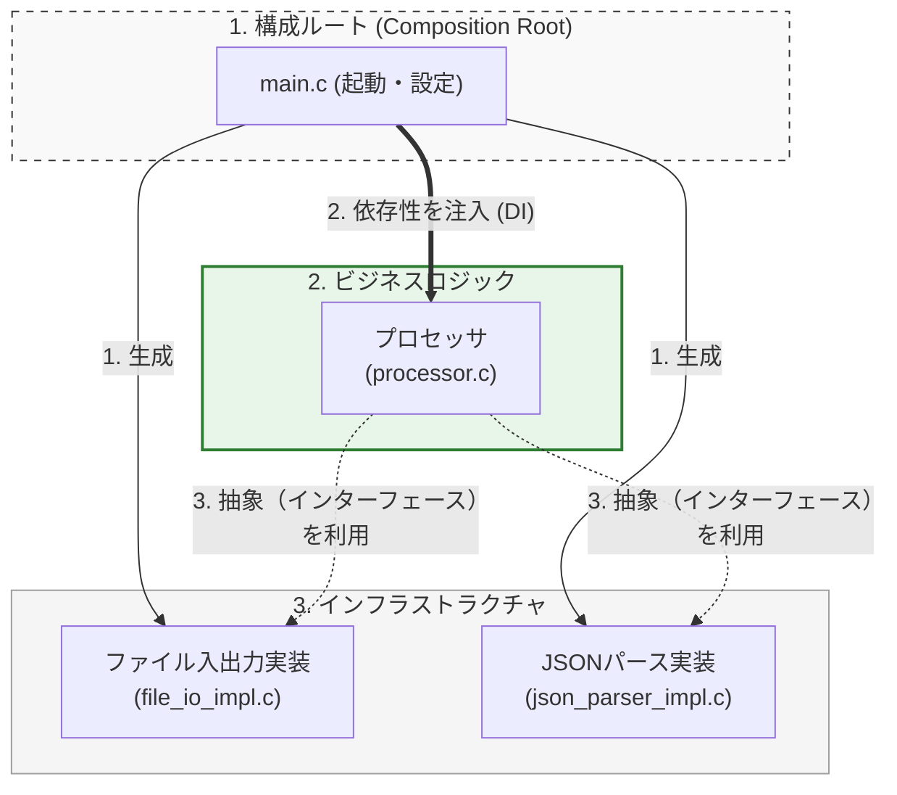

## ステップ3：DIPによる依存の逆転とコンポジションルート

設計の最終段階として、 **依存性逆転原則 (DIP)** を物理的に完結させるために、`main.c` を **コンポジションルート** として位置づけます。

#### コンポジションルートの役割と設計判断

「抽象に依存する」設計を徹底すると、一つ大きな疑問が生まれます。それは「誰が、どの具体的なオブジェクト（具象）を生成し、結びつけるのか？」という点です。その役割を担うのがコンポジションルートです。

#### 1. システム唯一の具象生成ポイント

コンポジションルート（通常は `main` 関数や起動処理）は、システム全体で唯一「具体的な実装（ファイルIOやJSON解析など）がどれであるか」を知っている場所になります。

#### 2. 「抽象」と「具象」の結びつけ（ワイヤリング）

抽象インターフェースに対して、どの具象オブジェクトを流し込むかという「依存性の注入（DI）」を一箇所に集中させます。これにより、アプリケーションの主要なロジック部分は、一切の具象を知ることなく、抽象のみに依存した状態で動作できるようになります。

#### 3. 変更の影響範囲の最小化

もし将来的に、JSON解析からXML解析へ、あるいはファイル読み込みからネットワーク受信へ変更する場合でも、修正が必要なのはこの「コンポジションルート」のみです。ビジネスロジック本体には一行も触れる必要がありません。

### コンポジションルートの実装

それでは、DIP/DIに準拠した完成形の `main` 関数を見てみましょう。
ここがすべての具体的な決定を下す「構成の責任者」です。個々のモジュールからは「他のモジュールを生成する責任」が完全に取り除かれています。

#### 全ての具象を知り依存を注入する構成責任者

#### main.c (コンポジションルート)
```c
// システムのエントリポイント
// 具象実装のヘッダをインクルード（依存をこの層に集中させます）
// ※本来はヘッダファイルを用意すべきですが、ここではextern宣言で代用します
#include "processor.h"
#include <stdlib.h>
#include <stdio.h>
// 具象ファクトリの宣言（コンポジションルートが知るべき情報）
extern IIO* file_io_create(void);
extern IParser* json_parser_create(void);

int main(void) {
    printf("=== DIP/DI準拠コードの実行 ===\n\n");
    IIO* file_io_impl = NULL;
    IParser* json_parser_impl = NULL;
    int result = -1;
    // ========================================
    // 1. 具象インスタンスの生成（具体的な決定）
    // ========================================
    printf("[Main] モジュール初期化中...\n");
    // FileIOの具象インスタンスを生成し、IIO*（抽象）として扱う
    file_io_impl = file_io_create();

    if (file_io_impl == NULL) {
        printf("[Main] エラー: FileIO生成失敗\n");
        goto cleanup;
    }
    // JsonParserの具象インスタンスを生成し、IParser*（抽象）として扱う
    json_parser_impl = json_parser_create();

    if (json_parser_impl == NULL) {
        printf("[Main] エラー: JsonParser生成失敗\n");
        goto cleanup;
    }
    printf("[Main] モジュール初期化完了\n\n");
    // ========================================
    // 制御ロジックに抽象インターフェースを注入（DI）
    // ========================================
    // processor_run は IIO* と IParser* を受け取るだけで、
    // 中身が FileIO なのか NetIO なのか、JsonParser なのか XmlParser なのか知らない（DIP）
    result = processor_run(file_io_impl, json_parser_impl, "input.txt", "output.txt");
cleanup:
    // 抽象APIを使用して安全に破棄（VTableの詳細を隠蔽）
    if (json_parser_impl) {
        parser_destroy(json_parser_impl);
    }

    if (file_io_impl) {
        io_destroy(file_io_impl);
    }
    printf("\n=== 実行結果: %s (code: %d) ===\n",
           result == 0 ? "成功" : "失敗", result);

    return result;
}
```

### 依存性注入の流れ

`main.c`（コンポジションルート）がすべての部品を生成し、組み立ててから実行するまでのフローです。
**注入**: `Main` が `Proc` に依存性（具象）を注入します。
利用**: `Proc` は注入された抽象を利用するだけで、その正体を知りません。



#### 実行結果

モジュールの初期化と注入が正しく行われ、処理が実行されています。

#### 依存が正しく注入され実行された結果

#### 実行結果
```c
=== DIP/DI準拠コードの実行 ===
[Main] モジュール初期化中...
[Main] モジュール初期化完了
[Processor] 入力処理開始
  [FileIO] ファイル 'input.txt' から読み込み
[Processor] データ解析開始
  [JsonParser] JSON解析中...
  [JsonParser] 解析完了: ID=20, Name=FileUser_A
[Processor] 出力処理開始
  [FileIO] ファイル 'output.txt' へ書き込み: ID=20, Name=FileUser_A
[Processor] 処理完了
=== 実行結果: 成功 (code: 0) ===
```

#### **設計上の改善点:**
| Before（ステップ2） | After（ステップ3） |
| --- | --- |
| 具象生成が分散 | ✅ `main.c`に集中（コンポジションルート） |
| 具象と抽象の結合が不明瞭 | ✅ 依存注入（DI）が明示的 |
| テスト時の置き換えが困難 | ✅ `main.c`のみ変更でモック注入可能 |

## ステップ4 LSPによる安全性の保証とOCPの検証

新しい要件として「**ネットワーク経由でデータを読み書きする**」`NetIO`モジュールを追加します。

#### 新しい具象モジュール（`NetIO`）の追加によるOCPの検証

`NetIO`が`IIO`の **契約** （LSP）を厳守することを要求します。`processor.c`を **修正せず** に、`main.c`の **具象の生成部分のみを修正** するだけで切り替えられることが、 **OCP達成の証明となります。**

#### 具象NetIOのスタブ（実装は省略）

新たに作成した「ネットワーク経由でやり取りするIOモジュール」です。`IIO` の契約さえ守っていれば、内部のロジックがファイル操作からソケット通信に激変しようが全く構いません（これがLSPとOCPの力です）。

#### OCPを検証するためのネットワーク操作スタブ

#### net_io_impl.c (検証用スタブ実装)
```c
#include "i_io.h"
#include <stdlib.h>
#include <stdio.h>
#include <string.h>
// NetIOの実装（スタブ）

static char* net_read_impl(void* self, const char* path) {
    printf("  [NetIO] ネットワーク '%s' からデータ受信\n", path);
    // 実際はソケット通信などを行う
    return strdup("{\"id\":99, \"name\":\"NetworkUser\"}");
}

static int net_write_impl(void* self, const char* path, ProcessedData* data) {
    printf("  [NetIO] ネットワーク '%s' へ送信: ID=%d, Name=%s\n", path, data->id, data->name);
    return 0;
}

static void net_destroy_impl(void* self) {
    printf("  [NetIO] 切断\n");
}
static IIOVTable net_io_vtable = {
    .read = net_read_impl,
    .write = net_write_impl,
    .destroy = net_destroy_impl
};

IIO* net_io_create(void) {
    IIO* io = (IIO*)malloc(sizeof(IIO));

    if (io) {
        io->vtable = &net_io_vtable;
        io->self = NULL; // 今回はコンテキスト不要
    }

    return io;
}
```

最後に、コンポジションルート（`main`）の配線を付け替えます。
`FileIO` を生成していた1行を `NetIO` の生成に書き換えるだけです。ビジネスロジック（`processor.c`）は1行たりとも修正していません。これこそが、私たちが血を流して「抽象化」と「依存性逆転」を行った最大の理由であり、OCP（開放閉鎖原則）が達成されたことの証明です。

#### 既存のロジックに触れずに行う具象の切り替え

#### main.c (NetIOへの切り替え)
```c
#include "processor.h"
#include <stdio.h>
// NetIOに切り替え - 変更点は[Main]ブロックのみ
// 具象実装のヘッダをNetIOに切り替える
// ※本来はヘッダをインクルードしますが、ここでは関数の前方宣言で代用します
extern IIO* net_io_create(); // NetIOの具象ファクトリ (NetIOが抽象IIOを実装している)
extern IParser* json_parser_create(); // JsonParserの具象ファクトリ (変更なし)
// processor_run は processor.h で宣言済み
int main(void) {
    printf("=== LSP/OCP検証コードの実行 (NetIOへ切り替え) ===\n\n");
    IIO* io_impl = NULL; // 抽象型で保持
    IParser* parser_impl = NULL;
    int result = -1;
    // [Main] 具象の切り替え箇所: main.cの変更だけで、FileIOからNetIOへ切り替え (OCP達成)
    io_impl = net_io_create(); // NetIOを生成 (FileIOの行をこれに置き換えるだけ)

    if (io_impl == NULL) {
        printf("[Main] エラー: NetIO生成失敗\n");
        goto cleanup;
    }
    parser_impl = json_parser_create();

    if (parser_impl == NULL) {
        printf("[Main] エラー: JsonParser生成失敗\n");
        goto cleanup;
    }
    printf("[Main] NetIOモジュールを初期化完了\n\n");
    // processor_runはIIO*を受け取るだけで、NetIOなのかFileIOなのか意識しない (LSP遵守)
    // 置き換え可能な具象が提供されたため、制御ロジックは修正不要
    result = processor_run(io_impl, parser_impl, "192.168.1.10", "192.168.1.20");
cleanup:
    // 抽象APIを使用して安全に破棄
    if (parser_impl) {
        parser_destroy(parser_impl);
    }

    if (io_impl) {
        io_destroy(io_impl);
    }
    printf("\n=== 実行結果: %s (code: %d) ===\n",
           result == 0 ? "成功" : "失敗", result);
    return result;
}
```

## 本章で必ず理解してほしいことのまとめ

このシンプルなリファクタリングを通じて、C言語において **SOLID原則** がどのように連携し、 **保守性** と **拡張性** という目的を達成するかを確認できました。

#### リファクタリングによる設計の進化プロセス
| 段階 | 適用された原則 | 主なC言語の道具 | 獲得した設計上のメリット | 貢献する三本柱 |
| --- | --- | --- | --- | --- |
| **初期状態** | － | 具象ヘッダのインクルード | (課題) 高い結合度、テストが困難 |  **依存** （強結合） |
| **1. 分離** |  **SRP / ISP**  | 構造体の分割、VTable（契約）の定義 | 責務が明確になり、コードの **保守性** が向上する |  **責任・契約**  |
| **2. 抽象化** |  **OCP / DIP**  | VTableの実装、不透明ポインタ | 実装を隠蔽し、 **拡張性** が向上。依存の向きが整う |  **契約・依存** （疎結合） |
| **3. 制御** |  **DIP**  | 依存性の注入(DI)、コンポジションルート | 依存が完全に **逆転** 。モックによる **テスト** が可能になる |  **依存** （逆転） |
| **4. 保証** |  **LSP**  | 関数シグネチャ（契約）の厳守 |  **多態性** の安全性が担保され、コードの信頼性が向上する |  **契約**  |

#### まとめ：三本柱がもたらす最終形

この表の流れは、単なるコード整理の工程ではなく、 **「物理的な依存を論理的な契約に置き換えていくプロセス」** そのものです。 **責任** を分けることで「どこを直せばいいか」が明確になり、  **契約** を定義することで「どう使うか」が安定し、  **依存** を制御することで「テストや交換」が自由になります。

この第13章で実践したステップこそが、C言語で大規模かつ長期運用に耐えうるシステムを作るための王道となります。

#### 次章への橋渡し

基本となる **Simple Processor** の設計は完成しました。[[18_第2部 第14章 統合実践（応用）_01|第14章 統合実践（応用） 複雑な実務課題への対処]] では、以下の課題に対し、第1部と第2部で習得した技術と原則を、より高度に統合し、具体的な実装パターンを通じて解決する方法を学びます。

*   **課題1: 複合処理とアルゴリズム切り替え**: 実行時に複数の異なるデータフォーマット（JSON/XMLなど）のパーサを動的に切り替える複雑な **多態性** の実現。これは、 **開放閉鎖原則 (OCP)** と **単一責任原則 (SRP)** を組み合わせて解決します。
*   **課題2: グローバルリソース管理**: 複数のモジュールが共有する **リソース管理** （ロギング、メモリプール）の責務を、 **DIP** を使ってテスト可能な形で分離し、グローバル変数への依存を避けます。
