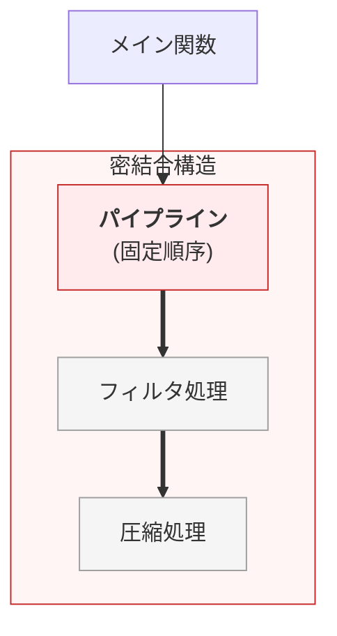
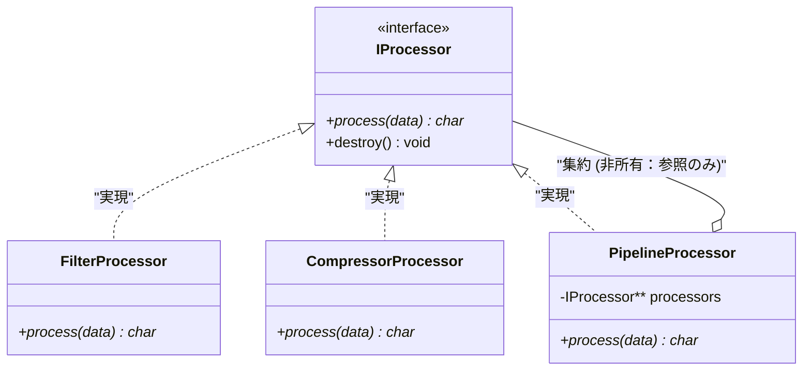
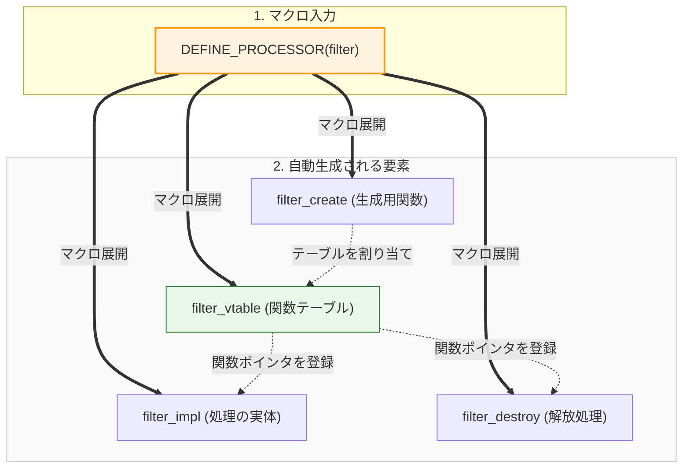

# 第2部 第14章 統合実践（応用）


## 〜実務の「荒波」を設計の力で乗りこなす〜

現場での設計は、教科書通りにはいかないことばかりですよね。一つの問題を解決しようとすると別の原則が顔を出したり、複数の技術を同時に使いこなさなきゃいけなかったりします。

この「応用編」では、私が実際に「うわ、これは手強いな」と感じた、現場でよくある2つの課題に挑みます。一つは **「状況に合わせて処理を自在に入れ替える方法」** 、もう一つは **「どこでも使われる共有リソース（ロガーなど）とどう付き合うか」** です。

一見難しそうに見えますが、第1部で磨いた「道具」と第2部の「原則」を組み合わせれば、必ず道は拓けます。隣で一緒にコードを書き換えるような気持ちで進めていきましょう。

#### 課題の背景と複雑性

本章で扱う2つの課題は、実務で最も頻繁に遭遇する『動的な振る舞いの制御（課題1）』と『グローバルリソースへの依存管理（課題2）』です。これらは単一の原則では解決できず、複数の原則を組み合わせる必要があります。

####  **課題1: 複合処理と動的アルゴリズム切り替え** 

パイプライン処理は、処理の追加や順序変更の要求が頻繁に発生します。処理の追加のたびにパイプライン制御ロジックを修正すると、 **開放閉鎖原則（OCP）違反** により既存の安定したコードを壊すリスクが高まります。
この問題は、 **抽象インターフェース** への依存（ **依存性逆転原則、DIP** ）と **動的な多態性** によって解決します。

####  **課題2: グローバルリソースの依存管理** 

ロギングやメモリプールのような **グローバルリソース** にモジュールが直接依存すると、単体テスト時にリソースの副作用が発生し、 **テスト容易性** を著しく損ないます。 **依存性逆転原則（DIP）** を適用し、テスト可能な抽象リソースを **生成時注入** で強制し、 **疎結合** な構造を実現します。

## 課題1：複合処理と動的アルゴリズム切り替えの設計

この課題は「 **依存** 」と「 **契約** 」と「 **責任** 」の管理が中心であり、特に **OCP (開放閉鎖原則)** 、 **DIP (依存性逆転の原則)** 、 **SRP (単一責任の原則)** をC言語で実現する実践例です。

#### システム概要

データの加工って、よく「バケツリレー」のような形になりますよね。「フィルタをかけてから、圧縮する」といった処理の流れ（パイプライン）を作ってみます。

 **ここでの狙い** : 「やっぱり順番を逆にしたい！」「新しい処理を追加したい！」という急な変更が来ても、 **メインのロジックを1行も書き換えずに済む** ような、懐の深い設計を目指します。  

 **具体例** : データに対して「フィルタ処理」と「圧縮処理」を適用する場合、`Filter` → `Compress` という順序で実行すれば `Compressed(Filtered(Data))` という結果が得られ、逆に `Compress` → `Filter` という順序なら `Filtered(Compressed(Data))` という結果になります。

 **出力の統一** : どちらの設計でも、処理の組み合わせに応じた加工結果を得ます。

#### 設計課題

この要件を満たすためになんの工夫もなく素朴に実装すると、パイプラインを管理・実行する上位の関数が、個別の処理ステップ（フィルタ処理や圧縮処理）の具体的な関数を直接呼び出し、その実行順序をハードコードしてしまう「不器用なパイプライン」になりがちです。

この設計が抱える最も深刻なシステム上の課題は以下の通りです。
*   **「処理の順番を入れ替えてほしい」「暗号化を追加したい」** という要求が来るたびに、すでに安定稼働しテストも済ませているパイプライン制御ロジック自体のコードを修正しなければなりません（OCP違反）。
*   司令塔となるパイプライン関数が個別の下位処理に直接依存しているため、下位の変更の波及を受けやすくなります（DIP違反）。
*   修正のたびに再コンパイルと再テストを強行することになり、バグ混入のリスクが高く、システムの拡張性を著しく損なう状態となっています。

#### 設計の意図

この硬直化したパイプラインの構造を根本から柔軟にするための設計が、 **「インターフェースを通じた動的なアルゴリズムの構成」** です。

各処理ステップが満たすべき共通の「契約（インターフェース抽象）」を定義し、パイプライン制御側は「与えられたインターフェースの配列を順番に実行するだけ」という単純かつ汎用的な責任のみを持たせます（SRP、DIPの適用）。そして、具体的にどの処理をどの順番で実行するかという構成（組み立て）の責任は、パイプライン自身から剥がし、外部の構築フェーズ（メイン関数など）へと委譲します。
これにより、パイプライン本体のソースコードには指一本触れることなく、外部設定だけで処理の順番の入れ替えや新規追加が自在に行えるシステムが実現します。

#### 順序がハードコードされ修正が困難なプロセッサ（適用前）

まずは、原則適用前の密結合なパイプラインの構造図とコードを見てみましょう。
パイプライン処理（P）が、具体的な処理ステップ（S1, S2）とその「処理順番」を完全に知ってしまっている状態です。これでは順序を変えたい場合、司令塔である「P」の中身を直接書き換えるしかありません。


実際のコードを見てみましょう。`pipeline_process_bad` 関数の中に「フィルターの後に圧縮」という順番が直接（ハードコード）書き込まれています。
もし「逆にしたい」と言われたら、元のコードを壊して書き直すか、全く別の関数をもう一つ作るしかありません。これは「拡張に対して閉じており、修正に対してバンバン開いている」という、OCP（開放閉鎖原則）の最悪なアンチパターンです。

#### 順序がハードコードされ修正が困難なプロセッサ

#### pipeline_bad.c (密結合なパイプライン)
```c
#include <stdio.h>
#include <stdlib.h>
#include <string.h>

/* ========================================
 * 具象実装：個別の処理関数
 * ======================================== */
// 具象実装A: フィルタ処理

char* filter_process(const char* input) {
    char buf[256];
    sprintf(buf, "Filtered(%s)", input);
    printf("  [Log] Filter 実行中...\n");

    return strdup(buf);
}
// 具象実装B: 圧縮処理

char* compressor_process(const char* input) {
    char buf[256];
    sprintf(buf, "Compressed(%s)", input);
    printf("  [Log] Compressor 実行中...\n");

    return strdup(buf);
}
/* ========================================
 * 問題のあるパイプライン実装
 * ======================================== */
//  **OCP違反：特定の具象名と「固定された順序」がハードコードされている**

char* pipeline_process_bad(const char* input) {
    // 【問題点】順序を入れ替えるには、この中のコードを書き直すしかない
    char* temp1 = filter_process(input);

    if (!temp1) return NULL;
    char* temp2 = compressor_process(temp1);
    free(temp1);

    return temp2;
}
/* ========================================
 * 順序変更のために別関数を追加せざるを得ない
 * ======================================== */
// もし「順序を逆（Compress -> Filter）」にしたい場合、
// 以下のような別の関数を作るか、既存の関数を壊して書き直す必要が出る

char* pipeline_process_bad_reversed(const char* input) {
    char* temp1 = compressor_process(input); // ここを書き換え

    if (!temp1) return NULL;
    char* temp2 = filter_process(temp1);     // ここを書き換え
    free(temp1);

    return temp2;
}
/* ========================================
 * main関数：2つの順序パターンを実行
 * ======================================== */

int main(void) {
    printf("=== main開始 (原則適用前：密結合) ===\n");
    // パターン1: Filter -> Compressor の実行
    char* res1 = pipeline_process_bad("Data-1");
    printf("最終結果1: %s\n\n", res1);
    free(res1);
    // パターン2: Compressor -> Filter の実行
    // 順序入れ替えのために、別の関数を呼ばざるを得ない
    char* res2 = pipeline_process_bad_reversed("Data-2");
    printf("最終結果2: %s\n", res2);
    free(res2);
    printf("=== main終了 ===\n");

    return 0;
}
```

#### 原則適用前 (Bad) の出力

#### 柔軟性が欠如した固定順序の実行結果

固定された処理順序で実行され、柔軟性がありません。

#### 実行結果
```c
=== main開始 (原則適用前：密結合) ===
  [Log] Filter 実行中...
  [Log] Compressor 実行中...
  最終結果1: Compressed(Filtered(Data-1))
  [Log] Compressor 実行中...
  [Log] Filter 実行中...
  最終結果2: Filtered(Compressed(Data-2))
=== main終了 ===
```

### 問題点の詳細分析

### 1. 終わりのない修正地獄（OCP違反）

最大の罪は、パイプライン関数が「具体的な関数名」を直接呼んでいることです。新しい工程（例えば暗号化）を追加しようとするたび、すでにテストが終わって安定稼働しているはずのパイプライン関数にメスを入れなければなりません。バグが混入するリスクは跳ね上がります。

#### 固定された関数名が引き起こす修正地獄

#### pipeline_process_bad.c (修正地獄の元凶)
```c
char* pipeline_process_bad(const char* input) {
    char* temp1 = filter_process(input);      // ← Filter が先

    if (!temp1) return NULL;
    char* temp2 = compressor_process(temp1);  // ← Compressor が後
    free(temp1);

    return temp2;
}
```

### 2.  **スケーラビリティの欠如：組み合わせ爆発** 

#### 順序変更によって引き起こされる組み合わせ爆発

#### code_snippet_01.c
```c
// 処理が2つの場合: 2パターン
pipeline_process_bad()            // Filter -> Compressor
pipeline_process_bad_reversed()   // Compressor -> Filter
// 処理が3つの場合: 6パターン
pipeline_FEC()  // Filter -> Encrypt -> Compressor
// 処理が4つの場合: 24パターン
// 処理が5つの場合: 120パターン (!)
```

### 3.  **SRP違反：パイプラインが複数の責任を持つ** 

この設計では、パイプライン関数が「処理の順序決定」「メモリ管理」「具象処理の呼び出し」という3つの責任を同時に持っています。

### 4.  **変更の連鎖：既存コードへの影響** 

新しい処理を追加するたびに、既存のパイプライン関数を修正する必要があります。これは影響範囲を広げ、デグレのリスクを高めます。

### 5.  **テスト容易性の欠如** 

パイプライン処理全体をまとめてテストするしかなく、個別の処理ステップや順序の正しさを検証することが困難です。

#### ✅  **原則適用後：抽象への依存による柔軟な設計（OCP/DIP準拠）** 

インターフェースを導入し、 **「何をどの順番で実行するか」をパイプラインの外（main）から注入** できるようにします。

### ステップ1：抽象インターフェース定義

####  **concrete_processors.h**

具象プロセッサの生成関数を宣言するヘッダファイルです。

ステップ1です。まずは「具体的な処理（フィルターや圧縮）」を生成する口だけを定義します。
詳しい構造体の中身や、どんな関数ポインタを持っているかは、呼び出し側には一切見せません。ただ「処理器（IProcessor）をくれ」と頼めば返ってくる、そんなシンプルな契約を宣言します。

#### 具体的な処理プロセッサを作成する抽象契約

#### concrete_processors.h (具象プロセッサ生成の宣言)
```c
#ifndef CONCRETE_PROCESSORS_H
#define CONCRETE_PROCESSORS_H
#include "i_processor.h"
// 具象プロセッサの生成関数宣言
IProcessor* filter_processor_create(void);
IProcessor* compressor_processor_create(void);
#endif // CONCRETE_PROCESSORS_H
```

### ステップ2：具象プロセッサの実装

ここがC言語ならではの工夫のしどころです。
VTable（関数ポインタのテーブル）を使ったオブジェクト指向的な設計は、どうしても「お決まりのコード（ボイラープレート）」が長くなりがちです。そこで **マクロ** を活用し、`filter` や `compressor` といった処理の実体を一気に自動生成します。コピペミスによる事故を防ぎ、新しい処理を追加する手間を激減させる実務的なテクニックです。

#### マクロを活用して大量のボイラープレートを削減した実装

#### concrete_processors.c (マクロによる一括生成)
```c
#include "concrete_processors.h"
#include <stdio.h>
#include <stdlib.h> // malloc, freeのために必要
#include <string.h>

/* ========================================
 * マクロによる具象プロセッサの自動生成
 * ======================================== */
// i_processor.h では VTable の定義が隠蔽されている可能性があるため、
// ここで再定義するか、実装者用ヘッダを用意する。
typedef struct {
    char* (*process)(void* self, const char* input_data);
    void (*destroy)(void* self);
} IProcessorVTable;
// マクロにより、Filter, Compressor の実体（関数・VTable・生成関数）を一括定義
#define DEFINE_PROCESSOR(name, label) \
\
typedef struct { int call_count; } name##_data_t; /* 具象専用の状態を定義 */ \
\
static char* name##_impl(void* self, const char* input) { \
    name##_data_t* data = (name##_data_t*)self; \
    data->call_count++; \
    char buf[256]; \
    sprintf(buf, "%s(%s)", label, input); \
    printf("  [Log] %s 実行中... (呼び出し回数: %d)\n", label, data->call_count); \
\
    return strdup(buf); \
} \
\
static void name##_destroy(void* self) { \
    free(self); /* name##_data_t を解放 */ \
} \
\
static IProcessorVTable name##_vtable = { name##_impl, name##_destroy }; \
\
IProcessor* name##_processor_create(void) { \
    /* 不完全型のサイズは不明なため、専用の確保関数を使用 */ \
    IProcessor* p = processor_alloc(); \
    name##_data_t* d = malloc(sizeof(name##_data_t)); \
\
    if (!p || !d) { free(p); free(d); return NULL; } \
    d->call_count = 0; \
    /* 不完全型へのメンバアクセスも本来不可だが、ここでは内部構造を知っている前提(またはsetter使用) */ \
    /* ※厳密には setter 関数を用意すべきですが、ここではポインタキャスト等で代用する想定 */ \
    /* あるいは i_processor.c と同じ定義を共有する内部ヘッダを使用する */ \
    ((struct { IProcessorVTable* v; void* s; }*)p)->v = &name##_vtable; \
    ((struct { IProcessorVTable* v; void* s; }*)p)->s = d; \
\
    return p; \
}
// 具象プロセッサの実装を展開
DEFINE_PROCESSOR(filter, "Filtered")
DEFINE_PROCESSOR(compressor, "Compressed")
```

### ステップ3：複合処理 (PipelineProcessor) の実装

#### クラス図：コンポジション構造

Compositeパターンを適用し、単体のプロセッサ（Filter, Compressor）と、それらを束ねるプロセッサ（Pipeline）を同一視できるクラス構造です。

**再帰的構造**: `PipelineProcessor` が `IProcessor` を実装しつつ、内部に `IProcessor` のリストを持っています。
これにより、パイプラインの中にパイプラインを入れることも可能になります。矢印（<|..）: インターフェースの実装（Realization）。
菱形付き矢印（o--）: 集約（Aggregation）。PipelineがProcessorを持っていますが、ライフサイクルは管理しない（参照のみ）ことを示唆しています。



✅  **OCP準拠** : 順序がどう変わろうと、このコードを修正する必要は一切ありません。

####  **i_processor.h（カプセル化された抽象契約）**

ここで、すべての部品の「親玉」となる抽象契約を見ておきましょう。不完全型を使って構造体の中身を隠し（カプセル化）、安全な操作APIだけを外の世界に提供しています。

#### 不完全型で実装の詳細を隠蔽した最高レベルの抽象契約

#### i_processor.h (抽象契約)
```c
#ifndef I_PROCESSOR_H
#define I_PROCESSOR_H
#include <stdlib.h>

typedef struct IProcessor IProcessor;
/* 抽象API：VTableを隠蔽し、不透明ポインタとして扱う */
/* 生成用ヘルパー関数：不完全型のサイズを知っているモジュールが確保を行う */
IProcessor* processor_alloc(void);
char* processor_execute(IProcessor* p, const char* input_data);
void processor_destroy(IProcessor* p);
#endif
```

先ほどのヘッダに対する実装部分です。VTable（関数ポインタ）を経由して、どの部品であれ「実行」と「破棄」を安全に行えるようにラップしています。

#### 安全な実行と破棄を保証する抽象APIの実働部

#### i_processor.c (抽象APIの実装)
```c
#include "i_processor.h"
// 内部構造体の定義
typedef struct {
    char* (*process)(void* self, const char* input_data);
    void (*destroy)(void* self);
} IProcessorVTable;
struct IProcessor {
    IProcessorVTable* vtable;
    void* self;
};

char* processor_execute(IProcessor* p, const char* input_data) {
    if (p && p->vtable && p->vtable->process) {
        return p->vtable->process(p->self, input_data);
    }

    return NULL;
}

IProcessor* processor_alloc(void) {
    IProcessor* p = malloc(sizeof(IProcessor));
    if (p) {
        p->vtable = NULL;
        p->self = NULL;
    }
    return p;
}

void processor_destroy(IProcessor* p) {
    if (p) {
        if (p->vtable && p->vtable->destroy) {
            p->vtable->destroy(p->self);
        }
        free(p);
    }
}
```

いよいよ本丸です。「複数のプロセッサをまとめたもの（パイプライン）」自体も、また一つの `IProcessor` として振る舞うようにします。これが **Composite（複合体）パターン** です。

#### 複数のプロセッサを一つに束ねる複合処理の契約

#### pipeline_processor.h (Compositeのヘッダ)
```c
#ifndef PIPELINE_PROCESSOR_H
#define PIPELINE_PROCESSOR_H
#include "i_processor.h"
// 複数のプロセッサを束ねて一つのプロセッサとして振る舞う（Compositeパターン）
// ※注意: 渡された processors 配列内のインスタンスの所有権は移動しません（参照のみ）
IProcessor* pipeline_processor_create(IProcessor** processors, size_t count);
#endif // PIPELINE_PROCESSOR_H
```

パイプライン処理の実体です。もらった `IProcessor` の配列を順番に実行（数珠つなぎ）していくだけのシンプルなロジックです。
パイプライン自体を「ただの1つのプロセッサ」として扱えるため、巨大なパイプラインの中に小さなパイプラインを組み込む、といった魔法のような拡張さえ可能になります。

#### 与えられた処理を順に実行する複合体の実装

#### pipeline_processor.c (Compositeの実装)
```c
#include "pipeline_processor.h"
#include <string.h>
#include <stdlib.h> // malloc, freeのために必要
typedef struct {
    IProcessor** processors;
    size_t count;
} PipelineProcessorImpl;
/* 内部関数：具象VTableとの橋渡しを隠蔽 */

static char* pipeline_process_impl(void* self, const char* input_data) {
    PipelineProcessorImpl* p = (PipelineProcessorImpl*)self;
    // 最初のデータコピー
    char* current_data = NULL;
    // input_dataがNULLでないことを確認してからstrdup
    if (input_data) {
        current_data = strdup(input_data);
    } else {
        return NULL;
    }

    if (!current_data) return NULL;

    for (size_t i = 0; i < p->count; i++) {
        // 第13章の規約に従い、直接VTableを叩かず抽象APIを使用
        char* next_data = processor_execute(p->processors[i], current_data);
        free(current_data); // 古いデータを解放
        current_data = next_data;
        // エラー発生時は中断
        if (!current_data) {
            // current_dataは既にNULLなのでfree不要だが、
            // ループを抜けてNULLを返すことでエラーを伝播

            return NULL;
        }
    }

    return current_data;
}
```

#### 自身の破棄と実体のバインドを行う複合体の生成

#### pipeline_processor.c (続き)
```c
static void pipeline_destroy_impl(void* self) {
    if (self) {
        PipelineProcessorImpl* impl = (PipelineProcessorImpl*)self;
        // 注意：内部の各Processorの所有権はComposite（Pipeline）が持たない設計とする
        // そのため、各要素の destroy は呼び出さず、配列自体のメモリのみ解放する
        free(impl->processors);
        free(impl);
    }
}
/* 具象VTableの定義 */
static IProcessorVTable pipeline_vtable = {
    pipeline_process_impl,
    pipeline_destroy_impl
};

IProcessor* pipeline_processor_create(IProcessor** processors, size_t count) {
    if (!processors || count == 0) return NULL;
    PipelineProcessorImpl* impl = malloc(sizeof(PipelineProcessorImpl));

    if (!impl) return NULL;
    impl->processors = malloc(sizeof(IProcessor*) * count);

    if (!impl->processors) { free(impl); return NULL; }
    // ポインタ配列のコピー（浅いコピー：参照のみ保持）
    // ※内部のIProcessorインスタンスの所有権は移動しない
    memcpy(impl->processors, processors, sizeof(IProcessor*) * count);
    impl->count = count;
    // 抽象型としてのインスタンス生成（不透明ポインタの実現）
    IProcessor* p = processor_alloc();

    if (!p) { free(impl->processors); free(impl); return NULL; }
    // VTableと実体をバインド (内部構造を知っている前提のキャスト)
    ((struct { IProcessorVTable* v; void* s; }*)p)->v = &pipeline_vtable;
    ((struct { IProcessorVTable* v; void* s; }*)p)->s = impl;

    return p;
}
```

### ステップ4：動作確認（順序の入れ替え）

####  **main.c**

### ステップ4：動作確認（順序の入れ替え）

####  **main.c**

> [!NOTE] 読者の疑問：結局誰かが具象（本物）を知らなきゃいけないのでは？
> 「『具象に依存するな、抽象（インターフェース）に依存せよ』と散々言われましたが、実際にプログラムを動かすには、最初の一回は必ず `filter_processor_create()` のような具象を生成して結線する必要がありますよね？ これって原則違反ではないんですか？」
>
> 鋭い指摘です。まさにその通りで、システムを動かすためには必ずどこかで「具象」を生成し、組み合わせる（結線する）必要があります。この「システム全体の依存関係を解決し、部品を組み立てる特別な場所」のことを **Composition Root（コンポジション・ルート）** と呼びます。
> C言語において、この特権的な役割を担うのが **`main`関数（または初期化専用の最上位モジュール）** です。`main`関数だけは、全ての具象モジュールを知っていて構いません（むしろ知らなければ結線できません）。「ビジネスロジック関数は抽象にのみ依存し、`main`関数が一生懸命すべての具象を生成してロジックに注入する（渡す）」という役割分担こそが、安全でテスト可能なアーキテクチャの最終形態です。

最後に、コンポジションルート（`main`関数）での組み立てです。
処理の順番を変えたいなら、配列に入れる順番をひっくり返すだけ。新しい部品を足したいなら、配列に新しい部品を入れるだけ。ビジネスロジックの中身はもう、誰にも触らせる必要はありません。

#### 処理の順序と構成を自由に組み立てるコンポジションルート

#### main.c (柔軟な組み立て)
```c
#include <stdio.h>
#include <stdlib.h>
#include <string.h>
#include "concrete_processors.h"
#include "pipeline_processor.h"
// 実行ヘルパー関数

void run_pipeline(const char* name, IProcessor* pipe, const char* data) {
    if (!pipe) return;
    char* res = processor_execute(pipe, data);
    printf("%s 結果: %s\n\n", name, res ? res : "エラー");
    free(res);
}

int main(void) {
    printf("=== main開始 (原則適用後：柔軟な結合) ===\n");
    // 1. 部品の生成（これらは再利用される）
    IProcessor* f = filter_processor_create();
    IProcessor* c = compressor_processor_create();

    if (!f || !c) {
        printf("プロセッサの生成に失敗しました\n");
        processor_destroy(f);
        processor_destroy(c);

        return 1;
    }
    /* ========================================
     * パターン1: Filter -> Compressor
     * ======================================== */
    IProcessor* procs_1[] = { f, c };
    IProcessor* pipe_1 = pipeline_processor_create(procs_1, 2);
    run_pipeline("パイプライン1", pipe_1, "Data-1");
    // パイプラインのみ破棄（中の部品は破棄しない）
    processor_destroy(pipe_1);
    /* ========================================
     * ここがポイント：制御ロジックを修正せず、
     * 配列の渡し方を変えるだけで順序変更完了
     * ======================================== */
    // パターン2: Compressor -> Filter
    IProcessor* procs_2[] = { c, f };
    IProcessor* pipe_2 = pipeline_processor_create(procs_2, 2);
    run_pipeline("パイプライン2", pipe_2, "Data-2");
    processor_destroy(pipe_2);
    // 最後に部品自体を解放（所有権はmainにあるため）
    processor_destroy(f);
    processor_destroy(c);
    printf("=== main終了 ===\n");

    return 0;
}
```

#### 実行結果と設計の比較

#### 原則適用後 (Good) の出力

配列に入れた順番通りに処理が実行されています。もう関数を作り直す必要も、中身を書き換える必要もありません。

#### 柔軟に順序が組み替えられた実行結果

#### 実行結果
```c
=== main開始 (原則適用後：柔軟な結合) ===
  [Log] Filtered 実行中...
  [Log] Compressed 実行中...
  最終結果1: Compressed(Filtered(Data-1))
  [Log] Compressed 実行中...
  [Log] Filtered 実行中...
  最終結果2: Filtered(Compressed(Data-2))
=== main終了 ===
```

#### C言語の隠れた武器：マクロで「面倒くさい」を自動化する

#### なぜマクロを使うと楽になれるのか

「VTableって、似たようなコードを何度も書かなきゃいけなくて面倒だな……」と思ったことはありませんか？実は私もそう感じていました。

そこで、C言語の **マクロ** の出番です。手書きだと、コピペミスで「圧縮処理なのに中身はフィルタ処理のままだった！」なんて悲劇が起きがちですが、マクロにお任せすればそんな心配もありません。

#### ❌ マクロを使わない場合の冗長性

VTableパターンでは、新しい具象実装を追加するたびに、以下の要素をすべて手作業で記述する必要があります。

そもそも、なぜマクロを使う必要があるのか。使わなかった場合の「残念な姿」を見てみてください。
同じ構造の「構造体定義」「VTable定義」「ファクトリ関数」が、部品の数だけ永遠にコピペされていきます。ちょっとでも修正が入ったら、すべてを手作業で直さなければならない悪夢のような保守性の低さです。

#### 全てを手作業で記述した場合の冗長で脆いコード

#### NoMacro_Example.c (マクロなしの冗長なコード)
```c
// Filter の実装

typedef struct { int call_count; } filter_data_t;

static char* filter_impl(void* self, const char* input) {
    filter_data_t* data = (filter_data_t*)self;
    data->call_count++;
    char buf[256];
    sprintf(buf, "Filtered(%s)", input);
    printf("  [Log] Filtered 実行中... (呼び出し回数: %d)\n", data->call_count);

    return strdup(buf);
}

static void filter_destroy(void* self) {
    free(self);
}
static IProcessorVTable filter_vtable = {
    filter_impl,
    filter_destroy
};

IProcessor* filter_processor_create(void) {
    IProcessor* p = processor_alloc();
    filter_data_t* d = malloc(sizeof(filter_data_t));

    if (!p || !d) { free(p); free(d); return NULL; }
    d->call_count = 0;

    ((struct { IProcessorVTable* v; void* s; }*)p)->v = &filter_vtable;
    ((struct { IProcessorVTable* v; void* s; }*)p)->s = d;

    return p;
}
```

#### コード例
```c
// Compressor の実装（ほぼ同じ構造を再度記述）

typedef struct { int call_count; } compressor_data_t;

static char* compressor_impl(void* self, const char* input) {
    compressor_data_t* data = (compressor_data_t*)self;
    data->call_count++;
    char buf[256];
    sprintf(buf, "Compressed(%s)", input);
    printf("  [Log] Compressed 実行中... (呼び出し回数: %d)\n", data->call_count);

    return strdup(buf);
}

static void compressor_destroy(void* self) {
    free(self);
}
static IProcessorVTable compressor_vtable = {
    compressor_impl,
    compressor_destroy
};

IProcessor* compressor_processor_create(void) {
    IProcessor* p = processor_alloc();
    compressor_data_t* d = malloc(sizeof(compressor_data_t));

    if (!p || !d) { free(p); free(d); return NULL; }
    d->call_count = 0;

    ((struct { IProcessorVTable* v; void* s; }*)p)->v = &compressor_vtable;
    ((struct { IProcessorVTable* v; void* s; }*)p)->s = d;

    return p;
}
```
一方、マクロを使えばこの通りです。
たった1行で、安全で一貫性のあるお決まりのコードがポンポンと生成されます。人間は「ロジックの中身」と「ラベル」だけを指定すればよいのです。

#### マクロを利用した極めて簡潔で安全なプロセッサの生成

#### Macro_Usage.c (マクロの利用)
```c
DEFINE_PROCESSOR(filter, "Filtered")
DEFINE_PROCESSOR(compressor, "Compressed")
```

#### マクロの展開内容

`DEFINE_PROCESSOR(filter, "Filtered")`は、以下のように展開されます。

魔法のように見えますが、仕組みは単純です。マクロはコンパイル前に、以下の図のように完全なC言語の部品へと「展開（テキスト置換）」されているだけです。
この手法により、すべての部品の命名規則や確保の方法が1ミリの狂いもなく統一されます。



マクロが「展開」されたあとの姿は、私たちが普段書いているC言語のコードそのものです。エラーや警告が出た場合は、この「展開後の姿」を頭に思い浮かべるのがデバッグのコツです。

#### 人間が書くべきだったC言語のコードそのもの

#### Expanded_Macro.c (展開された実際の姿)
```c
// 1. 実装関数

static char* filter_impl(void* self, const char* input) {
    filter_data_t* data = (filter_data_t*)self;
    data->call_count++;
    char buf[256];
    sprintf(buf, "Filtered(%s)", input);  // ← "Filtered" が挿入される
    printf("  [Log] Filtered 実行中... (呼び出し回数: %d)\n", data->call_count);

    return strdup(buf);
}
// 2. デストラクタ

static void filter_destroy(void* self) {
    free(self);
}
// 3. VTable構造体
static IProcessorVTable filter_vtable = {
    filter_impl,
    filter_destroy
};
// 4. ファクトリ関数

IProcessor* filter_processor_create(void) {
    // 不完全型のため、専用関数で確保
    IProcessor* p = processor_alloc();
    filter_data_t* d = malloc(sizeof(filter_data_t));

    if (!p || !d) { free(p); free(d); return NULL; }
    d->call_count = 0;

    // メンバ設定（内部構造を知っている前提でキャスト）
    ((struct { IProcessorVTable* v; void* s; }*)p)->v = &filter_vtable;
    ((struct { IProcessorVTable* v; void* s; }*)p)->s = d;

    return p;
}
```

#### マクロの仕組み：トークン結合（`##`演算子）

 **コード生成の鍵:** プリプロセッサのトークン結合演算子を利用して、一意の識別子を動的に生成する方法を見てみます。

トークン結合による自動生成の仕組みです：
**`name##_impl`** : `name` と `_impl` を結合 → `filter` を渡すと `filter_impl` になる

このトークン結合により、マクロの引数（`filter`や`compressor`）に応じて、異なる関数名や変数名が自動生成されます。
#### トークン結合を用いた動的な識別子生成

#### Macro_Expansion.c
```c
#define DEFINE_PROCESSOR(name, label) \
\
typedef struct { int call_count; } name##_data_t; /* 具象専用の状態を定義 */ \
\
static char* name##_impl(void* self, const char* input) { \
    name##_data_t* data = (name##_data_t*)self; \
    data->call_count++; \
    char buf[256]; \
    sprintf(buf, "%s(%s)", label, input); \
    printf("  [Log] %s 実行中... (呼び出し回数: %d)\n", label, data->call_count); \
\
    return strdup(buf); \
} \
\
static void name##_destroy(void* self) { \
    free(self); /* name##_data_t を解放 */ \
} \
\
static IProcessorVTable name##_vtable = { name##_impl, name##_destroy }; \
\
IProcessor* name##_processor_create(void) { \
    IProcessor* p = malloc(sizeof(IProcessor)); \
    name##_data_t* d = malloc(sizeof(name##_data_t)); \
\
    if (!p || !d) { free(p); free(d); return NULL; } \
    d->call_count = 0; \
    p->vtable = &name##_vtable; \
    p->self = d; \
\
    return p; \
}
```
