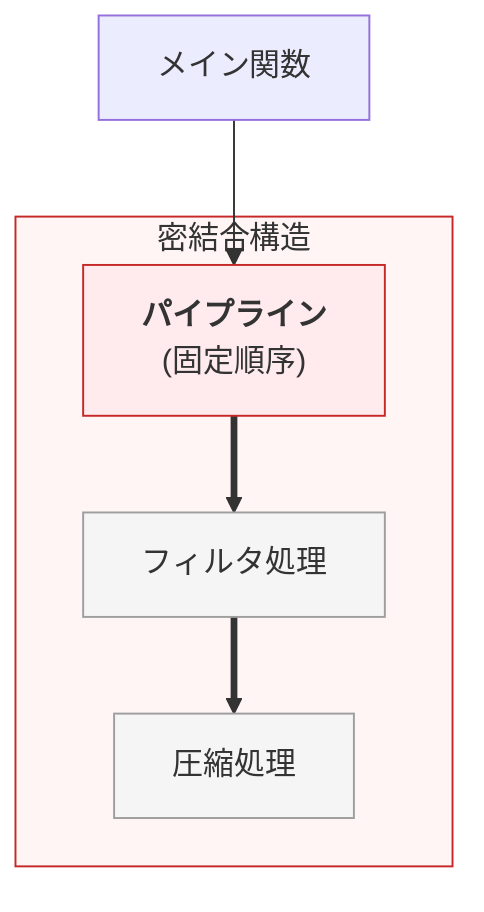
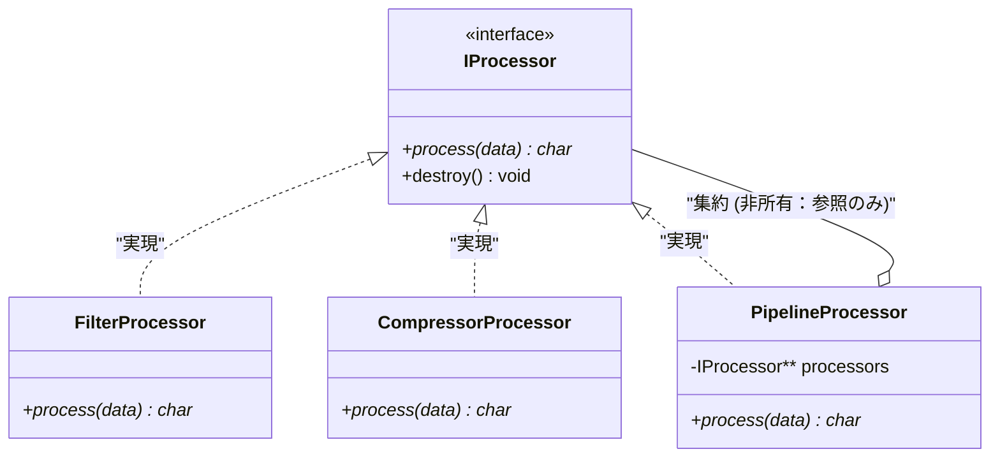
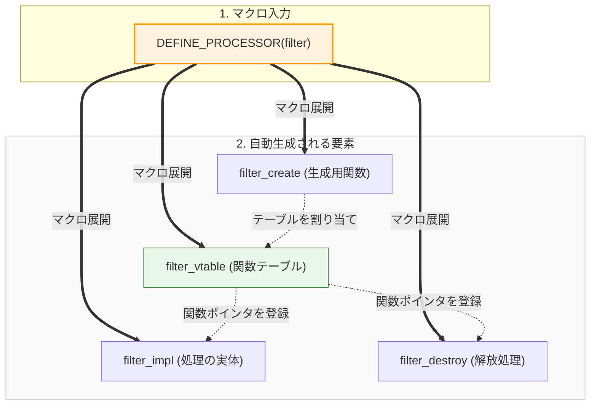

# 第2部 第14章 統合実践（応用）


## 〜実務の「荒波」を設計の力で乗りこなす〜

現場での設計は、教科書通りにはいかないことばかりですよね。一つの問題を解決しようとすると別の原則が顔を出したり、複数の技術を同時に使いこなさなきゃいけなかったりします。

この「応用編」では、私が実際に「うわ、これは手強いな」と感じた、現場でよくある2つの課題に挑みます。一つは **「状況に合わせて処理を自在に入れ替える方法」** 、もう一つは **「どこでも使われる共有リソース（ロガーなど）とどう付き合うか」** です。

一見難しそうに見えますが、第1部で磨いた「道具」と第2部の「原則」を組み合わせれば、必ず道は拓けます。隣で一緒にコードを書き換えるような気持ちで進めていきましょう。

#### 課題の背景と複雑性

本章で扱う2つの課題は、実務で最も頻繁に遭遇する『動的な振る舞いの制御（課題1）』と『グローバルリソースへの依存管理（課題2）』です。これらは単一の原則では解決できず、複数の原則を組み合わせる必要があります。

####  **課題1: 複合処理と動的アルゴリズム切り替え** 

パイプライン処理は、処理の追加や順序変更の要求が頻繁に発生します。処理の追加のたびにパイプライン制御ロジックを修正すると、 **開放閉鎖原則（OCP）違反** により既存の安定したコードを壊すリスクが高まります。

この問題は、 **抽象インターフェース** への依存（ **依存性逆転原則、DIP** ）と **動的な多態性** によって解決します。

####  **課題2: グローバルリソースの依存管理** 

ロギングやメモリプールのような **グローバルリソース** にモジュールが直接依存すると、単体テスト時にリソースの副作用が発生し、 **テスト容易性** を著しく損ないます。 **依存性逆転原則（DIP）** を適用し、テスト可能な抽象リソースを **生成時注入** で強制し、 **疎結合** な構造を実現します。

## 課題1：複合処理と動的アルゴリズム切り替えの設計

この課題は「 **依存** 」と「 **契約** 」と「 **責任** 」の管理が中心であり、特に **OCP (開放閉鎖原則)** 、 **DIP (依存性逆転の原則)** 、 **SRP (単一責任の原則)** をC言語で実現する実践例です。
#### やりたいこと

データの加工って、よく「バケツリレー」のような形になりますよね。「フィルタをかけてから、圧縮する」といった処理の流れ（パイプライン）を作ってみます。

 **ここでの狙い** : 「やっぱり順番を逆にしたい！」「新しい処理を追加したい！」という急な変更が来ても、 **メインのロジックを1行も書き換えずに済む** ような、懐の深い設計を目指します。  

 **具体例** : データに対して「フィルタ処理」と「圧縮処理」を適用する場合、`Filter` → `Compress` という順序で実行すれば `Compressed(Filtered(Data))` という結果が得られ、逆に `Compress` → `Filter` という順序なら `Filtered(Compressed(Data))` という結果になります。

 **出力の統一** : どちらの設計でも、処理の組み合わせに応じた加工結果を得ます。

## ❌ 原則適用前：ガチガチに固まった「不器用な」パイプライン

まずは、密結合な状態のコードを見てみましょう。この設計では、パイプラインを管理する関数が、個別の処理ステップの詳細を知りすぎています。

この設計の何が「保守を困難にするのか」、実務の視点から紐解いてみます。 
具体的課題：
-  **「処理の順番を入れ替えてほしい」** という要求が来るたびに、すでに安定稼働し、テストも済ませたパイプライン自体のコードを修正しなければなりません。
-  **修正のたびに再コンパイルと再テストを強行することになり** 、バグ混入のリスクが高く、精神衛生上もあまり好ましくありません。

#### 密結合なパイプライン構造

パイプライン処理（P）が、具体的な処理ステップ（S1, S2）とその順序に強く依存している状態です。
 **固定順序** : 矢印が固定されているため、順序を変えるには「P」の中身を書き換えるしかありません。



#### pipeline_bad.c

密結合なパイプライン処理の実装です。処理の順序が `pipeline_process_bad` 関数内にハードコードされています。

（悪い例）各工程（関数）が直接結合しており、パイプラインの流れを変えるには関数自体の書き換えが必要です。これは「拡張に対して閉じており、修正に対して開いている」という、OCPのアンチパターンそのものです。

逆の順序で処理したい場合は、別の関数を定義せざるを得ず、コードの重複と保守性の低下を招いています。

```c
#include <stdio.h>
#include <stdlib.h>
#include <string.h>

/* ========================================
 * 具象実装：個別の処理関数
 * ======================================== */
// 具象実装A: フィルタ処理

char* filter_process(const char* input) {
    char buf[256];
    sprintf(buf, "Filtered(%s)", input);
    printf("  [Log] Filter 実行中...\n");

    return strdup(buf);
}
// 具象実装B: 圧縮処理

char* compressor_process(const char* input) {
    char buf[256];
    sprintf(buf, "Compressed(%s)", input);
    printf("  [Log] Compressor 実行中...\n");

    return strdup(buf);
}
/* ========================================
 * 問題のあるパイプライン実装
 * ======================================== */
//  **OCP違反：特定の具象名と「固定された順序」がハードコードされている**

char* pipeline_process_bad(const char* input) {
    // 【問題点】順序を入れ替えるには、この中のコードを書き直すしかない
    char* temp1 = filter_process(input);

    if (!temp1) return NULL;
    char* temp2 = compressor_process(temp1);
    free(temp1);

    return temp2;
}
/* ========================================
 * 順序変更のために別関数を追加せざるを得ない
 * ======================================== */
// もし「順序を逆（Compress -> Filter）」にしたい場合、
// 以下のような別の関数を作るか、既存の関数を壊して書き直す必要が出る

char* pipeline_process_bad_reversed(const char* input) {
    char* temp1 = compressor_process(input); // ここを書き換え

    if (!temp1) return NULL;
    char* temp2 = filter_process(temp1);     // ここを書き換え
    free(temp1);

    return temp2;
}
/* ========================================
 * main関数：2つの順序パターンを実行
 * ======================================== */

int main(void) {
    printf("=== main開始 (原則適用前：密結合) ===\n");
    // パターン1: Filter -> Compressor の実行
    char* res1 = pipeline_process_bad("Data-1");
    printf("最終結果1: %s\n\n", res1);
    free(res1);
    // パターン2: Compressor -> Filter の実行
    // 順序入れ替えのために、別の関数を呼ばざるを得ない
    char* res2 = pipeline_process_bad_reversed("Data-2");
    printf("最終結果2: %s\n", res2);
    free(res2);
    printf("=== main終了 ===\n");

    return 0;
}
```

#### 原則適用前 (Bad) の出力

#### 実行結果

固定された処理順序で実行され、柔軟性がありません。

#### 実行結果
```c
=== main開始 (原則適用前：密結合) ===
  [Log] Filter 実行中...
  [Log] Compressor 実行中...
最終結果1: Compressed(Filtered(Data-1))
  [Log] Compressor 実行中...
  [Log] Filter 実行中...
最終結果2: Filtered(Compressed(Data-2))
=== main終了 ===
```

### 問題点の詳細分析

### 1.  **OCP違反：変更のたびにコードの修正が必要** 

#### pipeline_process_bad.c

`pipeline_process_bad` 関数は、処理の順序が関数内部にハードコードされています。（悪い例）`filter_process` と `compressor_process` という具体的な関数名に依存しているため、新しい工程（例：暗号化）を追加しようとすると、この関数を修正せざるを得ません。

順序を変更したい場合、既存のテスト済みコードに手を入れることになり、バグ混入のリスクが高まります（OCP違反）。

#### pipeline_process_bad.c
```c
char* pipeline_process_bad(const char* input) {
    char* temp1 = filter_process(input);      // ← Filter が先

    if (!temp1) return NULL;
    char* temp2 = compressor_process(temp1);  // ← Compressor が後
    free(temp1);

    return temp2;
}
```

### 2.  **スケーラビリティの欠如：組み合わせ爆発** 

#### code_snippet_01.c
```c
// 処理が2つの場合: 2パターン
pipeline_process_bad()            // Filter -> Compressor
pipeline_process_bad_reversed()   // Compressor -> Filter
// 処理が3つの場合: 6パターン
pipeline_FEC()  // Filter -> Encrypt -> Compressor
// 処理が4つの場合: 24パターン
// 処理が5つの場合: 120パターン (!)
```

### 3.  **SRP違反：パイプラインが複数の責任を持つ** 

この設計では、パイプライン関数が「処理の順序決定」「メモリ管理」「具象処理の呼び出し」という3つの責任を同時に持っています。

### 4.  **変更の連鎖：既存コードへの影響** 

新しい処理を追加するたびに、既存のパイプライン関数を修正する必要があります。これは影響範囲を広げ、デグレのリスクを高めます。

### 5.  **テスト容易性の欠如** 

パイプライン処理全体をまとめてテストするしかなく、個別の処理ステップや順序の正しさを検証することが困難です。

## ✅  **原則適用後：抽象への依存による柔軟な設計（OCP/DIP準拠）** 

インターフェースを導入し、 **「何をどの順番で実行するか」をパイプラインの外（main）から注入** できるようにします。

### ステップ1：抽象インターフェース定義

####  **concrete_processors.h**

具象プロセッサの生成関数を宣言するヘッダファイルです。

#### concrete_processors.h

処理の抽象インターフェースを定義します。VTableパターンを使用し、処理の実行と破棄という2つの操作を契約として定めています。

`IProcessorVTable`を定義し、関数の実体ではなくシグネチャ（契約）のみを規定しています。これにより、利用者側は具体的な実装構造体の中身を知ることなく、抽象的なインターフェースを通じて操作が可能になります（Dependency Inversion Principle）。

インターフェースと実装が分離され、高い保守性が確保されています。

#### concrete_processors.h
```c
#ifndef CONCRETE_PROCESSORS_H
#define CONCRETE_PROCESSORS_H
#include "i_processor.h"
// 具象プロセッサの生成関数宣言
IProcessor* filter_processor_create(void);
IProcessor* compressor_processor_create(void);
#endif // CONCRETE_PROCESSORS_H
```

### ステップ2：具象プロセッサの実装

#### concrete_processors.c

具象プロセッサの実装ファイルです。マクロ `DEFINE_PROCESSOR` を活用し、`filter` や `compressor` といった異なる処理の実装を共通パターンで自動生成しています。

マクロを用いることで、ボイラープレートコード（構造体定義、メモリ確保、VTable設定など）を隠蔽・自動化しています。これにより、新しいプロセッサを追加する際の実装ミスを防ぎます（DRY原則）。

新しいプロセッサを追加するコストが下がり、一貫性が保たれます。

#### concrete_processors.c
```c
#include "concrete_processors.h"
#include <stdio.h>
#include <stdlib.h> // malloc, freeのために必要
#include <string.h>

/* ========================================
 * マクロによる具象プロセッサの自動生成
 * ======================================== */
// i_processor.h では VTable の定義が隠蔽されている可能性があるため、
// ここで再定義するか、実装者用ヘッダを用意する。
typedef struct {
    char* (*process)(void* self, const char* input_data);
    void (*destroy)(void* self);
} IProcessorVTable;
// マクロにより、Filter, Compressor の実体（関数・VTable・生成関数）を一括定義
#define DEFINE_PROCESSOR(name, label) \
\
typedef struct { int dummy; } name##_data_t; /* 具象専用の型を定義 */ \
\
static char* name##_impl(void* self, const char* input) { \
    (void)self; /* 警告抑制 */ \
    char buf[256]; \
    sprintf(buf, "%s(%s)", label, input); \
    printf("  [Log] %s 実行中...\n", label); \
\
    return strdup(buf); \
} \
\
static void name##_destroy(void* self) { \
    free(self); /* name##_data_t を解放 */ \
} \
\
static IProcessorVTable name##_vtable = { name##_impl, name##_destroy }; \
\
IProcessor* name##_processor_create(void) { \
    /* 不完全型のサイズは不明なため、専用の確保関数を使用 */ \
    IProcessor* p = processor_alloc(); \
    name##_data_t* d = malloc(sizeof(name##_data_t)); \
\
    if (!p || !d) { free(p); free(d); return NULL; } \
    /* 不完全型へのメンバアクセスも本来不可だが、ここでは内部構造を知っている前提(またはsetter使用) */ \
    /* ※厳密には setter 関数を用意すべきですが、ここではポインタキャスト等で代用する想定 */ \
    /* あるいは i_processor.c と同じ定義を共有する内部ヘッダを使用する */ \
    ((struct { IProcessorVTable* v; void* s; }*)p)->v = &name##_vtable; \
    ((struct { IProcessorVTable* v; void* s; }*)p)->s = d; \
\
    return p; \
}
// 具象プロセッサの実装を展開
DEFINE_PROCESSOR(filter, "Filtered")
DEFINE_PROCESSOR(compressor, "Compressed")
```

### ステップ3：複合処理 (PipelineProcessor) の実装

#### クラス図：コンポジション構造

Compositeパターンを適用し、単体のプロセッサ（Filter, Compressor）と、それらを束ねるプロセッサ（Pipeline）を同一視できるクラス構造です。 

**再帰的構造**: `PipelineProcessor` が `IProcessor` を実装しつつ、内部に `IProcessor` のリストを持っています。

これにより、パイプラインの中にパイプラインを入れることも可能になります。矢印（<|..）: インターフェースの実装（Realization）。

菱形付き矢印（o--）: 集約（Aggregation）。PipelineがProcessorを持っていますが、ライフサイクルは管理しない（参照のみ）ことを示唆しています。



✅  **OCP準拠** : 順序がどう変わろうと、このコードを修正する必要は一切ありません。

####  **i_processor.h（カプセル化された抽象契約）**

（再掲）`i_processor` はすべてのプロセッサの基底となる抽象型です。ここでは不完全型として宣言し、外部には操作関数のみを公開します。

#### i_processor.h
```c
#ifndef I_PROCESSOR_H
#define I_PROCESSOR_H
#include <stdlib.h>

typedef struct IProcessor IProcessor;
/* 抽象API：VTableを隠蔽し、不透明ポインタとして扱う */
/* 生成用ヘルパー関数：不完全型のサイズを知っているモジュールが確保を行う */
IProcessor* processor_alloc(void);
char* processor_execute(IProcessor* p, const char* input_data);
void processor_destroy(IProcessor* p);
#endif
```

####  **i_processor.c（抽象APIの実装）**

抽象APIの実装です。VTableを経由して具象実装を呼び出すことで、多態性を実現します。

#### i_processor.c
```c
#include "i_processor.h"
// 内部構造体の定義
typedef struct {
    char* (*process)(void* self, const char* input_data);
    void (*destroy)(void* self);
} IProcessorVTable;
struct IProcessor {
    IProcessorVTable* vtable;
    void* self;
};

char* processor_execute(IProcessor* p, const char* input_data) {
    if (p && p->vtable && p->vtable->process) {
        return p->vtable->process(p->self, input_data);
    }

    return NULL;
}

IProcessor* processor_alloc(void) {
    IProcessor* p = malloc(sizeof(IProcessor));
    if (p) {
        p->vtable = NULL;
        p->self = NULL;
    }
    return p;
}

void processor_destroy(IProcessor* p) {
    if (p) {
        if (p->vtable && p->vtable->destroy) {
            p->vtable->destroy(p->self);
        }
        free(p);
    }
}
```

####  **pipeline_processor.h（パイプラインの公開ヘッダ）** 

複数のプロセッサを束ねる `PipelineProcessor` の生成関数です。Compositeパターンにより、単一の `IProcessor` として扱えるようにします。

#### pipeline_processor.h
```c
#ifndef PIPELINE_PROCESSOR_H
#define PIPELINE_PROCESSOR_H
#include "i_processor.h"
// 複数のプロセッサを束ねて一つのプロセッサとして振る舞う（Compositeパターン）
// ※注意: 渡された processors 配列内のインスタンスの所有権は移動しません（参照のみ）
IProcessor* pipeline_processor_create(IProcessor** processors, size_t count);
#endif // PIPELINE_PROCESSOR_H
```

#### pipeline_processor.c

パイプライン処理の実体です。注入された `IProcessor` の配列を順次実行します。

パイプライン全体もまた一つのプロセッサ（IProcessor）として振る舞うため、パイプラインの中にさらにパイプラインを組み込むといった再帰的な構造が可能になります（Compositeパターン）。 **複雑な処理フローも単純な部品の組み合わせで表現でき、柔軟性が高い設計です。** 

#### pipeline_processor.c
```c
#include "pipeline_processor.h"
#include <string.h>
#include <stdlib.h> // malloc, freeのために必要
typedef struct {
    IProcessor** processors;
    size_t count;
} PipelineProcessorImpl;
/* 内部関数：具象VTableとの橋渡しを隠蔽 */

static char* pipeline_process_impl(void* self, const char* input_data) {
    PipelineProcessorImpl* p = (PipelineProcessorImpl*)self;
    // 最初のデータコピー
    char* current_data = NULL;
    // input_dataがNULLでないことを確認してからstrdup
    if (input_data) {
        current_data = strdup(input_data);
    } else {
        return NULL;
    }

    if (!current_data) return NULL;

    for (size_t i = 0; i < p->count; i++) {
        // 第13章の規約に従い、直接VTableを叩かず抽象APIを使用
        char* next_data = processor_execute(p->processors[i], current_data);
        free(current_data); // 古いデータを解放
        current_data = next_data;
        // エラー発生時は中断
        if (!current_data) {
            // current_dataは既にNULLなのでfree不要だが、
            // ループを抜けてNULLを返すことでエラーを伝播

            return NULL;
        }
    }

    return current_data;
}
```

#### pipeline_processor.c (続き)
```c
static void pipeline_destroy_impl(void* self) {
    if (self) {
        PipelineProcessorImpl* impl = (PipelineProcessorImpl*)self;
        // 注意：内部の各Processorの所有権はComposite（Pipeline）が持たない設計とする
        // そのため、各要素の destroy は呼び出さず、配列自体のメモリのみ解放する
        free(impl->processors);
        free(impl);
    }
}
/* 具象VTableの定義 */
static IProcessorVTable pipeline_vtable = {
    pipeline_process_impl,
    pipeline_destroy_impl
};

IProcessor* pipeline_processor_create(IProcessor** processors, size_t count) {
    if (!processors || count == 0) return NULL;
    PipelineProcessorImpl* impl = malloc(sizeof(PipelineProcessorImpl));

    if (!impl) return NULL;
    impl->processors = malloc(sizeof(IProcessor*) * count);

    if (!impl->processors) { free(impl); return NULL; }
    // ポインタ配列のコピー（浅いコピー：参照のみ保持）
    // ※内部のIProcessorインスタンスの所有権は移動しない
    memcpy(impl->processors, processors, sizeof(IProcessor*) * count);
    impl->count = count;
    // 抽象型としてのインスタンス生成（不透明ポインタの実現）
    IProcessor* p = processor_alloc();

    if (!p) { free(impl->processors); free(impl); return NULL; }
    // VTableと実体をバインド (内部構造を知っている前提のキャスト)
    ((struct { IProcessorVTable* v; void* s; }*)p)->v = &pipeline_vtable;
    ((struct { IProcessorVTable* v; void* s; }*)p)->s = impl;

    return p;
}
```

### ステップ4：動作確認（順序の入れ替え）

####  **main.c**

柔軟なパイプラインの構築と実行を行うクライアントコードです。処理の順序を変更する際に、関数の中身を書き換えることなく、配列の並び順を変えるだけで対応できることを示しています。

モジュールのクライアントコードとして、APIを利用した処理の流れを示します。具体的な実装構造には依存せず、抽象化されたインターフェース（API）のみを通じて操作を行います。

実装の変更に影響を受けない、疎結合な利用コードとなっています。

#### main.c
```c
#include <stdio.h>
#include <stdlib.h>
#include <string.h>
#include "concrete_processors.h"
#include "pipeline_processor.h"
// 実行ヘルパー関数

void run_pipeline(const char* name, IProcessor* pipe, const char* data) {
    if (!pipe) return;
    char* res = processor_execute(pipe, data);
    printf("%s 結果: %s\n\n", name, res ? res : "エラー");
    free(res);
}

int main(void) {
    printf("=== main開始 (原則適用後：柔軟な結合) ===\n");
    // 1. 部品の生成（これらは再利用される）
    IProcessor* f = filter_processor_create();
    IProcessor* c = compressor_processor_create();

    if (!f || !c) {
        printf("プロセッサの生成に失敗しました\n");
        processor_destroy(f);
        processor_destroy(c);

        return 1;
    }
    /* ========================================
     * パターン1: Filter -> Compressor
     * ======================================== */
    IProcessor* procs_1[] = { f, c };
    IProcessor* pipe_1 = pipeline_processor_create(procs_1, 2);
    run_pipeline("パイプライン1", pipe_1, "Data-1");
    // パイプラインのみ破棄（中の部品は破棄しない）
    processor_destroy(pipe_1);
    /* ========================================
     * ここがポイント：制御ロジックを修正せず、
     * 配列の渡し方を変えるだけで順序変更完了
     * ======================================== */
    // パターン2: Compressor -> Filter
    IProcessor* procs_2[] = { c, f };
    IProcessor* pipe_2 = pipeline_processor_create(procs_2, 2);
    run_pipeline("パイプライン2", pipe_2, "Data-2");
    processor_destroy(pipe_2);
    // 最後に部品自体を解放（所有権はmainにあるため）
    processor_destroy(f);
    processor_destroy(c);
    printf("=== main終了 ===\n");

    return 0;
}
```

#### 実行結果と設計の比較

#### 原則適用後 (Good) の出力

#### 実行結果

注入した順序通りに処理が実行され、柔軟な組み換えが可能であることを示しています。

#### 実行結果
```c
=== main開始 (原則適用後：柔軟な結合) ===
  [Log] Filtered 実行中...
  [Log] Compressed 実行中...
最終結果1: Compressed(Filtered(Data-1))
  [Log] Compressed 実行中...
  [Log] Filtered 実行中...
最終結果2: Filtered(Compressed(Data-2))
=== main終了 ===
```

#### C言語の隠れた武器：マクロで「面倒くさい」を自動化する

#### なぜマクロを使うと楽になれるのか

「VTableって、似たようなコードを何度も書かなきゃいけなくて面倒だな……」と思ったことはありませんか？実は私もそう感じていました。

そこで、C言語の **マクロ** の出番です。手書きだと、コピペミスで「圧縮処理なのに中身はフィルタ処理のままだった！

」なんて悲劇が起きがちですが、マクロにお任せすればそんな心配もありません。

#### ❌ マクロを使わない場合の冗長性

VTableパターンでは、新しい具象実装を追加するたびに、以下の要素をすべて手作業で記述する必要があります。

#### NoMacro_Example.c

ヘッダで定義されたインターフェースの具体的な実装を、マクロを使わずに手動で行っています。（悪い例）各プロセッサで共通するVTable定義やファクトリ関数の記述を、すべて手作業で重複して記述してしまっています。

コピー＆ペーストによる実装ミス（コピー元の修正し忘れなど）が発生しやすい状態です。また、構造を変更する際にはすべての実装箇所を手作業で修正する必要があり、保守性が著しく低くなっています。

#### NoMacro_Example.c
```c
// Filter の実装

static char* filter_impl(void* self, const char* input) {
    // 実際の実装はここに記述されます

    return strdup(input);
}

static void filter_destroy(void* self) {
    free(self);
}
static IProcessorVTable filter_vtable = {
    filter_impl,
    filter_destroy
};

IProcessor* filter_processor_create(void) {
    IProcessor* p = malloc(sizeof(IProcessor));
    p->vtable = &filter_vtable;
    p->self = NULL;

    return p;
}
```

```c
// Compressor の実装（ほぼ同じ構造を再度記述）

static char* compressor_impl(void* self, const char* input) {
    // 実際の実装はここに記述されます

    return strdup(input);
}

static void compressor_destroy(void* self) {
    free(self);
}
static IProcessorVTable compressor_vtable = {
    compressor_impl,
    compressor_destroy
};

IProcessor* compressor_processor_create(void) {
    IProcessor* p = malloc(sizeof(IProcessor));
    p->vtable = &compressor_vtable;
    p->self = NULL;

    return p;
}
```
#### ✅ マクロを使った場合の簡潔性

マクロを使用して、インターフェースの実装コードを自動生成しています。重複するボイラープレートコードをマクロに隠蔽することで、実装の手間とミスを削減するとともに、定義の一貫性を保証できます。

#### Macro_Usage.c
```c
DEFINE_PROCESSOR(filter, "Filtered")
DEFINE_PROCESSOR(compressor, "Compressed")
```

#### マクロの展開内容

`DEFINE_PROCESSOR(filter, "Filtered")`は、以下のように展開されます。

#### 自動生成の仕組み

たった一行のマクロ呼び出しが、どのようにして完全なC言語の実装コード（関数、構造体、VTable）に展開されるかのプロセスです。 **一貫性の保証** : マクロを使うことで、すべての具象プロセッサが完全に同じ構造（関数名の命名規則など）で生成されることが保証されます。

左から右への展開フローです。



#### 展開後のコード（自動生成される内容）

`DEFINE_PROCESSOR`マクロが展開された後の、実際のコンパイル単位でのコードイメージです。ヘッダで定義されたインターフェースの具体的な実装を行います。

マクロ展開後のコードイメージを理解することは、デバッグやトラブルシューティングにおいて重要です。マクロはあくまでコード生成の手段であり、最終的には標準的なC言語の関数群としてコンパイルされることを忘れてはいけません。

#### Expanded_Macro.c
```c
// 1. 実装関数

static char* filter_impl(void* self, const char* input) {
    (void)self;
    char buf[256];
    sprintf(buf, "Filtered(%s)", input);  // ← "Filtered" が挿入される
    printf("  [Log] Filtered 実行中...\n");

    return strdup(buf);
}
// 2. デストラクタ

static void filter_destroy(void* self) {
    free(self);
}
// 3. VTable構造体
static IProcessorVTable filter_vtable = {
    filter_impl,
    filter_destroy
};
// 4. ファクトリ関数

IProcessor* filter_processor_create(void) {
    // 不完全型のため、専用関数で確保
    IProcessor* p = processor_alloc();
    name##_data_t* d = malloc(sizeof(name##_data_t));

    if (!p || !d) { free(p); free(d); return NULL; }

    // メンバ設定（内部構造を知っている前提でキャスト）
    ((struct { IProcessorVTable* v; void* s; }*)p)->v = &filter_vtable;
    ((struct { IProcessorVTable* v; void* s; }*)p)->s = d;

    return p;
}
```

#### マクロの仕組み：トークン結合（`##`演算子）

 **コード生成の鍵:** プリプロセッサのトークン結合演算子を利用して、一意の識別子を動的に生成する方法を見てみます。

#### Macro_Expansion.c

トークン結合による自動生成の仕組みです：
**`name##_impl`** : `name` と `_impl` を結合 → `filter` を渡すと `filter_impl` になる

このトークン結合により、マクロの引数（`filter`や`compressor`）に応じて、異なる関数名や変数名が自動生成されます。

#### Macro_Expansion.c
```c
#define DEFINE_PROCESSOR(name, label) \
\
typedef struct { int dummy; } name##_data_t; /* 具象専用の型を定義 */ \
\
static char* name##_impl(void* self, const char* input) { \
    (void)self; /* 警告抑制 */ \
    char buf[256]; \
    sprintf(buf, "%s(%s)", label, input); \
\
    return strdup(buf); \
} \
\
static void name##_destroy(void* self) { \
    free(self); /* name##_data_t を解放 */ \
} \
\
static IProcessorVTable name##_vtable = { name##_impl, name##_destroy }; \
\
IProcessor* name##_processor_create(void) { \
    IProcessor* p = malloc(sizeof(IProcessor)); \
    name##_data_t* d = malloc(sizeof(name##_data_t)); \
\
    if (!p || !d) { free(p); free(d); return NULL; } \
    p->vtable = &name##_vtable; \
    p->self = d; \
\
    return p; \
}
```
