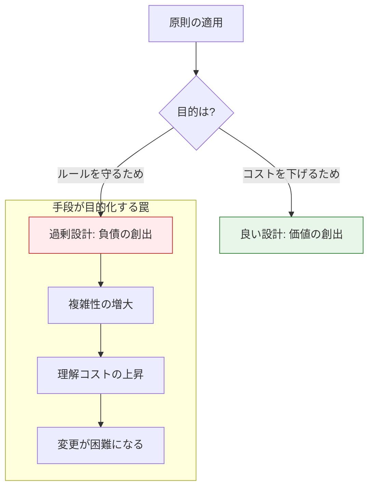

# おわりに
## 1. 原則は目的ではなく、価値を生むための手段である

本書を最後まで読み進めたエンジニアの皆様は、C言語によるソフトウェア開発のために多くの原則・構造・実装技法を習得しました。第1部で「道具」を手にし、第2部で「指針（SOLID）」を学び、それらを統合的に活用する術を身につけました。

最後に、本書が最も強調したいメッセージを記します。それは、 **「原則を守ること」自体がゴールになってはいけない** ということです。

## 2. 設計原則の「罠」に、はまらないために

真面目なエンジニアほど、「本に書いてあったから」とルールを厳格に適用しようとしがちです。しかし、目的を忘れた適用は、かえってコードを複雑にし、開発の足を引っ張ることになります。

### 2.1. 手段と目的の分離

同じ「原則の適用」でも、その動機によって結果が「良い設計」になるか「負債」になるかが分かれる分岐点です。 **目的の確認** : 常に「なぜやるのか（Why）」を問い続けることが、過剰設計（手段の目的化）を防ぐ唯一の方法です。

 **良い設計** とは、単にルールを遵守することではなく、 **「明日の自分や仲間が、楽に変更できる状態を作ること」** です。その本来の目的を見失わないよう、常に「これは本当に必要か？」「これで読みやすくなるか？」を自らに問い続けてください。

## 3. 正解のない世界で「自分の軸」を持つ

設計という行為に、唯一無二の正解はありません。あるのは、その時々の状況における「最適解」と「トレードオフ」だけです。

本書で示したのは、あくまで一つの地図に過ぎません。これからは、あなた自身の現場での経験を積み上げ、 **「自分なりの設計の基準」**  を確立してください。

- 「今回のプロジェクトの規模感では、このレベルの抽象化が最もメンテナンスしやすかった」
- 「この依存の切り方が、チームにとって一番理解しやすかった」

そうした実体験に基づく「軸」を持つことが、設計者としての真の強みになります。 **本書の内容をそのまま守る必要はありません。**

本書を土台にして、あなた自身の設計哲学を築き上げてください。

## 4. 最後に ―― 設計という冒険を楽しもう

本書で紹介したあらゆる設計原則は、すべて **あなたを助けるための道具** です。道具に振り回されるのではなく、道具を使いこなし、素晴らしいソフトウェアを作り上げてください。

思い通りに、軽やかに変更できる設計ができたときの楽しさや嬉しさは、エンジニアにとって何物にも代えがたい報酬です。その楽しさを、ぜひ現場の最前線で体感してください。

あなたがこれから作るソフトウェアが、あなた自身と、それに関わる人々に喜びをもたらし、長く愛されるものになることを確信しています。設計を楽しみましょう。

あなたの挑戦を応援しています。

## 5. 著者について

**花島 弘明（Hiroaki Hanajima）**

ソフトウェア開発に携わって20年以上になりますが、私の設計探求の旅もまだまだ「道半ば」です。昨日書いた自分のコードを見て「なんでもっと綺麗に書けなかったんだ……」と頭を抱える毎日は、新人の頃とあまり変わりません。

昨今、AIの登場によって「プログラミング自体」は飛躍的に楽になりました。しかしだからこそ、その生成されたコードが「適切な設計になっているか」を評価し、導く能力がこれまで以上に求められていると感じています。オブジェクト指向言語ではないC言語で、あえて設計を取り上げたのは、言語の機能に頼らず、手作業で設計を組み立てていく過程こそが「設計の本質」を最も深く理解できると考えたからです。
★この本を完成させるまで、仕事終わりや休みの人多く使い、約半年の時間がかかり、ようやく完成した大変さを記載してください

本書で紹介した設計手法は、あくまで「一つの手段」です。実際の仕事の現場で設計を適用するのは、決して簡単なことではありません。大規模なソフトウェア開発になれば、自分一人で作っていない部分も多く、自分勝手な理想の設計を押し通すことはできません。周囲と歩調を揃え、期限やコストとの厳しいバランスを見極めたうえで、妥当な落としどころを関係者と合意しながら決めていく……そこには、かなりの応用力と泥臭い調整が求められます。

この本で挙げたコード例が、あなたの現場でそのまま同じやり方で適用できるとは、私も思っていません。だからこそ「やり方（How）」を丸暗記するのではなく、「どう考えるべきか（Why）」という思考のプロセスを身につけていただきたいのです。設計で迷ったとき、本書で学んだ「責任」「契約」「依存」という3つの観点が頭の片隅にあれば、それが突破口を開くヒントになるはずです。この3つの観点でコードを見直す習慣がつけば、自然とSOLID原則にも適応した形になり、現場に即した「自分なりの適切な設計」が導き出せるようになると確信しています。

一見、複雑に見えるこれらの設計プロセスも、すべては「価値」を生み出すための手段に過ぎません。私たちが設計に取り組む最大の目的は、場当たり的なコード作成によって失われる「変更容易性」を死守することにあります。いきなりコードを書き始めれば、その瞬間は速いかもしれませんが、将来の変更に耐えうる優れた設計を後から追加するのは極めて困難です。そのため、設計の目的をしっかりと理解し、関係者との合意（時には合意文書の作成）を図りながら、納得感を持ってこのプロセスを進めていくことが重要です。

もしあなたが本書を通じて、C言語での設計の考え方を理解し、実践することができたなら、それは他のあらゆるオブジェクト指向言語にも通じる強力な武器となります。将来、JavaやC#、Pythonといった言語を本格的に扱う際にも、カプセル化、継承、多態性といった機能が「何のために存在するのか」という本質的な目的を理解し、設計の土台として確実に活用できるはずです。それこそが、一人のエンジニアとしての普遍的な成長であると確信しています。

「もっと良くできるはず」という終わりのない試行錯誤こそが、ソフトウェア設計の最大の面白さです。私自身も現場でソフトウェアを作り続け、設計レベルをさらに高めていきたいと日々もがいています。

設計という正解のない海を旅する一人のエンジニアとして、本書が皆様の航路を照らし、共に成長していくためのささやかな一助となれば、これほど嬉しいことはありません。

## 6. 著書紹介

 **[SOLID原則で実践するC言語ソフトウェア設計](https://www.amazon.co.jp/dp/B0FR4FNM67)**

 **「明日の自分のために、コードを美しく保つ」**

設計に悩むすべてのエンジニアへ贈る一冊です。本書が、あなたの開発現場における「変化」を恐れない勇気の一助となることを願っています。

## 7. 参考文献

本書の執筆にあたり、以下の文献を参考にさせていただきました。深く感謝申し上げます。

1. **Clean Architecture 達人に学ぶソフトウェアの構造と設計**
   * Robert C. Martin (著), 角 征典, 高木 正弘 (翻訳)
   * アスキードメディアワークス, 2018年
   * *SOLID原則からアーキテクチャの全容まで、設計の根幹を成す哲学について多大なインスピレーションを受けました。*

2. **Refactoring: Improving the Design of Existing Code (2nd Edition)**
   * Martin Fowler (著)
   * Addison-Wesley Professional, 2018年
   * *コードの匂いを嗅ぎ取り、より良い構造へと段階的に改善していくリファクタリングの技術に関する普遍的な名著です。*

3. **C Interfaces and Implementations: Techniques for Creating Reusable Software**
   * David R. Hanson (著)
   * Addison-Wesley Professional, 1996年
   * *C言語における不透明ポインタやインターフェース設計に関する、極めて実践的かつ歴史的な名著であり、本書の第1部の基礎概念に強く影響を与えています。*

4. **Design Patterns: Elements of Reusable Object-Oriented Software**
   * Erich Gamma, Richard Helm, Ralph Johnson, John Vlissides (著)
   * Addison-Wesley Professional, 1994年
   * *GoF（四人組）によるデザインパターンの原典。C言語での多態性や依存性注入を考える上で、パターンカタログとしての普遍的な価値を持っています。*
