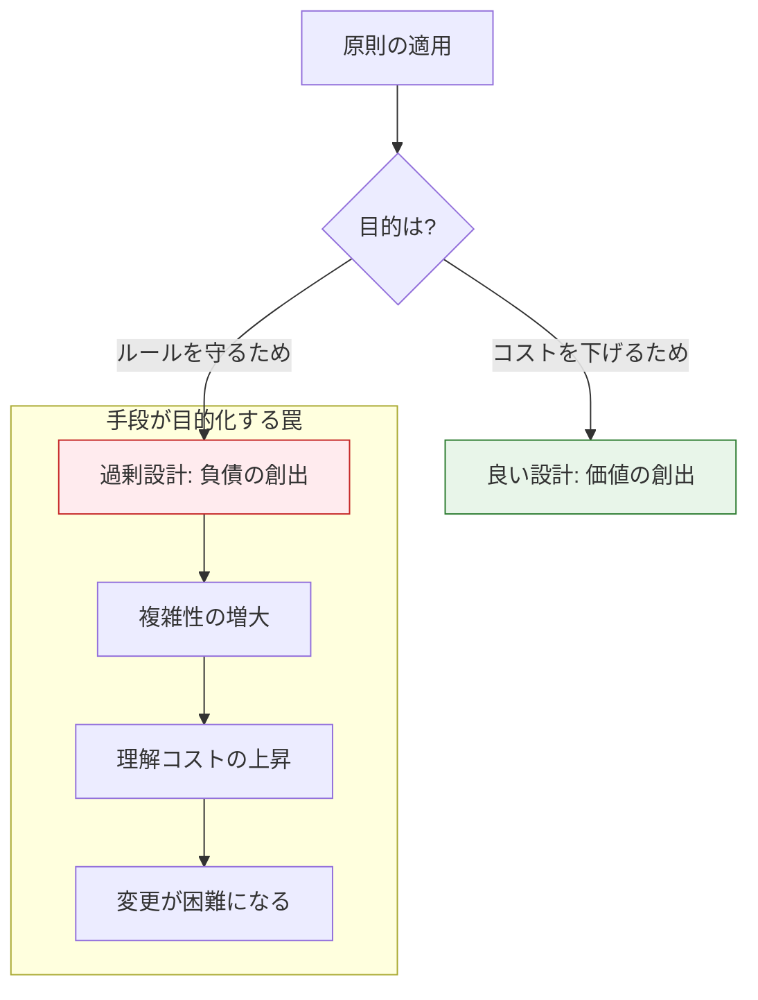

# おわりに
## 1. 原則は目的ではなく、価値を生むための手段である

本書を最後まで読み進めたエンジニアの皆様は、C言語によるソフトウェア開発のために多くの原則・構造・実装技法を習得しました。第1部で「道具」を手にし、第2部で「指針（SOLID）」を学び、それらを統合的に活用する術を身につけました。

最後に、本書が最も強調したいメッセージを記します。それは、 **「原則を守ること」自体がゴールになってはいけない** ということです。

## 2. 設計原則の「罠」に、はまらないために

真面目なエンジニアほど、「本に書いてあったから」とルールを厳格に適用しようとしがちです。しかし、目的を忘れた適用は、かえってコードを複雑にし、開発の足を引っ張ることになります。

### 2.1. 手段と目的の分離

同じ「原則の適用」でも、その動機によって結果が「良い設計」になるか「負債」になるかが分かれる分岐点です。常に「なぜやるのか（Why）」という **目的の確認** を問い続けることが、過剰設計（手段の目的化）を防ぐ唯一の方法です。

```mermaid
graph TB
      A["原則の適用"] --> B{"目的は?"}
      B -- "コストを下げるため" --> C["良い設計: 価値の創出"]
      B -- "ルールを守るため" --> D["過剰設計: 負債の創出"]

      subgraph "手段が目的化する罠"
          D --> E["複雑性の増大"]
          E --> F["理解コストの上昇"]
          F --> G["変更が困難になる"]
      end

      style C fill:#e8f5e9,stroke:#2e7d32
      style D fill:#ffebee,stroke:#c62828
```

 **良い設計** とは、単にルールを遵守することではなく、 **「明日の自分や仲間が、楽に変更できる状態を作ること」** です。その本来の目的を見失わないよう、常に「これは本当に必要か？」「これで読みやすくなるか？」を自らに問い続けてください。

## 3. 究極の目的と、それを達成するための視点

私たちが設計を学び、SOLID原則を適用する「究極の目的」はどこにあるのでしょうか。それは一言で言えば **「保守性（Maintainability）」「信頼性（Reliability）」「変更容易性・拡張性（Extensibility）」** という3つの価値の獲得です。ソフトウェアは書かれて終わりではなく、ビジネスの成長や環境の変化に合わせて絶えず変わり続けます。その変化に安全かつ軽やかに追従できる構造を作ることこそが、設計の真の目的です。

この目的を達成するためには、単に原則のルールを暗記するのではなく、日々のコーディングの中で次のような **「目的から逆算した視点」** を常に持つことが大切です。

####   **【保守性を守る視点】**
*   **「今後の仕様変更がどこに発生しそうか？ その場所は他のモジュールから安全に分離（カプセル化）されているか？」**
*   変更の理由が異なるものが混在していないか（SRPの視点）を問い、変更の影響範囲を1箇所に閉じ込めます。

####   **【信頼性を守る視点】**
*   **「抽象（インターフェース）が約束した『当たり前』を具象が裏切っていないか？ 相手に不要なものを背負わせていないか？」**
*   利用側への保証を最小かつ堅牢にし（LSP/ISPの視点）、予期せぬ副作用や誤用を未然に防ぎます。

####   **【変更容易性・拡張性を守る視点】**
*   **「ハードウェアや外部ライブラリなど、自分たちで制御できないものに直接依存していないか？」**
*   **「頻繁に変わりやすい、不安定な具象実装に依存していないか？」**
*   **「過去の開発・運用の経緯から見て、どこが一番頻繁に機能拡張されてきたか？」**
*   依存の向きを制御し（OCP/DIPの視点）、既存のコードを壊さずに新しい振る舞いを追加できる（＝変更容易性の高い）構造を作ります。

このような問いかけ（視点）を自分の中に持つことで、初めて「どこを守り、どこを柔軟にすべきか」という設計の境界線が見えてきます。

SOLID原則やこれまで学んだC言語の実装技法（不透明ポインタ、VTable、コンポジションなど）は、あくまでこの **「究極の目的」を達成し、あなたの視点を具現化するための「強力な手段（道具）」** に過ぎません。目的を達成するための明確な視点があって初めて、これらの道具は本来の威力を発揮するのです。

## 4. 正解のない世界で「自分の軸」を持つ

設計という行為に、唯一無二の正解はありません。あるのは、その時々の状況における「最適解」と「トレードオフ」だけです。

正解がないからこそ、自分なりの考え（軸）を持って主張することが重要になります。
実務において、他のエンジニアから設計を指摘される場面は必ずあります。しかし、誰かの指摘が常に自分の現場にとっての「正解」であるとは限りません。

大切なのは、盲目的に指摘を受け入れることでも、頭ごなしに否定することでもありません。 **相手の指摘の「意図」を適切に汲み取り、自分の『設計の軸』というフィルターを通して評価し、本当に採用した方が良いものだけを実際の設計に落とし込む** ことです。

自分の軸を持たずに設計を進めると、他人の意見やその時々のトレンドに振り回され、結果として一貫性のない、目的のブレたソフトウェアを生み出してしまいます。

本書で示したのは、あくまで一つの地図に過ぎません。これからは、あなた自身の知識や現場での実体験を積み重ねながら、 **「自分なりの設計の軸」** をしっかりと固めていってください。

*   「今回のプロジェクトの規模感では、このレベルの抽象化が最適だ」
*   「この依存の切り方が、私たちのチームにとって一番保守しやすかった」

このような、経験に基づいた強い「軸」を持つことこそが、設計者としての真の強みになります。 **本書の内容をそのまま守る必要はありません。**

本書を土台にして、あなた自身の強固な設計哲学を築き上げてください。

## 5. 最後に ―― 設計を楽しもう

ソフトウェア開発は、本質的にとても難しいものです。設計に絶対の正解はありませんが、だからこそ、悩み抜いた末に自分なりに納得のいく設計ができたとき、他では味わえないほどの「自己満足」と達成感を得ることができます。

仕事の現場では、スケジュールや要件の制約から、完全に自己満足な設計を追求することは難しいかもしれません。しかし、趣味のプログラミングや個人プロジェクトにおいてなら、あなたは完全に自由です。制限にとらわれず、思う存分に設計の実験を楽しんでよいのです。

そして、この **「設計を楽しむこと」** こそが、自分自身の設計能力をレベルアップさせる最も強力な原動力だと私は確信しています。

本書で紹介したあらゆる設計原則も、最終的には **あなたを助けるための道具** であり、プログラミングを楽しむための手段に過ぎません。道具に振り回されるのではなく、道具を使いこなし、素晴らしいソフトウェアを作り上げてください。

本書で説明した内容の中に、一つでも「なるほど」「面白いな」と思える考え方があり、あなたの今後の設計が少しでも楽しいものになれば、筆者としてこれ以上の喜びはありません。

あなたのソフトウェア開発の旅が、喜びに満ちたものになることを応援しています。設計を、心ゆくまで楽しみましょう。

## 6. 著者について

**花島 弘明（Hiroaki Hanajima）**

ソフトウェア開発に携わって20年になりますが、設計の難しさは今でも変わりません。日々勉強の毎日で、自分の未熟さを痛感することばかりです。

昨今、AIの登場によってプログラミング自体は飛躍的に楽になりました。しかしだからこそ、生成されたコードが「適切な設計になっているか」を判断し、導く力がこれまで以上に求められていると感じています。オブジェクト指向ではないC言語であえて設計を取り上げたのは、言語の機能に頼らず、自分の手で設計を組み立てるプロセスこそが、設計の本質を最も深く理解できると考えたからです。

実は、この本を書こうと思った大きなきっかけの一つは、自分自身の設計スキルをもっと高めたいという思いにありました。人に伝える形にまとめることで、私自身も設計の奥深さを再確認し、学び直す貴重な機会になりました。仕事の合間や週末の時間の多くを費やし、約半年かけてようやく形にすることができ、今はほっとしています。

本書で紹介した手法は、あくまで「一つの手段」です。実際の現場で設計を適用するのは、簡単なことではありません。大規模な開発では自分一人で完結しない部分も多く、理想の設計をそのまま押し通すことはできません。周囲と歩調を合わせ、期限やコストとのバランスを見極めながら、現実的な落としどころを探っていく……そこには、泥臭い調整や応用力が求められます。

本書のコード例が、そのままあなたの現場で使えるとは私も思っていません。だからこそ「やり方（How）」を丸暗記するのではなく、「なぜそうするのか（Why）」という思考プロセスを身につけていただきたいのです。設計で迷ったとき、本書で触れた「責任」「契約」「依存」という3つの観点が頭の隅にあれば、それが突破口になるはずです。この視点でコードを見直す習慣がつけば、自然とSOLID原則に沿った、現場に即した設計が導き出せるようになると確信しています。

一見複雑に見える設計プロセスも、すべては「価値」を生み出すための手段に過ぎません。設計に取り組む最大の目的は、場当たり的な実装によって失われる「変更のしやすさ」を守ることにあります。いきなりコードを書き始めればその瞬間は速いかもしれませんが、後から優れた設計を付け足すのは極めて困難です。だからこそ、設計の目的を理解し、関係者と合意形成を図りながら、納得感を持って進めていくことが重要です。

もし本書を通じて、C言語での設計の考え方を掴むことができたなら、それは他のあらゆる言語にも通じる強力な武器になります。将来、JavaやC#、Pythonなどを扱う際にも、カプセル化やポリモーフィズムといった機能が「何のためにあるのか」を本質的に理解し、土台として活用できるはずです。それこそが、エンジニアとしての普遍的な成長につながると信じています。

「もっと良くできるはず」という終わりのない試行錯誤こそが、ソフトウェア設計の面白さです。私自身も現場で作り続けながら、設計のレベルをさらに高めていきたいと日々もがいています。

設計という正解のない世界で、本書が皆様のヒントになり、共に成長していくための一助となれば幸いです。

## 7. 著書紹介

> [!NOTE] 著書紹介
> **[SOLID原則 実践ソフトウェア設計](https://www.amazon.co.jp/SOLID%E5%8E%9F%E5%89%87-%E5%AE%9F%E8%B7%B5%E3%82%BD%E3%83%95%E3%83%88%E3%82%A6%E3%82%A7%E3%82%A2%E8%A8%AD%E8%A8%88-%E8%8A%B1%E5%B3%B6-%E5%BC%98%E6%98%8E-ebook/dp/B0FR4FNM67)**
>
> 「知っている」と「使いこなせる」の間にある溝を埋める一冊です。コード例はC#ですが、設計の考え方はどの言語にも通じます。変更に強いソフトウェア設計を、現場で実践できるレベルまで体系的に学べます。

## 8. 参考文献

本書の執筆にあたり、以下の文献を参考にさせていただきました。深く感謝申し上げます。

> [!NOTE] Clean Architecture 達人に学ぶソフトウェアの構造と設計
> **著者**: Robert C. Martin 著, 角 征典・高木 正弘 訳
> **出版**: ドワンゴ（KADOKAWA発売）, 2018年
>
> SOLID原則からアーキテクチャの全容まで、設計の根幹を成す哲学について多大なインスピレーションを受けました。

> [!NOTE] Refactoring: Improving the Design of Existing Code (2nd Edition)
> **著者**: Martin Fowler 著
> **出版**: Addison-Wesley Professional, 2018年
>
> コードの匂いを嗅ぎ取り、より良い構造へと段階的に改善していくリファクタリングの技術に関する普遍的な名著です。

> [!NOTE] C Interfaces and Implementations: Techniques for Creating Reusable Software
> **著者**: David R. Hanson 著
> **出版**: Addison-Wesley Professional, 1996年
>
> C言語における不透明ポインタやインターフェース設計に関する、極めて実践的かつ歴史的な名著であり、本書の第1部の基礎概念に強く影響を与えています。

> [!NOTE] Design Patterns: Elements of Reusable Object-Oriented Software
> **著者**: Erich Gamma, Richard Helm, Ralph Johnson, John Vlissides 著
> **出版**: Addison-Wesley Professional, 1994年
>
> GoF（四人組）によるデザインパターンの原典。C言語での多態性や依存性注入を考える上で、パターンカタログとしての普遍的な価値を持っています。
