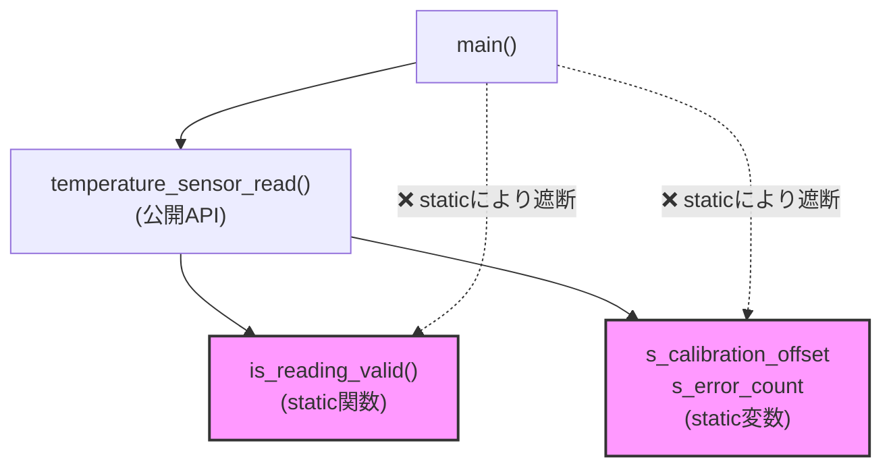
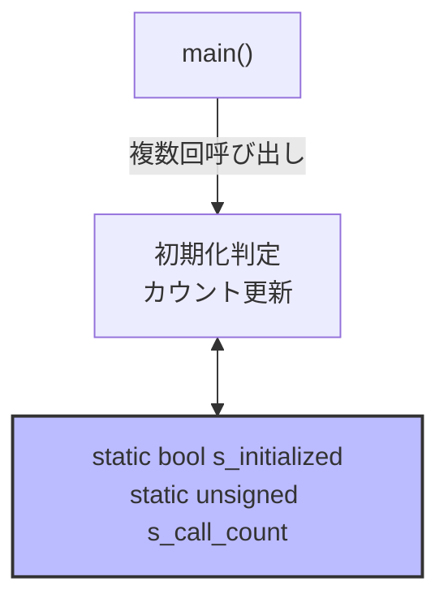
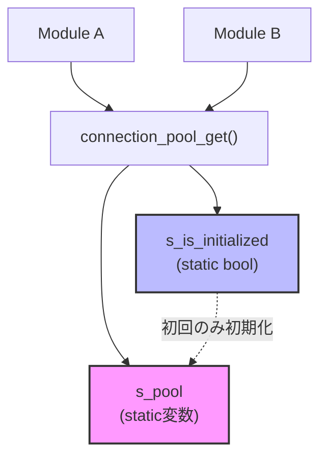
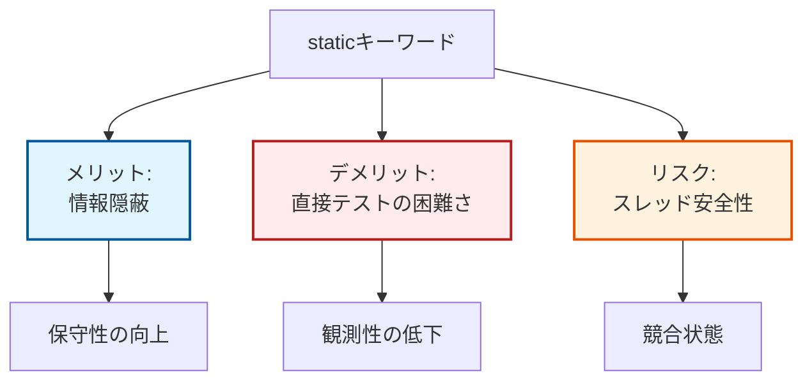

# 第1部 第1章 `static`キーワード - 情報隠蔽による依存の切断と実装の自由
## 1. 章の目的と設計的視点

本書の **第1部「基礎道具編」** において、 **`static`キーワードは、C言語のモジュール設計における最も基本的な「依存を切断するための防壁」** として機能します。 **C言語** では、多くの要素がデフォルトで **外部リンケージ** （グローバルな公開）を持ってしまいます。これが意図せずモジュール間に **強い結合** （Tight Coupling）を生み、保守性の低下を引き起こす原因となるのです。


本章では、`static`が持つ「アクセス範囲を制限する」という機能が、いかにしてモジュール間の **依存関係を物理的に切断** し、 **実装の自由度** （変更の局所化）を確保するのかを解説します。この技術は、設計の三本柱において特に **責任** の軸を強化するものです。

モジュールが自身の内部状態に対して全ての **責任** を持ち、外部からの干渉を一切許さない構造を作る。これこそが、 **変更の影響範囲** を限定し、真の **疎結合** を実現するための土台となります。

#### 道具と原則、そして目的

この道具が果たす役割を整理すると、以下のようになります。 **`static`（道具）** は、 **単一責任原則 (SRP)（原則）** の基礎となり、最終的に **保守性および変更容易性の向上（目的）** に寄与します。

#### 達成される設計上のメリット

`static` を適切に使用することで、具体的に以下のメリットが得られます。

*   **コンパイル依存の最小化**　`static`にされた要素はヘッダファイルに記述する必要がありません。その実装を変更しても、他のファイルを **再コンパイル** する必要がなくなるため、コンパイル時の **依存関係が物理的に切断** されます。

*   **実装の隠蔽と自由**　外部から見えないため、`static`な実装はいつでも **自由に変更・削除** できます。これにより、モジュールの **保守性** が劇的に向上します。

## 2. `static`の具体的な活用パターン

 **C言語** の`static`キーワードは、適用される対象によって「 **記憶域期間** （生存期間）」と「 **リンケージ** （可視性）」という二つの側面を持ちますが、設計上の本質は一つです。それは、 **「要素を最小限のスコープに閉じ込め、不要な依存を遮断すること」** に他なりません。

### 2.1. 活用パターン 1: センサーモジュールの状態隠蔽（ファイルスコープ`static`）

ここでは`static`による **ファイルスコープの制限** を組み込みセンサーモジュールで実践します。内部状態をモジュール外部から完全に遮断し、公開APIのみを通じて安全に操作できる設計を構築することで、意図しない状態変更による不具合をコンパイル時点で物理的に防止します。

#### システム概要

温度センサーの値を読み取る組み込みモジュールにおいて、内部状態（キャリブレーション値やエラーカウント）を外部から隠蔽し、安全に管理するケースを考えます。このモジュールは以下の機能を提供します。

*   **センサーの初期化**
*   **現在温度の読み取り（補正済み）**
*   **内部状態を持つシングルトン的なモジュール構成**　APIを通じて初期化指示と温度値（整数）をやり取りします。

#### 設計課題

この要件を満たすため、まずは状態変数（キャリブレーション値やエラーカウント）をグローバル変数として定義し、外部のカラムから直接アクセスさせる素朴な実装が考えられます。しかし、この設計には大きな罠が潜んでいます。状態変数がどこからでも（例えばメイン処理や無関係なモジュールから）変更可能になってしまうため、予期せぬタイミングでキャリブレーション値が上書きされ、センサーの読み取り値が狂う危険性があるのです。

#### 設計の意図

このような外部からの意図しない状態変更を防ぐため、ここでは`static`修飾子による「ファイルスコープの制限」を適用します。センサーの補正ロジックやエラー判定基準はハードウェアの変更に伴って頻繁に変わる可能性があるため、これらの「変化しやすい部分（内部実装）」を`static`で隠蔽します。そして、外部には「初期化」と「読み取り」という安定した「契約（API）」だけを公開することで、保守性を飛躍的に高めます。

#### 依存関係と隠蔽の構造

外部（main）からは公開APIのみが見え、内部状態（変数）や補助関数への直接アクセスが物理的に遮断されている様子です。

*   **API**：唯一の「窓口」として機能し、内部状態を保護しています。
*   **State/Helper**：モジュール内部に閉じており、外部からの変更影響を受けません。

実線矢印は許可されたアクセス、点線矢印は遮断された不正なアクセスを表します。



#### センサーモジュールのヘッダ設計（公開契約）

センサーモジュールが外部に対して保証する「契約（公開API）」のみを定義しています。`stdbool.h` をインクルードし、初期化関数と読み取り関数のプロトタイプ宣言を行っています。

内部状態に関する変数宣言や構造体定義を一切含めていません。これにより、実装詳細（キャリブレーション値の管理方法など）が変更されても、このヘッダファイルを利用する外部モジュールへの影響（リコンパイル等）を最小限に抑えています。必要最小限の情報のみを公開する、「 **結合度の低いヘッダ設計** 」の好例です。

#### temperature_sensor.h
```c
#ifndef TEMPERATURE_SENSOR_H
#define TEMPERATURE_SENSOR_H
#include <stdbool.h>

#define TEMP_SENSOR_ERROR -9999

// 抽象契約：温度センサーの公開API
bool temperature_sensor_init(void);
int temperature_sensor_read(void);  // 戻り値: 温度(℃ × 10)、エラー時は TEMP_SENSOR_ERROR
#endif // TEMPERATURE_SENSOR_H
```

#### 状態変数と内部実装のカプセル化

ヘッダで宣言されたAPIを実装し、`static`変数を用いて内部状態（キャリブレーション値など）をこのファイル内に「閉じ込めて」います。まず、状態変数とプライベートな補助関数を見てみましょう。

`s_calibration_offset` と `s_error_count` という状態変数を保持し、`is_reading_valid` というヘルパー関数で値の妥当性をチェックしています。これらはすべて `static` で修飾されています。

変数や関数に `static` を付与することで、リンケージを内部（ファイルスコープ）に限定しています。これは SRP（単一責任原則）の観点から、状態管理の責任をこのモジュール内だけに限定し、外部からの直接アクセスによる不正な状態変更や依存を防止する「 **情報の隠蔽** 」です。

#### temperature_sensor.c
```c
#include "temperature_sensor.h"
#include <stdio.h>

// 具象実装A: キャリブレーション補正値（内部状態、単位: ℃×10）
static int s_calibration_offset = -15;

// 具象実装B: エラー累積カウンタ（内部状態）
static int s_error_count = 0;

// 具象実装C: 読み取り値の妥当性検証（補助ロジック）
// static関数にすることで、外部からの呼び出しを禁止し、内部ロジックの変更を自由にします
static bool is_reading_valid(int raw_value)
{
    return (raw_value >= -400 && raw_value <= 1250);
}
```

#### 公開APIの実装（初期化処理）

続いて、公開APIの初期化処理です。初期化を実行し、エラーカウンタをリセットしています。

初期化の具体的な手順（ここでは単純な変数リセットやログ出力）を隠蔽しています。内部実装の変更がインターフェースに影響しないため、高い保守性が保たれています。

#### temperature_sensor.c
```c
// 公開API実装: 初期化処理
bool temperature_sensor_init(void)
{
    printf("[Sensor] Initializing with calibration offset: %d\n", s_calibration_offset);
    s_error_count = 0;

    return true;
}
```

#### 公開APIの実装（温度読み取り処理）

最後に、メイン機能である温度読み取りAPIです。内部のヘルパー関数 `is_reading_valid` を使用して値を検証し、補正値を適用して返します。

内部の検証ロジック（`is_reading_valid`）や補正値（`s_calibration_offset`）を隠蔽することで、将来的に検証ルールや補正方法が変わっても、このAPIを利用する外部コードには影響を与えないようにしています。これが「変更の影響範囲を局所化する」ということです。呼び出し側は「温度を得る」という目的だけに集中でき、内部ロジックの複雑さから解放されています。

#### temperature_sensor.c
```c
// 公開API実装: 温度読み取り
int temperature_sensor_read(void)
{
    // ハードウェアからの読み取りをシミュレート
    int raw_value = 235;  // 実際はレジスタ読み取り

    if (!is_reading_valid(raw_value)) {
        s_error_count++;
        printf("[Sensor] Invalid reading detected (errors: %d)\n", s_error_count);

        return TEMP_SENSOR_ERROR;
    }

    // キャリブレーション補正を適用
    return raw_value + s_calibration_offset;
}
```

#### クライアントからの利用（依存遮断の確認）

センサーモジュールの利用者となるクライアントコードです。公開API `temperature_sensor_init` と `temperature_sensor_read` のみを呼び出し、温度データを取得・表示しています。

センサー内部のキャリブレーション方法やエラー変数の存在を全く意識せずに利用しています。これにより、`temperature_sensor.c` 側の実装変更に対して疎結合な状態が保たれています。モジュール間の依存関係が単純化されており、「 **仕様変更に強い構成** 」となっています。

#### main.c
```c
#include "temperature_sensor.h"
#include <stdio.h>

int main(void)
{
    printf("=== Temperature Sensor Example ===\n");

    if (!temperature_sensor_init()) {
        printf("[Main] Sensor initialization failed\n");

        return 1;
    }

    // センサー読み取り（3回）
    for (int i = 0; i < 3; i++) {
        int temp = temperature_sensor_read();

        if (temp != TEMP_SENSOR_ERROR) {
            printf("[Main] Temperature: %d.%d°C\n", temp / 10, temp % 10);
        } else {
            printf("[Main] Failed to read temperature\n");
        }
    }

    return 0;
}
```

#### 利用側から見た実行時の振る舞い

プログラムの実行結果です。内部のキャリブレーション値が適用された温度が取得できていることがわかります。

#### 実行結果
```c
=== Temperature Sensor Example ===
[Sensor] Initializing with calibration offset: -15
[Main] Temperature: 22.0°C
[Main] Temperature: 22.0°C
[Main] Temperature: 22.0°C
```

> [!NOTE] 読者の疑問：公開関数で内部の変数を操作できるなら、結局グローバル変数と同じでは？
> 「`static`で変数をファイル内に隠しても、公開関数（APIとして外に見せる関数）を通じてその変数の値を取得したり変更したりできますよね？それなら、結局グローバル変数を操作できているのと変わらず、隠蔽の意味がないのでは？」
>
> これは設計を学び始めた方が非常に高い確率で抱く疑問です。しかし、両者には決定的な違いがあります。
> グローバル変数を直接公開している場合、外部のモジュールは **変数の名前、型、内部構造** に直接依存します。もし変数の型を `int` から `float` に変えたり、名前を変更したりすると、その変数を使っているすべてのモジュールが壊れて修正が必要になります。
> 一方、公開関数（API）を通じてアクセスする設計では、外部のモジュールが知っているのは **「この関数を呼べば温度が取れる」** という **契約（関数のシグネチャ）** だけです。内部で温度をどんな型の変数に保持しているか、どんな計算で補正しているかは、外部からは一切見えません。つまり、モジュール内部の実装を自由に変更しても、関数のシグネチャさえ変えなければ、外部には一切影響しないのです。
> この「直接のアクセス」と「APIを経由した間接のアクセス」の違いこそが、 **実装の自由度** を確保する隠蔽の本質です。

### 2.2. 活用パターン 2: ログシステムの初期化制御（ローカルスコープ`static`）

次は`static`の **関数内スコープ** の活用例です。グローバル変数を一切使わずに関数内の静的変数だけで「初回のみ初期化する」という状態を安全に保持し、呼び出し側が初期化を意識しなくてよいシンプルなAPIを実現します。

#### システム概要

アプリケーション全体で使用する簡易ログシステムにおいて、明示的な初期化関数を呼ばずに、初回利用時に自動で初期化を行うケースです。このシステムは以下の特徴を持ちます。

*   **ログメッセージの出力**
*   **自動初期化（初回のみ）**
*   **呼び出し回数のカウント**
*   **単一の関数内で状態を完結させる設計**　

#### 設計課題

この仕様を実現するため、まずは「初期化済みフラグ」や「呼び出し回数のカウント」をグローバル変数として保持する設計パターンがよく用いられます。しかし、グローバル変数の利用は様々な副作用を引き起こします。システムのどこからでもこのフラグやカウントを書き換えられてしまうため、他のモジュールが誤ってフラグをリセットし、何度も初期化処理が走ってしまうといった予測不能なバグの温床になります。

#### 設計の意図

この不要なグローバルアクセスのリスクを排除するため、ここでは関数内`static`変数を使います。これにより、「状態を保持し続けたい」という要求を満たしつつ、「変数のスコープを関数内に限定したい（カプセル化）」という安全性の要求を同時に達成します。変数にはその関数からしかアクセスできないため、状態が外部から汚染されることは絶対にありません。

#### 状態保持の仕組み

関数呼び出しが終わっても値が消えない「静的領域」に変数が配置され、呼び出しのたびにその状態が更新されていく様子です。

*   **State**：関数内`static`変数として定義されており、関数外からは見えません。
*   **Logic**：呼び出しごとに状態（回数や初期化フラグ）を更新します。

`Caller`からの繰り返し呼び出しに対し、`Logic`が`State`を参照・更新するサイクルを実現します。


#### ログ機能のインターフェース設計

ログ出力機能のインターフェースを定義しています。`log_message` 関数のプロトタイプ宣言のみを行います。

ログ機能が内部でどのような状態管理（初期化済みフラグやカウンタ）を行っているかを完全に隠蔽し、利用側には機能のエントリポイントだけを提供しています。非常に簡潔で、利用しやすいインターフェースです。

#### logger.h
```c
#ifndef LOGGER_H
#define LOGGER_H

// 抽象契約：ログ出力のAPI
void log_message(const char* message);
#endif // LOGGER_H
```

#### 関数内staticによるログシステムの実装

ログ出力機能の実装です。関数内 `static` 変数を活用して状態を管理しています。

`s_initialized` と `s_call_count` を関数 `log_message` 内の `static` 変数として定義しています。これにより、関数呼び出しが終了しても値が保持され続けます。

状態変数のスコープを関数内に極限まで狭めています（カプセル化）。これにより、他の関数から誤って初期化フラグやカウンタが変更されるリスクをゼロにしています。グローバル変数を使わずに状態保持を実現する、安全で保守性の高いパターンと言えます。

#### logger.c
```c
#include "logger.h"
#include <stdio.h>
#include <stdbool.h>

// 具象実装: log_message
void log_message(const char* message)
{
    // 設計意図A: 関数呼び出し後も値が保持される（静的記憶域期間）
    static bool s_initialized = false;

    // 設計意図B: 呼び出し回数を追跡するが、外部には公開しない
    static unsigned s_call_count = 0;

    // 初回のみ初期化処理を実行
    if (!s_initialized) {
        printf("--- Log System Initialized ---\n");
        s_initialized = true;
    }

    s_call_count++;
    printf("[LOG #%u] %s\n", s_call_count, message);
}
```

#### 利用側（自動初期化の恩恵）

ログ機能の利用者コードです。明示的な初期化関数を呼ぶことなく、`log_message` を連続して呼び出しています。

ライブラリの初期化手順（ `init` して `usage` して `term` する等）を意識せず、使いたい時に関数を呼ぶだけで機能が正常動作するように設計されています。利用側コードの記述量が減り、初期化忘れなどのミスを防ぐことができる優れたUX（User Experience）を提供しています。

#### main.c
```c
#include "logger.h"

int main(void)
{
    log_message("Application started");
    log_message("Processing data");
    log_message("Task completed");
    log_message("System shutdown");

    return 0;
}
```

#### ログシステムの実行結果

初回呼び出し時のみ初期化メッセージが表示され、以降はカウントアップされていることが確認できます。

#### 実行結果
```c
--- Log System Initialized ---
[LOG #1] Application started
[LOG #2] Processing data
[LOG #3] Task completed
[LOG #4] System shutdown
```

### 2.3. 活用パターン 3: コネクションプールの実装（シングルトンパターン）

ファイルスコープ`static`変数と関数内`static`変数を組み合わせて、リソースの唯一性を保証する「シングルトンパターン」をC言語で実現する方法です。

#### システム概要

データベース接続などの共有リソースを管理するため、システム内で唯一のインスタンス（シングルトン）を生成・保持するモジュールです。ファイルスコープの `static` 変数としてインスタンスを定義し、それを指すポインタをAPI経由で取得する構成となっています。

#### 設計課題

データベースコネクションのような高コストなリソースは、システム全体で一つだけ存在するように制御し、複数回の無駄な初期化を防ぐ必要があります。しかし、このインスタンスを単なるグローバル変数として定義してしまうと、意図しない場所から勝手に新しい接続先へ上書きされたり、強制的に破棄されたりして、システム全体がクラッシュする危険性を孕むことになります。複数のモジュール（Caller1, Caller2）が介入する環境では、この無秩序なアクセスをいかに防ぐかが最大の課題です。

#### 設計の意図

リソースの競合や不整合を防ぐため、ここでは「インスタンスが絶対に一つしか存在しないこと（シングルトン）」を保証する設計パターンを適用します。具体的には、`static`変数を利用してインスタンスの実体を隠蔽し、グローバル変数の弊害（どこからでも変更可能）を完全に遮断します。その上で、`connection_pool_get` という唯一の公式APIを通じてのみアクセスできる「制御された共有」を実現します。

*   **Instance**：`static`変数として定義された唯一の実体です。　
*   **Init**：初回アクセス時のみ初期化が走るガード機能です。

APIを中心としたアクセス制御を示した図です。


#### プール機能のインターフェース設計

コネクションプールのインターフェース定義です。今回は構造体の隠蔽（不完全型）も利用しています。

`ConnectionPool` という不完全構造体（タグ名のみ）を typedef し、取得 API `connection_pool_get` を宣言しています。構造体の中身を見せないことで、利用側が勝手にメンバを書き換えることを防ぎ、必ず API を通して操作させるよう強制しています。カプセル化が徹底されており、非常に堅牢なモジュール設計です。

#### connection_pool.h
```c
#ifndef CONNECTION_POOL_H
#define CONNECTION_POOL_H
#include <stdbool.h>

// 構造体の宣言のみを行い、詳細なメンバは隠蔽する（不完全型）。
// ※このテクニックの詳細は「第4章：不完全型と不透明ポインタ」で解説します。
typedef struct ConnectionPool ConnectionPool;

// 抽象契約：コネクションプールの取得API
ConnectionPool* connection_pool_get(void);
bool connection_pool_execute(ConnectionPool* pool, const char* query);
#endif // CONNECTION_POOL_H
```

#### シングルトンパターンによるプールの実装

シングルトンパターンの実装です。まず、構造体の定義と、唯一のインスタンス、そしてそれを取得する関数を見てみます。

`struct ConnectionPool` の実体定義を行い、ファイルスコープ変数 `s_pool` として唯一のインスタンスを作成しています。`connection_pool_get` では関数内静的変数 `s_is_initialized` を用いて、初回のみ初期化処理を実行し、常に `s_pool` へのポインタを返します。

`s_pool` を `static` にすることで、このファイル外部から直接アクセスできないようにし、必ず `get` 関数を通すように制御しています。これにより、インスタンスの唯一性と初期化の保証を行っています（シングルトン）。グローバル変数による安易な共有ではなく、アクセス制御された共有を実現しています。

#### connection_pool.c
```c
#include "connection_pool.h"
#include <stdio.h>
#include <stdbool.h>

// ここで構造体の実体を定義。ヘッダには公開されない。
struct ConnectionPool {
    unsigned connection_count;
    unsigned query_count;
};

// 具象実装A: プールの実体（ファイルスコープstatic）
// システム全体で唯一のインスタンスとなる
static struct ConnectionPool s_pool = {
    .connection_count = 5,
    .query_count = 0
};

// 具象実装B: シングルトン取得API
ConnectionPool* connection_pool_get(void)
{
    // 設計意図: 初期化済みフラグを関数内staticで保持
    // ※注意: マルチスレッド環境で厳密な排他制御が必要な場合は、
    // ミューテックスや atomic操作、または C11の call_once 等の導入を検討してください。
    static bool s_is_initialized = false;

    if (!s_is_initialized) {
        printf("[Pool] Initializing connection pool (max: %u connections)\n",
               s_pool.connection_count);
        s_is_initialized = true;
    }

    return &s_pool;
}
```

#### プールを利用したクエリ実行APIの実装

次に、コネクションプールを利用する具体的な操作関数です。取得したプールに対してクエリを実行します。

操作対象を引数として受け取ることで、操作の責任を明確にしています。「どのプールに対して操作するか」が明示的であり、副作用の範囲が予測しやすくなっています。

#### connection_pool.c
```c
// 具象実装C: クエリ実行
bool connection_pool_execute(ConnectionPool* pool, const char* query)
{
    if (pool == NULL || query == NULL) {
        return false;
    }
    pool->query_count++;
    printf("[Pool] Executing query #%u: %s\n", pool->query_count, query);

    return true;
}
```

#### 複数モジュールからのプール共有

複数のモジュールからコネクションプールを利用するシミュレーションです。`module_a` と `module_b` からそれぞれ `connection_pool_get` を呼び出し、同じプールに対してクエリを発行しています。

どのタイミングで誰が呼んでも、常に「初期化済みの唯一のインスタンス」が返されることを期待したコードです。システム全体でのリソース共有をシンプルに行っています。シングルトンの利点を活かし、リソース管理を一元化できています。

#### main.c
```c
#include "connection_pool.h"
#include <stdio.h>

// モジュールAをシミュレート
void module_a_process(void)
{
    ConnectionPool* pool = connection_pool_get();
    connection_pool_execute(pool, "SELECT * FROM users");
}

// モジュールBをシミュレート
void module_b_process(void)
{
    ConnectionPool* pool = connection_pool_get();
    connection_pool_execute(pool, "INSERT INTO logs VALUES (...)");
}

int main(void)
{
    printf("=== Connection Pool Example ===\n");
    module_a_process();
    module_b_process();
    module_a_process();

    return 0;
}
```

#### シングルトンの動作確認

どのモジュールから呼ばれても、クエリ番号（`query_count`）が継続してカウントアップされており、同じインスタンスが使われていることがわかります。

#### 実行結果
```c
=== Connection Pool Example ===
[Pool] Initializing connection pool (max: 5 connections)
[Pool] Executing query #1: SELECT * FROM users
[Pool] Executing query #2: INSERT INTO logs VALUES (...)
[Pool] Executing query #3: SELECT * FROM users
```

## 3. 設計判断と落とし穴のまとめ

`static`は強力な **情報隠蔽の道具** ですが、設計的判断と **トレードオフ** が伴います。メリットとリスクのバランスを正しく理解し、適用箇所を見極めることが重要です。




#### テスト容易性 (Testability)

ここで問題となるのが、**テストの難易度**です。`static`な要素は外部から呼び出せないため、**単体テスト** で直接検証することができません。
これに対する有効なアプローチは、複雑すぎるロジックを`static`関数に閉じ込めないことです。テストが必要なほど複雑なロジックは、後続の章で学ぶ **関数ポインタによる依存の注入** （第2章）や **依存性逆転** （第12章）を用いて切り出し、テスト可能な状態にすることを検討してください。

#### スレッド安全性

また、マルチスレッド環境では注意が必要です。ファイルスコープの`static`変数は、全スレッドで共有されるため、競合状態を引き起こす **依存の源泉** となり得ます。
共有される`static`データへの変更を行う公開APIには、必ず **ミューテックス** による排他制御を導入するか、あるいは **スレッドローカルストレージ** の使用を検討し、安全性を担保する必要があります。

#### 情報隠蔽の徹底

最後に、隠蔽の徹底についてです。モジュール内の補助的なデータやヘルパー関数のうち、一つでも`static`を付け忘れてしまうと、そこが「勝手口」となり、意図しない **依存** を招く原因になります。
ヘッダファイルで公開していない要素には、**「原則としてすべてstaticを付ける」** という習慣を持つことが有効です。これにより、意図しない外部露出を確実に防ぐことができます。

## 本章で必ず理解してほしいことのまとめ

### `static`キーワードの設計上の役割

#### 1. 静的な依存の切断を物理的に行う道具である
 **C言語** における`static`キーワードは、変数や関数のリンケージを「内部」に限定することで、その要素が外部のモジュールから **参照される可能性** を物理的に断ち切ります。これにより、外部モジュールは意図せず内部実装に **静的に依存** することがなくなり、 **疎結合** が実現されます。

#### 2. 変更の局所化を保証し保守性を高める
`static`な要素は外部に公開されないため、その定義や実装を変更しても、 **モジュール外部のコードを再コンパイルする必要がなくなります** 。 **変更の影響範囲** を当該`.c`ファイル内に限定するため、システムの **保守性** と **変更容易性** が劇的に向上します。

#### 3. モジュール状態のカプセル化の基本パターンを構成する
モジュールの **状態データ** をファイルスコープ`static`として隠蔽し、その操作を **公開API** に限定する設計は、 **C言語** で最も基本となる **情報隠蔽とカプセル化のパターン** です。

#### 次章への橋渡し
 **第1章** では、`static`キーワードが **静的な依存関係** を物理的に切断し、モジュールの実装を外部から隠蔽する最前線の「道具」であることを学びました。これにより、モジュールは **自己完結性** が高まり、 **変更を局所化する** という設計上の大きなメリット（ **保守性** ）が得られます。

しかし、この`static`による依存の切断は、 **コンパイル時** に固定される「静的」なものです。変化する要求や、振る舞いを **動的に差し替えたい** という設計目標（ **拡張性** ）を達成するためには、実行時に **動的な依存関係** を柔軟に制御する道具が不可欠です。

次章では、C言語でこの動的な依存関係を実現するための強力な道具、「 **第2章 関数ポインタと間接呼び出し - 動的結合の実現** 」について解説します。この技術は、「第9章 開放閉鎖原則 (OCP): 拡張のために開き、修正に対して閉じる」や「第12章 依存性逆転原則 (DIP): 抽象への依存とテスト容易性」でより深く活用されます。
