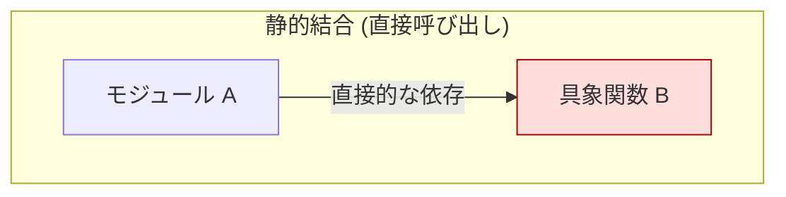
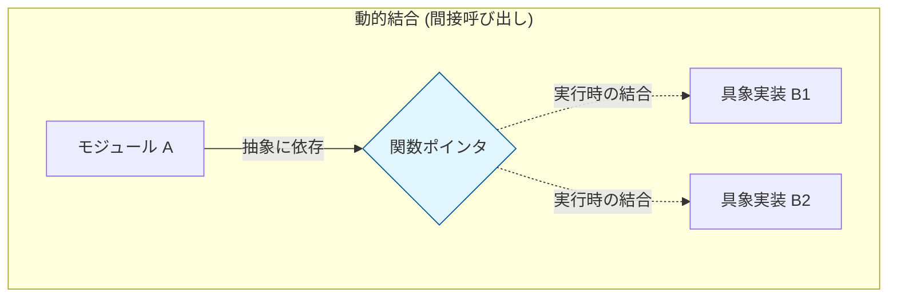
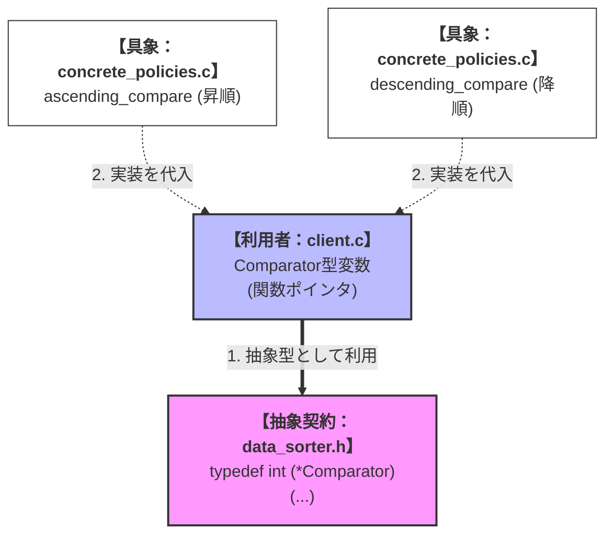
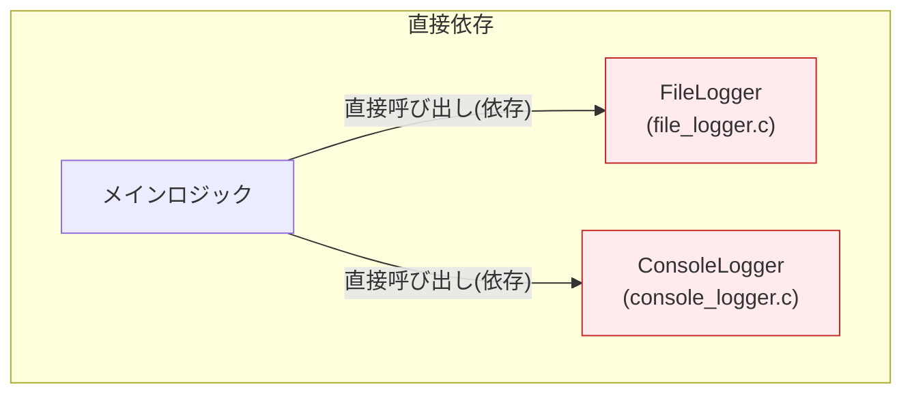
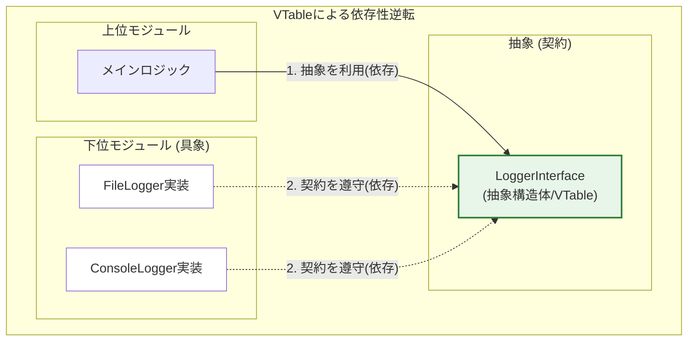
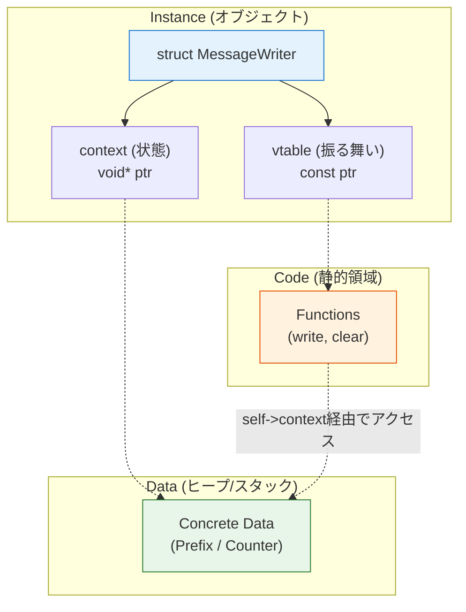

# 第1部 第2章 関数ポインタと間接呼び出し - 動的結合の実現

## 1. 章の目的と設計的視点

### 本章の目的：静的結合から動的結合へ

前章の`static`キーワードは、モジュールの**責任（内部）** を閉じ込め、**静的な情報隠蔽**を実現しました。本章の**関数ポインタ**は、それをさらに一歩進め、プログラムの実行中に**依存**の方向を逆転させ、**動的な結合**を実現するための**道具**です。

システムは、実行時に新しい機能を追加したり、振る舞いを差し替えたりする**動的な拡張性**が求められます。関数ポインタは、その要求に応える設計を可能にし、特に「**依存**」の方向を**具象から抽象へ**と制御する上で、C言語の設計を支える**基盤**となります。

ここで **「抽象へ依存する」**とは、具体的な処理（どのように実現するか）ではなく、インターフェースという「約束事（何をするか）」だけを頼りにコードを書くことを意味します。

もし、上位のモジュールが下位の具体的な処理を直接呼び出してしまうと、下位の変更が上位へと連鎖し、システム全体が脆くなってしまいます。しかし、関数ポインタを介して「抽象」に依存させれば、**呼び出し側は相手の正体を知る必要がなくなります。** これにより、呼び出し側のコードを一行も修正することなく、実行時に中身を差し替えたり、将来的に新しい機能を追加したりすることが可能になります。

つまり、抽象化による依存の制御こそが、変化に強い、柔軟で堅牢なシステムを構築するための鍵となるのです。

前章で学んだ「隠蔽（守り）」から、本章の「動的な拡張（攻め）」への移行。その架け橋となるのが、この関数ポインタという道具なのです。

### 関数ポインタ導入の設計的判断基準

前章の**第1章「staticキーワード - 情報隠蔽による依存の切断と実装の自由」** では、`static`を用いてモジュールの**自己完結性**（高い凝集度）を高める**静的な情報隠蔽**を実現し、**責任（内部）** の分離を確固たるものにしました。

しかし、コンパイル時にすべてが決定する**静的な結合**だけでは、システムが実行時に満たすべき**動的な拡張性**や**依存関係の柔軟な制御**という、より高度な設計課題に対処できません。

### 静的な結合の課題

コンパイル時にすべてが決定する**静的な結合**は、例えば、上位の処理モジュールAが、下位の具体的なログ機能Bを**直接**呼び出す状況を指します。

**この図が示すもの**:

上位モジュール（A）が、下位の具象実装（B）に直接依存している古典的な結合状態です。

**注目ポイント**:

**直接呼び出し**: Aの中に「Bを呼ぶ」というコードが固定されているため、Bを別のものに差し替えるにはAを書き換える必要があります。



### **具体例**:

モジュールA (`main.c`)  **直接呼び出し** 具体的な関数B (`log_to_console()`)

この結合では、ログ出力先を**ファイル**に変更したい場合、Aのコード自体を書き換えて、新しい具体的な関数 (`log_to_file()`) を直接呼び出すように修正しなければなりません。これは、AがBの具象実装に**依存**しすぎているため、**拡張性**や**柔軟性**が失われている状態です。

関数ポインタは、この直接的な結合を切り離し、呼び出しの対象を**実行時に差し替え可能**にすることで、モジュールAが**具象**（特定のログ関数）ではなく**抽象**（ログ関数という契約）に依存するように**依存関係を柔軟に制御**する手段を提供します。

**この図が示すもの**:

関数ポインタを介することで、呼び出し側（C）と実装側（E1/E2）の間に「間接層」が生まれ、結合が緩やかになった状態です。

**注目ポイント**:

* **抽象への依存**: モジュールCは「関数ポインタD」という窓口しか知りません。
* **選択の自由**: 実行時にE1を使うかE2を使うかを自由に選べます。



### この章のテーマ：依存（関係）の動的制御

本章で解説する**関数ポインタ**は、「C言語における**動的な結合**と**制御の反転 (Inversion of Control, IoC)**」を実現するための最も強力な**道具**です。

関数ポインタの導入は、主に以下の設計課題を解決し、**依存**の方向を**具象から抽象へ**と制御する上で**核**となります。

### 関数ポインタが解決する課題と設計的価値

| 解決する課題 | 対応する軸 | 達成される価値 | 設計上の役割 |
| --- | --- | --- | --- |
| **振る舞いの動的な変更** | **依存** | **拡張性** | 実行中のロジックを条件に応じて自在に差し替え可能にする。 |
| **依存性の逆転** | **依存** | **疎結合** | 上位モジュールが下位の具象に依存せず、抽象（インターフェース）に依存する。 |
| **汎用的な処理枠組みの構築** | **責任** | **再利用性** | アルゴリズム（枠組み）とポリシー（具体的なロジック）を分離する。 |

関数ポインタは、プログラムの**振る舞い**を**データとして扱う**ことを可能にします。これは、第2部で学ぶ**開放閉鎖原則 (OCP)** や**依存性逆転原則 (DIP)** をC言語で**物理的に実現する**ための重要な基盤となります。

## 2. 関数ポインタの具体的な活用パターン

関数ポインタは、関数名（関数の開始アドレス）を通常の変数と同じように**代入**し、実行時に**間接呼び出し**を行うことで、**動的結合**の出発点となります。

### 2.1. 活用パターン 1: 単一関数ポインタによる動的な振る舞いの切り替え

### システム概要

**目的**: データのソート処理において、昇順・降順といった比較ロジックを実行時に切り替えられるようにする。

**機能**:

1. 2つの整数値を比較する
2. 比較結果（負数、0、正数）を返す

**アーキテクチャ**: 比較ロジックを関数ポインタとして抽象化し、クライアントに注入する戦略パターン。

### 設計の意図

「値をどう比較するか」という具体的なロジック（昇順、降順など）を、それを利用する側（クライアント）から切り離します。これにより、クライアントコードを修正することなく、新しい比較ロジックを追加したり切り替えたりすることが可能になります。

### 動的結合の仕組み

**この図が示すもの**:

クライアントが具体的な関数（昇順・降順）を直接知るのではなく、抽象的な型（Comparator）を通して間接的に利用する構造です。

**注目ポイント**:

* **抽象への依存**: ClientはContractのみに依存し、Imp1/Imp2の変更の影響を受けません。
* **差し替え可能性**: Clientは実行時にImp1とImp2を自由に切り替えられます。

**読み方のガイド**:

* 二重線矢印: コンパイル時の静的な依存
* 点線矢印: 実行時の動的な代入



### data_sorter.h

比較ロジックの契約（シグネチャ）を定義するヘッダファイルです。
**処理の内容:** 関数ポインタ型 `Comparator` を typedef しています。

**設計的意図:** 比較という「振る舞い」を型として定義することで、具体的なアルゴリズム（昇順、降順、絶対値など）を抽象化しています。利用側はこの `Comparator` 型を通じて処理を呼び出すため、実装の詳細を知る必要がなくなります。

**評価:** 拡張性（新しい比較ロジックの追加が容易）を確保するための適切な抽象化です。

#### data_sorter.h
```c
#ifndef DATA_SORTER_H
#define DATA_SORTER_H

// 設計意図: 抽象契約（シグネチャ）を定義。この型が比較処理のインターフェースとなる。
typedef int (*Comparator)(const void* a, const void* b);

#endif // DATA_SORTER_H
```

### concrete_policies.c

`Comparator` 型に適合する具体的な比較ロジックの実装です。
まず、実際の比較処理を行う内部関数（`static`）を定義します。

**処理の内容:** 昇順比較 (`ascending_compare_impl`) と降順比較 (`descending_compare_impl`) の2つの関数を実装しています。

**設計的意図:** 内部の比較ロジックは `static` 関数に隠蔽し、型安全性（`void*` から `int*` へのキャスト）を管理しています。

**評価:** 補助的なロジックを外部から隠蔽することで、モジュールの独立性を保っています。

#### concrete_policies.c

```c
#include <stdio.h>
#include "data_sorter.h"

// 前章で学んだ static を活用し、補助的な実装詳細は隠蔽します。
static int ascending_compare_impl(const void* a, const void* b)
{
    const int val_a = *(const int*)a;
    const int val_b = *(const int*)b;
    if (val_a < val_b) return -1;
    if (val_a > val_b) return 1;
    return 0;
}

static int descending_compare_impl(const void* a, const void* b)
{
    const int val_a = *(const int*)a;
    const int val_b = *(const int*)b;
    // 大小を逆転
    if (val_a > val_b) return -1;
    if (val_a < val_b) return 1;
    return 0;
}
```

続いて、外部に公開するラッパー関数です。

**処理の内容:** 外部公開用の関数として、内部実装を呼び出します。

**設計的意図:** 具体的な戦略（Strategyパターン）を独立したモジュールとして実装しています。各関数は互いに独立しており、簡単に追加・削除・テストが可能です。

**評価:** ロジックが明確に分離されており、変更に強い構造です。

#### concrete_policies.c

```c
// 外部公開関数
int ascending_compare(const void* a, const void* b) {
    return ascending_compare_impl(a, b);
}

int descending_compare(const void* a, const void* b) {
    return descending_compare_impl(a, b);
}
```

### client.c

抽象化された `Comparator` 型を利用するクライアントコードです。
まず、比較テストを実行するロジック部分です。

**処理の内容:** `Comparator` 型の変数 `func_ptr` に、状況に応じて異なる関数アドレスを代入し、共通の呼び出し方で実行しています。

**設計的意図:** ログ出しなどのタイミングで「何をするか（比較）」と「どうやるか（昇順・降順）」を完全に分離しています（依存の注入）。これにより、メインロジックを変更することなく、振る舞いを動的に変更できます。

**評価:** ポリモーフィズム（多態性）の最も原始的かつ強力な形をC言語で体現しています。

#### client.c

```c
#include "data_sorter.h"
#include <stdio.h>
#include <stdlib.h>

// 設計意図：本来は別の「初期化用モジュール」から注入されますが、
// ここでは動作確認のため、具象関数のアドレスを直接参照します。
extern int ascending_compare(const void* a, const void* b);
extern int descending_compare(const void* a, const void* b);

void run_comparison_test(void)
{
    printf("TRACE: [Client] 比較テストを開始します。\n");
    int x = 10, y = 20;

    // 依存注入/結合：関数名のアドレスを、抽象型 (Comparator) の変数に格納
    Comparator func_ptr = ascending_compare;
    printf("[Client] === 昇順比較 (x=10, y=20) ===\n");
    
    // 抽象型 (func_ptr) を通じて実行（間接呼び出し）
    int result1 = func_ptr(&x, &y); 
    printf("[Client] 結果: %d (x < y: -1)\n", result1);

    // 具象の切り替え：別の具体的なロジックを代入
    func_ptr = descending_compare;
    printf("\n[Client] === 降順比較 (x=10, y=20) に切り替え ===\n");
    
    int result2 = func_ptr(&x, &y); 
    printf("[Client] 結果: %d (x < y: 1)\n", result2);
}
```

最後に、エントリポイントとなるmain関数です。

**処理の内容:** テスト関数を呼び出し、プログラムを終了します。

**設計的意図:** アプリケーションのエントリポイントとして機能します。

**評価:** 処理の本体を別の関数に切り出すことで、main関数をシンプルに保っています。

#### client.c

```c
int main(void)
{
    run_comparison_test();
    return EXIT_SUCCESS;
}
```

### 実行結果

同じ `func_ptr` 経由の呼び出しでも、代入された関数によって結果（振る舞い）が変わっていることが確認できます。

#### 実行結果
```c
TRACE: [Client] 比較テストを開始します。
[Client] === 昇順比較 (x=10, y=20) ===
[Client] 結果: -1 (x < y: -1)
[Client] === 降順比較 (x=10, y=20) に切り替え ===
[Client] 結果: 1 (x < y: 1)
```

### 2.2. 活用パターン 2: 関数ポインタ構造体による「抽象インターフェース」（VTableパターン）

### システム概要

**目的**: ログ出力システムにおいて、出力先（ファイル、コンソールなど）をアプリケーションの要件に応じて柔軟に切り替えられるようにする。

**機能**:

1. 指定されたレベルでのログ出力
2. バッファのフラッシュ

**アーキテクチャ**: 複数の関連する操作を一つの構造体（VTable）にまとめ、インターフェースとして定義する。

### 設計の意図

単一の関数だけでなく、「ログ出力」と「フラッシュ」のような関連する操作セットをまとめて抽象化する必要があります。C言語では、関数ポインタを構造体のメンバとすることで、オブジェクト指向言語のインターフェース（VTable）と同様の構造を実現し、多態性をサポートします。

### VTableパターンによる依存性逆転

**この図が示すもの**:

修正前はクライアントが具象クラスに直接依存していましたが、修正後は双方が「抽象（インターフェース）」に依存する形に逆転している様子です。

**注目ポイント**:

* **矢印の向き**: すべての矢印が「抽象」に向かっており、具象同士の直接的な結びつきがなくなっています。

**読み方のガイド**:

* 上段（Before）の直接依存と、下段（After）の間接依存を比較してください。

■修正前

■修正後


### logger_interface.h

ログ出力機能の契約を定義するヘッダファイルです。
**処理の内容:** `LogFunc` と `FlushFunc` という関数ポインタ型を定義し、それらをメンバに持つ `LoggerInterface` 構造体を定義しています。

**設計的意図:** 関連する複数の操作（ログ出力、フラッシュ）を一つの構造体にまとめることで、オブジェクト指向における「インターフェース」の役割を果たします。これにより、一貫性のある操作セットを定義しています。

仮想関数テーブル（VTable）の概念をC言語で実現する、拡張性の高いパターンです。

#### logger_interface.h
```c
#ifndef LOGGER_INTERFACE_H
#define LOGGER_INTERFACE_H

typedef enum { LOG_DEBUG, LOG_INFO, LOG_ERROR } LogLevel;

// ログ出力の契約（メソッドシグネチャ）
typedef void (*LogFunc)(LogLevel level, const char* message);
// フラッシュ機能の契約
typedef void (*FlushFunc)(void);

// 設計意図: VTable構造体を定義。これがロガーの抽象インターフェースとなる。
typedef struct {
    LogFunc log;
    FlushFunc flush;
} LoggerInterface;

// 【注記】本来であれば、具象インスタンス（FileLoggerなど）の宣言は
// 抽象インターフェースのヘッダには含めるべきではありません（依存が残るため）。
// 完全に依存を切るには「ファクトリ関数」を用いますが、
// 本章では構造理解を優先し、extern宣言によるシンプルな依存注入を採用しています。
extern const LoggerInterface FileLogger;
extern const LoggerInterface ConsoleLogger;

#endif // LOGGER_INTERFACE_H
```

### file_logger.c
ファイル出力を行う具体的なロガーの実装です。
**処理の内容:** ファイル書き込みを模した関数を実装し、それらを `LoggerInterface` 型のグローバル構造体変数 `FileLogger` に設定しています。

**設計的意図:** 具象実装（`file_log_impl` など）は `static` にして隠蔽し、インターフェース構造体 `FileLogger` だけを公開しています。これにより、外部からは実装詳細が見えず、インターフェース経由でのアクセスのみが可能になります。

**評価:** 具象実装が隠蔽されているため、ファイル操作の変更が外部に波及せず、高い保守性を維持できます。

#### file_logger.c
```c
#include "logger_interface.h"
#include <stdio.h>

static void file_log_impl(LogLevel level, const char* message) {
    // 実際のファイル書き込み処理...
    printf("[FILE LOG] Lvl %d: %s\n", level, message);
}
static void file_flush_impl(void) {
    printf("[FILE LOG] Flushed.\n");
}

// 依存注入/結合：抽象インターフェースの定義に従って関数を割り当てる
const LoggerInterface FileLogger = {
    .log = file_log_impl,
    .flush = file_flush_impl
};
```

### concrete_loggers.c
コンソール出力を行う別のロガー実装です。
**処理の内容:** `FileLogger` と同様に、コンソール出力用の関数を実装し、`ConsoleLogger` 構造体にバインドしています。

**設計的意図:** `LoggerInterface` という共通の「型」に適合させることで、`FileLogger` と完全に互換性のある（同じように扱える）「部品」として機能します。

**評価:** Liskov Substitution Principle (LSP) をC言語で実現するための基礎的な構造です。

#### concrete_loggers.c
```c
// main.cの実行結果のために、ConsoleLoggerのダミー定義を削除し、
// 具象実装Bとして完全な形で提供します。
static void console_log_impl(LogLevel level, const char* message) {
    printf("[CONSOLE LOG] Lvl %d: %s\n", level, message);
}
static void console_flush_impl(void) {
    printf("[CONSOLE LOG] Flushed.\n");
}

const LoggerInterface ConsoleLogger = {
    .log = console_log_impl,
    .flush = console_flush_impl
};
```

### main.c

インターフェースを利用してログ出力を行うメインプログラムです。
まず、抽象インターフェースを利用するビジネスロジック関数です。

**処理の内容:** `process_data_and_log` 関数は `LoggerInterface` ポインタを受け取り、その中の関数ポインタを呼び出します（間接呼び出し）。

**設計的意図:** `process_data_and_log` は具体的な実装（ファイルかコンソールか）を知りません。これにより、後から「ネットワークロガー」などの新しい実装を追加しても、この関数を修正する必要はありません（OCP：開放閉鎖原則）。

**評価:** 依存性の逆転（DIP）が正しく適用されており、クライアントコードの再利用性が高い設計です。

#### main.c

```c
// main.c
#include "logger_interface.h"
#include <stdio.h>
#include <stdlib.h>

// 上位制御/クライアント：利用側は LoggerInterface という抽象にのみ依存している
void process_data_and_log(const LoggerInterface* logger)
{
    // 安全性確保：NULLチェック
    if (!logger || logger->log == NULL) {
        printf("[Client] エラー: ロガー契約が未定義です。\n");
        return;
    }
    
    // 抽象インターフェースを通じてログ関数を呼び出す (ポリモーフィズム)
    logger->log(LOG_INFO, "Processing started."); // 具体が呼ばれる
    logger->log(LOG_ERROR, "Critical error detected."); // 具体が呼ばれる
    logger->flush(); // 具体が呼ばれる
}
```

続いて、これらをつなぎ合わせるエントリポイントです。

**処理の内容:** `main` 関数では、使用するロガーの実体を切り替えてビジネスロジックに渡しています。

**設計的意図:** 「Configuration（構成）」の役割を担い、抽象と具象を引き合わせます。

**評価:** 実行時に振る舞いを切り替える柔軟性を持っています。

#### main.c

```c
int main(void)
{
    printf("[main] 処理開始。\n");
    // main関数は「Composition Root（構成のルート）」として、
    // 抽象（Interface）と具象（FileLogger/ConsoleLogger）を引き合わせる役割を担います。
    
    // 1. FileLoggerを注入（VTableパターン）
    printf("--- FileLoggerを注入 ---\n");
    process_data_and_log(&FileLogger);
    
    // 2. ConsoleLoggerに切り替え（VTableパターン）
    printf("\n--- ConsoleLoggerに切り替え ---\n");
    process_data_and_log(&ConsoleLogger);

    printf("\n[main] 処理終了。\n");
    return EXIT_SUCCESS;
}
```

### 実行結果

注入するロガーを変えるだけで、同じ関数の呼び出しが異なる出力結果となっていることが確認できます。

#### 実行結果
```c
[main] 処理開始。
--- FileLoggerを注入 ---
[FILE LOG] Lvl 1: Processing started.
[FILE LOG] Lvl 2: Critical error detected.
[FILE LOG] Flushed.

--- ConsoleLoggerに切り替え ---
[CONSOLE LOG] Lvl 1: Processing started.
[CONSOLE LOG] Lvl 2: Critical error detected.
[CONSOLE LOG] Flushed.

[main] 処理終了。
```

### 2.3. 活用パターン 3: 「状態」を持つ抽象インターフェース（self引数によるカプセル化）

### システム概要

**目的**: ログ出力の振る舞いだけでなく、各ロガーが個別の設定や状態（プレフィックス文字列やカウント数）を持てるようにする。

**機能**:

1. 状態に応じたログ出力
2. 状態のリセット

**アーキテクチャ**: 関数ポインタ（VTable）とデータポインタ（Context）をペアにしたオブジェクト指向的な構造。

### 設計の意図

パターン2では関数のみを扱いましたが、実務では「ファイルパス」や「バッファの状態」など、インスタンスごとのデータが必要です。関数の第一引数に自分自身（`self`）を渡すことで、C言語でもオブジェクト指向のような「データと振る舞いの統合」を実現します。

### カプセル化の構造

**この図が示すもの**:

`MessageWriter` という一つの構造体が、振る舞い（Code）と状態（Data）をどのように結びつけているかの概念図です。

**注目ポイント**:

* **selfポインタ**: 関数が呼び出される際、必ず `self->context` を経由して、そのオブジェクト専用のデータ領域にアクセスします。

**読み方のガイド**:

* オブジェクト（左）から、コード（中央上）とデータ（中央下）への参照。



### message_writer.h

状態（データ）と振る舞い（VTable）を統合した「クラスのような構造」を定義しています。
**処理の内容:** `MessageWriter` 構造体に `vtable`（関数ポインタ配列）と `context`（インスタンス固有データへのポインタ `void*`）を持たせています。メソッドの第1引数には `MessageWriter* self` を取るように設計されています。

**設計的意図:** C言語でオブジェクト指向のカプセル化と多態性を実現するための標準的なイディオムです。`context` を `void*` にすることで、任意のデータ構造を保持できるようにしています（ジェネリクス）。

**評価:** 非常に柔軟性が高く、本格的なフレームワーク開発でも使用される強力なパターンです。

#### message_writer.h
```c
#ifndef MESSAGE_WRITER_H
#define MESSAGE_WRITER_H

// 前方宣言: VTable内で自分自身の型を参照するために必要
typedef struct MessageWriter MessageWriter;

// 設計意図: VTable（メソッドテーブル）の定義。
// 各関数の第1引数に MessageWriter* (self) を取ることで、
// インスタンス固有データへのアクセスを可能にする。
typedef struct {
    void (*write)(MessageWriter* self, const char* msg);
    void (*clear)(MessageWriter* self);
} WriterVTable;

// 設計意図: インターフェース構造体。
// 「振る舞い(vtable)」と「インスタンス固有のデータ(context)」をセットで管理する。
struct MessageWriter {
    const WriterVTable* vtable;
    void* context; // 具象実装ごとの固有データ（状態）を保持するポインタ
};
```

継承関係や実装詳細を隠蔽するためのコンテキスト定義です。

#### message_writer.h (続き)
```c
// --- 具象実装のためのコンテキスト定義 ---
// 本来は具象実装側（.cファイル）に隠蔽すべきですが、
// 本例ではmain関数のスタック上でメモリ確保を行うため、便宜上ここで公開しています。
// 厳密なカプセル化（不透明ポインタ）については「第4章」で解説します。

typedef struct {
    const char* prefix;
} PrefixContext;

typedef struct {
    int count;
} CounterContext;

// 依存注入のための初期化関数（コンストラクタ相当）
void init_prefix_writer(MessageWriter* writer, PrefixContext* ctx, const char* prefix);
void init_counter_writer(MessageWriter* writer, CounterContext* ctx);

#endif // MESSAGE_WRITER_H
```

### concrete_writers.c
状態を持った具体的なロガーの実装です。
まず、プレフィックス付きロガーの実装を見てみましょう。

**処理の内容:** `prefix_write_impl` では `self->context` を `PrefixContext*` にキャストして、インスタンス固有のプレフィックス文字列にアクセスしています。

**設計的意図:** 異なるデータ構造を持つオブジェクトを、同じ `MessageWriter` インターフェースで扱えるようにしています。「振る舞い」と「データ」を動的に結びつけ、個別の状態管理を実現しています。

**評価:** 構造体ポインタのキャストを用いることで、型安全性と引き換えに高い柔軟性を得ています。

#### concrete_writers.c: プレフィックス実装

```c
#include "message_writer.h"
#include <stdio.h>

// --- 具象実装A: プレフィックス付きロガー ---

static void prefix_write_impl(MessageWriter* self, const char* msg) {
    // self->context を具象型にキャストして固有データにアクセス
    // ※注意: 正しいcontext型であることを保証するのはプログラマの責任です
    PrefixContext* ctx = (PrefixContext*)self->context;
    printf("[%s] %s\n", ctx->prefix, msg);
}

static void prefix_clear_impl(MessageWriter* self) {
    PrefixContext* ctx = (PrefixContext*)self->context;
    printf("--- Prefix '%s' Writer Cleared ---\n", ctx->prefix);
}

static const WriterVTable PrefixWriterVTable = {
    .write = prefix_write_impl,
    .clear = prefix_clear_impl
};
```

次に、呼び出し回数をカウントする機能を持ったロガーの実装です。

**設計的意図:** プレフィックスロガーとは異なる内部状態（カタログ）を持ちますが、同じ `MessageWriter` インターフェースを通して操作可能です。

**評価:** 既存のコードを変更せず、新たな状態（カウンター）を持つロガーを追加できており、拡張性に優れています。

#### concrete_writers.c: カウンター実装

```c
// --- 具象実装B: 呼び出し回数カウンター付きロガー ---

static void counter_write_impl(MessageWriter* self, const char* msg) {
    CounterContext* ctx = (CounterContext*)self->context;
    ctx->count++;
    printf("(Call:%d) %s\n", ctx->count, msg);
}

static void counter_clear_impl(MessageWriter* self) {
    CounterContext* ctx = (CounterContext*)self->context;
    ctx->count = 0;
    printf("--- Counter Reset ---\n");
}

static const WriterVTable CounterWriterVTable = {
    .write = counter_write_impl,
    .clear = counter_clear_impl
};
```

最後に、これらのロガーを使用可能にするための初期化（コンストラクタ相当）関数です。

**処理の内容:** `vtable` に適切な実装テーブルを、`context` にデータ領域を設定して、オブジェクトを構築します。

**設計的意図:** 構築ロジックを関数として提供することで、内部構造（vtableの割り当てなど）を隠蔽し、正しく初期化されることを保証します。

**評価:** オブジェクトの生成と初期化を一箇所に集約し、不正な状態でのインスタンス化を防いでいます。

#### concrete_writers.c: 初期化ヘルパー

```c
// 依存注入のためのヘルパー実装
void init_prefix_writer(MessageWriter* writer, PrefixContext* ctx, const char* prefix) {
    ctx->prefix = prefix;
    writer->vtable = &PrefixWriterVTable;
    writer->context = ctx;
}

void init_counter_writer(MessageWriter* writer, CounterContext* ctx) {
    ctx->count = 0;
    writer->vtable = &CounterWriterVTable;
    writer->context = ctx;
}
```

### main.c

複数のインスタンスを作成し、ポリモーフィックに操作するクライアントコードです。
**処理の内容:** `writer1`, `writer2` (PrefixWriter), `writer3` (CounterWriter) という3つの異なるインスタンスを作成し、`execute_business_logic` 関数で同一に扱っています。

**設計的意図:** 状態（プレフィックス "DEBUG", "ERROR" や カウント数）が各インスタンスごとに独立して管理されていることを示しています。これにより、同じロジックの再利用性が高まります。

**評価:** C言語でも、オブジェクト指向言語のインスタンスメソッドとほぼ同等の記述力を持てることを証明する良い例です。

#### main.c
```c
#include "message_writer.h"
#include <stdio.h>

// クライアント：MessageWriterという抽象(インターフェース)のみを知っている。
// インスタンスが「プレフィックス付き」か「カウンター付き」かは関知しない。
void execute_business_logic(MessageWriter* writer) {
    if (!writer || !writer->vtable) return;

    // 抽象インターフェース経由での呼び出し（selfを渡すのがポイント）
    writer->vtable->write(writer, "Hello, C World!");
    writer->vtable->write(writer, "Function pointers are powerful.");
    writer->vtable->clear(writer);
}
```

これらのインスタンスを生成・実行するメイン関数です。

#### main.c (続き)
```c
int main(void) {
    MessageWriter writer1, writer2, writer3;
    // 構造体定義がヘッダにあるため、mainのスタック上で安全に確保可能
    PrefixContext ctx1;
    PrefixContext ctx2;
    CounterContext ctx3;

    printf("=== インスタンス固有の『状態』を持つ動的結合のテスト ===\n");

    // 同じ「PrefixWriter」実装だが、異なる状態（prefix）を持つインスタンス
    init_prefix_writer(&writer1, &ctx1, "DEBUG");
    init_prefix_writer(&writer2, &ctx2, "ERROR");

    // 異なる実装（CounterWriter）を持つインスタンス
    init_counter_writer(&writer3, &ctx3);

    printf("\n--- Writer 1 (Prefix: DEBUG) ---\n");
    execute_business_logic(&writer1);

    printf("\n--- Writer 2 (Prefix: ERROR) ---\n");
    execute_business_logic(&writer2);

    printf("\n--- Writer 3 (Counter) ---\n");
    execute_business_logic(&writer3);

    return 0;
}
```

### 実行結果

各ライターがそれぞれの状態（プレフィックスやカウント）に基づいて正しく動作しています。

#### 実行結果
```c
=== インスタンス固有の『状態』を持つ動的結合のテスト ===

--- Writer 1 (Prefix: DEBUG) ---
[DEBUG] Hello, C World!
[DEBUG] Function pointers are powerful.
--- Prefix 'DEBUG' Writer Cleared ---

--- Writer 2 (Prefix: ERROR) ---
[ERROR] Hello, C World!
[ERROR] Function pointers are powerful.
--- Prefix 'ERROR' Writer Cleared ---

--- Writer 3 (Counter) ---
(Call:1) Hello, C World!
(Call:2) Function pointers are powerful.
--- Counter Reset ---
```