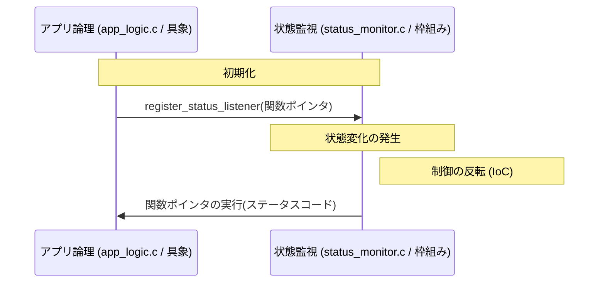
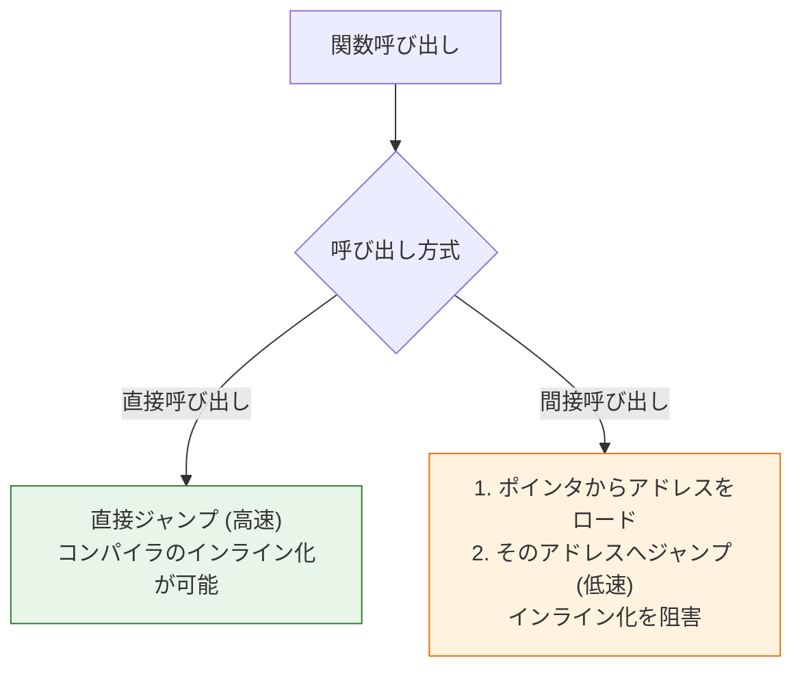

### 2.4. 活用パターン 4: コールバック設計と制御の反転（IoC）

### システム概要

**目的**: システムの状態変化（ステータス変更など）を、特定のモジュールに依存することなく、関心のある他のモジュールへ通知する。
**機能**:

1. リスナー（コールバック関数）の登録
2. 状態変化時の通知（リスナーの呼び出し）
**アーキテクチャ**: 監視モジュール（Monitor）が枠組みを提供し、アプリ側が具体的な処理を注入するIoC構造。

### 設計の意図

上位モジュール（監視側）が下位モジュール（アプリ側）を直接呼び出すと、密結合になります。コールバックを使うことで、監視側は「誰を呼ぶか」を知る必要がなくなり、アプリ側も自由に処理を登録できるようになります。これが「制御の反転（IoC）」です。

### 制御の反転フロー

**この図が示すもの**:
通常とは逆の呼び出し方向（下位から上位へ登録し、上位から下位へ通知）がどのように行われるかのシーケンスです。

**注目ポイント**:

* **登録**: アプリ側から監視側へ関数ポインタを渡しています。
* **通知**: 監視側は登録されたポインタを実行するだけで、具体的な処理内容は知りません。

**読み方のガイド**:

* 時間軸（上から下）に沿って、依存と実行の逆転を確認してください。



### status_monitor.h

状態変化を通知するための「枠組み（Framework）」を定義しています。
**処理の内容:** コールバック関数の型定義 (`StatusChangeCallback`) と、リスナー登録関数、通知発行関数のプロトタイプ宣言を行っています。
**設計的意図:** 呼び出される側の関数の形式（シグネチャ）を厳密に定義することで、どのような関数でも登録できるわけではなく、この「契約」を満たす関数だけがリスナーになれることを保証しています。
**評価:** 典型的な Observer パターンのインターフェース定義です。

#### status_monitor.h
```c
#ifndef STATUS_MONITOR_H
#define STATUS_MONITOR_H

// 設計意図: コールバック関数の契約（Listenerの抽象インターフェース）
typedef void (*StatusChangeCallback)(int status_code);

// 外部に公開される登録API (依存注入の窓口)
void register_status_listener(StatusChangeCallback callback);
// 外部に公開される通知API (枠組みの実行主体)
void notify_status_change(int new_status);

#endif // STATUS_MONITOR_H
```

### status_monitor.c
状態監視を行い、変化があれば登録されたリスナーへ通知を送るモジュールです。
**処理の内容:** `static` 変数 `g_listener_func` に登録された関数ポインタを保持し、`notify_status_change` が呼ばれた際にそのポインタを実行しています。
**設計的意図:** もしリスナーが登録されていなければ何もせず、登録されていれば呼び出すという、IoC（Inversion of Control）の核心部分です。このモジュールは「誰が」登録されているかを一切知りません。
**評価:** 呼び出し先の実装への依存が完全に排除されており、高い独立性を保っています。

#### status_monitor.c
```c
// status_monitor.c
#include "status_monitor.h"
#include <stdio.h>

// 具象実装：登録されたコールバック関数を保持する（内部状態 - staticによる隠蔽）
static StatusChangeCallback g_listener_func = NULL;

void register_status_listener(StatusChangeCallback callback)
{
    // 依存注入/結合：Listenerの具象ロジックのアドレスを受け取る
    g_listener_func = callback;
}

void notify_status_change(int new_status)
{
    if (g_listener_func != NULL) {
        // **IoCポイント**: MonitorがListenerのロジックを呼び出す
        printf("[Monitor] 状態変化を通知します: %d\n", new_status);
        g_listener_func(new_status); // 具体が呼ばれる
    } else {
        printf("[Monitor] Listenerが登録されていません。\n");
    }
}
```

### app_logic.c
通知を受け取る具体的なアプリケーションロジックの実装です。
**処理の内容:** `status_monitor.h` で定義された `StatusChangeCallback` の型に適合する2つの関数を実装しています。
**設計的意図:** 監視モジュールのルール（インターフェース）に従って実装されていますが、監視モジュールへの静的な依存（`include`）は必要ありません。シグネチャさえ合えばどこにでも定義可能です。
**評価:** ビジネスロジックがフレームワークから独立してテスト可能になります。

#### app_logic.c
```c
#include <stdio.h>

void handle_status_update_v1(int status_code)
{
    printf("  [Listener V1] 状態コード %d を検知しました。\n", status_code);
}

void handle_status_update_v2(int status_code)
{
    printf("  [Listener V2] 状態コード %d を検知し、システムを停止します。\n", status_code);
}
```

### main.c
IoC の動作確認を行うクライアントコードです。
**処理の内容:** アプリケーションロジック (`handle_status_update_...`) を、監視モジュール (`status_monitor`) に登録し、通知イベントをトリガーさせています。
**設計的意図:** 依存の注入（Dependency Injection）を `register` 関数を通じて行っています。「監視側」と「アプリ側」を動的に結びつける接着剤の役割を果たしています。
**評価:** システムの構成要素を疎結合に保ちつつ、必要な連携を実現できています。

#### main.c
```c
#include "status_monitor.h"
#include <stdio.h>
#include <stdlib.h>

// app_logic.cで定義された関数をextern宣言
extern void handle_status_update_v1(int status_code);
extern void handle_status_update_v2(int status_code);

int main(void)
{
    printf("[main] 処理開始: 制御の反転（IoC）テスト\n");
    
    // 1. 具象ロジックV1を注入し、状態変化を通知
    register_status_listener(handle_status_update_v1);
    printf("--- Listener V1 注入（状態1を通知）---\n");
    notify_status_change(1); // MonitorがV1を呼び出す

    // 2. 具象ロジックV2に切り替え、別の状態変化を通知
    register_status_listener(handle_status_update_v2);
    printf("\n--- Listener V2 に切り替え（状態2を通知）---\n");
    notify_status_change(2); // MonitorがV2を呼び出す
    
    printf("\n[main] 処理終了。\n");
    return EXIT_SUCCESS;
}
```

### 実行結果

登録した関数（V1, V2）に応じて、Monitorからの通知に対する反応が変わっていることが確認できます。

#### 実行結果
```c
[main] 処理開始: 制御の反転（IoC）テスト
--- Listener V1 注入（状態1を通知）---
[Monitor] 状態変化を通知します: 1
  [Listener V1] 状態コード 1 を検知しました。

--- Listener V2 に切り替え（状態2を通知）---
[Monitor] 状態変化を通知します: 2
  [Listener V2] 状態コード 2 を検知し、システムを停止します。

[main] 処理終了。
```

## 3. 設計判断と落とし穴のまとめ

関数ポインタは強力な動的結合の道具ですが、設計的判断と**トレードオフ**が伴います。

### 呼び出しコストの比較

**この図が示すもの**:
直接呼び出しと間接呼び出し（関数ポインタ）の処理コストと特性の違いです。

**注目ポイント**:

* **トレードオフ**: 柔軟性を得られる反面、最適化（インライン化）が効きにくくなるというデメリットがあります。

**読み方のガイド**:

* 分岐による比較。



### **可読性の低下**

* **判断**：関数ポインタを経由した呼び出しは、コードを追うのが難しくなり、**デバッグ**が困難になる。
* **対策**：**抽象化の徹底**: 関数ポインタの定義には必ず`typedef`を使用し、**VTable**や**コールバック**という抽象パターンに閉じ込める。抽象名をドメイン固有の言葉（例: `Comparator`）にする。

### **実行時オーバーヘッド**

* **判断**：関数ポインタによる間接呼び出しは、コンパイラによる**インライン化（関数の埋め込み最適化）を阻害します。** また、現代のCPUでは「分岐予測」が効きにくくなる場合があり、直接呼び出しに比べるとわずかなオーバーヘッドが生じます。
* **対策**：**戦略的な配置**: 数ナノ秒を争う極めてタイトなループ内での多用は慎重になるべきですが、それ以外の場所では**保守性の向上というメリットが勝ります。** 依存性の切断が求められるモジュールの**境界**を中心に、効果的に配置しましょう。

### **メモリリーク**

* **判断**：VTableパターンで動的に作成された構造体の**解放する責任**が不明確になりがち。
* **対策**：**リソースの責任の明確化**: リソースの**所有権**と**解放責任**をどこかのモジュールに一元的に割り当てる（**第7章 メモリ管理パターン**で詳述）。

## 本章で必ず理解してほしいことのまとめ

### 関数ポインタの設計上の役割

### 1. **動的な依存の切断と制御を実現する道具である**:

* プログラム実行中に**呼び出し先の振る舞い**を**切り替える**ことを可能にし、静的に固定された結合（**依存**）から解放し、システムに**動的な柔軟性**と**拡張性**を与える。

### 2. **抽象化のC言語的手段を構成する**:

* 関数ポインタを`typedef`することで、`Comparator`や`LogFunc`のような**抽象契約（インターフェース）** を定義できる。複数の関数ポインタを`struct`にまとめる**VTableパターン**は、C言語で**ポリモーフィズム**の基礎を物理的に実現する。

### 3. **制御の反転 (IoC) の基盤である**:

* コールバック設計を通じて、**処理枠組み**を提供するモジュールが、**具体的なロジック**を提供するモジュールに**依存しなくなる**。これが**疎結合**と**拡張性**の鍵となる。

### 次章への橋渡し

**第2章**で**関数ポインタ**という「振る舞いを抽象化し、動的に依存を制御する道具」を手に入れました。

しかし、これらの抽象的なインターフェース（**VTable**）を利用する際、**データの実体**が外部に露出していると、モジュールの**結合度**が再び高まってしまいます。データ構造がヘッダファイルにすべて公開されていると、実装の詳細が外部に漏れ、変更に対する脆弱性が残ります。

次章では、データとそれを操作するロジックの**責任**を統合する最も基本的な道具である**第3章 構造体設計とコンポジション - データと責任の統合**を学び、その後、データ構造の実体を隠蔽する技術である**第4章 不完全型と不透明ポインタ**へと進みます。