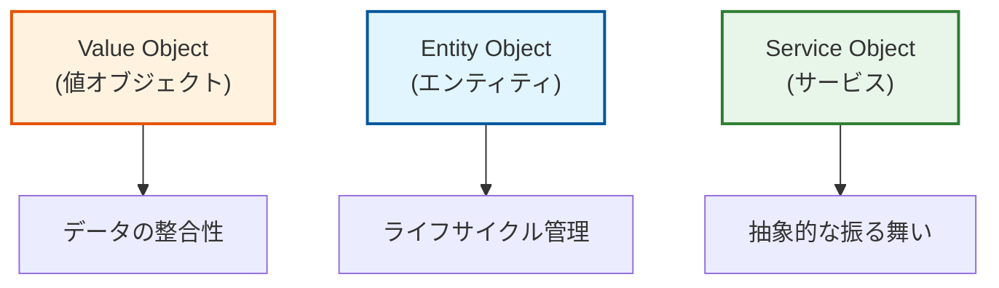
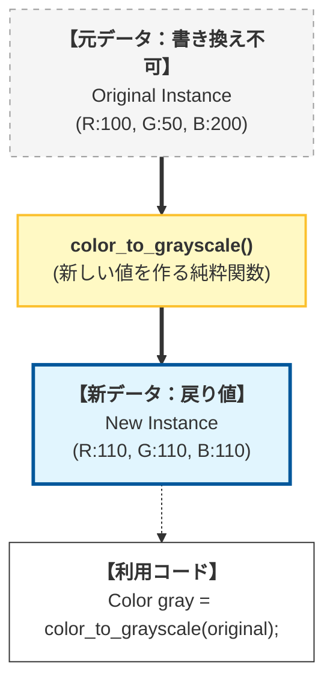
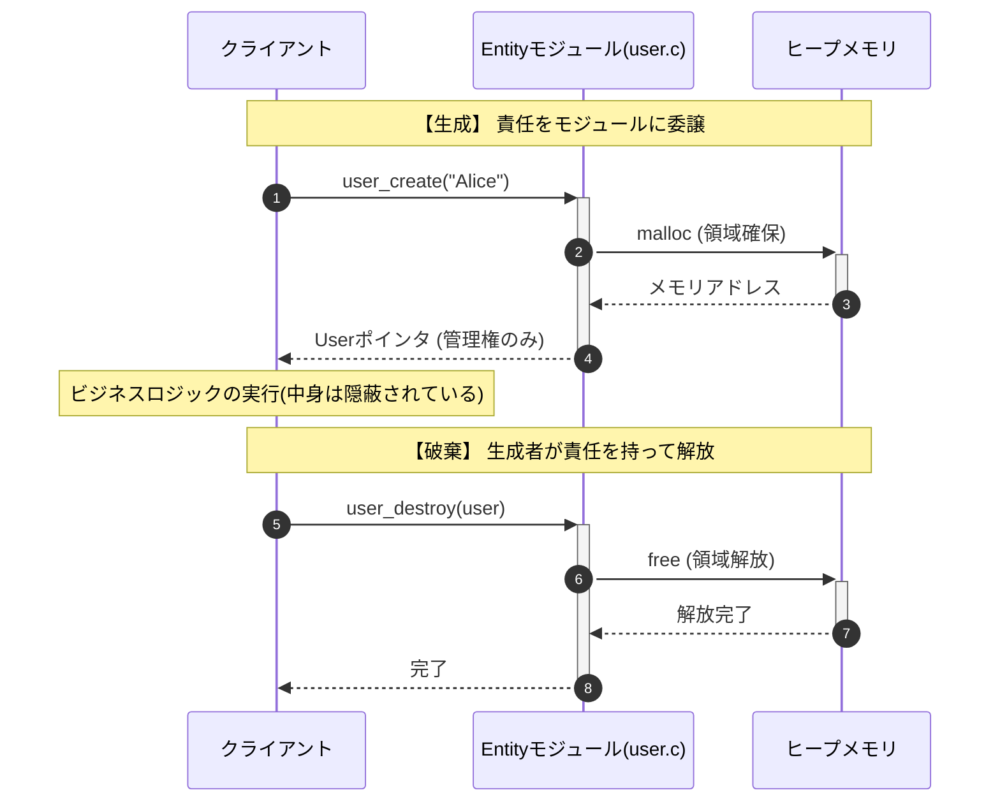
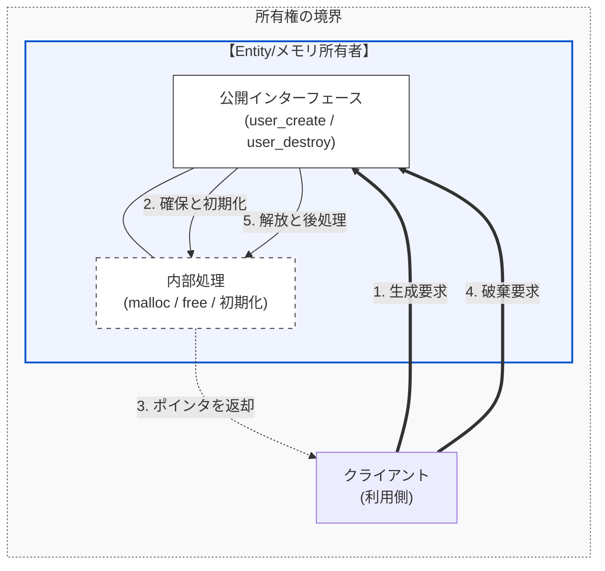
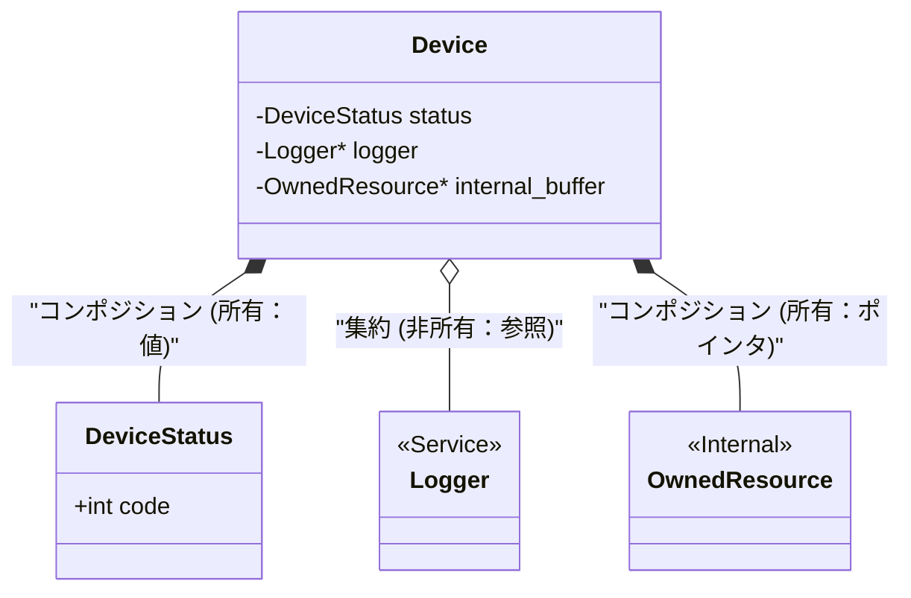

# 第1部 第3章 構造体設計とコンポジション - データと責任の統合
## 1. 章の目的と設計的視点

#### データ設計における責任の明確化

これまでは、`static`による **情報隠蔽** （責任の局所化）と、第2章で扱った関数ポインタによる **動的結合** （契約を通じた依存の切断）について学んできました。これらは主に「 **責任** 」と「 **振る舞い** 」を制御するための道具でした。

本章で学ぶ **構造体設計** は、設計の三本柱（責任・契約・依存）のうち、 **「責任」** 、とりわけ「データ自身が持つべき責任」を明確にするための重要な土台となります。C言語の`struct`（構造体）に焦点を当て、データの意味やライフサイクルに基づいて、構造体を体系的に設計する方法を解説します。

#### 構造体の三つの設計分類（概要）

構造体設計の真の目的は、単に関連するデータをひとまとめにすることではありません。その **構造体のインスタンスが、どのような「責任」と「変更理由」を持つべきか** を明確に定義することにあります。本書では、 **設計上の役割** と **ライフサイクル** の観点から、構造体を以下の三つに分類して考えます。

この分類ごとの考え方は、後ほど解説する **第8章 単一責任原則 (SRP)** を実践する上で、非常に重要なステップとなります。

#### データオブジェクトの分類

構造体を役割に応じて3種類（Value, Entity, Service）に分類する考え方です。それぞれが管理すべき「責任」が異なります（値の整合性 vs ライフサイクル管理 vs 振る舞い）。

*   **Value Object (値オブジェクト)**　データの整合性を重視します。
*   **Entity Object (エンティティ)**　ライフサイクル管理を重視します。
*   **Service Object (サービス)**　抽象的な振る舞いを重視します。



#### オブジェクトの役割と設計の指針

ソフトウェアを構成するオブジェクトは、その役割や特性に応じて大きく3つの型に分類できます。これらを適切に使い分けることが、設計の三本柱（責任・契約・依存）を正しく構築する鍵となります。

#### 1. Value Object（値オブジェクト）：属性を表現する「不変」の存在

Value Objectは、座標、色、時間といった「測定値や属性値」を保持するためのオブジェクトです。その役割を「純粋な値の保持」に限定します（ **SRP：単一責任原則** ）。

最大の特徴は、中身の **「値（内容）」が同じであれば同一** とみなす点です。設計においては、一度作成したら中身を書き換えず、新しい値が必要なら「新しい構造体」を生成する **不変性（Immutable）** を志向します。これにより、予期せぬ場所でデータが書き換えられる副作用を防ぎ、コードの予測可能性を高めることができます。

#### 2. Entity Object（エンティティ）：寿命を管理する「意志」ある実体

Entityは、ユーザーやデバイスなど、独自のライフサイクル（生成・変更・破棄）を持つ実体を表します。その役割を「状態の管理」に限定します（ **SRP：単一責任原則** ）。

値が変化しても、メモリ上の **「アドレス」や「識別子（ID）」** が同じであれば同一の存在として扱います。設計においては、本書第7章で扱う「メモリ管理」において、 **「誰が生成し、誰が破棄するか」という所有権とライフサイクルの責任** を明確に定義することが最も重要になります。

#### 3. Service Object（サービスオブジェクト）：機能を仲介する「抽象的な」存在

Service Objectは、ロガーやVTable（仮想関数テーブル）のように、具体的な処理やロジックを提供します。内部の実装詳細を隠蔽し、外部に対しては「振る舞い」のみを公開します（ **DIP：依存性逆転原則** ）。

特定のデータ内容ではなく、提供される機能（インターフェース）によって定義されます。第2章の関数ポインタや第4章の不完全型を組み合わせることで、呼び出し元に対して「どう実装されているか」という詳細を完全に隠し、 **「何をするか」という契約だけを保証** します。これにより、テスト容易性と実装の差し替え自由度を確保します。

#### まとめ：設計の視点

*   **Value Object**  は「保持する責任」
*   **Entity**  は「管理する責任」
*   **Service Object**  は「提供する契約」

このように、各オブジェクトが担う「責任」の所在と「契約」の形を常に意識することで、C言語による設計は、より堅牢で変更に強いものへと洗練されていくのです。本章は、主にデータの **責任** の明確化、特に **Value Object** と **Entity Object** の設計と、それらを組み合わせる **コンポジション** （合成）に焦点を当てます。


> [!NOTE] 読者の疑問：全部同じ構造体に書いちゃうのと何が違うの？
> 「関連するデータをまとめるのが目的なら、1つの巨大な構造体に全部の変数をフラットに書いてしまうのとは何が違うの？」
>
> C言語でよく見られるアンチパターンに、システム中のあらゆるデータを1つの巨大な構造体（通称「神オブジェクト」）に詰め込んでしまう設計があります。例えば `struct AppContext` の中に `user_name` も `db_connection_status` も `screen_width` もすべてフラットに押し込むような状態です。
> この設計の最大の問題は、 **構造体のメンバが見えてしまうこと自体** にあります。メンバが公開されていれば、どのモジュールからでもそのフィールドを直接読み書きできてしまいます。これは実質的にグローバル変数をアクセスするのと変わりません。結果として、不要なモジュールが他者のデータに依存し、あるフィールドの意味や型を変更しただけで、本来無関係であるはずのモジュールにまで芋づる式に修正が波及してしまうのです。
> ここから解説する「コンポジション」は、この巨大な構造体を意味のある「小さな責任の塊」に分割し、安全なブロック遊びのように組み合わせるための技術です。そして第4章で学ぶ「不完全型」を使えば、構造体の中身そのものを外部から完全に隠すことも可能になります。

#### コンポジション（合成）とは

実装イメージとしては、ある構造体が別の構造体を「メンバ変数として持つ」ことを指します。これにより、小さな部品を組み合わせて大きな機能を作ることができます。

特に重要なのは、「親が破棄されるときは、子も運命を共にする」という **強い所有権の関係** が生まれる点です。これは、後の「ライフサイクル管理」において極めて重要な意味を持ちます。

## 2. 構造体の具体的な活用パターン

### 2.1. 活用パターン 1: Value Objectの設計（不変性の実現）

最初のパターンは、値として扱われるデータをまとめる **Value Object** の設計です。座標や金額など「意味を持つ値のかたまり」を構造体で表現し、不変性を保つことで意図しない変更による不具合を防ぎます。

#### システム概要

色情報（RGB）を扱うシステムにおいて、色の計算や変換を行うケースです。このシステムは以下の機能を提供します。

*   **色の生成**
*   **グレースケール変換**
*   **色の比較**
*   **データを不変（Immutable）として扱い、副作用のない関数で操作する**　

#### 設計課題

「色などの単なる値」をグローバル変数や書き換え可能な構造体として管理すると、あるモジュールが「明るさを変える」ためにRGB値を直接変更した結果、別のモジュールで表示していた元の色まで意図せず書き換わってしまうという、深刻な副作用を引き起こします。プログラムの規模が大きくなるほど、誰がどこで値を変えたのかを追跡することは困難になります。

#### 設計の意図

このような副作用を排除するため、本来、色は一度定義されたら変化しない「値（Value Object）」として扱います。「赤」というオブジェクトの中身を書き換えて「青」にするのではなく、「青」という新しいオブジェクトを生成するべきなのです。この **不変性（Immutable）** の規約を設けることで、データを変更の恐怖から解放し、複数のモジュール間で安心して共有・再利用できるようになります。

#### 不変オブジェクトの操作フロー

元のインスタンス（V1）を変更せず、新しいインスタンス（V2）を生成して返す「副作用のない操作」の流れです。

*   **書き換え不可**　V1は点線で示され、変更されないことを表しています。
*   **新規生成**　`color_to_grayscale` は新しいメモリ領域（V2）を確保して返します。

V1がOpに入力され、V2が出力される、上から下へのデータの流れです。



#### Value Objectの構造体定義（値と操作の契約）

Value Objectとしての構造体定義と、その操作関数のインターフェースです。`Color` 構造体を定義し、生成、変換、比較の関数を宣言しています。

`Color` 構造体は「値」を表現するため、メンバ変数（R, G, B）は隠蔽せず公開しています（Value Objectの特性）。変換関数 `color_to_grayscale` は、元の値を変更するのではなく、 **新しい値を返す** ように宣言されており、不変性を意図しています。安全で予測可能な値の操作を実現する契約です。

#### color.h
```c
#include <stdint.h>
#include <stdbool.h>

// 抽象契約：Value Objectの構造体定義 (値と属性の保持に単一責任を持つ)
typedef struct {
    uint8_t r;
    uint8_t g;
    uint8_t b;
} Color;

// コンストラクタ（値を設定して初期化）
Color color_create(uint8_t r, uint8_t g, uint8_t b);

// 変更が必要な場合：元のColorは変更せず、新しいインスタンスを返す (不変性を保証する契約)
Color color_to_grayscale(Color original);

// 値の比較
bool color_equals(Color a, Color b);
```

#### コンストラクタ（値の生成）

Value Objectに対する副作用のない操作の実装です。まず、オブジェクトを生成するコンストラクタです。

指定されたRGB値を持つ `Color` 構造体を返します。単純な初期化ですが、関数として提供することで構造体の内部表現が変わってもクライアントコードを守ることができます。生成の責任をこの関数に集約しています。

#### color.c
```c
#include "color.h"
#include <stdio.h>

Color color_create(uint8_t r, uint8_t g, uint8_t b)
{
    Color c = {r, g, b};

    return c;
}
```

#### 不変性を保証するデータ操作

不変性を保った変換ロジックです。引数として渡された構造体を変更せず、計算結果を新しい構造体として返しています。

 **不変性（Immutability）** の実現です。関数が副作用を持たないため、並行処理やデータの共有が安全に行えます。堅牢なデータモデルの実装例です。

#### color.c
```c
// original構造体を内部で変更しない設計契約
Color color_to_grayscale(Color original)
{
    // C言語の仕様（整数昇格）により uint8_t 同士の計算は int になりますが、
    // 「255 * 3 = 765」が uint8_t の範囲を超えることを意識し、
    // 意図を明確にするために明示的に int 型を使用しています。
    int sum = (int)original.r + (int)original.g + (int)original.b;
    uint8_t avg = (uint8_t)(sum / 3);

    // 変更後の値を持つ新しい構造体を生成して返す
    Color new_color = color_create(avg, avg, avg);

    return new_color;
}
```

#### 値に基づく等価性の判定

最後に、値の比較を行う関数です。2つのColorオブジェクトの全メンバが一致するかを確認します。

アドレスではなく「中身の値」で等価性を判断する、Value Objectの根本的な性質を実装しています。意図通りの等価性判定を提供しています。

#### color.c
```c
bool color_equals(Color a, Color b)
{
    return (a.r == b.r) && (a.g == b.g) && (a.b == b.b);
}
```

#### Value Objectの不変性の確認（クライアント側）

Value Objectを利用するクライアントコードです。まず、Value Objectの特性を確認する関数です。

元の `Color` オブジェクトと変換後のオブジェクトが別物であることを確認しています。不変オブジェクトを使うことで、元のデータがいつの間にか変わってしまうというバグを防げることを示しています。安心してデータを扱える設計効果が表れています。

#### client.c
```c
#include "color.h"
#include <stdio.h>
#include <stdlib.h>

void use_color_object(void)
{
    // Value Objectの生成
    Color primary = color_create(255, 0, 0);
    printf("Original: R=%d\n", primary.r); // 255

    // Value Objectの操作: original(primary)は不変性が保たれる
    Color gray = color_to_grayscale(primary);

    // 変更が起きていないことの確認
    printf("After Grayscale: Original R: %d, Gray R: %d\n", primary.r, gray.r);

    Color another_red = color_create(255, 0, 0);
    if (color_equals(primary, another_red)) {
        printf("PrimaryとAnother_Redは同じ値です。\n");
    }
}
```

#### エントリポイント

続いて、エントリポイントです。テスト関数を実行します。責務の分離がされています。

#### client.c
```c
int main(void)
{
    use_color_object();

    return EXIT_SUCCESS;
}
```

#### 変換による不変性の実行結果

グレースケール変換後も元の `primary` の値（R=255）が維持されており、不変性が保たれていることがわかります。

#### 実行結果
```c
Original: R=255
After Grayscale: Original R: 255, Gray R: 85
PrimaryとAnother_Redは同じ値です。
```

### 2.2. 活用パターン 2: Entity Objectのライフサイクル管理（責任の単一化）

次は、アイデンティティを持ち生存期間が管理される **Entity Object** のパターンです。生成・操作・破棄というライフサイクルの責任を一つのモジュールに集約することで、リソース管理の漏れや二重解放を防ぐ設計を実現します。

#### システム概要

ユーザー情報を管理するシステムにおいて、ユーザーオブジェクトの生成から破棄までのライフサイクルを安全に管理するケースです。

*   **ユーザーの生成（メモリ確保と初期化）**
*   **ユーザーの破棄（メモリ解放）**
*   **メモリ管理の責任をEntityモジュールに集約し、クライアントから隠蔽する**　

#### 設計課題

C言語において最も頻発するバグの一つが、メモリリークと不正アクセスです。クライアント側のコードの至る所で `malloc` と `free` を直接呼び出す設計では、「誰がメモリを確保し、誰が解放の責任を持つのか」という所在が曖昧になります。結果として、解放忘れによるメモリ枯渇や、既に解放された領域へのアクセス（Dangling Pointer）といった致命的な欠陥を生み出しやすくなります。

#### 設計の意図

この問題を解決するため、Entity（「同一性」と「寿命」を持つオブジェクト）の生成（`create`）と破棄（`destroy`）をワンセットのAPIとして提供します。その内部で `malloc`/`free` の詳細を完結・隠蔽させることで、メモリ管理の責任をEntityモジュール内に単一化し、クライアント側の負担とメモリリークのリスクを大幅に低減させます。

#### ライフサイクル管理シーケンス

クライアントがEntityモジュールに対して生成と破棄を依頼し、モジュールがヒープメモリの操作を代行する流れです。

*   **隠蔽**　クライアントは `malloc/free` を直接呼び出しません。
*   **責任の所在**　メモリの確保と解放は、Entityモジュールが一手に引き受けています。

時間軸（上から下）に沿って、生成から破棄までのライフサイクルを追ってください。



#### Entityの構造体定義（責務の集約）

Entity Objectのインターフェースと、ライフサイクル管理APIの定義です。`User` 構造体と、`user_create`, `user_destroy` 関数を宣言しています。

構造体の中身を見せていますが、本来Entityは中身を隠すべき（不完全型）です（注釈にもある通り）。重要なのは `create` と `destroy` のペアを提供し、利用者が直接 `malloc` / `free` しなくて済むように設計している点です。メモリ管理の責任をモジュール側に引き寄せるための第一歩となる設計です。

#### user.h
```c
#ifndef USER_H
#define USER_H

// 抽象契約：Entity Objectの構造体定義
// ※本来は隠蔽すべき詳細ですが、本章では構造と責任の関係を可視化するため公開しています。
// 次章「不完全型」で、この内部構造を隠蔽する方法を学びます。
typedef struct {
    char name[100];
    int id;
} User;

// ファクトリ関数：メモリ確保と初期化の責任を持つ
User* user_create(const char* name);

// 破棄関数：メモリ解放の責任を持つ
void user_destroy(User* user);
#endif // USER_H
```

#### 生成の責務（ライフサイクルの開始）

ライフサイクル管理の実装です。まず、生成の責任を持つ関数です。

`create` で `malloc` し、初期化を行います。メモリ操作という危険で低レベルな処理をこの関数内に閉じ込め、外部には安全なAPIだけを提供しています。生成に関する責任が単一化されています（SRP）。

#### user.c
```c
#include "user.h"
#include <stdlib.h>
#include <string.h>
#include <stdio.h>

// メモリ確保と初期化の責任をこの関数に単一化
User* user_create(const char* name)
{
    User* u = (User*)malloc(sizeof(User));

    if (u == NULL) return NULL;
    // 初期化処理
    strncpy(u->name, name, 99);
    u->name[99] = '\0';
    u->id = 1;

    printf("[user.c] User '%s' 生成 (%p)\n", name, (void*)u);

    return u;
}
```

#### 破棄の責務（ライフサイクルの終了）

次に、破棄の責任を持つ関数です。`user_destroy` で `free` しています。
解放漏れを防ぐため、確保したモジュール自身が解放の手順を提供します。NULLチェックなどもここで行います。安全なリソース解放を保証しています。

#### user.c
```c
// メモリ解放の責任をこの関数に単一化
void user_destroy(User* user)
{
    if (user != NULL) {
        printf("[user.c] User %p の free実行\n", (void*)user);
        free(user); // 最後に自身を解放
    }
}
```

#### クライアントからのライフサイクル管理

Entityのライフサイクルに従うクライアントコードです。まず、Entityを利用する関数です。

安全なAPI (`user_create`, `user_destroy`) を使って Entity を扱っています。`malloc`/`free` の呼び出し忘れや二重解放といったミスを防ぐため、モジュールが提供するライフサイクル関数を利用しています。安全なリソース利用の模範的なコードです。

#### client.c
```c
#include "user.h"
#include <stdio.h>
#include <stdlib.h>

void use_user_entity(void)
{
    printf("--- use_user_entity 開始 ---\n");

    // Entity Objectの生成（抽象実行）
    User* active_user_alice = user_create("Alice");

    if (active_user_alice != NULL) {
        // 破棄の責任（抽象実行）：クライアントは「破棄の契約」のみを果たす
        user_destroy(active_user_alice);
    }
    printf("--- use_user_entity 終了 ---\n");
}
```

#### エントリポイント

続いて、エントリポイントです。利用関数を呼び出します。

#### client.c
```c
int main(void)
{
    use_user_entity();

    return EXIT_SUCCESS;
}
```

#### 所有権の境界イメージ

クライアントとEntityモジュールの間にある「責任の境界線」です。

*   **モジュール**　メモリの所有者であり、管理責任を持ちます。
*   **クライアント**　利用者であり、生成・破棄の「依頼」のみを行います。

境界線（点線）を挟んで、役割が分担されている様子。



#### メモリ管理の実行結果

生成と破棄が対で行われ、メモリが正しく管理されていることがログから確認できます。※ `0x...`の部分は実行ごとに異なるメモリアドレスが入ります。

#### 実行結果
```c
--- use_user_entity 開始 ---
[user.c] User 'Alice' 生成 (0x...)
[user.c] User 0x... の free実行
--- use_user_entity 終了 ---
```

#### Entity Objectの設計ポイント

*   **責任の集約**　`malloc`と`free`の詳細をモジュール内に閉じ込める
*   **抽象契約**　クライアントは`create`/`destroy`のみに依存
*   **ライフサイクルの明確化**　生成者が破棄の責任を持つ

> [!NOTE] 発展的なメモリ管理パターン
> 本節では、Entity Objectの **基本概念** を示しました。実際のシステムでは、以下のような複雑な状況に対処する必要があります。
> *   複数の内部リソースを持つEntity（例：バッファ、ファイルハンドル、ネットワーク接続）
> *   リソース確保中のエラーに対する安全なロールバック処理
> *   所有権の明示的な管理（移譲・参照・生成の区別）
>
> これらの **体系的なメモリ管理パターン** については、 **第7章「メモリ管理パターン」** で詳しく学びます。

### 2.3. 活用パターン 3: コンポジションと所有権に基づくリソース解放責任

3つ目は **コンポジション（組み合わせ）** を用いた設計パターンです。大きな構造体を意味のある小さな責任の塊に分割して組み合わせることで、リソースの所有権と解放責任を明確に定義します。

#### システム概要

複数の部品（内部リソース、外部リソース、値オブジェクト）を組み合わせて、一つのデバイスEntityを構成するケースです。

*   **デバイスの生成（内部リソースの確保と外部リソースの紐付け）**
*   **デバイスの破棄（所有しているリソースのみ解放）**
*   **親Entityが子要素のライフサイクルを管理するコンポジション構造**　

#### 設計課題

「構造体が別の構造体を持つ（合成する）」というコンポジションにおいて、最大の課題となるのが「誰がそのサブリソースを解放するのか？」という所有権の境界線です。親構造体が破棄される際、内部で確保したメモリはもちろん解放すべきですが、外部から渡された「ロガーへのポインタ」まで一緒に解放してしまうと、そのロガーを共有している他のシステムがクラッシュしてしまいます。つまり、「所有しているもの」と「単に参照しているもの」を明確に区別して管理しなければなりません。

#### 設計の意図

この複雑なリソース管理の境界を明確にするため、ここでは「自分が作ったもの（所有）は自分で解放し、人から借りたもの（参照）には手を出さない」という所有権の原則をコード上で明確に表現します。構造体のメンバ定義と破棄関数（destroy）のロジックを呼応させることで、複雑な合成オブジェクトであっても安全なライフサイクル管理を実現します。

#### コンポジションと所有権の関係

Deviceクラスが持つ3種類のメンバ（Status, Logger, Buffer）との関係性と、それぞれの所有形態です。

*   **コンポジション (所有)**　`DeviceStatus` と `OwnedResource` はDeviceの一部であり、Deviceと共に運命を共にします。
*   **集約 (参照)**　`Logger` は外部から借りてきたものであり、Deviceが消えても生き残ります。

菱形の種類（黒＝所有、白＝参照）に注目してください。



#### コンポジション構造を持つEntityの定義

コンポジションと集約（参照）が混在するEntityの定義です。`Device` 構造体の中に、値としてのメンバ（`DeviceStatus`）、所有するポインタ（`Buffer`）、参照するだけのポインタ（`Logger`）を定義しています。

メンバ変数の持ち方によって「所有権」が異なることを表現しています。構造体を見るだけでリソースの関係性が推測できる設計ですが、コメントによる補足も重要です。以下は、このEntityのライフサイクルを管理する関数群の宣言です。

#### device.h
```c
#ifndef DEVICE_H
#define DEVICE_H

// 外部で定義されるService Object (前方宣言)
typedef struct Logger Logger;

// 内部リソースの型 (本来は隠蔽すべき詳細ですが、構造体公開のためここに配置)
typedef struct {
    int data;
} OwnedResource;

// Value Object
typedef struct {
    int code;
} DeviceStatus;

// Device Entityの実体定義（メンバが見えている状態）
typedef struct {
    // 1. 値ベース: 構造体に埋め込まれたValue Object
    DeviceStatus status;

    // 2. 非所有ポインタ: 外部リソースへの参照（依存）
    Logger* logger;

    // 3. 所有ポインタ: 動的に確保された内部リソース
    OwnedResource* internal_buffer;
} Device;

// ファクトリ関数（依存性の注入と所有リソースの生成）
Device* device_create(Logger* logger);

// 破棄関数（所有権に基づいた解放）
void device_destroy(Device* dev);
#endif // DEVICE_H
```

#### 所有権に基づいた生成の実装

所有権に基づいた生成と破棄の実装です。まず、生成関数です。

`malloc` で自身のメモリを確保し、子要素の初期化（値・参照・所有）を行います。自身の所有するリソース（`internal_buffer`）については責任を持って確保し、失敗時の巻き戻しもここで行います。複雑な初期化手順を隠蔽し、整合性のある状態でのみオブジェクトを返却する設計です。

#### device.c
```c
#include "device.h"
#include <stdlib.h>
#include <stdio.h>

// 内部リソースの破棄ヘルパー
static void owned_resource_destroy(OwnedResource* res)
{
    if (res != NULL) free(res);
}

// 生成における所有権の定義
Device* device_create(Logger* logger)
{
    Device* dev = (Device*)malloc(sizeof(Device));

    if (!dev) return NULL;

    // 1. 値ベース: 値を設定して初期化（Deviceの一部として存在）
    dev->status.code = 0;

    // 2. 非所有ポインタ: 外部から渡された参照を保持するだけ（生成責任は持たない）
    dev->logger = logger;

    // 3. 所有ポインタ: 内部で生成し、このDeviceが排他的な責任を持つ
    dev->internal_buffer = (OwnedResource*)malloc(sizeof(OwnedResource));

    if (!dev->internal_buffer) {
        free(dev); // 失敗時は巻き戻し（原子性の保証）

        return NULL;
    }

    dev->internal_buffer->data = 100;

    printf("[Device] 生成完了。内部バッファを所有し、Loggerを参照しています。\n");

    return dev;
}
```

#### 自身の所有物だけを解放する破棄処理

次に、破棄関数です。自身の所有するリソース（`internal_buffer`）を解放し、最後に自身を解放します。

 **「作った者が後始末をする」** という原則の徹底です。親オブジェクト（Device）が破棄されるとき、自分が所有している子オブジェクトも道連れにしますが、他人のもの（`logger`）には手を出しません。リソースリークを防ぐための明確な所有権モデルを示しています。

#### device.c: 破棄
```c
// 破棄における所有権に基づいたリソース解放
void device_destroy(Device* dev)
{
    if (dev != NULL) {
        // 3. 所有権を持つリソースの解放: 自分で作ったものは自分で片付ける
        if (dev->internal_buffer != NULL) {
            owned_resource_destroy(dev->internal_buffer);
            printf("[Device] 内部バッファ(所有)を解放しました。\n");
        }

        // 2. ロガーは非所有ポインタのため解放しない
        // (外部で作られたものなので、外部に任せる)

        // Device本体の解放
        free(dev);
        printf("[Device] Device本体を解放しました。\n");
    }
}
```

#### 異なる寿命を持つオブジェクト同士の利用

このコンポジション構造を利用するコードです。`device_destroy` を呼んでも、注入した `dummy_logger` は破壊されないことを示しています。

リソースの寿命が異なるオブジェクト同士を組み合わせる際の、正しい生存期間管理を示しています。所有権の境界を意識した正しい実装です。

#### client.c
```c
// ※本来は Logger の定義が必要ですが、ここではポインタとしての扱いを示すため省略形とします
#include "device.h"
#include <stdio.h>
#include <stdlib.h>

// ダミーのLogger（外部リソースと見なす）
// mainの外で定義することで、device.hのtypedefと整合させる（あるいは不完全型を解決する）
struct Logger { int placeholder; };

int main(void)
{
    Logger dummy_logger;

    // 生成: 外部リソース(Logger)を注入
    Device* dev = device_create(&dummy_logger);

    if (dev != NULL) {
        // 破棄: Deviceとその所有物だけが消える
        device_destroy(dev);
    }
    // dummy_loggerはここでまだ生きている（Deviceに所有されていないため）

    return 0;
}
```

#### 参照リソースが解放されないことの確認

Device本体と内部バッファは解放されていますが、Loggerに関する解放ログが出ていないことから、適切に管理されていることがわかります。

#### 実行結果
```c
[Device] 生成完了。内部バッファを所有し、Loggerを参照しています。
[Device] 内部バッファ(所有)を解放しました。
[Device] Device本体を解放しました。
```

#### コンポジションの設計ポイント

#### 所有権の三つのパターン

**値ベースメンバー（`DeviceStatus status`）**: 構造体に直接埋め込まれるデータです。そのため、親の構造体が破棄される際に自動的に解放され、特段の明示的な解放処理は不要となります。

**所有ポインタ（`OwnedResource* internal_buffer`）**: 親Entityが`malloc`等で生成し、破棄するまでの全責任を持つ強い結びつき（**Composition**）を表します。したがって、`device_destroy`などの破棄関数内で確実にメモリを解放する義務が生じます。

**非所有ポインタ（`Logger* logger`）**: 外部で生成され、引数として渡されるリソースへの単なる参照（**Aggregation**）を意味します。親Entityはこれを借りているだけであるため、破棄の責任を負わず、決して勝手に解放処理を行ってはいけません。
