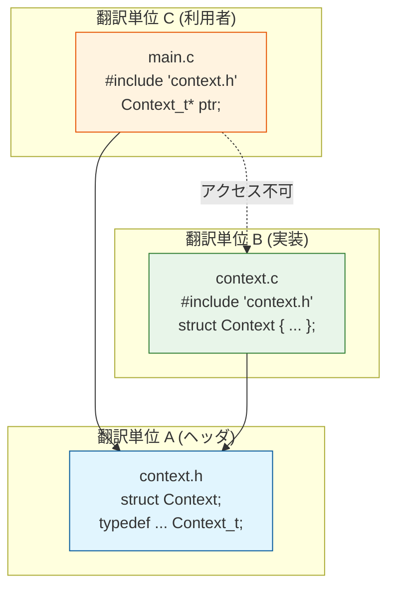
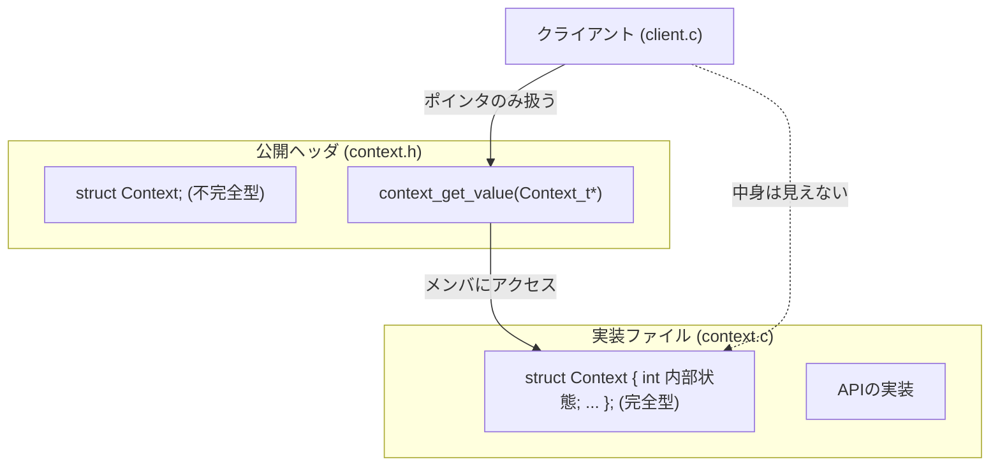
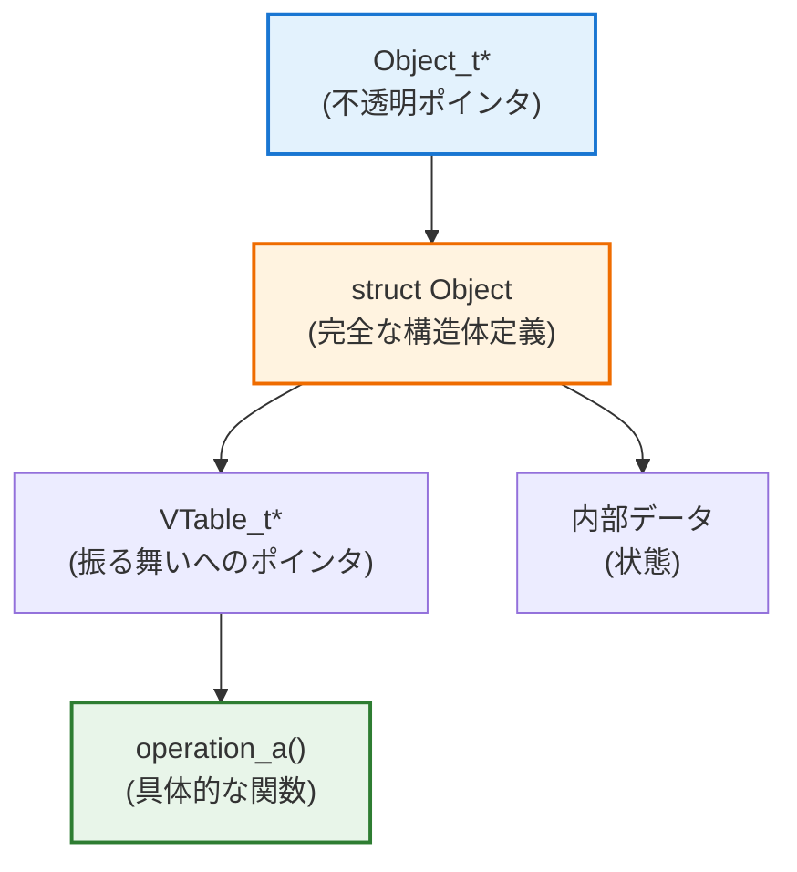
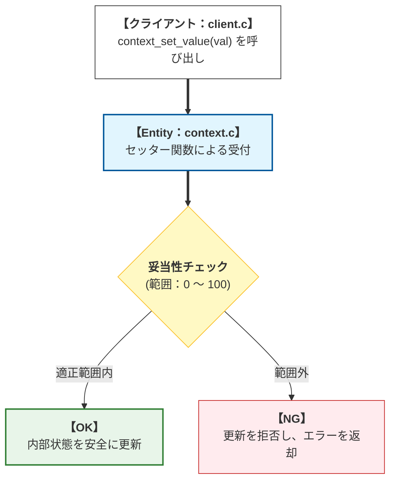

# 第1部 第4章 不完全型と不透明ポインタ - 型情報の隠蔽による契約のカプセル化


## 1. 章の目的と設計的視点

#### 本章の目的：型の隠蔽によるカプセル化の極致

前章までに、`static`による **責任** の局所化と、構造体による **データと振る舞いの統合** について学びました。本章では、これらの技術をさらに深化させ、C言語における **カプセル化** を極限まで高めるための技術、すなわち **不完全型** （Incomplete Type）と **不透明ポインタ** （Opaque Pointer）パターンについて解説します。

#### 不完全型 (Incomplete Type)

`struct Context;` のように、宣言はあるがサイズや中身が未定義の型を指します。これは **前方宣言** （Forward Declaration）の一種であり、「名前だけは存在するが詳細は不明」という状態をあえて作ることで、外部からの不正なアクセスを物理的に遮断します。

#### 不透明ポインタ (Opaque Pointer)

不完全型を指すポインタのことです。中身（実装）が透けて見えないためこう呼ばれます。利用者はこのポインタを「住所」として扱うことはできますが、その「間取り（メンバ変数）」を知ることはできず、直接アクセスすることも許されません。

#### この技術の設計的意義

この技術により、モジュールの **内部構造（具象）** の詳細を **公開ヘッダファイル** から完全に排除し、外部モジュールとの間に **厳密で安定した「契約」** の境界線を確立することができます。その結果、実装をどれだけ変更しても利用側の再コンパイルが不要になり、C言語において「真の依存関係の逆転」が可能となるのです。

#### 不完全型によるモジュール境界の確立

#### 物理的な依存の遮断

> [!WARNING] 読者の疑問：中身を隠すとスタックに置けないのでは？
> 「構造体の中身を隠してサイズが分からなくなると、利用側で `Context_t ctx;` のようにローカル変数（スタック領域）として宣言して手軽に使うことができなくなるのでは？ 結局毎回 `malloc` でヒープメモリを動的確保しなきゃいけなくて面倒じゃない？」
>
> 非常に鋭い指摘です。その通り、不完全型を採用するとコンパイラはサイズを計算できないため、利用側はスタック上にその構造体を直接割り当てる（値として持つ）ことが不可能になります。常にポインタ越しに扱い、モジュールの生成関数内部で `malloc` 等による動的確保を行う（あるいは専用のアロケータを使う）という強烈な制約・トレードオフが生じます。しかし、中・大規模なシステム開発においては、この「スタック確保の利便性を捨てる」対価を払ってでも得るべき、圧倒的な「依存関係の遮断（モジュール間結合度の低下と、再コンパイル連鎖の防止）」というメリットが存在するのです。

ヘッダファイル（Unit A）には不完全型のみが存在し、構造体の実体（詳細）は実装ファイル（Unit B）に隠蔽されている様子です。

*   **アクセス不可**
    利用者（Unit C）はポインタを持つことはできますが、その先の実装（Unit B）を直接覗くことはコンパイルエラーになります。

UnitA（ヘッダ）を中心に、UとCが依存していますが、UからCへの直接アクセスは遮断されています。



 **不透明ポインタ** の採用は、モジュールの **内部実装（具象）** の変更が、 **外部の利用側（抽象）** に影響を与えない **疎結合** なシステム構築の物理的な土台となります。

#### ABI互換性 (Application Binary Interface Compatibility)

C言語における、関数呼び出しやデータ配置に関する「バイナリレベルの約束事」です。ソースコードではなく、コンパイル後の「0と1の並び」の互換性を指します。

#### 詳細とメカニズム

もし構造体の実体をヘッダで公開していると、メンバーを一つ増やしただけで構造体の「サイズ」が変わります。すると、以下のような致命的な問題が発生します。

#### スタック壊しの発生

構造体の実体が公開されていると、外部モジュールはコンパイル時にそのサイズ分の「メモリの枠（スタック領域）」を確保します。しかし、共有ライブラリ側のアップデートで構造体のメンバが増え、サイズが大きくなった場合、外部モジュールが用意した「古い小さな枠」に対して、ライブラリが「新しい大きなデータ」を書き込もうとします。これが境界を越えた **メモリ破壊（スタック壊し）** を招き、予期せぬクラッシュや脆弱性の原因となります。

#### 再ビルドの強制

この破壊を防ぐためには、ライブラリの変更に合わせて、そのヘッダをインクルードしている **すべての外部モジュールを再コンパイル** しなければなりません。

#### 不透明ポインタによる解決

不透明ポインタ（不完全型）を使用すると、外部から見えるのは常に「ポインタ（アドレス）のサイズ」だけに固定されます。

*   **バイナリレベルの絶縁**
    ポインタのサイズは環境（32bit/64bit）によって決まっており、構造体の中身が増減しても変わることはありません。
*   **互換性の維持**
    内部構造をいくら変えても「窓口」であるポインタの扱いは変わらないため、外部モジュールを再コンパイルすることなく、実行バイナリの差し替えのみで修正を適用できます。

#### 設計の三本柱と不完全型

#### 契約 (境界)

*   **道具 (技術)**
    `struct X;`による型情報の隠蔽
*   **原則 (指針)**
    **単一責任原則 (SRP)** の基盤となる
*   **対応する原則/目的**
    **カプセル化** 、 **疎結合** の実現、 **ABI互換性** の維持。

## 2. 不完全型と不透明ポインタの具体的な活用パターン

### 2.1. 活用パターン 1: PIMPLパターンによる内部構造の隠蔽

 **PIMPL (Pointer to Implementation) パターン** とは、構造体の完全な定義をヘッダから実装ファイルに移動させ、ヘッダにはポインタのみを残す手法です。これにより、データ構造の変更軸を実装ファイル（`context.c`）に隔離します。

#### PIMPLパターンの構造

公開ヘッダにはAPIとポインタ型のみを配置し、構造体の定義（完全型）を実装ファイルに閉じ込める、PIMPLパターンの典型的な構成例です。

*   **メンバへのアクセス**
    クライアントはAPI経由でのみメンバにアクセス可能です。直接 `ctx->value` のように書くことはできません。

ClientからAPIへは実線（利用可能）、FullTypeへは点線（不可視）です。



#### 不完全型と公開APIの宣言（公開契約）

実装の詳細を隠蔽するためのヘッダ設計です。`struct Context;` という前方宣言のみを行い、具体的な定義を書きません。

これを `Context_t` として typedef し、ポインタのみを型として公開します。 **不完全型** を利用することで、コンパイラには「`struct Context`という型が存在する」ことだけを教え、そのサイズや中身については一切教えないのです。これにより、利用側が `sizeof` を取得したりメンバにアクセスしたりしようとすると、強制的にコンパイルエラーが発生します。これが、C言語における最も強力な情報隠蔽（カプセル化）パターンです。

#### context.h
```c
// 設計意図: structタグのみを宣言し、内部データ構造を隠蔽（不完全型）
struct Context;

// 設計意図: 外部で使用するポインタ型を定義（不透明ポインタ）
typedef struct Context Context_t;

// 抽象契約：内部への直接アクセスを許さないAPI
Context_t* context_create(void);
int context_get_value(const Context_t* ctx);
void context_destroy(Context_t* ctx);
```

#### 完全型の定義と隠蔽された初期化処理

隠蔽された構造体の実体定義です。まず、構造体の完全型を定義します。

ここで初めて `struct Context { ... }` を定義します（完全型）。データ構造の定義を `.c` ファイル内に閉じ込めることで、このファイルの変更が外部に波及することを防ぎます（ABI互換性）。構造体のメンバを修正しても `context.h` には影響がないため、利用側の再コンパイルは不要となります。

#### context.c
```c
#include "context.h"
#include <stdlib.h>
#include <stdio.h>

// 具象実装：内部構造体の完全な定義は、この.cファイルでのみ公開される。
struct Context {
    int internal_state;
    float calculation_buffer[10];
};
```

次に、生成関数です。`create` 関数内では `sizeof(struct Context)` が使えるため、メモリ確保が可能です。

`calloc` を使用することで、将来メンバが増えた際も安全にゼロ初期化されるようにしています。安全なリソース確保の手順をカプセル化しています。

#### 構造体のメモリ確保と初期化（生成）

#### context.c
```c
// 具象実装：ファクトリ関数（生成）
Context_t* context_create(void)
{
    // .cファイル内なので struct Context のサイズがわかり、ヒープに実体を確保できる
    // 設計推奨: malloc ではなく calloc を使うことで、
    // メモリ確保と同時に全ビットをゼロクリアします。これにより、
    // 将来メンバが増えた際も未初期化バグ（不定値）を防ぎ、安全性を高めます。
    Context_t* ctx = (Context_t*)calloc(1, sizeof(struct Context));

    if (ctx == NULL) return NULL;
    // 明示的な初期値が必要なものだけ設定
    ctx->internal_state = 42;
    printf("[context.c] Context struct secured: %p\n", (void*)ctx);

    return ctx;
}
```

構造体の中身を知っているため、メンバへのアクセスが可能です。まず、値の取得関数です。

内部構造体へアクセスし、値を返します。内部表現（`internal_state`）を隠蔽し、値だけを取り出すアクセサを提供します。クライアントは内部変数の名前や型を知る必要がありません。

#### 値の取得（アクセサ）

#### context.c
```c
// 具象実装：値の読み出し関数
int context_get_value(const Context_t* ctx)
{
    if (ctx == NULL) return -1;
    // 内部構造にアクセスできるのは .c ファイル内のみ

    return ctx->internal_state;
}
```

最後に、破棄関数です。メモリを解放します。生成の責任と対になる「破棄の責任」を果たします。これにより、安全なリソース管理が実現されます。

#### リソースの解放（破棄）

#### context.c
```c
// 具象実装：デストラクタ関数（破棄）
void context_destroy(Context_t* ctx)
{
    if (ctx != NULL) {
        printf("[context.c] Context struct freed: %p\n", (void*)ctx);
        free(ctx);
    }
}
```

#### 不透明ポインタを利用するクライアントの実装

不透明ポインタを利用するクライアントコードの例です。まずは、モジュールの基本的な利用方法を見ていきましょう。

`Context_t*` をハンドルとして扱い、APIを通じてオブジェクトを操作しています。利用者は構造体の中身を全く意識する必要がなく、APIが提供する操作のみに集中できます。モジュール間の結合度が極めて低い状態です。

#### client.c
```c
#include "context.h"
#include <stdio.h>
#include <stdlib.h>

void use_context_module(void)
{
    Context_t* my_ctx = context_create();

    if (my_ctx == NULL) {
        fprintf(stderr, "Context creation failed.\n");

        return;
    }
    // 抽象を経由してAPIを呼び出す
    int value = context_get_value(my_ctx);
    printf("[client.c] Context value: %d\n", value); // 42
    context_destroy(my_ctx);
}
```

続いて、エントリポイントです。`use_context_module` 関数を呼び出し、一連のContext操作を実行するためのエントリポイントです。

プログラムの開始点として、メインのロジック（`use_context_module`）へ制御を移譲します。アプリケーションの起動と終了を管理する、標準的な構成です。

#### エントリポイント

#### client.c
```c
int main(void)
{
    use_context_module();

    return EXIT_SUCCESS;
}
```

#### カプセル化されたオブジェクトの操作結果

ポインタのアドレスを通じて、隠蔽されたオブジェクトが正しく生成・破壊されていることがわかります。

#### 実行結果
```c
[context.c] Context struct secured: 0x...
[client.c] Context value: 42
[context.c] Context struct freed: 0x...
```

### 2.2. 活用パターン 2: 不透明データ構造へのVTable（振る舞い）の内包

データ構造自体を不透明ポインタで隠蔽し、その内部にVTable（振る舞いの集合）を内包させます。データ（状態）と振る舞いの両方を一つのポインタでカプセル化し、 **依存性逆転原則 (DIP)** を物理的に実現します。

このパターンでは、 **「振る舞い（VTable）」の実装責任をクライアント側に委譲（依存注入）** しつつ、 **「データ（状態）」の管理責任はモジュール側が持つ** という、高度な分業が可能になります。不透明ポインタ（Object_t*）が、内部で「振る舞い（VTable）」と「状態（Data）」の両方を保持している構造です。

*   **カプセル化の徹底**
    ClientPtrからは中身が見えませんが、内部的にはVTableを経由してFuncPtr（振る舞い）にアクセスできる仕組みが整っています。

左端のポインタが入り口となり、内部構造へと展開していく様子。



#### 不完全型とVTableを組み合わせた契約の設計

不透明ポインタとVTableを組み合わせた契約定義です。`Object_t` を不完全型とし、`VTable_t` を定義して、`object_create` で注入する形式をとっています。

状態（データ）を隠蔽しつつ、振る舞い（VTable）を外部から注入可能にすることで、状態管理の安全性と機能の拡張性を両立しています。

**補足:** VTable内の関数が現在1つであっても、あえて構造体にまとめることで「振る舞いのセット（契約）」であることを明示し、将来のAPI追加（operation_bなど）に対しても署名を変えずに対応できる拡張性を確保しています。状態のカプセル化と依存性の注入を同時に行う、高度な設計手法です。

#### object.h
```c
// 抽象契約：データ構造は不完全型で隠蔽
typedef struct Object Object_t;

// 抽象契約：振る舞いを定義するVTableの構造体
typedef struct {
    void (*operation_a)(Object_t* obj);
} VTable_t;

// API: Objectを生成し、VTableを注入（依存注入）
Object_t* object_create(const VTable_t* vtable_impl);
void object_do_something(Object_t* obj);
void object_destroy(Object_t* obj);
// API: 内部状態への安全なアクセサ (Strategyが状態にアクセスするために必要)
int object_get_state(const Object_t* obj);
```

#### コンポジションを用いた完全型の定義

VTableを内包する不透明オブジェクトの実装です。まず、データ構造の定義です。

`struct Object` 内に `VTable_t*` を保持します。 **コンポジション（合成）** の利用です。状態（`internal_data_state`）と振る舞い（`vtable`）を一つのオブジェクト内に統合していますが、振る舞いの実体は外部から与えられる仕組みです。これは、オブジェクト指向言語のクラス構造をC言語で手動構築した形と言えます。

#### object.c
```c
#include "object.h"
#include <stdlib.h>
#include <stdio.h>

// 具象実装：Object_t の実体（.cファイルでのみ完全型として定義）
struct Object {
    // 振る舞いの参照（VTableへのポインタ）をデータとして内包する
    const VTable_t* vtable;
    int internal_data_state; // 隠蔽された内部データ
};
```

次に、生成関数です。オブジェクトを生成し、外部から渡されたVTableを注入します。依存性の注入（DI）を実現し、生成時に振る舞いを決定します。柔軟なオブジェクト構成を可能にします。

#### デリゲートを利用した生成関数の実装（VTableの注入）

#### object.c
```c
Object_t* object_create(const VTable_t* vtable_impl)
{
    if (vtable_impl == NULL) return NULL;
    Object_t* obj = (Object_t*)malloc(sizeof(struct Object));

    if (obj == NULL) return NULL;
    // VTable（振る舞い）を Object の内部に注入 (依存注入)
    obj->vtable = vtable_impl;
    // 初期状態の設定
    obj->internal_data_state = 10;
    printf("[object.c] Object created at %p, VTable set.\n", (void*)obj);

    return obj;
}
```

#### VTableを経由した動的呼び出し

生成されたオブジェクトに対する操作です。まず、メソッド呼び出しのラッパー関数です。

内部のVTableを経由して関数を呼び出します。呼び出し側は関数ポインタを意識せず、通常の関数呼び出しとして操作できます。`NULL`チェックにより安全性を確保しています。ポリモーフィズム（多態性）を安全に実現しています。

#### object.c
```c
void object_do_something(Object_t* obj)
{
    // 防御的設計: 内部の関数ポインタまでチェックすることで実行時エラーを防ぐ
    if (obj != NULL && obj->vtable != NULL
        && obj->vtable->operation_a != NULL) {
        // 関数ポインタを経由した間接呼び出し（動的ディスパッチ）
        // self(obj)を渡すことで、実装側が状態にアクセスできるようにする
        obj->vtable->operation_a(obj);
    }
}
```

次に、状態取得のアクセサです。内部の状態を返します。安全なデータアクセスの提供です。カプセル化を維持したままデータを利用可能にしています。

#### カプセル化を維持した状態取得アクセサ

#### object.c
```c
// 内部状態の公開アクセサ
int object_get_state(const Object_t* obj)
{
    if (obj == NULL) return 0;

    return obj->internal_data_state;
}
```

最後に、破棄関数です。オブジェクトが確保していたメモリ領域（`struct Object` 自体）を `free` し、リソースを解放します。

`create` で確保されたリソースを確実に破棄し、メモリリークを防ぐためのデストラクタです。`NULL` チェックを行うことで、安全性を高めています。不透明ポインタのライフサイクル管理において必須となる、安全な終了処理です。

#### VTableを内包するオブジェクトの破棄

#### object.c
```c
void object_destroy(Object_t* obj)
{
    if (obj != NULL) {
        printf("[object.c] Object destroyed at %p.\n", (void*)obj);
        free(obj);
    }
}
```

#### 具象振る舞いの定義（Strategyパターンの適用）

VTableの実装を提供し、不透明オブジェクトを操作するクライアントです。まず、具体的な振る舞いの定義です。

`Concrete A` 用の関数を実装し、VTableとして定義します。利用者が「振る舞い」を定義し、ライブラリ側が「タイミング」と「状態」を管理する、いわゆるフレームワーク的な動作を実現しています。制御の反転（IoC）が実現されており、ライブラリの汎用性が高まっています。

#### client.c
```c
#include "object.h"
#include <stdio.h>
#include <stdlib.h>

// 具象1 の operation_a 実装 (Strategyの実装)
void concrete_a_operation(Object_t* obj)
{
    // ポイント: Objectの中身は隠蔽されているが、公開アクセサを通じて
    // 安全に状態を取得し、ロジックに使用することができる。
    int state = object_get_state(obj);
    printf("Concrete A: operation_a 実行。現在の内部状態 = %d\n", state);
}

// 具象1 の VTable 実体定義
const VTable_t CONCRETE_A_VTABLE = {
    .operation_a = concrete_a_operation
};
```

次に、利用ロジックです。VTableを渡してオブジェクトを生成・操作します。依存性の注入を実践しています。疎結合な利用コードです。

#### VTableを注入するコンポジションルートの構築

#### client.c
```c
void use_vtable_object(void)
{
    // 具象VTable（振る舞い：Concrete A）を Object Factory に渡す
    Object_t* object_a = object_create(&CONCRETE_A_VTABLE);

    if (object_a != NULL) {
        // 抽象APIを通じて振る舞いを呼び出す
        object_do_something(object_a);
        object_destroy(object_a);
    }
}
```

最後に、エントリポイントです。`use_vtable_object` 関数を呼び出し、VTableを使用したオブジェクト操作デモを実行します。

VTableパターンの動作確認を行うためのテストドライバとしての役割を果たします。依存性注入が正しく機能していることを確認するための、シンプルなエントリポイントです。

#### エントリポイント

#### client.c
```c
int main(void)
{
    use_vtable_object();

    return EXIT_SUCCESS;
}
```

#### VTableを経由した状態アクセスの実行結果

不透明ポインタ内部の状態（10）が、VTable経由で呼ばれた関数から正しく取得・表示されています。

#### 実行結果
```c
[object.c] Object created at 0x..., VTable set.
Concrete A: operation_a 実行。現在の内部状態 = 10
[object.c] Object destroyed at 0x....
```

### 2.3. 活用パターン 3: Setter関数によるデータの整合性チェック（防御的アクセス）

不透明ポインタの制約を活かし、 **Setter関数** を唯一の書き込み経路とすることで、モジュールが管理する **データの整合性（不変条件）** を確実に保護します。不透明ポインタとSetter関数を組み合わせることで、不正な値の混入を防ぐ「防御的アクセス」を実現する仕組みです。

*   **検問**
    Setter関数がバリデーション（Judge）を行い、不適切な値（Failure）を弾くことで、内部状態の整合性を保ちます。

StartからJudgeを経て、SuccessまたはFailureに至る分岐フロー。



#### Setter関数のシグネチャによる契約追加

Setter関数の追加定義です。`context_set_value` を追加します。

戻り値で成否を返す設計です。メンバ変数の直接変更を禁止し、関数を通すことで「値をセットする」という行為に「検証」という責任を付加しています。堅牢なAPI設計の基本です。

#### context.h への追加
```c
#define ERROR_NULL_POINTER -1
#define ERROR_INVALID_VALUE -2

// Setter関数の宣言
int context_set_value(Context_t* ctx, int new_value);

// その他の関数宣言（既存）
Context_t* context_create(void);
int context_get_value(const Context_t* ctx);
void context_destroy(Context_t* ctx);
```

#### バリデーションを持つSetter関数による状態保護

バリデーション（検証）ロジックを含むSetterの実装です。入力された `new_value` が妥当な範囲内かチェックし、不正ならエラーコードを返します。

 **不変条件（Invariant）の保護** です。「このモジュールのstateは常に0〜100である」というルールをコードで強制します。不透明ポインタによって裏道を塞いでいるため、このルールは絶対に破られません。バグの混入を未然に防ぐ、防御的プログラミングの典型です。

#### context.c
```c
// バリデーション付きSetter
#define MAX_VALUE 100

// 具象実装：Setter関数
// データの整合性チェックと不変条件の保護
int context_set_value(Context_t* ctx, int new_value)
{
    printf("[context.c] Attempting to set value to %d...\n",
           new_value);

    // 1. 契約の履行: NULLチェック
    if (ctx == NULL) {
        return ERROR_NULL_POINTER;
    }

    // 2. 整合性チェック
    // データの有効性（不変条件）を検証
    if (new_value < 0 || new_value > MAX_VALUE) {
        printf("[context.c] Validation FAILED: "
               "Value %d is outside [0, %d].\n",
               new_value, MAX_VALUE);

        return ERROR_INVALID_VALUE;
    }

    // 3. 検証成功時のみ状態を更新
    ctx->internal_state = new_value;
    printf("[context.c] Validation SUCCESS: "
           "Value set to %d.\n", new_value);

    return 0; // 成功
}
```

次に、初期化関数（変更あり）です。`internal_state` の初期値を変更しました。明示的な初期化により、不定値を防ぎます。安全な生成処理です。

#### context.c(続き)
```c
// 初期化：internal_stateを10に設定する場合の修正イメージ
// （※既存の context_create の初期値を 10 に書き換えてください）
/*
Context_t* context_create(void)
{
    ...
    if (ctx != NULL) {
        ctx->internal_state = 10; // 初期値を変更
    }
    return ctx;
}
*/
```

#### 状態取得アクセサの設計

続いて、取得関数です。不透明ポインタ `ctx` が指す内部構造体から、`internal_state` の値を読み出して返します。

内部データを隠蔽しつつ、必要な情報だけを「読み取り専用」で提供するアクセサ（Getter）です。NULLチェックにより安全性を確保しています。内部構造の変更（例えば変数の名前変更など）が、この関数を通じて吸収されるため、外部コードへの影響を最小限に抑えられます。

#### context.c
```c
// （※値読み出し関数 context_get_value は2.1節ですでに定義済みのため省略）
```

#### ライフサイクルの終了（デストラクタ）

最後に、破棄関数です。使用しなくなった `Context` オブジェクトのメモリを解放します。

ライフサイクルの終了を管理し、ヒープ領域のメモリリークを防止します。不完全型を利用する場合、外部からは `free` できないため、この関数が唯一の解放手段として機能します。

#### context.c
```c
void context_destroy(Context_t* ctx)
{
    if (ctx != NULL) {
        free(ctx);
    }
}
```

#### バリデーション検証のためのテストコード

バリデーションの動作を確認するクライアントコードです。まず、検証ロジックをテストする関数です。

有効な値と無効な値をセットし、それぞれの結果を確認しています。APIが期待通りにエラーを返し、内部状態が守られていることを実証しています。堅牢なシステムの挙動確認として適切です。

#### client.c
```c
#include "context.h"
#include <stdio.h>
#include <stdlib.h>

void use_context_module_with_setter(void)
{
  Context_t* my_ctx = context_create();

  if (my_ctx == NULL) {
    return;
  }
  // 1. 成功する書き込み (有効な値)
  int result_ok = context_set_value(my_ctx, 50);
  printf("[client.c] 設定結果 (50): %d, "
         "現在値: %d\n",
         result_ok,
         context_get_value(my_ctx));

  // 2. 失敗する書き込み (無効な値: 範囲外)
  int result_fail = context_set_value(my_ctx, 200);

  // 失敗した場合、値が変わっていないことを確認
  printf("[client.c] 設定結果 (200): %d, "
         "現在値: %d\n",
         result_fail,
         context_get_value(my_ctx));

  context_destroy(my_ctx);
}
```

#### エントリポイント

続いて、エントリポイントです。テストを実行します。シンプルなmain関数。テストドライバとして機能します。

#### client.c
```c
int main(void)
{
  use_context_module_with_setter();

  return EXIT_SUCCESS;
}
```

#### バリデーションによる状態保護の実行結果

無効な値（200）のセットが拒否され、内部状態が維持されていることがログから確認できます。

#### 実行結果
```c
[context.c] Attempting to set value to 50...
[context.c] Validation SUCCESS: Value set to 50.
[client.c] 設定結果 (50): 0, 現在値: 50
[context.c] Attempting to set value to 200...
[context.c] Validation FAILED: Value 200 is outside [0, 100].
[client.c] 設定結果 (200): -2, 現在値: 50
```

## 3. 設計判断と落とし穴のまとめ

不完全型と不透明ポインタは「カプセル化」の最強の武器ですが、C言語の物理的な制約によるトレードオフが存在します。

#### 不完全型導入のトレードオフ（メリットとコスト）

| 項目 | 不完全型（ポインタ経由） | 完全型（実体露出） | 設計的判断 |
| :--- | :--- | :--- | :--- |
| **カプセル化** | **最強** （内部構造を完全に隠蔽） | **弱** （構造体メンバが全公開） | 変更容易性を優先するなら不完全型。 |
| **コンパイル依存** | **極小** （メンバ変更で再ビルド不要） | **大** （全依存箇所の再ビルドが必要） | 大規模開発においては不完全型が必須推奨。 |
| **メモリ配置** | **ヒープ必須** （`malloc`等が必要） | **スタック可能** （静的配置も可） | パフォーマンス/組込制約がある場合は完全型。 |
| **実行コスト** | **増加** （間接参照/キャッシュミス） | **最小** （直接アクセス/インライン化可） | 速度優先の極小ループ内では完全型。 |

#### ABI (Application Binary Interface) 互換性の維持

*   **判断**
    ライブラリをアップデートした際、利用側のバイナリを再コンパイルせずにそのまま動かしたい場合、構造体のサイズが変わることは許されません。
*   **対策**
    不完全型を使用すれば、外部から見えるサイズは「ポインタのサイズ」で固定されます。

内部構造をいくら変えても「窓口」は不変なため、バイナリレベルの絶縁が可能になります。

#### メモリ管理責任の集中

*   **判断**
    実体がヒープに確保されるため、解放を忘れると即座にメモリリークに繋がります。また、スタックに配置できないため、関数の終了とともに自動破棄される利便性が失われます。
*   **対策**
    責任の所在を明確にします。Entity Objectのライフサイクル管理責任をファクトリ（`create`）とデストラクタ（`destroy`）に集約し、クライアントにそのペアの履行を契約として要求してください。

## 本章で必ず理解してほしいことのまとめ

#### 不完全型と不透明ポインタの設計上の役割

#### 1. 「情報隠蔽」の究極的な実現手段である

`static`（第1章）が「関数」を隠すのに対し、不完全型は「データ構造」を隠します。これにより、利用側は「何ができるか（関数）」のみを知り、「どうなっているか（データ）」を一切知ることができない、強固なカプセル化が完成します。

#### 2. 物理的な依存関係を最小化し、安定した境界を作る

ヘッダファイルから実装の詳細を排除することで、`#include` による変更の連鎖（リビルド・ストーム）を物理的に遮断します。これは大規模プロジェクトにおいて、開発効率を維持するための生命線となります。

#### 3. 「契約による設計」と整合性の保護を強制する

利用側は構造体の中身を直接触れないため、必ず提供されたAPI（Setter等）を介して操作せざるを得ません。この制約を逆手に取り、Setter関数に「検問（バリデーション）」の責任を担わせることで、データの不変条件（整合性）を確実に保護できます。

#### 次章への橋渡し

第4章では、データ構造を隠蔽し、モジュール間の結合を極限まで下げる「不透明ポインタ」の技術を学びました。ここまでの4章で、`static`（関数隠蔽）、関数ポインタ（動的結合）、構造体（責任統合）、不完全型（型隠蔽）という、C言語における「設計のパーツ」はすべて出揃いました。

しかし、これらの強力な道具も、 **「どのファイルに、どう配置するか」** という **物理的な設計図** がなければ、大規模なシステムはすぐに崩壊してしまいます。次章では、これまでの技術を総動員し、実際の開発において最も重要となる **第5章 モジュール構成とヘッダ設計 - 依存関係の最小化** について解説します。

責任を「公開契約」と「内部契約」に明確に分離し、依存関係を適切に管理するための具体的な規約を習得しましょう。「美しいヘッダ設計」こそが、プロジェクトの品質を決定づけるのです。
