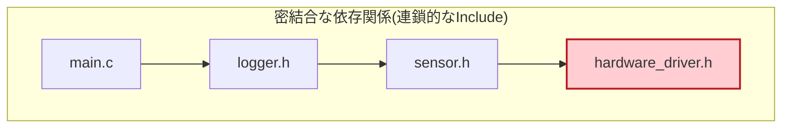
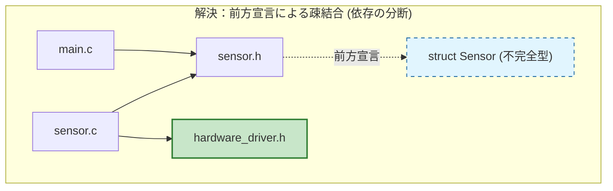
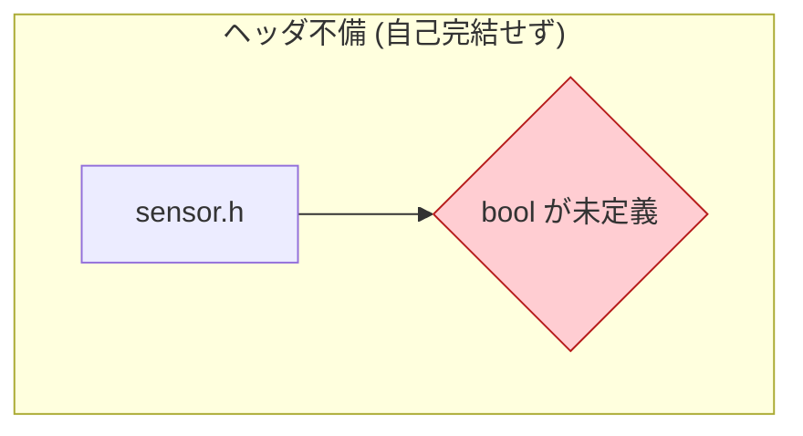
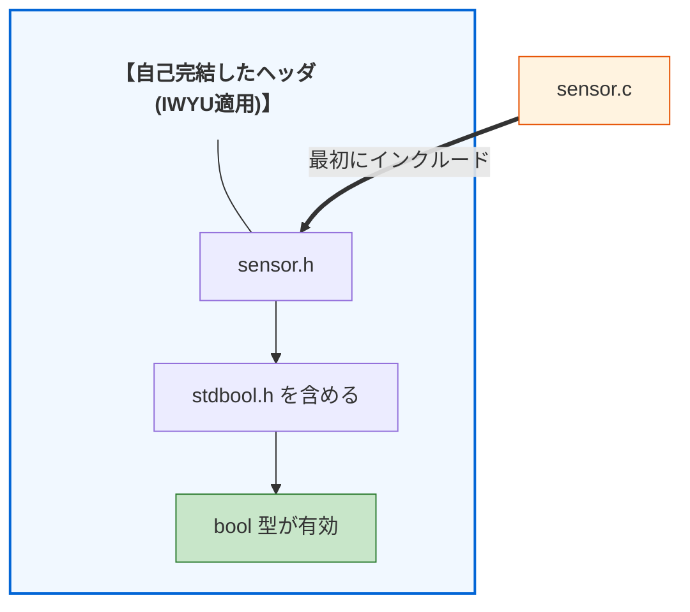
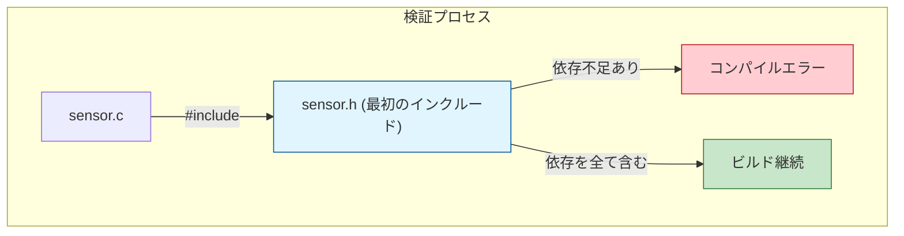
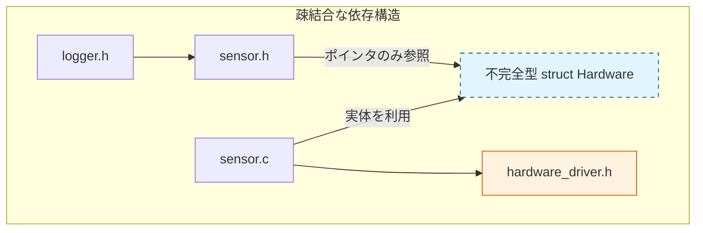
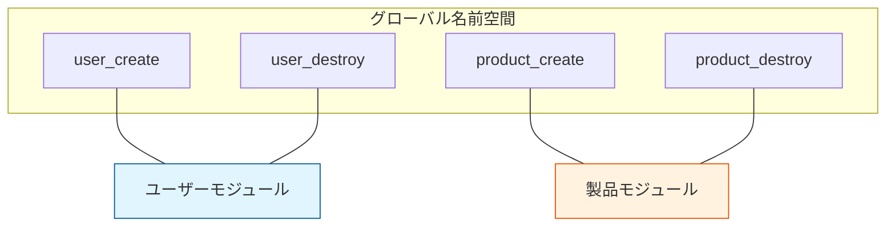

# 第1部 第5章 モジュール構成とヘッダ設計 - 最小限の契約公開と依存の最小化


## 1. 章の目的と設計的視点

#### 本章の目的：ヘッダデザインによる依存関係の最適化

これまでに、`static`による **責任** の局所化、 **関数ポインタ** による **契約** を通じた **依存** の切断、そして **第4章 不完全型** での **型の隠蔽** （抽象化）について学びました。本章では、これらの技術を統合し、モジュール設計の **外部的な側面** 、すなわち **ヘッダファイル** （`.h`）の **デザイン** に焦点を当てて解説します。

C言語において、 **ヘッダファイル** こそが、モジュールが外部に対して提供する「 **契約** 」であり、モジュール間の **依存関係** を決定づける「 **境界線** 」です。ヘッダを厳格に設計する最大の目的は、モジュール間の **依存を最小化** することに他なりません。これにより、一つのモジュールの内部変更が他のモジュールに **連鎖的な再コンパイル** を引き起こさない **疎結合** な状態が達成され、ソフトウェアの **変更容易性** が大きく向上します。

#### なぜヘッダ設計が重要なのか：実際の開発での痛み

実際の開発で、こんな経験はありませんか？

*   **問題1**
    「プロジェクトメンバーが『ちょっとした修正』で構造体のメンバ順を変えただけで、翌朝のビルドが30分もかかるようになった」
*   **問題2**
    「sensor.h と device.h が互いにインクルードし合っていて、どちらを先にコンパイルしてもエラーになる『ヘッダ地獄』に陥った」
*   **問題3**
    「logger.h をインクルードしただけで、なぜか network.h や database.h まで引きずり込まれ、全く関係ないコンパイルエラーが出る」

これらは **すべてヘッダ設計に起因する問題** です。本章では、これらの具体的な問題を解決する設計技法を学びます。

#### 設計の三本柱とヘッダ設計の関係

#### 密結合 vs 疎結合な依存関係

ヘッダファイルのインクルード関係がもたらす依存構造の違いです。

*   **密結合（上）**
    `main.c` が `logger.h` を使うだけで、間接的に `hardware_driver.h` まで依存してしまっています。
*   **疎結合（下）**
    前方宣言と不完全型を使うことで、`main.c` は `sensor.h` の「インターフェース」のみに依存し、その先の実装詳細（`hardware_driver.h`）を知らずに済みます。

上の図では矢印が連鎖していますが、下の図では点線（前方宣言）によってその連鎖が断ち切られています。

#### 問題



#### 解決



#### モジュール設計の三本柱：責任・契約・依存

C言語におけるモジュール設計を支える三本柱は、以下の要素で構成されます。これらは互いに補完し合い、変更に強く堅牢なシステムを構築します。

#### 1. 「責任」の明確化：シンボルの所属を定義する

C言語には言語レベルでの「名前空間（Namespace）」が存在しません。そのため、 **プレフィックス規約** （例：`Book_`, `UI_`）を用いて、各関数や型がどのモジュールに属するかを明示すること。これが、 **責任の境界** を引くための第一歩となります。これにより、名前の衝突を防ぐだけでなく、そのコードが「誰の管轄か」を開発者が一目で判断できるようになります。

#### 2. 「契約」の安定：外部との約束を固定する

モジュールの外部に公開するAPI宣言をヘッダファイルに集約し、`typedef` などで抽象化されたインターフェースを構築します。内部実装（`.c`ファイル）がどれほど変更されても、ヘッダという**契約**が安定していれば、利用側のコードを修正する必要はありません。これが、システム全体の **変更耐性** を高める核となります。

#### 3. 「依存」の最小化：結合を緩やかに保つ

 **前方宣言** や **IWYU（Include What You Use）原則** を徹底し、不要な `#include` を排除することで、モジュール間の **コンパイル時依存** を最小化します。「ヘッダの中で別のヘッダを過剰に読み込む」ことを防げば、一部の修正が全体に波及する「再コンパイルの連鎖」を食い止め、 **疎結合** なシステムを実現できます。

## 2. ヘッダ設計の具体的な活用パターン

### 2.1. 活用パターン 1: Include What You Use (IWYU) 原則の適用

#### システム概要

ヘッダファイルが「自己完結」していることを保証し、どの順番でインクルードしても正しくコンパイルできるようにする。

*   **センサーの状態確認（bool型を使用）**
*   **センサーの生成と破棄**
*   **依存関係を明示したヘッダ構成**

#### 設計の意図

ヘッダファイルが必要な型定義（例えば `bool`）を含んでいないと、利用側で「おまじない」のように特定のヘッダを先に読み込まなければならない状況が生じます。これは「隠れた依存」であり、メンテナンスの大きな妨げとなります。

 **IWYU原則** （自分が使うものは自分でインクルードする）を徹底し、さらに実装ファイルで自ヘッダを最初に読み込むことで、この問題を機械的に検出・防止します。

#### 自己完結したヘッダの構造

ヘッダファイルが単体でコンパイル可能である状態（自己完結）と、そうでない状態の違いを示しています。

*   **検証プロセス**
    `sensor.c` が `sensor.h` を一番最初にインクルードすることで、`sensor.h` が必要なヘッダ（stdbool.hなど）を依存不足なく含んでいるかどうかをコンパイラがチェックします。
*   **自己完結していないヘッダ（赤）** はコンパイルエラーの原因となりますが、 **IWYUを適用したヘッダ（青）** は安全です。






#### ❌ 問題のあるコード：ヘッダが自己完結していない

#### sensor.h (問題のあるヘッダ)

`stdbool.h` をインクルードしていないため、このヘッダ単体では `bool` 型が認識できず、コンパイルエラーになる可能性があります。利用側に「先に `<stdbool.h>` をインクルードしてください」という暗黙のルールを強いることになり、契約として不完全です。

自己完結していないヘッダ定義です。必要な型定義が欠落しており、利用側に依存関係の解決を強いる不完全な契約となっています。

#### sensor.h
```c
// <stdbool.h> をインクルードしていない
typedef struct Sensor Sensor_t;
Sensor_t* sensor_create(void);
bool sensor_is_ready(Sensor_t* sensor);  // bool型を使っているが定義がない
void sensor_destroy(Sensor_t* sensor);
```

#### application.c (問題のある利用)

`sensor.h` の欠陥をカバーするために、利用側で先に依存関係を解決しています。これはたまたま「動いている」だけであり、非常に脆い設計と言えます。

公開されたインターフェースを利用して、センサーを操作するクライアントコードです。

#### application.c
```c
#include <stdbool.h>  // 先にこれをインクルードしてしまう
#include "sensor.h"   // この時点では bool が定義済みなのでエラーにならない

void use_sensor(void) {
    Sensor_t* s = sensor_create();

    if (sensor_is_ready(s)) {  // 問題なくコンパイルできてしまう
        // センサー読み取り処理
    }
    sensor_destroy(s);
}
```

#### sensor.c (実装側でのエラー発覚)

実装ファイルの先頭で `sensor.h` をインクルードすると、ここで初めてコンパイルエラーが発生します。ヘッダで定義されたインターフェースの具体的な実装を行います。

内部データや詳細ロジックをこのファイル内に閉じ込め（カプセル化）、外部からの直接アクセスを防ぎます。変更が発生しても、このファイル内のみに影響を留めることができます。

#### sensor.c
```c
#include "sensor.h"  // bool が未定義なのでコンパイルエラー！
// error: unknown type name 'bool'
#include <stdlib.h>

struct Sensor {
    int status;
};

Sensor_t* sensor_create(void) {
    Sensor_t* s = malloc(sizeof(struct Sensor));

    if (s != NULL) {
        s->status = 0;
    }

    return s;
}

bool sensor_is_ready(Sensor_t* sensor) {
    return sensor != NULL && sensor->status == 1;
}

void sensor_destroy(Sensor_t* sensor) {
    free(sensor);
}
```

#### ✅ 解決後のコード：IWYU原則による早期エラー検出

#### sensor.h (改善後)

**自己完結したヘッダ**です。このファイルが必要とする `<stdbool.h>` を明示的にインクルードすることで、誰がどのような順序で利用しても安全です。

依存関係をヘッダ内に閉じ込め、利用側の負担を減らす（契約の完全性）。 **モジュールの公開インターフェース定義を行います。**

#### sensor.h
```c
#ifndef SENSOR_H
#define SENSOR_H
#include <stdbool.h>  // 必要な依存を明示的にインクルード

typedef struct Sensor Sensor_t;
Sensor_t* sensor_create(void);
bool sensor_is_ready(Sensor_t* sensor);
void sensor_destroy(Sensor_t* sensor);
#endif // SENSOR_H
```

#### sensor.c (IWYU適用)

自ヘッダを最優先でインクルードすることで、ヘッダの品質（自己完結性）を常に保証します。まず、構造体と生成関数です。

`sensor.h` を最初にインクルードし、構造体を定義してメモリを確保します。もしヘッダに依存漏れがあれば、このファイルがコンパイルできないため、問題を即座に検知できます（フェイルファスト）。堅牢なビルド環境の基礎です。

#### sensor.c
```c
// IWYU原則：自身のヘッダを最初にインクルード
#include "sensor.h"
// この時点で sensor.h が自己完結しているか検証される
// もし sensor.h に問題があれば、ここで即座にエラーになる
#include <stdlib.h>

struct Sensor {
    int status;
};

Sensor_t* sensor_create(void) {
    Sensor_t* s = malloc(sizeof(struct Sensor));

    if (s != NULL) {
        s->status = 0;
    }

    return s;
}
```

次に、状態確認関数です。センサーの状態を判定します。状態判定ロジックをカプセル化します。単純ですが重要な判定です。

#### sensor.c
```c
bool sensor_is_ready(Sensor_t* sensor) {
    return sensor != NULL && sensor->status == 1;
}
```

最後に、破棄関数です。メモリを解放します。リソース管理の責任を果たします。安全な終了処理です。

#### sensor.c
```c
void sensor_destroy(Sensor_t* sensor) {
    free(sensor);
}
```

#### application.c (改善された利用)

ヘッダが自己完結しているため、単独でインクルードしても安全です。ヘッダで定義されたインターフェースの具体的な実装を行います。

内部データや詳細ロジックをこのファイル内に閉じ込め（カプセル化）、外部からの直接アクセスを防ぎます。変更が発生しても、このファイル内のみに影響を留めることができます。

#### application.c
```c
#include "sensor.h"  // sensor.h が自己完結しているので安全

void use_sensor(void) {
    Sensor_t* s = sensor_create();

    if (sensor_is_ready(s)) {
        // 処理
    }
    sensor_destroy(s);
}
```

#### IWYU原則による設計上の改善点と達成される価値

| 改善項目 | 具体的な効果 | 達成される設計価値 |
| --- | --- | --- |
| **ヘッダの自己完結** | 利用側が「どのヘッダを先に読み込むか」という順序を気にする必要がなくなり、暗黙の依存関係が排除される。 | **堅牢性** |
| **早期のエラー検出** | 実装ファイル（`.c`）の冒頭で自ヘッダを読み込むことで、依存不足をコンパイル時に即座に検知し、バグの潜伏を防ぐ。 | **保守性** |
| **推移的依存の排除** | 必要な型や定義を明示的にインクルードすることで、隠れた依存による予期せぬ変更波及を遮断する。 | **変更容易性** |

#### コンパイル時の検証フロー

IWYU原則に従ってコードを書くことで、コンパイルプロセス自体が「ヘッダの品質チェック」として機能する様子です。

*   **最初のインクルード**
    最初に自ヘッダを読み込むことで、他のヘッダによる「お膳立て」なしで動くかをテストしています。



### 2.2. 活用パターン 2: 前方宣言による依存の切断

#### システム概要

センサーモジュールとロガーモジュール、ハードウェアドライバモジュール間の依存関係を整理し、不要な再コンパイルを防ぐ。

*   **センサーから値を読み取る**
*   **読み取った値をログに出力する**
*   **センサーはハードウェアを利用するが、ロガーなどの利用者にはハードウェアの詳細を見せない（隠蔽する）**

#### 設計の意図

「センサーを使う」ことと「センサーがどう実装されているか」は全く別の問題です。ヘッダファイルで `include "hardware.h"` をしてしまうと、センサーを利用する全ての人にハードウェアの知識（依存）を押し付けることになってしまいます。

 **前方宣言** を使うことで、この依存を断ち切り、ポインタとしての「参照」関係だけに留めます。

#### 疎結合な依存構造

前方宣言を用いることで、ヘッダファイル間の依存（矢印）を断ち切り、実装ファイル（.c）に依存を閉じ込める構造です。

*   **点線**
    `sensor.h` は `struct Hardware` の中身を知らず、ポインタとしてしか扱いません。

これにより `hardware_driver.h` への依存が消えています。`logger.h` は `sensor.h` しか知らず、`hardware_driver.h` の存在すら知りません。



#### ❌ 問題のあるコード：ヘッダの相互インクルード

#### sensor.h (問題のある設計)

`hardware_driver.h` をインクルードすることで、ハードウェアの詳細が `Sensor` 構造体を通じて外部に漏れ出しています。`logger.c` はセンサーを使いたいだけなのに、ハードウェアドライバの変更の影響を受けてしまいます。

問題のあるヘッダ設計です。実装詳細（hardware_driver.h）を公開インターフェースに漏洩させ、結合度を高めています。

#### sensor.h
```c
#include <stdint.h>
#include "hardware_driver.h"  // ハードウェア層への依存を公開してしまっている
// 内部構造を完全に公開
typedef struct {
    uint8_t sensor_type;
    // HardwareHandleの実体（値）を持っているため、
    // hardware_driver.h のインクルードが必須になってしまっている。
    HardwareHandle hw;
    float last_value;
} Sensor;
float sensor_read(Sensor* sensor);
```

#### logger.h (推移的依存の被害)

推移的依存の被害を受けるヘッダです。sensor.hをインクルードするだけで、意図せずhardware_driver.hまで引きずり込まれてしまいます。

#### logger.h
```c
// これをインクルードすると...
// hardware_driver.h も自動的にインクルードされる（推移的依存）
#include "sensor.h"

void log_sensor_data(Sensor* s);
```

#### ✅ 解決後のコード：前方宣言による依存の切断

下位モジュールのAPI定義です。モジュールの公開インターフェース定義を行います。

実装詳細を隠蔽し、外部には必要な契約（API）のみを公開することで、結合度を下げます。インターフェースと実装が分離され、高い保守性が確保されています。

#### hardware_driver.h
```c
#ifndef HARDWARE_DRIVER_H
#define HARDWARE_DRIVER_H
// ハードウェアハンドルの定義
typedef struct {
    unsigned int id;
    int is_open;
} HardwareHandle;
// ハードウェア操作API
HardwareHandle hardware_init(unsigned int id);
float hardware_read_data(HardwareHandle* hw);
void hardware_close(HardwareHandle* hw);
#endif
```

#### hardware_driver.c

下位モジュールのダミー実装です。まず、初期化関数です。ハードウェアを初期化し、ハンドルを返します。物理デバイスのセットアップをシミュレートしています。スタブとしての役割を果たしています。

#### hardware_driver.c
```c
#include "hardware_driver.h"
#include <stdio.h>

HardwareHandle hardware_init(unsigned int id) {
    HardwareHandle hw = { .id = id, .is_open = 1 };
    printf("[Hardware] Initialized ID: %u\n", id);

    return hw;
}
```

次に、データ読み取り関数です。データを読み取ります。データの取得処理をシミュレートしています。ダミー値を返すことでテストを容易にしています。

#### hardware_driver.c
```c
float hardware_read_data(HardwareHandle* hw) {
    if (!hw || !hw->is_open) return 0.0f;

    return 23.5f; // ダミー値
}
```

最後に、終了関数です。ハードウェアを閉じます。リソースの開放をシミュレートしています。状態の変化をログで確認できます。

#### hardware_driver.c
```c
void hardware_close(HardwareHandle* hw) {
    if (hw) {
        hw->is_open = 0;
        printf("[Hardware] Closed ID: %u\n", hw->id);
    }
}
```

#### sensor.h (改善後)

 **不完全型** を用いることで、`hardware_driver.h` のインクルードを回避しています。`sensor` モジュールの利用者はセンサーが内部でハードウェアを使っていることを知る必要がないため、その情報を隠蔽しています。

依存関係がクリーンになり、ビルド時間が短縮されます。ここでは、モジュールの公開インターフェース定義を行います。

#### sensor.h
```c
#ifndef SENSOR_H
#define SENSOR_H
// 設計の勘所: ここで hardware_driver.h をインクルードしないことが重要です。
// 不完全型を用いることで、利用側（logger.cなど）をハードウェアの定義から物理的に切り離します。
typedef struct Sensor Sensor_t;
// 契約：センサーモジュールが提供する公開API
// 内部構造体へのポインタ（Sensor_t*）のみをやり取りする
Sensor_t* sensor_create_hardware(unsigned int hw_id);
int sensor_read(Sensor_t* sensor, float* out_value);
void sensor_destroy(Sensor_t* sensor);
#endif // SENSOR_H
```

#### sensor.c (依存の隔離)

ハードウェアドライバへの依存を、この `.c` ファイル一つだけに限定しています。まず、内部構造体の定義です。

`Sensor` 構造体を定義します。これが隠蔽される具象型です。

依存のスコープを最小化し、変更時の影響範囲を抑え込みます。`sensor.h` に構造体定義を書かないことで、`hardware_driver.h` への依存を `sensor.c` 内に封じ込めています。

#### sensor.c
```c
#include "sensor.h"
// 実装でのみ必要な依存関係（ヘッダには現れない）
// sensor.c は hardware_driver.h に依存しますが、これは「実装の詳細」です。
// hardware_driver.h が変更されても、再コンパイルが必要なのは sensor.c だけであり、
// sensor.h を利用している他のモジュール（logger.cなど）には影響が及びません。
#include "hardware_driver.h"
#include <stdlib.h>
#include <stdio.h>

// 内部構造の完全な定義（外部から見えない）
struct Sensor {
    unsigned int sensor_type;
    HardwareHandle hw;
    float last_value;
};
```

次に、生成関数です。ハードウェアを初期化し、センサーオブジェクトを生成します。

ハードウェア初期化の詳細を隠蔽し、利用者に意識させないようにします。抽象度の高いAPIを提供しています。

#### sensor.c
```c
Sensor_t* sensor_create_hardware(unsigned int hw_id)
{
    Sensor_t* sensor = malloc(sizeof(struct Sensor));

    if (sensor == NULL) return NULL;
    sensor->sensor_type = 0;
    sensor->hw = hardware_init(hw_id);
    sensor->last_value = 0.0f;
    printf("[sensor.c] Sensor created (HW ID: %u)\n", hw_id);

    return sensor;
}
```

続いて、読み取り関数です。ハードウェアからデータを読み取ります。ハードウェア操作のラッパーとして機能します。安全な操作を提供しています。
#### sensor.c
```c
int sensor_read(Sensor_t* sensor, float* out_value)
{
    if (sensor == NULL || out_value == NULL) return -1;
    sensor->last_value = hardware_read_data(&sensor->hw);
    *out_value = sensor->last_value;

    return 0; // 成功
}
```

最後に、破棄関数です。ハードウェアを閉じ、メモリを解放します。依存リソースの解放もここで行い、責任を全うします。リークのないリソース管理です。

#### sensor.c
```c
void sensor_destroy(Sensor_t* sensor)
{
    if (sensor != NULL) {
        hardware_close(&sensor->hw);
        printf("[sensor.c] Sensor destroyed\n");
        free(sensor);
    }
}
```

#### logger.h & logger.c (クリーンな利用)

`sensor.h` をインクルードしても、余計な `hardware_driver.h` はついてこないため、ロガーモジュールはハードウェア変更の影響を受けません。モジュールの公開インターフェース定義を行います。

実装の詳細を隠蔽し、外部には必要な契約（API）のみを公開することで、結合度を下げています。インターフェースと実装が明確に分離され、高い保守性が確保された状態です。

#### logger.h
```c
// logger.h
#ifndef LOGGER_H
#define LOGGER_H
// センサーの抽象契約（ポインタ型）のみを利用するため、
// hardware_driver.h の影響を受けない。
#include "sensor.h"

void log_sensor_data(Sensor_t* s);
#endif // LOGGER_H
```

#### logger.c

センサーから値を読み取り、ログに出力します。`logger.h` と同様に、`Sensor_t` の不透明ポインタを受け取ることで、具体的なセンサー実装（`hardware_driver.h` 等）への依存を排除しています。

ヘッダで定義されたインターフェースの具体的な実装を行います。内部データや詳細ロジックをこのファイル内に閉じ込め（カプセル化）、外部からの直接アクセスを防ぎます。変更が発生しても、このファイル内のみに影響を留めることができます。

#### logger.c
```c
#include "logger.h"
#include <stdio.h>

void log_sensor_data(Sensor_t* s)
{
    if (s == NULL) return;
    float value;
    if (sensor_read(s, &value) == 0) {
        printf("[Logger] Sensor value: %.2f\n", value);
    } else {
        printf("[Logger] Failed to read sensor data.\n");
    }
}
```

#### main.c

モジュールを結合して動作させます。モジュールのクライアントコードとして、APIを利用した処理の流れを示します。

具体的な実装構造には依存せず、抽象化されたインターフェース（API）のみを通じて操作を行っています。実装の変更による影響を受けない、極めて疎結合な利用コードとなっています。

#### main.c
```c
#include "sensor.h"
#include "logger.h"
#include <stdlib.h>

int main(void)
{
    Sensor_t* s = sensor_create_hardware(42);

    if (s != NULL) {
        log_sensor_data(s);
        sensor_destroy(s);
    }

    return EXIT_SUCCESS;
}
```

#### 実行結果

各モジュールが連携して動作しています。

#### 実行結果
```c
[Hardware] Initialized ID: 42
[sensor.c] Sensor created (HW ID: 42)
[Logger] Sensor value: 23.50
[Hardware] Closed ID: 42
[sensor.c] Sensor destroyed
```

#### 設計上の改善点と達成される価値

| 改善項目 | 具体的な効果 | 達成される設計価値 |
| --- | --- | --- |
| **依存の局所化** | ハードウェアドライバに変更があっても、その影響範囲を `sensor.c` 内だけに限定できる。 | **変更容易性** |
| **責任の明確化** | ログモジュールがハードウェアの詳細を知る必要がなくなり、自身の責務に集中できる。 | **保守性** |
| **再コンパイルの最小化** | `hardware_driver.h` が変更されても、依存していない `logger.c` の再ビルドを防げる。 | **変更容易性** |

### 2.3. 活用パターン 3: プレフィックス規約による名前空間の確保

#### システム概要

ユーザー管理モジュールと製品管理モジュールのように、異なるモジュールで似たような名前の関数（create, destroyなど）を使いたい場合に、名前の衝突を避ける。

*   **ユーザーの作成と破棄**
*   **製品の作成と破棄**
*   **プレフィックス（接頭辞）を用いて擬似的な名前空間を実現する**

#### 設計の意図

C言語には名前空間（namespace）の機能がありません。そのため、`create` や `init` といった一般的な名前をそのまま使うと、リンク時にシンボルが衝突してしまいます。

モジュール名に基づいたプレフィックス（`user_`, `product_`）を強制することで、この問題を構造的に回避し、コードの所属を明確にします。

#### 名前空間の擬似的な実現

グローバルな名前空間において、プレフィックスを付けることで、論理的にモジュールごとの領域を確保している様子です。

*   **衝突回避**
    `user_create` と `product_create` は別のシンボルとして扱われます。
*   **所属の明確化**
    関数名を見るだけで、それがどのモジュールに属するかが一目瞭然です。



#### ❌ 問題のあるコード：プレフィックスなし

#### user.h (問題のある設計)

`create` や `destroy` という一般的な名前をそのまま使っているため、これら両方をリンクしようとするとエラーになります。再利用性が著しく低い設計です。

問題のあるヘッダ設計です。プレフィックスがないため、他のモジュールと名前が衝突するリスクが非常に高い状態です。

#### user.h
```c
// user.h
typedef struct User User;
// プレフィックスがない
User* create(const char* name);
void destroy(User* user);
const char* get_name(const User* user);
// 定数も汎用的すぎる
#define MAX_NAME_LEN 100
```

#### product.h

問題のあるヘッダ設計です。

*   複数のモジュールで同じ関数名（`create`, `destroy`）を使うとリンクエラーが発生
*   マクロの再定義でコンパイル警告またはエラーが発生
*   コードを読んだとき、どの関数がどのモジュールに属するか分からない

#### product.h
```c
typedef struct Product Product;
// 関数名が衝突する可能性
Product* create(const char* name);  // user.hのcreate()と衝突！
void destroy(Product* product);     // user.hのdestroy()と衝突！
// 定数名も衝突
#define MAX_NAME_LEN 50  // user.hのMAX_NAME_LENと衝突！
```

#### ✅ 解決後のコード：プレフィックス規約の適用

#### user.h (改善後：プレフィックスを適用)

ユーザーモジュールの公開API定義です。すべてのシンボルに `user_` または `USER_` が付いています。

ユーザーモジュールの公開契約として、プレフィックス付きのAPIを定義しています。すべてのシンボルにプレフィックスを適用することで、名前空間の汚染を防ぎ、リンク時のシンボル衝突を回避し、モジュールの独立性を保つことができます。大規模開発においても安全に統合できる、堅牢なインターフェース設計です。モジュールの公開インターフェース定義を行います。

実装詳細を隠蔽し、外部には必要な契約（API）のみを公開することで、結合度を下げます。インターフェースと実装が分離され、高い保守性が確保されています。

#### user.h
```c
#ifndef USER_H
#define USER_H

typedef struct User User_t;
// すべての公開関数に user_ プレフィックス
User_t* user_create(const char* name);
void user_destroy(User_t* user);
const char* user_get_name(const User_t* user);

// 定数にも USER_ プレフィックス
#define USER_MAX_NAME_LEN 100

// エラーコードも統一されたプレフィックス
enum {
    USER_OK = 0,
    USER_ERROR_INVALID_NAME,
    USER_ERROR_OUT_OF_MEMORY
};
#endif // USER_H
```

#### user.c

ユーザーモジュールの実装です。まず、構造体と生成関数です。`user_create` でメモリを確保し、初期化します。名前の長さチェックも含みます。

プレフィックス `user_` を内部実装でも徹底し、可読性を高めています。エラーハンドリング（長さチェック）も含まれた実用的な生成関数です。

#### user.c
```c
#include "user.h"
#include <stdlib.h>
#include <string.h>
#include <stdio.h>

struct User {
    char name[USER_MAX_NAME_LEN];
    int id;
};

User_t* user_create(const char* name)
{
    if (name == NULL || strlen(name) >= USER_MAX_NAME_LEN) {
        printf("[user.c] Error: Invalid name\n");

        return NULL;
    }
    User_t* user = malloc(sizeof(struct User));

    if (user == NULL) return NULL;
    strncpy(user->name, name, USER_MAX_NAME_LEN - 1);
    user->name[USER_MAX_NAME_LEN - 1] = '\0';
    user->id = 1;
    printf("[user.c] User '%s' created\n", name);

    return user;
}
```

#### user.c (アクセサと破棄)

データの取得やメモリ解放も、専用の関数を通じて行います。まず、取得関数です。名前を返します。安全なアクセサを提供します。NULLチェックが含まれています。

#### user.c
```c
const char* user_get_name(const User_t* user)
{
    if (user == NULL) return "[NULL USER]";

    return user->name;
}
```

最後に、破棄関数です。メモリを解放します。安全な解放を提供します。ログ出力により追跡可能です。

#### user.c
```c
void user_destroy(User_t* user)
{
    if (user != NULL) {
        printf("[user.c] User '%s' destroyed\n", user->name);
        free(user);
    }
}
```

#### product.h (別のモジュール：衝突しない)

製品モジュールの公開API定義です。`product_` プレフィックスにより、`user.h` と共存できます。

#### product.h
```c
#ifndef PRODUCT_H
#define PRODUCT_H
// 他の定数は define マクロでもOK
#define PRODUCT_MAX_NAME_LEN 50

typedef struct Product Product_t;
// product_ プレフィックスで衝突を回避
Product_t* product_create(const char* name, float price);
void product_destroy(Product_t* product);
const char* product_get_name(const Product_t* product);
#endif // PRODUCT_H
```

#### product.c (実装例)

製品モジュールの実装です。まず、構造体と生成関数です。

`struct Product` を定義し、`product_create` で初期化します。`product_` プレフィックスにより、`user.c` の定義と区別されます。生成の責任を果たしています。

#### product.c
```c
#include "product.h"
#include <stdlib.h>
#include <string.h>
#include <stdio.h> // printfのために追加

struct Product {
    char name[PRODUCT_MAX_NAME_LEN];
    float price;
};

Product_t* product_create(const char* name, float price)
{
    Product_t* product = malloc(sizeof(struct Product));

    if (product == NULL) return NULL;
    strncpy(product->name, name, PRODUCT_MAX_NAME_LEN - 1);
    product->name[PRODUCT_MAX_NAME_LEN - 1] = '\0';
    product->price = price;
    printf("[product.c] Product '%s' created\n", name);

    return product;
}
```

リソースの解放関数です。まず、破棄関数です。メモリを解放します。リソース管理の徹底です。安全な解放を提供します。

#### product.c (続き)
```c
void product_destroy(Product_t* product)
{
    if (product != NULL) {
        printf("[product.c] Product '%s' destroyed\n", product->name);
        free(product);
    }
}
```

最後に、取得関数です。名前を返します。安全なアクセサです。必要な機能を提供しています。

#### product.c (続き)
```c
const char* product_get_name(const Product_t* product)
{
    if (product == NULL) return "[NULL PRODUCT]";

    return product->name;
}
```

#### main.c

衝突せずに両方のモジュールを使用できることを証明します。

#### main.c
```c
#include "user.h"
#include "product.h"
#include <stdio.h>
#include <stdlib.h>

int main(void)
{
    // 名前空間（プレフィックス）が異なるため、問題なく共存できる
    User_t* u = user_create("Alice");
    Product_t* p = product_create("Laptop", 999.99f);

    if (u && p) {
        printf("[main] User name: %s\n", user_get_name(u));
        printf("[main] Product name: %s\n", product_get_name(p));
        user_destroy(u);
        product_destroy(p);
    }

    return EXIT_SUCCESS;
}
```

#### 実行結果

プログラムを実行すると、以下のようにユーザー名と製品名が正しく表示されます。名前空間の分離により、名前の衝突は発生しません。

#### 実行結果
```c
[user.c] User 'Alice' created
[product.c] Product 'Laptop' created
[main] User name: Alice
[main] Product name: Laptop
[user.c] User 'Alice' destroyed
[product.c] Product 'Laptop' destroyed
```

#### 命名規則（プレフィックス）による設計上の改善点

| 改善項目 | 具体的な効果 | 達成される設計価値 |
| --- | --- | --- |
|  **名前衝突の回避**  | `User_Create()` と `Product_Create()` のように、類似する目的の関数名でもプレフィックスにより共存が可能になる。 |  **保守性**  |
|  **責任の可視化**  | 関数名を見るだけで、そのシンボルがどのモジュールの責任（スコープ）に属しているか即座に判断できる。 |  **可読性**  |
|  **グレップ可能性**  | `grep "User_"` のように検索することで、特定のモジュールに関連する定義を一括で漏れなく抽出できる。 |  **保守性**  |
|  **新規参加者の理解促進**  | プレフィックスがコード構造を説明する「生きたドキュメント」の役割を果たし、学習コストを下げる。 |  **可読性**  |
