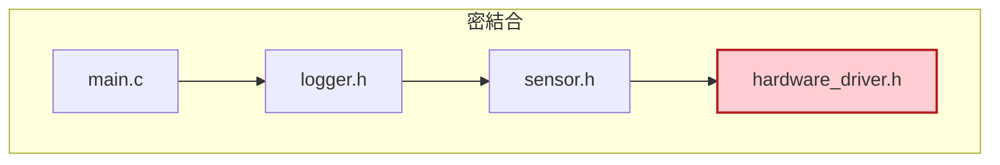
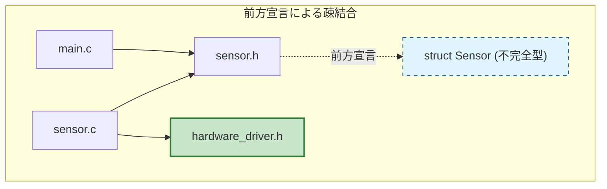
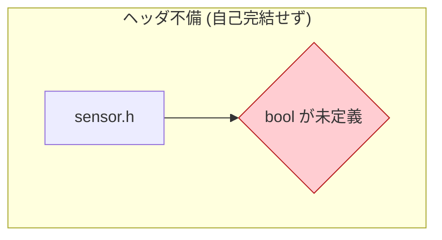
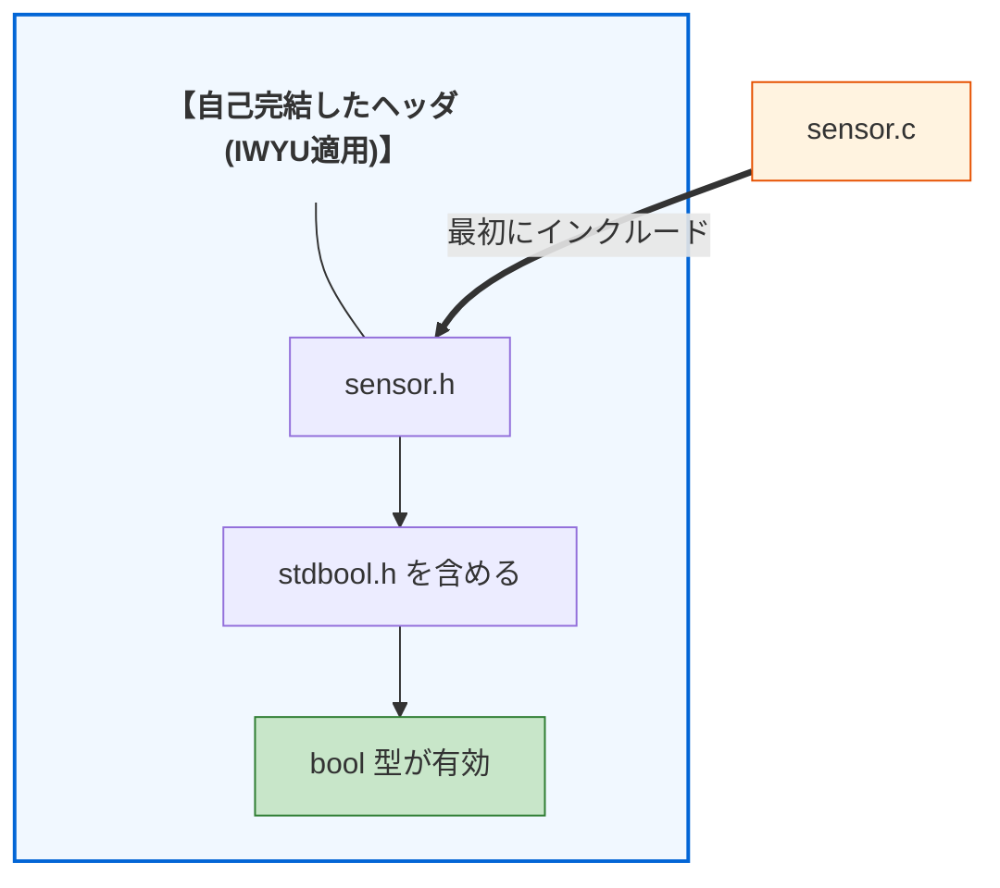
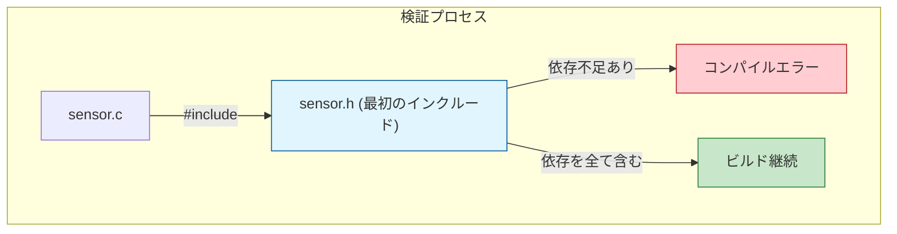
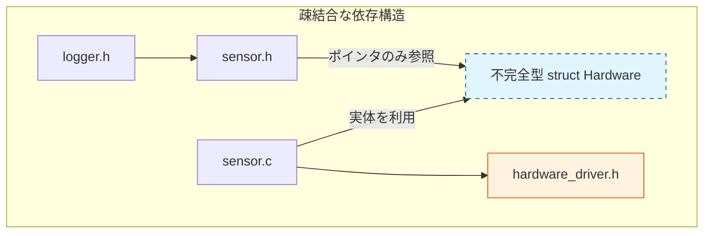
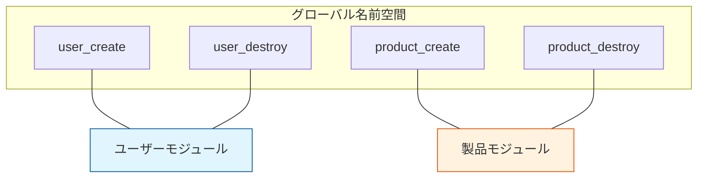

# 第1部 第5章 モジュール構成とヘッダ設計 - 最小限の契約公開と依存の最小化
## 1. 章の目的と設計的視点

#### ヘッダデザインによる依存関係の最適化

これまでに、`static`による **責任** の局所化、 **関数ポインタ** による **契約** を通じた **依存** の切断、そして **第4章 不完全型** での **型の隠蔽** （抽象化）について学びました。本章では、これらの技術を統合し、モジュール設計の **外部的な側面** 、すなわち **ヘッダファイル** （`.h`）の **デザイン** に焦点を当てて解説します。

C言語において、 **ヘッダファイル** こそが、モジュールが外部に対して提供する「 **契約** 」であり、モジュール間の **依存関係** を決定づける「 **境界線** 」です。ヘッダを厳格に設計する最大の目的は、モジュール間の **依存を最小化** することに他なりません。これにより、一つのモジュールの内部変更が他のモジュールに **連鎖的な再コンパイル** を引き起こさない **疎結合** な状態が達成され、ソフトウェアの **変更容易性** が大きく向上します。

#### なぜヘッダ設計が重要なのか：実際の開発での痛み

実際の開発で、こんな経験はありませんか？

*   **問題1**　「プロジェクトメンバーが『ちょっとした修正』で構造体のメンバ順を変えただけで、翌朝のビルドが30分もかかるようになった」
*   **問題2**　「sensor.h と device.h が互いにインクルードし合っていて、どちらを先にコンパイルしてもエラーになる『ヘッダ地獄』に陥った」
*   **問題3**　「logger.h をインクルードしただけで、なぜか network.h や database.h まで引きずり込まれ、全く関係ないコンパイルエラーが出る」

これらは **すべてヘッダ設計に起因する問題** です。本章では、これらの具体的な問題を解決する設計技法を学びます。

### 設計の三本柱とヘッダ設計の関係

#### 密結合 vs 疎結合な依存関係

ヘッダファイルの無秩序な取り扱いは、プロジェクトを密結合な構造に陥れます。以下の2つの図は、インクルード関係がもたらす **密結合（上図）** と **疎結合（下図）** の違いを比較したものです。

密結合な設計では、`main.c` が `logger.h` をインクルードするだけで、直接関係のない `hardware_driver.h` まで間接的に引きずり込まれています。これにより、連鎖的な再コンパイルの負担や、不要な変更の影響を強く受けることになります。

対して疎結合な設計では、前方宣言や不完全型を活用することで依存の連鎖が断ち切られています。この構成なら、`main.c` は `sensor.h` が提供するインターフェースの「契約」のみに依存するため、内部実装である `hardware_driver.h` の影響を一切受けないクリーンな状態に保たれます。





#### モジュール設計の三本柱：責任・契約・依存

C言語におけるモジュール設計を支える三本柱は、以下の要素で構成されます。これらは互いに補完し合い、変更に強く堅牢なシステムを構築します。

#### 1. 「責任」の明確化：シンボルの所属を定義する

C言語には言語レベルでの「名前空間（Namespace）」が存在しません。そのため、 **プレフィックス規約** （例：`Book_`, `UI_`）を用いて、各関数や型がどのモジュールに属するかを明示すること。これが、 **責任の境界** を引くための第一歩となります。これにより、名前の衝突を防ぐだけでなく、そのコードが「誰の管轄か」を開発者が一目で判断できるようになります。

#### 2. 「契約」の安定：外部との約束を固定する

モジュールの外部に公開するAPI宣言をヘッダファイルに集約し、`typedef` などで抽象化されたインターフェースを構築します。内部実装（`.c`ファイル）がどれほど変更されても、ヘッダという**契約**が安定していれば、利用側のコードを修正する必要はありません。これが、システム全体の **変更耐性** を高める核となります。

#### 3. 「依存」の最小化：結合を緩やかに保つ

 **前方宣言** や **IWYU（Include What You Use）原則** を徹底し、不要な `#include` を排除することで、モジュール間の **コンパイル時依存** を最小化します。「ヘッダの中で別のヘッダを過剰に読み込む」ことを防げば、一部の修正が全体に波及する「再コンパイルの連鎖」を食い止め、 **疎結合** なシステムを実現できます。

> [!NOTE] 読者の疑問：モジュールとヘッダファイルは1対1ですか？
> 「『モジュールの外部に公開するAPIをヘッダに書く』とありますが、1つのモジュールに対してヘッダファイルは必ず1つ（`1モジュール = 1.hファイル`）というルールなのでしょうか？」
>
> 原則として、機能単位としてまとまった**モジュールのメインとなるヘッダ（例: `user.h`）は1つ**であることが多いですが、必ずしも厳密に1対1にこだわる必要はありません。
> 例えば、1つの大きなモジュールの中に「誰もが使える一般的な機能」と「管理者向けにだけ公開したい特殊な機能」が混在している場合、安全性を高めるために `user.h` (一般向け) と `user_admin.h` (管理者向け) のように、**公開する相手（アクター）に合わせてヘッダを複数に分割する**ことも有効なアーキテクチャ設計の一つです。重要なのは「ファイル数が1対1であること」よりも、「誰に対してどんな契約を公開するか」を制御することです。

## 2. ヘッダ設計の具体的な活用パターン

### 2.1. 活用パターン 1: Include What You Use (IWYU) 原則の適用

最初のパターンは **「使うものだけをインクルードする（IWYU）」** という原則の実践です。ヘッダファイルが必要以上の依存関係を持つと、変更時の影響範囲が広がりビルド時間も増加します。最小限のインクルードで依存を絞り込む方法を示します。

#### システム概要

ヘッダファイルが「自己完結」していることを保証し、どの順番でインクルードしても正しくコンパイルできるようにする。

*   **センサーの状態確認（bool型を使用）**
*   **センサーの生成と破棄**
*   **依存関係を明示したヘッダ構成**

#### 設計課題

C言語のヘッダファイルは単なるテキストのコピペ（`#include`）であるため、もし `sensor.h` の中で `bool` 型を使っているのに `<stdbool.h>` をインクルードしていないとどうなるでしょうか。利用側のプログラマは、`sensor.h` を読み込む前にわざわざ「おまじない」のように `<stdbool.h>` を先にインクルードしなければならなくなります。このような「隠れた依存関係」は、ファイル群の読み込み順序に暗黙のルールを強要し、インクルードの順番を一つ間違えただけで謎のコンパイルエラーが大量発生する脆いシステムを生み出します。

#### 設計の意図

この「インクルード順序への依存」を排除するための原則が **IWYU（Include What You Use：自分が使うものは自分でインクルードする）** です。ヘッダファイルは、自分自身が必要とする型定義やマクロを自らインクルードし、「単体でコンパイル可能（自己完結）」な状態を保たなければなりません。そしてこの自己完結性を担保するため、実装ファイル（`.c`）では、必ず「自分自身のヘッダを一番最初にインクルードする」というテストを課すことで、依存の欠落をコンパイル時に即座に検知（フェイルファスト）させます。

#### 自己完結したヘッダの構造

ヘッダファイルが単体でコンパイル可能である状態（自己完結）と、そうでない状態の違いを示しています。

*   **検証プロセス**　`sensor.c` が `sensor.h` を一番最初にインクルードすることで、`sensor.h` が必要なヘッダ（stdbool.hなど）を依存不足なく含んでいるかどうかをコンパイラがチェックします。
*   **自己完結していないヘッダ（赤）** はコンパイルエラーの原因となりますが、 **IWYUを適用したヘッダ（青）** は安全です。






それでは、実際のアンチパターンを見てみましょう。以下は自己完結していないヘッダの典型例です。

ここでは、関数の戻り値に `bool` 型が使われているにもかかわらず、その定義元である `<stdbool.h>` をインクルードしていません。このようなヘッダは単体ではコンパイルできず、これを使う利用側に対して「必ず先に `<stdbool.h>` を読み込むこと」という暗黙のルールを強いることになります。これはモジュールとしての契約が不完全であることを意味しています。

#### sensor.h (依存不足による不完全なヘッダ設計（アンチパターン）)
```c
// <stdbool.h> をインクルードしていない
typedef struct Sensor Sensor_t;
Sensor_t* sensor_create(void);
bool sensor_is_ready(Sensor_t* sensor);  // bool型を使っているが定義がない
void sensor_destroy(Sensor_t* sensor);
```

利用側（クライアント）が、インクルードされる側の不備を無理やりカバーしている危険な例です。

クライアントコードが `sensor.h` を使う前に、わざわざ `<stdbool.h>` を先に読み込んで依存関係を自力で解決しています。現状はギリギリでコンパイルが通り「動いている」状態ですが、将来インクルードの順序が変わった瞬間に崩壊する、非常に脆い設計です。

#### application.c (利用側への不当な負担（アンチパターンの利用）)
```c
#include <stdbool.h>  // 先にこれをインクルードしてしまう
#include "sensor.h"   // この時点では bool が定義済みなのでエラーにならない

void use_sensor(void) {
    Sensor_t* s = sensor_create();

    if (sensor_is_ready(s)) {  // 問題なくコンパイルできてしまう
        // センサー読み取り処理
    }
    sensor_destroy(s);
}
```

この「自己完結していない」という欠陥は、実装ファイル (`sensor.c`) において最も顕著に現れます。

実装ファイル内で、自らの契約（インターフェース）を確認しようと `sensor.h` をインクルードした瞬間、`bool` が未定義であるためコンパイルエラーが発生してしまいます。外部の利用者が運良く依存関係をカバーしていたとしても、根本的な欠陥はこうして露呈します。

#### sensor.c (コンパイル不能な実装ファイル（不備の露呈）)
```c
#include "sensor.h"  // bool が未定義なのでコンパイルエラー！
// error: unknown type name 'bool'
#include <stdlib.h>

struct Sensor {
    int status;
};

Sensor_t* sensor_create(void) {
    Sensor_t* s = malloc(sizeof(struct Sensor));

    if (s != NULL) {
        s->status = 0;
    }

    return s;
}

bool sensor_is_ready(Sensor_t* sensor) {
    return sensor != NULL && sensor->status == 1;
}

void sensor_destroy(Sensor_t* sensor) {
    free(sensor);
}
```

これを解決するのが「IWYU（Include What You Use：自分が使うものは自分でインクルードする）」の原則に基づいた設計です。

改善された以下のヘッダでは、自身が必要とする `<stdbool.h>` を明示的にインクルードしています。これによりヘッダが自己完結し、クライアントがどのような順序でファイルを読み込んだとしても安全に機能する、完全な契約（インターフェース）が成立します。

#### sensor.h (IWYU原則に基づく自己完結したヘッダ設計)
```c
#ifndef SENSOR_H
#define SENSOR_H
#include <stdbool.h>  // 必要な依存を明示的にインクルード

typedef struct Sensor Sensor_t;
Sensor_t* sensor_create(void);
bool sensor_is_ready(Sensor_t* sensor);
void sensor_destroy(Sensor_t* sensor);
#endif // SENSOR_H
```

実装ファイルでは、このインターフェースの自己完結性を自ら証明するために、自身のヘッダを必ず最初に（他のどの標準ライブラリよりも前に）インクルードします。

もしヘッダ側に依存関係の漏れがあれば、一番最初に行われるこのインクルードで即座にコンパイルエラーとなるため、問題を早期に検知（フェイルファスト）することができます。これが、変更に強い堅牢なシステムを構築するための基礎となります。

#### sensor.c (自身のヘッダを検証するインクルード順序)
```c
// IWYU原則：自身のヘッダを最初にインクルード
#include "sensor.h"
// この時点で sensor.h が自己完結しているか検証される
// もし sensor.h に問題があれば、ここで即座にエラーになる
#include <stdlib.h>

struct Sensor {
    int status;
};

Sensor_t* sensor_create(void) {
    Sensor_t* s = malloc(sizeof(struct Sensor));

    if (s != NULL) {
        s->status = 0;
    }

    return s;
}
```

#### 状態判定関数の実装

続いて、センサーの状態を確認する関数です。内部の `status` 変数を直接公開せず、このような関数を通じてアクセスさせる（カプセル化する）ことで、将来的な状態判定ロジックの変更にも柔軟に対応できるようになります。

#### sensor.c
```c
bool sensor_is_ready(Sensor_t* sensor) {
    return sensor != NULL && sensor->status == 1;
}
```

#### 自身が確保したリソースの破棄

最後に、使用が終わったセンサーリソースを破棄する関数です。`sensor_create` で確保したメモリは、提供元であるこのモジュールの責任において確実に解放しなければなりません。

#### sensor.c
```c
void sensor_destroy(Sensor_t* sensor) {
    free(sensor);
}
```

IWYU原則によって自己完結性が保証されたヘッダを利用する、改善後のクライアントコードです。

もはやクライアント側で `<stdbool.h>` を気にする必要はありません。`sensor.h` を一つインクルードするだけで、安全にセンサーの機能を利用することができます。このように「利用側に内部の依存関係を意識させない」ことこそが、優れた契約（インターフェース）の姿と言えます。

#### application.c (クリーンな依存によるクライアントコード)
```c
#include "sensor.h"  // sensor.h が自己完結しているので安全

void use_sensor(void) {
    Sensor_t* s = sensor_create();

    if (sensor_is_ready(s)) {
        // 処理
    }
    sensor_destroy(s);
}
```

#### IWYU原則による設計上の改善点と達成される価値

| 改善項目 | 具体的な効果 | 達成される設計価値 |
| --- | --- | --- |
| **ヘッダの自己完結** | 利用側が「どのヘッダを先に読み込むか」という順序を気にする必要がなくなり、暗黙の依存関係が排除される。 | **堅牢性** |
| **早期のエラー検出** | 実装ファイル（`.c`）の冒頭で自ヘッダを読み込むことで、依存不足をコンパイル時に即座に検知し、バグの潜伏を防ぐ。 | **保守性** |
| **推移的依存の排除** | 必要な型や定義を明示的にインクルードすることで、隠れた依存による予期せぬ変更波及を遮断する。 | **変更容易性** |

#### コンパイル時の検証フロー

IWYU原則に従ってコードを書くことで、コンパイルプロセス自体が「ヘッダの品質チェック」として機能する様子です。

*   **最初のインクルード**　最初に自ヘッダを読み込むことで、他のヘッダによる「お膳立て」なしで動くかをテストしています。



### 2.2. 活用パターン 2: 前方宣言による依存の切断

次は **前方宣言（Forward Declaration）** によってコンパイル依存を削減するパターンです。ヘッダのインクルードを前方宣言で代替できる場合にその手法を適用することで、モジュール間の不要な静的依存を物理的に切断します。

#### システム概要

センサーモジュールとロガーモジュール、ハードウェアドライバモジュール間の依存関係を整理し、不要な再コンパイルを防ぐ。

*   **センサーから値を読み取る**
*   **読み取った値をログに出力する**
*   **センサーはハードウェアを利用するが、ロガーなどの利用者にはハードウェアの詳細を見せない（隠蔽する）**　

#### 設計課題

「センサーを扱う」ことと「センサーがどんなハードウェアドライバで動いているか」は本来別の問題（責任）です。しかし、センサーのヘッダファイル（`sensor.h`）の中で、ハードウェア操作用のヘッダ（`hardware_driver.h`）を無邪気にインクルードしてしまうと、単に「センサーの値をログに出したいだけ」のロガーモジュールまでが、強制的にハードウェアの詳細情報に依存させられてしまいます。これを推移的依存と呼びます。この状態では、ハードウェアのドライバ仕様が少し変わっただけで、ハードウェアとは無関係なロガーやUIモジュールまでが巻き添えになって再コンパイルされるため、開発規模の増大とともにビルド時間が爆発的に延びてしまいます。

#### 設計の意図

この推移的依存の連鎖を断ち切る特効薬が **「前方宣言（Forward Declaration）」** です。ヘッダファイルの中では `struct Hardware;` と名前だけを宣言し、ポインタとしての参照関係だけに留めます。具体的なハードウェアヘッダのインクルードは実装ファイル（`sensor.c`）の内部に押し込めることで、「利用者に教える必要のない実装の詳細」をコンパイルレベルで見事に隠蔽し、システムの結合度を劇的に下げる（疎結合化する）ことができます。

#### 疎結合な依存構造

前方宣言を用いることで、ヘッダファイル間の依存（矢印）を断ち切り、実装ファイル（.c）に依存を閉じ込める構造です。

*   **点線**　`sensor.h` は `struct Hardware` の中身を知らず、ポインタとしてしか扱いません。

これにより `hardware_driver.h` への依存が消えています。`logger.h` は `sensor.h` しか知らず、`hardware_driver.h` の存在すら知りません。



まずは、前方宣言を用いずにヘッダファイルを直接インクルードしてしまっているアンチパターンから見ていきましょう。

以下の `sensor.h` では、構造体のメンバとして実体（値そのもの）を持たせるために、安易に `hardware_driver.h` をインクルードしてしまっています。これにより、ハードウェアの詳細という「実装の裏側」が、公開インターフェースを通じて外部へ無防備に漏れ出している状態です。

#### sensor.h (ハードウェア詳細への不必要な依存（アンチパターン）)
```c
#include <stdint.h>
#include "hardware_driver.h"  // ハードウェア層への依存を公開してしまっている
// 内部構造を完全に公開
typedef struct {
    uint8_t sensor_type;
    // HardwareHandleの実体（値）を持っているため、
    // hardware_driver.h のインクルードが必須になってしまっている。
    HardwareHandle hw;
    float last_value;
} Sensor;
float sensor_read(Sensor* sensor);
```

その結果、深刻な被害を受けるのが利用側のコードです。

例えば、以下のロガー用ヘッダは、ただ単に `sensor.h` で宣言された機能を使いたいだけです。しかし、`sensor.h` をインクルードした瞬間に、裏側にある `hardware_driver.h` や、さらにその先の依存ツリー全体まで意図せず引きずり込まれてしまいます。これを「推移的依存の被害」と呼びます。

#### logger.h (推移的依存による被害の波及（アンチパターンの利用）)
```c
// これをインクルードすると...
// hardware_driver.h も自動的にインクルードされる（推移的依存）
#include "sensor.h"

void log_sensor_data(Sensor* s);
```

それでは、前方宣言を用いてこの依存の連鎖を断ち切る設計を見ていきましょう。

まずは最下層となるハードウェア層のAPI定義です。ここではハードウェア操作に関する必要な契約（API）のみを公開しており、上位モジュールから実装の詳細を完全に隠蔽しています。

#### hardware_driver.h (ハードウェア層の抽象化API定義)
```c
#ifndef HARDWARE_DRIVER_H
#define HARDWARE_DRIVER_H
// ハードウェアハンドルの定義
typedef struct {
    unsigned int id;
    int is_open;
} HardwareHandle;
// ハードウェア操作API
HardwareHandle hardware_init(unsigned int id);
float hardware_read_data(HardwareHandle* hw);
void hardware_close(HardwareHandle* hw);
#endif
```

#### ハードウェア初期化のダミー実装

こちらはハードウェア層の実装部分です。今回は依存構造に焦点を当てるため、実際のデバイス操作の代わりにログ出力を行うダミー実装（スタブ）として構成しています。

まずはハードウェアを初期化し、ハンドルを返す関数です。

#### hardware_driver.c
```c
#include "hardware_driver.h"
#include <stdio.h>

HardwareHandle hardware_init(unsigned int id) {
    HardwareHandle hw = { .id = id, .is_open = 1 };
    printf("[Hardware] Initialized ID: %u\n", id);

    return hw;
}
```

#### 仮想ハードウェアからのデータ読み取り

続いて、ハードウェアから実際のデータを取得する読み取り関数です。ここでも単体テストを容易にするため、固定のダミー値を返しています。

#### hardware_driver.c
```c
float hardware_read_data(HardwareHandle* hw) {
    if (!hw || !hw->is_open) return 0.0f;

    return 23.5f; // ダミー値
}
```

#### ハードウェアリソースの解放表現

最後に、リソースを解放するための終了関数です。内部フラグを落として終了処理をシミュレートし、その状態を追跡できるようログに出力します。

#### hardware_driver.c
```c
void hardware_close(HardwareHandle* hw) {
    if (hw) {
        hw->is_open = 0;
        printf("[Hardware] Closed ID: %u\n", hw->id);
    }
}
```

ここからが本題となる、改善されたセンサーモジュールのインターフェースです。

最大のポイントは、`hardware_driver.h` のインクルードが完全に排除され、代わりに `typedef struct Sensor Sensor_t;` という「不完全型」によって前方宣言のみが行われている点です。これにより、センサーの利用者は内部的なハードウェアの存在を一切意識せずに済みます。結果として依存関係が極めてクリーンになり、全体のビルド速度と保守性が劇的に向上します。

#### sensor.h (前方宣言による依存の完全排除（不完全型の活用）)
```c
#ifndef SENSOR_H
#define SENSOR_H
// 設計の勘所: ここで hardware_driver.h をインクルードしないことが重要です。
// 不完全型を用いることで、利用側（logger.cなど）をハードウェアの定義から物理的に切り離します。
typedef struct Sensor Sensor_t;
// 契約：センサーモジュールが提供する公開API
// 内部構造体へのポインタ（Sensor_t*）のみをやり取りする
Sensor_t* sensor_create_hardware(unsigned int hw_id);
int sensor_read(Sensor_t* sensor, float* out_value);
void sensor_destroy(Sensor_t* sensor);
#endif // SENSOR_H
```

それでは、分離されたハードウェア層への依存をどこで引き受けるかというと、実装ファイルである `sensor.c` 内に限定されます。

ここで初めて、隠蔽される実体である `Sensor` 構造体を具体的に定義します。ヘッダに構造体定義を書かないことで、`hardware_driver.h` への依存をこのファイル内だけに完全に封じ込め、外部への波及を遮断しています。

#### sensor.c (実装ファイルへの依存の封じ込め)
```c
#include "sensor.h"
// 実装でのみ必要な依存関係（ヘッダには現れない）
// sensor.c は hardware_driver.h に依存しますが、これは「実装の詳細」です。
// hardware_driver.h が変更されても、再コンパイルが必要なのは sensor.c だけであり、
// sensor.h を利用している他のモジュール（logger.cなど）には影響が及びません。
#include "hardware_driver.h"
#include <stdlib.h>
#include <stdio.h>

// 内部構造の完全な定義（外部から見えない）
struct Sensor {
    unsigned int sensor_type;
    HardwareHandle hw;
    float last_value;
};
```

#### 依存関係を肩代わりする生成関数

次に、センサーオブジェクトの生成関数です。利用者に代わって内部のハードウェア初期化を肩代わりし、構築済みの抽象化されたインターフェースのみを外部へ提供します。

#### sensor.c
```c
Sensor_t* sensor_create_hardware(unsigned int hw_id)
{
    Sensor_t* sensor = malloc(sizeof(struct Sensor));

    if (sensor == NULL) return NULL;
    sensor->sensor_type = 0;
    sensor->hw = hardware_init(hw_id);
    sensor->last_value = 0.0f;
    printf("[sensor.c] Sensor created (HW ID: %u)\n", hw_id);

    return sensor;
}
```

#### ハードウェア操作をラップした読み取り機能

続いて、実際の読み取りを行う関数です。ハードウェア固有の操作をラップし、外部のクライアントが直接ハードウェアを叩くことなく安全にデータにアクセスできる経路を提供します。
#### sensor.c
```c
int sensor_read(Sensor_t* sensor, float* out_value)
{
    if (sensor == NULL || out_value == NULL) return -1;
    sensor->last_value = hardware_read_data(&sensor->hw);
    *out_value = sensor->last_value;

    return 0; // 成功
}
```

#### モジュール内で完結するリソースの破棄

最後に、リソースを破棄する関数です。`sensor_create_hardware` で確保したメモリやオープンしたデバイスハンドルなど、モジュール内部で抱え込んだ依存リソースは、すべてこのモジュールの責任として漏れなく解放処理を行います。

#### sensor.c
```c
void sensor_destroy(Sensor_t* sensor)
{
    if (sensor != NULL) {
        hardware_close(&sensor->hw);
        printf("[sensor.c] Sensor destroyed\n");
        free(sensor);
    }
}
```

これまでの改善を反映し、クリーンな状態でセンサーを利用するロガーモジュールの実装を見ていきましょう。

まずはヘッダファイルです。`sensor.h` をインクルードしていますが、改善された `sensor.h` は他への依存を持たないため、ロガー側にも余計な情報が混入しません。モジュール間が疎結合になり、高い保守性が保たれています。

#### logger.h (疎結合なロガーのインターフェース)
```c
// logger.h
#ifndef LOGGER_H
#define LOGGER_H
// センサーの抽象契約（ポインタ型）のみを利用するため、
// hardware_driver.h の影響を受けない。
#include "sensor.h"

void log_sensor_data(Sensor_t* s);
#endif // LOGGER_H
```

具体的なログ出力を行う実装部分です。ここでも `Sensor_t` という不透明ポインタのみを経由してアクセスしているため、ハードウェアドライバという実装詳細に依存することなくロジックを構成できています。

#### logger.c (抽象に依存したデータ出力の実装)
```c
#include "logger.h"
#include <stdio.h>

void log_sensor_data(Sensor_t* s)
{
    if (s == NULL) return;
    float value;
    if (sensor_read(s, &value) == 0) {
        printf("[Logger] Sensor value: %.2f\n", value);
    } else {
        printf("[Logger] Failed to read sensor data.\n");
    }
}
```

最後に、これまで定義してきた各モジュールを結合し動作させる、エントリーポイントとなる `main.c` です。

ここでは、構築済みの `Sensor_t` の生成を指示し、そのポインタをロガーに渡すだけで処理が完結しています。具体的なデバイス仕様や初期化の裏側を一切知る必要がない、理想的に疎結合なクライアントコードとなっています。

#### main.c (構成ルートにおけるモジュールの統合)
```c
#include "sensor.h"
#include "logger.h"
#include <stdlib.h>

int main(void)
{
    Sensor_t* s = sensor_create_hardware(42);

    if (s != NULL) {
        log_sensor_data(s);
        sensor_destroy(s);
    }

    return EXIT_SUCCESS;
}
```

#### デバイス操作を隠蔽した連携の実行結果

各モジュールが連携して動作しています。

#### 実行結果
```c
[Hardware] Initialized ID: 42
[sensor.c] Sensor created (HW ID: 42)
[Logger] Sensor value: 23.50
[Hardware] Closed ID: 42
[sensor.c] Sensor destroyed
```

#### 設計上の改善点と達成される価値

| 改善項目 | 具体的な効果 | 達成される設計価値 |
| --- | --- | --- |
| **依存の局所化** | ハードウェアドライバに変更があっても、その影響範囲を `sensor.c` 内だけに限定できる。 | **変更容易性** |
| **責任の明確化** | ログモジュールがハードウェアの詳細を知る必要がなくなり、自身の責務に集中できる。 | **保守性** |
| **再コンパイルの最小化** | `hardware_driver.h` が変更されても、依存していない `logger.c` の再ビルドを防げる。 | **変更容易性** |

### 2.3. 活用パターン 3: プレフィックス規約による名前空間の確保

最後は、C言語に名前空間機能がないことへの対策として **プレフィックス規約** を徹底するパターンです。モジュール名をプレフィックスとした命名規則を一貫して適用することで、名前の衝突を防ぎ大規模プロジェクトでの可読性と保守性を高めます。

#### システム概要

ユーザー管理モジュールと製品管理モジュールのように、異なるモジュールで似たような名前の関数（create, destroyなど）を使いたい場合に、名前の衝突を避ける。

*   **ユーザーの作成と破棄**
*   **製品の作成と破棄**
*   **プレフィックス（接頭辞）を用いて擬似的な名前空間を実現する**

#### 設計課題

C言語やC++の一部言語機能には、Javaの`package`やC++の`namespace`のように「識別子の有効範囲を分割する機能（名前空間）」が存在しません。そのため、複数の異なるモジュールがそれぞれ `init`、`create`、`destroy` といった直感的で短すぎる名前の関数を定義して公開してしまうと、システム全体をリンク（結合）する最終段階で「同じ名前の関数が複数定義されている」という致命的なリンカエラーが発生してしまいます。

#### 設計の意図

この言語的な制約を克服するための唯一にして最大の自衛手段が、 **プレフィックス（接頭辞）の強制** です。モジュール名に基づいたプレフィックス（`user_`, `product_` など）をすべての公開APIや構造体、マクロに付与することをコーディング規約として定めます。これにより、グローバルな空間における物理的な名前の衝突を構造的に回避すると同時に、コードを読む側に対しても「この関数がどのモジュールに属しているか」を一目で伝える強力な自己文書化の効果をもたらします。

#### 名前空間の擬似的な実現

グローバルな名前空間において、プレフィックスを付けることで、論理的にモジュールごとの領域を確保している様子です。

*   **衝突回避**　`user_create` と `product_create` は別のシンボルとして扱われます。
*   **所属の明確化**　関数名を見るだけで、それがどのモジュールに属するかが一目瞭然です。



まずは、プレフィックスが存在しないアンチパターンから見ていきましょう。

以下の `user.h` では、`create` や `destroy` といった一般的すぎる名前をそのまま使用しています。単体テストの段階では気づきにくいですが、別のモジュールと組み合わせてリンクしようとした途端、「同名のシンボルが複数存在する」というリンクエラーを引き起こします。再利用性を著しく損なう危険な設計です。

#### user.h (一般的すぎる名前による危険な設計（アンチパターン）)
```c
// user.h
typedef struct User User;
// プレフィックスがない
User* create(const char* name);
void destroy(User* user);
const char* get_name(const User* user);
// 定数も汎用的すぎる
#define MAX_NAME_LEN 100
```

もう一つのモジュールである `product.h` でも同様の過ちを犯していると、問題はさらに深刻になります。

*   複数のモジュールで全く同じ関数名（`create`, `destroy`）が使われるためリンクエラーが発生する。
*   汎用的なマクロ名（`MAX_NAME_LEN`）の再定義により、予期せぬコンパイルエラーや動作異常を引き起こす。
*   コードを読んだとき、その関数や定数が一体どのモジュールに属するものなのかが全く分からない。

#### product.h (他モジュールとの必然的な名前衝突（アンチパターンの利用）)
```c
typedef struct Product Product;
// 関数名が衝突する可能性
Product* create(const char* name);  // user.hのcreate()と衝突！
void destroy(Product* product);     // user.hのdestroy()と衝突！
// 定数名も衝突
#define MAX_NAME_LEN 50  // user.hのMAX_NAME_LENと衝突！
```

この問題を氷解させるのが「プレフィックス（接頭辞）規約」の適用です。

改善された以下のインターフェースでは、ユーザーモジュールの公開契約として、すべての関数・型・定数に `user_` または `USER_` というプレフィックスを強制しています。これにより、C言語に欠けている「名前空間」を擬似的に表現し、リンク時の重大なシンボル衝突を回避しています。どのモジュールに属するコードかが一目瞭然となるため、大規模開発において安全に統合できる堅牢な設計基盤となります。

#### user.h (プレフィックスを用いた擬似的名前空間の確立)
```c
#ifndef USER_H
#define USER_H

typedef struct User User_t;
// すべての公開関数に user_ プレフィックス
User_t* user_create(const char* name);
void user_destroy(User_t* user);
const char* user_get_name(const User_t* user);

// 定数にも USER_ プレフィックス
#define USER_MAX_NAME_LEN 100

// エラーコードも統一されたプレフィックス
enum {
    USER_OK = 0,
    USER_ERROR_INVALID_NAME,
    USER_ERROR_OUT_OF_MEMORY
};
#endif // USER_H
```

ユーザーモジュールの実装部分です。まずは構造体とオブジェクトの生成関数から見ていきます。

内部的な構造体定義にも、定数や関数と同様にプレフィックスの思想を適用しています。`user_create` 関数内では不正な初期化を防ぐためのチェック（長さ制限など）も徹底し、モジュールとしての責任を安全に果たしています。

#### user.c (プレフィックス規約を適用した具象構造と生成関数)
```c
#include "user.h"
#include <stdlib.h>
#include <string.h>
#include <stdio.h>

struct User {
    char name[USER_MAX_NAME_LEN];
    int id;
};

User_t* user_create(const char* name)
{
    if (name == NULL || strlen(name) >= USER_MAX_NAME_LEN) {
        printf("[user.c] Error: Invalid name\n");

        return NULL;
    }
    User_t* user = malloc(sizeof(struct User));

    if (user == NULL) return NULL;
    strncpy(user->name, name, USER_MAX_NAME_LEN - 1);
    user->name[USER_MAX_NAME_LEN - 1] = '\0';
    user->id = 1;
    printf("[user.c] User '%s' created\n", name);

    return user;
}
```

データの取得やメモリ解放も、もちろん専用のプレフィックス付き関数を通じて行います。

#### 名前に一貫性を持たせたアクセサ

まずは状態を取得するアクセサ関数です。NULLポインタを渡された場合の安全策も講じられ、堅牢な契約が守られています。

#### user.c
```c
const char* user_get_name(const User_t* user)
{
    if (user == NULL) return "[NULL USER]";

    return user->name;
}
```

#### ライフサイクルを追跡可能な破棄処理

最後に、リソースを破棄する関数です。メモリを解放すると同時に、どのユーザーが破棄されたかをログに出力してライフサイクルを追跡可能にしています。

#### user.c
```c
void user_destroy(User_t* user)
{
    if (user != NULL) {
        printf("[user.c] User '%s' destroyed\n", user->name);
        free(user);
    }
}
```

こちらは比較対象となる「製品（Product）」モジュールの改善後インターフェースです。

`user.h` と同様の考え方で、こちらにはすべて `product_` または `PRODUCT_` のプレフィックスを付与しています。これにより、同じプロジェクト内に存在しても互いに一切干渉することなく共存できるようになります。

#### product.h (競合を回避する別モジュールの独立インターフェース)
```c
#ifndef PRODUCT_H
#define PRODUCT_H
// 他の定数は define マクロでもOK
#define PRODUCT_MAX_NAME_LEN 50

typedef struct Product Product_t;
// product_ プレフィックスで衝突を回避
Product_t* product_create(const char* name, float price);
void product_destroy(Product_t* product);
const char* product_get_name(const Product_t* product);
#endif // PRODUCT_H
```

製品モジュールの実装部分です。先ほどのユーザーモジュールと同様の構成に従います。

`Product` 構造体を定義し、`product_create` で初期化処理を行います。関数の振る舞いが `user.c` の生成関数と似ていても、明確な名前空間によって確実に区別され、それぞれのモジュールが自身の責務のみを全うします。

#### product.c (独立した名前空間内での実装定義)
```c
#include "product.h"
#include <stdlib.h>
#include <string.h>
#include <stdio.h> // printfのために追加

struct Product {
    char name[PRODUCT_MAX_NAME_LEN];
    float price;
};

Product_t* product_create(const char* name, float price)
{
    Product_t* product = malloc(sizeof(struct Product));

    if (product == NULL) return NULL;
    strncpy(product->name, name, PRODUCT_MAX_NAME_LEN - 1);
    product->name[PRODUCT_MAX_NAME_LEN - 1] = '\0';
    product->price = price;
    printf("[product.c] Product '%s' created\n", name);

    return product;
}
```

#### リソース管理の完遂（破棄関数）

続いて破棄関数です。確保したメモリを正しく解放し、リソースの管理責任を徹底しています。

#### product.c (続き)
```c
void product_destroy(Product_t* product)
{
    if (product != NULL) {
        printf("[product.c] Product '%s' destroyed\n", product->name);
        free(product);
    }
}
```

#### 製品データの安全な読み取り

最後に、アクセサ関数を通じて安全なデータ読み取り機能を提供します。

#### product.c (続き)
```c
const char* product_get_name(const Product_t* product)
{
    if (product == NULL) return "[NULL PRODUCT]";

    return product->name;
}
```

それでは、これら二つの独立したモジュールを同時に使用するクライアントのコードを見てみましょう。プレフィックス規約のおかげで、衝突を気にすることなく全く同じ要領で両者を安全に統合できることが確認できます。

#### main.c (プレフィックスによる衝突回避の統合利用)
```c
#include "user.h"
#include "product.h"
#include <stdio.h>
#include <stdlib.h>

int main(void)
{
    // 名前空間（プレフィックス）が異なるため、問題なく共存できる
    User_t* u = user_create("Alice");
    Product_t* p = product_create("Laptop", 999.99f);

    if (u && p) {
        printf("[main] User name: %s\n", user_get_name(u));
        printf("[main] Product name: %s\n", product_get_name(p));
        user_destroy(u);
        product_destroy(p);
    }

    return EXIT_SUCCESS;
}
```

#### 独立した名前空間をもつオブジェクトの共存結果

プログラムを実行すると、以下のようにユーザー名と製品名が正しく表示されます。名前空間の分離により、名前の衝突は発生しません。

#### 実行結果
```c
[user.c] User 'Alice' created
[product.c] Product 'Laptop' created
[main] User name: Alice
[main] Product name: Laptop
[user.c] User 'Alice' destroyed
[product.c] Product 'Laptop' destroyed
```

#### 命名規則（プレフィックス）による設計上の改善点

| 改善項目 | 具体的な効果 | 達成される設計価値 |
| --- | --- | --- |
|  **名前衝突の回避**  | `User_Create()` と `Product_Create()` のように、類似する目的の関数名でもプレフィックスにより共存が可能になる。 |  **保守性**  |
|  **責任の可視化**  | 関数名を見るだけで、そのシンボルがどのモジュールの責任（スコープ）に属しているか即座に判断できる。 |  **可読性**  |
|  **グレップ可能性**  | `grep "User_"` のように検索することで、特定のモジュールに関連する定義を一括で漏れなく抽出できる。 |  **保守性**  |
|  **新規参加者の理解促進**  | プレフィックスがコード構造を説明する「生きたドキュメント」の役割を果たし、学習コストを下げる。 |  **可読性**  |
