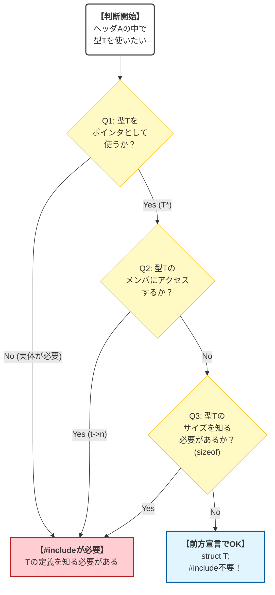

## 3. 設計判断と落とし穴のまとめ

### 前方宣言の判断フロー

**この図が示すもの**:

前方宣言が使えるケースと使えないケースの判断基準を示すフローチャートです。

**注目ポイント**:

* **不完全型の利用**: ポインタとして扱うだけなら、ヘッダをインクルードする必要はありません。
* **実体の必要性**: メンバにアクセスしたり、変数をスタックに確保したりする場合は、完全型（ヘッダのインクルード）が必要です。

**読み方のガイド**:

* 上から下へ、質問の答え（Yes/No）を辿ってください。

### ヘッダ設計のチェックリスト

コードを書くとき、常にこのチェックリストを意識してください。

### 1. IWYU (Include What You Use)
- [ ] 必要な型定義のために、必要なヘッダを明示的にインクルードしているか？
- [ ] 推移的依存（他のヘッダがインクルードしているから動く状態）に甘えていないか？
- [ ] **実装ファイル(.c)の先頭で、自身のヘッダ(.h)をインクルードしているか？**

### 2. 前方宣言 (Forward Declaration)
- [ ] ポインタとしてしか使っていない構造体に対して、無駄に `#include` していないか？
- [ ] 相互参照が生じそうな場合、前方宣言でサイクルを断ち切っているか？

### 3. 責任と名前空間
- [ ] 公開する型や関数すべてに、モジュール固有のプレフィックスが付いているか？
- [ ] マクロ定数の名前が一般的すぎて（例: `MAX_SIZE`）、他と衝突する恐れはないか？

### 4. ガードとC++互換性
- [ ] インクルードガード（`#ifndef ...`）は忘れていないか？
- [ ] C++から呼ばれる可能性を考慮し、`extern "C"` ブロックをつけるか検討したか？（ライブラリの場合）

## 本章で必ず理解してほしいことのまとめ

### ヘッダ設計の役割

### 1. **「契約書」としての品質を高める**
ヘッダファイルは、モジュールが外部と交わす契約書です。曖昧な記述（自己完結していない、依存関係が不明瞭）は、バグの温床となるだけでなく、利用者にプロトコルの解釈運用を強いることになります。

### 2. **コンパイル時間の短縮と開発効率の維持**
前方宣言を駆使して依存関係を「疎」に保つことは、大規模プロジェクトにおいてビルド時間を数分〜数十分単位で削減する効果があります。「たかがヘッダ」と思わず、物理的な依存グラフを常にクリーンに保つ意識を持ってください。

### 3. **変更に強いアーキテクチャの要**
「モジュールの内部実装を変えたら、なぜか無関係な箇所の再ビルドが走った」という現象は、ヘッダ設計の敗北です。不完全型と前方宣言を組み合わせることで、変更の影響を物理的に封じ込めることができます。

### 次章への橋渡し

**第5章**では、ヘッダファイルという「物理的な境界線」の引き方を学びました。
これで、適切なモジュール分割と、クリーンな依存関係を構築する準備が整いました。

しかし、どんなに綺麗にモジュールを分けても、現実のプログラムでは「失敗」が起こります。ファイルが開けない、メモリが足りない、ネットワークが繋がらない...。
これらの**エラー**をどう呼び出し元に伝え、どう処理させるか。これは「契約」の最も重要な一部です。

次章、**第6章 エラーハンドリングパターン - 堅牢な契約**では、C言語におけるエラー処理のパターン（戻り値、errno、Result型）を体系化し、使い分けの基準を明確にします。「想定外」を「想定内」にするための設計技術を身につけましょう。