# 第1部 第7章 メモリ管理パターン - 責任の明確化
## 1. 章の目的と設計的視点

前章（第6章）では、エラーハンドリングを「契約」の一部として定義する方法を学びました。本章では、そのエラーハンドリングの実践において最も頭を悩ませる問題、すなわち **「異常系におけるメモリ解放責任」** に焦点を当てます。

正常な処理を終えてメモリを返すのは容易ですが、エラーが発生して処理を中断する際、それまで確保したリソースを誰が、どのタイミングで片付けるべきか。この「エラー」と「メモリ」の交差点こそが、C言語設計における堅牢性の正念場となります。

C言語の設計において、メモリ管理は単なる技術的詳細ではなく、モジュール間の **「契約の明確さ」** と **「システムの堅牢性」** を決定づける **設計上の問題** です。動的に確保されたメモリの **所有権** (Ownership) を明確にすることは、メモリリークや二重解放といった深刻なバグを防ぐための最重要課題です。

### 1.1. メモリ管理における三つの根本的な問い

メモリ管理で混乱が生じる原因は、次の三つの問いに対する答えが不明確だからです。

#### 管理責任の所在

メモリ管理に関する「誰が」「いつ」という根本的な疑問と、それに対する設計上の解答を示しています。ここで最も重要な点は、メモリを「確保した人」ではなく、現在の「所有者」が解放責任を持つということです。

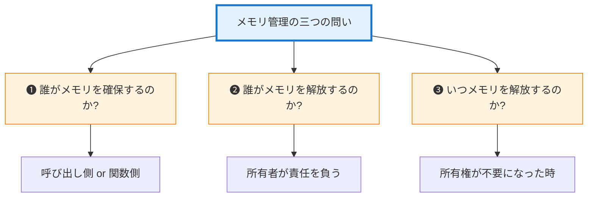


#### **本章の目標**

これら三つの問いに対する答えを、 **コードレベルで明確にする技術** を身につけましょう。

## 2. 所有権の三つの形態

堅牢なメモリ管理の鍵は、 **所有権** （＝解放責任）を明確にすることです。所有権には三つの基本形態があります。

### 2.1. 所有権形態の全体像

ここでは、所有権の移動と責任の所在を視覚的に整理します。以下の図では、 **赤色** が所有権を渡す側、 **緑色** が責任を持つ側（解放する側）、 **黄色** が一時的に作業する側を表しています。

#### 1. 形態 I: 移譲 (Transfer)

呼び出し側が作成済みのオブジェクトを関数に渡し、その後の管理（解放）をすべて任せるパターンです。

#### 移譲のフロー

移譲のフローでは、所有権が呼び出し元から関数へ移動し、関数側で寿命が尽きる（解放される）様子を上から下への流れで示しています。関数を呼び出した後、所有権は完全に関数側へと渡るため、呼び出し元は二度とそのリソースに触れてはいけません。

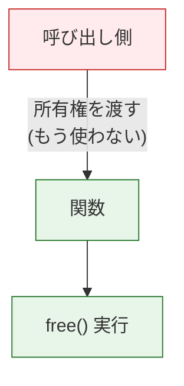

#### 2. 形態 II: 参照 (Borrow)

呼び出し側が所有権を保持したまま、関数に「貸し出す」パターンです。C言語において最も頻繁に使用されます。

#### 参照のフロー

所有権は呼び出し元に残ったままで、関数は一時的に利用するだけの様子です。

*   **返却**　関数はリソースを解放せず、そのまま呼び出し元に制御を戻します。

呼び出し元（緑）が最初から最後まで責任を持っています。

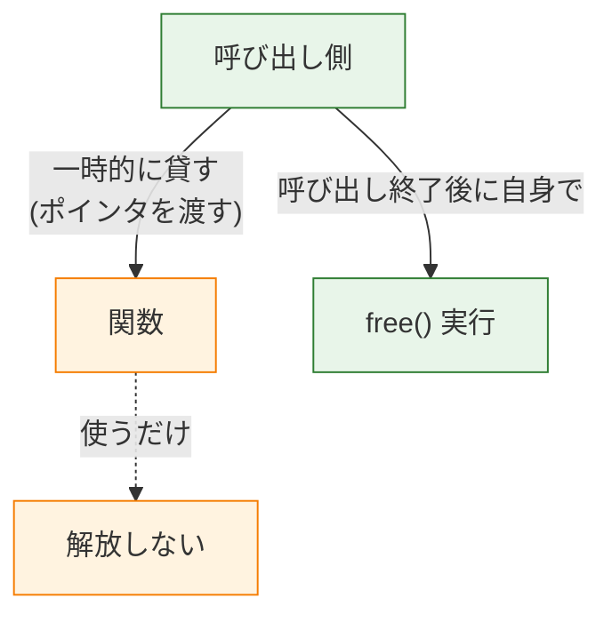

#### 3. 形態 III: 生成 (Create)

関数が新しいリソースを生成し、その管理責任を呼び出し側に「引き継ぐ」パターンです。

#### 生成のフロー

生成のフローでは、関数内で新しく確保されたリソースの所有権が、戻り値を通じて呼び出し元へ渡される様子を上から下への流れで示しています。この瞬間から、呼び出し元は受け取ったリソースを将来的に解放する義務（責任）を負うことになります。

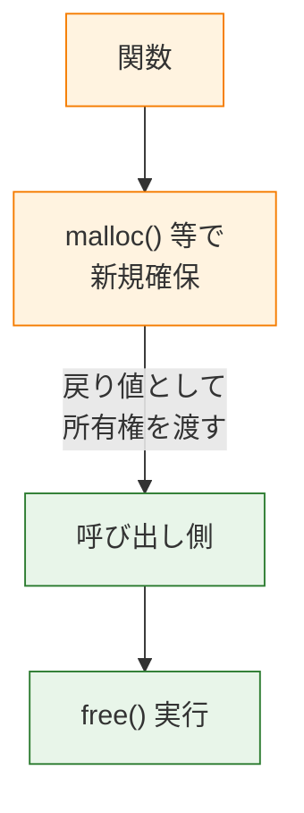

### 2.2. 各形態の詳細

#### 形態 I: 移譲 (Transfer) - 所有権を手放す

移譲パターンにおける呼び出し元（Caller）と関数（Callee）のやり取りのシーケンスです。

*   **呼び出し側 (Caller)**　呼び出し元のモジュール。
*   **呼び出され側 (Callee)**　呼び出される関数。
*   **所有権の移動**　関数呼び出し以降、呼び出し側はリソースに触れていない点（ **Dangling（ダングリング）ポインタ** 防止）。

※ダングリングポインタとは、解放済みの無効なメモリ領域を指しているポインタのことです。時間軸（上から下）に沿って、所有権の所在がCからFへ移る瞬間を確認してください。

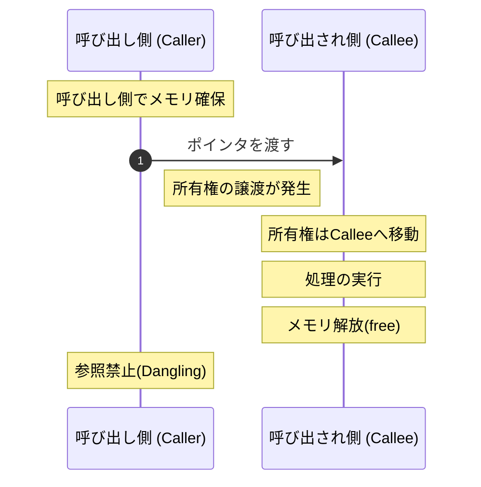

**典型的な使用例**:

この移譲パターンが利用される典型的な例としては、`destroy`や`free`、`close`といった **リソースを破棄する関数** や、 **データを別のモジュールに完全に移管する場合** が挙げられます。
例えば、後述する実装例のように、呼び出し元から受け取った `Resource` 構造体の内部データと構造体自身を関数内で一括して解放します。これは所有権が呼び出し元から関数へ「移譲」されることを意図しており、呼び出し元はこれ以降そのリソースにアクセスしてはならないという明確な契約を表しています。リソースの後始末を一箇所に集約し、確実にメモリを解放するための標準的な設計パターンです。

#### 移譲（Transfer）パターンの実装例
```c
// 移譲の例

void resource_destroy(Resource* res) {
    // 呼び出し側から所有権を受け取り、解放する
    free(res->internal_data);
    free(res);
    // 呼び出し側は res にアクセスしてはいけない
}
```

#### 形態 II: 参照 (Borrow) - 一時的に借りる
シーケンス図において、呼び出される関数での処理が終わった後、呼び出し側が責任を持って `free` を実行しています。所有権が関数に移動せず、常に呼び出し側に留まり続けていることを確認してください。

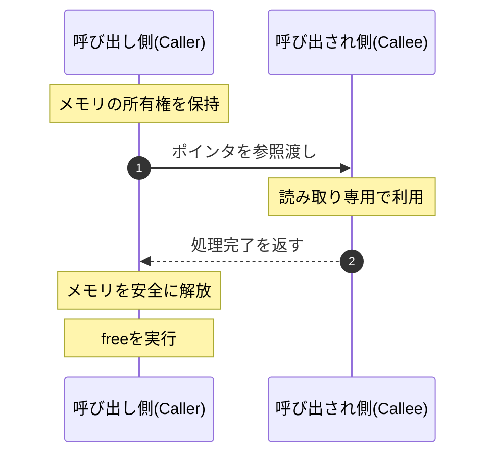

#### **典型的な使用例**

この参照パターンが使われる典型的な場面は、 **データを読み取るだけの関数** や、 **一時的な処理を行う関数** です。関数は受け取った構造体のメンバを参照して処理を行いますが、メモリの解放は一切行いません。関数がリソースのライフサイクルに責任を持たないことを明確にし、データの読み取り専用アクセスを保証することで、呼び出し側が安心してリソース管理を継続できる安全な設計となります。

#### 参照（Borrow）パターンの実装例
```c
// 参照の例

int process_data(const Data* data) {
    // データを使うだけ。解放しない
    printf("Processing: %s\n", data->name);

    return 0;
}
```

#### 形態 III: 生成 (Create) - 新しい所有権を作る

生成パターンでは、関数内部で新しいリソースが生成され、それが呼び出し元に引き渡されます。関数の戻り値としてポインタが返されると同時に、そのリソースの管理責任（解放責任）も呼び出し側に課せられます。関数で生まれたリソースが呼び出し元に渡り、最終的に呼び出し元の責任で解放されるという一連の流れを確認してください。

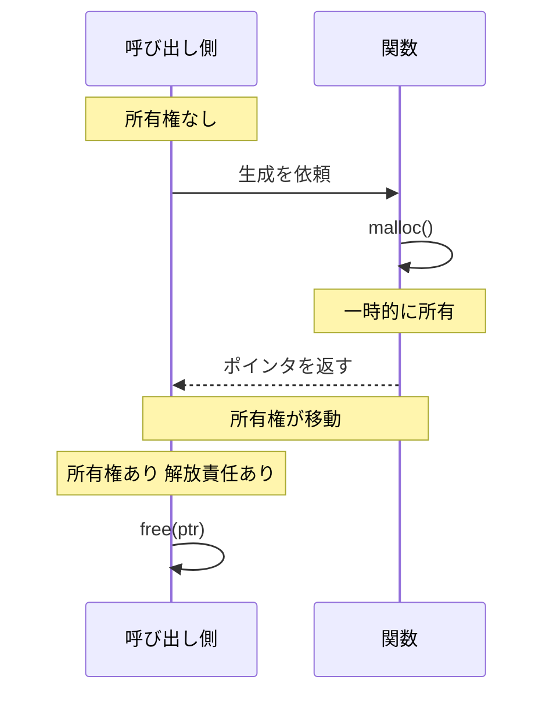

この生成パターンの典型的な使用例は、`create`や`new`、`alloc`といった **ファクトリ関数** や、 **計算結果として新しいデータを生成して返す関数** です。例えば、以下の実装例のように、関数内で構造体とその内部データを動的に確保し、初期化した上で呼び出し元に返します。
戻り値を通じて所有権と解放責任を呼び出し元に引き渡すとともに、もし生成途中でエラーが発生した場合には、途中まで確保したメモリを適切にクリーンアップして確実に `NULL` を返すような、堅牢なファクトリ設計が求められます。

#### 生成（Create）パターンの実装例
```c
// 生成の例

Resource* resource_create(size_t capacity) {
    Resource* res = malloc(sizeof(Resource));

    if (res == NULL) return NULL;
    res->internal_data = malloc(capacity);

    if (res->internal_data == NULL) {
        free(res);

        return NULL;
    }
    // 所有権を呼び出し側に渡す

    return res;
}
```

### 2.3. 所有権形態の判断フロー

#### 形態選択のガイドライン

関数の目的に応じて、どの所有権パターンを採用すべきかの判断基準を示しています。「作る」「使う」「捨てる」というアクションに合わせて適切な形態を選んでください。

Startから分岐に従って進み、最適な形態（Create/Destroy/Borrow）を見つけてください。

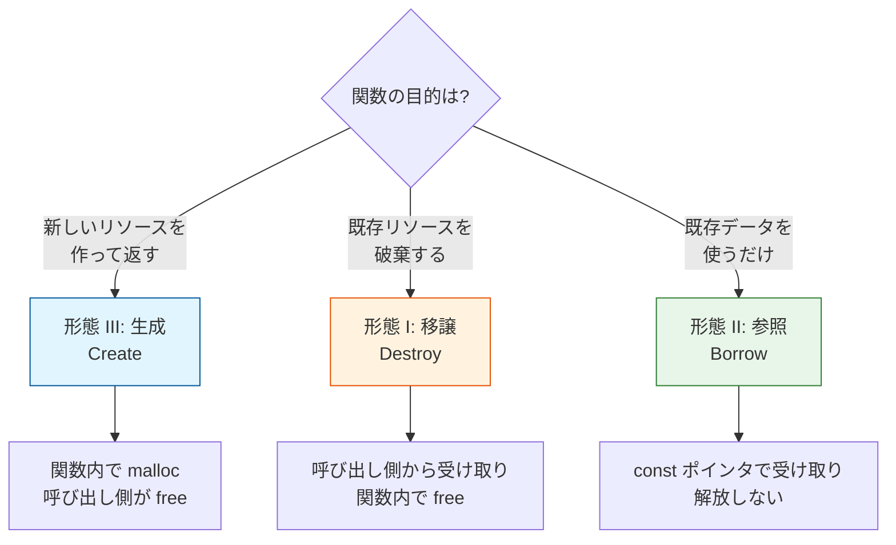

> [!NOTE] 読者の疑問：結局、これら3つのパターンをどう使い分ければいいの？
> 「移譲、参照、生成の3種類があることはわかりました。でも、実際のシステム設計で『どれを選ぶべきか』はどうやって決めるのでしょうか？」
>
> 非常に実践的な疑問です。迷ったときの基本ルールは **「原則として『参照（Borrow）』をデフォルトにする」** ことです。
> 関数にポインタを渡すとき、わざわざ関数の中でメモリを解放させる（移譲）必要は滅多にありません。呼び出し元が確保したものは、呼び出し元が自身で解放する方が設計として自然だからです。
> 「新しいオブジェクトを作って返したい」という明確な目的があるときだけ「生成（Create）」を使い、「このオブジェクトの寿命はここで完全に終わる」という後始末の場面でのみ「移譲（Destroy）」を使います。

## 3. メモリ管理の具体的な活用パターン

### 3.1. 活用パターン 1: Create/Destroy - ライフサイクル管理の王道

最初は **Create/Destroyペア** によるメモリ管理の基本パターンです。リソースの獲得と解放を対称的な1組の関数にまとめることで、所有権と解放責任を明確にして二重解放やメモリリークを防ぎます。

#### システム概要

動的メモリ確保（`malloc` / `free`）を伴うデータ構造（オブジェクト等）の「生成（誕生）」から「破棄（消滅）」までのライフサイクル全体を、安全に管理する標準的なモジュール設計です。

#### 設計課題

あらゆるモジュールにおいて、利用側がいちいち `malloc(sizeof(StructName))` と書いてメモリを確保し、不要になったら `free(obj)` を呼ぶ構造にするとどうなるでしょうか。もしその構造体が内部に別の動的配列（`internal_data` など）を持っていた場合、利用側は「中の配列を先に `free` してから、外側の構造体を `free` する」という内部事情まで知る必要が生じます。この知識の漏洩は深刻なメモリリークを引き起こし、システムの拡張を困難にします。

#### 設計の意図

この複雑さを一本化する設計の手法が、 **「形態 III: 生成 (Create)」と「形態 I: 移譲 (Destroy)」をセットにしたライフサイクル管理** です。モジュールは必ず専用の `_create` 関数と `_destroy` 関数をペアとして提供します。利用側は `_create` を呼んで「完成品のポインタ（所有権）」を受け取るだけでよく、不要になればそれを `_destroy` に渡すだけで事足ります。構造体の内部で何度 `malloc` されていようと、その解放責任（`free` の呼び出し）はすべて `_destroy` の背後に隠蔽（カプセル化）されるため、呼び出し側はリソース管理の詳細を一切知る必要がありません。

#### ライフサイクルと関数の対応

リソースには「誕生」「生存」「消滅」という明確なライフサイクルがあり、それぞれに対して専用の関数（API）が割り当てられます。ここで重要なのは、`_create` 関数と `_destroy` 関数が必ずセットになってライフサイクルの両端を担うという **対称的な関係** です。以下の図は、時間の流れに沿ったライフサイクルの変遷を示しています。

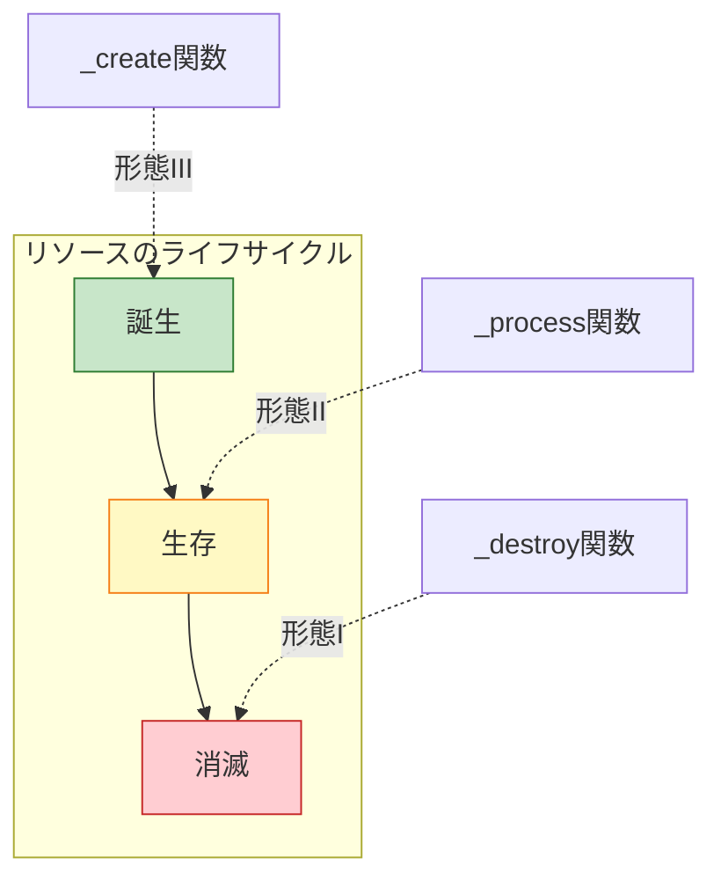

#### 設計の三原則

安全なライフサイクル管理を実現するためには、以下の図に示す3つのルールを守る必要があります。特に重要なのが **隠蔽** の概念です。内部リソースがどれほど複雑に確保されていようと、その管理責任をすべて `destroy` 関数に一任することで、呼び出し側の負担や知識の漏洩を根本から防ぐことができます。

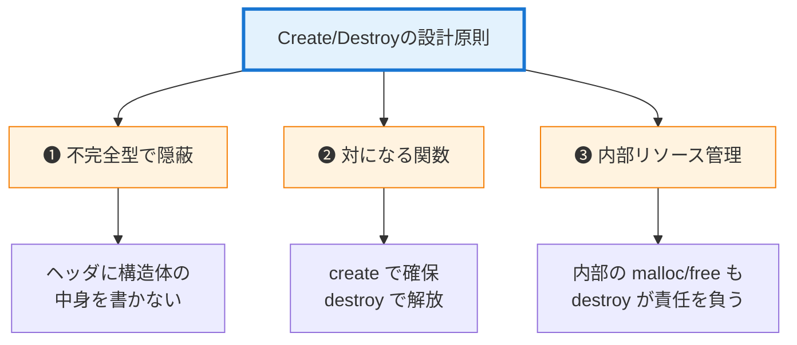

この例では、実践的なシステムを想定して設計原則の適用方法を示します。具体的なユースケースに基づいてコードを解説することで、抽象的な原則が実際のコードにどのように落とし込まれるかを理解することができます。

#### data_manager.h - 外部に公開する契約 (実装例)

モジュールの公開APIです。所有権の移動（生成、移譲、参照）がドキュメントコメントとして明記されています。

ライフサイクル管理（生成、移譲、参照）のための公開APIを定義しています。不完全型 `DataManager` を用いることで内部構造を隠蔽し、3つの所有権形態に対応する操作関数を提供しています。契約（前提条件・事後条件）が明確で、誤用を防ぎやすいインターフェースです。

#### data_manager.h (不完全型による内部構造の隠蔽と契約定義)
```c
#include <stddef.h>

// 不完全型：内部構造を隠蔽
struct DataManager;
typedef struct DataManager DataManager_t;

// 形態 III: 生成 - 新しい所有権を作る
// 戻り値: 成功時は新しいポインタ、失敗時は NULL
// 事後条件: 呼び出し側が解放責任を負う
DataManager_t* dm_create(size_t capacity);

// 形態 I: 移譲 - 所有権を受け取り破棄
// 前提条件: dm は dm_create で取得したポインタ
// 事後条件: dm は無効になる（呼び出し側はこれ以降 dm を使用してはならない）
void dm_destroy(DataManager_t* dm);

// 形態 II: 参照 - 一時的に借りる
// 前提条件: dm は有効なポインタ
// 事後条件: dm の所有権は変わらない
int dm_process(const DataManager_t* dm);
```

#### data_manager.c - 内部実装ファイル（責任の履行）

`dm_create` でのリソース確保と、`dm_destroy` での解放が完全に対称になっています。まず、構造体と生成関数です。

構造体の定義と、その生成処理（メモリ確保と初期化）を行っています。`dm_create` 関数のみが内部リソース（`int* data`）の存在を知っており、その確保責任を負っています。生成時の複雑さをカプセル化し、呼び出し側はポインタを受け取るだけで済むようになっています。

#### data_manager.c (内部リソースの確保と初期化（生成）)
```c
#include "data_manager.h"
#include <stdlib.h>
#include <stdio.h>

// 完全型：実装ファイルでのみ定義
struct DataManager {
    int* data;       // 内部リソース
    size_t capacity;
    size_t count;
};

// 形態 III: 生成の実装
DataManager_t* dm_create(size_t capacity) {
    printf("[生成開始] capacity=%zu\n", capacity);
    // 1. 構造体本体を確保
    DataManager_t* dm = malloc(sizeof(DataManager_t));

    if (dm == NULL) {
        printf("[生成失敗] 構造体の確保に失敗\n");

        return NULL;
    }
    // 2. 内部リソースを確保
    dm->data = malloc(sizeof(int) * capacity);

    if (dm->data == NULL) {
        printf("[生成失敗] 内部配列の確保に失敗\n");
        free(dm);  // 部分的に確保したものを解放

        return NULL;
    }
    // 3. 初期化
    dm->capacity = capacity;
    dm->count = 0;

    printf("[生成成功] %p\n", (void*)dm);

    return dm;  // 所有権を呼び出し側へ
}
```

#### data_manager.c (破棄と処理)

リソースの解放と、データに対する実際の処理です。メモリリークを防ぐため、確保時と対になる破棄処理を実装します。
まず、破棄関数です。構造体の内部リソースと、構造体自身のメモリを適切な順序で解放しています。生成（`dm_create`）と対になる破棄（`dm_destroy`）を提供し、完全なクリーンアップを保証します。内部構造を知らない呼び出し側でも、この関数を呼ぶだけで安全に後始末ができます。

#### data_manager.c (確保の逆順に行う安全なリソース解放（移譲）)
```c
// 形態 I: 移譲の実装
void dm_destroy(DataManager_t* dm) {
    if (dm == NULL) {
        printf("[破棄] NULL ポインタ（何もしない）\n");

        return;
    }
    printf("[破棄開始] %p\n", (void*)dm);

    // 内部リソースの解放（確保の逆順）
    if (dm->data != NULL) {
        free(dm->data);
        printf("  内部配列を解放\n");
    }

    // 構造体本体の解放
    free(dm);
    printf("[破棄完了]\n");
}
```

次に、処理関数です。渡されたオブジェクトの内容を参照して処理を行いますが、破壊（解放）は行いません。

「所有権を借りる（Borrow）」形をとることで、呼び出し側が引き続きオブジェクトを管理できるようにします。副作用のない安全なデータ操作を提供します。

#### data_manager.c (副作用のない安全なデータ参照（参照）)
```c
// 形態 II: 参照の実装
int dm_process(const DataManager_t* dm) {
    if (dm == NULL) return -1;
    printf("[処理] %p を参照（解放しない）\n", (const void*)dm);
    // データを使うだけ...

    return 0;
}
```

#### main.c 使用例

「生成」して「使用」して「破棄」するという一連のフローが、明確なAPIによって安全に行われています。`create` で生成し、`process` で使用し、`destroy` で破棄するという、一連のライフサイクルを実行しています。

モジュールのAPIが提供する契約に従い、正しい順序で関数を呼び出すことでリソースリークを防いでいます。責任の所在（誰が解放するか）が明確な、安全なクライアントコードと言えます。

#### main.c (ライフサイクルに従った安全な利用フロー)
```c
#include "data_manager.h"
#include <stdio.h>

int main(void) {
    // 1. 生成（所有権を取得）
    DataManager_t* manager = dm_create(100);

    if (manager == NULL) {
        printf("エラー: 生成に失敗\n");

        return 1;
    }

    // 2. 使用（一時的に参照）
    dm_process(manager);

    // 3. 破棄（所有権を手放す）
    dm_destroy(manager);
    // 破棄後のポインタは無効なので、安全のためにNULLを代入
    manager = NULL;  // ダングリングポインタ防止

    return 0;
}
```

#### ライフサイクル管理の実行結果

ファクトリ関数内でリソースが確保（内部配列含む）され、使用後にデストラクタで一括解放されている様子が確認できます。
#### 実行結果
```c
[生成開始] capacity=100
[生成成功] 0x5578b2c0
[処理] 0x5578b2c0 を参照（解放しない）
[破棄開始] 0x5578b2c0
  内部配列を解放
[破棄完了]
```

#### よくある間違いと対策

リソース解放後にポインタを使い続けてしまうミス（左）と、NULL代入による安全策（右）の比較です。

*   **NULL代入**　解放直後のポインタにNULLを入れることで、誤使用時の安全性を高めています。

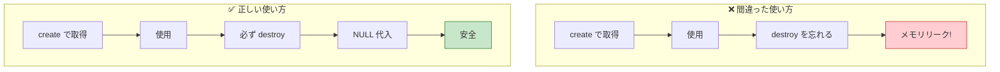

### 3.2. 活用パターン 2: バッファ提供 - 呼び出し側主導の管理

次は、呼び出し側がバッファを用意してライブラリ関数に渡す **バッファ提供パターン** です。ライブラリ内での動的アロケーションを回避し、メモリ管理の責任を明示的に呼び出し側へ委ねることで組み込み環境でも安全に使えるAPIを設計します。

#### システム概要

バッファ提供パターンでは、 **呼び出し側がメモリを準備** し、関数はそのメモリを **借りて使うだけ** です。
メモリの確保・解放の責任がすべて「呼び出し側」にあり、関数は単に「書き込み作業」だけを請け負う構造です。
バッファ提供パターンの最大の利点は、呼び出し側が自身のスタック領域（ローカル変数）を利用できるため、重い処理である `malloc` の呼び出しコストを完全に回避できることです。以下の図では、緑色で示された呼び出し側がメモリ管理の明確な主体（責任者）であり、オレンジ色で示された関数はあくまで一時的にバッファを借りて書き込みを行うだけの作業者であることを示しています。

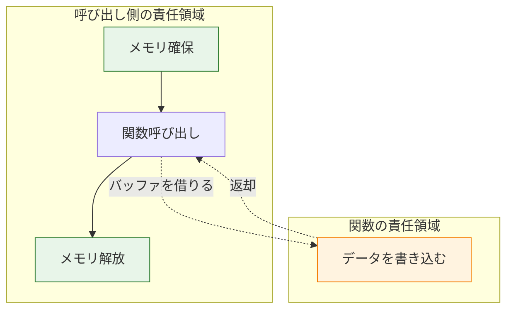

#### 設計課題

あらゆるデータに対してパターン1（`malloc` / `free` によるCreate/Destroy）を適用してしまうと、単なる文字列の変換や、ほんの一時的にしか使わない小さなデータ構造の処理においてまでヒープ領域の確保（`malloc`）が発生してしまいます。`malloc` はOSにメモリを要求するため動作が遅く、失敗する可能性もある重い処理です。特に組み込みシステムやゲームプログラミングなど、パフォーマンスとメモリの予測可能性が厳しく問われる環境においては、不必要な`malloc`の乱用は致命的な設計ミスとなります。

#### 設計の意図

この不要なコストを削減するための設計が、 **「形態 II: 参照 (Borrow)」を活用したバッファ提供（Caller-allocated Buffer）パターン** です。サイズの計算が可能な一時データであれば、呼び出し側（Caller）が自分のスタック領域（ローカル変数）に配列 `char buffer[64];` などを確保し、そのポインタとサイズを関数に渡します。関数は「与えられた枠の中」に結果を書き込むだけで、メモリの確保も解放も一切行いません。これにより `malloc` のコストを完全にゼロにし、同時にメモリの消し忘れ（リーク）も構造的に防ぐことができる、極めて高速で安全な設計が実現します。

#### パターンの使い分け
| 観点 | Create/Destroy | バッファ提供 |
| --- | --- | --- |
| **メモリ確保** | 関数側 | 呼び出し側 |
| **解放責任** | 関数側 | 呼び出し側 |
| **適用場面** | 複雑なオブジェクト | 単純なデータ処理 |
| **柔軟性** | 高い | 中程度 |
| **パフォーマンス** | malloc のコスト | スタック利用可能 |

どちらのパターンを選ぶべきかの判断基準を示しています。

*   **複雑度**　オブジェクトの複雑さに応じて適切なパターンが異なります。

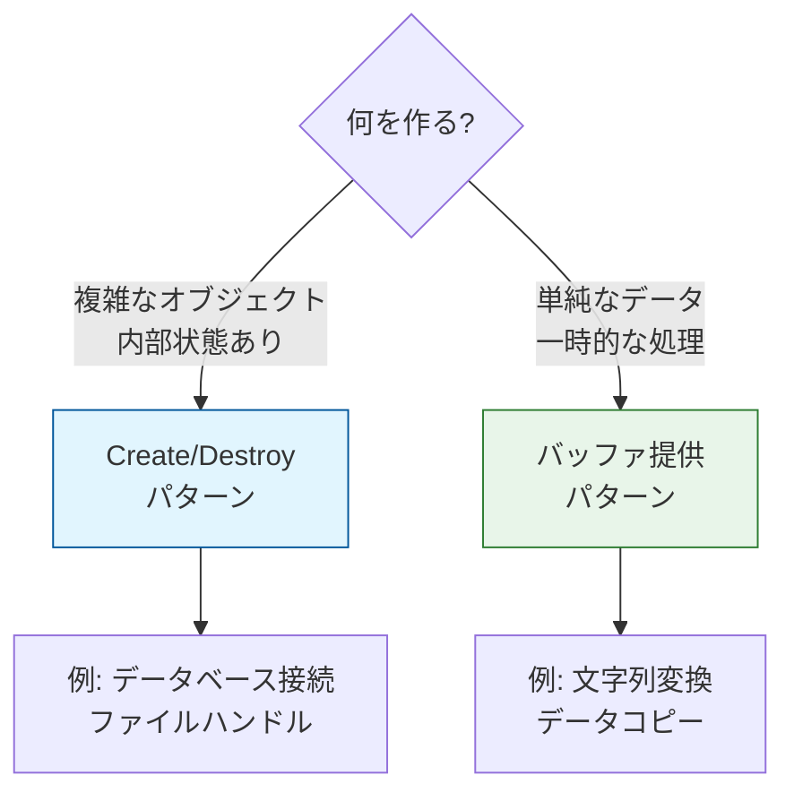

この例では、実践的なシステムを想定して設計原則の適用方法を示します。具体的なユースケースに基づいてコードを解説することで、抽象的な原則が実際のコードにどのように落とし込まれるかを理解することができます。

#### buffer_processor.h

関数はバッファのポインタとサイズを受け取るだけで、メモリ確保は行いません。出力先バッファを引数として受け取る形式の関数を定義しています。メモリ確保の責任を「呼び出し側」に委譲する（バッファ提供パターン）ことで、関数内部での `malloc` を回避します。組み込みシステムやパフォーマンス重視の環境で、動的メモリ割り当てを避けられる利点があります。

#### buffer_processor.h (呼び出し側を主体とするバッファ渡しインターフェース)
```c
#include <stddef.h>

// 形態 II: 参照（バッファ提供）
// input: 入力データ（読み取り専用）
// output: 出力バッファ（呼び出し側が確保）
// size: バッファサイズ
// 戻り値: 成功時 0、失敗時 負の値
int process_data(const char* input, char* output, size_t size);
```

#### buffer_processor.c

実装側では、渡されたバッファサイズを超えないように安全に書き込むことだけに集中します。受け取ったバッファに対して、サイズチェックを行った上でデータを書き込みます。

境界チェックを厳密に行い、バッファオーバーフローを防ぐ設計です。呼び出し側が提供したメモリを安全に使用する、堅牢な実装です。

#### buffer_processor.c (安全な境界チェックを伴うデータ書き込み)
```c
#include "buffer_processor.h"
#include <string.h>
#include <stdio.h>

int process_data(const char* input, char* output, size_t size) {
    if (input == NULL || output == NULL || size == 0) {
        return -1;  // 引数エラー
    }
    size_t len = strlen(input);

    if (size <= len) {
        printf("エラー: バッファが小さすぎます（必要: %zu, 提供: %zu）\n",
               len + 1, size);

        return -2;  // バッファ不足
    }
    // 提供されたバッファに書き込む
    strncpy(output, input, size - 1);
    output[size - 1] = '\0';
    printf("処理完了: \"%s\"\n", output);

    return 0;
}
```

#### main.c

呼び出し側（`main`）は、スタック上にバッファを確保しており、関数呼び出しが終わると自動的に解放されます。`free` を呼ぶ必要がありません。

スタック上に確保したバッファを関数に渡し、処理結果を受け取ります。自動変数（スタック）を利用することで、明示的な `free` 呼び出しを不要にし、メモリリークのリスクを排除しています。メモリ管理コストが低く、高速かつ安全な利用パターンと言えるでしょう。

#### main.c (スタック割り当てによる高速で安全な利用フロー)
```c
#include <stdio.h>
#include "buffer_processor.h"

int main(void) {
    char buffer[64];  // スタックに確保（高速）

    // 成功ケース
    if (process_data("Hello", buffer, sizeof(buffer)) == 0) {
        printf("結果: %s\n", buffer);
    }

    // 失敗ケース
    char small[3];
    process_data("Too long", small, sizeof(small));

    // 自動的に解放される（スタック変数）
    return 0;
}
```

### 3.3. 活用パターン 3: `goto cleanup` - エラー処理の一元化

最後は、C言語でのリソース解放漏れを防ぐ慣用句 **`goto cleanup`パターン** です。複数のリソースを獲得する関数でエラーが発生した場合でも、`goto`で解放処理を一箇所に集約することで確実なクリーンアップを保証します。

#### システム概要

複数のリソース（メモリ、ファイルハンドルなど）を順番に確保する関数において、途中の工程でエラーが発生した場合に、それまでに確保したリソースを漏れなく、かつ安全に解放する制御フローの実装方法です。

#### 設計課題

ある関数の中で「リソースAを確保」「リソースBを確保」「リソースCを確保」と立て続けに初期化を行うとします。Bの確保で失敗したらAだけを解放し、Cの確保で失敗したらAとBを解放しなければなりません。これを `if-else` で律儀に書くと、俗に「エラー処理の階段」と呼ばれる深くネストした見通しの悪いコードになります。さらに悪いことに、分岐ごとに `free(A); free(B);` と似たようなコードをコピペするため、将来リソースDを追加した際に「エラー時の解放処理を一部書き忘れる」というミスが極めて高い確率で発生し、メモリリークの温床となります。

#### 設計の意図

この「複雑な後始末の組み合わせ」と「コピペによる解放漏れ」を劇的に改善するのが、C言語における **`goto cleanup` パターン** です。「モダンなプログラミングにおいて `goto` は悪である」と教えられがちですが、C言語においてはこの **「エラー時のリソース解放の一元化」に限り、もっとも推奨されるベストプラクティス** として認知されています。関数の末尾に `cleanup:` ラベルを一つだけ用意し、すべてのエラー脱出経路をここへジャンプ（`goto`）させることで、「確保した逆順での安全な解放処理（DRY原則の適用）」を美しい一本の流れとして記述することができます。
分岐ごとに個別に `free` を記述する設計では、将来の修正でコピペミスなどによる解放漏れリスクが跳ね上がり、バグが混入しやすくなります。以下の図は、処理の分岐が増えるごとに例外処理のルートが爆発的に増え、制御フローが手に負えないほど複雑化していく様子を示しています。

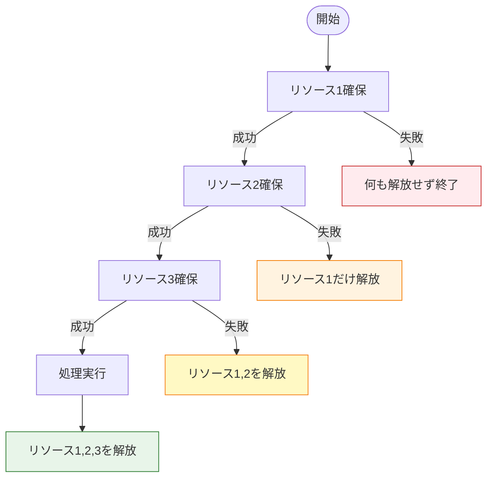

### エラーハンドリングの課題

エラーパスごとに解放コードを書くと、コードが複雑になり、 **解放漏れ** が発生しやすくなります。

### `goto cleanup` による解決

### 1. リソース確保のフロー（正常系）

リソース確保の工程を「確保」と「失敗時のジャンプ」というセットで横に並べることで、縦方向の長さを抑えています。

`goto cleanup` を使うことで、正常系の処理フロー（一直線）と、異常系の処理フロー（共通の出口へジャンプ）を分離した構造になっています。

*   **シンプルさ**　どの段階で失敗しても、必ず `CL` (cleanupラベル) に飛びます。

縦方向が正常系、横方向がエラー系。

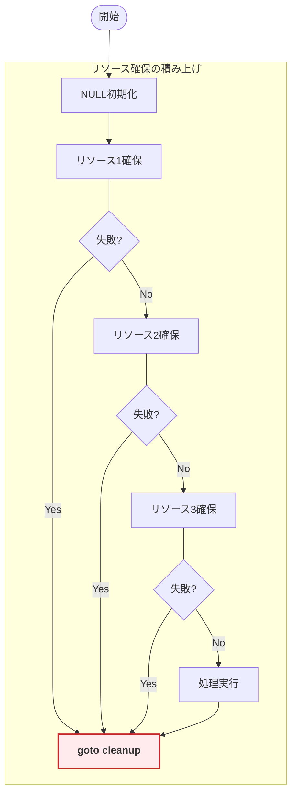

### 2. クリーンアップのフロー（異常系）

`cleanup` ラベル以降で行われる、リソースの安全な解放手順です。

*   **逆順**　確保した順序と逆に解放します（依存関係の解消）。
*   **NULLチェック**　確保に失敗した（またはまだ確保していない）リソースは `NULL` なので、安全にスキップされます。

上から下への一方通行のフロー。

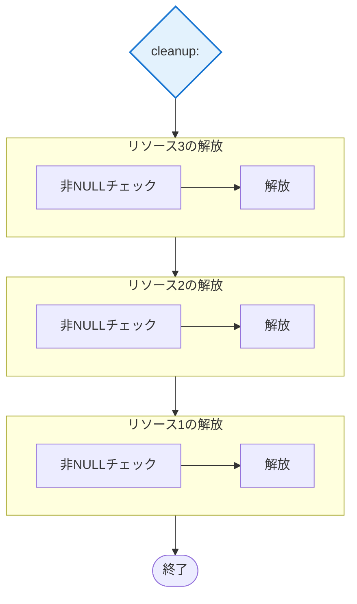

この例では、実践的なシステムを想定して設計原則の適用方法を示します。具体的なユースケースに基づいてコードを解説することで、抽象的な原則が実際のコードにどのように落とし込まれるかを理解することができます。

### 実装パターン

`goto` 文は「スパゲッティコードの元凶」として忌避されがちですが、リソースの一元管理（エラー処理）に関しては、C言語において **最も推奨されるベストプラクティス** です。

#### コード例

まず、前提となるダミーリソース定義です。サンプルのコンパイルを通すためのダミーリソース型と関数を定義しています。本題である `goto cleanup` のロジックに集中するため、リソースの詳細は省略しています。学習用の最小限の実装です。

#### コンパイル用ダミーリソース定義
```c
#include <stdio.h>
#include <stdlib.h>

// ダミーのリソース型と関数（コンパイルを通すため）
typedef struct { int id; } Resource1, Resource2, Resource3;
Resource1* resource1_create(void) { return malloc(sizeof(Resource1)); }
Resource2* resource2_create(void) { return malloc(sizeof(Resource2)); }
Resource3* resource3_create(void) { return malloc(sizeof(Resource3)); }
void resource1_destroy(Resource1* r) { free(r); }
void resource2_destroy(Resource2* r) { free(r); }
void resource3_destroy(Resource3* r) { free(r); }
int do_work(Resource1* r1, Resource2* r2, Resource3* r3) { return 0; }
```

次に、本題の `goto cleanup` を用いた関数です。変数をNULLで初期化し、リソース確保に失敗したら `cleanup` ラベルへジャンプして、確保済みのリソースのみを解放します。

エラー処理のコードを一箇所に集約し、重複を防ぐとともに、変更時の修正漏れリスクを低減します（DRY原則）。多重リソース管理において、最も安全で保守しやすい定石パターンです。

#### エラー処理とリソース解放の一元化の実装
```c
int complex_operation(void) {
    // ステップ1: すべてのポインタを NULL で初期化（これが最も重要！）
    // これにより、どの時点で goto しても安全に cleanup 処理に入れる
    Resource1* res1 = NULL;
    Resource2* res2 = NULL;
    Resource3* res3 = NULL;

    int result = -1;  // デフォルトはエラー

    // ステップ2: リソースを順次確保
    res1 = resource1_create();

    if (res1 == NULL) {
        printf("エラー: リソース1の確保に失敗\n");
        goto cleanup;  // res1 は NULL なので cleanup で何も解放されない（安全）
    }

    res2 = resource2_create();
    if (res2 == NULL) {
        printf("エラー: リソース2の確保に失敗\n");
        goto cleanup;  // res1 のみ解放される
    }

    res3 = resource3_create();
    if (res3 == NULL) {
        printf("エラー: リソース3の確保に失敗\n");
        goto cleanup;  // res1, res2 が解放される
    }

    // ステップ3: 正常な処理
    result = do_work(res1, res2, res3);

cleanup:
    // ステップ4: 確保の逆順で解放（NULLチェック付き）
    // 確保に失敗したリソースは NULL になっているので、if文でスキップされる
    if (res3 != NULL) {
        resource3_destroy(res3);
        printf("  リソース3を解放\n");
    }

    if (res2 != NULL) {
        resource2_destroy(res2);
        printf("  リソース2を解放\n");
    }

    if (res1 != NULL) {
        resource1_destroy(res1);
        printf("  リソース1を解放\n");
    }

    return result;
}
```
