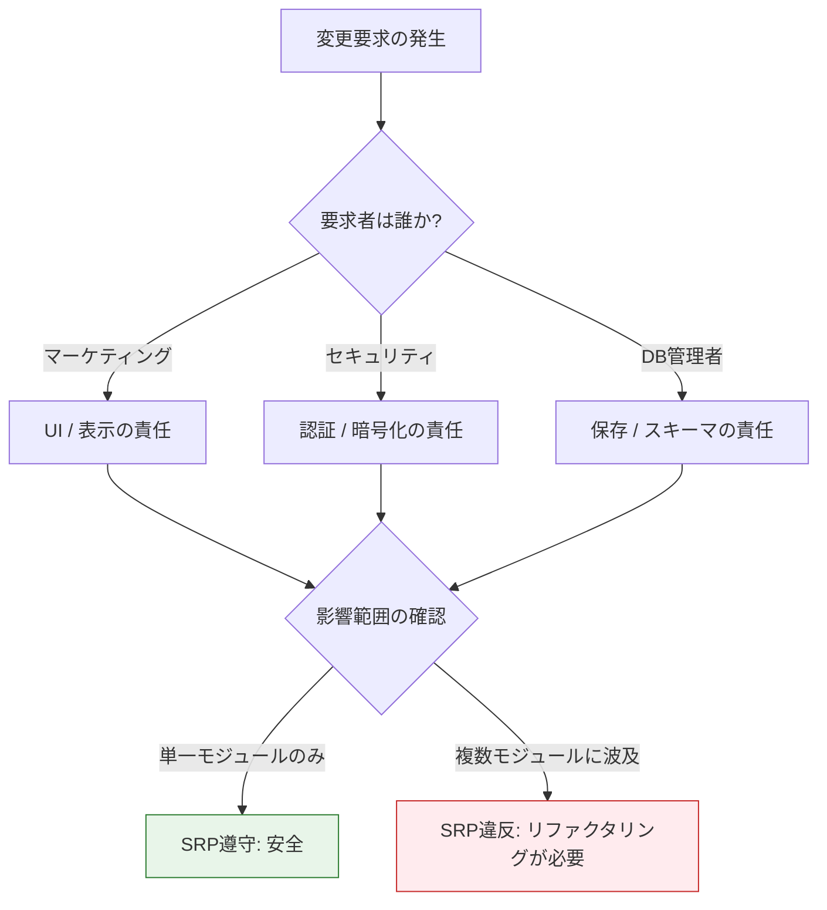
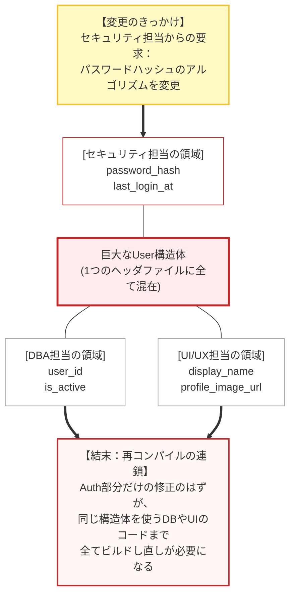
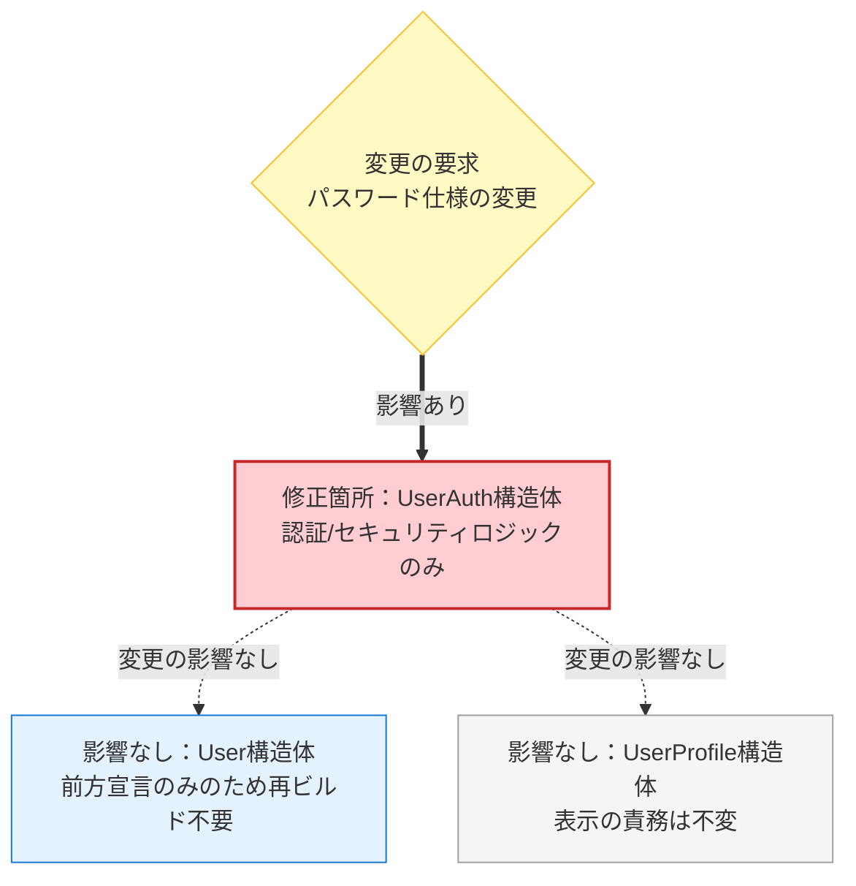
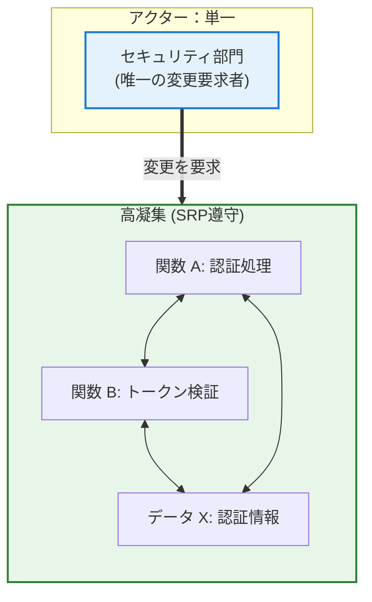
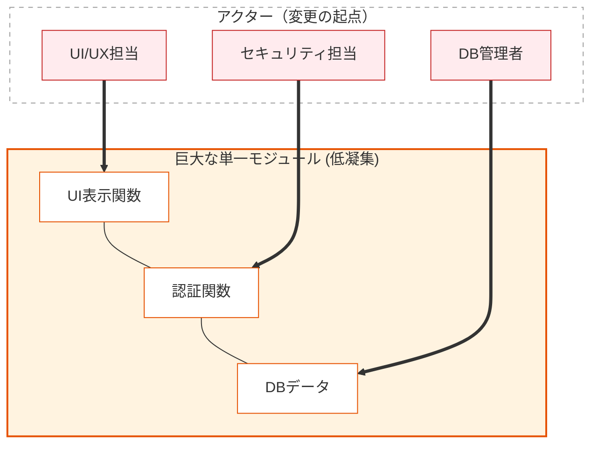
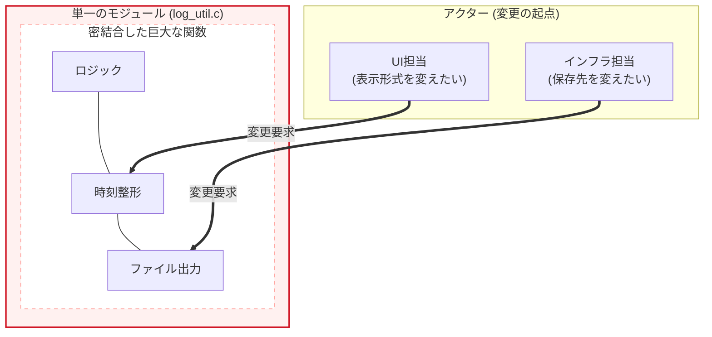
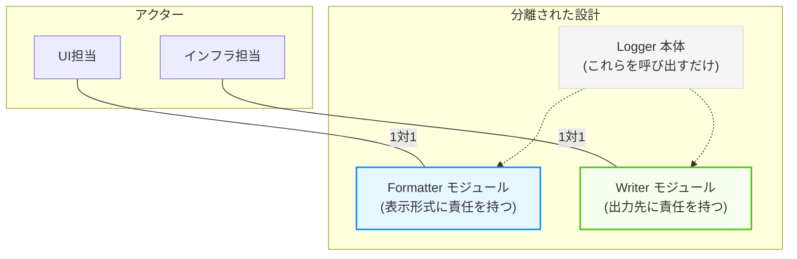

# 第2部 第8章 単一責任原則 (SRP): 変更の軸を明確にする設計指針
本章の主題は、設計の三本柱のうち「 **責任** 」の柱にあります。SRPを適用することで、モジュール内部の **凝集度** が最大化され、将来の **変更容易性** という究極の目的が達成されます。

この原則を実現するために、これまで学んだ **道具** （技術）を組み合わせていきましょう。具体的には、 **第1章 `static`による情報隠蔽** 、 **第3章 構造体設計** 、そして **第7章 メモリ管理** が大きな武器になります。

特に `static` による **実装の隠蔽** は、内部の変更を外部に漏らさない（＝責任を閉じ込める）ための、SRPを物理的に実現する鍵となります。

## 1. 原則の哲学と本質

本原則は、三本柱の **『責任』** を極限まで純粋化させるための指針と言えます。

### 1.1. SRPの本質は「変更の理由」の単一化

> [!NOTE] 読者の疑問：C言語における「モジュール」って具体的に何？
> 「『モジュールの責任をひとつに』って言葉が抽象的すぎる。C言語の機能として『モジュール』なんてキーワードは存在しないけど、実体としてはファイルの事？ それとも関数の事？」
>
> 非常に重要な疑問です。オブジェクト指向言語における「クラス」を持たないC言語では、設計原則における「モジュール」という言葉をどう解釈するかが最初の壁になります。本書における「モジュール」とは、物理的には **「1つの `.c` ファイルと、それにペアとなる `.h` ファイルのまとまり（翻訳単位）」** を指すことが最も多いです。しかし論理的には、関連するデータをまとめた「1つの `struct` とその操作関数のセット」や、さらに細かく「1つの関数そのもの」をモジュールとみなすこともあります。SRPは、これら全ての粒度（ファイル・構造体・関数レイヤー）において等しく適用できる原則です。本章では主に、ファイルと構造体の粒度をイメージして読み進めてください。

 **単一責任原則** （Single Responsibility Principle, **SRP**）は、「モジュールは、ただ一つの **変更の理由** を持つべきである」と厳密に定義されます。

「変更の理由」とは、コードの変更を要求する **特定の「アクター」** （利害関係者、部門など） **の要求** を意味します。一つのモジュールが複数のアクターの要求で変更される責任を負う場合、一方の変更が他方のロジックに予期せぬ **副作用** （変更の伝播）をもたらし、 **保守性** を著しく低下させることになります。

#### たとえ話で理解する

レストランのキッチンを想像してください。もし一人のシェフが、料理、会計、接客のすべてを担当していたらどうなるでしょうか？

マネージャーが「レシートの形式を変えてほしい」と依頼したとき、その作業のついでに料理の味付けまで変わってしまう（あるいは変えざるを得なくなる）リスクがあります。メニュー担当が「デザートの盛り付けを変えたい」と要求したとき、料理人の道具が会計レジと繋がっているために、会計システムまで修正が必要になるかもしれません。

これが **変更の伝播** です。SRPは、「料理人は料理だけ」「会計係は会計だけ」と役割を分けることで、一つの変更が他に影響しないようにする原則なのです。

### 1.2. アクター（変更要求者）とは何か

 **アクター** とは、システムに対して変更を要求する権限と動機を持つ、 **特定の利害関係者または部門** を指します。アクターは組織構造や業務の性質によって異なりますが、以下のような典型的な例があります。

#### アクター別 担当領域と変更要求の例
| アクター（変更要求者） | 担当領域 | 変更要求の具体例 |
| --- | --- | --- |
| **セキュリティ部門** | 認証・認可・暗号化 | パスワードハッシュアルゴリズムの変更、二要素認証の追加 |
| **UI/UXチーム** | ユーザーインターフェース | 画面レイアウトの変更、表示形式の更新、多言語対応 |
| **データベース管理者** | データ永続化・スキーマ | データベーススキーマの変更、インデックス追加、バックアップ戦略 |
| **ビジネスロジック担当** | 業務ルール・計算式 | 料金計算式の変更、割引ルールの追加、在庫管理ロジック |
| **インフラ/運用チーム** | ログ・監視・デプロイ | ログフォーマットの変更、メトリクス収集方法の変更 |
| **外部システム連携担当** | API・プロトコル | 外部APIバージョンアップへの対応、通信プロトコルの変更 |
| **ハードウェア設計者** | デバイス制御・レジスタ | I/Oマップの変更、通信速度の変更、省電力仕様の追加 |
| **コンプライアンス担当** | 法規制・監査 | GDPR対応、監査ログの追加、データ保持期間の変更 |

#### **複数アクターによる変更の問題**

一つのC言語ファイル（または関数）の中に、上記の複数のアクターに関わるロジックが混在していたらどうなるでしょうか？例えば、料金計算（ビジネスロジック）の関数の中に、ログ出力（インフラ）やデータベース保存（DBA）の処理が直接書かれている場合、インフラチームから「ログの形式を変えてほしい」と言われただけで、本来関係のない「料金計算」のコードまで修正・再コンパイル・再テストが必要になってしまいます。

これこそが  **「変更の理由が複数ある」**  状態であり、SRPが解決すべき最大の課題と言えるでしょう。

### 1.3. アクターを見極める方法

設計時にアクターを正しく識別するためには、以下の質問を自問自答してみましょう。

#### **質問1：「このコードは誰の要求で変更されるか？」**

例：ログの出力形式を変えるのは運用チームか、それともビジネスロジック担当か？

#### **質問2：「この変更要求は、他のどの機能に影響を与えないべきか？」**

例：認証方式の変更が、レポート生成機能に影響を与えてはならない。

#### **質問3：「組織図を見たとき、この変更を承認するのは誰か？」**

例：表示形式の変更はマーケティング部門が承認し、データベーススキーマの変更はDBA部門が承認する。

#### **質問4：「このコードが変更される頻度とタイミングは他の部分と同じか？」**

例：UIは頻繁に変わるが、暗号化アルゴリズムは数年に一度しか変わらない。



### 1.4. 単一責任への道：アクター分離の手順

アクターを見極めた後、SRPを適用するための体系的な手順は以下の通りです。

#### **手順の全体像**

*   **アクター抽出**　現状のコードから、誰が変更を要求しうるかを洗い出す。
*   **モジュール分割**　アクターごとに独立したモジュールや構造体を用意する。
*   **境界定義**　各モジュールが担当するアクターを明文化する。
*   **検証**　具体的な変更シナリオを使って、影響範囲が閉じているか確認する。

以下、各ステップの詳細を解説します。

#### ステップ1：現状のコードからアクターを抽出する

既存のモジュールや構造体を調査し、実装に含まれる **すべての変更要求の種類** をリストアップします。

#### 複数のアクターの要求が混在する巨大構造体（user.h）

以下は、SRPに違反している典型的な構造体定義です。この構造体には重大な問題が潜んでいます。

永続化（DBA）、認証（セキュリティ）、表示（UI）という **3つの異なるアクター** の要求に応えているため、変更理由が散逸しているのです。ユーザーに関連する全ての情報を一つの構造体にまとめて定義してしまっているため、「ユーザー」という名詞に関連するデータを無批判に集約し、アクター（変更要求者）の観点が抜け落ちた状態になっています。DBA、セキュリティ、UI担当者のいずれかの要求による変更が、他の全てのコードに再コンパイルを強いる「低凝集・高結合」な設計です。

#### user.h
```c
typedef struct {
    // 1. 永続化（データベース管理者の責任）
    unsigned int user_id;
    int is_active;
    // 2. 認証（セキュリティ部門の責任）
    char password_hash[64];
    unsigned int last_login_timestamp;
    // 3. 表示（UI/UXチームの責任）
    char display_name[32];
    char profile_image_url[256];
} User;
```

#### ステップ2：アクターごとにモジュールまたは構造体を分割する

各アクターの責任を独立した単位（Value Object、モジュール）に分離します。

#### **例：`User`構造体の分割**

- `UserAuth`構造体 → セキュリティ部門の責任
- `UserProfile`構造体 → UI/UXチームの責任
- `User`構造体（統合） → データベース管理者とアプリケーション全体の責任。

#### ステップ3：責任の境界を明確にする

各モジュールが **どのアクターの要求にのみ応答するか** を明文化します。

#### **例：責任の明文化**

- `user_auth.c/h`：セキュリティ部門の要求（認証方式の変更）にのみ応答
- `user_profile.c/h`：UI/UXチームの要求（表示形式の変更）にのみ応答
- `user_entity.c/h`：データベース管理者の要求（永続化方式の変更）にのみ応答。

#### ステップ4：変更シナリオで検証する

具体的な変更要求を想定し、影響範囲が単一のモジュールに閉じることを確認します。

#### **検証例** ：

*   **変更要求**　「パスワードハッシュのサイズを64から128に変更する」
*   **影響範囲**　`user_auth.c/h`のみ
*   **影響を受けないモジュール**　`user_profile.c/h`、`user_entity.c/h`のクライアントコード

もし影響範囲が複数のモジュールに及ぶ場合、それはSRP違反の証拠であり、さらなる分離が必要です。

## 2. C言語での実現手段と設計要素

C言語でSRPを適用するための具体的な手段は、 **第1章 `static`キーワード** による **情報隠蔽** と、 **第3章 構造体設計とコンポジション** による **凝集度の高い構造化** です。これらの道具を使い、一つの変更要求が、関連する最小限の`.c`ファイルにのみ閉じるようにコードを分割します。

### 2.1. 構造体とコンポジションによる責任の分離

巨大な構造体（God Struct）は複数の責任を抱え込むため、SRPに違反します。責任ごとに **Value Object (VO)** を定義し、 **コンポジション** によって統合することで、責任を分離します。

#### ❌ SRP違反：巨大な `User` 構造体（原則適用前）

一つの構造体が、永続化、認証、表示という **異なる3つのアクターの変更要求** に応じる責任を負っています。

ここでは、主に3つのアクターからの要求が衝突します。まず、**データベース管理者（DBA）** からは`user_id`や`is_active`などのデータ構造に関する変更が求められます。次に、**セキュリティ部門**からは`password_hash`や`last_login_timestamp`といった認証・セキュリティに関わる変更要求が寄せられます。そして、**UI/UXチーム**からは`display_name`や`profile_image_url`といった画面表示に関する変更が要求されます。このように、性質の異なる複数の変更理由が一つの`User`構造体に集中してしまっている状況です。

**なぜ違反してはいけないのか**: 例えば、セキュリティ部門から「パスワードハッシュのサイズを128に変更」という要求があったとします。このとき、UI担当が扱う`display_name`などは一切変更がないにもかかわらず、この巨大な **User構造体** を参照しているすべてのソースファイルが再コンパイルの対象となってしまいます。大規模なプロジェクトでは、こうした「無関係な再ビルド」の積み重ねが開発のテンポを阻害し、意図しないデグレード（先祖返り）を招く原因になります。



#### ✅ SRP準拠：Value Object (VO) とコンポジションによる分離（原則適用後）

各Value Objectが **単一のアクター** にのみ応答するように設計されています。また、 **前方宣言** を活用することで、物理的な依存関係（インクルード）も断ち切ります。
#### user_auth.h（セキュリティ部門の責任）

セキュリティ部門の要求（認証方式の変更など）にのみ応答するモジュールです。認証に必要なデータ（ハッシュ、タイムスタンプ）を定義します。

認証ロジックに関わるデータのみを凝集させています。二要素認証の追加やポリシー変更時、ここだけを修正すれば良くなる構造です。

#### user_auth.h (認証の関心事のみに凝集したデータ構造)
```c
#ifndef USER_AUTH_H
#define USER_AUTH_H
// 構造体タグ(UserAuth)を定義し、前方宣言可能な状態にする
typedef struct UserAuth {
    char password_hash[64];
    unsigned int last_login_timestamp;
} UserAuth;
#endif
```

#### user_profile.h（UI/UXチームの責任）

UI/UXチームの要求（表示形式の変更など）にのみ応答するモジュールです。ユーザーの表示情報（名前、画像URL）を定義します。

表示に関わるデータのみを独立させています。プロフィール画像の仕様変更などが他に影響を及ぼしません。

#### user_profile.h (表示の関心事のみに凝集したデータ構造)
```c
#ifndef USER_PROFILE_H
#define USER_PROFILE_H

typedef struct UserProfile {
    char display_name[32];
    char profile_image_url[256];
} UserProfile;
#endif
```

#### user_entity.h（統合の責任）

データベース管理者とアプリケーション設計者の要求（永続化、ライフサイクル）に応答するモジュールです。IDとステータスを持ち、他のコンポーネントへのポインタを保持します。

前方宣言を活用し、具体的な構成要素（Auth, Profile）のヘッダをインクルードせずにポインタのみを保持することで、物理的な依存を切断します。構成要素の変更による再コンパイルを防ぐ、堅牢な統合構造と言えます。

#### user_entity.h (前方宣言による物理的依存の切断)
```c
#ifndef USER_ENTITY_H
#define USER_ENTITY_H
// ヘッダをインクルードせず、前方宣言のみを行う
// これにより、UserAuthの中身が変わっても、このヘッダは影響を受けない（物理依存の切断）
typedef struct UserAuth UserAuth;
typedef struct UserProfile UserProfile;
typedef struct {
    unsigned int user_id;
    int is_active;
    // 不完全型へのポインタとして保持する
    // 実体のサイズを知る必要がないため、インクルードが不要になる
    UserAuth* auth;
    UserProfile* profile;
} User;
#endif
```



プロファイル画像URLの仕様が変わっても、`UserAuth` モジュールや認証ロジックは **一切影響を受けません** 。さらに、前方宣言を用いたことで、`user_auth.h` の変更が `user_entity.h` をインクルードするファイルに波及することも防ぐことができるのです。

## 2.2. 凝集度 (Cohesion) の最大化

SRPを遵守し、「変更の理由」を単一に絞り込むことは、結果としてモジュール内の要素間の関連性（ **凝集度** ）を最大化することに繋がります。

*   **高凝集度**　モジュール内のすべての要素が、その単一の責任を果たすために緊密に連携している状態です。SRPは高凝集度を追求するための最も強力な設計指針です。
*   **低凝集度**　モジュールが複数の無関係なタスクを抱え込んでいる状態です。これは「変更の理由」が複数あることを意味し、可読性と保守性を著しく損ないます。

### 高凝集 (High Cohesion) - SRP遵守のモジュール

関連するデータと機能が密接に結びつき、単一の明確な責任（この場合は認証）を持っている状態です。



### 低凝集 (Low Cohesion) - SRP違反のモジュール

UI、ビジネスロジック、データアクセスなど、本来分離されるべき複数の責任が混在し、結びつきが希薄な状態です。



### 2.3. 変更の伝播 (Change Propagation) の抑制

SRPに違反した設計の最大のデメリットは、 **変更の伝播** が発生することです。

### **具体例で理解する**

UI担当者から「ユーザー名の表示を大文字にする」という要求があったとします。もし`User`構造体内の`display_name`フィールドを変更した場合：

*   **認証モジュール** （セキュリティ部門の管轄）
*   **永続化モジュール** （DBA部門の管轄）

これらの全く関係のないロジックが依存している`.c`ファイル全体を再コンパイルする必要が生じます。

最悪の場合、予期せぬ実行時エラーを引き起こす可能性もあります。SRPは、この無関係な変更による連鎖的な影響を断ち切り、システムの **安定性** を向上させます。

## 3. 実践パターン：SRPを実現する三つの型

SRPをC言語で実践する際には、いくつかの典型的なパターンが存在します。これらは、システムの特性や処理の流れに応じて使い分けることで、効果的に責任を分離することができます。

ここでは、代表的な3つのパターンのうち、まず **パイプライン処理** における責任分担のパターンから見ていきましょう。

### 3.1. 実践パターン1：処理フェーズの分離（パイプライン原則）

#### パイプライン原則とは

Unixのパイプライン（`|`）のように、処理を「入力→加工→出力」といった独立したフェーズに分割し、それぞれを専門のモジュールに担当させる考え方です。各フェーズは「前のフェーズからデータを受け取り、次のフェーズへ渡す」ことだけに集中します。

メッセージの **整形** （UI担当の責任）と **ファイル書き込み** （I/O担当の責任）という異なる変更理由を持つアクターの領域に責任を分離します。

#### システム概要

ここでは、アプリケーションの動作状況を記録する**ロガー（ログ出力システム）** を実装します。このシステムは、何らかのイベントが発生した際にメッセージと重要度（レベル）を受け取り、現在時刻（`%H:%M:%S`）を付与してローカルのファイル（`app.log`）へ追記するという要件を持っています。

#### 設計課題

この要件を満たすため、まずはよくある素朴な実装を見てみましょう。以下の `logger_bad.c` では、時刻の **表示形式**（ UI担当が決定権を持つ）と、ログの **永続化先**（インフラ担当が決定権を持つ）が1つの関数 `log_message` の中に混在しています。

これはSRPの観点から見ると致命的な欠陥を抱えています。なぜなら、 **2つの全く異なるアクターが同じコードを変更する理由を持ってしまっている** からです。

| アクター | 変更要求 | 影響範囲 |
| --- | --- | --- |
| **UI担当** | 時刻を`HH:MM:SS`から`YYYY-MM-DD HH:MM:SS`に変更 | `log_message`全体を修正・リビルド |
| **インフラ担当** | ログ出力先をローカルファイルから`syslog`やクラウドに変更 | `log_message`全体を修正・リビルド |

どちらか一方が仕様変更を求めただけで、無関係であるはずのもう一方の機能まで巻き添えにして同じファイルを編集・再コンパイルしなければならず、予期せぬバグの温床（変更の伝播）となります。

#### 設計の意図

この問題を解決し、「変更の軸を明確にする」ための設計手法の一つが、パイプライン処理による責任の分割です。Unixシェルコマンド（例：`ls | grep | sort`）のように、処理全体を「入力→加工（整形）→出力」という独立したフェーズに分割し、それぞれを専門のモジュール（構造体や関数群）に担当させます。

整形担当（Formatter）は「どう表示するか」というUIの要求にのみ応え、出力先を知りません。出力担当（Writer）は「どこへ保存するか」というインフラの要求にのみ応え、中身の形式を知りません。そして制御担当（Logger本体）は、この2つの専門家を連携（委譲）させる役割だけを担います。これにより、互いの変更が一切干渉しない堅牢なモジュール群が完成します。

まずはSRPに違反しているアンチパターンのコードから見ていきましょう。

この `logger_bad.c` では、現在時刻の取得、文字列のフォーマット、そしてファイルへの書き込みといった一連の処理が1つの関数の中で直列的に羅列されています。UI担当とインフラ担当という別々のアクターの要求（変更理由）が一箇所に混在してしまっている、保守性の低い状態です。

#### logger_bad.c
```c
#include <stdio.h>
#include <time.h>
#include <string.h>
// 時刻整形とファイル書き込みの2つの責任が混在

void log_message(const char* message, int level) {
    char timestamp[32];
    time_t now = time(NULL);
    struct tm* tm_info = localtime(&now);
    // 責任1: 時刻の表示形式を決定（UI担当の領域）
    strftime(timestamp, sizeof(timestamp), "%H:%M:%S", tm_info);
    // 責任2: ファイル出力処理（インフラ担当の領域）
    FILE* log_file = fopen("app.log", "a");

    if (log_file == NULL) {
        fprintf(stderr, "Error: Cannot open log file.\n");

        return;
    }
    fprintf(log_file, "[%s] Level %d: %s\n", timestamp, level, message);
    fclose(log_file);
}

int main(void) {
    printf("=== SRP違反コードの実行 ===\n");
    log_message("Application started", 1);
    log_message("Processing data", 2);
    log_message("Application finished", 1);
    printf("ログファイル app.log に出力されました\n");

    return 0;
}
```

#### SRP違反コードの実行結果

プログラム自体は想定通り動作し、期待される出力を得ることができますが、内部構造は脆い状態のままです。

#### 実行結果
```c
=== SRP違反コードの実行 ===
ログファイル app.log に出力されました
```

出力された内容も一見正しく見えますが、フォーマットや出力先を変えようとした瞬間に、この密結合した関数の危うさが露呈することになります。

#### **ログ内容**
```c
[14:23:15] Level 1: Application started
[14:23:15] Level 2: Processing data
[14:23:15] Level 1: Application finished
```

##### 問題を示す図

単一のモジュールに複数のアクターからの変更要求が集中している状態です。

ロジック、整形、出力が一体化しており、互いを切り離せない **密結合** な状態になっています。



#### 責任の分割 (✅ 原則適用後 (SRP準拠))
| モジュール | 責任 | 変更を要求するアクター |
| --- | --- | --- |
| **Formatter** | 時刻やレベルの表示形式を決定 | UI担当 |
| **Writer** | 整形済みデータの永続化先を決定 | インフラ担当 |
| **Logger** | 処理フローの制御（委譲のみ） | 設計担当（ほぼ不変） |


それでは、責任を適切に分割したあとのそれぞれのモジュールを見ていきましょう。

#### メッセージ整形に特化した純粋な契約

まずは「UI担当」の要求にのみ応える、メッセージ整形のモジュールです。このインターフェースは「指定されたバッファに整形済みの文字列を書き込む」という純粋な文字加工の契約だけを定義しており、それが最終的にどこに出力されるのか（ファイルか、DBか等）には一切関心を持ちません。

#### log_formatter.h
```c
#ifndef LOG_FORMATTER_H
#define LOG_FORMATTER_H
#include <stddef.h>
// 戻り値: 実際に書き込まれた文字数（snprintf準拠ではなく、成功した書き込み量）
// バッファ不足の場合は、バッファに収まる範囲で書き込み、その長さを返す仕様とします。
size_t log_formatter_format(char* buffer, size_t max_len,
    const char* message, int level);
#endif
```

このモジュールの実装部分では、現在時刻の取得からフォーマットに沿った文字列の組み立てまで、文字情報の構築だけに専念します。

今後、もしUI担当から「時刻をYYYY-MM-DD形式にしてほしい」と要求があっても、システム全体の中で修正が必要になるのはこの `log_formatter.c` だけです。他のロジックやファイル出力処理に影響波及（リビルド）を起こすことはありません。

#### log_formatter.c (他の処理に影響を与えない独立した文字加工)
```c
#include "log_formatter.h"
#include <stdio.h>
#include <time.h>

size_t log_formatter_format(char* buffer, size_t max_len,
    const char* message, int level)
{
    time_t now = time(NULL);
    struct tm* tm_info = localtime(&now);
    char timestamp[32];
    // 時刻表示形式のみに責任を持つ
    strftime(timestamp, sizeof(timestamp), "%H:%M:%S", tm_info);
    // 【設計的意図】
    // snprintfは標準では「書き込むはずだった（必要な）長さ」を返しますが、
    // ここでは呼び出し元の利便性を考慮し、「実際にバッファに収まった有効な文字数」を返します。
    // これにより、呼び出し元は戻り値をそのままデータサイズとして扱えます。
    int written = snprintf(buffer, max_len, "[%s] Level %d: %s",
        timestamp, level, message);

    if (written < 0) return 0; // エラー

    if ((size_t)written >= max_len) return max_len - 1; // 切り詰め発生時は最大長-1を返す

    return (size_t)written;
}
```

続いて「インフラ担当」の領域である、出力責任を負うモジュールです。

ここでは「受け取った文字列を最終的な保存先に書き込む」機能だけを公開します。これにより、インフラ担当からの保存先に関する変更要求を、このモジュール内で一手に引き受け（吸収し）、他の部品に漏らさない壁としての役割を果たします。

#### file_log_writer.h (出力先をカプセル化する永続化の契約)
```c
#ifndef FILE_LOG_WRITER_H
#define FILE_LOG_WRITER_H

int file_log_writer_write(const char* formatted_message);
#endif
```
この実装では、実際にファイルをオープンして追記し、安全にクローズするという「永続化の物理的な手続き」のみをこなします。

ここに「どんな形式で出力するか（時刻フォーマットなど）」というUI領域の関心事は一切混入していません。そのため、表示形式が変わってもこのファイルの修正や再コンパイルは不要に保たれます。

#### file_log_writer.c (物理的な手続きに専念する書き込み実装)
```c
#include "file_log_writer.h"
#include <stdio.h>

int file_log_writer_write(const char* formatted_message) {
    // 出力先のみに責任を持つ
    // 注: 実務ではファイルハンドルの開閉コストを避けるため構造体で管理しますが、
    // ここでは責任の分離を示すため簡易実装としています。
    FILE* log_file = fopen("app.log", "a");

    if (log_file == NULL) return -1;
    fprintf(log_file, "%s\n", formatted_message);
    fclose(log_file);

    return 0;
}
```

最後に、これらをつないで「ログを出力する」という全体の制御を行う `logger` モジュールです。

クライアント（利用者）に対しては、背後で「整形」と「出力」という2つのモジュールが連携している複雑性を一切見せず、シンプルなAPIだけを露出させる役割を担います。

#### logger.h (クライアントに公開するシンプルなインターフェース)
```c
#ifndef LOGGER_H
#define LOGGER_H

void log_message(const char* message, int level);
#endif
```

このオーケストレーターの役割を果たす `logger.c` の実装は非常にシンプルです。「いつ、誰に処理を頼むか」という制御フローだけを受け持ちます。

自分自身では時刻も整形せず、ファイル出力も行いません。バッファを用意し、まずFormatterに整形を委譲し、その結果をWriterに引き渡すだけです。この「制御と詳細の分離」により、将来的にデータベース出力のWriterへ差し替えるような大きな変更も容易に実現できるようになります。

#### logger.c (委譲による制御フローのオーケストレーション)
```c
#include "log_formatter.h"
#include "file_log_writer.h"
// 処理フローの制御のみに責任を持つ

void log_message(const char* message, int level) {
    char buffer[256];
    // 委譲1: 整形はFormatterへ
    size_t len = log_formatter_format(buffer, sizeof(buffer), message, level);

    if (len > 0) {
        // 委譲2: 書き込みはWriterへ
        file_log_writer_write(buffer);
    }
}
```

これらを利用する最も上位のクライアントコード（`main.c`）です。

設計がリファクタリングされて内部は3つのモジュールに分割されましたが、利用する側から見ればシンプルな `log_message` 関数を呼ぶだけです。使い勝手は変わらずに、内部的な拡張性と保守性が飛躍的に向上しています。

#### main.c (内部の複雑さを感じさせない利用コード)
```c
#include "logger.h"
#include <stdio.h>

int main(void) {
    printf("=== SRP準拠コードの実行 ===\n");
    log_message("Application started", 1);
    log_message("Processing data", 2);
    log_message("Application finished", 1);
    printf("ログファイル app.log に出力されました\n");

    return 0;
}
```

#### 外部の振る舞いを維持した実行結果

SRPを適用して内部構造は激変しましたが、プログラムの外部的な振る舞いは一切変わっていません。

#### 実行結果（適用後）
```c
=== SRP準拠コードの実行 ===
ログファイル app.log に出力されました
```

出力されたファイルの中身もリファクタリング前と全く同一です。外部の振る舞いを変えずに内部の保守性を高めるという、見事なリファクタリングの成功を証明しています。

#### app.log の内容（適用前と同じ） (変化のない出力ログ)
```c
[14:23:15] Level 1: Application started
[14:23:15] Level 2: Processing data
[14:23:15] Level 1: Application finished
```

#### 改善を示す図

アクターごとにモジュールが分割され、変更の影響が局所化された状態です。

UI担当はFormatterのみ、インフラ担当はWriterのみという形で、それぞれの役割が明確に **分離** されています。



#### 効果：変更シナリオごとの影響範囲
| 変更シナリオ | 適用前の影響範囲 | 適用後の影響範囲 |
| --------------------------------- | ----------------------- | -------------------------------------------------- |
| **時刻形式を`YYYY-MM-DD HH:MM:SS`に変更** | `log_message`全体を修正・再テスト | `log_formatter.c`のみ修正 |
| **出力先をsyslogに変更** | `log_message`全体を修正・再テスト | `file_log_writer.c`のみ修正（または新しい`syslog_writer.c`追加） |
| **ログレベルの表記を変更** | `log_message`を修正 | `log_formatter.c`のみ修正 |
| **新しい出力先（DB）を追加** | `log_message`にif文を追加 | 新しい`db_log_writer.c`を追加するだけ |
