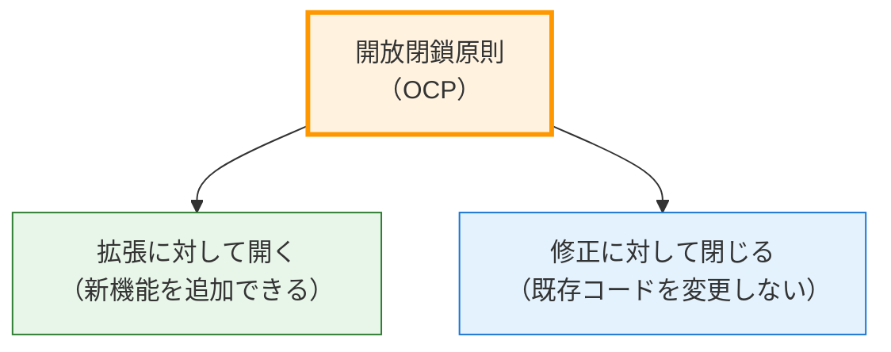
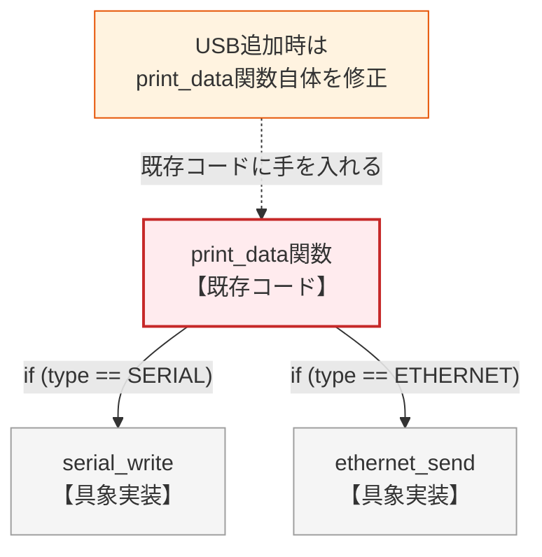
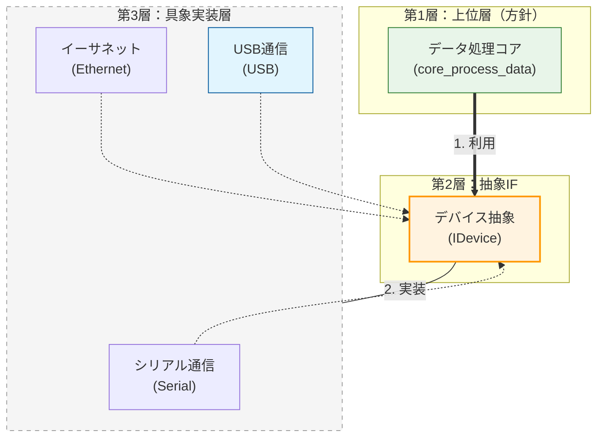
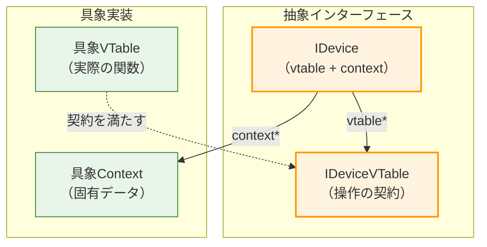
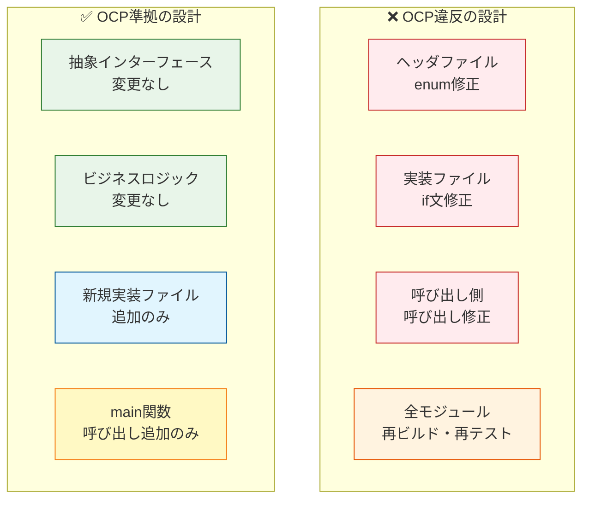
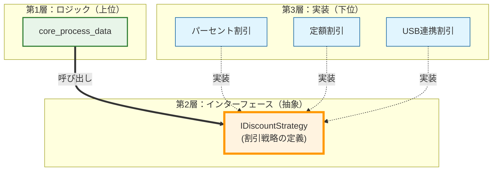
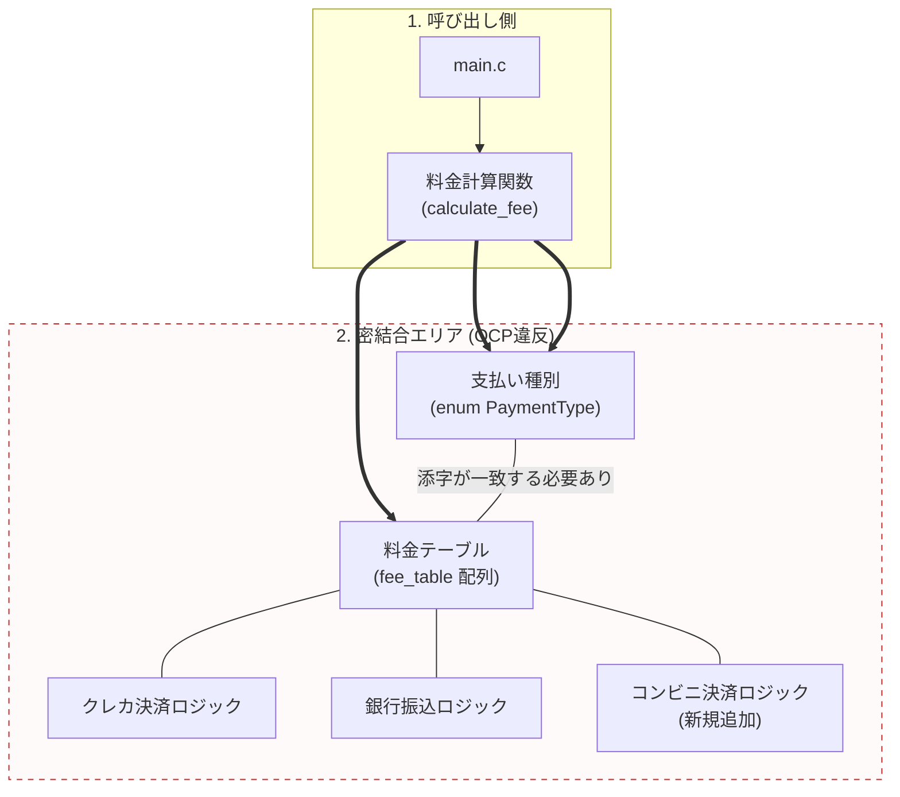
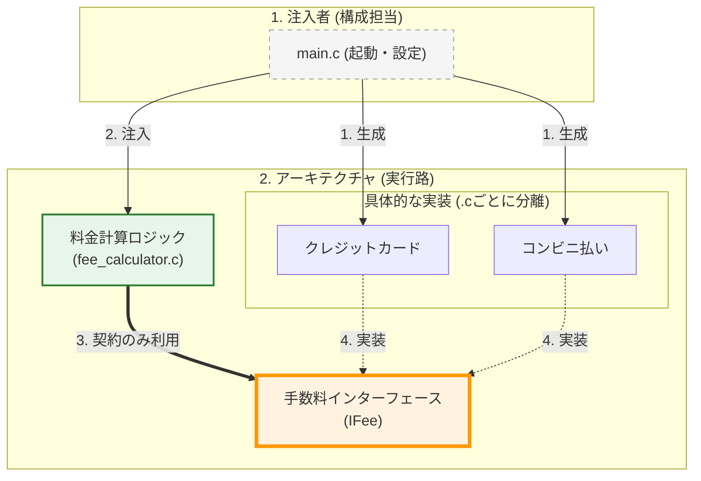

# 第2部 第9章 開放閉鎖原則（OCP）：拡張のために開き、修正に対して閉じる
本章の主題は、設計の三本柱のうち「 **依存** 」の柱にあります。 **開放閉鎖原則** （Open/Closed Principle, OCP）を適用して変更の影響範囲を限定し、疎結合な構造を構築することで、究極の目的である **拡張性** を確保します。

この原則を実現するためには、 **第2章 関数ポインタと間接呼び出し** で学んだ **VTableパターン** と **context** による状態管理が鍵となります。

## 1. 原則の哲学と本質

### 1.1. OCPの定義

 **開放閉鎖原則** （Open/Closed Principle, OCP）は、ソフトウェア設計の基本原則の一つであり、「ソフトウェアのエンティティは、 **拡張に対して開かれていなければならず、修正に対して閉じられていなければならない** 」と定義されます。



この原則が解決する核心的な問題は、 **「新機能の追加が、既存の動作しているコードの修正を強制する」** という、ソフトウェア開発における最も高コストな問題です。

### 1.2. OCPが解決する問題

実務でよく遭遇する「新しいデバイスの追加」という要求を題材に、OCP違反とOCP準拠の設計を対比します。

ここでは、データ出力システムが現在SerialとEthernetに対応しているという **シナリオ** を想定します。ここに新しくUSBデバイスへの対応が要求されました。

#### ❌ 原則を無視した設計：条件分岐の連鎖


この設計では、新しいデバイスを追加するたびに「enum定義の修正」「条件分岐（if文）の修正」「クライアントコードの修正」という **連鎖的な修正** が発生してしまいます。

#### ✅ 原則を適用した設計：抽象への依存


この設計では、新しいデバイスを追加しても、核心的な方針（上位モジュールである `core_process_data`）は一切 **修正不要** です。新しいファイル（`usb_device.c`）を追加するだけで済み（第5章で学んだモジュールの独立性）、回帰テストの範囲も最小限に抑えられます。

## 2. C言語での実現手段と設計要素

OCPをC言語で実現するには、以下の技術要素を組み合わせます。

### 2.1. 抽象インターフェースの定義：VTableパターン

C言語には`interface`キーワードはありませんが、 **VTable（仮想関数テーブル）パターン** によって抽象契約を定義できます。



すべてのデバイスが従うべき **共通の「契約」である抽象インターフェース** を定義します。ヘルパーマクロにより、呼び出し側の可読性を向上させています。

 **具体的なデバイス（シリアル、イーサネットなど）の実装詳細を隠蔽し、** クライアントが抽象（VTable）にのみ依存するようにします。`IDevice`構造体を不完全型へのポインタとして扱うことで、完全な隠蔽を実現しています。

 **新しいデバイスを追加する際、** このインターフェースを実装するだけで済み、既存コードへ影響を与えない（OCP遵守）構成となっています。

#### idevice.h (あらゆるデバイスが準拠すべき共通契約)
```c
#ifndef IDEVICE_H
#define IDEVICE_H
#include <stddef.h>
// VTable: すべてのデバイスが実装すべき操作
typedef struct {
    int (*write_data)(void* self, const char* data, size_t len);
    void (*close)(void* self);
} IDeviceVTable;
// 抽象インターフェース
typedef struct {
    const IDeviceVTable* vtable;
    void* self;
} IDevice;
// ヘルパーマクロ（呼び出しを簡潔にするため）
#define idevice_write_data(d, data, len) \
    (d)->vtable->write_data((d)->self, (data), (len))
#define idevice_close(d) \
    (d)->vtable->close((d)->self)
#endif
```

### 2.2. 具象実装の隠蔽：contextによる状態管理

各デバイスは固有のデータ構造（context）を持ちますが、クライアントからは`void*`として隠蔽されます。`IDevice` インターフェースのシリアル通信版実装です。

`Context`構造体（`SerialContext`）により内部状態（ポート名やハンドル）をカプセル化し、`VTable`を通じて統一的な振る舞いを提供します。実装の詳細が完全に隠蔽されているため、内部実装の変更が外部に漏れず、安全に機能拡張が可能です。

#### serial_device.c (実装詳細と状態を隠蔽したシリアル通信の実装)
```c
#include "idevice.h"
#include <stdio.h>
#include <stdlib.h>
#include <string.h>
// Serial固有のデータ構造（クライアントから隠蔽）
typedef struct {
    char port_name[16];
    int port_handle;
} SerialContext;
// 具象実装：契約を満たす

static int serial_write(void* self, const char* data, size_t len) {
    SerialContext* ctx = (SerialContext*)self;
    printf("[Serial] Port %s: Writing '%.*s'\n",
           ctx->port_name, (int)len, data);

    return (int)len;
}

static void serial_close(void* self) {
    SerialContext* ctx = (SerialContext*)self;
    printf("[Serial] Closing port %s\n", ctx->port_name);
    free(ctx);
}
// VTableの実体
static const IDeviceVTable SERIAL_VTABLE = {
    .write_data = serial_write,
    .close = serial_close
};
// ファクトリ関数：外部に公開される唯一のAPI

IDevice* serial_device_create(const char* port_name) {
    SerialContext* ctx = malloc(sizeof(SerialContext));

    if (!ctx) return NULL;
    strncpy(ctx->port_name, port_name, sizeof(ctx->port_name) - 1);
    ctx->port_handle = 1;
    IDevice* device = malloc(sizeof(IDevice));

    if (!device) {
        free(ctx);

        return NULL;
    }
    device->vtable = &SERIAL_VTABLE;
    device->self = ctx;

    return device;
}
```

### 2.3. クライアントコード：抽象への依存

ビジネスロジックは抽象インターフェース（`IDevice`）のみに依存し、具象実装の詳細を一切知りません。

 **ビジネスロジックの中核部分です。** 抽象インターフェース `IDevice` のみに依存し、具象実装（Serial/Ethernet）の存在を一切知らないように設計されています。 **どの具象実装が渡されても動作するため、** 将来的なデバイス追加に対して完全に閉じられています。
#### application_core.c (具象実装を一切知らない純粋なビジネスロジック)
```c
#include "idevice.h"
#include <stdio.h>
// ビジネスロジック：抽象インターフェースのみに依存

int core_process_data(IDevice* device) {
    if (!device) {
        printf("[Core] Error: NULL device\n");

        return -1;
    }
    printf("[Core] データ処理中...\n");
    const char* message = "Hello, Device!";
    idevice_write_data(device, message, 14);
    idevice_close(device);

    return 0;
}
```

### 2.4. 統合と実行：main関数

#### 依存関係の注入を行うエントリーポイント

具体的なデバイスを生成し、ビジネスロジックに注入・実行するエントリーポイントです。依存性の注入（DI）を行い、抽象と具象を接続する役割を担います。
構成の変更（利用するデバイスの切り替え）を、この場所のみに局所化できています。
#### main.c
```c
#include "idevice.h"
#include <stdio.h>
#include <stdlib.h>

extern int core_process_data(IDevice* device);
extern IDevice* serial_device_create(const char* port_name);
extern IDevice* ethernet_device_create(const char* ip_address);

int main(void) {
    IDevice* device = NULL;
    printf("=== Serial Device ===\n");
    device = serial_device_create("COM1");

    if (device) {
        core_process_data(device);
        free(device);
    }
    printf("\n=== Ethernet Device ===\n");
    device = ethernet_device_create("192.168.1.1");

    if (device) {
        core_process_data(device);
        free(device);
    }

    return 0;
}
```

### 2.5. 新しい実装の追加：USB対応

OCPの真価は、 **新機能追加時に既存コードを修正しない** ことで発揮されます。新しい要件（USBデバイス）に対する具象実装です。

既存の`idevice.h`を変更することなく、新しいファイルとして追加するだけで機能拡張を実現しています（拡張に対して開いている）。既存システムへの影響をゼロにしつつ、新機能を追加できています。

#### usb_device.c (既存コードを修正せずに追加可能な新機能)
```c
#include "idevice.h"
#include <stdio.h>
#include <stdlib.h>
// USB固有のデータ構造
typedef struct {
    int vendor_id;
    int product_id;
    int usb_handle;
} UsbContext;

static int usb_write(void* self, const char* data, size_t length) {
    UsbContext* ctx = (UsbContext*)self;
    printf("[USB] Vendor ID:0x%04X Product ID:0x%04X: Transmitting '%.*s'\n",
           ctx->vendor_id, ctx->product_id, (int)length, data);

    return (int)length;
}

static void usb_close(void* self) {
    UsbContext* ctx = (UsbContext*)self;
    printf("[USB] Closing device Vendor ID:0x%04X Product ID:0x%04X\n",
           ctx->vendor_id, ctx->product_id);
    free(ctx);
}
static const IDeviceVTable USB_VTABLE = {
    .write_data = usb_write,
    .close = usb_close
};

IDevice* usb_device_create(int vendor_id, int product_id) {
    UsbContext* ctx = malloc(sizeof(UsbContext));

    if (!ctx) return NULL;
    ctx->vendor_id = vendor_id;
    ctx->product_id = product_id;
    ctx->usb_handle = 100;
    IDevice* device = malloc(sizeof(IDevice));

    if (!device) {
        free(ctx);

        return NULL;
    }
    device->vtable = &USB_VTABLE;
    device->self = ctx;

    return device;
}
```

#### 最小限の追記で済むクライアントコード

 `main` 関数で新しいデバイス生成関数を呼ぶだけで、他のロジックには一切手を触れません。新しいUSBデバイスを利用するための追加コードです。
既存のロジックを変更せず、生成処理を追加するだけで新機能を利用可能にします。修正範囲が極めて限定的であり、デグレードのリスクが最小限です。

#### main.c
```c
// 既存の外部宣言
extern int core_process_data(IDevice* device);
extern IDevice* serial_device_create(const char* port_name);
extern IDevice* ethernet_device_create(const char* ip_address);
extern IDevice* usb_device_create(int vendor_id, int product_id);  // 外部宣言追加

int main(void) {
    IDevice* device = NULL;
    printf("=== Serial Device ===\n");
    device = serial_device_create("COM1");

    if (device) {
        core_process_data(device);
        free(device);
    }
    printf("\n=== Ethernet Device ===\n");
    device = ethernet_device_create("192.168.1.1");

    if (device) {
        core_process_data(device);
        free(device);
    }
    // USBデバイス追加（core_process_dataは不変）
    printf("\n=== USB Device ===\n");
    device = usb_device_create(0x1234, 0x5678);

    if (device) {
        core_process_data(device);
        free(device);
    }

    return 0;
}
```

### 2.6. 修正範囲の比較


**比較表**：

| 項目 | OCP違反 | OCP準拠 |
| --- | --- | --- |
| **修正ファイル数** | 3ファイル | 1ファイル（main.cのみ） |
| **修正内容** | enum追加<br>if文追加<br>呼び出し追加 | 呼び出し追加のみ |
| **既存コードへの影響** | **あり** （条件分岐修正） | **なし** （core不変） |
| **再ビルド範囲** | 全モジュール | USB実装とmainのみ |
| **回帰テスト** | **必要** （全デバイス） | **不要** （USB実装のみ） |
| **デグレードリスク** | **あり** （if文の修正ミス） | **なし** （既存コード不変） |

### 2.7. C言語でOCPを実現する設計パターンまとめ
| 設計要素 | 役割 | 実現する価値 |
| --- | --- | --- |
| **VTable構造体** | 操作の契約を定義 | 多態性の基盤 |
| **インターフェース構造体** | vtable + contextのペア | 抽象への依存 |
| **void* self** | 具象データの隠蔽 | 情報隠蔽・カプセル化 |
| **ファクトリ関数** | 生成ロジックの集約 | 初期化の一貫性 |
| **ヘルパーマクロ** | 呼び出しの簡潔化 | 可読性・保守性 |

これらの要素を組み合わせることで、C言語でも **拡張に対して開き、修正に対して閉じた** 設計を実現できます。

## 3. 実践パターン：OCPを実現する三つの型

### 3.1. パターン1：条件分岐によるロジックの固定 → ストラテジーパターン

このセクションでは、 **価格計算システム** を題材に、OCP原則（拡張に対して開き、修正に対して閉じる）の適用方法を学びます。具体的には、商品の割引計算を行うプログラムにおいて： 「パーセント割引（10%オフ）」 「固定額割引（500円引き）」 という2つの計算方式を実装します。

将来的には「会員ランク別割引」「期間限定割引」などが追加される可能性があります。

#### システム概要

ここでは、商品の基本価格に対して割引計算を行う**価格計算システム**を実装します。このシステムは、割引の種類として「パーセント割引（例：10%オフ）」と「固定額割引（例：500円引き）」の2つの計算方式をサポートしており、指定された割引ルールに従って最終的な価格を算出するという要件を持っています。

#### 設計課題

あらゆるビジネスにおいて「割引ルール」は頻繁に追加・変更される非常に不安定な要素です。この要件に対し、最も直感的な素朴な実装（以下の `price_calculator.c`）は、列挙型（`enum`）で計算方式を指定し、関数内部の `if-else` 分岐によって計算ロジックを切り替えるアプローチをとります。

しかし、この設計はOCP（開放閉鎖原則）の観点から見ると **「完全に閉じている（修正が必要な）状態」** です。もし明日、ビジネス側から「3点以上お買い上げで一番安い商品が無料になる割引を追加してほしい」と要望が来たらどうなるでしょうか。列挙型に `DISCOUNT_FREE_CHEAPEST` を追加し、`calculate_price` 関数の中の `else if` 分岐を書き足さなければなりません。新しい機能（外側への拡張）を追加するたびに、既存の中核ロジック（内側のコード）を直接開いて切り刻む必要があり、デグレード（既存機能の破壊）のリスクと回帰テストのコストがシステム規模に比例して増大し続けます。

#### 計算ルールがハードコードされた算出ロジック (設計の意図)

計算の中心となる `calculate_price` 関数は、「10%引き」や「500円引き」といった具体的な計算式（知識）を一切持たないように作り変えます。代わりに、「なんらかの割引計算をして結果を返す契約」である `IDiscount` インターフェース（関数ポインタを持った構造体）だけを受け取るようにします。具体的な計算ロジックは、それぞれ完全に独立した別の `.c` ファイル（10%引き用のファイル、500円引き用のファイル）に切り出します。これにより、今後どれほど奇怪な割引ルールが登場しようとも、新しい `.c` ファイルを1つ追加して関数ポインタを渡すだけで済むようになり、既存の中核関数である `calculate_price` は「未来永劫、一行も修正する必要がない」堅牢な状態を達成できます。

#### price_calculator.c
```c
#include <stdio.h>
// 割引の種類を増やすたびに、この列挙型と関数の修正が必要
typedef enum {
    DISCOUNT_PERCENT,
    DISCOUNT_FIXED
} DiscountType;

int calculate_price(int base_price, DiscountType type, int value) {
    int result = base_price;
    // アルゴリズムが硬直的な条件分岐で実装されている
    if (type == DISCOUNT_PERCENT) {
        result = base_price * (100 - value) / 100;

    } else if (type == DISCOUNT_FIXED) {
        result = base_price - value;
    }
    printf("[Calculator] Result: %d円\n", result);

    return result;
}

int main(void) {
    printf("--- 10%%割引を実行 ---\n");
    calculate_price(10000, DISCOUNT_PERCENT, 10);
    printf("\n--- 500円引きを実行 ---\n");
    calculate_price(10000, DISCOUNT_FIXED, 500);

    return 0;
}
```

#### ✅ 原則適用後：ストラテジーパターンと依存注入（DI）

次に、OCP原則を適用したコードを見てみましょう。 **外側の動作（実行結果）は全く変えず** 、内部構造のみを改善します。

アルゴリズムを「戦略オブジェクト（IDiscount）」として抽出し、`main` から注入することで、`calculate_price` は将来の変更から完全に保護（閉鎖）されます。

#### どんな計算要求も受け入れる基盤となる契約

まずは、すべての割引計算ルールが従うべき「契約」を抽象インターフェースとして定義します。

ここでは `IDiscountVTable` という構造体で「計算する（`apply`）」という振る舞いだけを定義します。具体的な計算方法は一切定義しません。これにより、呼び出し側（Calculator）と個別の計算ロジック（Strategy）を完全に分離する壁を作ります。

#### idiscount.h
```c
#ifndef IDISCOUNT_H
#define IDISCOUNT_H

typedef struct {
    int (*apply)(void* self, int base_price);
} IDiscountVTable;
typedef struct {
    const IDiscountVTable* vtable;
    void* self; // 戦略固有のデータを隠蔽
} IDiscount;
#endif
```

続いて、実際に価格を計算するコアロジックです。

ここで注目すべきは、`calculate_price` 関数が先ほど定義した `IDiscount` 抽象インターフェースのみを受け取っている点です。「10%引き」や「500円引き」といった具体的なルールは一切知りません。ただ契約に従って `apply` 関数ポインタを実行するだけです。これにより、将来どんな新しい割引ルールが登場しても、この関数は「二度と書き換える必要がない（修正に対して閉じている）」無敵の状態になります。

#### price_calculator.c (戦略の実行のみに専念する計算機)
```c
#include "idiscount.h"
#include <stdio.h>
// この関数は、将来どんな計算ルールが増えても「二度と書き換えない」

int calculate_price(IDiscount* strategy, int base_price) {
    int result = base_price;

    if (strategy && strategy->vtable && strategy->vtable->apply) {
        result = strategy->vtable->apply(strategy->self, base_price);
    }
    printf("[Calculator] Result: %d円\n", result);

    return result;
}
```

以下の `percent_discount.c` などの具体的な戦略の実装は、**本来はそれぞれ独立した別のファイル（`.c`ファイル）として作成されるべきもの**です。これにより、新しい割引方法を追加する際に、既存のファイル（`calculator.c` や他の戦略ファイル）を一切変更することなく、新しいモジュールを追加するだけでシステムを拡張できるようになります。これがOCP（開放閉鎖原則）の真髄です。ここでは解説の都合上、続けて記載しています。

#### percent_discount.c (パーセント割引の計算ロジック)
```c
#include "idiscount.h"
#include <stdlib.h>

typedef struct {
    int percent;
} PercentContext;

static int apply_percent(void* self, int base_price) {
    PercentContext* ctx = (PercentContext*)self;
    return base_price * (100 - ctx->percent) / 100;
}

static const IDiscountVTable PERCENT_VTABLE = { .apply = apply_percent };

IDiscount* create_percent_discount(int percent) {
    PercentContext* ctx = malloc(sizeof(PercentContext));
    if (!ctx) return NULL;
    ctx->percent = percent;

    IDiscount* s = malloc(sizeof(IDiscount));
    if (!s) { free(ctx); return NULL; }

    s->vtable = &PERCENT_VTABLE;
    s->self = ctx;
    return s;
}
```

#### fixed_discount.c (固定額割引の計算ロジック)
```c
#include "idiscount.h"
#include <stdlib.h>

typedef struct {
    int amount;
} FixedContext;

static int apply_fixed(void* self, int base_price) {
    FixedContext* ctx = (FixedContext*)self;
    return base_price - ctx->amount;
}

static const IDiscountVTable FIXED_VTABLE = { .apply = apply_fixed };

IDiscount* create_fixed_discount(int amount) {
    FixedContext* ctx = malloc(sizeof(FixedContext));
    if (!ctx) return NULL;
    ctx->amount = amount;

    IDiscount* s = malloc(sizeof(IDiscount));
    if (!s) { free(ctx); return NULL; }

    s->vtable = &FIXED_VTABLE;
    s->self = ctx;
    return s;
}
```

最後に、これらを組み立てる最上位のクライアントコードです。

利用する具体的な割引戦略（パーセント割引や定額割引）をここで生成し、計算機（`calculate_price`）の引数として注入（DI：Dependency Injection）します。計算機の中身を一切書き換えることなく、外側からアルゴリズムを自由自在に差し替えて実行できることがわかります。

#### main.c (外部から戦略を注入するクライアント)
```c
#include "idiscount.h"
#include <stdio.h>
// 各戦略の生成（実際のプロジェクトでは別ファイルで実装します）
extern IDiscount* create_percent_discount(int percent);
extern IDiscount* create_fixed_discount(int amount);
// calculate_priceのプロトタイプ宣言
extern int calculate_price(IDiscount* strategy, int base_price);

int main(void) {
    int base_price = 10000;
    printf("--- 10%%割引を実行 ---\n");
    IDiscount* s1 = create_percent_discount(10);

    if (s1) {
        calculate_price(s1, base_price); // 注入！
        // free(s1) 等の終了処理が必要（省略）
    }
    printf("\n--- 500円引きを実行 ---\n");
    IDiscount* s2 = create_fixed_discount(500);

    if (s2) {
        calculate_price(s2, base_price); // 注入！
    }

    return 0;
}
```


#### 設計の進化：同じ「結果」を得るための「手段」の違い
| 項目 | 適用前：条件分岐 | 適用後：ストラテジー |
| --- | --- | --- |
| **実行結果** | **9000円 / 9500円** | **9000円 / 9500円（不変）** |
| **calculate_price の中身** | 全アルゴリズムの知識を持つ | 抽象への依頼のみ（詳細を知らない） |
| **新しい割引の追加** | **既存の関数の修正が必要** | 新しいファイルを追加するだけ |
| **データの持ち方** | `int value` 1つでやりくり | `context` により戦略ごとに自由 |

「結果が同じであること」は、このリファクタリングが成功している証拠です。開発者は、ユーザーが受け取る価値（計算結果）を変えることなく、 **「将来、新しい計算ルールを100個追加しても既存コードが1行も壊れない」という圧倒的な保守性** を手に入れたことになるのです。

これがOCP原則とストラテジーパターンの真価です。

実務では、この程度の規模であれば関数ポインタを使わず、単純に割引計算用の関数を複数用意して呼び分ける方がシンプルです。しかし、ここでは以下の理由により、あえてストラテジーパターンを用いています。OCP原則の「拡張に開き、修正に閉じる」という設計思想を明確に示すため 将来的に10種類、20種類と割引ルールが増えた場合の設計指針を示すため 依存性逆転の原則（DIP）との組み合わせを学ぶため 「この規模でここまでするのは過剰設計では？」と感じるかもしれません。しかし、あえてシンプルな例を用いることで、複雑な実務コードに潜む「原則の本質」を浮き彫りにしています。
### 3.2. パターン2：enum＋配列インデックス → VTableパターン（ストラテジー）

このセクションでは、OCP原則の別の適用パターンを学びます。将来的には「電子マネー」「QRコード決済」などが追加される可能性があるケースを想定します。

#### システム概要

ここでは、**支払い方法ごとの手数料計算システム**を実装します。このシステムは、以下のような支払い方法ごとに異なるルールで手数料を算出するという要件を持っています：
- 「クレジットカード払い」：決済金額の5%
- 「コンビニ払い」：一律300円
- 「銀行振込」：無料（0円）

#### 設計課題

この要件に対し、C言語でよく見られるのが、`enum`の値を配列のインデックスとして関数ポインタと対応させる実装手法です。

一見すると `if` 文や `switch` 文がなくてスッキリし、効率的に見えるコードですが、ここには非常に壊れやすいアンチパターンが潜んでいます。以下のコードは、支払い種別を表す `enum` の値（0, 1, 2...）をそのまま関数ポインタ配列のインデックスとして流用しており、「`enum` の定義順」と「配列要素の並び順」が暗黙的に強く結合してしまっています。

もし将来、誰かが「コンビニ払いの前に銀行振込を定義しよう」と `enum` の順番を入れ替え、さらに配列側の順番を手動で一致させ忘れたらどうなるでしょうか。本来コンビニ払いで適用されるべき手数料が、全く別の支払い方法に適用されるという致命的なバグが、コンパイルエラーも出ずに発生します。これが暗黙的結合の恐ろしい課題（修正に対して開いている状態）です。

#### 設計の意図

この脆弱な結合を断ち切り、OCP（修正に対して閉じ、拡張に対して開く）を実現するための手法が、 **「VTableパターン（ストラテジーパターン）」の適用** です。

前項で学んだように、各モジュールが自身の機能と状態を自己完結させる「構造体＋関数ポインタ」のパッケージ（VTable）を作成します。これにより、呼び出し側は暗黙のインデックス順に頼るのではなく、与えられた具象モジュールが提供するインターフェース（契約）のみに従って処理を行うようになります。新しい支払い種別「電子マネー」を追加する際も、既存の列挙型や配列を一切変更することなく、安全にシステムを拡張することが可能になります。

#### 順序の暗黙的ルールに依存したアンチパターン（適用前）

まずは、OCP原則を適用していない、`enum`と配列のインデックスによる暗黙的な依存を持つアンチパターンのコードから見てみましょう。

#### fee_calculator.c
```c
#include <stdio.h>

typedef enum {
    PAY_CREDIT = 0,
    PAY_CONVENIENCE,
    PAY_BANK,
    PAY_MAX
} PaymentType;
// 手数料計算ロジック（具体的な計算式が露出している）
int fee_credit(int price)       { return price * 5 / 100; }
int fee_convenience(int price) { return 300; }
int fee_bank(int price)        { return 0; }
```

もし将来、誰かが「コンビニ払いの前に銀行振込を定義しよう」と `enum` の順番を入れ替えたらどうなるでしょうか。配列の順番を手動で一致させ忘れた瞬間に、コンビニ払いを選んだのに銀行振込の手数料が適用されるという致命的なバグが、コンパイルエラーにもならずに発生します。これが暗黙的結合の恐ろしさです。

#### fee_calculator_bad.c (不正な入力に脆い計算ロジック)
```c
// enumの順番と一貫性を保つ責任が開発者に丸投げされている

int (*fee_table[PAY_MAX])(int) = {
    fee_credit,
    fee_convenience,
    fee_bank
};

int calculate_fee(PaymentType type, int price) {
    printf("[Calculator] 金額: %d円\n", price);
    // インデックスによる直接呼び出し
    // 範囲チェックがないため、不正なtypeが来るとクラッシュする危険性あり
    if (type < 0 || type >= PAY_MAX) return -1;
    int fee = fee_table[type](price);
    printf("[Calculator] 手数料: %d円\n", fee);

    return fee;
}
```

クライアントコードからは正常に呼び出せるように見えますが、内部構造は時限爆弾を抱えているようなものです。

#### main.c (危険な状態を隠す呼び出しコード)
```c
int main(void) {
    printf("--- クレジットカード ---\n");
    calculate_fee(PAY_CREDIT, 10000);
    printf("\n--- コンビニ払い ---\n");
    calculate_fee(PAY_CONVENIENCE, 10000);

    return 0;
}
```

#### このコードの課題
enumと配列の順序を手作業で同期する必要がある
例：`PAY_CONVENIENCE` の順序を変更すると、`fee_table` の並び順も変更しなければならず、変更漏れによるバグが発生しやすい。新しい支払い方法の追加で3箇所の修正が必要
- `PaymentType` enumに追加
- 手数料計算関数を追加
- `fee_table` 配列に追加

この3箇所が一致していないと実行時エラーや誤動作の原因になります。

計算ロジックの詳細がすべて露出している クレジットカードが「5%」、コンビニが「300円固定」といった情報が、すべて同じファイル内に散在しています。
構造図（硬直した依存）：



#### ✅ 原則適用後：VTableパターン（戦略の完全カプセル化）

次に、OCP原則を適用したコードを見てみましょう。 **外側の動作（実行結果）は変えず** 、支払い方法を「手数料計算の戦略（IFee）」として抽象化します。

VTableとContextを用いることで、各支払い方法が独自の計算データ（パーセンテージや固定額など）を内部に隠蔽できるようになります。

#### 手数料計算の振る舞いを抽象化した契約

モジュールの公開インターフェース定義を行います。実装詳細を隠蔽し、外部には必要な契約（API）のみを公開することで、結合度を下げます。

インターフェースと実装が分離され、高い保守性が確保されています。

#### ifee.h
```c
#ifndef IFEE_H
#define IFEE_H

typedef struct {
    int (*calculate)(void* self, int price);
} IFeeVTable;
typedef struct {
    const IFeeVTable* vtable;
    void* self; // 具体的な戦略（クレカ、コンビニ等）が持つデータを隠蔽
} IFee;
#endif
```


以下の各手数料戦略（`credit_fee.c` など）の実装は、**本来は個別の独立したファイルとして分割されるべき**です。新しい支払い方法が増えても、既存の計算ロジックや他の手数料ファイルには一切触れず、新しい独立したファイルを追加するだけで拡張可能にするためです。

#### credit_fee.c (クレジット決済の固有データを秘匿する計算実装)
```c
#include "ifee.h"
#include <stdlib.h>

typedef struct {
    int percent;
} CreditContext;

static int calc_credit(void* self, int price) {
    CreditContext* ctx = (CreditContext*)self;
    return price * ctx->percent / 100;
}

static const IFeeVTable CREDIT_VTABLE = { .calculate = calc_credit };

IFee* create_credit_fee(int percent) {
    CreditContext* ctx = malloc(sizeof(CreditContext));
    if (!ctx) return NULL;
    ctx->percent = percent;

    IFee* fee = malloc(sizeof(IFee));
    if (!fee) { free(ctx); return NULL; }

    fee->vtable = &CREDIT_VTABLE;
    fee->self = ctx;
    return fee;
}
```

#### convenience_fee.c (コンビニ決済の固有データを秘匿する計算実装)
```c
#include "ifee.h"
#include <stdlib.h>

typedef struct {
    int fixed_amount;
} ConvenienceContext;

static int calc_convenience(void* self, int price) {
    ConvenienceContext* ctx = (ConvenienceContext*)self;
    return ctx->fixed_amount; // 固定額
}

static const IFeeVTable CONVENIENCE_VTABLE = { .calculate = calc_convenience };

IFee* create_convenience_fee(int fixed_amount) {
    ConvenienceContext* ctx = malloc(sizeof(ConvenienceContext));
    if (!ctx) return NULL;
    ctx->fixed_amount = fixed_amount;

    IFee* fee = malloc(sizeof(IFee));
    if (!fee) { free(ctx); return NULL; }

    fee->vtable = &CONVENIENCE_VTABLE;
    fee->self = ctx;
    return fee;
}
```

そして計算ロジックのコアとなる部分です。どれだけ支払い方法が増えようと、この関数は抽象インターフェース `IFee` にしか依存していないため、永久に無修正のままで機能し続けます。

#### fee_calculator.c (新しい支払い方法にも無修正で対応する計算基盤)
```c
#include "ifee.h"
#include <stdio.h>
// この関数は、将来支払い方法が100種類になっても「無修正」で対応可能

int calculate_fee(IFee* strategy, int price) {
    if (!strategy || !strategy->vtable || !strategy->vtable->calculate) {
        return 0;
    }
    printf("[Calculator] 金額: %d円\n", price);
    // 抽象インターフェース経由で計算を実行
    int fee = strategy->vtable->calculate(strategy->self, price);
    printf("[Calculator] 手数料: %d円\n", fee);

    return fee;
}
```

最後にこれらを組み立てるメイン関数です。

必要な具体的な戦略オブジェクトを生成し、それを計算ロジックに注入（DI）して実行します。この構造であれば、新しい支払い方法（電子マネーなど）が追加された際でも、新しいファイルを追加し、初期化のこの部分に1〜2行のコードを足すだけで済みます。

#### main.c (戦略オブジェクトを生成して注入するコード)
```c
#include "ifee.h"
#include <stdio.h>
// 各戦略の生成（詳細はそれぞれの.cに閉じ込める）
extern IFee* create_credit_fee(int percent);
extern IFee* create_convenience_fee(int fixed_amount);

int main(void) {
    int price = 10000;
    printf("--- クレジットカード ---\n");
    IFee* credit = create_credit_fee(5); // 5%の手数料戦略を生成
    calculate_fee(credit, price);        // 注入！
    // 終了処理が必要(省略)
    printf("\n--- コンビニ払い ---\n");
    IFee* conv = create_convenience_fee(300); // 300円の固定手数料戦略を生成
    calculate_fee(conv, price);               // 注入！
    // 終了処理が必要(省略)

    return 0;
}
```

#### 構造図（疎結合・拡張可能）



#### 設計の違い：なぜこの構造にするのか
| 観点 | 適用前：enum＋配列 | 適用後：VTableパターン |
| --- | --- | --- |
|  **実行結果**  |  **500円 / 300円**  |  **500円 / 300円（完全一致）**  |
|  **拡張の容易性**  | 3箇所の同期修正が必要（脆弱） | 新しい `.c` を追加するだけ（堅牢） |
|  **情報の隠蔽**  | 全計算ロジックが1箇所に露出 | クレカの％、コンビニの固定額を各 `.c` に封印 |
|  **順序依存**  | enumと配列の順序が暗黙的に結合 | 順序に依存しない（名前による明示的な結合） |

このパターンは、 **暗黙のルール（順序の一致）を明示的な契約（インターフェース）に置き換える** ことで、保守性と拡張性を大幅に向上させます。
