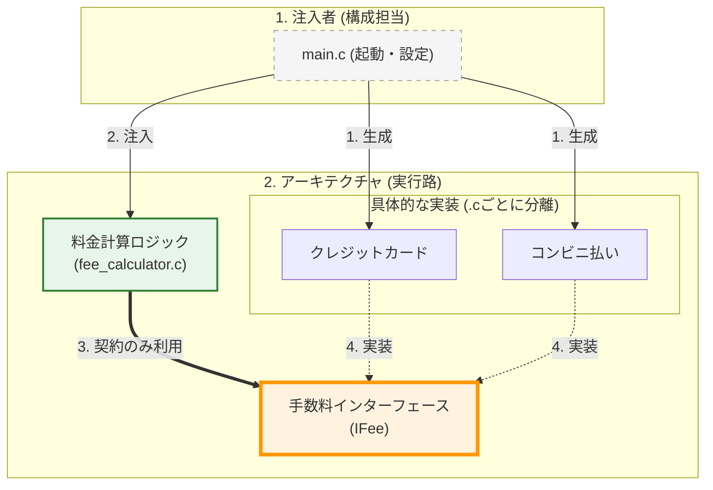
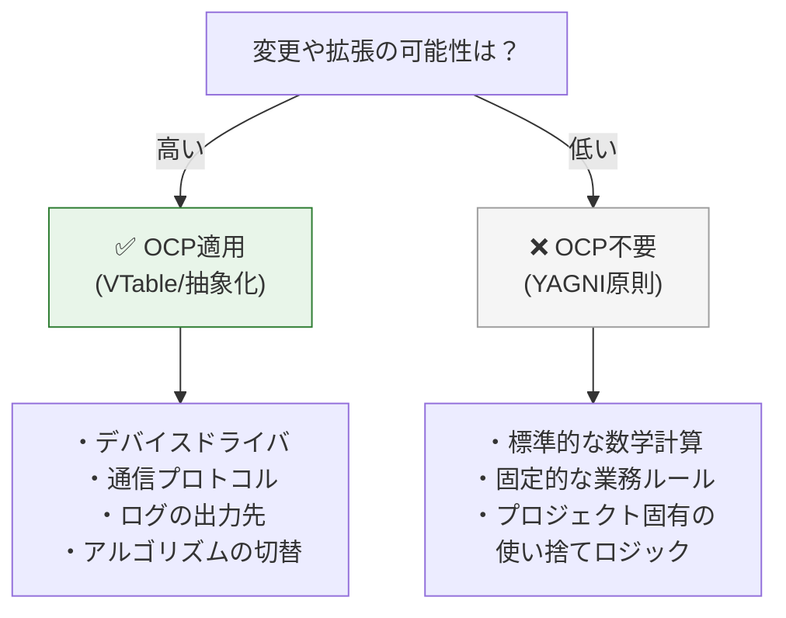

### 3.3. パターン3：状態フラグ → ストラテジーパターン

このセクションでは、 **通知送信システム** を題材に、状態フラグによる分岐をストラテジーパターンで置き換える方法を学びます。具体的には、以下のような送信モードを持つ通知システムを扱います： 「即時送信」→ メッセージを今すぐ送信 「予約送信」→ メッセージを指定時刻に送信 将来的には「優先送信」「深夜送信」「リトライ送信」などが追加される可能性があります。

#### ❌ 原則適用前：booleanフラグによる分岐

まず、OCP原則を適用していないコードを見てみましょう。このコードは、送信モードを `bool` フラグで切り替えているため、拡張性に乏しい構造です。

まずは、非常によく見かける `bool` 型のフラグ（`is_scheduled`）を使って処理を分岐させているアンチパターンです。

引数でフラグを受け取り、関数の内部で `if` 文によって即時送信か予約送信かを切り替えています。今は2種類しかないのでこれでも動きますが、もし「優先送信」や「リトライ送信」が追加されたらどうなるでしょうか。フラグには限界が来て `enum` やマジックナンバーに変わり、この関数の中には巨大な `switch` 文が生まれることになります。これは完全にOCP（修正に対して閉じる）違反の兆候です。

#### booleanフラグで分岐する硬直的なコード

#### notifier.c
```c
#include <stdio.h>
#include <stdbool.h>

void send_notification(const char* message, bool is_scheduled) {
    if (is_scheduled) {
        printf("[Notifier] 予約送信モード\n");
        printf("  後で送信: %s\n", message);
    } else {
        printf("[Notifier] 即時送信モード\n");
        printf("  今すぐ送信: %s\n", message);
    }
}

int main(void) {
    printf("=== 即時送信 ===\n");
    send_notification("Hello", false);
    printf("\n=== 予約送信 ===\n");
    send_notification("Hello", true);

    return 0;
}
```

#### ✅ 原則適用後：ストラテジーパターン

次に、OCP原則を適用したコードを見てみましょう。 **外側の動作（実行結果）は変えず** 、送信モードを「送信戦略」として抽象化します。

ここでは、 **C言語における継承の模倣(包含)という重要なテクニックを使用します。基底となる構造体を派生構造体の先頭メンバ** に配置することで、ポインタのキャストを安全に行う設計パターンです。

#### 実行結果
```c
// イメージ
typedef struct {
    INotifyStrategy base; // 必ず先頭！
    char extra_data[20];
} DerivedStrategy;
// DerivedStrategy* は安全に INotifyStrategy* にキャスト可能
```

#### 抽象契約の定義

それでは改善していきましょう。まずは「送信する」という振る舞いを抽象化するインターフェースの定義です。

送信手段が「即時」だろうと「予約」だろうと、システムとしてやりたいことは「送信（`send`）を依頼する」ことだけです。この事実を `INotifyStrategyVTable` という契約に落とし込みます。利用側はこのヘッダにだけ依存することになるため、新しい送信手段が追加されても再コンパイルの必要すらありません。

#### 送信手段を抽象化した共通の契約

#### inotify_strategy.h
```c
#ifndef INOTIFY_STRATEGY_H
#define INOTIFY_STRATEGY_H
// 前方宣言
typedef struct INotifyStrategy INotifyStrategy;
// VTable定義：送信操作の契約
typedef struct {
    void (*send)(INotifyStrategy* self, const char* message);
} INotifyStrategyVTable;
// 戦略インターフェース（基底構造体）
struct INotifyStrategy {
    const INotifyStrategyVTable* vtable;
};
#endif
```

#### 具象実装1：即時送信

続いて、その契約を満たす具体的な戦略（アルゴリズム）の実装です。まずは「即時送信」です。

即時送信固有のデータ（`channel_id` など）を持つ構造体 `ImmediateNotify` を定義しますが、**必ずその先頭メンバとして基底構造体 `INotifyStrategy` を配置** します。これにより、メモリ上で `ImmediateNotify` の先頭アドレスは `INotifyStrategy` の先頭アドレスと完全に一致し、C言語特有の安全なアップキャスト（ポインタによる抽象化）が可能になるのです。
#### 即時送信の固有ロジックをカプセル化した実装

#### immediate_notify.c
```c
#include "inotify_strategy.h"
#include <stdio.h>
#include <stdlib.h>

// 即時送信固有のデータを保持する構造体
typedef struct {
    INotifyStrategy base; // 必ず先頭に配置
    int channel_id;       // 固有データ
} ImmediateNotify;

static void immediate_send(INotifyStrategy* self, const char* message) {
    ImmediateNotify* notify = (ImmediateNotify*)self;
    printf("[Immediate Channel %d] 今すぐ送信: %s\n", notify->channel_id, message);
}

static const INotifyStrategyVTable IMMEDIATE_VTABLE = {
    .send = immediate_send
};

INotifyStrategy* create_immediate_notify(int channel_id) {
    ImmediateNotify* notify = malloc(sizeof(ImmediateNotify));
    if (notify) {
        notify->base.vtable = &IMMEDIATE_VTABLE;
        notify->channel_id = channel_id;
    }
    return (INotifyStrategy*)notify;
}

void destroy_immediate_notify(INotifyStrategy* strategy) {
    free(strategy);
}
```

#### 具象実装2：予約送信

もう一つの戦略である「予約送信」も同様に作成します。こちらは「いつ送信するか」という固有のデータ（`scheduled_time`）を持つ必要があります。

即時送信と全く同じように、先頭メンバに `INotifyStrategy` を配置して構造体を定義します。即時送信（`ImmediateNotify`）と予約送信（`ScheduledNotify`）は全く異なるサイズと固有データを持つ構造体ですが、どちらも共通して「先頭アドレスが `INotifyStrategy` と一致する」という強固な規格によって守られています。

#### 固有のデータ構造を持つ予約送信の実装

#### scheduled_notify.c
```c
#include "inotify_strategy.h"
#include <stdio.h>
#include <stdlib.h>
#include <string.h>
// 予約送信固有のデータを保持する構造体
// 【重要】基底構造体(base)を必ず「先頭」に配置する
// これにより、INotifyStrategy* へのキャストが安全に行える
typedef struct {
    INotifyStrategy base;    // 基底インターフェース（先頭配置）
    char scheduled_time[20]; // 固有データ
} ScheduledNotify;

static void scheduled_send(INotifyStrategy* self, const char* message) {
    // 先頭アドレスが一致するため、安全にダウンキャスト可能
    ScheduledNotify* notify = (ScheduledNotify*)self;
    printf("[Scheduled] %s に送信予定: %s\n", notify->scheduled_time, message);
}
static const INotifyStrategyVTable SCHEDULED_VTABLE = {
    .send = scheduled_send
};
```

そしてファクトリ関数の中でこの構造体をメモリ確保し、固有のデータとVTableをセットします。

最後に `return` する際、具象型である `ScheduledNotify*` を抽象型である `INotifyStrategy*` にキャストして返しています。これがC言語でポリモーフィズム（多態性）を実現する最大のトリックです。呼び出し側は、これが本当は `ScheduledNotify` だとは全く知らずに持ち回ることになります。

#### コード例
```c
INotifyStrategy* create_scheduled_notify(const char* time) {
    ScheduledNotify* notify = malloc(sizeof(ScheduledNotify));

    if (notify) {
        // 基底部分の初期化
        notify->base.vtable = &SCHEDULED_VTABLE;
        // 固有データの初期化
        strncpy(notify->scheduled_time, time, sizeof(notify->scheduled_time) - 1);
        notify->scheduled_time[sizeof(notify->scheduled_time) - 1] = '\0';
    }
    // 基底ポインタとして返す（C言語のポリモーフィズム）

    return (INotifyStrategy*)notify;
}

void destroy_scheduled_notify(INotifyStrategy* strategy) {
    free(strategy);
}
```

#### 利用側と実行コード

これが送信機能を呼び出すコアロジックです。
戦略が即時なのか予約なのか一切知りませんが、受け取った戦略オブジェクトから `vtable` を辿って安全に送信を依頼しています。未来永劫、送信手段が増えてもこの関数は無修正であり続けます。

#### 抽象に依存し詳細を知らない送信クライアント

#### notifier.c
```c
#include "inotify_strategy.h"
#include <stdio.h>
// この関数は、将来送信モードが増えても「無修正」で対応可能

void send_notification(INotifyStrategy* strategy, const char* message) {
    if (!strategy || !strategy->vtable || !strategy->vtable->send) {
        printf("[Notifier] Error: Invalid strategy\n");

        return;
    }
    printf("[Notifier] 通知処理開始\n");
    // selfポインタ（strategy自身）を渡してコンテキストを維持
    strategy->vtable->send(strategy, message);
    printf("[Notifier] 通知処理終了\n");
}
```

#### 戦略の定義（ヘッダ）

#### 即時送信モジュールの公開インターフェース

#### immediate_notify.h
```c
#ifndef IMMEDIATE_NOTIFY_H
#define IMMEDIATE_NOTIFY_H
#include "inotify_strategy.h"

INotifyStrategy* create_immediate_notify(int channel_id);
void destroy_immediate_notify(INotifyStrategy* strategy);
#endif
```

#### 予約送信モジュールの公開インターフェース

#### scheduled_notify.h
```c
#ifndef SCHEDULED_NOTIFY_H
#define SCHEDULED_NOTIFY_H
#include "inotify_strategy.h"

INotifyStrategy* create_scheduled_notify(const char* time);
void destroy_scheduled_notify(INotifyStrategy* strategy);
#endif
```

最後に、これらを組み合わせる最上位の `main` 関数です。

ここでは具体的な戦略オブジェクトを生成し、それを `send_notification` に対してDI（依存性の注入）しています。外側から振る舞いを変えられる、極めて柔軟な構造が完成しました。

#### 依存性を注入する最上位の構成コード

#### main.c
```c
#include "inotify_strategy.h"
#include "immediate_notify.h"
#include "scheduled_notify.h"
#include <stdio.h>

extern void send_notification(INotifyStrategy* strategy, const char* message);

int main(void) {
    printf("=== 即時送信 ===\n");
    INotifyStrategy* immediate = create_immediate_notify(1);
    send_notification(immediate, "Hello");
    destroy_immediate_notify(immediate);
    printf("\n=== 予約送信 ===\n");
    INotifyStrategy* scheduled = create_scheduled_notify("2024-01-01 10:00");
    send_notification(scheduled, "Hello");
    destroy_scheduled_notify(scheduled);

    return 0;
}
```

#### 構造図（疎結合・拡張可能）



#### 設計の違い：なぜこの構造にするのか
| 観点 | 適用前：enum＋配列 | 適用後：VTableパターン |
| --- | --- | --- |
| **実行結果** | **500円 / 300円** | **500円 / 300円（完全一致）** |
| **拡張の容易性** | 3箇所の同期修正が必要（脆弱） | 新しい `.c` を追加するだけ（堅牢） |
| **情報の隠蔽** | 全計算ロジックが1箇所に露出 | クレカの％、コンビニの固定額を各 `.c` に封印 |
| **順序依存** | enumと配列の順序が暗黙的に結合 | 順序に依存しない（名前による明示的な結合） |

このパターンは、 **暗黙のルール（順序の一致）を明示的な契約（インターフェース）に置き換える** ことで、保守性と拡張性を大幅に向上させます。

## 4. OCPの実践的な適用指針

### 4.1. いつOCPを適用すべきか

OCP（VTableパターンなど）は強力ですが、コードの複雑さを増すトレードオフがあります。すべてのコードに適用するのではなく、 **「変化の頻度」と「コスト」** を見極めて適用することが重要です。



 **適用すべき** ： 将来的に種類が増えることが明白な場合（例：多言語対応、複数OS対応）。 

 **適用すべきでない** ： 現時点でバリエーションが1つしかなく、将来の拡張も憶測に過ぎない場合（過剰設計を避ける）。

### 4.2. 「if文」の処遇：Factoryへの集約

OCPで分岐をなくすと言っても、どこかで「USBかSerialか」を判断するif文は依然として必要になります。if文そのものをシステムから完全に消滅させることはできません。

OCPの真の狙いは、if文をビジネスロジックから排除し、 **「生成（Factory）」という特定の場所に隔離すること** です。

以下は、文字列のキーを受け取って適切なデバイスを生成して返す Factory モジュールの例です。

すべての「どの種類のデバイスを作るか？」という分岐（if-elseの連鎖）が、このファイルの中だけに押し込められ、ビジネスのコアロジックから隔離されていることがわかります。新しいデバイス（例えばUSB）を追加しようと思ったら、この Factory に一行 `else if` を追加するだけです。

| 場所 | 役割 | USB追加時の影響 |
| --- | --- | --- |
| **ビジネスロジック (core)** | どう使うかの手順 | **修正不要（閉鎖）** |
| **Factory (device_factory.c)** | どの具象を選ぶか | **ここだけ修正（開放）** |

#### 具象への依存を隔離したファクトリ実装

#### device_factory.c
```c
#include "idevice.h"
#include <string.h>
#include <stdlib.h>
#include <stdio.h>
// 各具象デバイスの生成関数（外部リンケージ）
extern IDevice* serial_device_create(const char* port_name);
extern IDevice* ethernet_device_create(const char* ip_address);
extern IDevice* usb_device_create(int vid, int pid); // 新規追加
// 汎用的なパラメータ文字列を受け取り、適切なデバイスを生成するファクトリ
// 文字列キーで分岐することで、enumの再定義（ヘッダ修正）すら回避する

IDevice* device_factory_create(const char* type, const char* param) {
    if (type == NULL) return NULL;

    if (strcmp(type, "SERIAL") == 0) {
        return serial_device_create(param);
    }

    else if (strcmp(type, "ETHERNET") == 0) {
        return ethernet_device_create(param);
    }
    else if (strcmp(type, "USB") == 0) {  // 【この分岐のみ追加】
        // param文字列（例: "1234:5678"）を解析してUSB固有の引数に変換
        int vid = 0, pid = 0;

        if (param && sscanf(param, "%x:%x", &vid, &pid) == 2) {
            return usb_device_create(vid, pid);
        }
    }
    // 未知のデバイスタイプ

    return NULL;
}
```

## 本章で必ず理解してほしいことのまとめ

#### OCPの本質とC言語での実装

#### 1.  **OCPの本質は「抽象への依存」** 

変化しやすい具象実装ではなく、変化しにくい抽象インターフェースに依存することで、新しい実装を追加（拡張）する際に、既存のコアロジックを修正しない（閉じる）ことを可能にします。

#### 2.  **VTableパターンが実現の鍵** 

C言語では、VTable（関数ポインタの構造体）とcontext（具象データ）のペアによって、抽象インターフェースの「契約」を構築し、具象実装への静的な依存を断ち切ります。

#### 3.  **if文はFactoryに隔離する** 

if文を完全に消すことはできません。ビジネスロジックからif文を排除し、Factory層に集約することで、変更の影響範囲を局所化します。

#### C言語でOCPを実現する設計パターン一覧
| 設計要素 | 役割 | 実現する価値 |
| --- | --- | --- |
| **VTable構造体** | 操作の契約を定義 | 多態性の基盤 |
| **インターフェース構造体** | vtable + contextのペア | 抽象への依存 |
| **void* self** | 具象データの隠蔽 | 情報隠蔽・カプセル化 |
| **ファクトリ関数** | 生成ロジックの集約 | 具象依存の隔離 |

#### チェックリスト

本章の設計指針が正しく適用されているか、以下の項目でセルフチェックを行いましょう。 

 [ ]  **拡張ポイントの特定** : 今後、新しい種類の実装が追加される可能性のある「変化の境界」を特定しているか？
 [ ]  **抽象への依存** : 上位のビジネスロジックが、具象実装（`xxx.c`）ではなく、VTableを定義した抽象ヘッダ（`i_xxx.h`）のみを参照しているか？ 
 [ ]  **データと振る舞いの分離** : 具象データ（`context`）を `void*` 等で隠蔽し、操作を関数ポインタ（VTable）経由に限定しているか？
 [ ]  **条件分岐の排除** : 新しい実装を追加する際、既存のビジネスロジック内の `switch` 文や `if-else` チェーンを修正する必要がない構造になっているか？ 
 [ ]  **Factoryへの集約** : 具象クラスのインスタンス化を Factory 関数に集約しているか？

#### 次章への橋渡し

本章（ **第9章** ）では、OCPという「原則」を学び、VTableパターンという「道具」がいかに拡張性を支えるかを理解しました。しかし、VTableを使って関数を差し替えられるようにしただけでは、システムは安全にはなりません。

差し替えられた新しい実装が、期待通りの振る舞いをしなかったら？次章  **第10章 リスコフの置換原則（LSP）**  では、この抽象インターフェースを実装する側が守るべき「振る舞いの契約」について深く掘り下げていきます。
