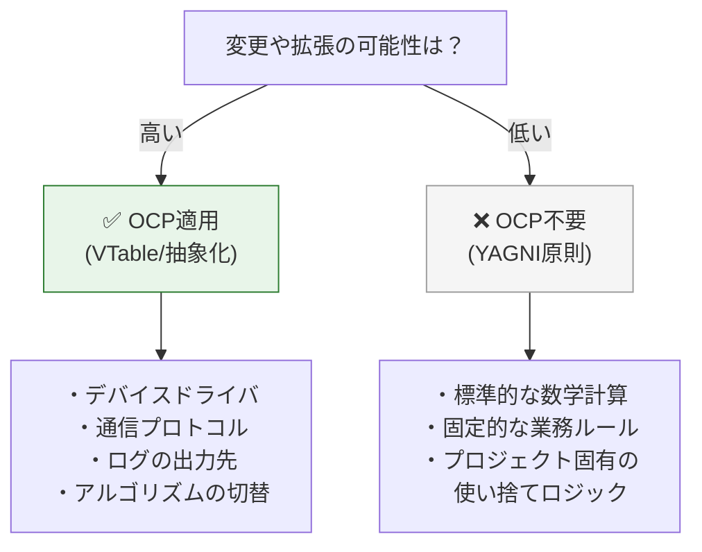

### 3.3. パターン3：状態フラグ → ストラテジーパターン

### このパターンで学ぶこと

このセクションでは、**通知送信システム**を題材に、状態フラグによる分岐をストラテジーパターンで置き換える方法を学びます。

具体的には、以下のような送信モードを持つ通知システムを扱います：

* 「即時送信」→ メッセージを今すぐ送信
* 「予約送信」→ メッセージを指定時刻に送信

将来的には「優先送信」「深夜送信」「リトライ送信」などが追加される可能性があります。

### ❌ 原則適用前：booleanフラグによる分岐

まず、OCP原則を適用していないコードを見てみましょう。このコードは、送信モードを `bool` フラグで切り替えています。

### notifier.c

**このファイルの役割**:
フラグによる分岐を用いた通知送信の実装です。
**処理の内容:** `bool` フラグを受け取り、if文で処理を分岐させています。
**設計的意図:** （悪い例）単純な条件分岐で要件を満たそうとしています。
**評価:** 送信モードが増えるたびにif文が増殖し、保守性が低下します。

#### notifier.c

```c
#include <stdio.h>
#include <stdbool.h>

void send_notification(const char* message, bool is_scheduled) {
    if (is_scheduled) {
        printf("[Notifier] 予約送信モード\n");
        printf("  後で送信: %s\n", message);
    } else {
        printf("[Notifier] 即時送信モード\n");
        printf("  今すぐ送信: %s\n", message);
    }
}

int main(void) {
    printf("=== 即時送信 ===\n");
    send_notification("Hello", false);
    
    printf("\n=== 予約送信 ===\n");
    send_notification("Hello", true);
    
    return 0;
}
```

### ✅ 原則適用後：ストラテジーパターン

次に、OCP原則を適用したコードを見てみましょう。**外側の動作（実行結果）は変えず**、送信モードを「送信戦略」として抽象化します。

ここでは、**C言語における継承の模倣（包含）という重要なテクニックを使用します。
基底となる構造体を派生構造体の先頭メンバ**に配置することで、ポインタのキャストを安全に行う設計パターンです。

#### 実行結果
```c
// イメージ
typedef struct {
    INotifyStrategy base; // 必ず先頭！
    char extra_data[20];
} DerivedStrategy;
// DerivedStrategy* は安全に INotifyStrategy* にキャスト可能
```

### 抽象契約の定義

### inotify_strategy.h

**このファイルの役割**:
通知送信の抽象インターフェース定義です。
**処理の内容:** 送信操作(`send`)の関数ポインタを持つVTableを定義します。
**設計的意図:** 送信の「振る舞い」を抽象化し、具体的な実装を隠蔽します。
**評価:** 新しい送信手段を追加しても、このインターフェースは不変です。

#### inotify_strategy.h

```c
#ifndef INOTIFY_STRATEGY_H
#define INOTIFY_STRATEGY_H

// 前方宣言
typedef struct INotifyStrategy INotifyStrategy;

// VTable定義：送信操作の契約
typedef struct {
    void (*send)(INotifyStrategy* self, const char* message);
} INotifyStrategyVTable;

// 戦略インターフェース（基底構造体）
struct INotifyStrategy {
    const INotifyStrategyVTable* vtable;
};

#endif
```

### 具象実装1：即時送信

**このファイルの役割**:
即時送信を行う具体的な戦略の実装です。
#### immediate_notify.c

```c
#include "inotify_strategy.h"
#include <stdio.h>
#include <stdlib.h>

// 即時送信の実装（固有データを持たないため、基底構造体そのものを使用）
static void immediate_send(INotifyStrategy* self, const char* message) {
    (void)self; // 未使用引数（コンパイラ警告抑制）
    printf("[Immediate] 今すぐ送信: %s\n", message);
}

static const INotifyStrategyVTable IMMEDIATE_VTABLE = {
    .send = immediate_send
};

INotifyStrategy* create_immediate_notify(void) {
    INotifyStrategy* strategy = malloc(sizeof(INotifyStrategy));
    if (strategy) {
        strategy->vtable = &IMMEDIATE_VTABLE;
    }
    return strategy;
}

void destroy_immediate_notify(INotifyStrategy* strategy) {
    free(strategy);
}
```

### 具象実装2：予約送信

**このファイルの役割**:
予約送信を行う具体的な戦略の実装です。
**設計のポイント**:
基底構造体 `INotifyStrategy` を先頭に配置することで、ポインタのキャストを安全に行い、C言語における継承と多態性を実現しています。

#### scheduled_notify.c

```c
#include "inotify_strategy.h"
#include <stdio.h>
#include <stdlib.h>
#include <string.h>

// 予約送信固有のデータを保持する構造体
// 【重要】基底構造体(base)を必ず「先頭」に配置する
// これにより、INotifyStrategy* へのキャストが安全に行える
typedef struct {
    INotifyStrategy base;    // 基底インターフェース（先頭配置）
    char scheduled_time[20]; // 固有データ
} ScheduledNotify;

static void scheduled_send(INotifyStrategy* self, const char* message) {
    // 先頭アドレスが一致するため、安全にダウンキャスト可能
    ScheduledNotify* notify = (ScheduledNotify*)self;
    printf("[Scheduled] %s に送信予定: %s\n", notify->scheduled_time, message);
}

static const INotifyStrategyVTable SCHEDULED_VTABLE = {
    .send = scheduled_send
};
```

予約送信のインスタンスを生成するファクトリ関数です。

#### scheduled_notify.c (続き)
```c
INotifyStrategy* create_scheduled_notify(const char* time) {
    ScheduledNotify* notify = malloc(sizeof(ScheduledNotify));
    if (notify) {
        // 基底部分の初期化
        notify->base.vtable = &SCHEDULED_VTABLE;
        // 固有データの初期化
        strncpy(notify->scheduled_time, time, sizeof(notify->scheduled_time) - 1);
        notify->scheduled_time[sizeof(notify->scheduled_time) - 1] = '\0';
    }
    // 基底ポインタとして返す（C言語のポリモーフィズム）
    return (INotifyStrategy*)notify;
}

void destroy_scheduled_notify(INotifyStrategy* strategy) {
    free(strategy);
}
```

### 利用側と実行コード

### notifier.c

**このファイルの役割**:
インターフェースに依存した通知送信の実装です。
**処理の内容:** 抽象インターフェース `INotifyStrategy` を受け取り、`send` 関数を呼び出します。
**設計的意図:** 具体的な送信手段を知らずに「通知する」という目的だけを達成します。
**評価:** 送信手段の追加・変更に対して完全に閉じています。

#### notifier.c

```c
#include "inotify_strategy.h"
#include <stdio.h>

// この関数は、将来送信モードが増えても「無修正」で対応可能
void send_notification(INotifyStrategy* strategy, const char* message) {
    if (!strategy || !strategy->vtable || !strategy->vtable->send) {
        printf("[Notifier] Error: Invalid strategy\n");
        return;
    }
    
    printf("[Notifier] 通知処理開始\n");
    // selfポインタ（strategy自身）を渡してコンテキストを維持
    strategy->vtable->send(strategy, message);
    printf("[Notifier] 通知処理終了\n");
}
```

### main.c

**このファイルの役割**:
通知戦略を生成し、注入して実行するクライアントコードです。
**処理の内容:** 具体的な戦略（即時、予約）を生成し、`send_notification` に渡します。
**設計的意図:** 依存性の注入（DI）を行い、使用する戦略を決定します。
**評価:** 実行時に柔軟に戦略を切り替えられます。

#### main.c

```c
#include "inotify_strategy.h"
#include <stdio.h>

extern void send_notification(INotifyStrategy* strategy, const char* message);
extern INotifyStrategy* create_immediate_notify(void);
extern INotifyStrategy* create_scheduled_notify(const char* time);
extern void destroy_immediate_notify(INotifyStrategy* strategy);
extern void destroy_scheduled_notify(INotifyStrategy* strategy);

int main(void) {
    printf("=== 即時送信 ===\n");
    INotifyStrategy* immediate = create_immediate_notify();
    send_notification(immediate, "Hello");
    destroy_immediate_notify(immediate);
    
    printf("\n=== 予約送信 ===\n");
    INotifyStrategy* scheduled = create_scheduled_notify("2024-01-01 10:00");
    send_notification(scheduled, "Hello");
    destroy_scheduled_notify(scheduled);
    
    return 0;
}
```

## 4. OCPの実践的な適用指針

### 4.1. いつOCPを適用すべきか

OCP（VTableパターンなど）は強力ですが、コードの複雑さを増すトレードオフがあります。すべてのコードに適用するのではなく、**「変化の頻度」と「コスト」**を見極めて適用します。



**適用の判断基準：**

* **適用すべき：** 将来的に種類が増えることが明白な場合（例：多言語対応、複数OS対応）。
* **適用すべきでない：** 現時点でバリエーションが1つしかなく、将来の拡張も憶測に過ぎない場合（過剰設計を避ける）。

### 4.2. 「if文」の処遇：Factoryへの集約

**よくある疑問：**「OCPで分岐をなくすと言っても、どこかで『USBかSerialか』を判断するif文が必要なのでは？」

**答え：** その通りです。if文を消滅させることはできません。OCPの真の狙いは、if文をビジネスロジックから排除し、**「生成（Factory）」という特定の汚れた場所に隔離すること**です。

### ファクトリ関数の実装例

### device_factory.c

**このファイルの役割**:
文字列キーを使って適切なデバイスインスタンスを生成するファクトリです。
**処理の内容:** 文字列比較により、対応する具象デバイスの生成関数を呼び出します。
**設計的意図:** 分岐（if文）をこの１か所に集約し、ビジネスロジックから排除します。
**評価:** 新しいデバイス追加時の修正箇所がここだけに限定されます。

#### device_factory.c
```c
#include "idevice.h"
#include <string.h>
#include <stdlib.h>
#include <stdio.h>

// 各具象デバイスの生成関数（外部リンケージ）
extern IDevice* serial_device_create(const char* port_name);
extern IDevice* ethernet_device_create(const char* ip_address);
extern IDevice* usb_device_create(int vid, int pid); // 新規追加

// 汎用的なパラメータ文字列を受け取り、適切なデバイスを生成するファクトリ
// 文字列キーで分岐することで、enumの再定義（ヘッダ修正）すら回避する
IDevice* device_factory_create(const char* type, const char* param) {
    if (type == NULL) return NULL;

    if (strcmp(type, "SERIAL") == 0) {
        return serial_device_create(param);
    } 
    else if (strcmp(type, "ETHERNET") == 0) {
        return ethernet_device_create(param);
    } 
    else if (strcmp(type, "USB") == 0) {  // 【この分岐のみ追加】
        // param文字列（例: "1234:5678"）を解析してUSB固有の引数に変換
        int vid = 0, pid = 0;
        if (param && sscanf(param, "%x:%x", &vid, &pid) == 2) {
            return usb_device_create(vid, pid);
        }
    }
    
    // 未知のデバイスタイプ
    return NULL;
}
```

**変更の影響範囲比較：**

| 場所 | 役割 | 変更頻度 | USB追加時の対応 |
| --- | --- | --- | --- |
| **Core Logic** | ビジネスロジック | 低 | **修正不要（閉鎖）** |
| **Factory** | 具象の選択・生成 | 高 | **ここだけ修正（開放）** |

## 本章で必ず理解してほしいことのまとめ

### OCPの本質とC言語での実装

### 1. **OCPの本質は「抽象への依存」**

変化しやすい具象実装ではなく、変化しにくい抽象インターフェースに依存することで、新しい実装を追加（拡張）する際に、既存のコアロジックを修正しない（閉じる）ことを可能にします。

### 2. **VTableパターンが実現の鍵**

C言語では、VTable（関数ポインタの構造体）とcontext（具象データ）のペアによって、抽象インターフェースの「契約」を構築し、具象実装への静的な依存を断ち切ります。

### 3. **if文はFactoryに隔離する**

if文を完全に消すことはできません。ビジネスロジックからif文を排除し、Factory層に集約することで、変更の影響範囲を局所化します。

### C言語でOCPを実現する設計パターン一覧

| 設計要素 | 役割 | 実現する価値 |
| --- | --- | --- |
| **VTable構造体** | 操作の契約を定義 | 多態性の基盤 |
| **インターフェース構造体** | vtable + contextのペア | 抽象への依存 |
| **void* context** | 具象データの隠蔽 | 情報隠蔽・カプセル化 |
| **ファクトリ関数** | 生成ロジックの集約 | 具象依存の隔離 |

## チェックリスト

本章の設計指針が正しく適用されているか、以下の項目でセルフチェックを行いましょう。

* [ ] **拡張ポイントの特定**: 今後、新しい種類の実装が追加される可能性のある「変化の境界」を特定しているか？
* [ ] **抽象への依存**: 上位のビジネスロジックが、具象実装（`xxx.c`）ではなく、VTableを定義した抽象ヘッダ（`i_xxx.h`）のみを参照しているか？
* [ ] **データと振る舞いの分離**: 具象データ（`context`）を `void*` 等で隠蔽し、操作を関数ポインタ（VTable）経由に限定しているか？
* [ ] **条件分岐の排除**: 新しい実装を追加する際、既存のビジネスロジック内の `switch` 文や `if-else` チェーンを修正する必要がない構造になっているか？
* [ ] **Factoryへの集約**: 具象クラスのインスタンス化を Factory 関数に集約しているか？

### 次章への橋渡し

本章（**第9章**）では、OCPという「原則」を学び、VTableパターンという「道具」がいかに拡張性を支えるかを理解しました。しかし、VTableを使って関数を差し替えられるようにしただけでは、システムは安全になりません。差し替えられた新しい実装が、期待通りの振る舞いをしなかったら？

次章 **第10章 リスコフの置換原則（LSP）** では、この抽象インターフェースを実装する側が守るべき「振る舞いの契約」について深く掘り下げていきます。