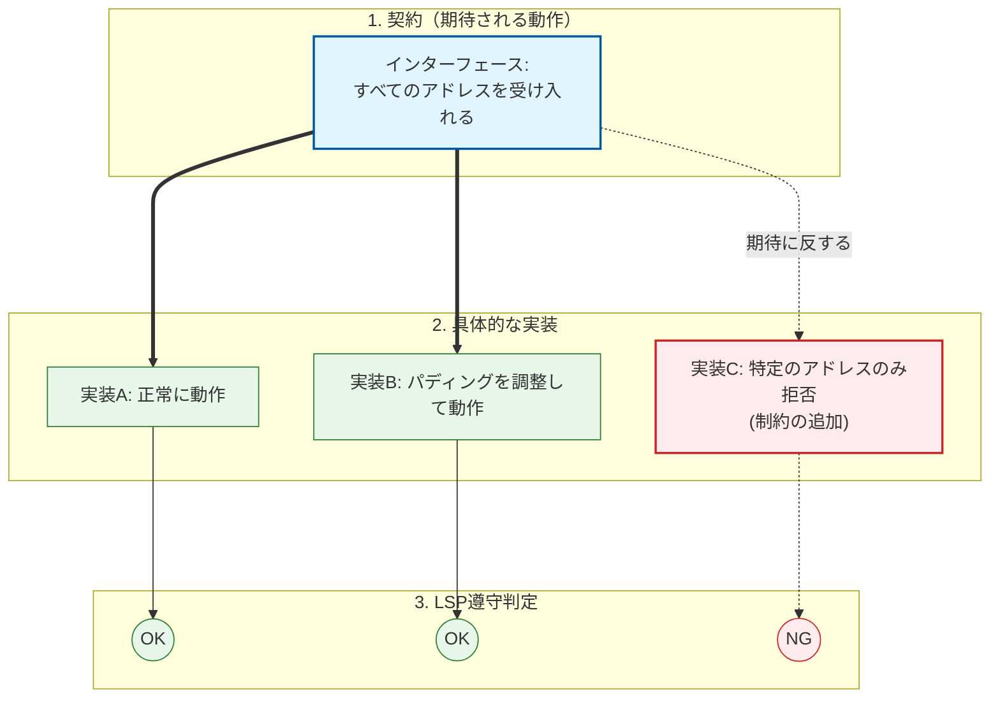
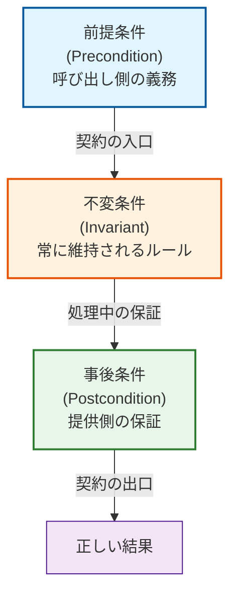
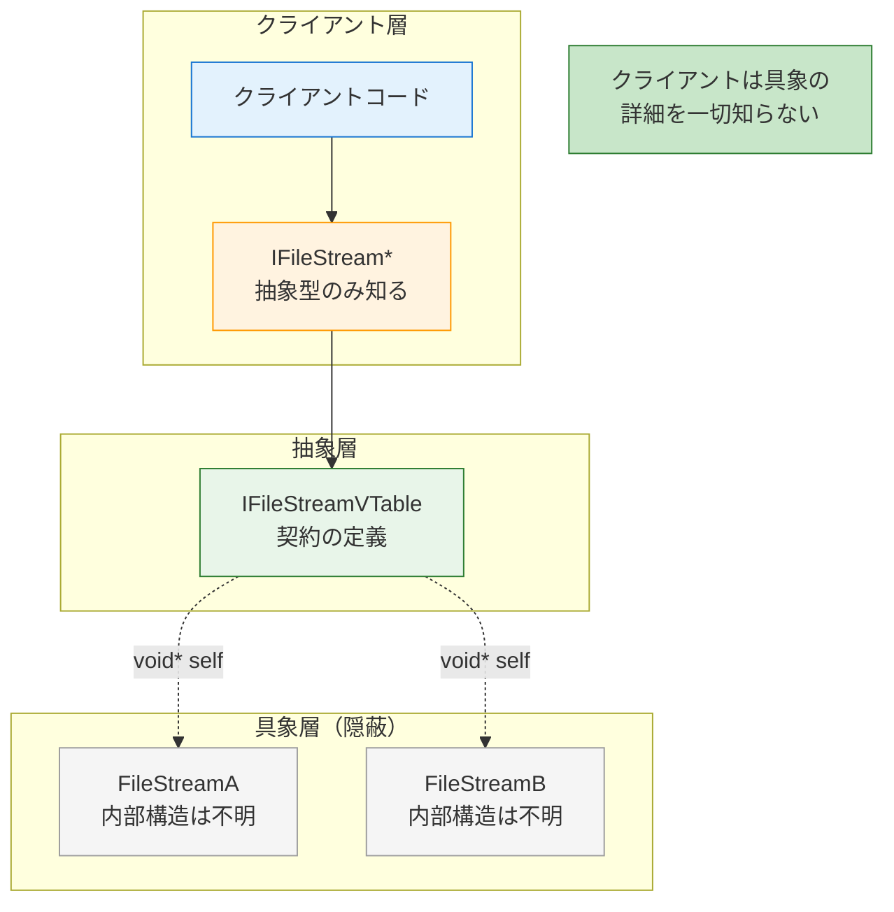
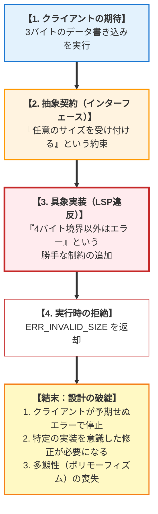
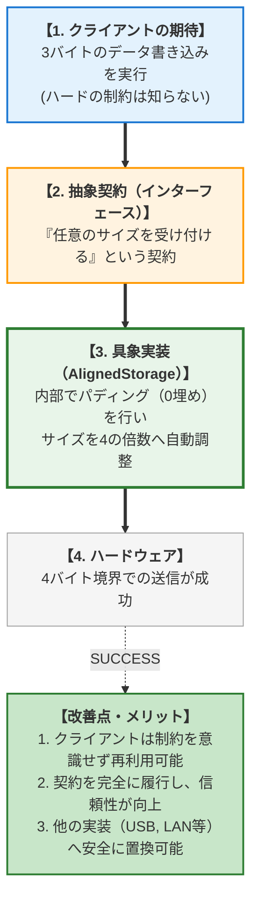
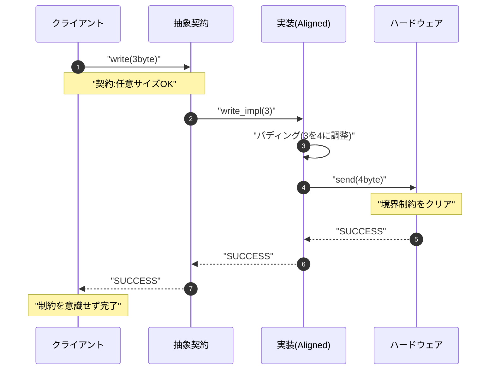

# 第2部 第10章 リスコフ置換原則 (LSP): 多態性の安全性と契約の保証

本章の主題は、設計の三本柱のうち **「契約」** の柱にあります。LSPを適用することで、抽象インターフェースが定義した **「利用法」** と **「変更耐性」** を具象実装が厳格に保証し、 **多態性の安全性** を確保します。

この原則を実現するためには、 **第1部 第4章 不透明型と不透明ポインタ** による隠蔽と、 **第1部 第6章 エラーハンドリングパターン** による契約の遵守が重要です。これらがどのようにして、 **多態性の安全な実現** という設計目標を達成するのかを詳細に学びます。

## 1. 原則の哲学と本質

### 1.1. LSPの本質は「置換可能性」

 **リスコフ置換原則** （Liskov Substitution Principle、以下 **LSP** ）は、開放閉鎖原則（OCP）と対になる原則です。OCPが「どのように拡張するか（ **構造** ）」を定義するのに対し、LSPは「その拡張が既存のシステムを壊さないことを、どのように保証するか（ **品質** ）」を定義します。

いわば、OCPが「新しいプラグインを差し込めるソケット」を作る設計図だとすれば、LSPは「そこに差し込むプラグインが満たすべき電圧や形状の規格」を定めるものです。

### 1.2. LSPの定義：厳格かつシンプルなルール

LSPは、計算機科学者バーバラ・リスコフによって以下のように定義されました。

> 「プログラム中の型 T のオブジェクトにおいて、その派生型 S のオブジェクトで置換したとしても、プログラムの性質（正しさ）が変わらないこと」

つまり、クライアントコードが抽象インターフェース I に依存している場合、どの具象実装（Implementation A, B...）が渡されたとしても、クライアント側は一切の修正を必要とせず、かつ予期せぬ挙動に怯えることなく動作し続けなければならない、という原則です。

### 1.3. ソケットとプラグの比喩：契約と違反

以下の図は、リスコフの置換原則（LSP）における **「契約（約束事）」と「信頼」** の関係を、コンセントの差し込み口（ソケット）とプラグに例えて表現しています。

#### 契約と実装の適合イメージ

抽象インターフェース（ソケット）に対して、LSPを満たす実装（プラグA, B）と、LSPに違反する実装（プラグC）の違いを可視化しています。 

*   **ソケット（契約)** : 「どんなアドレスでも受け入れる」という広い契約を提示。
*   **プラグA, B（遵守）** : 契約通り、あるいは内部で調整して動作するため「OK」。
*   **プラグC（違反）** : 「特定の条件しか受け付けない」という **事後条件の強化（制約の追加）** を行っているため「NG」。

二重線（===）: 契約に基づく正常な接続 
点線（-.-）: 期待に反する不正な接続 NGノード: クライアントコードにバグを引き起こす箇所。



#### なぜプラグCはダメなのか？

このような「勝手なルール」を持つ実装が一つでも混じると、利用者は不安になります。「今度の相手は特殊なルールがあるかも？」と疑い、コードの中に「もし相手がCなら……」という余計なチェックを書き足さなければならなくなります。

 **「後から参加するメンバー（実装）は、共通のルール（契約）を勝手に厳しくしてはいけない」** これが、この原則の核心です。

### 1.4. 契約の3要素：LSPを構成する要件

LSPをC言語の実装レベルで理解するために、契約を **「前提条件」「事後条件」「不変条件」** の3つに分解して考えてみましょう。これらを破る実装は、すべてLSP違反となります。

#### 契約の構造

関数の呼び出しから終了までの流れの中で、どのタイミングでどの条件が満たされている必要があるかを示します。

 **用語の定義** :  
*   **前提条件** : 関数を呼ぶ前に **呼び出し側** が守るべきルール（引数の範囲など）。
*   **不変条件** : 処理中も常に維持されるべきシステムの整合性ルール。
*   **事後条件** : 関数が戻る際に **実装側** が保証すべき結果（戻り値の状態など）。 



### 1.4.1. 前提条件（Precondition）：呼び出し側の義務を増やさない

 **「具象実装は、前提条件を強化してはならない」** インターフェースが「引数に0以上の値を受け取る」と定義しているなら、具象実装が勝手に「私は10以上の値しか受け付けない」と条件を厳しくしてはならない。

####  **ケース1：ストレージドライバの整列制約** 

抽象インターフェース `write(addr, data)` において、仕様上は「任意のアドレス」への書き込みが可能とされている。しかし、特定の安価なフラッシュメモリの実装が「書き込みアドレスは4バイト境界（4の倍数）でなければならない」という制約を独自に追加し、それ以外でエラーを返すようにした。

 **なぜ問題か** ： クライアントは「任意のアドレスに書ける」と信じて設計されている。特定の実装のために、クライアント側ですべてのデータ配置を4バイト境界に揃える修正が必要になり、多態性の恩恵が失われる。

####  **ケース2：ファイルシステムのパス長** 

共通インターフェースで「最大256文字のパスを受け付ける」となっているが、新しいSDカード実装が「独自のFAT制限により8文字までしか受け付けない」という制約を追加した。

 **なぜ問題か：** クライアントは「256文字までなら安全に処理できる」と信じて設計されているため、新しいSDカード実装に差し替えた途端、既存の長いファイル名を扱う上位モジュールはすべてクラッシュするか、予期せぬエラーで動作不能になってしまう。

### 1.4.2. 事後条件（Postcondition）：戻り値の保証を弱めない

 **「具象実装は、事後条件を弱化してはならない」** インターフェースが「処理成功時には必ず有効なポインタを返す」と約束しているなら、具象実装が「時々NULLを返すかもしれない」といった曖昧な振る舞いをしてはならない。

####  **ケース1：センサーデータの単位変換** 

インターフェース `get_temperature()` が、「摂氏（℃）単位の浮動小数点を返す」と定義されているとする。ところが、新しい高精度センサーの実装が、精度を優先するあまり「華氏（℉）」で値を返してしまった。

 **なぜ問題か：** クライアントは返ってきた値を「摂氏」として処理（例：30度以上ならアラーム）する。単位が変わるという「事後条件の変更」は、システム全体に誤動作を引き起こす。

####  **ケース2：エラーコードの私物化** 

インターフェースが「失敗時は負の値を返す」と定めている。しかし、ある実装が「成功だがデータが空の場合、特殊な正の値 100 を返す」とした。

 **なぜ問題か：** クライアントが `if (result < 0)` でエラー判定をしていた場合、この「100」を見逃し、不正なデータを正常として処理してしまう。

### 1.4.3. 不変条件（Invariant）：不変のルールを破壊しない

 **「具象実装は、システムが維持すべき不変のルールを破壊してはならない」** 例えば、「通信セッション中は必ず接続状態（Connected）を維持する」というルールがある場合、具象実装の内部処理で勝手に切断してはならない。

####  **ケース1：読み取り専用リストの内部ソート** 

リスト構造のインターフェースに `get_count()` がある。ある具象実装（キャッシュ機能付きリスト）が、内部の高速化のために `get_count()` を呼ぶたびに内部データを勝手に並び替えてしまった。

 **なぜ問題か：** もしクライアントが「リストの順序は不変である」という前提でループを回していた場合、単に件数を確認しただけで順序が変わると、処理結果が支離滅裂になる。

####  **ケース2：共有リソースの排他制御** 

「この関数を抜けるときは、必ずミューテックスを解放した状態でなければならない」という不変条件がある。しかし、特定の異常系処理でリターンする際に、ミューテックスを保持したまま終了する実装を追加してしまった。

 **なぜ問題か：** 次にそのリソースにアクセスするクライアントが永久にデッドロックし、システムが停止する。

### 1.5. 三つの裏切りをしない：LSPの要約

リスコフの置換原則（LSP）を要約すると、 **「インターフェースの仕様（入力・処理・出力）を絶対に裏切らない」** という、信頼関係の維持に尽きると言えます。ただ、「文法（型）」を守るだけでなく、 **「相手（利用者）の期待」まで守る** という点が、この原則の深みです。

利用者は、インターフェースという「窓口」を見てコードを書きます。その窓口に書かれていない **「独自のマイルール」** を具象側で勝手に追加してしまうのがLSP違反です。

整理すると、以下の「3つの裏切り」をしないことと言えます。

#### 1. 入力の裏切り（前提条件の強化）

*   **約束** : 「誰でも入っていいですよ」
*   **違反** : 「実は、青い服の人以外は立ち入り禁止です」
*   **実務** : インターフェースでは「どのアドレスでもOK」なのに、具象側が「4の倍数以外はエラー」にするなど。利用者は「えっ、わざわざ相手に合わせて服（データ）を着替えなきゃいけないの？」と困惑します。

#### 2. 出力の裏切り（事後条件の弱化）

*   **約束** : 「成功したら、必ず品物を渡します」
*   **違反** : 「成功したけど、品物（ポインタ）はNULLです。中身は空っぽです」
*   **実務** : 「成功時は有効な値を返す」はずが、特定の具象だけ「成功だけど意味が違う値」を返すなど。

利用者は「成功って言ったのに、中身が使えないじゃないか！」と怒ります。

#### 3. 振る舞いの裏切り（不変条件の破壊）

*   **約束** : 「中身はいじりません。見るだけです」
*   **違反** : 「見たついでに、こっそり中身を並び替えちゃいました」
*   **実務** : 単なるデータ取得関数のはずが、内部で勝手に状態を変えてしまう。

利用者は「ちょっと見ただけなのに、次に見たら順番が変わってる！」とパニックになります。

#### なぜ「当然のこと」が原則になるのか？

「仕様を守るなんて当然」と思えますが、開発現場では **「この新しいデバイス（具象）は特殊だから、少しだけ仕様を変えてもいいよね？」** という誘惑が常にあります。

しかし、その「少しの書き換え」を許すと、利用者は全てのコードに対して： `if (相手がデバイスAなら) ... else if (相手がデバイスBなら) ...` と、 **相手の顔色を伺う「分岐」を激増** させることになります。 **「相手が誰であっても、窓口の言葉（インターフェース）だけを信じていれば、絶対に大丈夫」** この100%の安心感を保証することが、LSPの最大の目的なのです。

## 2. C言語での実現手段と設計要素

C言語には言語レベルでの `interface` キーワードがないため、LSPを守るには **「第1部の技術」** を規律を持って適用する必要があります。

### 2.1. LSP遵守の三つの処方箋

#### 1.  **不透明ポインタ（第4章）の活用** 

具象構造体の中身を隠蔽し、クライアントが具象の型に依存した「型キャスト」を行えないようにする。これにより、「特定の型だけ特別扱いする」という誘惑を物理的に断つ。

#### 2.  **厳格なエラーハンドリング（第6章）** 

インターフェースヘッダに、その関数が返しうるエラーコードの範囲を明記する。具象実装は、その範囲外の「自分勝手なエラーコード」を返してはならない。

#### 3.  **ユニットテストによる契約検証** 

新しい具象実装を作成した際は、共通のインターフェーステストスイートを通す。どの子クラスも同じテスト（同じ入力に対して同じ期待値）をパスすることを保証する。

### 2.2. 抽象インターフェースの契約定義

OCPで解説した **VTableパターン** によって抽象インターフェースを定義することが、LSP実現の土台となります。VTableの関数ポインタのシグネチャと、それらが満たすべき **契約コメント** を厳密に記述するのです。
C言語では **ヘッダファイルそのものが契約書** となるため、ここで定義されたルール（コメント含む）を守ることがLSP適用の第一歩となります。

####  **IFileStream.h（抽象インターフェースのVTable定義）**

抽象ストリームのインターフェース契約定義です。VTableを用いた読み込み(`read_data`)とクローズ(`close`)の操作を定義します。

エラーコードや前提条件をドキュメント化し、実装者に契約遵守を強制します。クライアントはこのヘッダのみを見てコードを書くことができ、実装の詳細から解放されます。

#### IFileStream.h
```c
#ifndef IFILE_STREAM_H
#define IFILE_STREAM_H
#include <stddef.h>
#define MAX_READ_SIZE 4096

/* エラーコードの定義（契約の一部） */
#define SUCCESS 0
#define ERROR_EOF -1
#define ERROR_TEMPORARY -2
#define ERROR_FATAL -3

/**
 * @brief 抽象ストリームインターフェースが満たすべき契約（VTable）。
 * すべての具象実装は、以下の契約を厳守しなければならない。
 */
typedef struct {
    /**
     * @brief データ読み込み関数。
     * * [前提条件]
     * - size > 0 かつ size <= MAX_READ_SIZE であること
     * - self != NULL, error_code != NULL
     * * [事後条件]
     * - 成功時: 非NULLを返し、*error_code = SUCCESS
     * - 失敗時: NULLを返し、*error_codeに以下のいずれかをセット:
     * * ERROR_EOF: データ終端に到達
     * * ERROR_TEMPORARY: 一時的なエラー（リトライ可能）
     * * ERROR_FATAL: 致命的なエラー（リトライ不可）
     * * [不変条件]
     * - selfポインタとerror_codeポインタの指す先は変更されない
     * - 返却されるデータは、次の読み込みまで有効である
     */
    void* (*read_data)(void* self, size_t size, int* error_code);
    /**
     * @brief ストリームのクローズ。
     * * [前提条件] self != NULL
     * [事後条件] SUCCESS or ERROR_FATAL を返す
     * [不変条件] 一度closeしたストリームは再度openできない
     */
    int (*close)(void* self);
} IFileStreamVTable;

/* 抽象型（クライアントが依存する型） */
typedef struct {
    const IFileStreamVTable* vtable;
    void* self;
} IFileStream;

/* ラッパー関数 */

static inline void* file_stream_read(IFileStream* stream, size_t size, int* error_code) {
    return stream->vtable->read_data(stream->self, size, error_code);
}

static inline int file_stream_close(IFileStream* stream) {
    return stream->vtable->close(stream->self);
}
#endif
```

### 2.3. 不完全型と`void* self`による具象データからの隔離
C言語においてLSPを実現する上で重要なのが、 **具象実装の内部データ構造（構造体）をクライアントから完全に隠蔽** することです。
*  **不完全型 (`struct Concrete;`)** : 具象データ型の定義をヘッダから排除することで、クライアントは具象構造体のサイズやフィールドの存在を知ることができないようにします。
*  **`void* self`** : VTableのメソッドは、第1引数として具象データへの不透明なポインタ (`void* self`) を受け取ります。これにより、クライアントコードは具象データへの **静的な依存** を断ち切ることができます。
具象実装が隠蔽されていれば、具象実装内でデータを追加・変更しても、抽象型 (`IFileStream`) を使うクライアントのコードは影響を受けず、「 **修正に対して閉じている** 」状態が維持され、LSPの置換可能性が担保されるのです。

#### 依存関係と隠蔽の構造

この図は、クライアントが「抽象」のみに依存し、具象実装の「詳細」から物理的に隔離されている様子を示しています。クライアント層は具象クラス（`ConcreteA`, `ConcreteB`）を知らず、`VTable` という契約のみを知っています。`void* self` というポインタを経由することで、型情報を漏らさずに具象データを操作します。図中の矢印は依存の方向を、点線は実行時の動的な参照を表しています。



この構造により、クライアントは抽象型（`IFileStream`）と契約（VTable）のみに依存し、具象実装の詳細からは完全に分離されます。
新しい具象実装を追加しても、既存のクライアントコードは一切変更する必要がなく、OCPとLSPの両方が同時に実現されるのです。

## 3. 実践パターン：LSPを実現する三つの型
リスコフ置換原則（LSP）をC言語で実現するためには、実装者が「インターフェースという契約書」のどの項目を遵守すべきかを正しく理解する必要があります。ここでは、 **前提条件・不変条件・事後条件** の三つの視点から、具体的な実践パターンを解説します。

### 3.1. 実践パターン1：前提条件の管理（呼び出し側の義務を増やさない）
インターフェースが「どんな入力でも受け付ける（例：int型なら何でも）」と約束している場合、特定の具象実装が「私は負の値は嫌いだ」「私は特定のサイズしか扱えない」と入力を拒むことは許されません。

#### ❌ 原則適用前：前提条件の強化（LSP違反）
抽象契約では「任意のサイズの書き込み」を許可している。しかし、ある通信ドライバの実装が「ハードウェアの制約で4バイト単位でしか送れない」という理由から、4の倍数以外のサイズをエラーにしてしまうケース。

#### 違反時の構造と問題点

この図は、具象実装が勝手な制約（4バイト境界）を追加したことで、クライアントが予期せぬエラーに直面し、システムが破綻する流れを示しています。インターフェースの約束（任意サイズOK）を具象側が破っているため、LSP違反となっています。その結末として、特定の実装のためだけに、クライアントコードの修正が必要になってしまいます。図中の赤い矢印とノードはエラーの発生とシステムの破綻を、3段目（Impl）では「自分勝手なルール」が追加されている様子を表しています。



#### **契約の比較表**
| 項目 | 抽象インターフェース（契約） | 具象実装（違反状態） | 判定と理由 |
| --- | --- | --- | --- |
| **前提条件** | 1バイト単位で指定可能 | **4の倍数サイズのみ許可** | **強化（違反）** : 入力条件を厳しくしている |
| **クライアントの負担** | 自由にサイズを指定できる | **「4の倍数か？」を毎回気にする必要がある** | **置換可能性の喪失** |
| **多態性の破壊** | どの実装でも同じように使える | **この実装だけ特別扱いが必要** | **OCPの破壊** |

####  **istorage.h (抽象契約の定義)**

ストレージアクセスの抽象契約（インターフェース）を定義します。`IStorageVTable`は、任意のデータサイズを受け入れる(`size_t data_size`)という契約をクライアントと交わしています。この契約がある以上、どのような具象ハードウェアであっても、このインターフェースを通じて利用される限りは、この約束を守らなければなりません。契約が明確であるため、クライアントは安心して実装を利用できます。

#### istorage.h
```c
#ifndef ISTORAGE_H
#define ISTORAGE_H
#include <stddef.h>
#define SUCCESS 0
#define ERR_INVALID_SIZE -1
// ハードウェア操作のモック（本来は別ヘッダ）
int hardware_send(int fd, const void* data, size_t size);
#endif
```

####  **UnalignedStorage.c(LSP違反の実装)** 

ハードウェアの制約（4バイトアライメント）をそのままクライアントに露出させてしまっている悪い実装例です。インターフェースが許可している「任意のサイズ」での書き込みに対し、勝手な制限（4バイト境界）を課しています。これは事後条件の違反（正確には前提条件の不正な強化）であり、典型的なLSP違反です。この実装は、クライアントコードに予期せぬエラーを引き起こし、多態性を破壊します。

#### UnalignedStorage.c
```c
#include "istorage.h"
#include <string.h>

typedef struct {
    // ハードウェア固有のデータ
    int hardware_fd;
} UnalignedStorage_Data;

/* LSP VIOLATION: 具象側のハードウェア都合をクライアントに押し付けている */
static int unaligned_write_impl(void* self, const void* data, size_t size) {
    UnalignedStorage_Data* storage = (UnalignedStorage_Data*)self;

    /*
     * 【違反】契約では1バイト単位のはずが、具象都合で4の倍数以外をエラーにしている
     * クライアントはこのエラーを想定していない可能性がある
     */
    if (size % 4 != 0) {
        return ERR_INVALID_SIZE; // 契約にない独自エラー
    }

    return hardware_send(storage->hardware_fd, data, size);
}
```

####  **この設計の何が「罪」なのか** 
- **契約違反** : インターフェースは「任意サイズ」を約束しているのに、特定実装が拒否している
- **クライアントの負担増** : この実装を使う場合だけ、クライアント側でアライメントチェックが必要
- **置換不可能** : 他の実装から切り替えると、突然エラーが発生する
- **多態性の破壊** : `if (storage->type == UNALIGNED_TYPE)` のような型チェックが必要になる

#### ✅ 原則適用後：具象側での制約の吸収（LSP準拠）

#### **解決策**

もし具象側（ハードウェア）に制約があるなら、 **具象実装の中でパディング（余白埋め）などの処置を行い、クライアントには「成功した」と見せかける** のがLSPの正しいあり方です。

#### 遵守時の構造とメリット

この図は、具象実装が「賢く」振る舞い、内部で制約を解決することで、クライアントとハードウェアの両方の要求を満たす様子を示しています。具象実装（`AlignedStorage`）が中継役となり、パディング処理を行うことで制約を吸収しています。その結果、クライアントは自由なサイズで書き込め、ハードウェアは正しい形式でデータを受け取れるというWin-Winの関係が実現されています。図中の緑色（Impl）は問題を解決している「賢い」実装を、下段（Benefit）は設計が正しく機能した結果得られるメリットを表しています。



#### 内部処理の詳細フロー（パディング処理）

この図は、3バイトのデータ書き込み要求が来た際、具象実装内部で何が行われているかの時系列フローを示しています。クライアント（`C`）と抽象契約（`I`）の間では `3byte` のやり取りですが、実装（`S`）とハードウェア（`H`）の間では `4byte` に変換されています。この透過的な処理により、パディングという「面倒な仕事」の責任を、クライアントではなく具象実装が負っています。図中の `S->>S` は自己呼び出しによる内部データの調整（パディング）を、メッセージ引数の変化（3byte -> 4byte）に注目してください。



####  **契約の比較表** 
| 項目 | 抽象インターフェース（契約） | 具象実装（準拠状態） | 判定と理由 |
| --- | --- | --- | --- |
| **前提条件** | 1バイト単位で指定可能 | **どんなサイズでも受け入れる** | **遵守** : 契約通りの広さを維持 |
| **具象側の処置** | 特になし | **不足分を内部で補完して送信する** | **隠蔽** : 複雑さを具象に閉じ込める |
| **クライアントの視点** | 自由にサイズ指定 | **何も変わらず自由に指定できる** | **置換可能性の維持** |

####  **AlignedStorage.c(LSP準拠の実装)** 

LSPを遵守した実装です。クライアントからの入力（任意のサイズ）を受け入れた上で、内部バッファを使ってパディングを行い、ハードウェアの制約（4バイト境界）を満たすように調整しています。これにより、クライアントに負担をかけることなく、ハードウェアを正しく制御できるのです。

#### AlignedStorage.c
```c
#include "istorage.h"
#include <string.h>
#include <stdint.h> // uint8_t用
#include <stddef.h>

#define MAX_PACKET 4096

typedef struct {
    int hardware_fd;
} AlignedStorage_Data;

/* LSP COMPLIANT: 具象側の制約は、具象側で安全に解決する */
static int aligned_write_impl(void* self, const void* data, size_t size) {
    AlignedStorage_Data* storage = (AlignedStorage_Data*)self;

    // 1. 共通の前提条件チェック（契約の範囲内）
    if (size > MAX_PACKET) return ERR_INVALID_SIZE;

    // もともと4の倍数ならそのまま送信
    if (size % 4 == 0) {
        return hardware_send(storage->hardware_fd, data, size);
    }

    // 2. 内部での制約吸収（LSPの真骨頂）
    uint8_t temp_buf[MAX_PACKET];

    // サイズを4バイト境界に切り上げ（例: 3 -> 4, 5 -> 8）
    size_t padded_size = (size + 3) & ~3;

    memcpy(temp_buf, data, size);
    // 余った部分を0で埋める（パディング）
    memset(temp_buf + size, 0, padded_size - size);

    return hardware_send(storage->hardware_fd, temp_buf, padded_size);
}
```

####  **設計のポイント** 

- **契約の履行** : クライアントが期待する「任意サイズ」を完全にサポート
- **複雑さの隠蔽** : 4バイト境界という制約は具象実装の内部で吸収
- **置換可能性** : 他の実装から切り替えても、クライアントコードは無修正で動作
- **テスト容易性** : 3バイト、5バイトなど、様々なサイズでテスト可能
