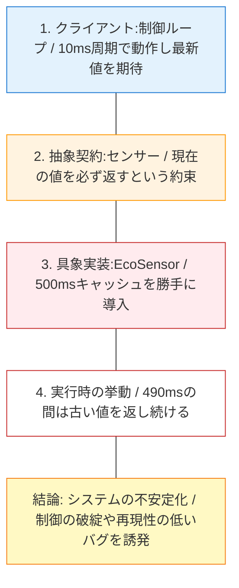
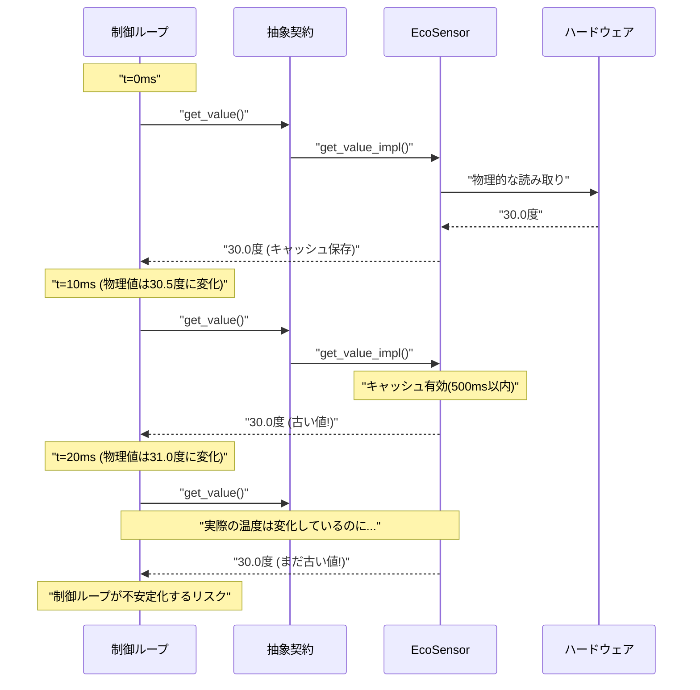
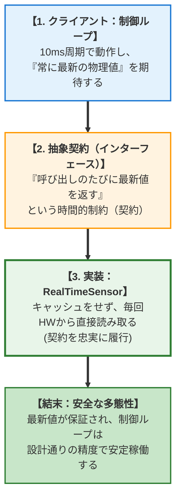
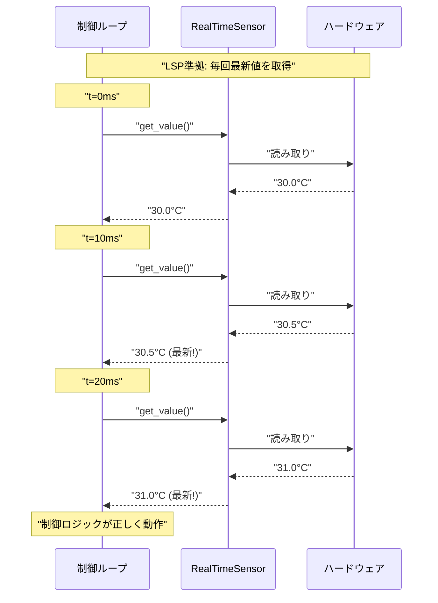
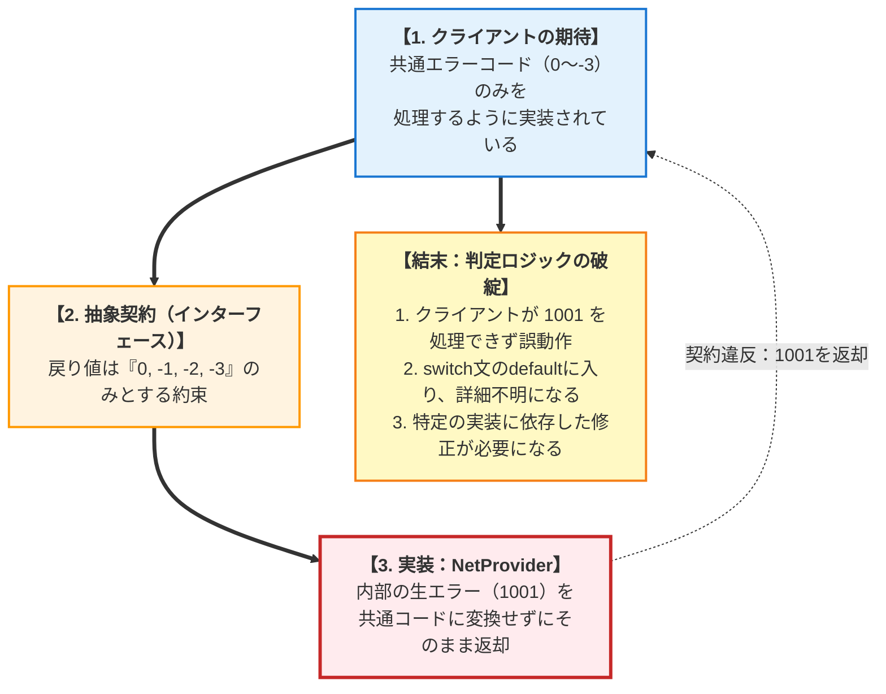
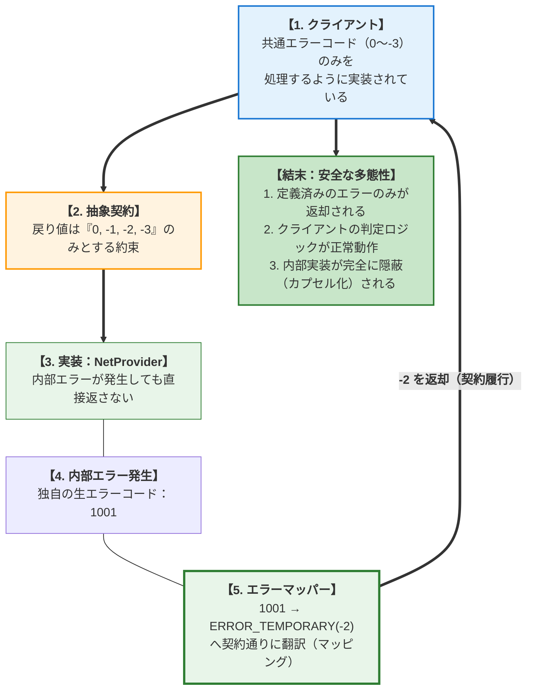
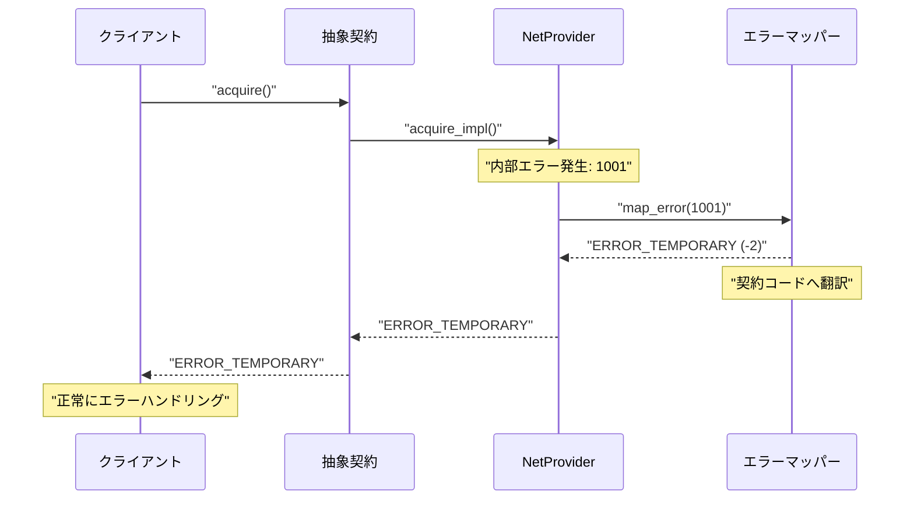

### 3.2. 実践パターン2：不変条件の保証（暗黙のルールの維持）

不変条件とは、 **「オブジェクトが生存している間、常に真でなければならないルール」** です。これにはデータの整合性だけでなく、 **「一度取得したデータは、ある一定の条件下（例えば次の更新まで）では変化しない」** あるいは逆に **「呼び出すたびに必ず最新の状態を反映する」** といった、時間的な振る舞いのルールも含まれます。

#### システム概要

ここでは、ハードウェアから現在の環境データ等を読み取る**センサー値取得システム**を実装します。このシステムは、「呼び出すたびに必ず最新の物理値を返す（リアルタイム性の保証）」という暗黙的な状態維持の契約（不変条件）を持っており、制御ループなどのクライアントがこの前提に依存して動作するという要件を持っています。

#### ❌ 原則適用前：不変条件の破壊（最適化による時間的ルールの変更）

センサー値を読み取るインターフェースにおいて、クライアントは「呼び出すたびに最新の値が得られる」という **振る舞いの契約** （不変条件）を期待している。しかし、ある具象実装が **「消費電力削減のため、内部で500msキャッシュする」** という最適化を勝手に行うケース。

これは「エラー」ではありませんが、契約が保証していた「リアルタイム性」という不変条件を破壊しています。

#### 違反時の構造と影響

具象実装が勝手な最適化（キャッシュ）を行った結果、クライアントの期待する「リアルタイム性」が損なわれる様子を示します。

*   **不一致** : クライアントは10msごとの制御を期待していますが、実装は500msごとの更新しか行いません。
*   **リスク** : 値が変わらないため、制御系システムでは暴走や振動などの重大な事故につながる恐れがあります。赤い箱（Impl, Failure）: 不正な状態の連鎖。クライアントの期待（10ms）と実装の挙動（500ms）のズレに注目。



#### 時間軸での不整合（タイムライン図）

制御ループ（クライアント）とセンサー（実装）の時間的なズレを可視化しています。物理値（Hardware）は変化しているのに、EcoSensorがそれを無視して古い値を返し続けている点。

左側（Client）は頻繁に問い合わせています。中央（Eco）が「キャッシュ」によって遮断壁となっている様子。



####  **契約の比較表**
| 項目 | 抽象インターフェース（契約） | 具象実装（違反状態） | 判定 |
| --- | --- | --- | --- |
| **不変条件** | 呼出のたびに最新値を返す | **500ms間は古い値を返し続ける** | **破壊（違反）** |
| **クライアントの誤算** | 高速な制御ループに使用可能 | **制御が追いつかず、システムが不安定化** | **置換不能** |
| **暗黙の契約** | リアルタイム性の保証 | **最適化優先でリアルタイム性を犠牲** | **契約違反** |

では、このインターフェースの「不変条件」を無意識に破壊してしまう実装とはどのようなものでしょうか。

この `EcoSensor` は、消費電力を抑えるために内部にキャッシュ機構を持ち、500ms以内ならハードウェアにアクセスせず古い値を返します。一見すると「賢いエコな実装」に思えますが、LSPの観点からは大罪です。
なぜなら、利用者は「この関数を呼べばいつでも最新の温度が取れる（リアルタイム性の保証）」と信じて超高速な制御ループを組んでいるからです。良かれと思った最適化が、システム全体の制御を狂わせる原因になってしまいます。

#### 最適化がもたらす時間的契約の裏切り

#### EcoSensor.c
```c
#include "isensor.h"
#include <time.h>

typedef struct {
    float cached_value;
    time_t last_update;
    int hardware_id;
} EcoSensor_Data;
#define CACHE_DURATION_MS 500

// ダミー実装: 通常はハードウェアクロックを使用
time_t get_time_ms(void) {
    return time(NULL) * 1000;
}
float fetch_from_hardware(int id);

/* LSP VIOLATION: 「最新値を返す」という暗黙の不変条件を、省電力（具象都合）で破っている */

static float get_value_impl(void* self) {
    EcoSensor_Data* sensor = (EcoSensor_Data*)self;
    time_t now = get_time_ms();

    /* * 【違反】単体では「省電力」という正しい機能だが、
     * 「常に最新」を期待する既存の制御プログラムに組み込むと、更新頻度不足で破綻する。
     */
    if (now - sensor->last_update < CACHE_DURATION_MS) {
        return sensor->cached_value; // 古い値を返す（契約違反）
    }

    sensor->cached_value = fetch_from_hardware(sensor->hardware_id);
    sensor->last_update = now;

    return sensor->cached_value;
}
```

####  **この設計の何が「罪」なのか**

- **時間的不変条件の破壊** : 「呼び出すたびに最新」という暗黙の保証を破っている。
- **制御系での使用不可** : 高速な制御ループで使うと、センサー値の更新が追いつかない。
- **デバッグ困難** : エラーは出ないが、システムが微妙におかしくなる。
- **単体では正しい** : 省電力という機能自体は正しいが、契約の文脈では違反。

#### ✅ 原則適用後：契約に忠実な振る舞い（LSP準拠）

####  **解決策**

*   **不一致** : クライアントは10msごとの制御を期待していますが、実装は500msごとの更新しか行いません。
*   **リスク** : 値が変わらないため、制御系システムでは暴走や振動などの重大な事故につながる恐れがあります。赤い箱（Impl, Failure）: 不正な状態の連鎖。クライアントの期待（10ms）と実装の挙動（500ms）のズレに注目。
もし具象が最適化を行いたいなら、インターフェースの「不変条件（リアルタイム性の保証）」を逸脱しない範囲に留めるか、インターフェース自体に「低頻度版」を設けて分離します。

#### 遵守時の構造と信頼回復

具象実装が余計な最適化を排除し、クライアントの期待通りに振る舞う様子を示します。
*   **忠実な履行** : `RealTimeSensor` はキャッシュをせず、毎回ハードウェアに問い合わせます。
*   **安全な多態性** : これにより、クライアントは「どのセンサーでも最新の値が取れる」と安心して設計できます。
*   緑色（RealTime, Success）: 正しい実装と結果。矢印が一直線に通っている: 障害物（キャッシュ）がないことの象徴。



#### 遵守時のタイムライン

クライアントのポーリングごとに、確実に最新の物理値が取得できている正常なシーケンスです。クライアントの `get_value` コールと、ハードウェアからの値取得が同期しており、常に物理世界の最新状態がシステムに反映されています。

リクエスト（左から右）とレスポンス（右から左）が遅延なく行われていること。



####  **契約の比較表**
| 項目 | 抽象インターフェース（契約） | 具象実装（準拠状態） | 判定 |
| --- | --- | --- | --- |
| **不変条件** | 呼出のたびに最新値を返す | **常にハードウェアから読み取る** | **遵守** |
| **クライアントの期待** | リアルタイム制御可能 | **期待通りにリアルタイム動作** | **置換可能** |
| **具象の制約** | 特になし | **省電力より契約を優先** | **契約の誠実な履行** |

これに対し、LSPを遵守した正しい実装がこちらです。

ここでは、省電力といった「具象実装の独自の都合」よりも、インターフェースとの「最新値を返すという契約」を何よりも優先しています。これにより、クライアントは相手がどんなセンサーであっても安心して制御ループを回すことができます。

#### 契約を優先する誠実なポーリング実装

#### RealTimeSensor.c
```c
#include "isensor.h"
// ハードウェア読み取りのモック（本来は別ヘッダ）
float fetch_from_hardware(int id);
typedef struct {
    int hardware_id;
} RealTimeSensor_Data;
/* LSP COMPLIANT: クライアントが期待する「時間的整合性」を最優先する */

static float get_value_impl(void* self) {
    RealTimeSensor_Data* sensor = (RealTimeSensor_Data*)self;
    /* * 処置：具象の「省電力」より、契約の「最新性」を優先。
     * キャッシュ動作は契約違反になるため行わない。
     */

    return fetch_from_hardware(sensor->hardware_id);
}
```

では、そもそもこのような「時間的な契約」をどうやってC言語で定義すればよいのでしょうか。
答えはやはり、ヘッダファイルのコメント（ドキュメント）しかありません。不変条件を含め、期待する振る舞いを明確に言語化して「契約書」として定義することが、LSPを守るための第一歩となります。

#### 時間的な振る舞いを明記したセンサー契約

#### isensor.h
```c
#ifndef ISENSOR_H
#define ISENSOR_H

/**
 * @brief リアルタイムセンサーインターフェース
 * * [不変条件（振る舞いの契約）]
 * - get_value() は呼び出すたびに最新のハードウェア値を返すこと
 * - 値のキャッシュは行わないこと
 * - リアルタイム制御での使用を想定している
 */
typedef struct {
    float (*get_value)(void* self);
} ISensorVTable;
typedef struct {
    const ISensorVTable* vtable;
    void* self;
} ISensor;
#endif
```

#### このパターンの設計要点

- **契約の明示** : インターフェース定義に不変条件（キャッシュ禁止）を明記。
- **契約の履行** : 具象実装側は、独自の最適化（省電力）よりも共通の契約を優先して実装する。
- **信頼性の確保** : クライアントはどの実装が来ても「最新値である」と信じてコードを書くことができる。

### 3.3. 実践パターン3：事後条件の統一（エラーコードの誠実な返却）

処理が終わった後の状態（戻り値）も契約の一部です。クライアントが知らない「独自のエラーコード」を返すことは、事後条件を弱める行為と言えます。

#### システム概要

ここでは、外部リソース（ネットワークやファイルなど）を取得する**汎用リソース取得システム**を実装します。このシステムは、処理結果として「成功（0）または定義済みの共通エラーコード（-1, -2, -3）のみを返す」という厳密な事後条件の契約を持っており、クライアントがその統一されたエラーコード群に基づいて適切なエラーハンドリングを行うという要件を持っています。

#### 設計課題

この要件に対し、以下の `NetResourceProvider.c` のようなネットワーク層の担当者が、「何が原因で失敗したか詳しく知りたいだろうから」という親切心、あるいは単なる手抜きで、自分が使っているライブラリの**内部エラーコード（例：`1001`）をそのままクライアントに突き返してしまう**ケースが頻発します。

一見すると情報量が多くて良さそうに見えますが、LSPの観点からは致命的な **「事後条件の弱化（裏切り）」** です。クライアントは「戻り値は 0, -1, -2, -3 のどれかである」という契約（事後条件）を信じて、これら共通コードにのみ対応したエラー処理を記述しています。「1001」という未知の値が突然返ってくると、クライアント側の `switch` 文などの判定ロジックが破綻するか、最悪の場合はC言語特有の「正の値＝成功」という誤認によって、エラーが発生しているのに正常系ルートを進んでしまうという深刻なバグ（置換不可能状態）を引き起こします。

#### 設計の意図

この「具象固有のエラー詳細」と「抽象インターフェースの統一された事後条件」を両立させるための正しい設計アプローチが、 **具象実装内での「エラーマッピング（翻訳）」の徹底** です。

具象実装の内部でどれほど特殊なエラー（例えば `1001`）が発生しようとも、それをそのまま関数の外へ漏らしてはいけません。以下の改善例のように、必ずインターフェースが定義している共通エラーコード（例えば「一時的なエラー」を意味する `ERROR_TEMPORARY` (-2) など）のどれに該当するかをマッピング（翻訳）してから `return` します。詳細な情報が必要な場合は、戻り値に混ぜるのではなく、別途ログに出力するなどの手段を取ります。これにより、クライアントは内部事情を一切知る必要がなく、共通のエラー処理ロジックだけで完全に安全に動作し続ける（多態性が維持される）のです。

#### 違反時の構造と問題点

具象実装が、契約範囲外の「内部エラーコード」を漏洩させた結果、クライアントの判定ロジックが破綻する様子を示します。

*   **未知の値** : クライアントは負の値をエラーとして期待していますが、実装は正の値（1001）を返しています。
*   **カプセル化の破壊** : 内部実装の詳細（生のエラーコード）が外部に漏れています。



####  **契約の比較表**
| 項目 | 抽象インターフェース（契約） | 具象実装（違反状態） | 変化の判定 |
| --- | --- | --- | --- |
| **事後条件** | 共通エラーコード(0, -1, -2, -3)を返す | **定義外のコード(1001)を返す** | **弱化（違反）** |
| **クライアントの判定** | `if (res < 0)` で統一判定可能 | **正しく負の値を返すので判定成功** | **判定ロジック破綻** |
| **エラー情報** | 抽象化された意味あるコード | **具象の内部実装が漏洩** | **抽象化の破壊** |

####  **iresource.h (抽象契約の定義)**

リソース取得インターフェースの定義です。ここでは戻り値として許容されるエラーコードの種類を厳密に定義しており、これが「事後条件」の契約となります。

#### 戻り値の意味を厳密に定義したリソース契約

#### iresource.h
```c
#ifndef IRESOURCE_H
#define IRESOURCE_H

/* 契約で定義されたエラーコード */
#define SUCCESS 0
#define ERROR_NOT_FOUND -1
#define ERROR_TEMPORARY -2
#define ERROR_FATAL -3

/**
 * @brief リソース取得インターフェース
 * * [事後条件]
 * - 成功時: SUCCESS (0) を返す
 * - 失敗時: 以下のいずれかを返す
 * - ERROR_NOT_FOUND (-1): リソースが見つからない
 * - ERROR_TEMPORARY (-2): 一時的なエラー（リトライ推奨）
 * - ERROR_FATAL (-3): 致命的なエラー（復旧不可）
 * - これ以外のエラーコードを返してはならない
 */
typedef struct {
    int (*acquire_resource)(void* self);
    void (*release_resource)(void* self);
} IResourceVTable;
typedef struct {
    const IResourceVTable* vtable;
    void* self;
} IResource;
#endif
```

次に、契約を破って「事後条件を弱めている（曖昧にしている）」アンチパターンを見てみましょう。

以下のコードでは、ネットワーク層の内部エラーコード（`1001`）が発生した際、それをそのままクライアントに突き返しています。
クライアントは `0` や `-1` など小さな数字しか想定していないため、この `1001` （C言語では正の値はしばしば「成功」として扱われます）を受け取ってしまい、エラーが起きているのに正常処理を続けてしまうという致命的なバグを引き起こします。これが「出力の裏切り」です。

#### 内部の事情をそのまま漏洩させる違反実装

#### NetResourceProvider.c
```c
#include "iresource.h"
#include <stdbool.h>
#include <stdio.h>

/* 内部で使用している独自エラーコード */
#define INTERNAL_NETWORK_DOWN 1001
#define INTERNAL_AUTH_FAILED 1002
// ダミーのネットワーク状態確認
static bool network_is_down(void) { return true; } // 常にダウン状態をシミュレート
typedef struct {
    int connection_id;
} NetResource_Data;
/* LSP VIOLATION: 独自エラーコードの返却による契約破壊 */

static int net_acquire_impl(void* self) {
    // 【解説】(void)self; は「未使用引数」の警告を抑制するためのC言語のイディオムです。
    // この例ではモック関数しか呼ばないため self を使いませんが、
    // 実務では構造体メンバへアクセスするために使用します。
    (void)self;

    if (network_is_down()) {
        /* * 【致命的違反】契約にない「正の値(1001)」を返す。
         * 多くのCプログラマは result < 0 をエラー判定の基準にするため、
         * この実装は「エラーなのに正常系」として処理を続行させてしまう。
         */

        return INTERNAL_NETWORK_DOWN; // 1001
    }

    return SUCCESS;
}
```

#### ✅ 原則適用後：エラーマッピングの実施（LSP準拠）

具象内部の詳細は「共通の言語（エラーコード）」に翻訳してから返却する。

#### 遵守時の構造とメリット

具象実装内部で発生したエラーが、マッパー（Mapper）によって契約通りのコードに変換されてからクライアントに届く様子を示します。
*   **内部エラー `1001` が、契約済みの `ERROR_TEMPORARY (-2)` に変換** されています。
*   **クライアントは内部事情を知る必要がなく、共通のエラー処理ロジックのみで動作** します。
*   Mapperノード: 変換の責任を持つ場所。



#### エラー処理のフロー（翻訳プロセス）

エラーマッピングの時系列フローです。`NetProvider` が内部エラーを検知した後、即座に返すのではなく `map_error` を経由している点が重要です。

左から右への時間経過。`map_error` の呼び出しと戻り値に注目。



では、この問題をどう解決すべきでしょうか。ここでもやはり、優れた具象実装が間に入って「翻訳（マッピング）」を行います。

自分自身の内部でどれだけ複雑なエラー（1001番や1002番）が起きようとも、それをクライアントに返す直前に、契約書に定められた「共通の言葉（`-2` や `-3`）」に翻訳してから返却します（エラーマッピング）。これにより、クライアントは内部事情に振り回されることなく、同じエラー処理ロジックを使い回すことができます。

#### 内部エラーを契約コードへ翻訳するマッパー

#### NetResourceProvider.c
```c
#include "iresource.h"
#include <stdbool.h>
#include <stdlib.h>
#include <stdio.h>

/* 内部エラーコード（外部に漏らさない） */
#define INTERNAL_NETWORK_DOWN 1001
#define INTERNAL_AUTH_FAILED 1002
#define INTERNAL_TIMEOUT 1003
// ダミー状態関数
static bool network_is_down(void) { return true; }
static bool authentication_failed(void) { return false; }
typedef struct {
    int connection_id;
} NetResource_Data;
/* エラーマッピング関数: ここがLSPを守る防波堤 */

static int map_internal_error_to_contract(int internal_error) {
    switch (internal_error) {
        case INTERNAL_NETWORK_DOWN:
        case INTERNAL_TIMEOUT:
            /* 一時的な問題 → リトライ可能なエラー */
            return ERROR_TEMPORARY; // 共通契約コードへの変換

        case INTERNAL_AUTH_FAILED:
            /* 認証失敗 → 致命的なエラー */
            return ERROR_FATAL;

        default:
            /* 未知のエラーは致命的として扱う */
            return ERROR_FATAL;
    }
}
```

このマッピングされたエラーコードを使って再実装したプロバイダがこちらです。

#### マッピングを経由して事後条件を守る実装

#### NetResourceProvider.c (続き)
```c
/* LSP COMPLIANT: エラーマッピングによる事後条件の保証 */

static int net_acquire_impl(void* self) {
    NetResource_Data* res = (NetResource_Data*)self;
    int internal_result;

    if (network_is_down()) {
        internal_result = INTERNAL_NETWORK_DOWN;
        printf("[NetProvider] Internal Error: %d -> Mapping...\n", internal_result);
        /* 内部エラーを契約済みの ERROR_TEMPORARY(-2) に変換 */

        return map_internal_error_to_contract(internal_result);
    }

    if (authentication_failed()) {
        internal_result = INTERNAL_AUTH_FAILED;

        return map_internal_error_to_contract(internal_result);
    }

    return SUCCESS;
}

static void net_release_impl(void* self) {
    if (self) free(self);
}
static const IResourceVTable net_resource_vtable = {
    .acquire_resource = net_acquire_impl,
    .release_resource = net_release_impl
};
// ファクトリ関数（インターフェースとして返す）

IResource* create_net_resource(void) {
    IResource* res = malloc(sizeof(IResource));
    NetResource_Data* data = malloc(sizeof(NetResource_Data));

    if (!res || !data) {
        if(res) free(res);

        if(data) free(data);

        return NULL;
    }
    res->vtable = &net_resource_vtable;
    res->self = data; // 内部データ（コンテキスト）の注入

    return res;
}
```

最後に、このLSP準拠の実装を利用するクライアント側のコードです。

クライアントは「相手がネットワークかどうか」を一切気にせず、契約通りに返ってくるエラーコード（`-2` や `-3`）だけを見て素直に処理を分岐させています。裏側でどれだけ高度なエラー変換が行われていても、利用側コードはこれ以上ないほどシンプルで安全になります。

#### 抽象化されたエラーのみを処理するクライアント

#### main.c
```c
#include "iresource.h"
#include <stdio.h>
#include <stdlib.h>

extern IResource* create_net_resource(void);

int main(void) {
    IResource* res = create_net_resource();
    printf("--- Acquiring Resource ---\n");
    int result = res->vtable->acquire_resource(res->self);

    if (result == SUCCESS) {
        printf("Success!\n");
    } else {
        // 契約に基づいた正しいエラーハンドリングが可能
        printf("Failed. Error Code: %d ", result);

        if (result == ERROR_TEMPORARY) {
            printf("(Temporary Error: Retrying is recommended)\n");

        } else if (result == ERROR_FATAL) {
            printf("(Fatal Error)\n");
        } else {
            printf("(Unknown Error - This should not happen if LSP is followed)\n");
        }
    }
    res->vtable->release_resource(res->self);
    free(res);

    return 0;
}
```

#### 安全に翻訳されたエラーの実行結果

内部のネットワークエラー（1001）が、契約で定義された一時的なエラー（-2）に変換され、クライアントに安全に伝わっていることがわかります。

#### 実行結果
```c
--- Acquiring Resource ---
[NetProvider] Internal Error: 1001 -> Mapping...
Failed. Error Code: -2 (Temporary Error: Retrying is recommended)
```

#### このパターンの設計要点

- **エラー変換層** : 内部エラーと契約エラーの間に明確な変換層を設ける。
- **契約の遵守** : 常に契約で定義されたエラーコードのみを返却。
- **内部詳細の隠蔽** : 具象の実装詳細（ネットワーク、認証など）をクライアントから完全に隠す。
- **保守性の向上** : 内部エラーコードが変更されても、マッピング関数の修正だけで対応可能。

## 本章で必ず理解してほしいことのまとめ

#### リスコフ置換原則 (LSP) の設計指針

#### 1.  **LSPの本質を「置換可能性」の保証と定義する** :

どの具象実装に置き換えられても、クライアント側の「正しさ」が損なわれない状態を目指します。これはOCPの「拡張」を安全に行うための品質保証と言えます。

#### 2.  **契約の3要素を「クライアント視点」で守る** :

*   **前提条件** : 入力へのケチをつけない（強化しない）。具象の制約は内部で吸収する。
*   **不変条件** : 壊さないと約束したものは絶対に壊さない（時間的整合性を含む）。
*   **事後条件** : 共通の言葉（戻り値）で結果を報告します（弱化しない）。エラーマッピングを徹底します。

#### 3.  **C言語特有の道具を使いこなす（第1部参照）** :

- **不透明ポインタと不完全型（第4章）** : `void* self` や構造体の前方宣言により、具象の詳細をクライアントから物理的に隔離する。
- **前方宣言と不完全型** : ヘッダレベルでの依存を最小化。
- **厳格なエラーハンドリング（第6章）** : 契約で定義された共通エラー型のみを使用し、事後条件を保証する。
- **防御的コピー** : `const` 契約を守るための具象側の努力。

#### 4.  **テストによる契約の検証** :

新しい具象実装は、共通のインターフェーステストスイートをパスしなければなりません。同じ入力に対して、同じ出力（またはエラー）を返すことを保証します。

#### チェックリスト

本章の設計指針が正しく適用されているか、以下の項目でセルフチェックを行いましょう。

 [ ]  **前提条件の維持** : 具象実装において、インターフェースで定義されていない独自の制約（例：「特定の順序で呼ばなければならない」「整列されたデータしか受け付けない」）をクライアントに強いていないか？
 [ ]  **事後条件の保証** : クライアントが期待する結果（戻り値の範囲、成功時の状態変化）を、すべての具象実装が同等以上に満たしているか？
 [ ]  **エラーコードの誠実さ** : 具象実装固有のエラーをそのまま返さず、インターフェースで定義された共通エラーコードにマッピングしているか？
 [ ]  **不変条件の保護** : 操作の前後で変化してはならない内部状態やシステムルールが、特定の具象実装の最適化によって破壊されていないか？
 [ ]  **型チェックの排除** : クライアントコードの中に `if (type == MOCK) ...` のような、特定の具象実装を判定して処理を分岐させるコードが混入していないか？

#### 次章への橋渡し

LSPによって「実装の正しさ」を保証する方法を学びました。しかし、一つのインターフェースにあらゆる機能を詰め込んでしまうと、今度は利用者が「自分には関係のない機能」まで引き受けなければならず、不必要な再コンパイルや依存関係に悩まされることになります。

次章では、この課題を解決するための  **インターフェース分離原則 (ISP)**  を学びます。LSPで保証された「正しさ」を維持しつつ、インターフェースを適切に切り分け、クライアントに「必要な分だけ」を見せる洗練された設計技法を、第5章のヘッダ設計の知識を動員して実現していきましょう。
