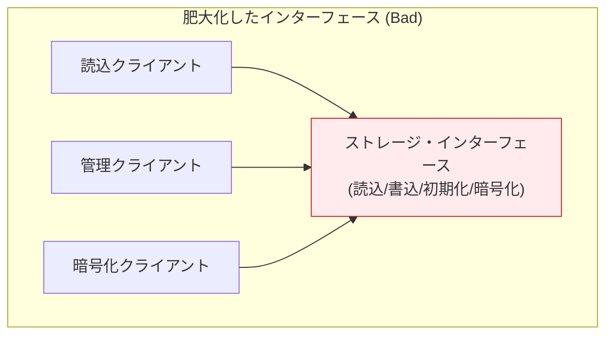
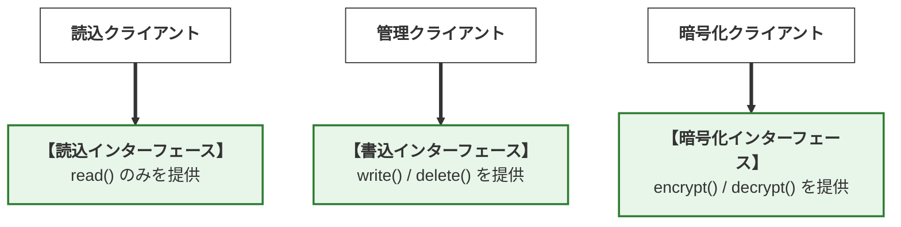
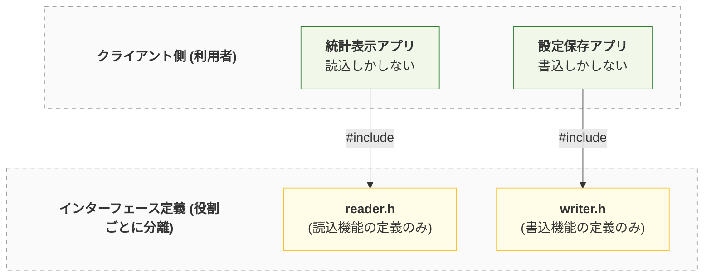
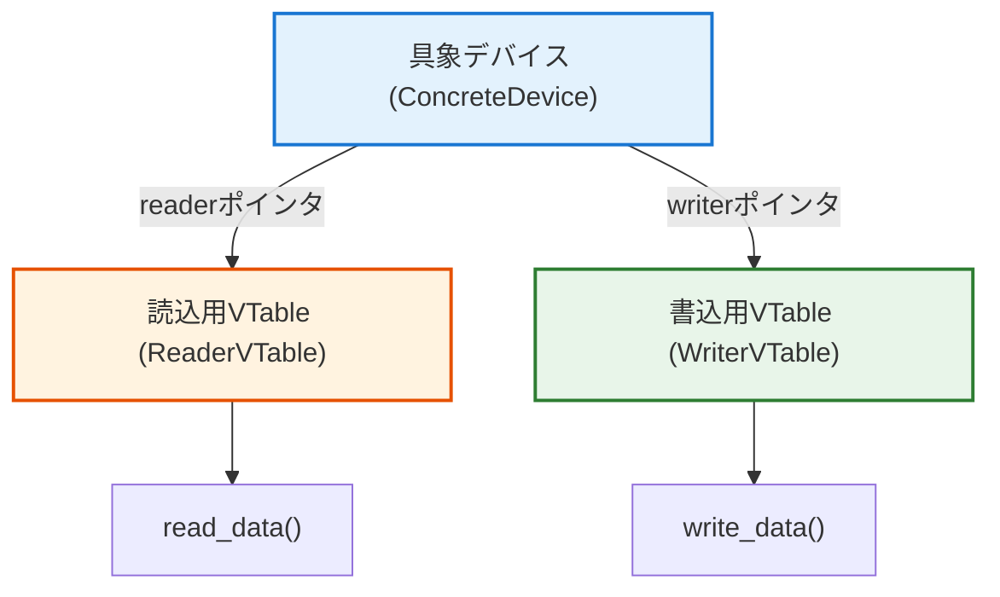
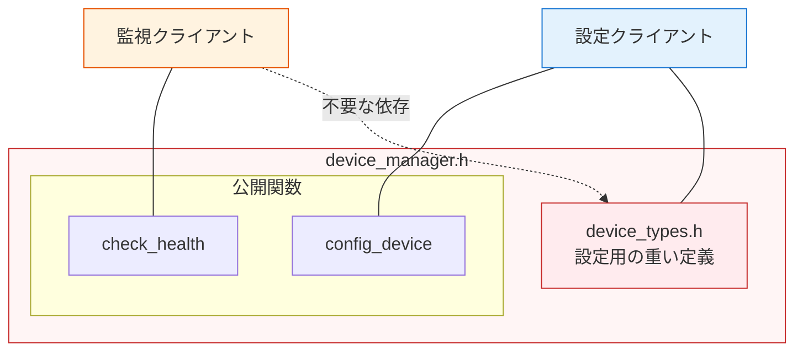
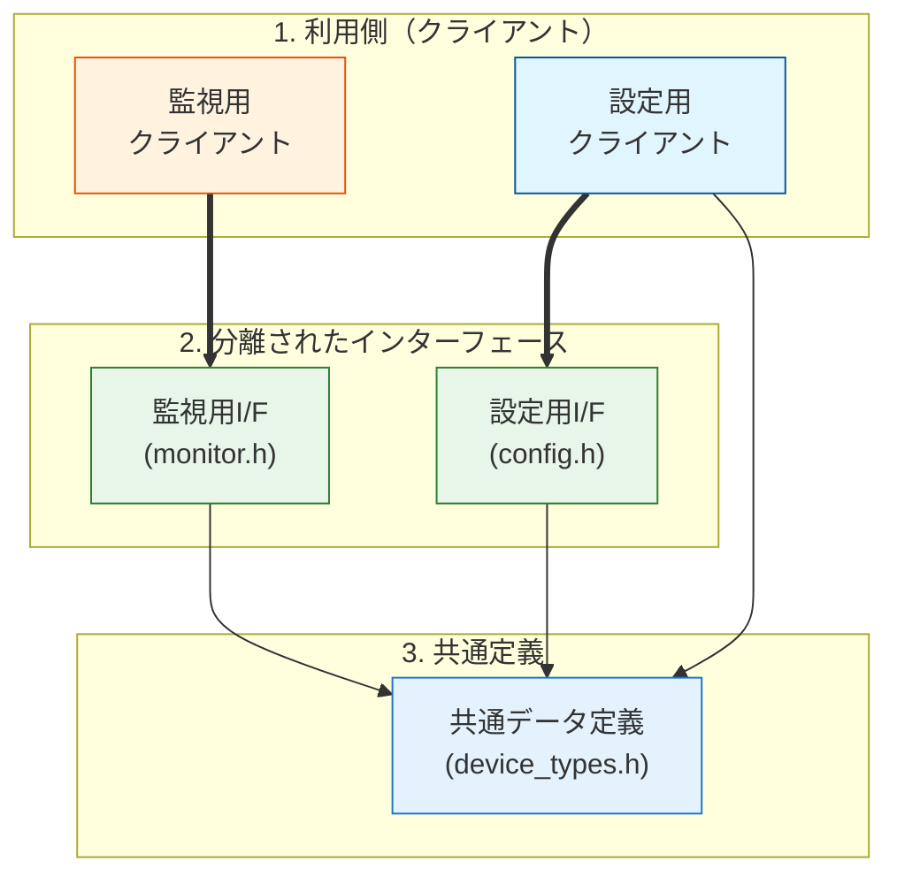
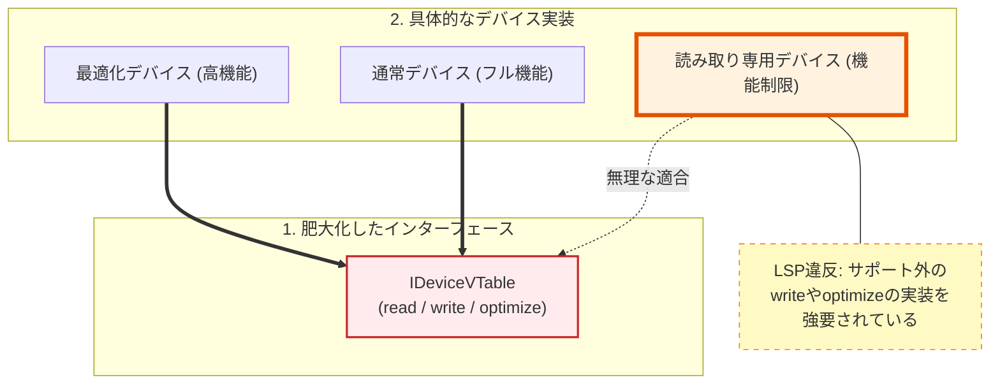
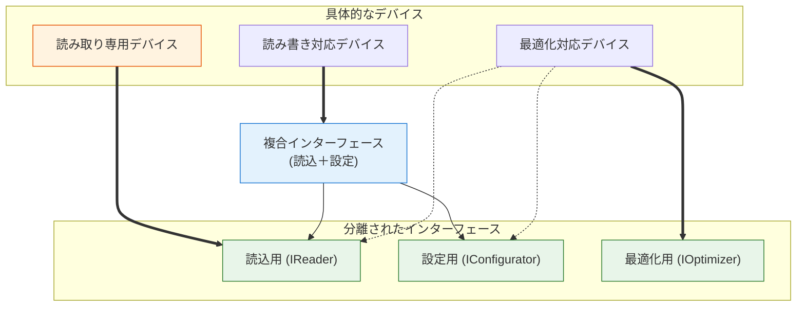

# 第2部 第11章 インターフェース分離原則 (ISP): 不要な依存の排除とモジュール結合度の最小化


本章の主題は、設計の三本柱のうち **「契約」** の柱であり、同時に **「依存」** にも深く関わっています。インターフェース分離原則 (ISP) を適用することで、クライアントが必要とする **「利用法」** の契約だけを提供し、不要な依存を断ち切ることで、 **変更容易性** を飛躍的に高めます。

## 1. 原則の哲学と本質

本原則は、 **『契約』** を最小化することで不要な **『依存』** を削ぎ落とします。

### 1.1. ISPの本質は「スリムな契約」と「依存のコスト」

 **「クライアントに、自身が使用しないインターフェースへの依存を強制してはなりません」。**
ISPの目標は、インターフェースを小さく、 **特定のクライアントのニーズに特化** させることです。これにより、一つの機能の変更が、その機能を使用しないクライアントにまで影響を及ぼすという、 **依存の汚染** を食い止めます。

#### 依存のコスト：なぜ「太ったインターフェース」は悪なのか

『太ったインターフェース』とは、クライアントが実際には使わない関数まで含む、過剰に大きなインターフェースを指します。例えば、読み取り専用のクライアントに対して、書き込み関数まで含むインターフェースを強制するような設計です。

この肥大化が、不要な依存とコンパイル時間の増大を招きます。

#### 肥大化したインターフェースの問題点

すべてのクライアントが、一つの巨大なインターフェースに依存している状態（アンチパターン）です。不必要な依存 ** : 例えば「読込クライアント」は、暗号化機能が変更されただけでも影響を受けてしまいます。

これが「依存の汚染」です。複数のクライアントから一点（IF_All）に集中する矢印。



#### 分離されたインターフェース（理想形）

ISPを適用し、役割ごとにインターフェースを分割した状態です。 

 **依存の限定** : 各クライアントは自分に必要な「契約」だけを知っています。 

 **影響の遮断** : 暗号化機能の変更は、読込クライアントには一切影響しません。垂直方向に独立した3つのレーン。



ISPが解決しようとしているのは、インターフェースに「あれもこれも」詰め込んだ結果発生する、以下の2つの深刻なコストです。

####  **物理的依存（コンパイル・ビルドの爆発）** 

####  **具体的な問題** 

`storage_interface.h` という巨大なヘッダに `read`, `write`, `format`, `encrypt` など、あらゆる操作が定義されているとします。たとえクライアントAが `read` しか使わなくても、`encrypt` の引数の型が変更されただけで、クライアントAを含めた **全ての依存モジュールが再コンパイル対象** となります。

####  **なぜ問題か** 

大規模プロジェクトにおいて、これはビルド時間の増大を招くだけでなく、バイナリサイズの変化や予期せぬリンクエラーのリスクを生みます。「触っていない場所のせいでビルドが通らない」という状況は、開発サイクルを著しく停滞させます。

####  **概念的依存（設計の歪みとLSP違反）** 

####  **具体的な問題** 

「読み取り専用デバイス」の具象クラスを作ろうとした際、インターフェースに `write` メソッドが存在すると、中身が空の関数や `return E_NOT_SUPPORTED;` を返すだけの **「嘘の実装」** を強いられます。

####  **なぜ問題か** 

インターフェースを分けないまま「できないこと」を強いる設計は、前章で学んだ **リスコフ置換原則 (LSP) への明白な違反** を誘発します。利用者は「契約（インターフェース）にあるのだから当然呼べるはずだ」と期待しますが、実際には実行時にエラーが返る。

この「期待と実態の乖離」こそが設計を不安定にする正体です。

## 2. C言語での実現手段と設計要素

C言語におけるISPの実現は、 **ヘッダファイル** の分割と **VTable（関数ポインタ構造体）** の設計が核となります。

### C言語でのISP実現の本質：物理と論理の切り離し

C言語でISPを徹底する場合、以下の2段階の分離を追求します。

#### 物理的な分離（ヘッダ・インクルードの最小化）

C言語では `#include` が依存のすべてを決定します。

#### インクルード関係の最適化

ヘッダファイルを「役割」ごとに分割し、クライアントが不要な情報を読み込まないようにする物理的な構成です。 **必要なものだけ** : `ReaderUser` は `reader.h` しか知りません。

`writer.h` の変更による再コンパイルは発生しません。



#### **何が問題か**

一つの構造体定義の中に、複数の役割の関数ポインタを混在させることです。これにより、特定の役割しか必要としないソースファイルに、不要な型情報（不必要な構造体や列挙型）が流入します。

#### **解決策**

 **前方宣言** と **不完全型** を駆使し、クライアントには「自分が見るべき型」のポインタだけを渡します。ヘッダファイルを `reader.h`, `writer.h` のように役割ごとに分割し、クライアントが必要な最小限の定義のみをインクルードするように設計します。

#### 論理的な分離（VTableのコンポジション）

多態性を実現するVTable（関数ポインタ構造体）の設計が重要です。

#### VTableのコンポジション構造

具象デバイス（Device）が、複数の小さなVTable（Reader, Writer）を保持（コンポジション）する構造です。 **機能の委譲** : 巨大な一つのVTableを持つのではなく、機能ごとにポインタを持ちます。

これにより、`read` 機能を持たないデバイスは `reader` ポインタを持たない（または公開しない）という選択が可能になります。



#### **何が問題か**

`Storage_VTable` という一つの大きな構造体にすべての関数ポインタを詰め込むことです。これでは、具象実装（ドライバ等）は、サポートしていない機能であっても、その構造体の全メンバを埋めなければ（あるいはNULLにしなければ）ならなくなります。

#### **解決策**

VTableを `ReadCapability`, `WriteCapability` といった **小さな単位の構造体** に分割します。具象オブジェクトは、これらの小さな構造体を **コンポジション（複合）** することで、自分ができること（契約）だけを公開します。

これにより、C言語特有の「構造体の密結合」を回避し、モジュール間の境界線を明確に引くことが可能になります。

## 3. 実践パターン：ISPを実現する三つの型

### 3.1. 実践パターン1：物理的なヘッダ依存の分離

#### **目的**

モジュールが持つ複数の役割を「ヘッダファイル単位」で分割し、特定の機能しか使わないクライアントを、無関係な変更による再コンパイルから保護します。

#### ❌ 原則適用前：一つの「太ったヘッダ」が招く連鎖反応

まず、一つのヘッダファイルに複数の役割が混在しているケースを見てみましょう。ここには、デバイスの状態を監視する **Monitor（監視）** の機能と、詳細な設定を行う **Configurator（設定）** の機能が同居しています。

#### 違反時の依存関係

`device_manager.h` が肥大化し、クライアントが必要のない情報（`device_types.h`）にまで間接的に依存してしまっている状態です。 **不要な依存** : 監視クライアント（M）は設定定義（DT）を必要としませんが、ヘッダが統合されているため強制的に読み込まされます。



####  **device_manager.h(ISP違反：役割が混在したヘッダ)** 

このヘッダファイルでは、設定機能用の重い型定義（`device_types.h`）と、監視機能用のAPI、設定機能用のAPIがすべて一箇所にまとめられています。これにより、監視機能しか使わないクライアントも、設定機能の変更の影響を受けてしまいます。

複数の役割が1つのヘッダに混在している設計です。不要な型定義までインクルードされるため、モジュール間の結合度が不必要に高まっています。

#### device_manager.h
```c
#ifndef DEVICE_MANAGER_H
#define DEVICE_MANAGER_H

/* * 設定に必要な詳細な定義。
 * 監視しかしないクライアントには本来不要な依存。
 */
#include "device_types.h"
// --- Configurator（設定担当）用のインターフェース ---
int device_manager_config_device(const DeviceConfig* config);
// --- Monitor（監視担当）用のインターフェース ---
int device_manager_check_health(void);
#endif
```

####  **この設計の何が「罪」なのか** 

もし将来、デバイスの設定項目が増えて `device_types.h` が一行でも修正されたらどうなるでしょうか？設定機能には一切関心がない「監視担当」のプログラムまで、「お前の依存先が変わったから」という理由で再コンパイルを強制されます。
大規模なシステムでは、この「不要な連鎖」がビルド時間を爆発させる元凶となります。

#### ✅ 原則適用後：役割ごとに「契約」を切り分ける

ISPを適用し、インターフェースを役割ごとに物理的に分割します。クライアントが「知るべきこと」だけを定義したスリムなヘッダを提供します。

#### 分離後の依存関係

インターフェースを物理的に分割し、各クライアントが自分に必要なヘッダファイルのみをインクルードしている状態です。 **明確な分離** : `monitor.h` は `device_types.h` を知りません。

 **安全な変更** : `device_types.h` を変更しても、影響を受けるのは設定クライアントだけで、監視クライアントは無傷です。



####  **device_types.h(共通定義)** 

設定機能で必要となる詳細なデータ構造を定義します。これは設定機能を利用するクライアントだけがインクルードすべきものです。

モジュールの公開インターフェース定義を行います。実装詳細を隠蔽し、外部には必要な契約（API）のみを公開することで、結合度を下げます。

インターフェースと実装が分離され、高い保守性が確保されています。

#### device_types.h
```c
#ifndef DEVICE_TYPES_H
#define DEVICE_TYPES_H
// 設定機能でのみ使用される重い定義
typedef struct {
    int ip_address;
    int port;
    char hostname[256];
    // その他多数の設定項目
} DeviceConfig;
#endif
```

####  **device_monitor.h(監視専用のヘッダ)** 

監視機能に必要なAPIのみを定義したヘッダファイルです。`device_types.h` への依存を排除しているため、非常に軽量で変更の影響を受けにくい設計になっています。

モジュールの公開インターフェース定義を行います。実装詳細を隠蔽し、外部には必要な契約（API）のみを公開することで、結合度を下げます。

インターフェースと実装が分離され、高い保守性が確保されています。

#### device_monitor.h
```c
#ifndef DEVICE_MONITOR_H
#define DEVICE_MONITOR_H

/* * 【ISP適用】
 * 不要な "device_types.h" のインクルードを排除。
 * 監視に必要な最小限のプロトタイプ宣言のみを公開。
 */
int device_manager_check_health(void);
#endif
```

####  **device_configurator.h(設定専用のヘッダ)** 

設定機能に必要なAPIを定義します。ここでは `DeviceConfig` 構造体を使用するため、`device_types.h` をインクルードします。

モジュールの公開インターフェース定義を行います。実装詳細を隠蔽し、外部には必要な契約（API）のみを公開することで、結合度を下げます。

インターフェースと実装が分離され、高い保守性が確保されています。

#### device_configurator.h
```c
#ifndef DEVICE_CONFIGURATOR_H
#define DEVICE_CONFIGURATOR_H
#include "device_types.h" // 設定機能に必要な型定義のみここで読み込む

int device_manager_config_device(const DeviceConfig* config);
#endif
```

####  **device_manager.c(実装)** 

実装ファイルでは、分割されたすべてのヘッダをインクルードし、それぞれの機能を実装します。外部に対しては別々の顔（インターフェース）を見せつつ、内部では統合されたロジックを持つことができます。

ヘッダで定義されたインターフェースの具体的な実装を行います。内部データや詳細ロジックをこのファイル内に閉じ込め（カプセル化）、外部からの直接アクセスを防ぎます。

変更が発生しても、このファイル内のみに影響を留めることができます。

#### device_manager.c
```c
#include "device_monitor.h"
#include "device_configurator.h"
#include <stdio.h>

int device_manager_check_health(void) {
    // 実際の実装

    return 0; // OK
}

int device_manager_config_device(const DeviceConfig* config) {
    if (!config) return -1;
    printf("Configuring device: %s\n", config->hostname);

    return 0;
}
```

####  **Client_Monitor.c(監視機能を利用する側)** 

監視クライアントの実装です。`device_monitor.h` のみをインクルードしているため、設定機能に関する変更の影響を一切受けません。

公開された特定のインターフェースのみをインクルードし、必要な機能だけを利用するクライアントコードです。内部事情に関心を持たず、契約のみに依存することで変更の影響を受けにくくなっています。

#### Client_Monitor.c
```c
#include <stdio.h>
#include "device_monitor.h" // 必要な契約だけをインクルード

int main(void) {
    // 設計の意図:
    // このファイルは "device_types.h" の存在を一切知らない。
    // 設定機能側にどれほど変更があっても、このファイルが再ビルドされることはない。
    if (device_manager_check_health() != 0) {
        printf("[Monitor] Health check failed.\n");
    } else {
        printf("[Monitor] System is healthy.\n");
    }

    return 0;
}
```

#### 設計のポイント：物理的な壁を作る

この分離により、`device_manager.c`（実装側）が複数の役割を持っていても、 **クライアントからは特定の側面しか見えない** という状態を作ることができました。-  **変更の局所化** : 設定機能の変更が監視機能に波及しない。
-  **ビルドの高速化** : 不要なヘッダの読み込みと解析がスキップされる。
-  **認知的負荷の低減** : クライアントの開発者は、膨大な設定パラメータを理解しなくても、単一の関数だけを見て実装に集中できる。

### 3.2. 実践パターン2：VTableの役割分離とCompositionの徹底

実践パターン1では「ヘッダファイル」による物理的な分離を学びました。しかし、第2章および第4章で解説した **VTable（関数ポインタ構造体）** そのものが肥大化している場合、別の深刻な問題が発生します。

ここでは、VTableを役割ごとに細かく分断し、 **Composition（複合）** によって再構成する手法を解説します。

#### ❌ 原則適用前：一つの「太ったVTable」が招く実装の強制

まず、多態性を実現するために「あらゆる操作」を一箇所にまとめたVTableの例を見てみましょう。このVTableには、読み取り、設定、最適化といった性質の異なる操作が混在しています。

#### 違反時のVTable構造

一つの `IDeviceVTable` にすべての機能が詰め込まれているため、一部の機能しかサポートしないデバイス（読み取り専用など）が、不要な契約を強制されている状態です。 

 **LSP違反の誘発** : 読み取り専用デバイス（RO）は、`write` 機能を実装できないにもかかわらず、VTableの構造上、そのスロットを埋めなければなりません。



####  **idevice_rw_config.h(ISP違反：巨大なインターフェース)** 

すべての機能（読み取り、書き込み、最適化）を一つの構造体にまとめてしまっています。これにより、すべてのデバイス実装がこれら全機能の実装を強制されます。

複数の異なる性質の機能を1つのVTableに詰め込んでしまった設計です。この設計は、特定の機能しか必要としないデバイスに対しても、関係のないメソッドの実装を強いてしまいます。

#### idevice_rw_config.h
```c
// すべての機能を詰め込んだVTable
typedef struct {
    int (*read_data)(void* self);
    int (*write_config)(void* self); // 読み取り専用デバイスには「不要な契約」
    int (*optimize_db)(void* self);  // 特定のデバイスにしか関係ない契約
} IDeviceVTable;
```

####  **ReadOnlyDevice.c(ISP違反による「嘘」の実装)** 

読み取り専用デバイスの実装です。書き込み機能はサポートしていないにもかかわらず、インターフェースを満たすためにダミーの関数（エラーを返すだけの実装）を用意しなければなりません。

これはLSP違反の温床となります。サポートしていない機能まで実装を強制されている「ISP違反」の例です。本来「読み取り専用」であるにもかかわらず、インターフェース側の制約により「書き込み」の実装を強いられています。これはLSP違反の直接的な原因となります。

#### ReadOnlyDevice.c
```c
// 読み取り専用デバイスの実装
static int read_only_read_data(void* self) {
    // 実際の読み取り処理
    return 0;
}

static int read_only_write_config(void* self) {
    /* * 【LSP違反の予兆】
     * 契約上は存在するが、実装できないためエラーを返すしかない。
     * これにより、利用者は実行してみるまで成功するか分からない不安定な状態になる。
     */
    return -1; // "Not Supported"
}
static IDeviceVTable readonly_vtable = {
    .read_data = read_only_read_data,
    .write_config = read_only_write_config, // 無理やり埋める必要がある
    .optimize_db = NULL                     // あるいはNULLで濁すしかない
};
```

####  **この設計の何が「罪」なのか** 

これは「具象は抽象の契約を完全に履行しなければならない」という **リスコフ置換原則 (LSP)** への違反を誘発します。不必要なメソッドの実装を強いることは、コードの可読性を下げるだけでなく、「そのオブジェクトで何ができるのか」という定義を曖昧にするのです。

#### ✅ 原則適用後：VTableの細分化とComposition

ISPを適用し、VTableを「役割」ごとに最小単位まで分割します。そして、複数の役割を必要とする場合にのみ、それらを組み合わせて（Composition）一つのインターフェースとして定義します。

#### 理想的なコンポジション構造

インターフェースを機能（Reader, Configurator, Optimizer）ごとに細分化し、具象デバイスが必要な機能だけを組み合わせて（Composition）実装している状態です。 **柔軟な結合** : `COMP`（複合インターフェース）は、読込と設定が必要な場合のみ作られます。

 **嘘のない実装** : 読み取り専用デバイス（RO）は `VR`（Reader）だけと契約しており、書込機能を実装する必要がありません。



####  **idevice_reader.h(最小単位の役割)** 

読み取り機能のみを定義した最小のインターフェースです。モジュールの公開インターフェース定義を行います。

実装詳細を隠蔽し、外部には必要な契約（API）のみを公開することで、結合度を下げます。インターフェースと実装が分離され、高い保守性が確保されています。

#### idevice_reader.h
```c
#ifndef IDEVICE_READER_H
#define IDEVICE_READER_H

typedef struct {
    int (*read_data)(void* self);
} IReaderVTable;
#endif
```

####  **idevice_configurator.h(最小単位の役割)** 

書き込み（設定）機能のみを定義した最小のインターフェースです。モジュールの公開インターフェース定義を行います。

実装詳細を隠蔽し、外部には必要な契約（API）のみを公開することで、結合度を下げます。インターフェースと実装が分離され、高い保守性が確保されています。

#### idevice_configurator.h
```c
#ifndef IDEVICE_CONFIGURATOR_H
#define IDEVICE_CONFIGURATOR_H

typedef struct {
    int (*write_config)(void* self);
} IConfiguratorVTable;
#endif
```

####  **idevice_optimizer.h(最小単位の役割)** 

最適化機能のみを定義した最小のインターフェースです。モジュールの公開インターフェース定義を行います。

実装詳細を隠蔽し、外部には必要な契約（API）のみを公開することで、結合度を下げます。インターフェースと実装が分離され、高い保守性が確保されています。

#### idevice_optimizer.h
```c
#ifndef IDEVICE_OPTIMIZER_H
#define IDEVICE_OPTIMIZER_H

typedef struct {
    int (*optimize_db)(void* self);
} IOptimizerVTable;
#endif
```

####  **IDeviceRWC.h(役割の組み合わせ)** 

複数の役割を持つデバイスのために、必要なインターフェースを組み合わせた複合構造体を定義します。これにより、クライアントは必要な機能セットを一括して扱うことができます。

モジュールの公開インターフェース定義を行います。実装詳細を隠蔽し、外部には必要な契約（API）のみを公開することで、結合度を下げます。

インターフェースと実装が分離され、高い保守性が確保されています。

#### IDeviceRWC.h
```c
#ifndef IDEVICE_RWC_H
#define IDEVICE_RWC_H
#include "idevice_reader.h"
#include "idevice_configurator.h"
// 役割を統合するコンポジット構造体
// タグ名を与えることで前方宣言が可能になり、不完全型として扱えるようにします。
typedef struct IDeviceRWC {
    void* self;                     // 具象データへの不透明ポインタ（第4章の応用）
    const IReaderVTable* reader;    // 読込契約への参照
    const IConfiguratorVTable* config; // 設定契約への参照
} IDeviceRWC;
#endif
```

####  **ReadOnlyDevice.c(読み取り専用デバイスの実装)** 

読み取り専用デバイスの実装です。`IReaderVTable` のみを実装すればよく、書き込み機能に関する記述は一切不要になります。

ヘッダで定義されたインターフェースの具体的な実装を行います。内部データや詳細ロジックをこのファイル内に閉じ込め（カプセル化）、外部からの直接アクセスを防ぎます。

変更が発生しても、このファイル内のみに影響を留めることができます。

#### ReadOnlyDevice.c
```c
#include "idevice_reader.h"
#include <stdio.h>
static int readonly_read_data(void* self) {
    // コンパイラの未使用警告を抑制（実務では self を使用してデータを読み込む）
    (void)self;
    printf("[ReadOnlyDevice] Reading data...\n");

    return 0;
}
// 読み取り専用デバイスは IReaderVTable のみを実装
static const IReaderVTable readonly_vtable = {
    .read_data = readonly_read_data
};
// コンポジションのためのファクトリ
// ここでは簡易的に、readerのみを持つコンポジット構造体を返す例を示す
// ※本来は専用の構造体(IDeviceReadOnly)を用意するか、NULL許容設計にする
const IReaderVTable* get_readonly_vtable(void) {
    return &readonly_vtable;
}
// write_config や optimize_db の実装は一切不要！
```

####  **Client_Updater.c(利用側)** 

複合インターフェースを利用するクライアントコードです。デバイスが提供する各機能（Reader, Configurator）に対して、適切にアクセスしています。

公開された特定のインターフェースのみをインクルードし、必要な機能だけを利用するクライアントコードです。不必要な依存を排除したことで、保守性が向上しています。

#### Client_Updater.c
```c
#include "IDeviceRWC.h"
#include <stdio.h>
#include <stdlib.h>
// ダミー実装（コンパイルを通すため）
static int dummy_read(void* s) { (void)s; printf("Read OK\n"); return 0; }
static int dummy_write(void* s) { (void)s; printf("Write OK\n"); return 0; }
static const IReaderVTable r_vt = { .read_data = dummy_read };
static const IConfiguratorVTable c_vt = { .write_config = dummy_write };

void firmware_update_process(IDeviceRWC* device) {
    if (!device || !device->reader || !device->config) return;
    /* 各VTableの関数に対し、共通の self を渡すことで多態性を実現 */
    printf("--- Firmware Update Process ---\n");

    if (device->reader->read_data(device->self) != 0) {
        printf("Read failed\n");

        return;
    }

    if (device->config->write_config(device->self) != 0) {
        printf("Config write failed\n");

        return;
    }
}
```

#### Client_Updater.c (メイン関数)

`firmware_update_process` を呼び出すためのエントリーポイント(`main`)です。必要な機能(`IReader`, `IConfigurator`)の実装をコンポジションし、オブジェクトとして渡しています。

クライアントは「自分が必要な機能」だけを持つオブジェクトを生成・利用できています。

#### Client_Updater.c
```c
int main(void) {
    // 擬似的なデバイス生成（本来はFactoryで行う）
    IDeviceRWC my_device = {
        .self = NULL,
        .reader = &r_vt,
        .config = &c_vt
    };
    firmware_update_process(&my_device);

    return 0;
}
```

#### 設計のポイント：具象を「型」の制約から解放する

この設計により、読み取り専用デバイスは `IReaderVTable` だけを実装すればよくなります。

-  **契約の誠実さ** : 具象クラスは「できること」だけを表明すればよく、ダミー実装が不要になる。
-  **利用側の安全性** : クライアントは、そのオブジェクトが確実に提供している機能（役割）だけを叩くことができる。
-  **拡張性** : 将来的に「最適化機能」を追加する場合も、既存の `IReader` や `IConfigurator` に触れることなく、新しい役割（VTable）を追加するだけで済みます。
