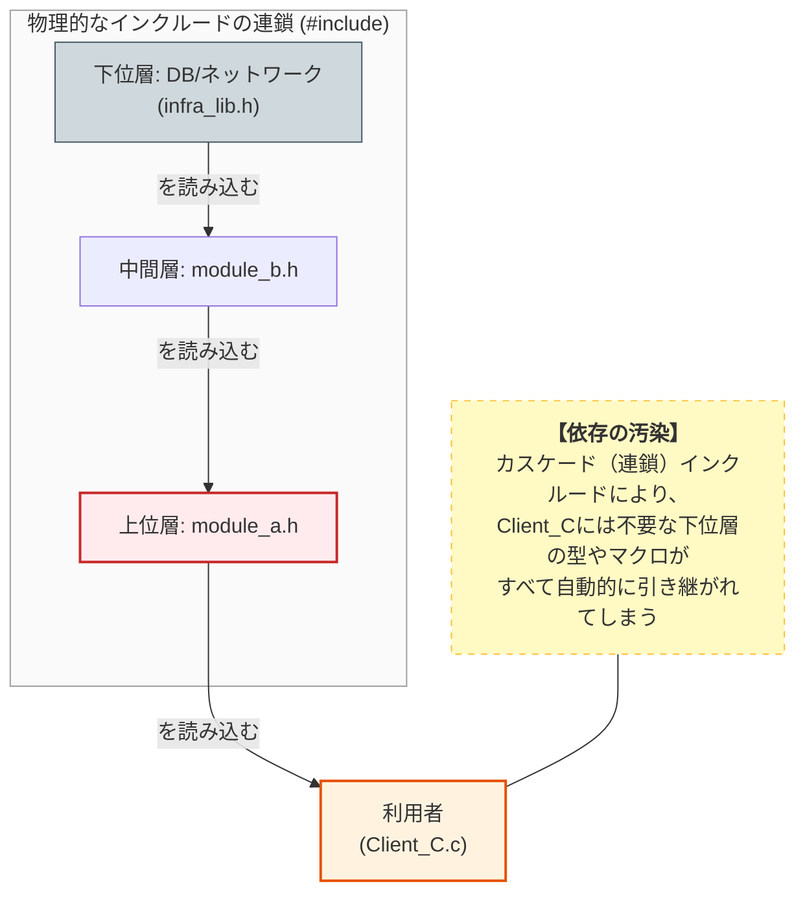
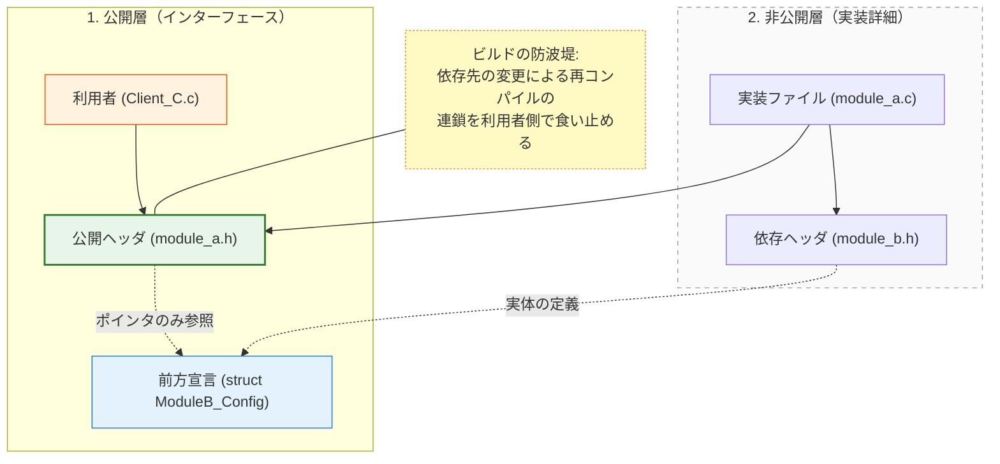
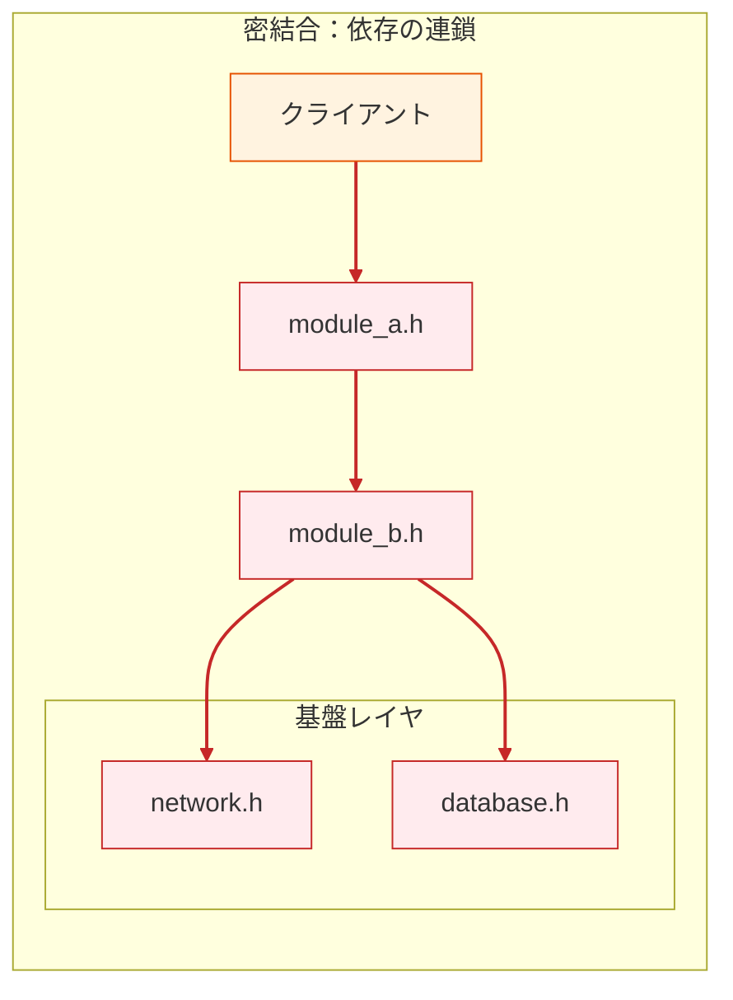
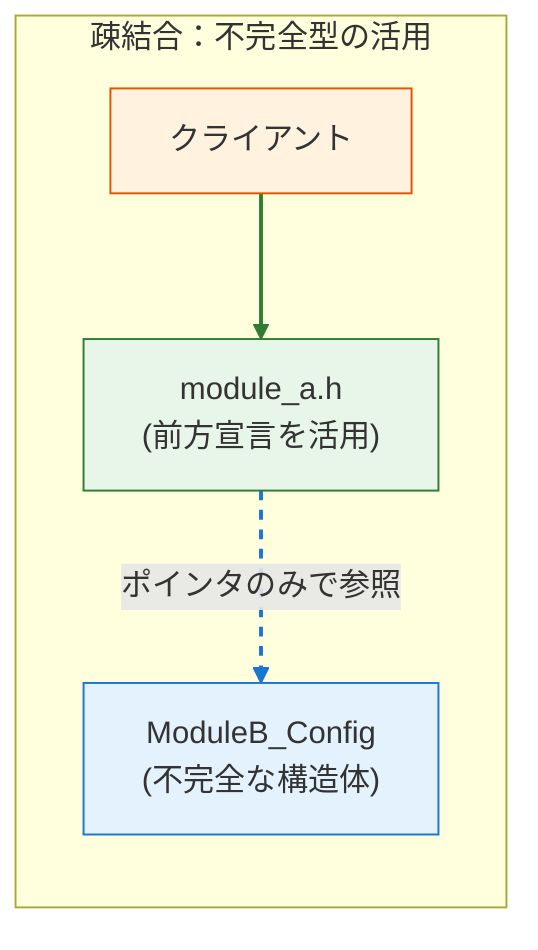

### 3.3. 実践パターン3：前方宣言によるコンパイル依存の断絶

実践パターン1と2では「何を公開するか」を制限しました。このパターン3では、一歩進んで **「何を知らなくて済むか」** を制御します。
C言語において、不必要なヘッダのインクルードを避けることは、ISPの「不要な依存の排除」を物理レベルで達成する極めて重要な手段です。

#### **目的**

ヘッダファイルが引き連れてくる **間接的な依存** を最小限に抑え、モジュールの変更がシステム全体に波及する「コンパイルの連鎖」を阻止します。

#### ❌ 原則適用前：不必要な `#include` が招く「依存の汚染」

まず、構造体のポインタを扱うためだけに、その構造体が定義されているヘッダ全体をインクルードしてしまっているケースです。

#### 汚染のメカニズム

`#include` が連鎖することで、本来関係のない最下層の定義（DB/Network）が、最上位の利用者（Client）まで流れ込んでしまう様子です。 

 **カスケード（連鎖）** : `module_a.h` を使うだけの利用者が、間接的に `infra_lib.h` に依存してしまっています。

これが「依存の汚染」です。



#### module_b.h (他のヘッダを多数インクルード)

ネットワークやデータベースの定義を含む「重い」ヘッダファイルの例です。`Network` や `Database` などの重い構造体を保持する設定構造体を定義しています。

**（悪い例）** 関連する設定を一つにまとめようとしていますが、依存関係まで巻き込んでいます。これを1つインクルードするだけで、無関係な巨大な依存ツリーが取り込まれてしまいます。

#### module_b.h
```c
#ifndef MODULE_B_H
#define MODULE_B_H
#include <stdbool.h>
#include "network.h"   // ネットワーク関連の定義
#include "database.h"  // データベース関連の定義

typedef struct {
    NetworkConfig net_config;
    DatabaseConfig db_config;
    /* その他の設定メンバ */
    int buffer_size;
    int timeout_ms;
    bool is_active;
} ModuleB_Config;
#endif
```

#### module_a.h (ISP違反：過剰なインクルード)

`ModuleB` に依存する上位モジュールの定義です。`ModuleB_Config` へのポインタを持つ構造体を定義しています。
（悪い例）型を知るために安易に `#include "module_b.h"` を行っています。ポインタしか使わないのに完全な定義を取り込むことで、不必要な依存の連鎖を生んでいます。

#### module_a.h
```c
#ifndef MODULE_A_H
#define MODULE_A_H
#include "module_b.h" // 【問題】ポインタ利用だけなのに、Bの全定義を取り込んでいる

typedef struct {
/* * 構造体へのポインタを保持するだけ。
* しかし、上記の include により、module_b.h が修正されるたびに
* module_a.h を使う全モジュールが再ビルド対象になる。
*/
ModuleB_Config* config_ptr;
} ModuleA_Data;
#endif
```

#### Client_C.c (利用側)

`module_a` を利用するクライアントコードです。`module_a.h` をインクルードして `ModuleA_Data` を使用します。
単に `module_a` の機能を使いたいだけです。`module_a` 経由で `network` や `database` の定義まで強制的に読み込まれ、ビルド時間が肥大化します。

#### Client_C.c
```c
#include "module_a.h"

int main(void) {
    // この時点で network.h と database.h の定義が
    // 全て読み込まれている（不要なのに！）
    ModuleA_Data data;

    return 0;
}
```

#### **この設計の何が「罪」なのか**

もし `module_b.h` が、さらに `network.h` や `database.h` をインクルードしていたらどうなるでしょうか。`module_a.h` を使うだけのクライアントCは、 **全く関係のないネットワークやDBの設定まで読み込まされる** ことになります。

これを「依存の汚染」と呼び、ビルド速度を低下させるだけでなく、名前の衝突（シンボル重複）のリスクまで高めてしまいます。

#### ✅ 原則適用後：前方宣言（不完全型）による物理的断絶

ISPの精神に基づき、「必要最小限の型情報」だけを提示します。具体的には「詳細（構造体の中身）は知らないが、その名前の構造体が存在することだけは知っている」という **前方宣言（Forward Declaration）** を活用します。

#### 防波堤の構築

前方宣言（不完全型）を利用して、インクルードの連鎖を物理的に断ち切る構造です。 `module_a.h` が前方宣言を使っているため、`module_b.h` の変更（およびその依存先）が `Client_C.c` に波及しません。



再コンパイルは発生しません。
- 実線: 物理的なインクルード  
- 点線: 参照のみ（コンパイル依存なし）

#### module_a.h (ISP準拠：依存を最小化したヘッダ)

依存を断ち切ったクリーンなヘッダ定義です。`struct ModuleB_Config;` という前方宣言のみを行い、インクルードを削除しています。

コンパイラには「ポインタである」という事実だけを伝え、詳細な型定義を隠蔽します。`module_b.h` の変更（およびその先の依存）が、このヘッダの利用者に波及するのを完全に防ぎます。

#### module_a.h
```c
#ifndef MODULE_A_H
#define MODULE_A_H

/* * 【ISP適用】
 * #include "module_b.h" を完全に削除。
 * 構造体の実体（不完全型）を宣言するだけで、ポインタの扱いは可能。
 */
struct ModuleB_Config;
typedef struct ModuleB_Config ModuleB_Config;
typedef struct {
    // コンパイラは「ポインタであること」さえ分かれば良いため、これで十分
    ModuleB_Config* config_ptr;
} ModuleA_Data;
// ポインタを受け取る関数のプロトタイプ宣言も問題なし
void module_a_set_config(ModuleA_Data* data, ModuleB_Config* config);
#endif
```

#### module_a.c (実装ファイルでのみ完全な定義を読み込む)

`module_a` の具体的な実装を行うファイルです。メンバアクセスが必要なため、ここで初めて `#include "module_b.h"` を行います。

依存を「ヘッダ（公開契約）」から「ソース（実装詳細）」へ移動させます。依存が実装内部に閉じ込められるため、外部への影響がなくなります。

#### module_a.c
```c
#include "module_a.h"
#include "module_b.h" // 実装ファイルでのみ、必要に応じて完全な定義を読み込む

void module_a_set_config(ModuleA_Data* data, ModuleB_Config* config) {
    // ここでは ModuleB_Config の中身にアクセスできる
    data->config_ptr = config;
}
```

#### Client_C.c (利用側)

改善された `module_a` を利用するクライアントコードです。`module_a.h` を利用して変数を定義します。

必要なインターフェースだけを利用し、裏側の複雑な依存を知らないままにします。`network` や `database` の変更による再コンパイルが一切発生せず、高速なビルドが維持されます。

#### Client_C.c
```c
#include "module_a.h"

int main(void) {
    /* * 設計の意図:
     * このファイルには "module_b.h" の情報は一切流れ込んでこない。
     * ModuleB_Config の中身がどれほど複雑に変更されても、
     * この Client_C.c のコンパイル結果には何の影響も与えない。
     */
    ModuleA_Data data;

    return 0;
}
```

#### 設計のポイント：インターフェースの「不透明性」を高める

この手法は、ISPにおける「不要な依存の排除」を最も低レイヤーで実現するものです。 

 **情報の隠蔽** : クライアントに対して、依存先（Module B）の内部構造を完全に隠すことができる。

 **ビルドのファイアウォール** : 構造体のメンバ追加や削除といった「内部変更」が、ヘッダを介してシステム全体へ伝播するのを食い止める「防波堤」として機能する。 

 **クリーンな名前空間** : 不要なマクロ定義や型定義がクライアント側に漏れ出すのを防ぎ、予期せぬコンパイルエラーを未然に防ぐ。

#### 依存構造のビフォーアフター

ISP適用前後の依存グラフの比較です。 

 **密結合（上）** : クライアントから基盤レイヤまで一本道でつながっており、変更の影響をまともに受けます。  
 **疎結合（下）** : 不完全型（点線）によって依存の矢印が断ち切られ、クライアントが保護されています。
赤いリンク: 危険な依存 緑のリンク: 安全な依存。




#### **前方宣言が有効な場面**

- ポインタや参照のみを扱う場合
- 関数の引数や戻り値として型を使用する場合
- 構造体のメンバとしてポインタを保持する場合。

#### **前方宣言が使えない場面**

- 構造体の実体（ポインタではなく値）をメンバとして持つ場合
- 構造体のサイズを知る必要がある場合（例：`sizeof` を使う）
- 構造体のメンバにアクセスする必要がある場合。

## 本章で必ず理解してほしいことのまとめ

### インターフェース分離原則 (ISP) の設計指針

#### 1.  **ISPの本質は「スリムな契約」と「不要な依存の排除」です** 

 **太ったインターフェース** はコンパイル依存の連鎖と **LSP違反** （使わない機能をダミー実装する）を誘発します。

#### 2.  **ヘッダファイルを役割ごとに分離する** （ **実践パターン1** ）

複数の役割を持つモジュールは、役割ごとに分割した **スリムなヘッダ** に切り分け、クライアントが最小限の契約のみに依存するようにします。これにより不要な再コンパイルを防ぎ、ビルド時間を短縮します。

#### 3.  **VTableを役割単位に分割し、Compositionで組み合わせる** （ **実践パターン2** ）

一つの巨大なVTableではなく、`IReaderVTable`, `IWriterVTable` のような小さな単位に分割します。具象実装は自分ができる役割のVTableのみを実装し、複数の役割が必要な場合はCompositionで組み合わせます。

これによりLSP違反を防ぎ、ダミー実装が不要になります。

#### 4.  **前方宣言と不完全型で物理的なコンパイル依存を断つ** （ **実践パターン3** ）

ポインタ操作のみが必要な具象型は、ヘッダファイルに **前方宣言** を用いることで、クライアントから具象型の内部レイアウトへの依存を完全に切り離し、間接的な依存の連鎖（依存の汚染）を防ぎます。

#### チェックリスト

本章の設計指針が正しく適用されているか、以下の項目でセルフチェックを行いましょう。

##### 1. 設計のセルフチェック（契約のスリム化）

 [ ] **役割の最小単位化** : 1つのインターフェース（VTableやヘッダ）に、異なる種類のアクター（変更要求者）が利用する関数が混在していないか？
 [ ]  **LSP違反の予兆検知** : 具象実装において「この関数はこのデバイスでは使わないので空実装にする」といった、インターフェースが太すぎるために発生する「嘘の実装」はないか？
 [ ]  **Compositionの検討** : 複数の機能が必要な場合、1つの巨大なインターフェースを作るのではなく、小さなインターフェースを組み合わせて（Composition）実現しているか？

##### 2. 実装のセルフチェック（物理的依存の排除）

 [ ]  **ヘッダの自己完結と分離** : クライアントが特定の機能を使うために、無関係な定義が大量に含まれた「太ったヘッダ」をインクルードせざるを得ない状況になっていないか？
 [ ]  **前方宣言の徹底** : 公開ヘッダにおいて、構造体のポインタのみで済む場所に `#include` を書いていないか？ (前方宣言で代用できないか？)
 [ ]  **推移的依存の排除** : `A.h` をインクルードしただけで、本来不要な `B.h`, `C.h` までインクルードされる「依存の汚染」が起きていないか？
 [ ]  **コンパイル時間の意識** : 1つの共通ヘッダを修正した際、無関係なモジュールまで大量に再コンパイルされる連鎖反応が起きていないか？

#### 次章への橋渡し

ISPの適用により、クライアントは必要最小限のヘッダだけをインクルードすればよくなりました。次章は [[16_第2部 第12章 依存性逆転原則（DIP）：抽象への依存とテスト容易性_01|第12章 依存性逆転原則 (Dependency Inversion Principle, DIP)]] です。

ISPで学んだ依存の分離が、どのようにしてシステム全体の柔軟な構造を作り出すのかを詳細に学びます。
