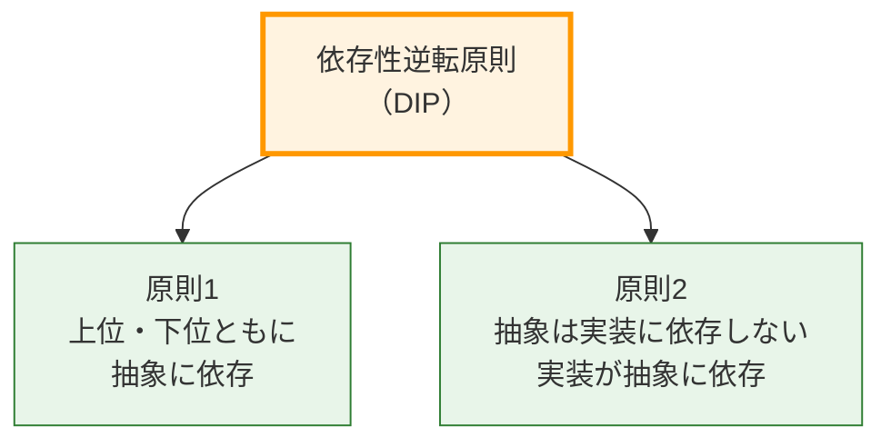
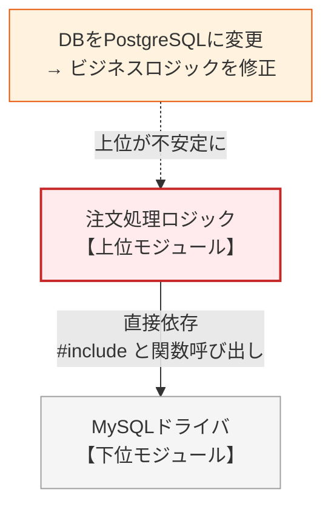
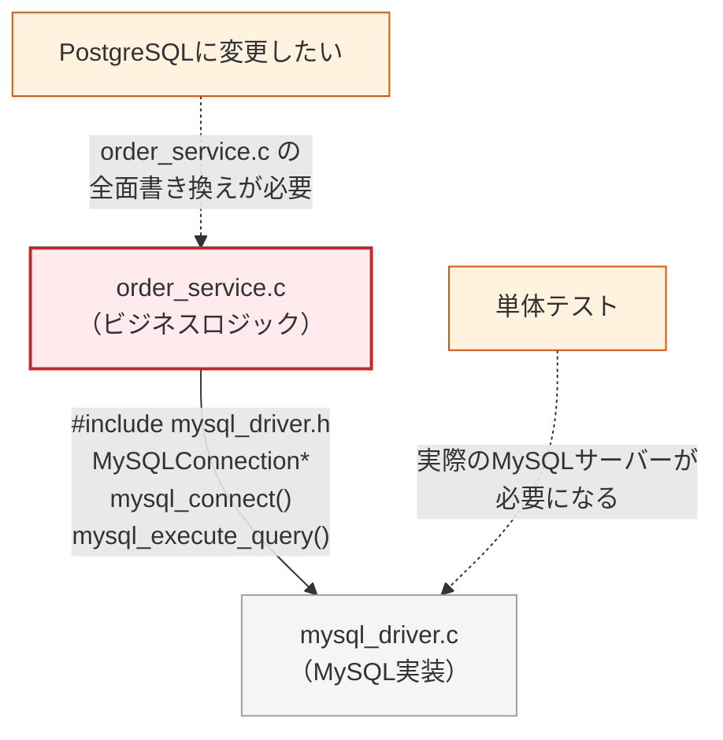
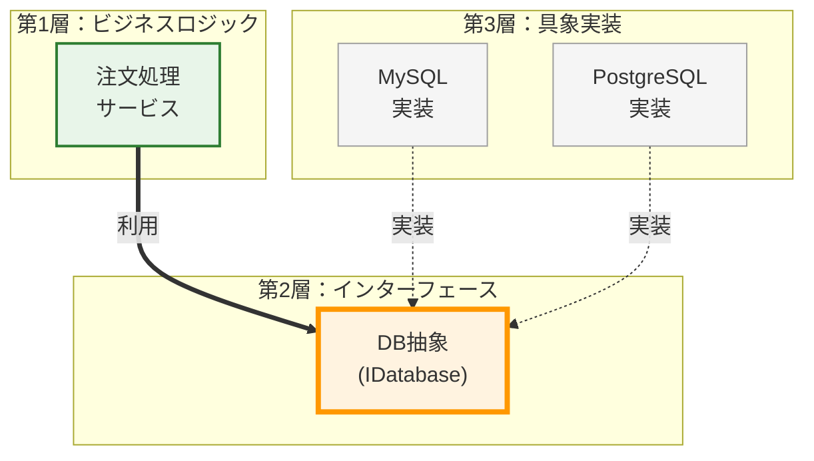
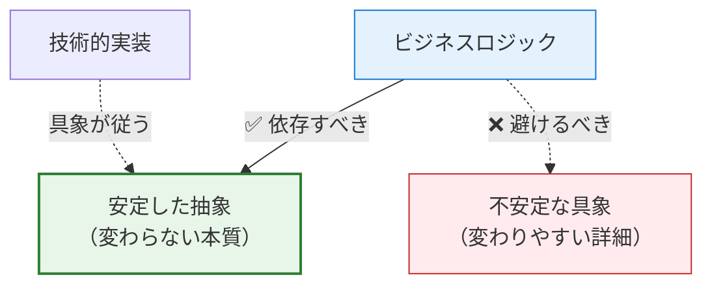
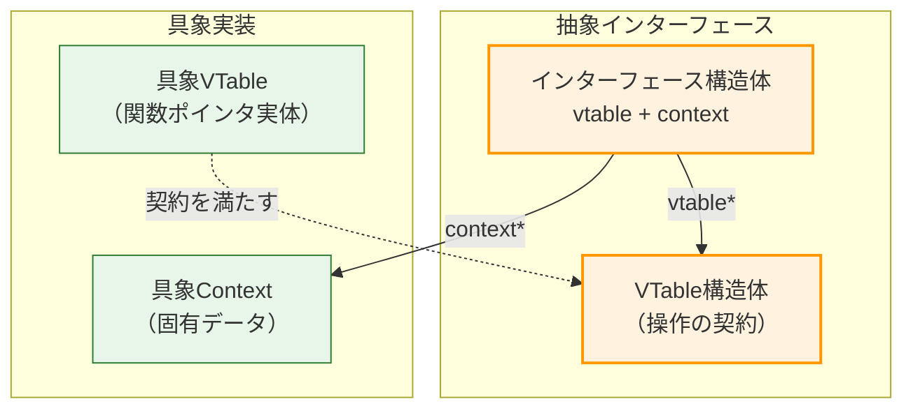
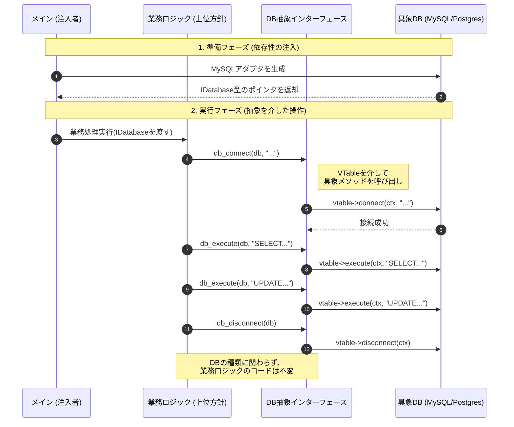

# 第2部 第12章 依存性逆転原則（DIP）：抽象への依存とテスト容易性
**依存性逆転原則（Dependency Inversion Principle：DIP）** は、SOLID原則の中で最もアーキテクチャの根幹に関わる原則です。モジュール間の結合度を下げ、システムを柔軟でテスト可能な状態に保つための、最も強力な設計原則の一つです。

本章では、第2章の関数ポインタ、第4章の不透明ポインタによる隠蔽、そして第9章のOCPを基盤に、C言語においてDIPをどのように実現し、どのように運用していくかを詳細に解説します。

## 1. 原則の哲学と本質

### 1.1. DIPの定義

#### DIPの二つのルール

DIPを構成する2つの柱です。 **上位も下位も、両方が「抽象」に向かって矢印を伸ばすべき（依存すべき）であるという点です。**

オレンジ色のDIPから派生する2つの緑のルール。



 **DIPの二つのルール** ：
1.  上位モジュールは下位モジュールに依存してはいけません。両者は抽象に依存すべきです。
2.  **抽象は実装の詳細に依存してはいけません。実装が抽象に依存すべきです。**

### 1.2. 「上位」と「下位」のジレンマ

#### ❌ 原則適用前：伝統的なトップダウン設計

上位モジュール（ビジネスロジック）が下位モジュール（具象実装）に直接依存する状態。

#### 伝統的な依存構造

典型的なレイヤードアーキテクチャでの依存関係です。

 **直接依存** : ビジネスロジックがMySQLという「詳細」に依存しています。

 **影響** : 下位（DB）の変更が上位（ビジネス）を破壊します。上から下への一方的な依存（変更の波及）です。



この構造には、以下の重大な問題点があります。
*  **技術的な詳細（MySQL）の変更が、ビジネスロジックの修正を強制する**
*  **上位モジュールが下位モジュールの変更に振り回される**
*  **テスト時に実際のDBを必要とする**　#### 原則適用前のコード例

それでは、DIPに違反した昔ながらの依存関係を見てみましょう。

まずは下位モジュール（具象実装）であるMySQLドライバのヘッダです。ここでは、`MySQLConnection` というガチガチの具象型と、`mysql_` というプレフィックスがついた専用の関数群が堂々と公開されています。

これを「契約」として上位モジュールに提示してしまうと、上位モジュールは「MySQLという特定のデータベース」の存在を知ってしまい、完全に縛り付けられることになります。

#### mysql_driver.h (具象への直接依存を強いるMySQL専用ヘッダ)
```c
#ifndef MYSQL_DRIVER_H
#define MYSQL_DRIVER_H
#include <stdbool.h>

/*
 * 【設計上の問題点】
 * 構造体の詳細がヘッダで露出しており、これを利用する側は
 * 物理的にも論理的にもこの具象実装に縛り付けられます。
 */
typedef struct {
    bool connected;
    char host[64];
} MySQLConnection;
// MySQL固有の関数群
MySQLConnection* mysql_create_connection(void);
bool mysql_connect(MySQLConnection* conn, const char* conn_str);
void mysql_execute_query(MySQLConnection* conn, const char* query);
void mysql_close(MySQLConnection* conn);
#endif
```

実装自体は単純なものです。しかし、このファイルが変更されたとき、先ほどのヘッダを通じてその影響が上位のビジネスロジックにまで波及してしまう構造（上位→下位への依存）こそが問題なのです。

#### mysql_driver.c (MySQL固有の操作が露見した実装)
```c
#include "mysql_driver.h"
#include <stdio.h>
#include <stdlib.h>
#include <string.h>

MySQLConnection* mysql_create_connection(void) {
    MySQLConnection* conn = malloc(sizeof(MySQLConnection));

    if (conn) {
        conn->connected = false;
        memset(conn->host, 0, sizeof(conn->host));
    }

    return conn;
}

bool mysql_connect(MySQLConnection* conn, const char* conn_str) {
    printf("[MySQL] Connecting to: %s\n", conn_str);
    conn->connected = true;
    snprintf(conn->host, sizeof(conn->host), "%s", conn_str);

    return true;
}

void mysql_execute_query(MySQLConnection* conn, const char* query) {
    printf("[MySQL] Executing: %s (2 rows affected)\n", query);
}

void mysql_close(MySQLConnection* conn) {
    printf("[MySQL] Disconnected from %s\n", conn->host);
    conn->connected = false;
    free(conn);
}
```

そして、これが具象実装に依存してしまった上位モジュール（ビジネスロジック）です。

コードを見れば一目瞭然ですが、`mysql_driver.h` を直接インクルードし、関数内で `mysql_` から始まる関数を直接呼び出しています。もし明日「データベースをPostgreSQLに変更する」という経営判断が下されたら、注文処理のロジック自体には一切変更がないにもかかわらず、このファイルを全面的に書き換えなければなりません。

#### order_service.c (MySQLに完全に縛り付けられたビジネスロジック)
```c
#include "mysql_driver.h"  // ← 具象実装に直接依存
#include <stdio.h>
// ビジネスロジックがMySQLに強く結合

void process_order(void) {
    printf("\n=== Processing Order ===\n");
    // MySQL固有の型と関数を直接使用
    MySQLConnection* db = mysql_create_connection();
    mysql_connect(db, "localhost:myapp");
    mysql_execute_query(db, "SELECT * FROM users");
    mysql_execute_query(db, "UPDATE products SET price = price * 1.1");
    mysql_close(db);
}

int main(void) {
    process_order();

    return 0;
}
```

#### 具象に依存した処理の実行結果

具象実装（MySQL）に依存した処理結果が出力されます。

#### 実行結果
```c
=== Processing Order ===
[MySQL] Connecting to: localhost:myapp
[MySQL] Executing: SELECT * FROM users (2 rows affected)
[MySQL] Executing: UPDATE products SET price = price * 1.1 (2 rows affected)
[MySQL] Disconnected from localhost:myapp
```

#### 依存の問題と影響範囲

具象実装（MySQL）への依存が、どのような修正コストを生むかを示しています。 **包括的な影響** : DBの変更が、関係のないビジネスロジックの修正を強制し、さらにはテスト環境の構築コストまで跳ね上げます。

ChangeとTestからの点線が示す負のインパクト。



もし本当にPostgreSQLに変更となった場合、上位モジュールは以下のような悲惨な修正を強いられます。型名、関数名、引数に至るまで、文字通り「全面書き換え」です。

#### order_service_postgres_change.c (DB変更に伴う痛ましい全面書き換え行)
```c
// PostgreSQLに変更する場合、order_service.cを全面的に書き換える必要がある
#include "postgres_driver.h"  // ← ヘッダを変更

void process_order(void) {
    printf("\n=== Processing Order ===\n");
    // 型名と関数名をすべて変更
    PostgresConnection* db = postgres_create_connection();  // ← 変更
    postgres_connect(db, "localhost:myapp");                // ← 変更
    postgres_execute_query(db, "SELECT * FROM users");      // ← 変更
    postgres_execute_query(db, "UPDATE products SET price = price * 1.1");  // ← 変更
    postgres_close(db);                                     // ← 変更
}
```

#### ✅ 原則適用後：依存性の逆転

上位と下位の間に「抽象インターフェース」を配置し、両者がそれに依存するようにします。

#### 逆転した依存構造

DIP適用後の依存関係です。

 **矢印の向き** : 具象実装（MySQL/Postgres）から抽象（IDatabase）に向かって矢印が伸びている（依存している）点に注目してください。これが「逆転」の意味です。


 **独立性** : ビジネスロジック（OrderService）は具象を知らず、抽象のみを知っています。
第1層（上位）と第3層（下位）が、真ん中の第2層（抽象）に向かって集まっている構造です。

 **利点** :
* ビジネスロジックは安定した抽象にのみ依存します。
* DB実装の変更がビジネスロジックに影響しません。
* テスト時にモック実装を注入可能です。

### 1.3. 安定依存の原則（SDP）

 #### 安定度と依存の方向
 不安定なもの（頻繁に変わるもの）に依存してはいけません。
「変わりにくいもの（安定）」と「変わりやすいもの（不安定）」の正しい依存関係です。

 **基本ルール** : 矢印は常に「不安定」から「安定」に向かうべきです。



## 2. C言語での実現手段と設計要素

### 2.1. C言語における「抽象」の構成要素

C言語には`interface`キーワードはありませんが、VTableパターンで完全に実現できます。

#### 抽象化の構成要素

C言語でインターフェース（抽象）を表現するための標準的な構造です。

 **VTable** : 操作の定義（メソッドテーブル）

 **Context** : データの隠蔽（thisポインタ相当）



構成要素：
-  **VTable** ：操作の契約（関数ポインタの集合）
-  **インターフェース構造体** ：vtableとcontextのペア
-  **具象VTable** ：契約を満たす実際の関数群
-  **具象Context** ：実装固有のデータです。

### 2.2. 完全な実装例：データベース抽象化

では、DIPを適用してこの悲惨な状況を解決しましょう。上位モジュールと下位モジュールの「間に」抽象インターフェース（契約）を挟み込みます。

この `IDatabase` という契約は、MySQLもPostgreSQLも一切知りません。「データベースとは、接続し、実行し、切断するものだ」という純粋な「操作のルール（VTable）」だけを定義しています。

上位モジュールはこの「ルール」だけを信じてプログラミングを行い、下位モジュールはこの「ルール」に必死に従うための実装を提供します。ここで初めて、依存の矢印が「上位→抽象←下位」という形に逆転するのです。

#### idatabase.h (データベース操作の抽象的な契約)
```c
#ifndef IDATABASE_H
#define IDATABASE_H
#include <stdbool.h>
// VTable: データベース操作の契約
// 具象クラスが実装すべき関数ポインタの集まりです
typedef struct {
    bool (*connect)(void* self, const char* conn_str);
    void (*execute)(void* self, const char* query);
    void (*disconnect)(void* self);
} IDatabaseVTable;
// 抽象インターフェース
// 上位モジュールが保持するハンドルです
typedef struct {
    const IDatabaseVTable* vtable; // 操作へのポインタ（契約）
    void* self;                    // 実装の詳細（隠蔽された状態）
} IDatabase;
```

利用者が毎回 `db->vtable->execute(...)` と書くのは冗長なので、マクロを使って直感的な関数呼び出しのように見せかけるのがC言語での定石です。

#### idatabase.h (使い勝手を向上させるヘルパーマクロ - 続き)
```c
// ヘルパーマクロ
// 呼び出し側のコードを簡潔にするためのシンタックスシュガー
#define db_connect(db, str) \
    (db)->vtable->connect((db)->self, (str))
#define db_execute(db, query) \
    (db)->vtable->execute((db)->self, (query))
#define db_disconnect(db) \
    (db)->vtable->disconnect((db)->self)
#endif
```

次に、契約に従う下位モジュール（具象実装）です。まずはMySQL側です。

MySQL固有のデータ構造は、先ほどのアンチパターンのようにヘッダで公開するのではなく、この `.c` ファイルの中にひっそりと隠蔽します（不完全型の活用）。

#### mysql_adapter.c (契約に従いMySQL固有のデータを隠蔽する実装)
```c
#include "idatabase.h"
#include <stdio.h>
#include <stdlib.h>
// MySQL固有のデータ構造
// この定義はこのファイル内に閉じ込められており、外部からは見えません
typedef struct {
    bool connected;
    char host[64];
} MySQLContext;
```

そして、契約（VTable）で要求された「接続」「実行」「切断」の具体的な処理を、ファイル内部（`static`）で実装します。ここで `void* self` を元の具象型にキャストして操作するのがお決まりのパターンです。

#### mysql_adapter.c (契約メソッドを実装するMySQLアダプタ - 続き)
```c
// 具象実装
// 抽象インターフェースで定義されたシグネチャに従って実装します

static bool mysql_connect(void* self, const char* conn_str) {
    MySQLContext* ctx = (MySQLContext*)self;
    printf("[MySQL] Connecting to: %s\n", conn_str);
    ctx->connected = true;
    snprintf(ctx->host, sizeof(ctx->host), "%s", conn_str);

    return true;
}

static void mysql_execute(void* self, const char* query) {
    // 実際にはここでSQLクエリを送信します
    MySQLContext* ctx = (MySQLContext*)self;
    printf("[MySQL] Executing: %s (2 rows affected)\n", query);
}

static void mysql_disconnect(void* self) {
    MySQLContext* ctx = (MySQLContext*)self;
    printf("[MySQL] Disconnected from %s\n", ctx->host);
    ctx->connected = false;
    free(ctx);
}
```

最後に、このファイルを外部と繋ぐ唯一の窓口である「ファクトリ関数（生成器）」を作成します。

ここで「MySQLとしてのデータ」と「MySQLとしての関数（VTable）」を合体させ、汎用的な `IDatabase` という抽象的な皮を被せて外部に返却します。外部の人間は、この関数を呼ぶ瞬間以外、これがMySQLであることを意識することはありません。

#### mysql_adapter.c (抽象インターフェースを生成するファクトリ（MySQL） - 続き)
```c
// VTableの実体
// 関数ポインタを静的に定義します
static const IDatabaseVTable MYSQL_VTABLE = {
    .connect = mysql_connect,
    .execute = mysql_execute,
    .disconnect = mysql_disconnect
};
// ファクトリ関数
// 具象クラスのインスタンスを生成し、抽象型として返します

IDatabase* create_mysql_adapter(void) {
    MySQLContext* ctx = malloc(sizeof(MySQLContext));

    if (!ctx) return NULL;
    ctx->connected = false;
    IDatabase* db = malloc(sizeof(IDatabase));

    if (!db) {
        free(ctx);

        return NULL;
    }
    // 抽象と具象の紐付け（Dependency Injectionの基本形）
    db->vtable = &MYSQL_VTABLE;
    db->self = ctx;

    return db;
}
```

同様に、PostgreSQL版のアダプタも作ってみましょう。内部のデータ構造（ポート番号など）はMySQLとは異なりますが、上位モジュールにとってみればそんなことはどうでもいい話です。

#### postgres_adapter.c (PostgreSQL固有のデータを隠蔽し契約を守るアダプタ)
```c
#include "idatabase.h"
#include <stdio.h>
#include <stdlib.h>
// PostgreSQL固有のデータ構造
// この定義はこのファイル内に閉じ込められており、外部からは見えません
typedef struct {
    bool connected;
    int port;
} PostgresContext;
// 具象実装
// 抽象インターフェースで定義されたシグネチャに従って実装します

static bool postgres_connect(void* self, const char* conn_str) {
    PostgresContext* ctx = (PostgresContext*)self;
    printf("[PostgreSQL] Connecting to: %s\n", conn_str);
    ctx->connected = true;
    ctx->port = 5432; // 例としてポート番号を設定

    return true;
}

static void postgres_execute(void* self, const char* query) {
    // 実際にはここでSQLクエリを送信します
    printf("[PostgreSQL] Executing: %s (5 rows returned)\n", query);
}

static void postgres_disconnect(void* self) {
    PostgresContext* ctx = (PostgresContext*)self;
    printf("[PostgreSQL] Disconnected (port: %d)\n", ctx->port);
    ctx->connected = false;
    free(ctx);
}
```

PostgreSQL用の関数群をVTableに紐付け、ファクトリ関数を公開します。やっていることはMySQL版と全く同じです。

#### postgres_adapter.c (抽象インターフェースを生成するファクトリ（PostgreSQL） - 続き)
```c
// VTableの実体
// 関数ポインタを静的に定義します
static const IDatabaseVTable POSTGRES_VTABLE = {
    .connect = postgres_connect,
    .execute = postgres_execute,
    .disconnect = postgres_disconnect
};
// ファクトリ関数
// 具象クラスのインスタンスを生成し、抽象型として返します

IDatabase* create_postgres_adapter(void) {
    PostgresContext* ctx = malloc(sizeof(PostgresContext));

    if (!ctx) return NULL;
    ctx->connected = false;
    ctx->port = 0; // 初期化
    IDatabase* db = malloc(sizeof(IDatabase));

    if (!db) {
        free(ctx);

        return NULL;
    }
    // 抽象と具象の紐付け（Dependency Injectionの基本形）
    db->vtable = &POSTGRES_VTABLE;
    db->self = ctx;

    return db;
}
```

ついに準備が整いました。DIPの恩恵を最大限に受ける、上位モジュール（ビジネスロジック）とエントリーポイント（`main`）を見てみましょう。

`perform_operations` 関数は、引数として受け取った `IDatabase*` を使って仕事をするだけです。相手がMySQLだろうがPostgreSQLだろうが、そんな下位の事情には一切関知しません。「データベースとはこういうものだ」という抽象との約束（マクロ）だけを信じてコードが書かれています。

#### main.c (抽象のみを信じて操作する純粋なビジネスロジック)
```c
#include "idatabase.h"
#include <stdio.h>
#include <stdlib.h> // free用
// ファクトリ関数の宣言（通常はヘッダファイルにあります）
extern IDatabase* create_mysql_adapter(void);
extern IDatabase* create_postgres_adapter(void);
// ビジネスロジック（上位モジュール）
// 具象DB（下位モジュール）を知らず、抽象インターフェースのみに依存しています

void perform_operations(IDatabase* db, const char* name) {
    printf("\n=== %s Operations ===\n", name);
    // 抽象化されたマクロ経由で操作
    db_connect(db, "localhost:myapp");
    db_execute(db, "SELECT * FROM users");
    db_execute(db, "UPDATE products SET price = price * 1.1");
    db_disconnect(db);
}
```

そして、これらを全て結びつけるのがアプリケーションの根元である `main` 関数です。

`main` 関数は「システムの構成を知る」という特殊な権限を持っています。ここで、どのデータベースを使うか（具象）を選択し、それをビジネスロジック（上位）に外側から与えます。このように「利用するもの」を外部から差し込む手法を **依存性の注入（Dependency Injection：DI）** と呼びます。

#### main.c (利用する具象を選択して注入するエントリーポイント - 続き)
```c
int main(void) {
    // 1. MySQLの実装を注入
    IDatabase* mysql = create_mysql_adapter();
    perform_operations(mysql, "MySQL");
    free(mysql); // 簡易的なクリーンアップ
    // 2. PostgreSQLの実装を注入
    // 同じロジック関数を変更なしで再利用できる
    IDatabase* postgres = create_postgres_adapter();
    perform_operations(postgres, "PostgreSQL");
    free(postgres);

    return 0;
}
```

#### 同じロジックで異なるDBを操作した実行結果

両方のアダプタが正しく機能し、同じロジックで異なるDBを操作できています。

#### 実行結果
```c
=== MySQL Operations ===
[MySQL] Connecting to: localhost:myapp
[MySQL] Executing: SELECT * FROM users (2 rows affected)
[MySQL] Executing: UPDATE products SET price = price * 1.1 (2 rows affected)
[MySQL] Disconnected from localhost:myapp
=== PostgreSQL Operations ===
[PostgreSQL] Connecting to: localhost:myapp
[PostgreSQL] Executing: SELECT * FROM users (5 rows returned)
[PostgreSQL] Executing: UPDATE products SET price = price * 1.1 (5 rows returned)
[PostgreSQL] Disconnected (port: 5432)
```

#### DIP適用後の実行シーケンス

具象実装が抽象を介してどのように呼び出されるか、実行時のフローを示します。

 **注入と利用の分離** : `main` での注入フェーズと、`Biz` での利用フェーズが完全に分かれています。

 **ロジック of 不変性** : `Biz` のコードは、DBの種類が変わっても一切変化しません。




この設計における重要なポイントは以下の通りです：
* `perform_operations`はMySQLかPostgreSQLかを **まったく知りません**
* 双方が`IDatabaseVTable`という契約を満たします
* contextを使って具象固有のデータを管理します

## 3. 実践パターン：DIPを実現する三つの型

### 3.1. 実践パターン1：コンストラクタ注入

DIPを実現するための最も基本的な手法が **「コンストラクタ（生成関数）注入」** です。モジュールを生成する際に、依存先の具象を直接組み込むのではなく、抽象インターフェースを引数として外部から渡します。これにより、上位モジュールは具象の詳細を一切知ることなく、テスト時にはモックへの差し替えも容易になります。

#### システム概要

ここでは、設置されたセンサーから温度を読み取り、画面に表示する**環境モニタリングシステム（WeatherReporter）** を実装します。このシステムは、本番環境では物理的な「I2C温度センサー」を使用しますが、開発環境や自動テスト（単体テスト）の際には、PC上でも動作するように特定の温度を返す「モック（ダミー）センサー」に切り替えて動作させたいという要件を持っています。

#### 設計課題

この要件に対し、DIPの概念を持たずに実装すると、システムの親玉である `WeatherReporter` が、物理センサーやモックセンサーといった「すべての具体的なハードウェアモジュール」を直接知ってしまい、それらに依存する構造になりがちです。

以下のコードでは、`WeatherReporter` が `HardwareSensor` と `MockSensor` の両方の具体的な構造体と処理関数を知っています。この設計の最大の問題は、上位のビジネスロジックが「センサーの具体的な種類」を知ってしまっているため、将来「USBセンサー」や「ネットワークセンサー」が追加されるたびに、本来なら「温度を報告する」という本質的な責務しか持たないはずの `WeatherReporter` のコードそのものを開き、内部の `if-else` 分岐を際限なく追記・修正しなければならない点にあります。また、ハードウェアに密結合しているため、単体テストを実施するハードルも極めて高くなります。

#### 設計の意図

この「上位が下位の詳細（ハードウェア）に依存する」という悪夢を断ち切るための最も基本的なDIPの実践手法が **「コンストラクタ（生成関数）注入（Constructor Injection）」** です。

具体的には、`WeatherReporter` に対して「温度センサー（`ISensor`）」という抽象（インターフェース）だけを教え、実際の具象モジュール（物理センサーか、モックセンサーか）は、`WeatherReporter` を**生成（インスタンス化）するタイミングで引数として外部から渡す（注入する）** ように設計を変更します。
これにより、`WeatherReporter` は自分がどのセンサーを使っているか全く知らないまま、ただ「渡された抽象に対して温度を尋ねる」だけのクリーンな状態になります。新しいセンサーが増えても、`WeatherReporter` には指一本触れる必要がなくなり、テスト時にはモックを注入するだけで簡単に単体テストが実行できるようになります。

#### 具象への直接依存（違反状態）

まずはコンストラクタ注入を適用する前の、DIPに違反した（具象に依存した）最悪のコード構造から見てみます。センサー処理が追加されるたびに、上位モジュールである `WeatherReporter` を修正し、新しい具象をインクルードしなければならない点に注目してください。

#### weather_reporter.c (具象センサーをすべて知っているレポーター - DIP違反)
```c
#include <stdio.h>
#include <stdlib.h>

// --- 具象実装1: 物理ハードウェアセンサー ---
typedef struct {
    int i2c_address;
} HardwareSensor;

int hw_read_temperature(HardwareSensor* s) {
    printf("[Hardware] Reading from I2C bus(0x%x)...\n", s->i2c_address);
    // 実際のハードウェアから読み取る想定（テスト環境ではクラッシュする可能性あり）
    return 28;
}

// --- 具象実装2: モックセンサー（テスト用） ---
typedef struct {
    int fixed_temp;
} MockSensor;

int mock_read_temperature(MockSensor* s) {
    printf("[Mock] Returning fixed temperature...\n");
    return s->fixed_temp;
}
```

そしてここが問題の核心です。報告処理の親玉である `WeatherReporter` が、物理ハードウェアとモックといった「すべての詳細」を知り尽くしてしまっています。センサーの種類が追加されるたびに、この `if-else` は際限なく肥大化していきます。

#### weather_reporter.c (新しいデバイスが増えるたびに成長を続ける分岐地獄 - 続き)
```c
// --- レポーター（複数の具象に密結合） ---
typedef struct {
    int type; // 0: HW, 1: Mock (種類を管理する必要がある)
    void* sensor_module;
} WeatherReporter;

WeatherReporter* create_reporter(int type, int param) {
    WeatherReporter* rep = malloc(sizeof(WeatherReporter));
    rep->type = type;

    if (type == 0) {
        HardwareSensor* hw = malloc(sizeof(HardwareSensor));
        hw->i2c_address = param; // I2Cアドレス
        rep->sensor_module = hw;
    } else {
        // センサーの種類が増えるたびに、ここにelse ifが増えていく
        MockSensor* mock = malloc(sizeof(MockSensor));
        mock->fixed_temp = param; // 固定温度
        rep->sensor_module = mock;
    }

    return rep;
}

void report_weather(WeatherReporter* rep) {
    int temp = 0;
    // 実行時にも条件分岐が必要
    if (rep->type == 0) {
        temp = hw_read_temperature((HardwareSensor*)rep->sensor_module);
    } else {
        temp = mock_read_temperature((MockSensor*)rep->sensor_module);
    }
    printf("Current Temperature: %d C\n", temp);
}
```

利用側も、`0` なら物理ハードウェア、`1` ならモックといった魔法の数字（マジックナンバー）に振り回されていますし、初期化パラメータ（`param`）の意味すら分岐によって変わってしまうという危険な状態です。

#### weather_reporter.c (意味不明なマジックナンバーに振り回される利用者 - 続き)
```c
int main(void) {
    printf("=== 本番環境（DIP違反：実機センサー） ===\n");
    WeatherReporter* p1 = create_reporter(0, 0x48); // 0x48はアドレス
    report_weather(p1);
    free(p1->sensor_module);
    free(p1);

    printf("\n=== テスト環境（DIP違反：モック） ===\n");
    WeatherReporter* p2 = create_reporter(1, 25); // 25は固定温度
    report_weather(p2);
    free(p2->sensor_module);
    free(p2);

    return 0;
}
```

#### DIP違反の環境モニタリングの実行結果

実行時に異なるセンサー処理が行われますが、クライアントコードは複雑な分岐を行っています。

#### 実行結果
```c
=== 本番環境（DIP違反：実機センサー） ===
[Hardware] Reading from I2C bus(0x48)...
Current Temperature: 28 C

=== テスト環境（DIP違反：モック） ===
[Mock] Returning fixed temperature...
Current Temperature: 25 C
```

それでは、DIP（依存性の逆転）を適用してこの惨状を救済しましょう。

まずは、両者の間に「センサーの抽象インターフェース」を定義します。レポーター側のロジックは、具体的な「物理ハードウェア」や「通信プロトコル」といった言葉を忘れ、ただ「温度を読み取って返す（`read_temp`）」という能力を持った抽象概念（`ISensor`）だけを相手にするようになります。

#### isensor.h (センサーというハードウェアを抽象化した契約)
```c
#ifndef ISENSOR_H
#define ISENSOR_H

// センサーロジックの型定義
typedef int (*ReadTempAction)(void* self);

// 抽象インスタンス：特定のセンサーを表現する
typedef struct {
    ReadTempAction read_temp; // 関数ポインタを直接保持
    void* self;               // 具象側のデータ
} ISensor;

// 共通の解放関数（インターフェースの一部として提供）
void destroy_sensor(ISensor* sensor);

#endif
```

続いて、この契約を満たす具象実装です。まずは物理ハードウェアセンサー。
内部でI2Cアドレスなどの詳細なデータを持ちますが、外には `ISensor` という統一された顔しか見せません。

#### hardware_sensor.c (契約に従う物理ハードウェアセンサーの実装)
```c
#include "isensor.h"
#include <stdio.h>
#include <stdlib.h>

typedef struct {
    int i2c_address;
} HardwareContext;

static int hw_read_impl(void* self) {
    HardwareContext* ctx = (HardwareContext*)self;
    printf("[Hardware] Reading from I2C bus(0x%x)...\n", ctx->i2c_address);
    // 実機との通信処理が入る
    return 28;
}

ISensor* create_hardware_sensor(int i2c_addr) {
    HardwareContext* ctx = malloc(sizeof(HardwareContext));
    ctx->i2c_address = i2c_addr;

    ISensor* sensor = malloc(sizeof(ISensor));
    sensor->read_temp = hw_read_impl;
    sensor->self = ctx;

    return sensor;
}
```

続いてモック（ダミー）の具象実装です。固定値という全く違うデータ構造を必要としますが、これも最終的には同じ `ISensor` の皮を被って返却されます。

#### mock_sensor.c (契約に従うテスト用モックセンサーの実装)
```c
#include "isensor.h"
#include <stdio.h>
#include <stdlib.h>

typedef struct {
    int fixed_temp;
} MockContext;

static int mock_read_impl(void* self) {
    MockContext* ctx = (MockContext*)self;
    printf("[Mock] Returning fixed temperature...\n");
    return ctx->fixed_temp;
}

ISensor* create_mock_sensor(int temp) {
    MockContext* ctx = malloc(sizeof(MockContext));
    ctx->fixed_temp = temp;

    ISensor* sensor = malloc(sizeof(ISensor));
    sensor->read_temp = mock_read_impl;
    sensor->self = ctx;

    return sensor;
}
```

なお、メモリの解放といった「すべてのセンサーに共通する操作」は、インターフェースの補助関数として提供しておくと利用側が便利です。

#### common_sensor.c (抽象インターフェース共通の解放処理)
```c
#include "isensor.h"
#include <stdlib.h>

// 共通のデストラクタ実装
void destroy_sensor(ISensor* sensor) {
    if (sensor) {
        if (sensor->self) free(sensor->self);
        free(sensor);
    }
}
```

さて、本題となる上位モジュール（レポーター）のヘッダです。

ここでは「 `WeatherReporter` を作るときには、何でもいいから温度センサー（`ISensor`）を一つ渡してくれ」という契約になっています。これが **コンストラクタ（生成時）注入** と呼ばれるDIの手法です。

#### weather_reporter.h (抽象を受け入れるコンストラクタを持つ契約)
```c
#ifndef WEATHER_REPORTER_H
#define WEATHER_REPORTER_H

#include "isensor.h"

// 前方宣言
typedef struct WeatherReporter WeatherReporter;

// コンストラクタ（依存性の注入）
// 外部で生成された ISensor を注入する
WeatherReporter* create_reporter(ISensor* sensor);
void destroy_reporter(WeatherReporter* rep);

void report_weather(WeatherReporter* rep);

#endif
```

上位モジュールの実装側は、非常にすっきりとしたものになります。

もはや `if-else` による魔法の数字の判定は存在しません。渡されたセンサーが誰であろうと、「君の `read_temp` 関数を呼ぶよ」とだけ指示を出します。これで上位モジュールは無事に「抽象」への依存を完了し、将来どんなハードウェアが現れようとも絶対に修正されない（OCP準拠）、かつテスト時には簡単にモックへ差し替え可能な強固なモジュールへと生まれ変わりました。

#### weather_reporter.c (注入された抽象に処理を委譲するビジネスロジック)
```c
#include "weather_reporter.h"
#include <stdio.h>
#include <stdlib.h>

// 内部構造体の定義（カプセル化）
struct WeatherReporter {
    ISensor* sensor; // 依存対象（借用参照）
};

// 生成時注入（Constructor Injection）：生成時に「依存対象（抽象）」を外部から受け取る
WeatherReporter* create_reporter(ISensor* sensor) {
    WeatherReporter* rep = malloc(sizeof(struct WeatherReporter));

    if (rep) {
        rep->sensor = sensor;
    }

    return rep;
}

// デストラクタの実装
void destroy_reporter(WeatherReporter* rep) {
    if (rep) {
        // sensorは借用しているだけなので解放しない（所有権は呼び出し側にある）
        free(rep);
    }
}

void report_weather(WeatherReporter* rep) {
    if (rep && rep->sensor && rep->sensor->read_temp) {
        // 相手が誰かを知らずに、渡された契約を実行する
        int temp = rep->sensor->read_temp(rep->sensor->self);
        printf("Current Temperature: %d C\n", temp);
    }
}
```

最後に、これらを組み合わせる `main` 関数です。

先ほども見たように、外部の世界（`main`）で具体的なデバイスモジュールを生成し、それを `WeatherReporter` の生成時（コンストラクタ）に外側からガチャンと差し込みます（注入します）。これにより、処理の中枢であるレポーター自身に依存をハードコードすることなく、安全にシステムを組み上げ、テストすることができます。

#### main.c (具象を組み立てて上位モジュールに注入するコード)
```c
#include "isensor.h"
#include "weather_reporter.h"
#include <stdio.h>

// 具象ファクトリの宣言（本来はヘッダにあるべき）
extern ISensor* create_hardware_sensor(int i2c_addr);
extern ISensor* create_mock_sensor(int temp);

int main(void) {
    // 1. 本番用の物理ハードウェアセンサーを注入
    printf("=== 本番環境（物理センサーを注入） ===\n");
    ISensor* hw = create_hardware_sensor(0x48);
    WeatherReporter* p1 = create_reporter(hw);
    report_weather(p1);
    destroy_reporter(p1); // Reporterを破棄（Sensorは残る）
    destroy_sensor(hw);   // Sensorを破棄

    // 2. 単体テスト用のモックセンサーを注入
    printf("\n=== テスト環境（モックを注入） ===\n");
    ISensor* mock = create_mock_sensor(25);
    WeatherReporter* p2 = create_reporter(mock);
    report_weather(p2);
    destroy_reporter(p2);
    destroy_sensor(mock);

    return 0;
}
```

魔法の数字を撲滅し、抽象への依存（DIP）を成し遂げた実行結果です。
これにより、「ハードウェアが完成していなくても、モックを注入すれば上位のロジックが開発・テストできる」という **テスト容易性** を手に入れました。

#### 実行結果 (依存性を注入して実行された処理の結果)
```c
=== 本番環境（物理センサーを注入） ===
[Hardware] Reading from I2C bus(0x48)...
Current Temperature: 28 C

=== テスト環境（モックを注入） ===
[Mock] Returning fixed temperature...
Current Temperature: 25 C
```

| 項目 | 適用前 | 適用後 |
| --- | --- | --- |
|  **WeatherReporterの知識**  | センサーの種類と各具象型を知っている | `ISensor` 契約のみ知っている |
|  **拡張時の修正**  | `WeatherReporter` 内の `if-else` 修正 | 修正不要（OCP遵守） |
|  **テスト時のハードル**  | 物理ハードウェアがないと動かない | モックを注入し、PC上だけでテスト完了 |
|  **注入の粒度**  | 固定（生成時に決定） | 生成時に動的に変更可能 |
