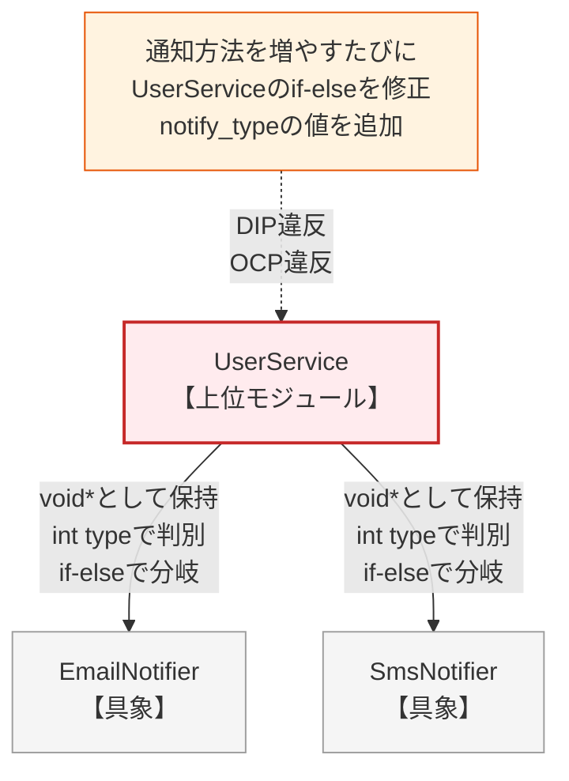
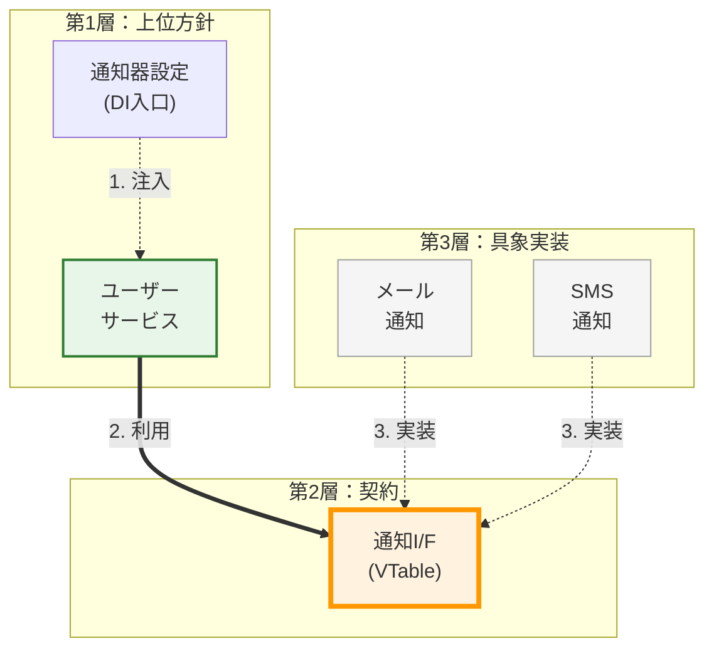
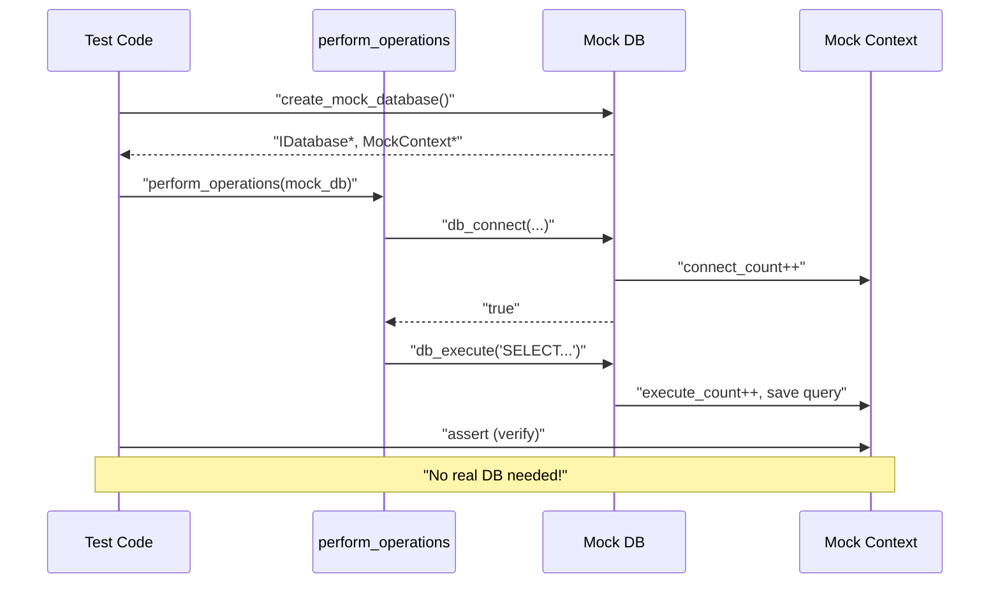
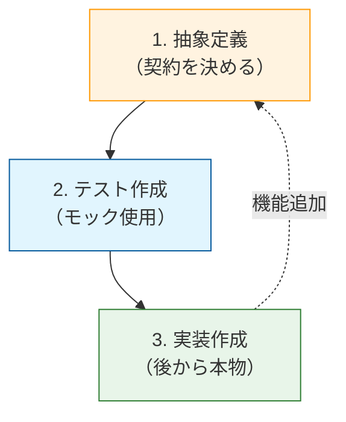

### 3.2. 実践パターン2：関数引数注入（メソッド注入）

 **シナリオ** : データ変換システム。処理ごとに異なる変換戦略（AES、ZIP、NoOpなど）を動的に適用します。

#### システム概要

ここでは、入力されたデータに対して特定の変換処理を施す**データ変換システム（DataProcessor）**を実装します。このシステムは、「AES暗号化」や「ZIP圧縮」などの多彩な変換バリエーションをサポートしつつも、コアとなるデータ処理を担う関数が個別の変換戦略（具象実装）に引きずられず、実行時に外部から渡された振る舞いを通じて動的に処理を切り替えるという要件を持っています。

#### 設計課題

この要件に対し、DIPの概念を持たずに実装すると、データ変換を行う親玉のモジュールの中に、すべての具体的な変換ロジック（AESやZIPなど）が直接書き込まれてしまうケースが非常に多く見られます。

以下の `data_processor.c` のコードでは、本来別々のモジュール（ファイル）に分かれるべきAES暗号化やZIP圧縮といった具体的な実装ロジックが、一つのファイルの中に混在しています。そして最も致命的なのが、コアのデータ処理関数である `process_data` が、「0ならAES」「1ならZIP」というように全ての具象手段を把握し、内部の `if-else` で分岐させてしまっている点です（DIP違反）。
これにより、新しい変換方式が追加されるたびに、この `data_processor.c` を開き、関係のないAESやZIPのコードを横目に `process_data` を修正し、再コンパイルしなければならないという、上位モジュールが下位の詳細に振り回される状態に陥っています。

#### 設計の意図

この「コア処理の中に具体的な変換手段がハードコードされている」という問題を解決するためのDIPの実践手法が **「関数引数注入（Method Injection / Function Argument Injection）」** です。

前項の「生成時注入」がモジュール（構造体）のライフサイクル全体にわたって依存オブジェクトを保持するのに対し、こちらは関数（メソッド）を呼び出すその瞬間だけ、一時的に「今回使う変換手段（`ITransform`という抽象）」を外から渡してあげる設計です。
これにより、データ処理を行う `process_data` 関数は「今どのアルゴリズムが使われているか」を一切知らなくて済むようになり、ただ「引数で渡された抽象に変換をお願いする」だけの極めて純粋で再利用性の高いコードになります。

#### 具象への直接依存（違反状態）

まずは関数引数注入を適用する前の、DIPに違反した最悪のコードから見てみましょう。新しい変換戦略が追加されるたびに、コアとなる `process_data` 関数の条件分岐を書き換えなければならない点に注目してください。

#### 複数の変換ロジックが混在し密結合したプロセッサ

#### data_processor.c (DIP違反)
```c
#include <stdio.h>
#include <string.h>
#include <stdlib.h>
// 具象実装1：AES（本来は別モジュールにあるべき詳細）
// ※ここでは簡略化のため、実際に暗号化はせずプレフィックス付与のみを行います

char* aes_encrypt(const char* data) {
    // "[AES:]" + NULL文字 分の領域を確保
    // ※呼び出し側で free が必要
    char* result = malloc(strlen(data) + 16);

    if (result) {
        // 安全な書き込み
        snprintf(result, strlen(data) + 16, "[AES:%s]", data);
    }

    return result;
}
```

新たに「ZIP圧縮もサポートしてほしい」という要件が来たため、無理やり後から追加された関数です。AESとは変更の理由が全く異なるため、本来は同じファイルに同居すべきではありません。

#### 変更の理由が異なる機能が同居するアンチパターン

#### data_processor.c (続き)
```c
// 具象実装2：ZIP（追加された具象詳細）

char* zip_compress(const char* data) {
    char* result = malloc(strlen(data) + 16);

    if (result) {
        sprintf(result, "[ZIP:%s]", data);
    }
    return result;
}

// データ処理（変換方法に直接依存）
void process_data(const char* data, int strategy) {
    char* result = NULL;
    // 戦略が増えるたびに、この条件分岐を書き換える必要がある
    //  **上位層（process_data）が下位の具体的な手法をすべて把握している** 
    if (strategy == 0) {
        result = aes_encrypt(data);

    } else if (strategy == 1) {
        result = zip_compress(data);
    } else {
        // デフォルト処理（NoOp: コピー）
        result = malloc(strlen(data) + 1);

        if (result) {
            strcpy(result, data);
        }
    }

    if (result) {
        printf("%s\n", result);
        free(result);
    }
}

int main(void) {
    printf("=== 固定された変換（DIP違反） ===\n");
    //  **呼び出し側も「数字（マジックナンバー）」で具象を指定せざるを得ない** 
    process_data("password123", 0);   // AESを期待
    process_data("large_content", 1); // ZIPを期待
    process_data("hello_world", 2);   // その他を期待

    return 0;
}
```

#### 実行結果

固定された具象実装（AES, ZIP）が呼び出され、拡張性が欠如していることを示しています。

#### 固定された具象実装による制約のある実行結果

#### 実行結果
```c
=== 固定された変換（DIP違反） ===
[AES:password123]
[ZIP:large_content]
hello_world
```

#### ✅ 原則適用後：関数引数注入（メソッド注入）

`process_data` は「変換する（`transform`）」という抽象的な契約のみを知っており、具体的なロジックは呼び出しごとに外部から注入されます。これにより、`process_data` のコードは一切修正することなく、無限に変換方法を増やすことができます。

それでは、DIPを適用してこの状況を改善しましょう。
まずは「変換する」という振る舞いだけを定義した抽象契約を作成します。

#### 変換という振る舞いだけを定義した抽象的な契約

#### itransform.h (抽象契約)
```c
#ifndef ITRANSFORM_H
#define ITRANSFORM_H
// 変換ロジックの型定義
// 戻り値は呼び出し側で free する必要がある動的文字列とする
typedef char* (*TransformFunc)(void* self, const char* data);
// 抽象インスタンス：特定の変換戦略をパッケージ化したもの
typedef struct {
    TransformFunc transform; // 関数ポインタを直接保持
    void* self;
} ITransform;
#endif
```

#### **concrete_transforms.c（具象実装群）**

AES、ZIP、NoOp（何もしない）という3つの具体的な変換処理を実装します。これらは`ITransform`インターフェースに適合しており、互いに置換可能です。

続いて、この契約を満たす具体的な変換アルゴリズムたちです。
まずはAES暗号化の実装。詳細なロジックは内部に隠蔽し、外部には `ITransform` という統一インターフェースを返すファクトリ関数のみを公開します。

#### 契約に従い詳細を隠蔽したAES変換の実装

#### concrete_transforms.c
```c
#include "itransform.h"
#include <stdlib.h>
#include <string.h>
#include <stdio.h>

// --- AES実装 ---

static char* aes_impl(void* self, const char* data) {
    // contextから設定値（キーの長さなど）を取得する例
    int key_len = self ? *(int*)self : 256; 
    char* res = malloc(strlen(data) + 32);

    if (res) {
        sprintf(res, "[AES-%d:%s]", key_len, data);
    }

    return res;
}

ITransform* create_aes_transform(void) {
    ITransform* t = malloc(sizeof(ITransform));
    int* key_len = malloc(sizeof(int));

    if (t && key_len) {
        *key_len = 256; // デフォルトのキー長
        t->transform = aes_impl;
        t->self = key_len;
    }

    return t;
}
```

ZIP圧縮も同様に構築します。AESとはやっていることが全く異なりますが、外部からは同じ `ITransform` 型として透過的に扱うことができます。

#### 契約に透過的に従うZIPおよびNoOp変換の実装

#### concrete_transforms.c (続き)
```c
// --- ZIP実装 ---

static char* zip_impl(void* self, const char* data) {
    // contextから圧縮レベルを取得する例
    int level = self ? *(int*)self : 6;
    char* res = malloc(strlen(data) + 32);

    if (res) {
        sprintf(res, "[ZIP-L%d:%s]", level, data);
    }

    return res;
}

ITransform* create_zip_transform(void) {
    ITransform* t = malloc(sizeof(ITransform));
    int* level = malloc(sizeof(int));

    if (t && level) {
        *level = 9; // 最高圧縮レベル
        t->transform = zip_impl;
        t->self = level;
    }

    return t;
}
```

#### コード例
```c
// --- NoOp実装（変換なし） ---
static char* noop_impl(void* self, const char* data) {
    // contextをロギング用のプレフィックスとして使用する例
    const char* prefix = self ? (const char*)self : "";
    char* res = malloc(strlen(data) + strlen(prefix) + 1);

    if (res) {
        sprintf(res, "%s%s", prefix, data);
    }
    return res;
}

ITransform* create_noop_transform(void) {
    ITransform* t = malloc(sizeof(ITransform));

    if (t) {
        t->transform = noop_impl;
        t->self = "NOOP:"; // 特定のプレフィックスを付ける
    }
    return t;
}

void destroy_transform(ITransform* t) {
    if (t) {
        // AESとZIPの場合は動的確保されたcontextを解放する
        if (t->transform == aes_impl || t->transform == zip_impl) {
            free(t->self);
        }
        free(t);
    }
}
```

#### **data_processor.c（修正に対して閉じる）**

`process_data`関数は、具体的な変換処理を引数として受け取ります（関数引数注入）。これにより、関数の内部を変更することなく、変換処理を自由に切り替えることが可能になります。

そして、これがDIP適用後の上位モジュールです。
関数の引数として「変換戦略（`ITransform`）」を毎度受け取る設計に変更されています。これにより、関数は「どんな変換が行われるか」を一切知る必要がなくなり、将来新しい変換手法が増えてもこの関数を修正する必要は永遠になくなりました。

#### 戦略を受け取り契約に従って処理を委譲するプロセッサ

#### data_processor.c
```c
#include "itransform.h"
#include <stdio.h>
#include <stdlib.h>
// 関数引数注入：関数の引数として「戦略（抽象）」を受け取る
// この関数は、新しい変換ロジックが増えても「一切の修正」が不要

void process_data(const char* data, ITransform* strategy) {
    if (!strategy || !strategy->transform) return;
    //  **相手が誰かを知らず、ただ「契約」に従って実行する** 
    char* result = strategy->transform(strategy->self, data);

    if (result) {
        printf("%s\n", result);
        free(result);
    }
}
```

#### **main.c（動的な戦略切り替え）**

利用側（`main`）では、関数を呼び出すその瞬間に、使いたい戦略（具象）を引数として注入します。この「呼び出しごとに依存関係を決定できる」のが関数引数注入の最大の強みです。

#### 関数呼び出しごとに戦略を動的に切り替える利用者

#### main.c
```c
#include "itransform.h"
#include <stdio.h>
// プロトタイプ宣言（実際には各ヘッダで管理）
extern ITransform* create_aes_transform(void);
extern ITransform* create_zip_transform(void);
extern ITransform* create_noop_transform(void);
extern void destroy_transform(ITransform* t);
extern void process_data(const char* data, ITransform* strategy);

int main(void) {
    ITransform* aes = create_aes_transform();
    ITransform* zip = create_zip_transform();
    ITransform* noop = create_noop_transform();
    printf("=== メソッド注入：処理ごとに戦略を切り替え ===\n");
    //  **同じ process_data 関数に、異なる「振る舞い」を注入する** 
    process_data("password123", aes);
    process_data("large_content", zip);
    process_data("hello_world", noop);
    destroy_transform(aes);
    destroy_transform(zip);
    destroy_transform(noop);

    return 0;
}
```

#### 実行結果

注入された戦略に応じて、同じコードが異なる振る舞い（AES, ZIP, NoOp）を示しています。

**比較表**:

| 項目 | 適用前 | 適用後 |
| --- | --- | --- |
|  **依存関係**  | `process_data` が全具象ロジックと密結合 | `process_data` は `ITransform` 契約のみに依存 |
|  **OCP（開放閉鎖）**  | 新ロジック追加時に `process_data` を **修正する** | `process_data` は **修正不要** （拡張に開いている） |
|  **注入の粒度**  | 固定（呼び出し側で番号指定） |  **関数呼び出しごとに** 自由に変更可能 |
|  **単体テスト**  | AES等の本物が必要 | NoOpやモックを注入して容易にテスト可能 |

#### 動的に注入された戦略に応じた柔軟な実行結果

#### 実行結果
```c
=== メソッド注入：処理ごとに戦略を切り替え ===
[AES-256:password123]
[ZIP-L9:large_content]
NOOP:hello_world
```

### 3.3. 実践パターン3：セッター注入（プロパティ注入）

 **シナリオ** : 通知システム。サービス生成後に通知先を動的に設定・変更可能にします。

#### システム概要

ここでは、ユーザーの登録などに伴って各種通知を送信する**ユーザーサービスシステム（UserService）**を実装します。このシステムは、「Email」や「SMS」といった複数の通知手段をサポートしつつも、サービスオブジェクトが生成された後からでも通知手段を柔軟に変更（または通知なしに設定）できるように、プロパティ（セッター）を通じて動的に依存を切り替える要件を持っています。

#### 設計課題

この要件に対し、DIPの概念を持たずに実装すると、設定用の関数を通じて「どの通知手段を使うか」を示すマジックナンバー（例：1ならEmail、2ならSMS）と、「具象のポインタ」を強引に受け取るという、非常に脆い設計になりがちです。

以下のコードの `UserService` プロセッサでは、通知先がEmailとSMSであることを完全に把握しています。最大の欠陥は、ビジネスロジックである `register_user` 関数が呼び出されるたびに、「今は設定値が1（Email）だから `email_send` を呼ぶ」「2だから `sms_send` を呼ぶ」というように、相手が誰であるかを確認して個別の関数を呼び出している点です。
もし今後「LINE通知」が追加されれば、この `UserService` のコード自体を開き、新しい分岐を追加し、新しい具象ヘッダをインクルードしなければならず、上位モジュールが「下位の通知手段」に完全に依存した構造になってしまっています。

#### 設計の意図

この「後から依存を切り替えたいが、上位モジュールを特定の具象に縛り付けたくない」という要件に最適なのが **「セッター（プロパティ）注入」** です。

構造体を生成した時点では特定の通知手段に依存せず空（NULLなど）にしておき、後からセッター関数（`set_notifier`）を通して「通知手段の抽象（`INotifier`）」だけをセット（注入）します。
これにより、`UserService` 側は相手がEmailだろうがSMSだろうが気にする必要がなくなり、ただ持っている抽象に対して「通知せよ」と命令するだけのクリーンな処理に生まれ変わります。生成時注入との違いは、ライフサイクル（生存期間）の途中で何度でも安全に依存先を切り替えられる（あるいは依存先がない状態にもできる）という点にあります。

#### 具象への直接依存（違反状態）

まずはセッター注入を適用する前の、DIPに違反した（具象に依存した）最悪のコードから見てみましょう。設定関数がマジックナンバーを要求し、それをもとに処理が分岐する密結合の典型例です。

#### 具象の通知手段をすべて知り尽くしたサービス

#### user_service.c (DIP違反)
```c
#include <stdio.h>
#include <stdlib.h>
#include <string.h>
// --- 具象実装1 ---
typedef struct { int id; } EmailNotifier;

void email_send(EmailNotifier* n, const char* msg) {
    printf("Sending email: %s\n", msg);
}
// --- 具象実装2 ---
typedef struct { int id; } SmsNotifier;

void sms_send(SmsNotifier* n, const char* msg) {
    printf("Sending SMS: %s\n", msg);
}
// --- UserService（複数の具象に密結合） ---
typedef struct {
    char* username;
    int notify_type; // 0:None, 1:Email, 2:SMS (内部で種類を管理)
    void* notifier;
} UserService;

UserService* create_service(const char* username) {
    UserService* service = malloc(sizeof(UserService));
    service->username = strdup(username);
    service->notify_type = 0; // 初期は通知なし
    service->notifier = NULL;

    return service;
}
```

#### 具象のポインタとタイプを強引に渡すセッター

#### user_service.c (続き)
```c
// 外部から「具象のポインタ」と「内部管理用のタイプ」を渡さなければならない

void set_notifier_manual(UserService* service, int type, void* n) {
    service->notify_type = type;
    service->notifier = n;
}

void register_user(UserService* service) {
    printf("Registering: %s\n", service->username);
    //  **呼び出しのたびに「相手が誰か」を確認して分岐が必要** 
    if (service->notify_type == 1) {
        email_send((EmailNotifier*)service->notifier, "Welcome!");

    } else if (service->notify_type == 2) {
        sms_send((SmsNotifier*)service->notifier, "Welcome!");
    }
}
```

利用側も最悪です。どの手段を使うかをマジックナンバーで指定し、ポインタを自らキャストして渡すという、本来隠蔽されるべき内部構造に深く関与する羽目になっています。

#### マジックナンバーとキャストに苦しむ利用者

#### user_service.c (続き)
```c
int main(void) {
    UserService* s = create_service("alice");
    printf("=== 通知なし ===\n");
    register_user(s);
    printf("\n=== メール通知を設定 ===\n");
    EmailNotifier email = {1};
    set_notifier_manual(s, 1, &email);
    register_user(s);
    printf("\n=== SMS通知に切り替え ===\n");
    SmsNotifier sms = {1};
    set_notifier_manual(s, 2, &sms);
    register_user(s);
    free(s->username); free(s);

    return 0;
}
```

#### 実行結果

通知手段を変更するために、ソースコードの修正（リコンパイル）が必要な状態です。

#### リコンパイルを伴う切り替えの実行結果

#### 実行結果
```c
=== 配信なし ===
Registering: alice
=== メール通知を設定 ===
Registering: alice
Sending email: Welcome!
=== SMS通知に切り替え ===
Registering: alice
Sending SMS: Welcome!
```

#### 違反時の依存構造

`UserService` が特定の通知方法（Email/SMS）の具象実装と密結合し、拡張が困難になっている状態を示します。 

 **型スイッチ** : `notify_type` による分岐が、新しい通知方法の追加を妨げています。 

 **カプセル化の欠如** : `void*` で保持せざるを得ないため、型安全性も失われています。Noteの指摘する「修正の連鎖」に注目。



#### ✅ 原則適用後：セッター注入（VTableなし）

`UserService` は抽象的な「通知窓口」だけを持ち、具象には依存しません。実行中にいつでも通知方法を差し替えることができ、新しい通知手段が増えても `UserService` のコードは1行も変わりません。

#### **inotifier.h（抽象契約）**

それではDIPを適用します。
まずは例によって、すべての通知手段に共通する「通知する（`notify`）」という抽象インターフェースを定義します。

#### 通知という振る舞いを抽象化した契約

#### inotifier.h (抽象契約)
```c
#ifndef INOTIFIER_H
#define INOTIFIER_H
// 通知ロジックの型定義
typedef void (*NotifyAction)(void* self, const char* message);
// 抽象インスタンス：特定の通知手段を表現する
typedef struct {
    NotifyAction notify; // 関数ポインタを直接保持
    void* self;
} INotifier;
#endif
```

#### **notifiers.c（具象実装群）**

`INotifier` インターフェースを実装する、EmailおよびSMS通知の具体的なロジックです。各通知手段を独立した関数として実装し、ファクトリ関数を通じて `INotifier` 型のオブジェクトとして提供します。

各具象の実装が完全に独立しているため、一方の修正が他方に影響を与えることがありません。

#### 契約に従うメールおよびSMS通知の実装

#### notifiers.c
```c
#include "inotifier.h"
#include <stdio.h>
#include <stdlib.h>
// --- メール通知の実装 ---

static void email_notify_impl(void* self, const char* msg) {
    printf("Sending email: %s\n", msg);
}

INotifier* create_email_notifier(void) {
    INotifier* n = malloc(sizeof(INotifier));
    n->notify = email_notify_impl;
    n->self = NULL;

    return n;
}
// --- SMS通知の実装 ---

static void sms_notify_impl(void* self, const char* msg) {
    printf("Sending SMS: %s\n", msg);
}

INotifier* create_sms_notifier(void) {
    INotifier* n = malloc(sizeof(INotifier));
    n->notify = sms_notify_impl;
    n->self = NULL;

    return n;
}

void destroy_notifier(INotifier* n) {
    if (n) free(n);
}
```

#### **user_service.c（不透明ポインタによる完全な隠蔽）**

`UserService`構造体は`INotifier`型へのポインタを保持しますが、具体的な実装クラス（EmailNotifierなど）は知りません。セッター関数を通じて、外部から通知手段を注入・交換できる設計になっています。

#### user_service.c

さて、本題の `UserService` 側です（上位モジュール）。
ここでは第4章で学んだ「不透明ポインタ（PIMPLパターン）」を活用し、構造体の内部を完全に隠蔽しています。

メンバ変数として、先ほど定義した `INotifier*` という抽象型のポインタを一つだけ保持します。

#### 不透明ポインタで内部状態を完全に隠蔽したサービス

#### user_service.c
```c
#include "inotifier.h"
#include <stdio.h>
#include <stdlib.h>
#include <string.h>

/* 構造体の詳細はソースファイルに隠蔽（第4章の原則） */
struct UserService {
    char* username;
    INotifier* notifier;
};

struct UserService* create_service(const char* username) {
    struct UserService* service = malloc(sizeof(struct UserService));

    if (service) {
        service->username = strdup(username);
        service->notifier = NULL;
    }

    return service;
}
```

そしてここが「セッター注入」の要です。
`UserService` 生成時には通知手段を決める必要はなく、後から `set_notifier` という関数を通していつでも抽象（`INotifier`）をセット・変更できます。ビジネスロジック側は、このセットされた誰かに対してただ通知を実行するだけとなり、強固なOCPを実現します。

#### 実行中にいつでも抽象を交換できるセッター

#### user_service.c (続き)
```c
void set_notifier(struct UserService* service, INotifier* notifier) {
    if (service) service->notifier = notifier;
}

void register_user(struct UserService* service) {
    if (!service) return;
    printf("Registering: %s\n", service->username);
    /* 直接メンバを叩かず、インターフェースが提供する関数を呼ぶ */

    if (service->notifier) {
        // 関数ポインタ経由で実行（抽象APIが存在する場合はそれを使う）
        service->notifier->notify(service->notifier->self, "Welcome!");
    }
}

void destroy_service(struct UserService* service) {
    if (service) {
        free(service->username);
        free(service);
    }
}
```

#### **inotifier.h（カプセル化された抽象契約）**

外部に公開するプロトタイプ宣言（ヘッダ相当）では、上位モジュールが使用するAPIだけを定義します。

#### 上位モジュールが使用するAPIだけを定義した公開ヘッダ

#### inotifier.h (外部公開APIのイメージ)
```c
#ifndef INOTIFIER_H
#define INOTIFIER_H

typedef struct INotifier INotifier;
/* 上位モジュールが使用する抽象API */
// 実際には以下のようなAPIを通じて操作することが推奨される
// void notifier_execute(INotifier* n, const char* msg);
// void notifier_destroy(INotifier* n);
#endif
```

#### **main.c（安全なリソース管理）**

生成したサービスに対し、実行中に通知元の実装を切り替える例です。古い通知元を安全に破棄し、新しい通知元をセットすることで、柔軟な構成変更を実現しています。

最後に、これらを組み立てる `main` 関数です。
まずはアプリケーションを生成し、その後からメール通知モジュールを生成して「セッター注入」を行って実行します。

#### 安全に古い通知器を破棄し新しいものを注入する利用者

#### main.c
```c
#include "inotifier.h"
#include <stdio.h>

/* UserServiceの詳細は知らない（不透明ポインタ） */
typedef struct UserService UserService;
extern UserService* create_service(const char* username);
extern void set_notifier(UserService* service, INotifier* notifier);
extern void register_user(UserService* service);
extern void destroy_service(UserService* service);
/* 具象の生成関数（各モジュールから提供） */
extern INotifier* create_email_notifier(void);
extern INotifier* create_sms_notifier(void);

int main(void) {
    UserService* service = create_service("alice");
    printf("=== メール通知を設定 ===\n");
    INotifier* email = create_email_notifier();
    set_notifier(service, email);
    register_user(service);
```

ここがセッター注入の醍醐味です。実行中のシステムを止めずに、後から「メール通知」を破棄して「SMS通知」に切り替えることができます。`UserService` 本体は何一つ作り直す必要がありません。

#### システムを止めずに依存先を切り替えるセッター注入

#### main.c (続き)
```c
    /* *  **依存先を切り替える前に、古い通知器を破棄する。** 
     * 構造体の中身を知らなくても notifier_destroy で安全に解放可能。
     */
    destroy_notifier(email);
    printf("\n=== SMS通知に切り替え ===\n");
    INotifier* sms = create_sms_notifier();
    set_notifier(service, sms);
    register_user(service);
    destroy_notifier(sms);
    destroy_service(service); /* 内部メンバに触れず関数経由で安全に破棄 */

    return 0;
}
```

#### 実行結果

実行中に通知手段が動的に切り替わり、システムを停止せずに変更が適用されています。

#### 動的に通知手段が切り替わった実行結果

#### 実行結果
```c
=== 通知なし ===
Registering: alice
=== メール通知を設定（プロパティ注入） ===
Registering: alice
Sending email: Welcome!
=== SMS通知に切り替え（プロパティ注入） ===
Registering: alice
Sending SMS: Welcome!
```

#### 適用後の依存構造

DI（依存性注入）パターンにおける、各モジュールの役割分担と依存の方向性を示します。 

 **上位方針の安定** : `Service`（UserService）は `Interface`（通知I/F）のみに依存し、具象の変化から守られています。 

 **柔軟な構成** : `Setter`（DI入口）を通じて、実行時に好きな具象実装を注入できる構造になっています。階層構造（上位→中位←下位）として捉え、矢印の集中する「中位（抽象）」がシステムの要であることを確認してください。



#### まとめ：三つの注入パターンの比較
| パターン | 依存のタイミング | 特徴 | 適用場面の例 |
| --- | --- | --- | --- |
|  **生成時注入** <br>(Constructor Injection) | オブジェクト生成時 | 必須の依存。生成時に不整合を防げる。 | データベース接続、ロガー |
|  **関数引数注入** <br>(Method Injection) | 関数呼び出し時 | 呼び出しごとに異なる振る舞いを適用。 | データ変換、ソート戦略 |
|  **セッター注入** <br>(Property Injection) | 生成後の任意時点 | 依存が任意（Null可）。実行中に変更。 | 通知機能、キャッシュ、UIテーマ |

### テスト容易性の向上：モックによるテスト

#### モック（Mock）とは何か

本物と同じインターフェースを持つ「偽物」の実装。実際の処理を行わず、呼び出しを記録する。

> [!NOTE] 読者の疑問：C言語でどうやってモックに「すり替える」の？
> 「関数ポインタ（VTable）や不完全型を使ってモジュールを分離するのはわかったけど、テストの時だけどうやってその偽物を本番コードに渡して『すり替える』の？」
>
> 実践的な疑問です。C言語において、本物とモックを「すり替える」最も一般的かつ確実な手法は、テストの `main` 関数（またはテストランナー）内での **明示的な依存性の注入（DI）** です。
> JavaなどのDIコンテナ（自動注入の仕組み）を持たないC言語では、テストコード自身が意図的に「モックの生成ファクトリを呼び出し、その結果（関数ポインタやコンテキスト）をテスト対象モジュールに直接渡す」という手動の結線作業を行います。次の節の実装例では、この「テストコードが裏でこっそりモックを注入し、結果を検証する」具体的な手順を解説します。

#### テスト環境の構成

本番環境とテスト環境で、依存先を「本物」から「モック」に差し替える仕組みです。アプリケーションの不変性**: `App` は相手が本物かモックかを知りません。

同じコードでテストが可能です。


#### モックの実装例

#### **mock_database.c（テスト用モック）**

実際のデータベースには接続せず、呼び出し回数やクエリ内容を記録するモック実装です。

#### mock_database.c

モックを作成する際は、そのモックが「どのような検証」に使われるかを想定することが重要です。

以下の例では、単に呼び出しを無視するだけでなく、内部の `MockDatabaseContext` を利用して「何度 `connect` が呼ばれたか」「どんなクエリが `execute` されたか」を記録する機能を持たせています。テストコードはこの記録を読み取ることで、ビジネスロジックが正しくデータベースと対話したかを検証できるのです。

#### 呼び出し回数やクエリ内容を記録するテスト用モック

#### mock_database.c
```c
#include "idatabase.h"
#include <stdio.h>
#include <stdlib.h>
#include <string.h>
#include <stdbool.h> // 追加
// モックが保持する記録データ
typedef struct {
    int connect_count;
    int execute_count;
    char last_query[256];
    bool should_fail;
} MockDatabaseContext;
// モックの実装

static bool mock_connect(void* self, const char* conn_str) {
    MockDatabaseContext* ctx = (MockDatabaseContext*)self;
    ctx->connect_count++;
    printf("[Mock] Connect called (count: %d)\n", ctx->connect_count);

    return !ctx->should_fail;
}

static void mock_execute(void* self, const char* query) {
    MockDatabaseContext* ctx = (MockDatabaseContext*)self;
    ctx->execute_count++;
    strncpy(ctx->last_query, query, sizeof(ctx->last_query) - 1);
    printf("[Mock] Execute called: %s (count: %d)\n", query, ctx->execute_count);
}

static void mock_disconnect(void* self) {
    MockDatabaseContext* ctx = (MockDatabaseContext*)self;
    printf("[Mock] Disconnect called\n");
    //  **【重要】ここではctxを解放しない！** 
    // テストコード側でカウンタ等を検証した後に解放するため、
    // 所有権はテスト側に残す設計とする。
    (void)ctx; // 未使用警告の抑制
}
```

VTableの実体定義と、モックデータベース生成関数の実装です。`mock_connect` などの内部関数は `static` で隠蔽し、インターフェースである `IDatabaseVTable` を介してのみアクセスさせます。

テスト用モックでありながら、本番用コードと同じインターフェース構造を厳密に守っています。

#### 契約を遵守してモックを生成するファクトリ

#### mock_database.c (続き)
```c
static const IDatabaseVTable MOCK_VTABLE = {
    .connect = mock_connect,
    .execute = mock_execute,
    .disconnect = mock_disconnect
};
// モックのファクトリ

IDatabase* create_mock_database(MockDatabaseContext** out_ctx) {
    MockDatabaseContext* ctx = malloc(sizeof(MockDatabaseContext));
    ctx->connect_count = 0;
    ctx->execute_count = 0;
    ctx->should_fail = false;
    ctx->last_query[0] = '\0';
    *out_ctx = ctx;  // テストコードが検証できるように返す
    IDatabase* db = malloc(sizeof(IDatabase));
    db->vtable = &MOCK_VTABLE;
    db->self = ctx;

    return db;
}
```

最後に、このモックを利用してビジネスロジック（`perform_operations`）をテストするコードです。

テストコードは、先ほどのモック生成ファクトリから受け取った `MockDatabaseContext` の中身を覗き見る権利を持っています。本物のデータベースを使わずとも、「期待通りに接続され、期待通りの回数クエリが実行され、UPDATE文が含まれていたか」をメモリ上の変数だけで完璧に検証できます。

#### モックの中身を覗き見して検証するテスト準備

#### test_business_logic.c
```c
#include "idatabase.h"
#include <stdio.h>
#include <stdlib.h>
#include <assert.h>
#include <string.h>
#include <stdbool.h>
// テストコード内でコンテキストの中身を検証するため、完全な定義が必要
typedef struct {
    int connect_count;
    int execute_count;
    char last_query[256];
    bool should_fail;
} MockDatabaseContext;
```

テストの実行関数では、まさに Arrange（準備）、Act（実行）、Assert（検証）の黄金パターンが展開されます。

ネットワークもデータベースも必要ありません。外部環境に一切依存しないこの「閉じたテスト」は、CI（継続的インテグレーション）環境で何万回実行されても、常に数ミリ秒で安定した結果を返し続けます。

#### 外部環境に一切依存しない超高速なテストコード

#### test_business_logic.c (続き)
```c
extern IDatabase* create_mock_database(MockDatabaseContext** out_ctx);
extern void perform_operations(IDatabase* db, const char* name);
// テスト実行関数

void test_business_logic(void) {
    MockDatabaseContext* mock_ctx;
    IDatabase* mock_db = create_mock_database(&mock_ctx);
    printf("=== テスト実行 ===\n");
    // 内部で db_disconnect が呼ばれ、mock_disconnect が実行される
    perform_operations(mock_db, "Test");
    // 検証
    // mock_disconnect で ctx を解放しない設計にしたため、ここで安全に検証できる
    printf("\n=== 検証 ===\n");
    assert(mock_ctx->connect_count == 1);
    printf("✓ connect が1回呼ばれた\n");
    assert(mock_ctx->execute_count == 2);
    printf("✓ execute が2回呼ばれた\n");
    assert(strstr(mock_ctx->last_query, "UPDATE") != NULL);
    printf("✓ 最後のクエリはUPDATE文\n");
    // テスト終了後に手動でリソースを解放する
    free(mock_ctx);
    free(mock_db);
    printf("\n全てのテストが成功しました！\n");
}

int main(void) {
    test_business_logic();

    return 0;
}
```

#### 実行結果

実行結果から、モックが接続・実行・切断を正しく記録し、テストコードがそれを検証できていることが分かります。DIPにより実装を差し替えて可能にしたことで、このような決定論的なテストが可能になります。

#### モックの記録を用いて完璧に行われたテスト結果

#### 実行結果
```c
=== テスト実行 ===
=== Test Operations ===
[Mock] Connect called (count: 1)
[Mock] Execute called: SELECT * FROM users (count: 1)
[Mock] Execute called: UPDATE products SET price = price * 1.1 (count: 2)
[Mock] Disconnect called
=== 検証 ===
✓ connect が1回呼ばれた
✓ execute が2回呼ばれた
✓ 最後のクエリはUPDATE文
全てのテストが成功しました！
```

#### テスト実行のシーケンス

テストコードがモックを注入し、ビジネスロジック実行後にモックの状態を検証（Verify）する流れです。  **検証の仕組み** : モック（`Mock`）はビジネスロジックからの呼び出し回数などをコンテキスト（`Ctx`）に記録し、最後にテストコードがそれをチェックしています。



 **モックの価値** ：
* 実際のDBサーバーが不要です。
* テストが数ミリ秒で完了します。
* エラーケース（`should_fail = true`）を簡単に再現できます。

### DIPが支える「設計ファースト」の考え方

#### TDD（テスト駆動開発）との連携

DIPにより、実装が完成していなくても設計を進められます。

#### 開発プロセスの変革

DIPを適用することで、実装（Step3）よりも先にテスト（Step2）が可能になるプロセスです。 

 **インターフェース先行** : まず「契約」を決めることで、実装の完了を待たずにテストコードを書くことができます。


