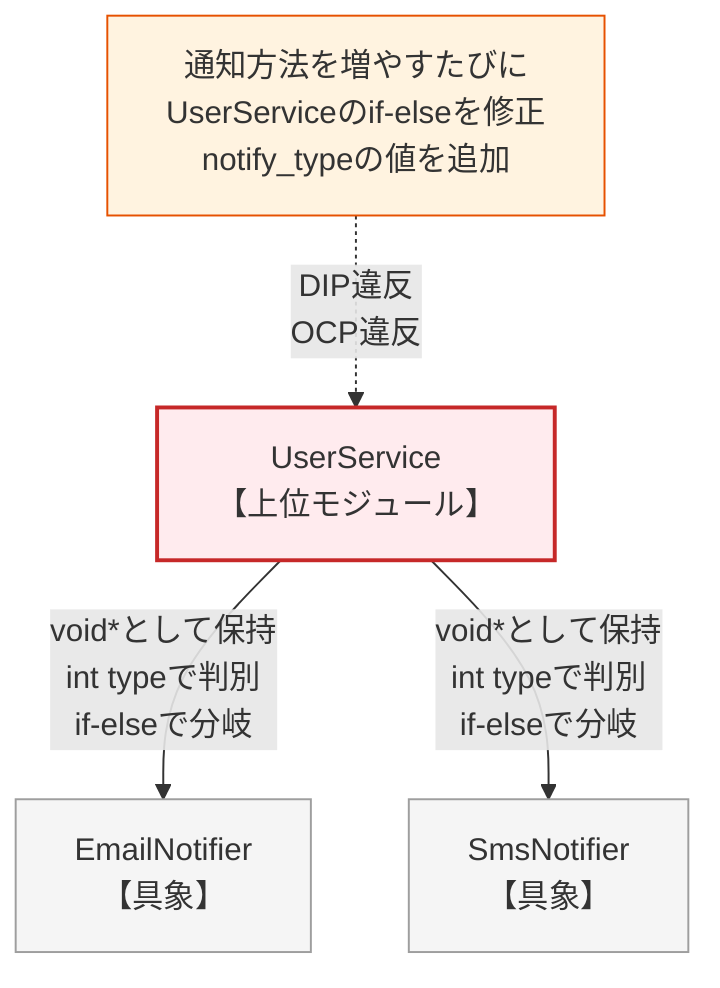
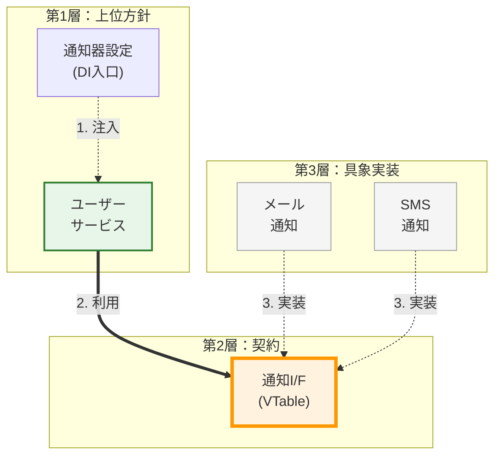
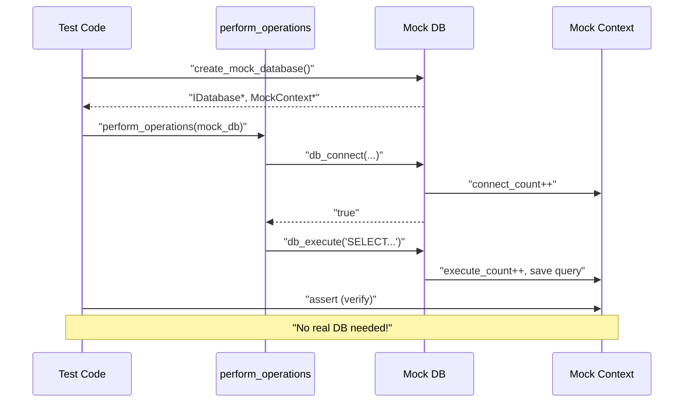
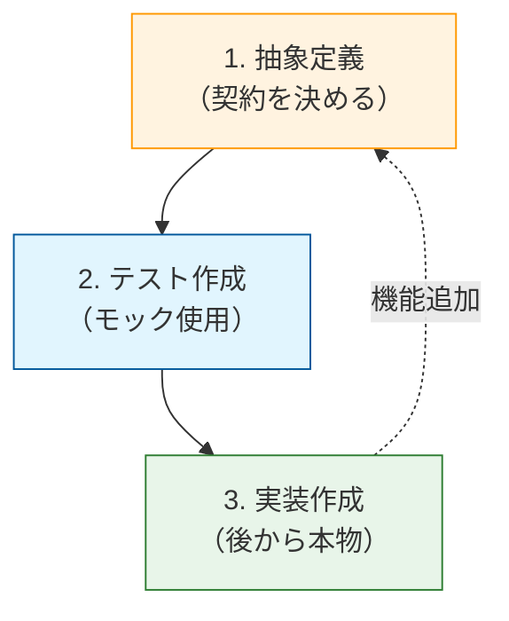

### 3.2. 実践パターン2：関数引数注入（メソッド注入）

 **シナリオ** : データ変換システム。処理ごとに異なる変換戦略（AES、ZIP、NoOpなど）を動的に適用します。

#### ❌ 原則適用前：固定された実装（具象への密結合）

#### **data_processor.c（DIP違反）**

新しい変換方法が必要になるたびに、`process_data` 関数の内部を修正し、`if-else` による条件分岐を増やさなければなりません。上位モジュールが「どんな変換方法があるか」をすべて知ってしまっている状態です。

データ処理（変換方法に直接依存）を行う関数です。ここでは、AES暗号化（シミュレーション）とZIP圧縮（シミュレーション）の具象実装が直接記述されています。

**（悪い例）** 本来は別モジュールにあるべき詳細な実装ロジックが、一つのファイルに混在しています。

#### data_processor.c
```c
#include <stdio.h>
#include <string.h>
#include <stdlib.h>
// 具象実装1：AES（本来は別モジュールにあるべき詳細）
// ※ここでは簡略化のため、実際に暗号化はせずプレフィックス付与のみを行います

char* aes_encrypt(const char* data) {
    // "[AES:]" + NULL文字 分の領域を確保
    // ※呼び出し側で free が必要
    char* result = malloc(strlen(data) + 16);

    if (result) {
        // 安全な書き込み
        snprintf(result, strlen(data) + 16, "[AES:%s]", data);
    }

    return result;
}
```

ZIP圧縮を行う具象実装です。AESと同様に、データの変換を行う責任を持ちます。

新しい変換要件（ZIP）が発生した際に追加された関数ですが、本来は別のファイルやモジュールに分割されるべき「変更の軸」が異なる責務です。

#### data_processor.c (続き)
```c
// 具象実装2：ZIP（追加された具象詳細）

char* zip_compress(const char* data) {
    char* result = malloc(strlen(data) + 16);

    if (result) {
        sprintf(result, "[ZIP:%s]", data);
    }
    return result;
}

// データ処理（変換方法に直接依存）
void process_data(const char* data, int strategy) {
    char* result = NULL;
    // 戦略が増えるたびに、この条件分岐を書き換える必要がある
    //  **上位層（process_data）が下位の具体的な手法をすべて把握している** 
    if (strategy == 0) {
        result = aes_encrypt(data);

    } else if (strategy == 1) {
        result = zip_compress(data);
    } else {
        // デフォルト処理（NoOp: コピー）
        result = malloc(strlen(data) + 1);

        if (result) {
            strcpy(result, data);
        }
    }

    if (result) {
        printf("%s\n", result);
        free(result);
    }
}

int main(void) {
    printf("=== 固定された変換（DIP違反） ===\n");
    //  **呼び出し側も「数字（マジックナンバー）」で具象を指定せざるを得ない** 
    process_data("password123", 0);   // AESを期待
    process_data("large_content", 1); // ZIPを期待
    process_data("hello_world", 2);   // その他を期待

    return 0;
}
```

#### 実行結果

固定された具象実装（AES, ZIP）が呼び出され、拡張性が欠如していることを示しています。

#### 実行結果
```c
=== 固定された変換（DIP違反） ===
[AES:password123]
[ZIP:large_content]
hello_world
```

#### ✅ 原則適用後：関数引数注入（メソッド注入）

`process_data` は「変換する（`transform`）」という抽象的な契約のみを知っており、具体的なロジックは呼び出しごとに外部から注入されます。これにより、`process_data` のコードは一切修正することなく、無限に変換方法を増やすことができます。

#### **itransform.h（抽象契約）**

変換処理の抽象インターフェースを定義します。`TransformFunc`型を通じて、具体的な変換アルゴリズムを隠蔽します。

関数ポインタ型 `TransformFunc` と、その関数ポインタを保持するコンテキスト構造体 `ITransform` を定義しています。「変換処理」という振る舞いを抽象化し、具体的な実装（AESやZIP）を隠蔽するインターフェースとして機能します。

 **この抽象層を挟むことで、利用側と実装側の依存関係を逆転させ、疎結合を実現しています。**

#### itransform.h
```c
#ifndef ITRANSFORM_H
#define ITRANSFORM_H
// 変換ロジックの型定義
// 戻り値は呼び出し側で free する必要がある動的文字列とする
typedef char* (*TransformFunc)(void* context, const char* data);
// 抽象インスタンス：特定の変換戦略をパッケージ化したもの
typedef struct {
    TransformFunc transform; // 関数ポインタを直接保持
    void* context;
} ITransform;
#endif
```

#### **concrete_transforms.c（具象実装群）**

AES、ZIP、NoOp（何もしない）という3つの具体的な変換処理を実装します。これらは`ITransform`インターフェースに適合しており、互いに置換可能です。

AES暗号化（シミュレーション）を行う具体的な変換実装です。`ITransform` インターフェースの仕様に従い、AES暗号化（シミュレーション）を行う具体的な関数を実装しています。

具体的な暗号化ロジックをこのファイル内に閉じ込め、外部には `create_aes_transform` というファクトリ関数のみを公開します。新しい暗号化方式が必要になっても、このファイルを修正・追加するだけで済み、既存コードへの影響を与えません。

#### concrete_transforms.c
```c
#include "itransform.h"
#include <stdlib.h>
#include <string.h>
#include <stdio.h>
// --- AES実装 ---

static char* aes_impl(void* context, const char* data) {
    (void)context; // 未使用引数の警告抑制
    char* res = malloc(strlen(data) + 16);

    if (res) {
        sprintf(res, "[AES:%s]", data);
    }

    return res;
}

ITransform* create_aes_transform(void) {
    ITransform* t = malloc(sizeof(ITransform));

    if (t) {
        t->transform = aes_impl;
        t->context = NULL;
    }

    return t;
}
```

`ITransform` インターフェースに従い、ZIP圧縮（シミュレーション）を行う具体的な処理を実装しています。AESと同様に `ITransform` という共通の「型」に適合させることで、利用側からはAESと区別なく扱える（ポリモーフィズム）ように設計されています。

異なるアルゴリズムを同一のインターフェースで統一して扱えるため、拡張性が高い構造です。

#### concrete_transforms.c (続き)
```c
// --- ZIP実装 ---

static char* zip_impl(void* context, const char* data) {
    (void)context; // 未使用引数の警告抑制
    char* res = malloc(strlen(data) + 16);

    if (res) {
        sprintf(res, "[ZIP:%s]", data);
    }

    return res;
}

ITransform* create_zip_transform(void) {
    ITransform* t = malloc(sizeof(ITransform));

    if (t) {
        t->transform = zip_impl;
        t->context = NULL;
    }

    return t;
}
```

```c
// --- NoOp実装（変換なし） ---
static char* noop_impl(void* context, const char* data) {
    (void)context; // 未使用引数の警告抑制
    char* res = malloc(strlen(data) + 1);

    if (res) {
        strcpy(res, data);
    }
    return res;
}

ITransform* create_noop_transform(void) {
    ITransform* t = malloc(sizeof(ITransform));

    if (t) {
        t->transform = noop_impl;
        t->context = NULL;
    }
    return t;
}

void destroy_transform(ITransform* t) {
    if (t) free(t);
}
```

#### **data_processor.c（修正に対して閉じる）**

`process_data`関数は、具体的な変換処理を引数として受け取ります（関数引数注入）。これにより、関数の内部を変更することなく、変換処理を自由に切り替えることが可能になります。

抽象インターフェース `ITransform` を引数として受け取り、その変換機能を実行する関数です。具体的な実装クラス（AESやZIP）ではなく、抽象（`ITransform`）に依存させる「依存性注入（DI）」パターンを適用しています。

変換ロジックの実体が何であれ、この関数のコードを変更する必要がなくなるため、OCP（開放閉鎖原則）を完全に満たしています。

#### data_processor.c
```c
#include "itransform.h"
#include <stdio.h>
#include <stdlib.h>
// 関数引数注入：関数の引数として「戦略（抽象）」を受け取る
// この関数は、新しい変換ロジックが増えても「一切の修正」が不要

void process_data(const char* data, ITransform* strategy) {
    if (!strategy || !strategy->transform) return;
    //  **相手が誰かを知らず、ただ「契約」に従って実行する** 
    char* result = strategy->transform(strategy->context, data);

    if (result) {
        printf("%s\n", result);
        free(result);
    }
}
```

#### **main.c（動的な戦略切り替え）**

実行時に異なる変換戦略を生成し、`process_data`関数に注入する例です。同じ関数呼び出しでも、渡すオブジェクトによって振る舞いが変わります。

#### main.c
```c
#include "itransform.h"
#include <stdio.h>
// プロトタイプ宣言（実際には各ヘッダで管理）
extern ITransform* create_aes_transform(void);
extern ITransform* create_zip_transform(void);
extern ITransform* create_noop_transform(void);
extern void destroy_transform(ITransform* t);
extern void process_data(const char* data, ITransform* strategy);

int main(void) {
    ITransform* aes = create_aes_transform();
    ITransform* zip = create_zip_transform();
    ITransform* noop = create_noop_transform();
    printf("=== メソッド注入：処理ごとに戦略を切り替え ===\n");
    //  **同じ process_data 関数に、異なる「振る舞い」を注入する** 
    process_data("password123", aes);
    process_data("large_content", zip);
    process_data("hello_world", noop);
    destroy_transform(aes);
    destroy_transform(zip);
    destroy_transform(noop);

    return 0;
}
```

#### 実行結果

注入された戦略に応じて、同じコードが異なる振る舞い（AES, ZIP, NoOp）を示しています。

**比較表**:

| 項目 | 適用前 | 適用後 |
| --- | --- | --- |
|  **依存関係**  | `process_data` が全具象ロジックと密結合 | `process_data` は `ITransform` 契約のみに依存 |
|  **OCP（開放閉鎖）**  | 新ロジック追加時に `process_data` を **修正する** | `process_data` は **修正不要** （拡張に開いている） |
|  **注入の粒度**  | 固定（呼び出し側で番号指定） |  **関数呼び出しごとに** 自由に変更可能 |
|  **単体テスト**  | AES等の本物が必要 | NoOpやモックを注入して容易にテスト可能 |

#### 実行結果
```c
=== メソッド注入：処理ごとに戦略を切り替え ===
[AES:password123]
[ZIP:large_content]
hello_world
```

### 3.3. 実践パターン3：セッター注入（プロパティ注入）

 **シナリオ** : 通知システム。サービス生成後に通知先を動的に設定・変更可能にします。

#### ❌ 原則適用前：必須の依存（具象との密結合）

#### **user_service.c（DIP違反）**

通知方法が `UserService` 内部で固定されているため、後から通知先を変更したり、通知をオフにしたりすることが困難です。通知手段を増やすたびに `UserService` を修正しなければなりません。

#### user_service.c

外部から具象のポインタを注入する関数と、それを使用するビジネスロジックです。`set_notifier_manual`関数で、手動で通知タイプとポインタを設定します。

`register_user`関数では、設定された`notify_type`に応じてキャストを行い、それぞれの通知関数を呼び出しています。ここでは依存関係がハードコーディングされており、新しい通知方法（例：Slack通知）を追加するためには、`UserService`のコード（`register_user`内のif文）を修正しなければなりません。

これはOCP違反であり、DIP違反でもあります。ユーザー通知サービスの実装ですが、通知手段（Email/SMS）の具体的な型定義や送信ロジックを直接含んでしまっています。

**（悪い例）** 本来分離されるべき「通知手段の詳細」と「ユーザー管理」が密結合しており、DIPに違反しています。通知手段を一つ追加するだけで `UserService` 構造体や `register_user` 関数の修正が必要となり、保守性が著しく低下しています。

#### user_service.c
```c
#include <stdio.h>
#include <stdlib.h>
#include <string.h>
// --- 具象実装1 ---
typedef struct { int id; } EmailNotifier;

void email_send(EmailNotifier* n, const char* msg) {
    printf("Sending email: %s\n", msg);
}
// --- 具象実装2 ---
typedef struct { int id; } SmsNotifier;

void sms_send(SmsNotifier* n, const char* msg) {
    printf("Sending SMS: %s\n", msg);
}
// --- UserService（複数の具象に密結合） ---
typedef struct {
    char* username;
    int notify_type; // 0:None, 1:Email, 2:SMS (内部で種類を管理)
    void* notifier;
} UserService;

UserService* create_service(const char* username) {
    UserService* service = malloc(sizeof(UserService));
    service->username = strdup(username);
    service->notify_type = 0; // 初期は通知なし
    service->notifier = NULL;

    return service;
}
```

#### user_service.c (続き)
```c
// 外部から「具象のポインタ」と「内部管理用のタイプ」を渡さなければならない

void set_notifier_manual(UserService* service, int type, void* n) {
    service->notify_type = type;
    service->notifier = n;
}

void register_user(UserService* service) {
    printf("Registering: %s\n", service->username);
    //  **呼び出しのたびに「相手が誰か」を確認して分岐が必要** 
    if (service->notify_type == 1) {
        email_send((EmailNotifier*)service->notifier, "Welcome!");

    } else if (service->notify_type == 2) {
        sms_send((SmsNotifier*)service->notifier, "Welcome!");
    }
}
```

手動で通知タイプIDとポインタを管理し、`UserService` に設定するクライアントコードです。（悪い例）内部構造（`notify_type`）やキャストが必要なポインタ操作をクライアントに強いており、カプセル化が破壊されています。

クライアントコードが実装詳細に深く依存しているため、変更に脆弱です。

#### user_service.c (続き)
```c
int main(void) {
    UserService* s = create_service("alice");
    printf("=== 通知なし ===\n");
    register_user(s);
    printf("\n=== メール通知を設定 ===\n");
    EmailNotifier email = {1};
    set_notifier_manual(s, 1, &email);
    register_user(s);
    printf("\n=== SMS通知に切り替え ===\n");
    SmsNotifier sms = {1};
    set_notifier_manual(s, 2, &sms);
    register_user(s);
    free(s->username); free(s);

    return 0;
}
```

#### 実行結果

通知手段を変更するために、ソースコードの修正（リコンパイル）が必要な状態です。

#### 実行結果
```c
=== 配信なし ===
Registering: alice
=== メール通知を設定 ===
Registering: alice
Sending email: Welcome!
=== SMS通知に切り替え ===
Registering: alice
Sending SMS: Welcome!
```

#### 違反時の依存構造

`UserService` が特定の通知方法（Email/SMS）の具象実装と密結合し、拡張が困難になっている状態を示します。 

 **型スイッチ** : `notify_type` による分岐が、新しい通知方法の追加を妨げています。 

 **カプセル化の欠如** : `void*` で保持せざるを得ないため、型安全性も失われています。Noteの指摘する「修正の連鎖」に注目。



#### ✅ 原則適用後：セッター注入（VTableなし）

`UserService` は抽象的な「通知窓口」だけを持ち、具象には依存しません。実行中にいつでも通知方法を差し替えることができ、新しい通知手段が増えても `UserService` のコードは1行も変わりません。

#### **inotifier.h（抽象契約）**

通知処理の抽象インターフェース `INotifier` と、その実行単位である関数ポインタ型 `NotifyAction` を定義しています。上位モジュール（UserService）が下位モジュール（EmailやSMS）に直接依存しないよう、依存の逆転を図るための抽象定義です。

このヘッダファイルのみを共有することで、実装の詳細を隠蔽しつつ、モジュール間の契約を明確にしています。

#### inotifier.h
```c
#ifndef INOTIFIER_H
#define INOTIFIER_H
// 通知ロジックの型定義
typedef void (*NotifyAction)(void* context, const char* message);
// 抽象インスタンス：特定の通知手段を表現する
typedef struct {
    NotifyAction notify; // 関数ポインタを直接保持
    void* context;
} INotifier;
#endif
```

#### **notifiers.c（具象実装群）**

`INotifier` インターフェースを実装する、EmailおよびSMS通知の具体的なロジックです。各通知手段を独立した関数として実装し、ファクトリ関数を通じて `INotifier` 型のオブジェクトとして提供します。

各具象の実装が完全に独立しているため、一方の修正が他方に影響を与えることがありません。

#### notifiers.c
```c
#include "inotifier.h"
#include <stdio.h>
#include <stdlib.h>
// --- メール通知の実装 ---

static void email_notify_impl(void* context, const char* msg) {
    printf("Sending email: %s\n", msg);
}

INotifier* create_email_notifier(void) {
    INotifier* n = malloc(sizeof(INotifier));
    n->notify = email_notify_impl;
    n->context = NULL;

    return n;
}
// --- SMS通知の実装 ---

static void sms_notify_impl(void* context, const char* msg) {
    printf("Sending SMS: %s\n", msg);
}

INotifier* create_sms_notifier(void) {
    INotifier* n = malloc(sizeof(INotifier));
    n->notify = sms_notify_impl;
    n->context = NULL;

    return n;
}

void destroy_notifier(INotifier* n) {
    if (n) free(n);
}
```

#### **user_service.c（不透明ポインタによる完全な隠蔽）**

`UserService`構造体は`INotifier`型へのポインタを保持しますが、具体的な実装クラス（EmailNotifierなど）は知りません。セッター関数を通じて、外部から通知手段を注入・交換できる設計になっています。

#### user_service.c

通知器をセットする関数と、通知を実行するビジネスロジックです。`set_notifier`は、抽象型`INotifier*`を受け取って保持します。

`register_user`は、保持している`INotifier`に対して`notifier_execute`を呼び出します。ここでは「相手が具体的に何であるか（EmailかSMSか）」を確認する分岐コードは一切ありません。

ただ「通知器としての契約（INotifier）」に従って操作するだけです。これにより、新しい通知器が増えてもこのコードは修正不要となります。

`UserService` 構造体の定義と、その生成関数の実装です。構造体の詳細は `.c` ファイル内に隠蔽されています。

PIMPLパターン（不透明ポインタ）を用いることで、`UserService` の内部データの変更が外部に波及しないようにしています。コンパイル時の依存関係を最小限に抑え、モジュールの独立性を高めています。

#### user_service.c
```c
#include "inotifier.h"
#include <stdio.h>
#include <stdlib.h>
#include <string.h>

/* 構造体の詳細はソースファイルに隠蔽（第4章の原則） */
struct UserService {
    char* username;
    INotifier* notifier;
};

struct UserService* create_service(const char* username) {
    struct UserService* service = malloc(sizeof(struct UserService));

    if (service) {
        service->username = strdup(username);
        service->notifier = NULL;
    }

    return service;
}
```

外部から `INotifier` を注入するセッター関数と、それを利用して通知を行う `register_user` 関数です。依存オブジェクト（Notifier）を外部から注入（Setter Injection）できるようにすることで、実行時に振る舞いを変更可能にしています。

`if-else` による型チェックが不要となり、コードがシンプルかつ拡張に対して開かれた状態（OCP）になっています。

#### user_service.c (続き)
```c
void set_notifier(struct UserService* service, INotifier* notifier) {
    if (service) service->notifier = notifier;
}

void register_user(struct UserService* service) {
    if (!service) return;
    printf("Registering: %s\n", service->username);
    /* 直接メンバを叩かず、インターフェースが提供する関数を呼ぶ */

    if (service->notifier) {
        notifier_execute(service->notifier, "Welcome!");
    }
}

void destroy_service(struct UserService* service) {
    if (service) {
        free(service->username);
        free(service);
    }
}
```

#### **inotifier.h（カプセル化された抽象契約）**

上位モジュールに公開する抽象APIと不完全型の定義です。`INotifier` に対する操作（実行、破棄）を行うためのAPI関数宣言です。

構造体の中身（関数ポインタなど）を直接触らせるのではなく、関数経由で操作させることで、将来的な実装変更の余地を残しています。不完全型と組み合わせることで、完全なカプセル化を提供します。

#### inotifier.h
```c
#ifndef INOTIFIER_H
#define INOTIFIER_H

typedef struct INotifier INotifier;
/* 上位モジュールが使用する抽象API */
void notifier_execute(INotifier* n, const char* msg);
void notifier_destroy(INotifier* n);
#endif
```

#### **main.c（安全なリソース管理）**

生成したサービスに対し、実行中に通知元の実装を切り替える例です。古い通知元を安全に破棄し、新しい通知元をセットすることで、柔軟な構成変更を実現しています。

`UserService` の生成と、最初の通知手段（Email）の設定・実行を行うクライアントコードです。アプリケーションの構成責任を持つ `main` 関数が、抽象（Service）と具象（Notifier）を組み合わせる「DIコンテナ」の役割を果たしています。

ビジネスロジックとオブジェクト構成の責任が分離され、テストや変更が容易な構造です。

#### main.c
```c
#include "inotifier.h"
#include <stdio.h>

/* UserServiceの詳細は知らない（不透明ポインタ） */
typedef struct UserService UserService;
extern UserService* create_service(const char* username);
extern void set_notifier(UserService* service, INotifier* notifier);
extern void register_user(UserService* service);
extern void destroy_service(UserService* service);
/* 具象の生成関数（各モジュールから提供） */
extern INotifier* create_email_notifier(void);
extern INotifier* create_sms_notifier(void);

int main(void) {
    UserService* service = create_service("alice");
    printf("=== メール通知を設定 ===\n");
    INotifier* email = create_email_notifier();
    set_notifier(service, email);
    register_user(service);
```

通知手段をSMSに動的に切り替え、最終的にサービス全体を破棄する処理です。インターフェース（`INotifier`）が統一されているため、実装を差し替えても `UserService` 側のコード変更は不要であることを示しています。

高い柔軟性を持ち、要件変更に即座に対応できるアーキテクチャの利点を示しています。

#### main.c (続き)
```c
    /* *  **依存先を切り替える前に、古い通知器を破棄する。** 
     * 構造体の中身を知らなくても notifier_destroy で安全に解放可能。
     */
    notifier_destroy(email);
    printf("\n=== SMS通知に切り替え ===\n");
    INotifier* sms = create_sms_notifier();
    set_notifier(service, sms);
    register_user(service);
    notifier_destroy(sms);
    destroy_service(service); /* 内部メンバに触れず関数経由で安全に破棄 */

    return 0;
}
```

#### 実行結果

実行中に通知手段が動的に切り替わり、システムを停止せずに変更が適用されています。

#### 実行結果
```c
=== 通知なし ===
Registering: alice
=== メール通知を設定（プロパティ注入） ===
Registering: alice
Sending email: Welcome!
=== SMS通知に切り替え（プロパティ注入） ===
Registering: alice
Sending SMS: Welcome!
```

#### 適用後の依存構造

DI（依存性注入）パターンにおける、各モジュールの役割分担と依存の方向性を示します。 

 **上位方針の安定** : `Service`（UserService）は `Interface`（通知I/F）のみに依存し、具象の変化から守られています。 

 **柔軟な構成** : `Setter`（DI入口）を通じて、実行時に好きな具象実装を注入できる構造になっています。階層構造（上位→中位←下位）として捉え、矢印の集中する「中位（抽象）」がシステムの要であることを確認してください。



#### まとめ：三つの注入パターンの比較
| パターン | 依存のタイミング | 特徴 | 適用場面の例 |
| --- | --- | --- | --- |
|  **生成時注入** <br>(Constructor Injection) | オブジェクト生成時 | 必須の依存。生成時に不整合を防げる。 | データベース接続、ロガー |
|  **関数引数注入** <br>(Method Injection) | 関数呼び出し時 | 呼び出しごとに異なる振る舞いを適用。 | データ変換、ソート戦略 |
|  **セッター注入** <br>(Property Injection) | 生成後の任意時点 | 依存が任意（Null可）。実行中に変更。 | 通知機能、キャッシュ、UIテーマ |

### テスト容易性の向上：モックによるテスト

#### モックとは何か

-  **モック（Mock）** : 本物と同じインターフェースを持つ「偽物」の実装。実際の処理を行わず、呼び出しを記録する。

#### テスト環境の構成

本番環境とテスト環境で、依存先を「本物」から「モック」に差し替える仕組みです。アプリケーションの不変性**: `App` は相手が本物かモックかを知りません。

同じコードでテストが可能です。


#### モックの実装例

#### **mock_database.c（テスト用モック）**

実際のデータベースには接続せず、呼び出し回数やクエリ内容を記録するモック実装です。

#### mock_database.c

モックの実装と、モック生成ファクトリです。`test_business_logic.c`などが使用するためのモックオブジェクトを生成します。

ここで「コンテキストのポインタ」も出力引数として返しているのがポイントです。テストコードは、この返されたコンテキスト(`MockDatabaseContext`)を通じて、モック内部の状態（呼び出し回数など）を検証できます。

これにより、ブラックボックステストだけでなく、内部挙動のホワイトボックステスト（相互作用の検証）が可能になります。ヘッダで定義されたインターフェースの具体的な実装を行います。

内部データや詳細ロジックをこのファイル内に閉じ込め（カプセル化）、外部からの直接アクセスを防ぎます。変更が発生しても、このファイル内のみに影響を留めることができます。

#### mock_database.c
```c
#include "idatabase.h"
#include <stdio.h>
#include <stdlib.h>
#include <string.h>
#include <stdbool.h> // 追加
// モックが保持する記録データ
typedef struct {
    int connect_count;
    int execute_count;
    char last_query[256];
    bool should_fail;
} MockDatabaseContext;
// モックの実装

static bool mock_connect(void* context, const char* conn_str) {
    MockDatabaseContext* ctx = (MockDatabaseContext*)context;
    ctx->connect_count++;
    printf("[Mock] Connect called (count: %d)\n", ctx->connect_count);

    return !ctx->should_fail;
}

static void mock_execute(void* context, const char* query) {
    MockDatabaseContext* ctx = (MockDatabaseContext*)context;
    ctx->execute_count++;
    strncpy(ctx->last_query, query, sizeof(ctx->last_query) - 1);
    printf("[Mock] Execute called: %s (count: %d)\n", query, ctx->execute_count);
}

    static void mock_disconnect(void* context) {
    MockDatabaseContext* ctx = (MockDatabaseContext*)context;
    printf("[Mock] Disconnect called\n");
    //  **【重要】ここではctxを解放しない！** 
    // テストコード側でカウンタ等を検証した後に解放するため、
    // 所有権はテスト側に残す設計とする。
    (void)ctx; // 未使用警告の抑制
}
```

VTableの実体定義と、モックデータベース生成関数の実装です。`mock_connect` などの内部関数は `static` で隠蔽し、インターフェースである `IDatabaseVTable` を介してのみアクセスさせます。

テスト用モックでありながら、本番用コードと同じインターフェース構造を厳密に守っています。

#### mock_database.c (続き)
```c
static const IDatabaseVTable MOCK_VTABLE = {
    .connect = mock_connect,
    .execute = mock_execute,
    .disconnect = mock_disconnect
};
// モックのファクトリ

IDatabase* create_mock_database(MockDatabaseContext** out_ctx) {
    MockDatabaseContext* ctx = malloc(sizeof(MockDatabaseContext));
    ctx->connect_count = 0;
    ctx->execute_count = 0;
    ctx->should_fail = false;
    ctx->last_query[0] = '\0';
    *out_ctx = ctx;  // テストコードが検証できるように返す
    IDatabase* db = malloc(sizeof(IDatabase));
    db->vtable = &MOCK_VTABLE;
    db->context = ctx;

    return db;
}
```

#### test_business_logic.c（テストコード）

モックオブジェクトを使用して、ビジネスロジックがデータベースを正しく操作しているかを検証します。まずはテスト用のコンテキスト定義とセットアップです。

テストコード側でも`MockDatabaseContext`の内部構造を知っている必要があります（検証するため）。モックオブジェクトを注入し、ビジネスロジックの動作が抽象インターフェース経由で正しく行われているかを検証するテストコードです。本物のデータベースを必要とせず、メモリ上での記録（モックコンテキスト）をチェックすることで、安定したテストを実現します。

#### test_business_logic.c
```c
#include "idatabase.h"
#include <stdio.h>
#include <stdlib.h>
#include <assert.h>
#include <string.h>
#include <stdbool.h>
// テストコード内でコンテキストの中身を検証するため、完全な定義が必要
typedef struct {
    int connect_count;
    int execute_count;
    char last_query[256];
    bool should_fail;
} MockDatabaseContext;
```

テストの実行本体です。モックを生成し、ビジネスロジックに渡し、その後の状態を検証（アサート）します。

「準備（Arrange）」「実行（Act）」「検証（Assert）」の3ステップで構成されています。実際のデータベースを用意することなく、メモリ上の操作だけでロジックの正当性を100%保証できる点が強力です。

実際のテスト実行関数 `test_business_logic` と、エントリーポイント `main` の実装です。テスト実行後の「後始末（Teardown）」も含めて実装されており、メモリリークの検証も可能な構造になっています。

自己完結したテストコードとして、CI（継続的インテグレーション）環境でもそのまま実行可能です。

#### test_business_logic.c (続き)
```c
extern IDatabase* create_mock_database(MockDatabaseContext** out_ctx);
extern void perform_operations(IDatabase* db, const char* name);
// テスト実行関数

void test_business_logic(void) {
    MockDatabaseContext* mock_ctx;
    IDatabase* mock_db = create_mock_database(&mock_ctx);
    printf("=== テスト実行 ===\n");
    // 内部で db_disconnect が呼ばれ、mock_disconnect が実行される
    perform_operations(mock_db, "Test");
    // 検証
    // mock_disconnect で ctx を解放しない設計にしたため、ここで安全に検証できる
    printf("\n=== 検証 ===\n");
    assert(mock_ctx->connect_count == 1);
    printf("✓ connect が1回呼ばれた\n");
    assert(mock_ctx->execute_count == 2);
    printf("✓ execute が2回呼ばれた\n");
    assert(strstr(mock_ctx->last_query, "UPDATE") != NULL);
    printf("✓ 最後のクエリはUPDATE文\n");
    // テスト終了後に手動でリソースを解放する
    free(mock_ctx);
    free(mock_db);
    printf("\n全てのテストが成功しました！\n");
}

int main(void) {
    test_business_logic();

    return 0;
}
```

#### 実行結果

実行結果から、モックが接続・実行・切断を正しく記録し、テストコードがそれを検証できていることが分かります。DIPにより実装を差し替え可能にしたことで、このような決定論的なテストが可能になります。

#### 実行結果
```c
=== テスト実行 ===
=== Test Operations ===
[Mock] Connect called (count: 1)
[Mock] Execute called: SELECT * FROM users (count: 1)
[Mock] Execute called: UPDATE products SET price = price * 1.1 (count: 2)
[Mock] Disconnect called
=== 検証 ===
✓ connect が1回呼ばれた
✓ execute が2回呼ばれた
✓ 最後のクエリはUPDATE文
全てのテストが成功しました！
```

#### テスト実行のシーケンス

テストコードがモックを注入し、ビジネスロジック実行後にモックの状態を検証（Verify）する流れです。  **検証の仕組み** : モック（`Mock`）はビジネスロジックからの呼び出し回数などをコンテキスト（`Ctx`）に記録し、最後にテストコードがそれをチェックしています。



 **モックの価値** ：
* 実際のDBサーバーが不要です。
* テストが数ミリ秒で完了します。
* エラーケース（`should_fail = true`）を簡単に再現できます。

### DIPが支える「設計ファースト」の考え方

#### TDD（テスト駆動開発）との連携

DIPにより、実装が完成していなくても設計を進められます。

#### 開発プロセスの変革

DIPを適用することで、実装（Step3）よりも先にテスト（Step2）が可能になるプロセスです。 

 **インターフェース先行** : まず「契約」を決めることで、実装の完了を待たずにテストコードを書くことができます。


