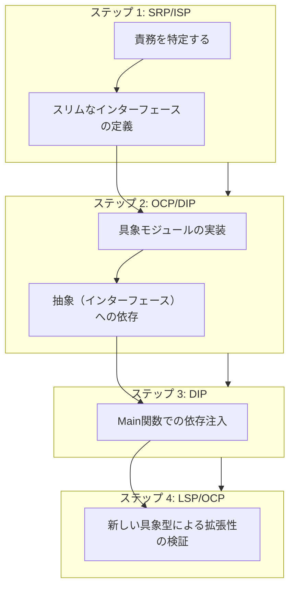
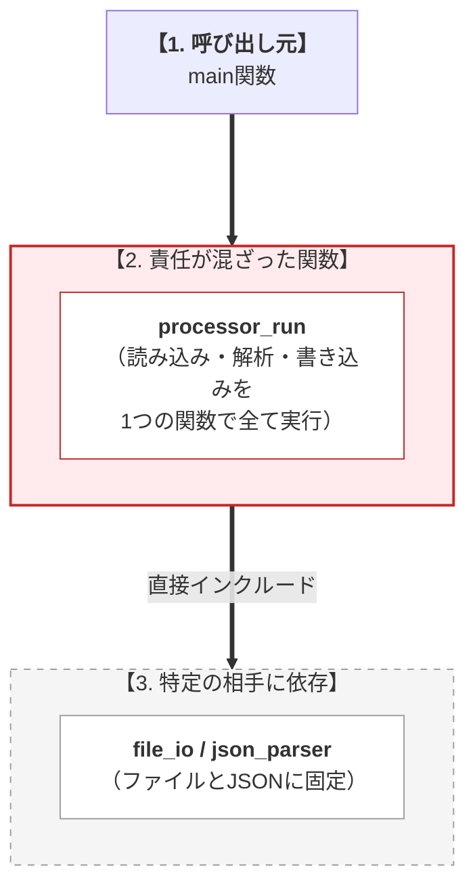
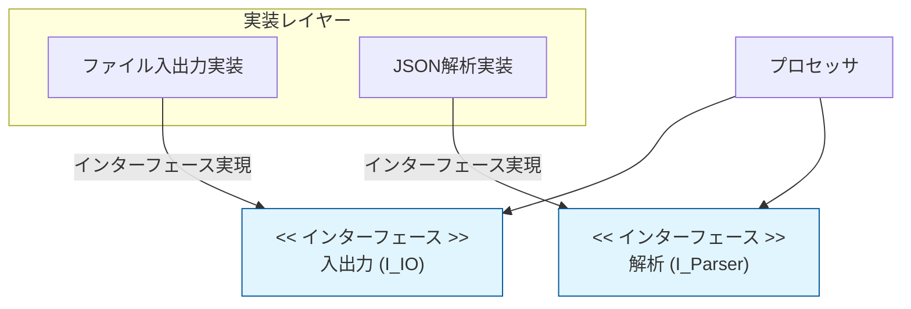

# 第2部 第13章 統合実践（基本）

## 〜バラバラだった原則が、一つの線でつながる瞬間〜

この章では、これまで学んできた **SOLID原則** を全部のせして、実際のコードをリファクタリング（中身の整理）してみます。

私が設計を学んでいて一番ワクワクしたのは、バラバラに思えた原則たちが、パズルのピースがはまるように「**連鎖反応**」を起こした瞬間でした。「一つを直したら、あっちも自然と綺麗になった！」というあの感覚を、ぜひ一緒に体験してほしいと思っています。

例えば：

* **SRP**で責任を分離 → **ISP**で契約が自然と小さくなる
* **OCP**で抽象を導入 → **DIP**で依存の逆転が容易になる

この章では、この連鎖をステップごとに体験します。

本書の核となる思想を実践します。すなわち、**第2部で学んだ原則（指針）**を、**第1部で習得したC言語の道具（技術）**（関数ポインタ、構造体設計など）を使って、**保守性や拡張性という目的（価値）**に結びつけます。

この章が担う設計の **三本柱** は、主に **依存** です。いかに **上位モジュール** から **下位の具象実装への依存** を断ち切るかが焦点になります。

## 1. 統合実践の目的：原則たちの「チームプレイ」を見る

SOLID原則って、一つひとつを個別に覚えるのは大変ですよね。でも実は、彼らはとても仲の良いチームのようなものだと私は感じています。

* **S（単一責任）**で仕事を分けると、**I（インターフェース分離）**で交わす約束がシンプルになります。
* **O（開放閉鎖）**で「後から足せる」ように作ると、自然と**D（依存性逆転）**の形になって、上下関係がスッキリします。

今回は「**Simple Processor**（シンプルな処理機）」という、少し泥臭いコードを題材にします。これをステップバイステップで、美しく、そして「後で自分が楽になれる」コードに育てていきましょう。

### リファクタリングのロードマップ

**この図が示すもの**:
本章で実施するリファクタリングの4段階のプロセスです。

**注目ポイント**:

* **順序**: まず責務（SRP）を整理し、次に抽象化（OCP/DIP）を行い、最後に構成（DIP/LSP）を整えるという「内から外へ」の流れが重要です。



### 1.1. なぜこの順序で原則を適用するのか

この順序は『内側から外側へ』という論理に基づいています。まず責任を分離（SRP）してから、その分離した責任を抽象化（OCP/DIP）し、最後に抽象の安全性を検証（LSP）します。逆順で適用すると、責任が曖昧なまま抽象化してしまい、かえって複雑になります。

| ステップ | 適用原則 | 役割と焦点 |
| --- | --- | --- |
| **ステップ1** | **SRP/ISP** | **分離**: まず「**何**」を分離すべきか明確にする（責務の明確化）。 |
| **ステップ2** | **OCP/DIP** | **抽象化**: 分離したものを「**どう**」抽象化し、具象を契約に依存させるか決める。 |
| **ステップ3** | **DIP** | **制御**: 抽象と具象を「**誰が**」結びつけるか（依存注入）を制御する。 |
| **ステップ4** | **LSP/OCP** | **検証**: 抽象の置換が「**本当に**」安全か検証し、拡張の容易さを確認する。 |

### **道具→原則→目的の視点**

SOLID原則は、目的である **保守性** や **拡張性** を達成するための **設計指針** です。この指針をC言語で実現する具体的な **道具** が、第1部で学んだ **関数ポインタ** や **構造体によるカプセル化（VTableパターン）** であり、この章でそれらを統合して利用します。

## 2. ケーススタディ：Simple Processorの設計課題

### システム概要

**目的**: 典型的なデータ処理フローを題材に、SOLID原則違反の修正プロセスを示す。
**機能**:

1. **データの読み込み/書き込み**（Input/Output）
2. **データの解析**（Parse）
3. **制御ロジック**（Control）

**アーキテクチャ**: 初期状態では全機能が単一のソースファイルに混在。

### ❌ 適用前（SOLID原則違反：巨大モジュールと具象依存）

初期設計では、すべての処理が`processor.c`に集約され、以下の **深刻な設計問題** を抱えています。

### 原則違反の構造

**この図が示すもの**:
上位モジュール（main）から下位の具象実装（FileIO/JsonParser）まで、依存関係が一直線につながってしまっている状態です。

**注目ポイント**:

* **SRP違反**: `processor_run` が大きくなりすぎています。
* **DIP違反**: 具体的なファイル名やフォーマットに直接依存しています。



### **【問題1: SRP違反】**

`processor_run`関数が、IO、Parser、制御の **3つの異なる責任** を同時に担っている。

### **【問題2: DIP違反】**

最上位の制御ロジックが、具象モジュール（`file_io.h`、`json_parser.h`）を **直接インクルード** し、密結合している。

### **【この設計で起きる実務上の問題】**

* **変更シナリオ1**: 「ネットワークIO対応」の要求が来た
→ `file_io.h`を`network_io.h`に変更し、`processor_run`関数全体を修正する必要がある
* **変更シナリオ2**: 「XMLパーサー追加」の要求が来た
→ `json_parser_parse`の呼び出しを条件分岐で切り替え、制御ロジックを修正する必要がある
* **問題の本質**: 新機能追加のたびに、**安定しているべき制御ロジック** を修正している（OCP違反）

### simple_processor.c（初期バージョン - 問題拡大版）

**設計上の課題:** 多くの責任を一人で抱え込み、具象に依存してしまっている「神クラス（God Class）」のC言語版です。


#### simple_processor.c
```c
#include "file_io.h"      // DIP違反: 具象IOモジュールに直接依存
#include "json_parser.h"  // DIP違反: 具象Parserモジュールに直接依存
#include <stdlib.h>
#include <stdio.h>
#include <string.h>

// ProcessedDataの定義
typedef struct {
    int id;
    char name[64];
} ProcessedData;

// 具象関数の前方宣言
extern char* file_io_read(const char* path);
extern ProcessedData* json_parser_parse(const char* raw_data);
extern int file_io_write(const char* path, ProcessedData* data);
```

### simple_processor.c (ロジックの混在)

**実装の問題点:** データの取得、解析、加工、出力が一つの関数に詰め込まれており、変更理由が多岐にわたります。これは典型的なSRP違反です。


#### simple_processor.c
```c
// SRP違反: IO、Parser、制御の3つの責任が混在
int processor_run(const char* input_path, const char* output_path) {
    char* raw_data = NULL;
    ProcessedData* data = NULL;
    int result = -1;

    // 1. IO（取得） - file_ioという具象を直接知っている
    printf("[Processor] 入力処理開始: %s\n", input_path);
    raw_data = file_io_read(input_path);
    if (raw_data == NULL) {
        printf("[Processor] エラー: データ読み込み失敗\n");
        goto cleanup;
    }
```

### simple_processor.c (解析責任の混入)

**責務2: ビジネスロジック:** データの解析を行っています。本来は別の層に任せるべきです。

#### simple_processor.c
```c
    // 2. Parser（処理） - json_parserという具象を直接知っている
    printf("[Processor] データ解析開始\n");
    data = json_parser_parse(raw_data);
    free(raw_data);
    raw_data = NULL;
    if (data == NULL) {
        printf("[Processor] エラー: データ解析失敗\n");
        goto cleanup;
    }
```

### simple_processor.c (出力責任の混入と終了処理)

**責務3: 出力処理:** ファイルへの書き込みを行っています。単一の関数が多すぎる責任を負っています。

#### simple_processor.c
```c
    // 3. IO（出力） - file_ioという具象を直接知っている
    printf("[Processor] 出力処理開始: %s\n", output_path);
    result = file_io_write(output_path, data);
    if (result != 0) {
        printf("[Processor] エラー: データ書き込み失敗\n");
        goto cleanup;
    }

    printf("[Processor] 処理完了\n");
    result = 0;

cleanup:
    if (data) free(data);
    return result;
}

// ========================================
// 具象実装のスタブ（トレースのため残す）
// ========================================

char* file_io_read(const char* path) {
    printf("  [FileIO] ファイル '%s' から読み込み\n", path);
    return strdup("{\"id\":10, \"name\":\"InitialUser\"}");
}

int file_io_write(const char* path, ProcessedData* data) {
    printf("  [FileIO] ファイル '%s' へ書き込み: ID=%d, Name=%s\n",
           path, data->id, data->name);
    return 0;
}

ProcessedData* json_parser_parse(const char* raw_data) {
    printf("  [JsonParser] JSON解析中...\n");
    ProcessedData* data = (ProcessedData*)malloc(sizeof(ProcessedData));
    if (data == NULL) return NULL;
    
    data->id = 10;
    strcpy(data->name, "InitialUser");
    printf("  [JsonParser] 解析完了: ID=%d, Name=%s\n", data->id, data->name);
    return data;
}

// ========================================
// main関数
// ========================================

int main(void) {
    printf("=== SOLID原則違反コードの実行 ===\n\n");
    int status = processor_run("input.txt", "output.txt");
    printf("\n=== 実行結果: %s (code: %d) ===\n",
           status == 0 ? "成功" : "失敗", status);
    return status;
}
```

### 実行結果

正常に動作はしますが、内部構造は変更に対して非常に脆い状態です。

#### 実行結果
```c
=== SOLID原則違反コードの実行 ===

[Processor] 入力処理開始: input.txt
  [FileIO] ファイル 'input.txt' から読み込み
[Processor] データ解析開始
  [JsonParser] JSON解析中...
  [JsonParser] 解析完了: ID=10, Name=InitialUser
[Processor] 出力処理開始: output.txt
  [FileIO] ファイル 'output.txt' へ書き込み: ID=10, Name=InitialUser
[Processor] 処理完了

=== 実行結果: 成功 (code: 0) ===
```

## ステップ1：SRP/ISPによる責任の分離と抽象インターフェースの導入

### 設計判断のポイント

**単一責任原則 (SRP)** を適用し、以下の責任を分離します。同時に、クライアント（`processor_run`）が必要な機能のみに依存するように **インターフェース分離原則 (ISP)** を適用し、VTableを役割ごとに定義します。

### 責任の分離イメージ

**この図が示すもの**:
巨大だったプロセッサを、「入出力」「解析」「制御」の3つに分割し、それぞれをインターフェースで定義した状態です。

**注目ポイント**:

* **抽象への依存**: クライアントは具体的な `FileIO` や `JsonParser` ではなく、抽象的な `I_IO` や `I_Parser` に依存するようになります。



| 分離前の状態 | 分離後の構成（責務の抽出） | 適用される原則 |
| --- | --- | --- |
| **`processor_run` がすべての責任を持つ** | **IO責任**: `IIO` インターフェース | **SRP / ISP** |
| (実装詳細に依存した密結合な巨大関数) | **Parser責任**: `IParser` インターフェース | **SRP / ISP** |
| (全ての変更の影響を直接受ける) | **制御責任**: `processor_run` (抽象のみに依存) | **SRP / DIP** |

この分離により、各責任の **変更理由** が明確になります：

* IOの変更理由：「データの読み書き方法が変わる」
* Parserの変更理由：「データフォーマットが変わる」
* Processorの変更理由：「処理の順序が変わる」

### 3.2. 抽象インターフェースの定義

### processed_data.h（共通データ型の定義）

モジュール間で共有されるデータ構造体（Value Object）の定義です。依存関係の基点となります。

#### processed_data.h
```c
#ifndef PROCESSED_DATA_H
#define PROCESSED_DATA_H

// 共通データ構造：全モジュールで共有（Value Object）
typedef struct {
    int id;
    char name[64];
} ProcessedData;

#endif // PROCESSED_DATA_H
```

### i_io.h（IO抽象契約）

入出力操作の抽象インターフェース定義です。`IIO`構造体とVTableを通じて、具体的なIO処理を抽象化します。

#### i_io.h
```c
#ifndef I_IO_H
#define I_IO_H

#include "processed_data.h"

// 前方宣言（不完全型）
typedef struct IIO IIO;
typedef struct IIOVTable IIOVTable;

// VTable構造体の定義
struct IIOVTable {
    // データの読み込み責任（戻り値は呼び出し側で解放が必要）
    char* (*read)(void* self, const char* path);
    // データの書き込み責任
    int (*write)(void* self, ProcessedData* data);
    // インスタンス破棄の責任
    void (*destroy)(void* self);
};

// 抽象インターフェース構造体
struct IIO {
    const IIOVTable* vtable; // const推奨
    void* self;  // 具象データへの不透明ポインタ
};

/* 抽象API：VTableを隠蔽し、安全な破棄を保証する */
char* io_read(IIO* io, const char* path);
int io_write(IIO* io, ProcessedData* data);
void io_destroy(IIO* io);

#endif // I_IO_H
```

### i_io.c（IO抽象APIの実装）

抽象IOインターフェースのラッパー関数実装です。VTable経由で具象メソッドを呼び出すことで、多態性を実現します。

#### i_io.c
```c
#include "i_io.h"
#include <stdlib.h>

char* io_read(IIO* io, const char* path) {
    if (!io || !io->vtable || !io->vtable->read) return NULL;
    return io->vtable->read(io->self, path);
}

int io_write(IIO* io, ProcessedData* data) {
    if (!io || !io->vtable || !io->vtable->write) return -1;
    return io->vtable->write(io->self, data);
}

void io_destroy(IIO* io) {
    if (!io) return;
    if (io->vtable && io->vtable->destroy) {
        io->vtable->destroy(io->self);
    }
    free(io);
}
```

### i_parser.h（Parser抽象契約）

データ解析の抽象インターフェース定義です。解析結果（`ProcessedData`）の生成と破棄の責任を定義します。

#### i_parser.h
```c
#ifndef I_PARSER_H
#define I_PARSER_H

#include "processed_data.h"

// 前方宣言
typedef struct IParser IParser;
typedef struct IParserVTable IParserVTable;

// VTable構造体の定義
struct IParserVTable {
    // 解析責任：raw_dataを解析し、構造体を生成して返す
    ProcessedData* (*parse)(void* self, const char* raw_data);
    // データ解放責任：このパーサーが生成したデータの解放方法を知っている
    void (*free_data)(void* self, ProcessedData* data);
    // インスタンス破棄責任
    void (*destroy)(void* self);
};

// 抽象インターフェース構造体
struct IParser {
    const IParserVTable* vtable; // const推奨
    void* self;  // 具象データへの不透明ポインタ
};

/* 抽象API */
ProcessedData* parser_parse(IParser* parser, const char* raw_data);
// 重要：生成したパーサー自身にデータを解放させる（対になる操作）
void parser_free_data(IParser* parser, ProcessedData* data);
void parser_destroy(IParser* parser);

#endif // I_PARSER_H
```

### i_parser.c（Parser抽象APIの実装）

抽象Parserインターフェースの実装です。解析だけでなく、データの解放責任もカプセル化しています。

#### i_parser.c
```c
#include "i_parser.h"
#include <stdlib.h>

ProcessedData* parser_parse(IParser* parser, const char* raw_data) {
    if (!parser || !parser->vtable || !parser->vtable->parse) return NULL;
    return parser->vtable->parse(parser->self, raw_data);
}

void parser_free_data(IParser* parser, ProcessedData* data) {
    if (!parser || !data) return;
    // 具象実装が解放ロジックを提供している場合のみ実行
    if (parser->vtable && parser->vtable->free_data) {
        parser->vtable->free_data(parser->self, data);
    } else {
        // デフォルト解放（標準的なmallocの場合）
        free(data);
    }
}

void parser_destroy(IParser* parser) {
    if (!parser) return;
    if (parser->vtable && parser->vtable->destroy) {
        parser->vtable->destroy(parser->self);
    }
    free(parser);
}
```

### 3.3. Processorの抽象依存への変更

制御ロジックの公開ヘッダです。具象型への依存を排除し、抽象インターフェースのみを受け取る関数シグネチャになっています。

#### processor.h
```c
#ifndef PROCESSOR_H
#define PROCESSOR_H

#include "i_io.h"
#include "i_parser.h"

// 抽象契約：Processorの公開API
// SRP遵守: 制御フローの責任のみを持つ
// DIP遵守: 抽象インターフェースのみに依存
int processor_run(IIO* io, IParser* parser);

#endif // PROCESSOR_H
```

### processor.c（カプセル化とDIPを両立した制御レイヤー）

SRPに基づき制御ロジックのみに集中した実装です。DIにより注入された抽象オブジェクトを利用して処理フローを構築します。

#### processor.c
```c
#include "processor.h"
#include <stdlib.h>
#include <stdio.h>

int processor_run(IIO* io, IParser* parser) {
    char* raw_data = NULL;
    ProcessedData* data = NULL;
    int result = -1;

    if (!io || !parser) return -1;

    // 1. データの取得
    printf("[Processor] 入力処理開始\n");
    raw_data = io_read(io, "input");
    if (!raw_data) {
        printf("[Processor] エラー: 読み込み失敗\n");
        return -1;
    }

    // 2. データの解析
    printf("[Processor] データ解析開始\n");
    data = parser_parse(parser, raw_data);
    free(raw_data); // 具象が作成した文字列の解放

    if (!data) {
        printf("[Processor] エラー: 解析失敗\n");
        return -1;
    }

    // 3. データの出力
    printf("[Processor] 出力処理開始\n");
    result = io_write(io, data);

    // 4. データの破棄：型を知っているParserに依頼する（重要：LSP/SRPの観点）
    parser_free_data(parser, data);

    if (result == 0) printf("[Processor] 処理完了\n");
    return result;
}
```

## ステップ2：OCP/ISPによる抽象化とDIPの実現

このステップでは、具象モジュール（実際の実装）が抽象契約を「実装」するフェーズへと移ります。ここでは3つの設計原則に基づいた重要な判断を行っています。

### 1. 開放閉鎖原則 (OCP) の達成

新しい入出力方式や解析フォーマットが必要になっても、利用側である `processor.c` を書き換える必要はありません。新しい実装を追加するだけで機能拡張ができる、**「拡張に開かれ、修正に閉じている」**状態を実現します。

### 2. インターフェース分離原則 (ISP) の適用

入出力の契約（`IIO`）と解析の契約（`IParser`）を明確に分離しました。これにより、解析処理しか必要としないクライアントに対して、無関係な入出力用のメソッドへの依存を強制させない「必要最小限の契約」を提供します。

### 3. 依存性逆転原則 (DIP) の完遂

これまでのように上位モジュールが下位モジュールに合わせるのではなく、具象モジュール側が「抽象契約」に合わせて自分を適合させます。依存の向きが逆転し、ビジネスロジックが詳細な実装（ファイル操作や特定のデータ形式）から完全に解放されます。

### 具象IOモジュールの実装

### file_io_impl.h

ファイルIOを行う具象クラスのファクトリ関数宣言です。

#### file_io_impl.h
```c
#ifndef FILE_IO_IMPL_H
#define FILE_IO_IMPL_H

#include "i_io.h"

// ファクトリ関数：FileIOの具象インスタンスを生成
IIO* file_io_create(void);

#endif // FILE_IO_IMPL_H
```

### file_io_impl.c
ファイルシステムへの読み書きを行う具体的な実装です。`IIO`インターフェースの契約に従って実装されています。

#### file_io_impl.c
```c
#include "file_io_impl.h"
#include "processed_data.h"
#include <stdlib.h>
#include <string.h>
#include <stdio.h>

// 具象データ構造（FileIO固有の状態）
typedef struct {
    int dummy;  // 実際にはファイルハンドルなどを保持
} FileIOData;

// 具象実装：readメソッド
static char* file_io_read_impl(void* self, const char* path) {
    (void)self; // 警告抑制
    printf("  [FileIO] ファイル '%s' から読み込み\n", path);
    return strdup("{\"id\":10, \"name\":\"FileUser\"}");
}

// 具象実装：writeメソッド
static int file_io_write_impl(void* self, ProcessedData* data) {
    (void)self; // 警告抑制
    printf("  [FileIO] ファイルへ書き込み: ID=%d, Name=%s\n", data->id, data->name);
    return 0;
}
```

リソース解放の実装と、VTableの定義です。

#### file_io_impl.c (続き)
```c
// 具象実装：destroyメソッド
static void file_io_destroy_impl(void* self) {
    if (self) {
        printf("  [FileIO] リソース解放\n");
        free(self);
    }
}

// 具象VTable
static IIOVTable file_io_vtable = {
    .read = file_io_read_impl,
    .write = file_io_write_impl,
    .destroy = file_io_destroy_impl
};

// ファクトリ関数：具象インスタンスの生成
IIO* file_io_create(void) {
    // 具象データの確保
    FileIOData* file_data = (FileIOData*)malloc(sizeof(FileIOData));
    if (file_data == NULL) return NULL;
    file_data->dummy = 0;

    // 抽象インスタンスの確保
    IIO* io = (IIO*)malloc(sizeof(IIO));
    if (io == NULL) {
        // 安全性: 片方の確保に失敗したら、もう片方も解放してNULLを返す（アトミックな生成）
        free(file_data);
        return NULL;
    }

    // 依存注入/結合：抽象契約に具象実装をリンク（DIP実現）
    io->vtable = &file_io_vtable;
    io->self = file_data;

    return io;
}
```

### 具象Parserモジュールの実装

### json_parser_impl.h

JSON解析を行う具象クラスのファクトリ関数宣言です。

#### json_parser_impl.h
```c
#ifndef JSON_PARSER_IMPL_H
#define JSON_PARSER_IMPL_H

#include "i_parser.h"

// ファクトリ関数：JsonParserの具象インスタンスを生成
IParser* json_parser_create(void);

#endif // JSON_PARSER_IMPL_H
```

### json_parser_impl.c
JSON形式のデータを解析する具体的な実装です。メモリアロケーションとデータの生成を行います。

#### json_parser_impl.c
```c
#include "i_parser.h"
#include "processed_data.h"
#include <stdlib.h>
#include <string.h>
#include <stdio.h>

// 具象データ構造（JsonParser固有の状態）
typedef struct {
    int dummy;  // 実際にはパーサー設定などを保持
} JsonParserData;

// 具象実装：parseメソッド
static ProcessedData* json_parser_parse_impl(void* self, const char* raw_data) {
    (void)self;
    printf("  [JsonParser] JSON解析中...\n");
    
    // 実際にはJSON解析ライブラリを使用
    ProcessedData* data = (ProcessedData*)malloc(sizeof(ProcessedData));
    if (data == NULL) return NULL;

    // 仮の解析処理
    data->id = 20;
    strcpy(data->name, "FileUser_A");
    
    printf("  [JsonParser] 解析完了: ID=%d, Name=%s\n", data->id, data->name);
    return data;
}
```

データ解放とリソース解放の実装、VTableの定義です。

#### json_parser_impl.c (続き)
```c
// 具象実装：free_dataメソッド
static void json_parser_free_data_impl(void* self, ProcessedData* data) {
    (void)self;
    if (data) {
        printf("  [JsonParser] データ解放\n");
        free(data);
    }
}

// 具象実装：destroyメソッド
static void json_parser_destroy_impl(void* self) {
    if (self) {
        printf("  [JsonParser] リソース解放\n");
        free(self);
    }
}

// 具象VTable
// DIP遵守: 具象が抽象契約（IParserVTable）に依存
static IParserVTable json_parser_vtable = {
    .parse = json_parser_parse_impl,
    .free_data = json_parser_free_data_impl,
    .destroy = json_parser_destroy_impl
};

// ファクトリ関数
IParser* json_parser_create(void) {
    JsonParserData* parser_data = (JsonParserData*)malloc(sizeof(JsonParserData));
    if (parser_data == NULL) return NULL;
    parser_data->dummy = 0;

    IParser* parser = (IParser*)malloc(sizeof(IParser));
    if (parser == NULL) {
        free(parser_data);
        return NULL;
    }

    parser->vtable = &json_parser_vtable;
    parser->self = parser_data;

    return parser;
}
```