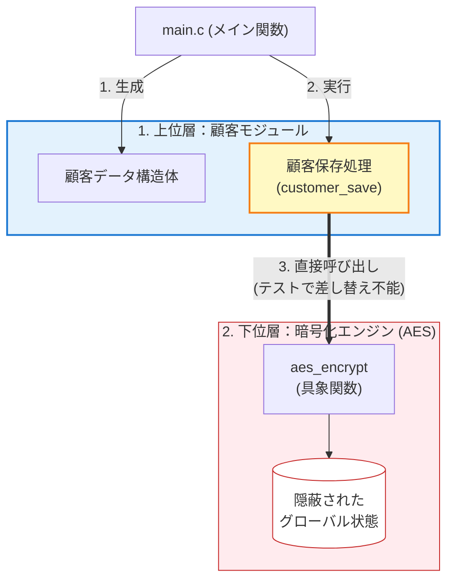
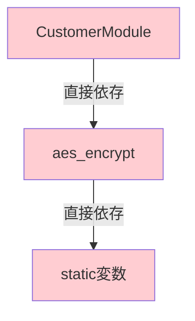
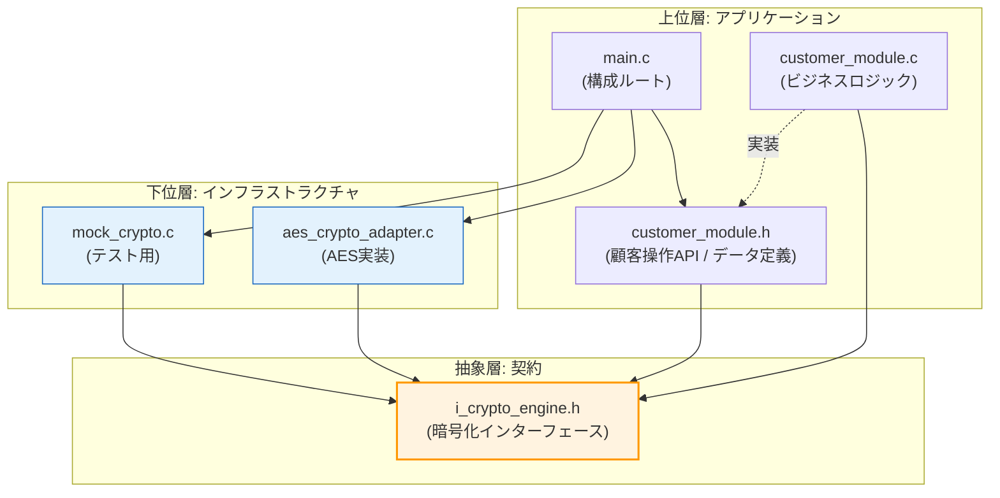

#### このマクロがもたらす利点
| 利点 | 説明 |
| --- | --- |
|  **コード量の削減**  | 50行以上のコードが2行に圧縮される |
|  **一貫性の保証**  | すべての実装が同じ構造を持つことが保証される |
|  **保守性の向上**  | 構造変更時、マクロの定義を1箇所修正するだけで全実装に反映される |
|  **タイプミスの防止**  | コピー＆ペーストによるミスが発生しない |
|  **拡張の容易性**  | 新しいプロセッサを追加する際、1行追加するだけで完了 |

#### 設計上の注意点

 **✅ マクロを使うべき場合** : 複数の実装が同じパターンに従う場合。ボイラープレートコードが多い場合。一貫性を保証したい場合。
 **❌ マクロを避けるべき場合** : 各実装が大きく異なるロジックを持つ場合。デバッグが困難になる複雑なマクロ。可読性を著しく損なう場合。

#### 実際の使用例

新しいプロセッサ（例：`encryptor`）を追加する場合：

#### Macro_Usage_Example.c

クライアント側では、通常通り使用できます： マクロ `DEFINE_PROCESSOR` を定義し、新しいプロセッサの実装追加を効率化します。マクロによって実装の詳細（VTableの接続や構造体の確保）が隠蔽され、利用者は「プロセッサを作成する」という意図だけに集中できます。

これにより、定型的な実装ミスを防ぎつつ、可読性の高いクライアントコードを実現しています。拡張性と保守性が大幅に向上します。

#### Macro_Usage_Example.c
```c
// たった1行追加するだけ
DEFINE_PROCESSOR(encryptor, "Encrypted")
// これだけで以下がすべて自動生成される：
// - encryptor_impl()
// - encryptor_destroy()
// - encryptor_vtable
// - encryptor_processor_create()
```

#### Client_Usage_Example.c

このマクロは、C言語における **メタプログラミング** の一例であり、VTableパターンの「型安全性」を保ちながら、 **コード生成を自動化** する強力な手法です。適切に使用することで、保守性と拡張性を大幅に向上させることができます。

ただし、マクロはデバッグが難しくなる側面もあるため、 **パターンが明確に定まっている場合** にのみ使用し、複雑なロジックは通常の関数として実装することを推奨します。

生成された `encryptor_processor_create` 関数を使用してプロセッサをインスタンス化し、利用します。クライアントコードは、マクロの背後にある複雑なVTable構造を意識することなく、標準的な関数呼び出しとして利用できます。

シンプルで直感的なAPIが提供されています。

#### Client_Usage_Example.c
```c
IProcessor* enc = encryptor_processor_create();
char* result = processor_execute(enc, "data");
// result = "Encrypted(data)"
```

### この設計の真価：5つ以上の処理への拡張

この設計の素晴らしさは、処理が増えても **パイプラインのコード（`pipeline_processor.c`）を一切変更する必要がない** 点にあります。

#### 実例：5つの処理を自由に組み合わせる

マクロで定義したプロセッサを組み合わせ、実行順序を自由に変更するパイプライン処理のデモです。`pipeline_processor.c`を変更することなく、`main`関数内の配列定義だけで振る舞いを変えています。

パイプラインの実装自体は、個々のプロセッサの具体的内容を知りません（オープン・クローズド原則）。`main`関数内でプロセッサの組み合わせや順序を自由に決定できるため、再コンパイルなしでシステムの振る舞いを構成変更（Configuration）レベルで制御可能になります。

柔軟性が極めて高く、要件変更に強い設計です。

#### flexible_pipeline_demo.c
```c
/* 必要なヘッダのインクルード */
#include "i_processor.h"
#include <stdio.h>
#include <stdlib.h>
#include <string.h>

/* VTableの定義（マクロで使用するため必要） */
typedef struct {
    char* (*process)(void* self, const char* input_data);
    void (*destroy)(void* self);
} IProcessorVTable;

/* マクロの定義（concrete_processors.c と同様のものを再掲） */
#define DEFINE_PROCESSOR(name, label) \
\
typedef struct { int dummy; } name##_data_t; \
static char* name##_impl(void* self, const char* input) { \
    (void)self; \
    char buf[256]; \
    sprintf(buf, "%s(%s)", label, input); \
\
    return strdup(buf); \
} \
static void name##_destroy(void* self) { free(self); } \
static IProcessorVTable name##_vtable = { name##_impl, name##_destroy }; \
IProcessor* name##_processor_create(void) { \
    /* 不完全型のため、専用関数で確保 */ \
    IProcessor* p = processor_alloc(); \
    name##_data_t* d = malloc(sizeof(name##_data_t)); \
\
    if (!p || !d) { free(p); free(d); return NULL; } \
    /* メンバ設定（内部構造を知っている前提でキャスト） */ \
    ((struct { IProcessorVTable* v; void* s; }*)p)->v = &name##_vtable; \
    ((struct { IProcessorVTable* v; void* s; }*)p)->s = d; \
\
    return p; \
}
/* 既存のプロセッサ（Filter, Compressor）はヘッダ経由で利用するため再定義しない */
/* 新しいプロセッサのみをここで追加定義 */
DEFINE_PROCESSOR(encryptor, "Encrypted")
DEFINE_PROCESSOR(validator, "Validated")
DEFINE_PROCESSOR(logger, "Logged")
// マクロで生成された関数のプロトタイプ宣言（これがないとmainで呼べない）
IProcessor* encryptor_processor_create(void);
IProcessor* validator_processor_create(void);
IProcessor* logger_processor_create(void);
```

#### flexible_pipeline_demo.c
```c
int main(void) {
    // 各プロセッサを生成
    IProcessor* f = filter_processor_create();      // 既存（concrete_processors.c由来）
    IProcessor* c = compressor_processor_create();  // 既存
    IProcessor* e = encryptor_processor_create();   // 新規
    IProcessor* v = validator_processor_create();   // 新規
    IProcessor* l = logger_processor_create();      // 新規
    /* ========================================
     * パターン1: すべての処理を実行
     * ======================================== */
    IProcessor* procs_1[] = { f, v, c, e, l };
    IProcessor* pipe_1 = pipeline_processor_create(procs_1, 5);
    char* res1 = processor_execute(pipe_1, "Data");
    // 結果: Logged(Encrypted(Compressed(Validated(Filtered(Data)))))
    /* ========================================
     * パターン2: セキュリティ重視（暗号化を先に）
     * ======================================== */
    IProcessor* procs_2[] = { e, v, c };
    IProcessor* pipe_2 = pipeline_processor_create(procs_2, 3);
    char* res2 = processor_execute(pipe_2, "Data");
    // 結果: Compressed(Validated(Encrypted(Data)))
    /* ========================================
     * パターン3: パフォーマンス重視（圧縮を最後に）
     * ======================================== */
    IProcessor* procs_3[] = { v, f, l, c };
    IProcessor* pipe_3 = pipeline_processor_create(procs_3, 4);
    char* res3 = processor_execute(pipe_3, "Data");
    // 結果: Compressed(Logged(Filtered(Validated(Data))))
    // 【重要】 パイプラインのコードは一切変更していない！
    // (後始末のコードは省略)

    return 0;
}
```

#### 数学的な威力

 **処理が2つ** : 2! = 2通り  **処理が3つ** : 3! = 6通り  **処理が5つ** : 5! = 120通り  **処理が10つ** : 10! = 3,628,800通り 　

 **従来の設計（Bad）** : これらすべてのパターンに対して、個別の関数を書く必要があります
 **この設計（Good）** : `main` で配列の順序を変えるだけです。

#### Combinations.c

異なる順序のプロセッサ配列を定義し、様々なパイプラインパターンを表現します。処理ロジックと構成定義を分離することで、組み合わせ爆発の問題を解消しています。

無限の組み合わせを最小限のコードで実現可能です。

#### Combinations.c
```c
// 120通りのパターンすべてに対応できる
IProcessor* pattern_A[] = { e, v, f, c, l };  // パターン1
IProcessor* pattern_B[] = { l, c, f, v, e };  // パターン2
IProcessor* pattern_C[] = { v, e, l, f, c };  // パターン3
// これ以外の組み合わせも自由に定義可能です
```

### 実務での応用例

#### **画像処理パイプライン:**

 **設定の記述** : `main` 関数などで、それぞれのパイプライン構成を定義するコードです。順序や組み合わせを一目で理解できます。

`main` 関数などで、それぞれのパイプライン構成を定義する実務的な例です。用途（サムネイル、印刷、Web）ごとに異なる処理フローを、オブジェクトの再利用によって効率的に定義しています。

各処理器は単一責任に徹しており、それらを組み合わせる責任はクライアント側（アプリケーション層）に委譲されています。ビジネス要件ごとのパイプライン構築が容易です。

#### Image_Pipeline.c
```c
IProcessor* リサイズ = resize_processor_create();
IProcessor* フィルタ = filter_processor_create();
IProcessor* 透かし = watermark_processor_create();
IProcessor* 圧縮 = compress_processor_create();
IProcessor* 最適化 = optimize_processor_create();
// サムネイル生成用
IProcessor* thumbnail[] = { リサイズ, 圧縮 };
// 印刷用高品質
IProcessor* print[] = { 最適化, フィルタ, 透かし };
// Web公開用
IProcessor* web[] = { リサイズ, フィルタ, 透かし, 圧縮, 最適化 };
```

#### **データ分析パイプライン:**

データ分析の分野でも、前処理（正規化、外れ値除去など）の順序を実験的に変える際、この設計が威力を発揮します。データ分析の前処理フローを定義します。

データサイエンスのワークフローでは、試行錯誤（Experimentation）が頻繁に行われます。パイプライン構築をコード（コンパイル単位）として分離することで、ロジック本体には影響を与えずに実験的なフローを即座に試せるアジリティが得られます。

実験と本番適用の切り替えがスムーズに行えます。

#### Data_Analysis_Pipeline.c
```c
IProcessor* 正規化 = normalize_processor_create();
IProcessor* 外れ値除去 = outlier_processor_create();
IProcessor* 特徴抽出 = feature_processor_create();
IProcessor* 次元削減 = dimreduce_processor_create();
IProcessor* 分類 = classify_processor_create();
// 探索的分析用
IProcessor* explore[] = { 正規化, 外れ値除去, 特徴抽出 };
// 本番モデル用
IProcessor* production[] = { 正規化, 外れ値除去, 特徴抽出, 次元削減, 分類 };
```

#### 最後に：なぜここまでして「柔軟性」を求めるのか

正直に言うと、最初は「ちょっとやりすぎかな？」と感じるかもしれません。

でも、この設計の真価は **「未来の自分へのプレゼント」** になります。一度仕組みを作ってしまえば、`pipeline_processor.c`という一番複雑な場所は **もう二度と触らなくていい** んです。

新しい処理が増えても、マクロで1行足して、`main`で並び順を変えるだけです。「昨日の自分、いい仕事したな！」とニヤリとできる。そんな設計の楽しさを感じてもらえたら嬉しいです。

####  **原則適用前の限界** 

新しい順序パターンが必要になるたびに、関数を追加または修正処理が5つになると、120通りの関数が必要になります（事実上不可能）。既存コードへの変更が避けられず、バグ混入リスクが常に存在します。テストケースも組み合わせ数だけ必要になり、保守不可能です。

####  **原則適用後の自由** 

制御ロジック（`pipeline_processor.c`）は一度書いたら二度と触る必要がなく、`main` で部品をどう並べるかという「設定」だけで振る舞いを変えられる（ **拡張の自由** ）。

#### Comparison.c

この対比から、VTableや不透明ポインタという「一見複雑な道具」が、いかに大規模開発での保守を楽にするかがわかります。

Goodパターン（`pipeline_processor.c`の再利用）とBadパターン（関数追加）の比較コードです。VTableと不透明ポインタによる抽象化が、実際のコード変更コストを解消することを示しています。

設計投資の回収効果が明確に分かります。

#### Comparison.c
```c
// この1つのファイルだけで、無限の組み合わせに対応
pipeline_processor.c  // ← 一度書いたら変更不要
// 新しい処理の追加も簡単
DEFINE_PROCESSOR(new_process, "NewProcessed")  // ← 1行追加
// 順序の変更も簡単
IProcessor* pattern[] = { 新処理, 既存処理A, 既存処理B };  // ← 配列の順序を変えるだけ
```

#### トレードオフの正直な議論

本章で見てきた通り、SOLID原則を適用した「Good」な設計は、変更に対して極めて強靭です。しかし、代償がないわけではありません。

#### コストとリターンの比較
| 要素 | 原則適用前 | 原則適用後 |
| --- | --- | --- |
|  **ファイル数**  | 1ファイル | 5ファイル以上 |
|  **コード行数**  | 30行程度 | 150行程度 |
|  **実装時間**  | 30分 | 2-3時間 |
|  **学習曲線**  | なだらか | 急峻（VTable、不透明ポインタの理解が必要） |
|  **変更コスト**  | 高い（毎回コード修正） | 極めて低い（設定変更のみ） |
|  **拡張性**  | なし（組み合わせ爆発） | 無限（任意の組み合わせに対応） |
|  **保守性**  | 低い（影響範囲が広い） | 高い（変更が局所化） |

#### いつこの設計を選ぶべきか

 **採用を推奨する場面:**   
- 処理の順序が **頻繁に変わる** ことが予想される 
- 処理の種類が **3つ以上** になる可能性がある 
- 複数の **組み合わせパターン** を同時にサポートする必要がある 
- 長期間 **保守** されるシステムである 

シンプルな設計で十分な場面: 
処理の順序が **固定** されており、変更の予定がない 処理が **2つ以下** で、組み合わせも限定的 使い捨て **のスクリプトやプロトタイプ 開発期間が** 極めて短い（数日程度）。

#### 知っておいて損はない、実践で活用できる設計

 **重要なポイント:** この設計パターンは、単なる理論ではありません。実務で「処理の順序が変わりやすい」場面に遭遇したときに、 **すぐに適用できる具体的な解決策** です。

実務での典型的な場面：
-  **データ処理パイプライン** : ETL（抽出・変換・読み込み）処理で、変換ステップの順序や種類が頻繁に変わる
-  **画像処理** : リサイズ、フィルタ、透かし、圧縮などの処理順序が用途によって変わる
-  **ミドルウェア** : HTTPリクエストの処理で、認証・ログ・検証などの順序を柔軟に変えたい
-  **ビルドシステム** : コンパイル、最適化、テスト、パッケージングなどのステップを状況に応じて組み合わせる

この設計の汎用性：
5つ、10個、あるいはそれ以上の処理があっても、今回学んだ仕組みなら **すべて対応できます** 。処理の数が増えるほど、この設計の価値は指数関数的に高まります。

学習投資のリターン：
-  **初期の学習コスト** : 2-3時間
-  **一度理解すれば** : 同様の問題に何度でも適用可能
-  **長期的な時間節約** : 無数の関数を書く必要がなくなる
-  **品質向上** : 既存コードを触らないため、バグ混入リスクが激減

実践での心構え：
「今はシンプルだけど、将来複雑になるかもしれない」と感じたら、この設計を検討してください。特に、 **処理の順序や組み合わせが変わりやすい** と少しでも予感したら、最初からこの設計を採用することを強く推奨します。

後から設計を変更するコストは、最初から適切な設計を選ぶコストの数倍になることを、実務経験豊富なエンジニアなら誰もが知っています。

## 課題2：外部リソースへの依存管理とテスト容易性の確保

この課題では、 **グローバル変数への直接依存** という実務で頻出する問題を、 **抽象インターフェースへの依存性注入** で解決します。課題1が「処理の順序」の柔軟性に焦点を当てたのに対し、課題2は「外部リソースの切り替え」の柔軟性に焦点を当てます。

#### 本章の目的と学習ポイント

-  **DIP（依存性逆転原則）** を徹底的に理解する
-  **テスト容易性** を実現する具体的な手法を学ぶ
-  **グローバル依存** から **注入による依存** への構造変化を体得する

　**三本柱での位置づけ：** 
-  **依存** : グローバル変数から抽象インターフェースへ（DIP）
-  **契約** : 暗号化インターフェースの定義と保証（ISP）
-  **責任** : 顧客モジュールは暗号化の実装を知らない（SRP）

#### 実務での問題状況：なぜ「テスト」が書けなくなるのか

具体的なケースで考えてみましょう。例えば、顧客データ管理システムにおいて、クレジットカード番号を暗号化して保存する機能を実装するとします。

 **現場からの要求:**  
 **本番環境** : 実際のAES暗号化エンジンを使用して、セキュアに保存したい。 

 **テスト環境** : 実際の暗号化（重い処理や特殊なハードウェア依存）は行わず、単に「暗号化関数が正しい引数で呼ばれたか」だけを素早く検証したい。

一見シンプルですが、工夫なしに書くと「本番は動くがテストが書けない」というジレンマに陥ります。 

 **現実の問題:** ヘッダで定義されたインターフェースの具体的な実装を行います。

密結合な設計における、外部実装（AES）が生み出す「テストの壁」の実例です。

#### test_impossible_example.c
```c
// テストコード

void test_customer_save() {
    CustomerModule* cm = customer_module_create();
    CustomerData data = {"田中太郎", "1234-5678-9012-3456"};
    customer_save(cm, &data);
    // 【問題】
    // - 本物のAESエンジンが動いてしまう
    // - 暗号化が呼ばれたか確認できない
    // - 正しい引数で呼ばれたか確認できない
    // - テストの実行に時間がかかる
}
```

### 原則適用前の構造（DIP違反）

#### 依存の壁

顧客モジュール（上位）が、特定の暗号化実装（下位）に直接依存してしまっている状態です。テストの壁**: `customer_save` が `aes_encrypt` を直接呼んでいるため、ここをモックに差し替える隙間がありません。



#### コード実装

グローバル変数`is_aes_initialized`に依存し、`aes_encrypt`という具象関数を直接定義してしまっている悪い例です。

（悪い例）手軽に実装できますが、モジュール間の密結合を招いています。このような密結合は、単体テストを困難にし、システムの一部だけを切り出して再利用することを不可能にします。

密結合な設計における、外部実装（AES）が生み出す「テストの壁」の実例です。

#### bad_implementation.c
```c
/* ========================================
 * 具象的なAESエンジン（問題の根源）
 * ======================================== */
#include <stdio.h>
#include <string.h>
#include <stdlib.h>
// 内部に隠蔽されたグローバル状態（テスト時にリセットや制御ができない）
static int is_aes_initialized = 0;
// 具象関数：特定の暗号化処理を行う

char* aes_encrypt(const char* plain_text) {
    // 隠れた依存：グローバルな状態に勝手に依存している
    if (!is_aes_initialized) {
        printf("  [AES] 初期化処理を実行...\n");
        is_aes_initialized = 1;
    }
    char buf[256];
    sprintf(buf, "[AES]%s", plain_text);
    printf("  [AES] 実際の暗号化処理中...\n");

    return strdup(buf);
}
/* ========================================
 * 顧客モジュール（特定の関数に直接依存）
 * ======================================== */
typedef struct CustomerModule CustomerModule;
typedef struct {
    char name[100];
    char credit_card[20];
} CustomerData;
struct CustomerModule {
    int dummy;
};

CustomerModule* customer_module_create(void) {
    // 【問題】 生成時には依存が見えない（何が必要か不明）
    CustomerModule* self = malloc(sizeof(CustomerModule));

    return self;
}

void customer_save(CustomerModule* self, CustomerData* data) {
    // 【致命的な問題】
    // 特定の関数 `aes_encrypt` を直接呼び出しているため、
    // テスト時にモック関数へ差し替えることが絶対にできない。
    char* encrypted = aes_encrypt(data->credit_card);
    printf("  [CustomerModule] 保存: %s\n", encrypted);
    free(encrypted);
}
```

### 問題点の詳細分析

### 1.  **テスト不可能性** 

 **テスト失敗の例:**  以下のコードは、本物の暗号化ロジックが強制的に動いてしまうため、単体テストとして機能しません。本物の暗号化ロジックが強制的に動いてしまうため、単体テストとして機能しない失敗例です。

（悪い例）関数名 `aes_encrypt` がハードコードされており、依存関係を制御できません。副作用を伴うため、検証不能なコードとなっています。

#### test_failure.c
```c
void test_customer_save() {
    CustomerModule* cm = customer_module_create();
    CustomerData data = {"Test", "1234-5678"};
    // ここで customer_save を呼ぶと、強制的に本物の `aes_encrypt` が動く。
    // 「暗号化せずにテストしたい」「呼び出し回数を数えたい」と思っても不可能。
    customer_save(cm, &data);
}
```

### 2.  **依存の不可視性** 

 **使用時の混乱:**  生成関数のシグネチャ `customer_module_create(void)` だけを見ても、内部で何が必要かわからず、隠れた依存に悩まされます。

#### usage_confusion.c

 **影響:**  コードの中身を全部読まないと、何に依存しているか把握できません。再利用しようとしたとき、予期せぬライブラリへのリンクを要求されます。

生成関数のシグネチャに情報がなく、隠れた依存を持つ「悪い例」です。引数なし `void` で生成しているため、依存関係が不透明であり、利用者が正しいセットアップを行うことが困難です。

#### usage_confusion.c
```c
CustomerModule* cm = customer_module_create();
// ↑ このコードを見ても、このモジュールが裏で「AES暗号化」を使っていることは分からない
```

### 3.  **密結合** 

顧客モジュールからグローバル状態まで、依存が連鎖している様子です。



 **結果:**  暗号化方式をRSAに変えたい場合、`customer_save` のコードを直接書き換えるしかありません（OCP違反）。`aes_encrypt` の仕様変更が、顧客モジュールに直接的な影響を与えます。

### 原則適用後の構造（DIP準拠）

#### 全体構造図（ファイル構成と依存関係）

物理的なファイル構成と、論理的な依存の流れを示しています。依存の逆転**: `customer_module` が `aes_adapter`（具象）を知らず、`i_crypto_engine`（抽象）だけを見ている点に注目してください。



### ステップ1: 抽象インターフェースの定義

#### **i_crypto_engine.h（カプセル化された抽象契約）**

暗号化エンジンの抽象インターフェース定義です。 不完全型と抽象APIを用いることで、具体的な実装詳細（VTable構造体など）をクライアントから隠蔽しています。

これにより、モックオブジェクトなどの別実装への差し替え（LSP/DIP）が可能になります。インターフェースと実装が分離され、高い保守性が確保されています。

#### i_crypto_engine.h
```c
#ifndef I_CRYPTO_ENGINE_H
#define I_CRYPTO_ENGINE_H
#include <stdlib.h>

/* 利用側からは中身の見えない不完全型として定義（Service/Entity） */
typedef struct ICryptoEngine ICryptoEngine;
/* 抽象API：VTableへの直接アクセスを隠蔽し、交換可能性を担保する */
char* crypto_encrypt(ICryptoEngine* engine, const char* plain_text);
void crypto_free_encrypted(ICryptoEngine* engine, char* encrypted);
void crypto_destroy(ICryptoEngine* engine);
#endif
```

#### **i_crypto_engine_internal.h（具象実装用の内部ヘッダ）**

具象クラス（AES実装やMock実装）がVTableを定義するために必要な内部情報を公開するヘッダです。これは実装者のみが使用し、クライアントには見せません。

具象実装（AES実装やMock実装）のためにVTableを定義する内部ヘッダです。VTable構造体を使用し、関数ポインタを介して実行時に振る舞いを変更できる動的な多態性を実現します。

#### i_crypto_engine_internal.h
```c
#ifndef I_CRYPTO_ENGINE_INTERNAL_H
#define I_CRYPTO_ENGINE_INTERNAL_H
#include "i_crypto_engine.h"

/* 具象実装用にVTableと内部構造を公開 */
typedef struct {
    char* (*encrypt)(void* self, const char* plain_text);
    void (*free_encrypted)(void* self, char* encrypted);
    void (*destroy)(void* self);
} ICryptoEngineVTable;
struct ICryptoEngine {
    ICryptoEngineVTable* vtable;
    void* self;
};
#endif
```

#### **i_crypto_engine.c（抽象APIの実装）**

抽象APIの実体です。VTableを経由して具象実装（AESやMock）のメソッドを呼び出すことで、上位モジュールが具象に依存しない多態性を実現しています。安全性を高めるため、共通のNULLチェックもここで集計しています。

#### i_crypto_engine.c
```c
#include "i_crypto_engine_internal.h"

char* crypto_encrypt(ICryptoEngine* engine, const char* plain_text) {
    if (engine && engine->vtable && engine->vtable->encrypt) {
        return engine->vtable->encrypt(engine->self, plain_text);
    }

    return NULL;
}

void crypto_free_encrypted(ICryptoEngine* engine, char* encrypted) {
    if (engine && engine->vtable && engine->vtable->free_encrypted) {
        engine->vtable->free_encrypted(engine->self, encrypted);
    }
}

void crypto_destroy(ICryptoEngine* engine) {
    if (engine) {
        // 具象側のデストラクタを呼び出してから、本体を解放
        if (engine->vtable && engine->vtable->destroy) {
            engine->vtable->destroy(engine->self);
        }
        free(engine);
    }
}
```

### ステップ2: 顧客モジュールの実装（依存性注入）

顧客モジュールの公開ヘッダです。依存リソースを引数として明示的に受け取る（DI）ことで、モジュール間の疎結合を実現し、テスト容易性を確保しています。

#### customer_module.h
```c
#ifndef CUSTOMER_MODULE_H
#define CUSTOMER_MODULE_H
#include "i_crypto_engine.h"
// ロジックを持つオブジェクトは「不完全型」で隠蔽 (Service)
typedef struct CustomerModule CustomerModule;
// 単なるデータ構造は「完全型」で公開 (Value Object / DTO)
typedef struct {
    char name[100];
    char credit_card[20];
} CustomerData;
// 【重要】依存（ICryptoEngine）を引数で受け取る構造（生成時注入）
CustomerModule* customer_module_create(ICryptoEngine* crypto);
void customer_save(CustomerModule* self, CustomerData* data);
void customer_module_destroy(CustomerModule* self);
#endif
```

#### **customer_module.c（抽象APIへの依存）**

顧客モジュールの実装です。抽象APIのみを利用することで、DIP（依存性逆転原則）を遵守し、具体的な暗号化エンジンの種類に依存しないロジックを実現しています。

#### customer_module.c
```c
#include "customer_module.h"
#include <stdio.h>
#include <stdlib.h>

struct CustomerModule {
    ICryptoEngine* crypto;
};

CustomerModule* customer_module_create(ICryptoEngine* crypto) {
    if (!crypto) return NULL;
    CustomerModule* self = malloc(sizeof(CustomerModule));

    if (!self) return NULL;
    self->crypto = crypto;

    return self;
}

void customer_save(CustomerModule* self, CustomerData* data) {
    if (!self || !data) return;
    /* 修正ポイント：直接VTableを触らず、i_crypto_engine.hの抽象APIを使用 */
    char* encrypted = crypto_encrypt(self->crypto, data->credit_card);

    if (encrypted) {
        printf("  [CustomerModule] 顧客 '%s' のカード情報を保存: %s\n",
               data->name, encrypted);
        crypto_free_encrypted(self->crypto, encrypted);
    }
}

void customer_module_destroy(CustomerModule* self) {
    free(self);
}
```

### ステップ3(1): 具象実装（本番用とテスト用）

#### 本番用（AES実装）

#### **aes_crypto_adapter.h**

本番用AESエンジンのファクトリ関数宣言です。Composition Root（main）でのみこのヘッダを使用することで、他の層への具象依存の漏洩を防ぎます。

#### aes_crypto_adapter.h
```c
#ifndef AES_CRYPTO_ADAPTER_H
#define AES_CRYPTO_ADAPTER_H
#include "i_crypto_engine.h"
// AESエンジンの生成（ファクトリ関数）
ICryptoEngine* aes_crypto_create(void);
#endif
```

### ステップ3(2): 具象実装（AES実装の本体）

本番用暗号化エンジンの具象実装です。抽象インターフェース経由で呼び出されるVTableの実体を定義し、内部状態を完全にカプセル化しています。

#### aes_crypto_adapter.c
```c
#include "aes_crypto_adapter.h"
#include "i_crypto_engine_internal.h" // VTable定義のために必要
#include <stdio.h>
#include <string.h>
#include <stdlib.h> // malloc, free

typedef struct {
    int initialized;
} AESEngineData;

static char* aes_encrypt_impl(void* self, const char* plain_text) {
    AESEngineData* data = (AESEngineData*)self;

    if (!data->initialized) {
        printf("  [AES] 初期化処理を実行...\n");
        data->initialized = 1;
    }
    size_t len = strlen(plain_text) + 6; // "[AES]" + NULL
    char* buf = malloc(len);

    if (buf) {
        snprintf(buf, len, "[AES]%s", plain_text);
    }
    printf("  [AES] 実際の暗号化処理中...\n");

    return buf;
}

static void aes_free_impl(void* self, char* encrypted) {
    (void)self;
    free(encrypted);
}
// 内部データの破棄責任を持つ

static void aes_destroy_impl(void* self) {
    if (self) {
        printf("  [AES] 内部データ破棄\n");
        free(self); // AESEngineDataの解放
    }
}
// VTableの実体
static ICryptoEngineVTable aes_vtable = {
    .encrypt = aes_encrypt_impl,
    .free_encrypted = aes_free_impl,
    .destroy = aes_destroy_impl
};

ICryptoEngine* aes_crypto_create(void) {
    AESEngineData* data = malloc(sizeof(AESEngineData));

    if (!data) return NULL;
    data->initialized = 0;
    ICryptoEngine* engine = malloc(sizeof(ICryptoEngine));

    if (!engine) {
        free(data);

        return NULL;
    }
    // 抽象と具象の結合
    engine->vtable = &aes_vtable;
    engine->self = data;

    return engine;
}
```

#### テスト用（Mock実装）

#### **mock_crypto.h**

テスト用のモックエンジンを定義します。テストコードから検証用の状態データを注入・参照するためのファクトリ関数を提供します。

#### mock_crypto.h
```c
#ifndef MOCK_CRYPTO_H
#define MOCK_CRYPTO_H
#include "i_crypto_engine.h"
// テストコードと共有する状態データ
typedef struct {
    int call_count;
    char last_input[256];
} MockCryptoData;
// 状態データを外部（テスト関数）から注入するファクトリ
ICryptoEngine* mock_crypto_create(MockCryptoData* shared_data);
#endif
```

#### **mock_crypto.c**

テスト用の具象実装（Mock）です。実ロジックの代わりに呼び出し情報の記録を行うことで、ビジネスロジックの振る舞いを「事後検証」可能にします。

#### mock_crypto.c
```c
#include "mock_crypto.h"
#include "i_crypto_engine_internal.h"
#include <stdio.h>
#include <string.h>
#include <stdlib.h> // strdup, malloc, free

static char* mock_encrypt_impl(void* self, const char* plain_text) {
    MockCryptoData* data = (MockCryptoData*)self;
    data->call_count++;
    // 入力値を記録して検証可能にする
    snprintf(data->last_input, sizeof(data->last_input), "%s", plain_text);
    printf("  [Mock] 暗号化をシミュレート（実際の処理なし）\n");

    return strdup("[MOCK]encrypted");
}

static void mock_free_impl(void* self, char* encrypted) {
    (void)self;
    free(encrypted);
}

static void mock_destroy_impl(void* self) {
    // 【重要：安全設計】
    // MockCryptoDataはテスト関数側のスタック変数（または外部管理）へのポインタであるため、
    // ここで free(self) を実行してはならない（クラッシュの原因となる）。
    // これは「所有権の借用（Borrowing）」パターンである。
    (void)self;
}
static ICryptoEngineVTable mock_vtable = {
    .encrypt = mock_encrypt_impl,
    .free_encrypted = mock_free_impl,
    .destroy = mock_destroy_impl
};

ICryptoEngine* mock_crypto_create(MockCryptoData* shared_data) {
    ICryptoEngine* engine = malloc(sizeof(ICryptoEngine));

    if (!engine) return NULL;
    engine->vtable = &mock_vtable;
    engine->self = shared_data; // 外部データを参照として保持

    return engine;
}
```

### ステップ4: 本番環境とテスト環境での使用

#### 本番環境

#### **main_production.c**

本番環境の構成定義（Composition Root）です。AES具象エンジンを生成し、顧客モジュールへと「依存性の注入」を行うエントリーポイントです。

#### main_production.c
```c
#include "customer_module.h"
#include "aes_crypto_adapter.h"
#include <stdio.h>

int main(void) {
    printf("=== 本番環境 ===\n");
    // 1. 本番用の暗号化エンジンを生成
    ICryptoEngine* engine = aes_crypto_create();

    if (!engine) {
        fprintf(stderr, "暗号化エンジンの生成に失敗しました\n");
        return 1;
    }
    // 2. 依存性を注入して顧客モジュールを生成
    CustomerModule* cm = customer_module_create(engine);

    if (!cm) {
        fprintf(stderr, "顧客モジュールの生成に失敗しました\n");
        crypto_destroy(engine);
        return 1;
    }
    // 3. 使用
    CustomerData data = {"田中太郎", "1234-5678-9012-3456"};
    customer_save(cm, &data);
    // 4. リソース解放（統一されたインターフェースで破棄）
    customer_module_destroy(cm);
    crypto_destroy(engine);  // aes_crypto_destroyではなくcrypto_destroyを使用
    return 0;
}
```

#### 実行結果

本番環境では、実際のAESエンジンが使用され、暗号化処理が行われます。

#### 実行結果
```c
=== 本番環境 ===
  [AES] 実際の暗号化処理中...
  [CustomerModule] 顧客 '田中太郎' のカード情報を保存: [AES]1234-5678-9012-3456
```

#### テスト環境

#### **test_customer_module.c**

単体テストの実行例です。モックを注入することで、外部リソースなしに「顧客保存処理が正しい引数で、正しい回数呼ばれたか」を決定論的に検証します。

#### test_customer_module.c
```c
#include "customer_module.h"
#include "mock_crypto.h"
#include <stdio.h>
#include <string.h>
#include <assert.h>

void test_customer_save() {
    printf("=== テスト環境 ===\n");
    // 1. テスト用のモックデータを準備
    MockCryptoData mock_data = {0};
    // 2. モックエンジンを生成（データを共有）
    ICryptoEngine* mock = mock_crypto_create(&mock_data);

    if (!mock) {
        fprintf(stderr, "モックエンジンの生成に失敗しました\n");
        return;
    }
    // 3. 依存性を注入して顧客モジュールを生成
    CustomerModule* cm = customer_module_create(mock);
    if (!cm) {
        fprintf(stderr, "顧客モジュールの生成に失敗しました\n");
        crypto_destroy(mock);
        return;
    }
    // 4. テスト実行
    CustomerData data = {"Test User", "1234-5678-9012-3456"};
    customer_save(cm, &data);
    // 5. 【検証】 モックで記録した情報を確認
    printf("\n[検証結果]\n");
    printf("  呼び出し回数: %d\n", mock_data.call_count);
    printf("  最後の入力: %s\n", mock_data.last_input);
    assert(mock_data.call_count == 1);
    assert(strcmp(mock_data.last_input, "1234-5678-9012-3456") == 0);
    printf("  ✓ テスト成功\n");
    // 6. リソース解放（統一されたインターフェースで破棄）
    customer_module_destroy(cm);
    crypto_destroy(mock);  // mock_crypto_destroyではなくcrypto_destroyを使用
}

int main(void) {
    test_customer_save();
    return 0;
}
```

#### 実行結果

テスト環境ではモックが使用され、暗号化はシミュレートされますが、呼び出しは正しく検証できています。

#### 実行結果

この「 **DIP + 生成時注入 + Mock** 」のパターンを使えば、どんなに複雑な外部依存があっても、ビジネスロジックだけを切り出して完全にテストすることができます。もう「テストが書けない」という言い訳は通用しませんね。

#### 実行結果
```c
=== テスト環境 ===
  [Mock] 暗号化をシミュレート（実際の処理なし）
  [CustomerModule] 顧客 'Test User' のカード情報を保存: [MOCK]encrypted
[検証結果]
  呼び出し回数: 1
  最後の入力: 1234-5678-9012-3456
  ✓ テスト成功
```

## 本章で必ず理解してほしいことのまとめ

#### 実務で戦える「武器」を手に入れた

本章では、教科書的な知識ではなく、現場の「困った」を解決するための実践的なパターンを学びました。  

 **Pipelineパターン** : 処理の順序や組み合わせが頻繁に変わるなら、マクロとVTableで「設定で動く」仕組みを作る。  

 **Context/Adapterパターン** : グローバル変数への依存を断ち切り、抽象インターフェース経由でリソースを注入することで、「テスト容易性」を確保する。これらは、私がC言語開発で最も頻繁に使用し、最も助けられたパターンたちです。

#### 次章への橋渡し

いよいよ第2部の最終章です。「原則」も「パターン」も学びました。

しかし、知識として知っていることと、息をするように使いこなせることの間には壁があります。[[19_第2部 第15章：SOLID原則を「使える思考」にする|第15章：SOLID原則を「使える思考」にする]]では、これまで学んだすべての知識を統合し、設計判断を下す際の「思考プロセス」そのものを言語化します。

設計に迷ったとき、どのように考え、どの原則を選び取ればよいのか。その羅針盤をお渡しします。
