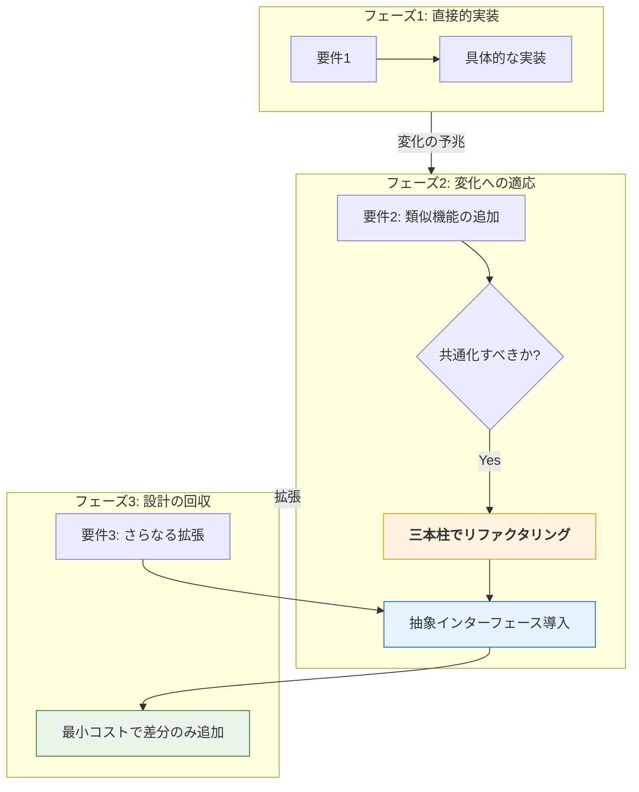

# 第2部 第15章 SOLID原則を「使える思考」にする
## 本章の位置づけ

第13章・第14章の「統合実践」で見たように、原則は単独で存在するものではなく、常にトレードオフの中にあります。本章では、現場で迷ったときに立ち返るべき「設計の三本柱」と、過剰設計を避けるための「適用戦略」について整理します。 **SOLID原則を「日々の開発で使える判断基準」として定着させること** を目的としています。

## 1. SOLIDを支える「三本柱」

本書を通じて、私たちは「C言語の道具」を使い、「SOLID原則」というガイドに従って、設計の **三本柱** を組み上げてきました。これらは以下のように密接に連動しています。

迷ったときは、個別の原則名よりも、まずこの三点を確認してください。

| 設計の柱 | 関連するSOLID原則 | 目的（究極の価値） |
| --- | --- | --- |
|  **責任 (Responsibility)**  |  **SRP**  |  **保守性** : 変更の影響範囲を1箇所に閉じ込める |
|  **契約 (Contract)**  |  **LSP / ISP**  |  **信頼性** : 利用側への保証を最小かつ堅牢にする |
|  **依存 (Dependency)**  |  **OCP / DIP**  |  **拡張性** : 既存コードを壊さずに振る舞いを変える |

SOLID原則は、これら三本柱の「強度」を高めるための具体的な **チェックリストです。** SRPが責任の所在をはっきりさせ、ISP/LSPが契約の品質を担保し、OCP/DIPが依存の向きを制御します。

この連鎖が起きたとき、C言語のコードは初めて「システム」としての柔軟性を獲得します。

## 2. 実務の迷いを断つ「自分への問いかけ」

「S・O・L・I・D」という難しい名前を思い出すのが億劫なときは、次のような「シンプルな問いかけ」を自分に投げかけてみてください。これらは、複雑な設計迷路から抜け出すためのチェックリストとなります。

#### SRP（単一責任原則）

 **問い：「別のタイミングで変わりそうなことが、混在していない？」**
 **チェック** : 計算ロジックとログ出力など、変更の動機が異なるものが混在しているなら、分割の合図です。

#### OCP（開放閉鎖原則）

 **問い：「中身を改造しなくても、外から部品を『交換』するだけで済まないかな？」**
 **チェック** : 機能追加のたびに `switch-case` を修正しているなら、VTableによる分岐（多態性）の導入を検討します。

#### LSP（リスコフ置換原則）

 **問い：「抽象（インターフェース）が約束した『当たり前』を、具象が裏切っていない？」**
 **チェック** : 「呼ぶ前に必ず初期化が必要」といった隠れた制約は、利用者を混乱させます。

#### ISP（インターフェース分離原則）

 **問い：「その人に関係のない道具まで、一つの箱に詰め込んで渡していない？」**
 **チェック** : 不要な関数が見えていると、誤用や不要な再コンパイルの原因になります。

相手に必要な最小限の窓口だけを見せましょう。

#### DIP（依存性逆転原則）

 **問い：「安定させたい上位のロジックが、変化の激しい下位（ハード・外部ライブラリ）の都合に振り回されていない？」**
 **チェック** : 特定のハードウェアに依存してビジネスロジックが汚染されているなら、インターフェースを挟んで依存の矢印を逆転させます。

## 3. 実務で設計するための思考プロセス

コードを書く前、あるいはリファクタリングで手を動かす前に、深呼吸して以下の順序で思考を整理してみてください。手当たり次第に原則を使うのではなく、この「問いの順番」を守ることが最も重要です。

1.  **変化の予測** : システムの中で、何が変わりそうで、何が絶対に変わらないのかを見極める。
2.  **影響の特定** : もしそれが変わったとき、誰（どのモジュール）が痛みを伴う修正を強いられるのかを予測する。
3.  **境界線の設定（カプセル化）** : その痛みを他のモジュールへ波及させないために、どこに「防火壁」を引くべきかを決める。
4.  **契約の締結（インターフェース）** : その防火壁越しにやり取りを見えないようにするため、どんな「抽象的な約束」を交わすべきかを定義する。

この4つのステップが自分の中でカチッと直列につながったとき、SOLID原則はただの「知識」から、あなたの血肉となる「思考ツール」へと昇華します。

## 4. 「あえてやらない」という戦略（YAGNI）

SOLID原則を使えばコードの品質は上がりますが、同時に「抽象化のコスト」も発生します。VTableや不透明ポインタによる抽象化には、以下のコストが伴います。

-  **コードの記述量が増える** （ボイラープレート）
-  **関数ジャンプによる僅かな性能低下**
-  **コードを追う際のジャンプの手間** （可読性の低下）

もし、その箇所が「今後数年間、絶対に仕様が変わらない」と確信できるなら、あえてベタ書き（密結合）のままにしておくのが正解かもしれません。実務において最も重要な戦略は、 **「抽象化は、必要になったその瞬間に導入する」** ことです。

「いつか使うかも」と先回りして作った構造（Over Engineering）は、負債になることが大半だからです。

ソフトウェアの成長に合わせて、どのように設計を進化させていくべきか、その具体的なイメージ（フェーズ）を見てみましょう。
これが「YAGNI（You Aren't Gonna Need It: 今は必要ない）」の教えを一言で表した、コストと柔軟性の最も賢いバランスの取り方です。

#### 段階的な設計の進化（YAGNIの実践）

*    **フェーズ1** : 最初はベタ書き（密結合）でも構いません。まずは最速で動くものを作り、ユーザーに価値を届けます。
*    **フェーズ2** : 「似たような機能を追加して」と最初の変更要求が来たとき、そこで初めて立ち止まり、「三本柱」を意識して抽象化（インターフェース）を導入します。
*    **フェーズ3** : 適切に抽象化の壁ができたので、3つ目以降の変更要求は、既存コードを一切壊さず安全に受け入れることができます。

もし抽象化すべきか迷ったら、「2つ目の具体的な要件」が実際に目の前に現れる瞬間まで、DIなどの複雑な仕組みの導入は「寝かせておく」のが鉄則です。この **「遅延された設計判断」** こそが、未来の負債（過剰設計）を防ぎつつ、必要なときにSOLIDの恩恵を100%引き出す、百戦錬磨のエンジニアたちの知恵なのです。

## 5. 設計は、もっと自由でいい

C言語は、ポインタやメモリの確保解放など、自分たちの手で泥臭く一つひとつ積み上げなければならない不器用な言語です。でもだからこそ、SOLID原則という「道標」を手に入れた今、これほど自由で、何でも作れる面白い言語は他にはありません。

 **「責任を分割し、契約で守り、依存を逆転させる」** 。

この三本柱の思考プロセスがあなたの中で自然に動き出したとき、C言語のプログラミングはもっと自由で、自信に満ちた、ワクワクするものに変わっているはずです。

## 本章で必ず理解してほしいことのまとめ

*    **1. 設計の三本柱を基礎とする** : SOLIDはあくまでチェックリストであり、根本にあるのは「責任（守り）」「契約（信頼）」「依存（拡張）」の三本柱です。迷ったらここへ立ち返りましょう。
*    **2. 自分への問いかけを習慣化する** : 「変更のタイミングは同じか？」「中身をいじらず交換できないか？」といったシンプルな自問自答を、息をするように繰り返してください。
*    **3. 抽象化のコスト（YAGNI）を見極める** : 変化の予兆がないうちは堂々とベタ書き（密結合）を許容し、必要になったその瞬間にだけ抽象の刃を抜く「遅延された設計判断」の勇気を持ちましょう。

#### チェックリスト
 [ ]   迷った時、個別の原則名ではなく「設計の三本柱（責任・契約・依存）」に立ち返れているか？ 
 [ ]   コードを書く前に「変化の予兆」と「影響範囲」を予測しているか？ 
 [ ]   過剰設計を避け、「必要になった時点」で抽象化を導入できているか？ 

#### 次章への橋渡し

さあ、いよいよ最後の旅へ向かいましょう。お疲れ様でした。

[[20_おわりに|おわりに]]
